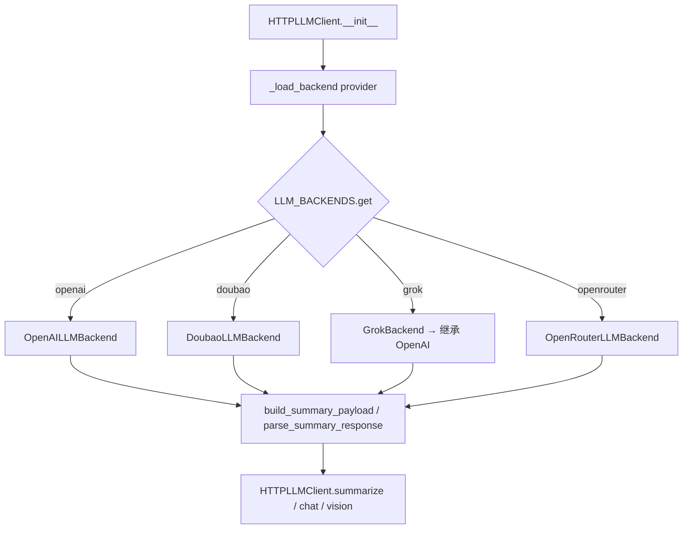
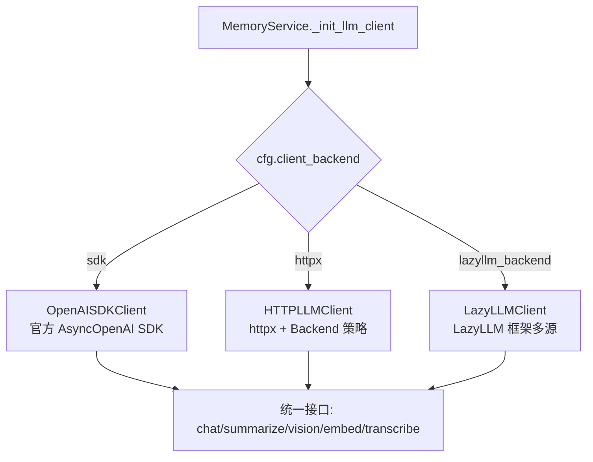

# PD-522.01 memU — 三层 Backend 策略模式与 Profile 驱动多 LLM 适配

> 文档编号：PD-522.01
> 来源：memU `src/memu/llm/backends/`, `src/memu/embedding/backends/`, `src/memu/app/settings.py`
> GitHub：https://github.com/NevaMind-AI/memU.git
> 问题域：PD-522 多 LLM 后端适配 Multi-LLM Backend Adapter
> 状态：可复用方案

---

## 第 1 章 问题与动机（≥ 30 行）

### 1.1 核心问题

在 Agent 系统中接入多个 LLM 提供商（OpenAI、Grok、Doubao、OpenRouter 等）时，面临三层异构性：

1. **协议层异构**：不同提供商的 API endpoint 路径、payload 格式、响应结构各不相同（如 Doubao 用 `/api/v3/chat/completions`，OpenAI 用 `/chat/completions`，OpenRouter 用 `/api/v1/chat/completions`）
2. **通信层异构**：有的场景需要轻量 httpx 直连，有的需要官方 SDK 的类型安全，有的需要 LazyLLM 框架统一多源调度
3. **工作流层异构**：不同工作流步骤（记忆提取、摘要生成、检索排序）对模型能力和成本的要求不同，需要按步骤分配不同的 LLM profile

如果不做抽象，每新增一个提供商就要修改所有调用点，每新增一个工作流步骤就要硬编码模型选择逻辑。

### 1.2 memU 的解法概述

memU 采用三层分离架构解决上述问题：

1. **Backend 策略层**：`LLMBackend` 基类定义 `build_*_payload()` / `parse_*_response()` 接口，每个提供商实现自己的 payload 构建和响应解析（`src/memu/llm/backends/base.py:6-30`）
2. **Client 通信层**：三种客户端实现（httpx / OpenAI SDK / LazyLLM），通过 `LLMConfig.client_backend` 字段选择，在 `MemoryService._init_llm_client()` 中按策略实例化（`src/memu/app/service.py:97-135`）
3. **Profile 配置层**：`LLMProfilesConfig` 允许定义多个命名 profile（如 `default`、`embedding`、`fast`），工作流步骤通过 `step_config.chat_llm_profile` 引用 profile 名称，运行时按需懒加载对应客户端（`src/memu/app/settings.py:263-296`）

### 1.3 设计思想

| 设计原则 | 具体实现 | 理由 | 替代方案 |
|----------|----------|------|----------|
| 策略模式分离协议差异 | `LLMBackend` 基类 + 4 个子类，每个子类只负责 payload/response 转换 | 新增提供商只需加一个子类，不改调用链 | 在 Client 中用 if-else 分支（违反 OCP） |
| 继承复用兼容协议 | `GrokBackend` 直接继承 `OpenAILLMBackend`，零代码复用 | Grok API 与 OpenAI 完全兼容，避免重复代码 | 独立实现（代码冗余） |
| 懒加载可选依赖 | `lazyllm` 和 `openai` SDK 在 `_init_llm_client()` 中按需 import | 不强制安装全部 SDK，降低依赖体积 | 顶层 import（安装时必须全部依赖） |
| Profile 与步骤解耦 | 工作流步骤只引用 profile 名称，不直接持有 LLM 配置 | 同一 profile 可被多个步骤复用，配置变更不影响步骤逻辑 | 每个步骤内联 LLM 配置（配置爆炸） |
| 字典注册表工厂 | `LLM_BACKENDS` / `EMBEDDING_BACKENDS` 字典映射 name → factory | O(1) 查找，新增只需加一行 | 类扫描/反射（过度工程） |

---

## 第 2 章 源码实现分析（核心章节）

### 2.1 架构概览

memU 的多 LLM 后端适配分为三个正交维度：

```
┌─────────────────────────────────────────────────────────────┐
│                    MemoryService                             │
│  ┌──────────────────────────────────────────────────────┐   │
│  │  LLMProfilesConfig                                    │   │
│  │  ┌──────────┐  ┌──────────┐  ┌──────────┐           │   │
│  │  │ "default" │  │"embedding"│  │  "fast"  │  ...      │   │
│  │  │ LLMConfig │  │ LLMConfig │  │ LLMConfig│           │   │
│  │  └────┬─────┘  └────┬─────┘  └────┬─────┘           │   │
│  └───────┼──────────────┼─────────────┼─────────────────┘   │
│          │              │             │                       │
│          ▼              ▼             ▼                       │
│  ┌─── client_backend 选择 ───────────────────────────┐      │
│  │  "sdk"  → OpenAISDKClient                          │      │
│  │  "httpx" → HTTPLLMClient ──→ LLMBackend 策略       │      │
│  │  "lazyllm_backend" → LazyLLMClient                 │      │
│  └────────────────────────────────────────────────────┘      │
│                         │                                     │
│                         ▼                                     │
│  ┌─── LLMClientWrapper（拦截器层）────────────────────┐      │
│  │  before / after / on_error 拦截器                   │      │
│  │  token 用量提取、延迟计量                           │      │
│  └────────────────────────────────────────────────────┘      │
└─────────────────────────────────────────────────────────────┘
```

### 2.2 核心实现

#### 2.2.1 LLM Backend 策略层



对应源码 `src/memu/llm/backends/base.py:6-30`：

```python
class LLMBackend:
    """Defines how to talk to a specific HTTP LLM provider."""

    name: str = "base"
    summary_endpoint: str = "/chat/completions"

    def build_summary_payload(
        self, *, text: str, system_prompt: str | None, chat_model: str, max_tokens: int | None
    ) -> dict[str, Any]:
        raise NotImplementedError

    def parse_summary_response(self, data: dict[str, Any]) -> str:
        raise NotImplementedError

    def build_vision_payload(
        self, *, prompt: str, base64_image: str, mime_type: str,
        system_prompt: str | None, chat_model: str, max_tokens: int | None,
    ) -> dict[str, Any]:
        raise NotImplementedError
```

注册表与工厂查找 `src/memu/llm/http_client.py:72-77`：

```python
LLM_BACKENDS: dict[str, Callable[[], LLMBackend]] = {
    OpenAILLMBackend.name: OpenAILLMBackend,
    DoubaoLLMBackend.name: DoubaoLLMBackend,
    GrokBackend.name: GrokBackend,
    OpenRouterLLMBackend.name: OpenRouterLLMBackend,
}
```

Grok 通过继承实现零代码复用 `src/memu/llm/backends/grok.py:6-11`：

```python
class GrokBackend(OpenAILLMBackend):
    """Backend for Grok (xAI) LLM API."""
    name = "grok"
    # Grok uses the same payload structure as OpenAI
```

#### 2.2.2 Client 通信层三选一



对应源码 `src/memu/app/service.py:97-135`：

```python
def _init_llm_client(self, config: LLMConfig | None = None) -> Any:
    cfg = config or self.llm_config
    backend = cfg.client_backend
    if backend == "sdk":
        from memu.llm.openai_sdk import OpenAISDKClient
        return OpenAISDKClient(
            base_url=cfg.base_url, api_key=cfg.api_key,
            chat_model=cfg.chat_model, embed_model=cfg.embed_model,
            embed_batch_size=cfg.embed_batch_size,
        )
    elif backend == "httpx":
        return HTTPLLMClient(
            base_url=cfg.base_url, api_key=cfg.api_key,
            chat_model=cfg.chat_model, provider=cfg.provider,
            endpoint_overrides=cfg.endpoint_overrides,
            embed_model=cfg.embed_model,
        )
    elif backend == "lazyllm_backend":
        from memu.llm.lazyllm_client import LazyLLMClient
        return LazyLLMClient(
            llm_source=cfg.lazyllm_source.llm_source or cfg.lazyllm_source.source,
            vlm_source=cfg.lazyllm_source.vlm_source or cfg.lazyllm_source.source,
            embed_source=cfg.lazyllm_source.embed_source or cfg.lazyllm_source.source,
            stt_source=cfg.lazyllm_source.stt_source or cfg.lazyllm_source.source,
            chat_model=cfg.chat_model, embed_model=cfg.embed_model,
            vlm_model=cfg.lazyllm_source.vlm_model,
            stt_model=cfg.lazyllm_source.stt_model,
        )
    else:
        raise ValueError(f"Unknown llm_client_backend '{cfg.client_backend}'")
```

### 2.3 实现细节

#### Profile 懒加载与缓存

`MemoryService` 维护 `_llm_clients` 字典缓存，每个 profile 的客户端只在首次使用时创建（`src/memu/app/service.py:137-151`）：

```python
def _get_llm_base_client(self, profile: str | None = None) -> Any:
    name = profile or "default"
    client = self._llm_clients.get(name)
    if client is not None:
        return client
    cfg: LLMConfig | None = self.llm_profiles.profiles.get(name)
    if cfg is None:
        raise KeyError(f"Unknown llm profile '{name}'")
    client = self._init_llm_client(cfg)
    self._llm_clients[name] = client
    return client
```

#### 工作流步骤到 Profile 的映射

工作流步骤通过 `step_config` 中的 `chat_llm_profile` / `embed_llm_profile` 字段引用 profile（`src/memu/app/service.py:202-218`）：

```python
@staticmethod
def _llm_profile_from_context(
    step_context: Mapping[str, Any] | None, task: Literal["chat", "embedding"] = "chat"
) -> str | None:
    if not isinstance(step_context, Mapping):
        return None
    step_cfg = step_context.get("step_config")
    if not isinstance(step_cfg, Mapping):
        return None
    if task == "chat":
        profile = step_cfg.get("chat_llm_profile", step_cfg.get("llm_profile"))
    elif task == "embedding":
        profile = step_cfg.get("embed_llm_profile", step_cfg.get("llm_profile"))
    else:
        raise ValueError(task)
    if isinstance(profile, str) and profile.strip():
        return profile.strip()
    return None
```

#### LLMConfig 的 provider 默认值自动切换

`LLMConfig` 使用 Pydantic `model_validator` 在 provider 为 `grok` 时自动替换默认的 base_url、api_key、chat_model（`src/memu/app/settings.py:128-138`）：

```python
@model_validator(mode="after")
def set_provider_defaults(self) -> "LLMConfig":
    if self.provider == "grok":
        if self.base_url == "https://api.openai.com/v1":
            self.base_url = "https://api.x.ai/v1"
        if self.api_key == "OPENAI_API_KEY":
            self.api_key = "XAI_API_KEY"
        if self.chat_model == "gpt-4o-mini":
            self.chat_model = "grok-2-latest"
    return self
```

#### LLMProfilesConfig 自动注入 default 和 embedding

`LLMProfilesConfig` 的 `ensure_default` 验证器确保始终存在 `default` 和 `embedding` 两个 profile（`src/memu/app/settings.py:269-288`）：

```python
@model_validator(mode="before")
@classmethod
def ensure_default(cls, data: Any) -> Any:
    if data is None:
        data = {}
    elif isinstance(data, dict):
        data = dict(data)
    else:
        return data
    if "default" not in data:
        data["default"] = LLMConfig()
    if "embedding" not in data:
        data["embedding"] = data["default"]
    return data
```

#### Embedding 双层 Backend

Embedding 层同样采用 Backend 策略模式，且 Doubao 后端额外支持多模态 embedding（文本 + 图片 + 视频），通过 `DoubaoMultimodalEmbeddingInput` 封装输入类型（`src/memu/embedding/backends/doubao.py:8-28`）。

`HTTPEmbeddingClient` 在调用多模态 embedding 时做类型检查，只有 Doubao 后端才支持（`src/memu/embedding/http_client.py:115-120`）：

```python
if not isinstance(self.backend, DoubaoEmbeddingBackend):
    raise TypeError(
        f"Multimodal embedding is only supported by 'doubao' provider, "
        f"but current provider is '{self.provider}'"
    )
```

---

## 第 3 章 迁移指南

### 3.1 迁移清单

**阶段 1：Backend 策略层（1 天）**
- [ ] 定义 `LLMBackend` 基类，包含 `build_payload()` / `parse_response()` 抽象方法
- [ ] 为每个目标提供商实现子类（OpenAI 兼容的可直接继承）
- [ ] 创建 `LLM_BACKENDS` 注册字典

**阶段 2：Client 通信层（1 天）**
- [ ] 实现 `HTTPLLMClient`，内部持有 Backend 实例
- [ ] 可选：实现 SDK 客户端（如需类型安全）
- [ ] 统一客户端接口：`chat()` / `embed()` / `vision()`

**阶段 3：Profile 配置层（0.5 天）**
- [ ] 定义 `LLMConfig` Pydantic 模型（provider / base_url / api_key / chat_model / client_backend）
- [ ] 定义 `LLMProfilesConfig` 支持多命名 profile
- [ ] 在 Service 层实现 profile → client 的懒加载缓存

**阶段 4：工作流集成（0.5 天）**
- [ ] 工作流步骤配置中添加 `llm_profile` 字段
- [ ] Service 层根据 step_context 解析 profile 名称并获取对应客户端

### 3.2 适配代码模板

以下是可直接复用的最小实现：

```python
from __future__ import annotations
from typing import Any, Protocol
from dataclasses import dataclass, field
from pydantic import BaseModel, Field, model_validator


# ── 1. Backend 策略基类 ──
class LLMBackend(Protocol):
    name: str
    endpoint: str

    def build_payload(self, *, text: str, model: str, **kwargs: Any) -> dict[str, Any]: ...
    def parse_response(self, data: dict[str, Any]) -> str: ...


class OpenAIBackend:
    name = "openai"
    endpoint = "/chat/completions"

    def build_payload(self, *, text: str, model: str, **kwargs: Any) -> dict[str, Any]:
        return {
            "model": model,
            "messages": [{"role": "user", "content": text}],
            "temperature": kwargs.get("temperature", 0.2),
        }

    def parse_response(self, data: dict[str, Any]) -> str:
        return data["choices"][0]["message"]["content"]


# ── 2. 注册表 ──
BACKENDS: dict[str, type] = {
    "openai": OpenAIBackend,
    # "doubao": DoubaoBackend,  # 新增只需加一行
}


# ── 3. Profile 配置 ──
class LLMConfig(BaseModel):
    provider: str = "openai"
    base_url: str = "https://api.openai.com/v1"
    api_key: str = ""
    model: str = "gpt-4o-mini"
    client_backend: str = "httpx"  # httpx | sdk


class ProfilesConfig(BaseModel):
    profiles: dict[str, LLMConfig] = Field(default_factory=lambda: {"default": LLMConfig()})

    @model_validator(mode="before")
    @classmethod
    def ensure_default(cls, data: Any) -> Any:
        if isinstance(data, dict) and "default" not in data:
            data["default"] = {}
        return data


# ── 4. 懒加载客户端管理 ──
@dataclass
class ClientManager:
    profiles: ProfilesConfig
    _clients: dict[str, Any] = field(default_factory=dict)

    def get_client(self, profile: str = "default") -> Any:
        if profile in self._clients:
            return self._clients[profile]
        cfg = self.profiles.profiles.get(profile)
        if cfg is None:
            raise KeyError(f"Unknown profile '{profile}'")
        backend = BACKENDS.get(cfg.provider)
        if backend is None:
            raise ValueError(f"Unsupported provider '{cfg.provider}'")
        # 根据 client_backend 选择通信方式
        client = self._create_client(cfg, backend())
        self._clients[profile] = client
        return client

    def _create_client(self, cfg: LLMConfig, backend: Any) -> Any:
        if cfg.client_backend == "httpx":
            import httpx
            return {"backend": backend, "base_url": cfg.base_url, "api_key": cfg.api_key}
        elif cfg.client_backend == "sdk":
            from openai import AsyncOpenAI
            return AsyncOpenAI(api_key=cfg.api_key, base_url=cfg.base_url)
        raise ValueError(f"Unknown client_backend '{cfg.client_backend}'")
```

### 3.3 适用场景

| 场景 | 适用度 | 说明 |
|------|--------|------|
| 多提供商 LLM 接入 | ⭐⭐⭐ | 核心场景，Backend 策略模式直接适用 |
| 按工作流步骤分配模型 | ⭐⭐⭐ | Profile 配置层完美匹配 |
| 需要同时支持 SDK 和 HTTP 调用 | ⭐⭐⭐ | Client 通信层三选一设计 |
| 单一提供商项目 | ⭐ | 过度设计，直接用 SDK 即可 |
| 需要流式响应 | ⭐⭐ | 当前 Backend 接口未覆盖 streaming，需扩展 |

---

## 第 4 章 测试用例

```python
import pytest
from typing import Any
from unittest.mock import AsyncMock, patch, MagicMock


# ── Backend 策略层测试 ──
class TestLLMBackendStrategy:
    """测试 LLM Backend 策略模式的 payload 构建和响应解析。"""

    def test_openai_build_summary_payload(self):
        from memu.llm.backends.openai import OpenAILLMBackend
        backend = OpenAILLMBackend()
        payload = backend.build_summary_payload(
            text="Hello world", system_prompt="Summarize.", chat_model="gpt-4o-mini", max_tokens=100
        )
        assert payload["model"] == "gpt-4o-mini"
        assert payload["messages"][0]["role"] == "system"
        assert payload["messages"][1]["content"] == "Hello world"
        assert payload["max_tokens"] == 100

    def test_doubao_different_endpoint(self):
        from memu.llm.backends.doubao import DoubaoLLMBackend
        backend = DoubaoLLMBackend()
        assert backend.summary_endpoint == "/api/v3/chat/completions"
        assert backend.name == "doubao"

    def test_grok_inherits_openai(self):
        from memu.llm.backends.grok import GrokBackend
        from memu.llm.backends.openai import OpenAILLMBackend
        backend = GrokBackend()
        assert isinstance(backend, OpenAILLMBackend)
        assert backend.name == "grok"

    def test_openai_parse_summary_response(self):
        from memu.llm.backends.openai import OpenAILLMBackend
        backend = OpenAILLMBackend()
        data = {"choices": [{"message": {"content": "Summary text"}}]}
        assert backend.parse_summary_response(data) == "Summary text"

    def test_backend_registry_completeness(self):
        from memu.llm.http_client import LLM_BACKENDS
        assert set(LLM_BACKENDS.keys()) == {"openai", "doubao", "grok", "openrouter"}


# ── Profile 配置层测试 ──
class TestLLMProfilesConfig:
    """测试 LLMProfilesConfig 的自动默认值注入。"""

    def test_empty_config_has_default_and_embedding(self):
        from memu.app.settings import LLMProfilesConfig
        config = LLMProfilesConfig.model_validate(None)
        assert "default" in config.profiles
        assert "embedding" in config.profiles

    def test_custom_profile_preserved(self):
        from memu.app.settings import LLMProfilesConfig, LLMConfig
        config = LLMProfilesConfig.model_validate({
            "fast": {"provider": "grok", "chat_model": "grok-2-latest"}
        })
        assert "fast" in config.profiles
        assert "default" in config.profiles
        assert config.profiles["fast"].provider == "grok"

    def test_grok_provider_auto_defaults(self):
        from memu.app.settings import LLMConfig
        cfg = LLMConfig(provider="grok")
        assert cfg.base_url == "https://api.x.ai/v1"
        assert cfg.api_key == "XAI_API_KEY"
        assert cfg.chat_model == "grok-2-latest"


# ── Client 通信层测试 ──
class TestClientBackendSelection:
    """测试 client_backend 三选一逻辑。"""

    def test_unknown_backend_raises(self):
        from memu.app.settings import LLMConfig
        cfg = LLMConfig(client_backend="unknown")
        from memu.app.service import MemoryService
        svc = MemoryService.__new__(MemoryService)
        with pytest.raises(ValueError, match="Unknown llm_client_backend"):
            svc._init_llm_client(cfg)

    def test_unsupported_provider_raises(self):
        from memu.llm.http_client import HTTPLLMClient
        with pytest.raises(ValueError, match="Unsupported LLM provider"):
            HTTPLLMClient(
                base_url="http://localhost", api_key="test",
                chat_model="test", provider="nonexistent"
            )


# ── Embedding Backend 测试 ──
class TestEmbeddingBackend:
    """测试 Embedding Backend 策略。"""

    def test_openai_embedding_payload(self):
        from memu.embedding.backends.openai import OpenAIEmbeddingBackend
        backend = OpenAIEmbeddingBackend()
        payload = backend.build_embedding_payload(inputs=["hello"], embed_model="text-embedding-3-small")
        assert payload["model"] == "text-embedding-3-small"
        assert payload["input"] == ["hello"]

    def test_doubao_multimodal_input(self):
        from memu.embedding.backends.doubao import DoubaoMultimodalEmbeddingInput
        inp = DoubaoMultimodalEmbeddingInput(input_type="image_url", content="https://example.com/img.png")
        d = inp.to_dict()
        assert d["type"] == "image_url"
        assert "url" in d["image_url"]
```

---

## 第 5 章 跨域关联

| 关联域 | 关系类型 | 说明 |
|--------|----------|------|
| PD-11 可观测性 | 协同 | `LLMClientWrapper` 拦截器层提供 before/after/on_error 钩子，可注入 token 计量、延迟追踪等可观测性逻辑，与 Backend 适配层正交 |
| PD-10 中间件管道 | 协同 | 工作流步骤通过 `step_config` 引用 LLM profile，Pipeline 编排决定哪个步骤用哪个 profile，两者通过 `step_context` 传递配置 |
| PD-06 记忆持久化 | 依赖 | 记忆的存储和检索依赖 Embedding 后端生成向量，Embedding Backend 的选择直接影响记忆系统的向量质量和成本 |
| PD-01 上下文管理 | 协同 | 不同 profile 可配置不同 `max_tokens`，摘要步骤用小模型压缩上下文，推理步骤用大模型深度分析 |
| PD-04 工具系统 | 协同 | LazyLLM 客户端支持 VLM（视觉）和 STT（语音转文字）等多模态工具，扩展了工具系统的能力边界 |

---

## 第 6 章 来源文件索引

| 文件 | 行范围 | 关键实现 |
|------|--------|----------|
| `src/memu/llm/backends/base.py` | L6-L30 | LLMBackend 基类，定义 build/parse 接口 |
| `src/memu/llm/backends/openai.py` | L8-L64 | OpenAI 兼容 Backend 实现 |
| `src/memu/llm/backends/doubao.py` | L8-L69 | Doubao Backend，自定义 endpoint `/api/v3/` |
| `src/memu/llm/backends/grok.py` | L6-L11 | Grok Backend，继承 OpenAI 零代码复用 |
| `src/memu/llm/backends/openrouter.py` | L8-L70 | OpenRouter Backend，endpoint `/api/v1/` |
| `src/memu/llm/http_client.py` | L72-L301 | HTTPLLMClient + LLM_BACKENDS 注册表 + 内联 Embedding Backend |
| `src/memu/llm/openai_sdk.py` | L20-L219 | OpenAI SDK 客户端，AsyncOpenAI 封装 |
| `src/memu/llm/lazyllm_client.py` | L9-L159 | LazyLLM 客户端，多源多模态统一调度 |
| `src/memu/embedding/backends/base.py` | L6-L16 | EmbeddingBackend 基类 |
| `src/memu/embedding/backends/openai.py` | L8-L18 | OpenAI Embedding Backend |
| `src/memu/embedding/backends/doubao.py` | L31-L72 | Doubao Embedding Backend + 多模态支持 |
| `src/memu/embedding/http_client.py` | L21-L149 | HTTPEmbeddingClient + EMBEDDING_BACKENDS 注册表 |
| `src/memu/embedding/openai_sdk.py` | L9-L43 | OpenAI Embedding SDK 客户端 |
| `src/memu/app/settings.py` | L102-L138 | LLMConfig + provider 默认值自动切换 |
| `src/memu/app/settings.py` | L263-L296 | LLMProfilesConfig + ensure_default 验证器 |
| `src/memu/app/service.py` | L97-L151 | _init_llm_client 三选一 + 懒加载缓存 |
| `src/memu/app/service.py` | L202-L226 | 工作流步骤到 profile 的映射逻辑 |
| `src/memu/llm/wrapper.py` | L226-L504 | LLMClientWrapper 拦截器代理层 |

---

## 第 7 章 横向对比维度

```json comparison_data
{
  "project": "memU",
  "dimensions": {
    "后端抽象": "LLMBackend 基类 + 4 子类策略模式，字典注册表工厂查找",
    "通信层": "httpx / OpenAI SDK / LazyLLM 三种客户端按 config 选择",
    "Profile 机制": "LLMProfilesConfig 多命名 profile，工作流步骤按名引用",
    "Embedding 适配": "独立 EmbeddingBackend 层 + Doubao 多模态 embedding 扩展",
    "懒加载策略": "客户端按 profile 首次使用时创建并缓存，可选依赖延迟 import",
    "协议兼容复用": "GrokBackend 继承 OpenAILLMBackend 零代码复用兼容协议"
  }
}
```

### 域元数据补充

```json domain_metadata
{
  "solution_summary": "memU 用 LLMBackend 策略基类 + 字典注册表统一 4 种提供商协议差异，三种 Client 通信层按 config 选择，LLMProfilesConfig 支持按工作流步骤分配不同模型 profile 并懒加载缓存",
  "description": "多维度后端适配需同时处理协议差异、通信方式选择和工作流级模型分配",
  "sub_problems": [
    "多模态 Embedding 的提供商特有能力暴露（如 Doubao 视频/图片 embedding）",
    "provider 默认值自动推导（切换 provider 时 base_url/api_key/model 联动变更）"
  ],
  "best_practices": [
    "兼容协议的提供商通过继承复用零代码（如 Grok 继承 OpenAI Backend）",
    "LLMProfilesConfig 用 model_validator 自动注入 default 和 embedding 两个必需 profile",
    "HTTPLLMClient 内联轻量 Embedding Backend 避免跨模块循环依赖"
  ]
}
```
