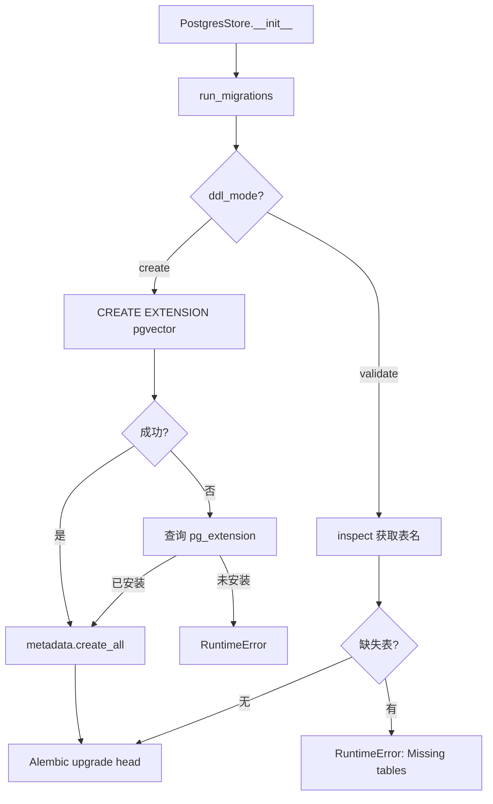
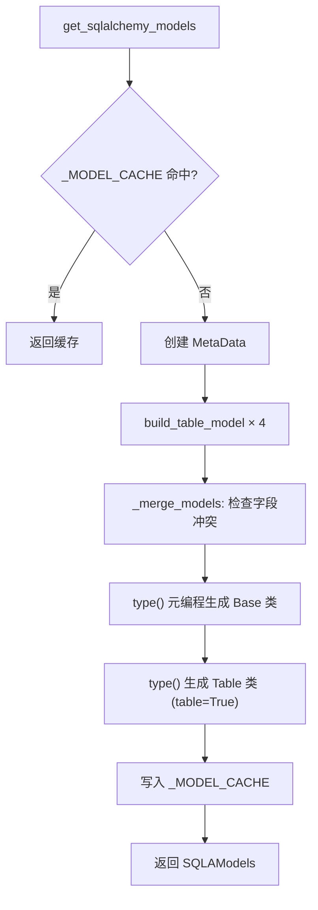

# PD-523.01 memU — 双模 DDL 与 scope_model 动态迁移

> 文档编号：PD-523.01
> 来源：memU `src/memu/database/postgres/migration.py`
> GitHub：https://github.com/NevaMind-AI/memU.git
> 问题域：PD-523 数据库迁移 Database Migration
> 状态：可复用方案

---

## 第 1 章 问题与动机

### 1.1 核心问题

多后端数据库系统面临的迁移挑战：

1. **开发与生产环境的 DDL 策略差异** — 开发环境需要自动建表（快速迭代），生产环境只能验证 schema 完整性（防止误操作）
2. **动态表结构** — 当表结构需要根据用户作用域（scope）动态生成时，传统的静态迁移脚本无法覆盖所有变体
3. **多后端 DDL 适配** — PostgreSQL 需要 Alembic 增量迁移 + pgvector 扩展管理，SQLite 只需 `metadata.create_all` 自动建表，两者的迁移策略完全不同
4. **向量扩展依赖** — pgvector 扩展需要 superuser 权限安装，应用层必须检测并优雅处理扩展缺失

### 1.2 memU 的解法概述

memU 采用三层迁移架构：

1. **DDLMode 双模切换**（`migration.py:20`）— `Literal["create", "validate"]` 类型，create 模式自动建表 + 启用扩展，validate 模式仅校验 schema 完整性
2. **scope_model 动态表生成**（`postgres/models.py:111-154`）— 通过 `build_table_model()` 工厂函数，将用户 scope 字段动态注入到 ORM 模型中，运行时生成带作用域的表结构
3. **Alembic 感知 scope**（`migrations/env.py:16-18`）— Alembic 的 `env.py` 从 config.attributes 读取 scope_model，确保迁移脚本与动态表结构一致
4. **SQLite 零迁移策略**（`sqlite/sqlite.py:126-131`）— SQLite 后端直接调用 `metadata.create_all`，跳过 Alembic，适合嵌入式场景
5. **pgvector 扩展自动检测**（`migration.py:44-60`）— 先尝试 CREATE EXTENSION，失败后查询 pg_extension 确认是否已安装，给出明确错误提示

### 1.3 设计思想

| 设计原则 | 具体实现 | 理由 | 替代方案 |
|----------|----------|------|----------|
| 环境感知 DDL | `DDLMode = Literal["create", "validate"]` 双模 | 开发快速迭代 vs 生产安全校验 | 统一用 Alembic（开发体验差） |
| 动态 ORM 工厂 | `build_table_model()` + `type()` 元编程 | scope 字段运行时注入，一套代码支持多租户 | 手写每种 scope 的模型（不可扩展） |
| 模型缓存 | `_MODEL_CACHE: dict[type, SQLAModels]` | 同一 scope 只构建一次，避免重复元编程开销 | 每次调用重新构建（性能浪费） |
| 后端隔离 | Postgres 用 Alembic，SQLite 用 create_all | 各后端用最适合的迁移工具 | 统一用 Alembic（SQLite 不需要增量迁移） |
| 扩展检测 | try CREATE → except 查 pg_extension | 兼容有无 superuser 权限的环境 | 只 CREATE（无权限直接崩溃） |

---

## 第 2 章 源码实现分析

### 2.1 架构概览

memU 的数据库迁移系统分为三层：领域模型层、ORM 工厂层、迁移执行层。

```
┌─────────────────────────────────────────────────────────┐
│                    Database Protocol                     │
│              (interfaces.py — 后端无关契约)               │
├──────────────────────┬──────────────────────────────────┤
│   PostgresStore      │         SQLiteStore              │
│  ┌────────────────┐  │  ┌────────────────────────────┐  │
│  │ run_migrations │  │  │ _create_tables             │  │
│  │  ├─ DDL create │  │  │  ├─ SQLModel.metadata      │  │
│  │  │  ├─ pgvector│  │  │  │   .create_all()         │  │
│  │  │  └─ create_ │  │  │  └─ Base.metadata          │  │
│  │  │     all()   │  │  │      .create_all()         │  │
│  │  ├─ DDL valid. │  │  └────────────────────────────┘  │
│  │  │  └─ inspect │  │                                  │
│  │  └─ Alembic    │  │                                  │
│  │     upgrade    │  │                                  │
│  └────────────────┘  │                                  │
├──────────────────────┴──────────────────────────────────┤
│              scope_model 动态 ORM 工厂                    │
│  build_table_model() / build_sqlite_table_model()        │
│  _merge_models() + type() 元编程 + _MODEL_CACHE          │
├─────────────────────────────────────────────────────────┤
│              领域模型 (models.py)                         │
│  BaseRecord → Resource / MemoryItem / MemoryCategory     │
│  merge_scope_model() — Pydantic 层 scope 合并            │
└─────────────────────────────────────────────────────────┘
```

### 2.2 核心实现

#### 2.2.1 DDLMode 双模迁移入口



对应源码 `src/memu/database/postgres/migration.py:31-79`：

```python
DDLMode = Literal["create", "validate"]

def run_migrations(*, dsn: str, scope_model: type[Any], ddl_mode: DDLMode = "create") -> None:
    metadata = get_metadata(scope_model)
    engine = create_engine(dsn)

    if ddl_mode == "create":
        with engine.connect() as conn:
            try:
                conn.execute(text("CREATE EXTENSION IF NOT EXISTS vector"))
                conn.commit()
                logger.info("pgvector extension enabled")
            except Exception as e:
                result = conn.execute(
                    text("SELECT 1 FROM pg_extension WHERE extname = 'vector'")
                ).fetchone()
                if result:
                    logger.info("pgvector extension already installed")
                else:
                    msg = (
                        "Failed to create pgvector extension. "
                        "Please run 'CREATE EXTENSION vector;' as a superuser first."
                    )
                    raise RuntimeError(msg) from e

        metadata.create_all(engine)
        logger.info("Database tables created/verified")
    elif ddl_mode == "validate":
        inspector = inspect(engine)
        existing_tables = set(inspector.get_table_names())
        expected_tables = set(metadata.tables.keys())
        missing_tables = expected_tables - existing_tables
        if missing_tables:
            msg = f"Database schema validation failed. Missing tables: {sorted(missing_tables)}"
            raise RuntimeError(msg)
        logger.info("Database schema validated successfully")

    cfg = make_alembic_config(dsn=dsn, scope_model=scope_model)
    command.upgrade(cfg, "head")
```

#### 2.2.2 scope_model 动态 ORM 工厂



对应源码 `src/memu/database/postgres/models.py:111-154`：

```python
def build_table_model(
    user_model: type[BaseModel],
    core_model: type[SQLModel],
    *,
    tablename: str,
    metadata: MetaData | None = None,
    extra_table_args: tuple[Any, ...] | None = None,
    unique_with_scope: list[str] | None = None,
) -> type[SQLModel]:
    overlap = set(user_model.model_fields) & set(core_model.model_fields)
    if overlap:
        msg = f"Scope fields conflict with core model fields: {sorted(overlap)}"
        raise TypeError(msg)

    scope_fields = list(user_model.model_fields.keys())
    base_table_args, table_kwargs = _normalize_table_args(
        getattr(core_model, "__table_args__", None)
    )
    table_args = list(base_table_args)
    if scope_fields:
        table_args.append(Index(f"ix_{tablename}__scope", *scope_fields))
    if unique_with_scope:
        unique_cols = [*unique_with_scope, *scope_fields]
        table_args.append(Index(f"ix_{tablename}__unique_scoped", *unique_cols, unique=True))

    base_attrs: dict[str, Any] = {
        "__module__": core_model.__module__,
        "__tablename__": tablename,
    }
    if metadata is not None:
        base_attrs["metadata"] = metadata

    base = _merge_models(user_model, core_model, name_suffix="Base", base_attrs=base_attrs)
    table_attrs: dict[str, Any] = {"__module__": core_model.__module__}
    return type(
        f"{user_model.__name__}{core_model.__name__}Table",
        (base,),
        table_attrs,
        table=True,
    )
```

### 2.3 实现细节

**三层模型继承链：**

memU 的模型体系分为三层，每层职责不同：

1. **领域模型层**（`database/models.py`）— 纯 Pydantic BaseModel，定义 `Resource`、`MemoryItem` 等领域实体，后端无关
2. **ORM Mixin 层**（`postgres/models.py`）— `BaseModelMixin(SQLModel)` 添加 `id`/`created_at`/`updated_at` 字段，`ResourceModel(BaseModelMixin, Resource)` 添加 SA Column 定义
3. **动态 Table 层** — `build_table_model()` 通过 `type()` 元编程，将 user_model（scope）+ core_model（ORM Mixin）合并为最终的 SQLModel Table 类

**Alembic env.py 的 scope 感知**（`migrations/env.py:16-18`）：

```python
def get_target_metadata() -> MetaData | None:
    scope_model = config.attributes.get("scope_model")
    return get_metadata(scope_model)
```

Alembic 的 target_metadata 不是静态的，而是从 `config.attributes["scope_model"]` 动态获取。这意味着 `alembic revision --autogenerate` 生成的迁移脚本会包含 scope 字段对应的列。

**SQLite 的零迁移策略**（`sqlite/sqlite.py:126-131`）：

SQLite 后端不使用 Alembic，直接双重 `create_all`：
- `SQLModel.metadata.create_all()` — 创建全局 SQLModel 注册的表
- `self._sqla_models.Base.metadata.create_all()` — 创建 scope 动态生成的表

**向量类型的后端适配**：

- PostgreSQL：直接使用 `pgvector.sqlalchemy.VECTOR` 类型（`postgres/models.py:51`）
- SQLite：用 `embedding_json: str` + JSON 序列化模拟（`sqlite/models.py:55-75`），通过 `@property` 提供透明的 `embedding` 访问接口

---

## 第 3 章 迁移指南

### 3.1 迁移清单

**阶段 1：领域模型定义**
- [ ] 定义后端无关的 Pydantic 领域模型（类似 `models.py` 的 `BaseRecord`）
- [ ] 定义 scope_model（用户作用域字段，如 `user_id`、`tenant_id`）

**阶段 2：ORM 工厂实现**
- [ ] 实现 `build_table_model()` 工厂函数，支持 scope 字段动态注入
- [ ] 实现 `_merge_models()` 辅助函数，含字段冲突检测
- [ ] 添加 `_MODEL_CACHE` 缓存，避免重复构建

**阶段 3：迁移执行层**
- [ ] 实现 `DDLMode` 双模切换（create/validate）
- [ ] 配置 Alembic env.py 从 config.attributes 读取 scope_model
- [ ] 实现 pgvector 扩展检测与自动启用逻辑
- [ ] SQLite 后端实现 `_create_tables()` 直接调用 `create_all`

**阶段 4：集成验证**
- [ ] 验证 create 模式下表自动创建
- [ ] 验证 validate 模式下缺失表报错
- [ ] 验证不同 scope_model 生成不同表结构
- [ ] 验证 Alembic autogenerate 能感知 scope 字段

### 3.2 适配代码模板

```python
"""可复用的双模 DDL 迁移模板"""
from __future__ import annotations

import logging
from typing import Any, Literal

from pydantic import BaseModel
from sqlalchemy import MetaData, create_engine, inspect, text
from sqlmodel import Column, Field, Index, SQLModel, String

logger = logging.getLogger(__name__)

DDLMode = Literal["create", "validate"]


# --- Step 1: 定义 scope model ---
class TenantScope(BaseModel):
    """用户作用域：所有表自动添加 tenant_id 列"""
    tenant_id: str


# --- Step 2: 动态 ORM 工厂 ---
_TABLE_CACHE: dict[type, dict[str, type[SQLModel]]] = {}


def build_scoped_table(
    scope: type[BaseModel],
    core_model: type[SQLModel],
    *,
    tablename: str,
    metadata: MetaData,
) -> type[SQLModel]:
    """将 scope 字段动态注入到 ORM 模型中"""
    overlap = set(scope.model_fields) & set(core_model.model_fields)
    if overlap:
        raise TypeError(f"Scope fields conflict: {sorted(overlap)}")

    scope_fields = list(scope.model_fields.keys())
    table_args = []
    if scope_fields:
        table_args.append(Index(f"ix_{tablename}__scope", *scope_fields))

    base = type(
        f"{scope.__name__}{core_model.__name__}Base",
        (scope, core_model),
        {"__module__": core_model.__module__, "__tablename__": tablename, "metadata": metadata},
    )
    return type(
        f"{scope.__name__}{core_model.__name__}Table",
        (base,),
        {"__module__": core_model.__module__, "__table_args__": tuple(table_args)},
        table=True,
    )


# --- Step 3: 双模迁移执行 ---
def run_ddl(
    *,
    dsn: str,
    metadata: MetaData,
    ddl_mode: DDLMode = "create",
    extensions: list[str] | None = None,
) -> None:
    """双模 DDL 执行器"""
    engine = create_engine(dsn)

    if ddl_mode == "create":
        # 自动启用 PG 扩展
        if extensions:
            with engine.connect() as conn:
                for ext in extensions:
                    try:
                        conn.execute(text(f"CREATE EXTENSION IF NOT EXISTS {ext}"))
                        conn.commit()
                    except Exception:
                        logger.warning("Extension %s not available, check superuser privileges", ext)
        metadata.create_all(engine)
        logger.info("Tables created/verified in CREATE mode")

    elif ddl_mode == "validate":
        inspector = inspect(engine)
        existing = set(inspector.get_table_names())
        expected = set(metadata.tables.keys())
        missing = expected - existing
        if missing:
            raise RuntimeError(f"Schema validation failed. Missing: {sorted(missing)}")
        logger.info("Schema validated in VALIDATE mode")
```

### 3.3 适用场景

| 场景 | 适用度 | 说明 |
|------|--------|------|
| 多租户 SaaS 应用 | ⭐⭐⭐ | scope_model 天然支持 tenant_id 注入 |
| 开发/生产双环境部署 | ⭐⭐⭐ | DDLMode 双模切换完美匹配 |
| 多后端存储（PG + SQLite） | ⭐⭐⭐ | 各后端独立迁移策略，互不干扰 |
| 需要 pgvector 的 AI 应用 | ⭐⭐⭐ | 扩展检测 + 自动启用已内置 |
| 单后端简单应用 | ⭐⭐ | 架构偏重，单后端不需要工厂模式 |
| 频繁 schema 变更的项目 | ⭐⭐ | Alembic 增量迁移支持，但 scope 动态表增加复杂度 |

---

## 第 4 章 测试用例

```python
"""基于 memU 真实函数签名的测试用例"""
import pytest
from unittest.mock import MagicMock, patch
from typing import Any, Literal
from pydantic import BaseModel
from sqlalchemy import MetaData


# --- 测试 scope_model 动态表生成 ---

class MockScope(BaseModel):
    user_id: str = "default"


class TestBuildTableModel:
    """测试 build_table_model 工厂函数"""

    def test_scope_fields_injected(self):
        """scope 字段应出现在生成的表模型中"""
        from memu.database.postgres.models import build_table_model, ResourceModel
        metadata = MetaData()
        model = build_table_model(MockScope, ResourceModel, tablename="test_resources", metadata=metadata)
        assert "user_id" in model.model_fields
        assert model.__tablename__ == "test_resources"

    def test_scope_index_created(self):
        """scope 字段应自动创建索引"""
        from memu.database.postgres.models import build_table_model, ResourceModel
        metadata = MetaData()
        model = build_table_model(MockScope, ResourceModel, tablename="test_res", metadata=metadata)
        table = model.__table__
        index_names = {idx.name for idx in table.indexes}
        assert "ix_test_res__scope" in index_names

    def test_field_conflict_raises(self):
        """scope 字段与核心模型字段冲突时应抛出 TypeError"""
        from memu.database.postgres.models import build_table_model, ResourceModel

        class BadScope(BaseModel):
            url: str = ""  # 与 ResourceModel.url 冲突

        with pytest.raises(TypeError, match="Scope fields conflict"):
            build_table_model(BadScope, ResourceModel, tablename="bad", metadata=MetaData())

    def test_model_cache_hit(self):
        """相同 scope 应命中缓存"""
        from memu.database.postgres.schema import get_sqlalchemy_models, _MODEL_CACHE
        models1 = get_sqlalchemy_models(scope_model=MockScope)
        models2 = get_sqlalchemy_models(scope_model=MockScope)
        assert models1 is models2


# --- 测试 DDLMode 双模迁移 ---

class TestRunMigrations:
    """测试 run_migrations 双模行为"""

    @patch("memu.database.postgres.migration.command")
    @patch("memu.database.postgres.migration.create_engine")
    def test_create_mode_calls_create_all(self, mock_engine, mock_command):
        """create 模式应调用 metadata.create_all"""
        from memu.database.postgres.migration import run_migrations
        mock_conn = MagicMock()
        mock_engine.return_value.connect.return_value.__enter__ = lambda s: mock_conn
        mock_engine.return_value.connect.return_value.__exit__ = MagicMock(return_value=False)

        with patch("memu.database.postgres.migration.get_metadata") as mock_meta:
            mock_metadata = MagicMock()
            mock_meta.return_value = mock_metadata
            run_migrations(dsn="postgresql://test", scope_model=MockScope, ddl_mode="create")
            mock_metadata.create_all.assert_called_once()

    @patch("memu.database.postgres.migration.command")
    @patch("memu.database.postgres.migration.create_engine")
    @patch("memu.database.postgres.migration.inspect")
    def test_validate_mode_missing_tables_raises(self, mock_inspect, mock_engine, mock_command):
        """validate 模式下缺失表应抛出 RuntimeError"""
        from memu.database.postgres.migration import run_migrations
        mock_inspect.return_value.get_table_names.return_value = []

        with patch("memu.database.postgres.migration.get_metadata") as mock_meta:
            mock_metadata = MagicMock()
            mock_metadata.tables = {"resources": MagicMock(), "memory_items": MagicMock()}
            mock_meta.return_value = mock_metadata

            with pytest.raises(RuntimeError, match="Missing tables"):
                run_migrations(dsn="postgresql://test", scope_model=MockScope, ddl_mode="validate")

    @patch("memu.database.postgres.migration.command")
    @patch("memu.database.postgres.migration.create_engine")
    @patch("memu.database.postgres.migration.inspect")
    def test_validate_mode_all_present_passes(self, mock_inspect, mock_engine, mock_command):
        """validate 模式下所有表存在应通过"""
        from memu.database.postgres.migration import run_migrations
        mock_inspect.return_value.get_table_names.return_value = ["resources", "memory_items"]

        with patch("memu.database.postgres.migration.get_metadata") as mock_meta:
            mock_metadata = MagicMock()
            mock_metadata.tables = {"resources": MagicMock(), "memory_items": MagicMock()}
            mock_meta.return_value = mock_metadata
            # Should not raise
            run_migrations(dsn="postgresql://test", scope_model=MockScope, ddl_mode="validate")
```

---

## 第 5 章 跨域关联

| 关联域 | 关系类型 | 说明 |
|--------|----------|------|
| PD-06 记忆持久化 | 强依赖 | 迁移系统为记忆存储层提供表结构基础，scope_model 决定了记忆数据的隔离粒度 |
| PD-474 可插拔存储后端 | 协同 | Database Protocol 定义后端无关契约，迁移系统为每个后端提供独立的 DDL 策略 |
| PD-475 记忆去重强化 | 协同 | `content_hash` 字段存储在 MemoryItem.extra 中，依赖迁移系统创建的 JSONB/JSON 列 |
| PD-08 搜索与检索 | 依赖 | pgvector 扩展的自动启用是向量检索的前提，VECTOR 列类型由迁移系统创建 |

---

## 第 6 章 来源文件索引

| 文件 | 行范围 | 关键实现 |
|------|--------|----------|
| `src/memu/database/postgres/migration.py` | L1-L82 | DDLMode 双模迁移入口、pgvector 扩展检测、Alembic 配置 |
| `src/memu/database/postgres/schema.py` | L44-L110 | SQLAModels 容器、get_sqlalchemy_models 工厂、_MODEL_CACHE |
| `src/memu/database/postgres/models.py` | L92-L154 | _merge_models 元编程、build_table_model 工厂、scope 索引注入 |
| `src/memu/database/postgres/migrations/env.py` | L16-L55 | Alembic scope 感知、offline/online 双模式迁移 |
| `src/memu/database/sqlite/schema.py` | L35-L106 | SQLite 版 ORM 工厂、get_sqlite_sqlalchemy_models |
| `src/memu/database/sqlite/models.py` | L48-L227 | SQLite 模型定义、embedding JSON 序列化、build_sqlite_table_model |
| `src/memu/database/sqlite/sqlite.py` | L126-L131 | SQLite 零迁移策略、双重 create_all |
| `src/memu/database/models.py` | L35-L148 | 领域模型基类、merge_scope_model、build_scoped_models |
| `src/memu/database/interfaces.py` | L12-L26 | Database Protocol 后端无关契约 |
| `src/memu/database/postgres/postgres.py` | L33-L57 | PostgresStore 初始化、run_migrations 调用点 |

---

## 第 7 章 横向对比维度

```json comparison_data
{
  "project": "memU",
  "dimensions": {
    "DDL 策略": "Literal 双模：create 自动建表 + validate 仅校验",
    "迁移框架": "Alembic + scope_model 动态 target_metadata",
    "多后端适配": "Postgres 用 Alembic 增量迁移，SQLite 用 create_all 零迁移",
    "动态表结构": "build_table_model 工厂 + type() 元编程 + scope 字段注入",
    "扩展管理": "pgvector CREATE EXTENSION + pg_extension 回退检测",
    "模型缓存": "_MODEL_CACHE 按 scope_model 类型缓存，避免重复构建"
  }
}
```

### 域元数据补充

```json domain_metadata
{
  "solution_summary": "memU 用 DDLMode 双模切换（create/validate）+ build_table_model 工厂元编程实现 scope 感知的动态表迁移，Postgres 走 Alembic 增量迁移，SQLite 走 create_all 零迁移",
  "description": "运行时动态生成带用户作用域的 ORM 表结构并适配不同后端的迁移策略",
  "sub_problems": [
    "scope 字段与核心模型字段冲突检测",
    "动态生成的 ORM 模型缓存与失效",
    "向量扩展权限不足时的优雅降级"
  ],
  "best_practices": [
    "用 type() 元编程而非 create_model 保留 SQLModel table 行为",
    "Alembic env.py 从 config.attributes 动态获取 target_metadata",
    "SQLite 后端双重 create_all 覆盖全局和 scope 动态表"
  ]
}
```
