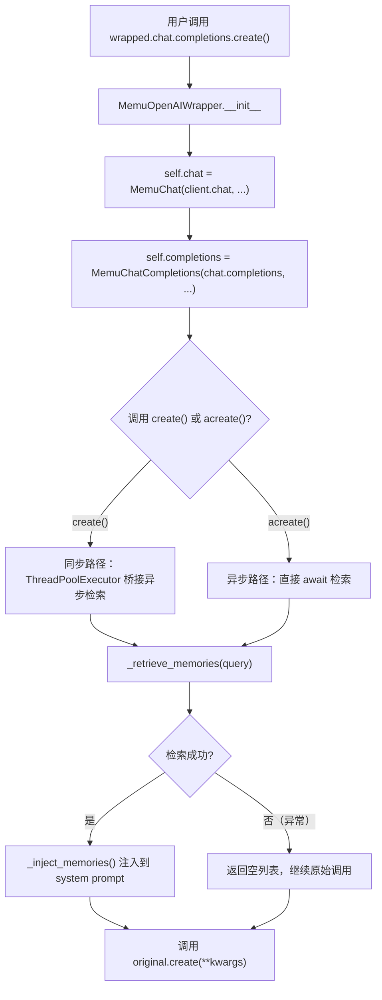
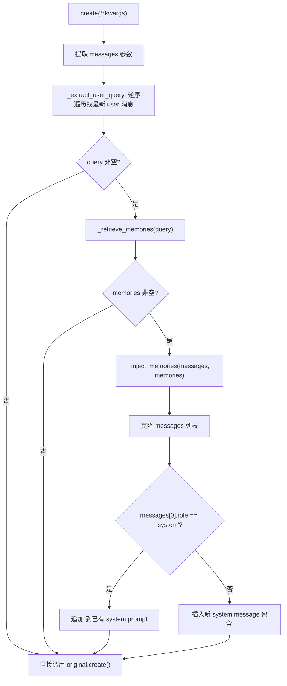

# PD-524.01 memU — MemuOpenAIWrapper 三层代理与记忆自动注入

> 文档编号：PD-524.01
> 来源：memU `src/memu/client/openai_wrapper.py`
> GitHub：https://github.com/NevaMind-AI/memU.git
> 问题域：PD-524 SDK 客户端包装 SDK Client Wrapping
> 状态：可复用方案

---

## 第 1 章 问题与动机（≥ 30 行）

### 1.1 核心问题

当应用已经使用 OpenAI SDK 构建了完整的对话系统后，如何在**不修改任何业务代码**的前提下，为每次 LLM 调用自动注入用户历史记忆？

这是一个典型的"横切关注点"问题：记忆检索与注入逻辑不应散落在每个 `chat.completions.create` 调用点，而应集中在一个透明的中间层。传统做法是在每个调用点手动查询记忆、拼接 prompt，但这会导致：

1. **侵入性强** — 每个调用点都要改，遗漏一个就丢失记忆能力
2. **耦合度高** — 业务代码直接依赖记忆服务 API
3. **维护困难** — 记忆注入策略变更时需要全局搜索替换

### 1.2 memU 的解法概述

memU 通过三层代理包装（Proxy Wrapper）模式解决此问题：

1. **MemuOpenAIWrapper** — 顶层包装器，替代 `OpenAI()` 客户端实例，通过 `__getattr__` 代理所有未包装属性（`src/memu/client/openai_wrapper.py:155-214`）
2. **MemuChat** — 中间层，包装 `client.chat` 命名空间，将 `completions` 替换为增强版（`src/memu/client/openai_wrapper.py:130-152`）
3. **MemuChatCompletions** — 核心层，拦截 `create` 方法，在调用前自动检索记忆并注入 system prompt（`src/memu/client/openai_wrapper.py:17-127`）

另外，memU 内部还有一个独立的 **LLMClientWrapper**（`src/memu/llm/wrapper.py:226-504`），用于内部 LLM 调用的拦截器管道，与面向用户的 OpenAI Wrapper 形成双层包装体系。

### 1.3 设计思想

| 设计原则 | 具体实现 | 理由 | 替代方案 |
|----------|----------|------|----------|
| 透明代理 | 三层 `__getattr__` 链式代理 | 用户代码零修改，`wrapped.chat.completions.create()` 与原始 API 完全一致 | Monkey-patch OpenAI 类（侵入性强，版本升级易碎） |
| Fail-silent | `_retrieve_memories` 用 bare `except` 返回空列表 | 记忆服务故障不应阻断核心 LLM 调用 | 抛出异常让调用方处理（破坏透明性） |
| 消息不可变 | `_inject_memories` 先 `[dict(m) for m in messages]` 克隆 | 避免修改用户传入的原始消息列表 | 直接修改原列表（副作用难追踪） |
| 双模式调用 | `create()` 同步 + `acreate()` 异步 | 兼容同步和异步应用场景 | 只支持异步（排除 Flask 等同步框架） |
| 工厂函数 | `wrap_openai()` 便捷入口 | 简化初始化，支持 `user_id/agent_id/session_id` 快捷参数 | 只暴露类构造器（参数组装繁琐） |

---

## 第 2 章 源码实现分析（≥ 60 行，核心章节）

### 2.1 架构概览

memU 的 SDK 包装体系分为两个独立层面：

```
┌─────────────────────────────────────────────────────────┐
│                    用户应用代码                           │
│  client.chat.completions.create(messages=[...])         │
└──────────────────────┬──────────────────────────────────┘
                       │
┌──────────────────────▼──────────────────────────────────┐
│  MemuOpenAIWrapper  (外层：面向终端用户)                   │
│  ├── .chat → MemuChat                                   │
│  │   └── .completions → MemuChatCompletions             │
│  │       ├── .create()    → 同步：记忆检索 + 注入        │
│  │       └── .acreate()   → 异步：记忆检索 + 注入        │
│  └── .__getattr__() → 代理到原始 OpenAI client           │
└──────────────────────┬──────────────────────────────────┘
                       │ 记忆检索
┌──────────────────────▼──────────────────────────────────┐
│  MemoryService.retrieve()                               │
│  └── WorkflowRunner → RAG/LLM 三层级检索管道             │
└──────────────────────┬──────────────────────────────────┘
                       │ 内部 LLM 调用
┌──────────────────────▼──────────────────────────────────┐
│  LLMClientWrapper  (内层：面向内部 LLM 调用)              │
│  ├── before/after/on_error 拦截器管道                    │
│  ├── 请求/响应视图构建                                    │
│  ├── Token 用量提取                                      │
│  └── .__getattr__() → 代理到底层 HTTP/SDK client         │
└─────────────────────────────────────────────────────────┘
```

### 2.2 核心实现

#### 2.2.1 三层代理链



对应源码 `src/memu/client/openai_wrapper.py:155-214`：

```python
class MemuOpenAIWrapper:
    def __init__(
        self,
        client,
        service: MemoryService,
        user_data: dict[str, Any],
        ranking: str = "salience",
        top_k: int = 5,
    ):
        self._client = client
        self._service = service
        self._user_data = user_data
        self._ranking = ranking
        self._top_k = top_k

        # Wrap chat namespace
        self.chat = MemuChat(
            client.chat,
            service,
            user_data,
            ranking,
            top_k,
        )

    def __getattr__(self, name: str) -> Any:
        """Proxy all other attributes to original client."""
        return getattr(self._client, name)
```

#### 2.2.2 记忆注入核心逻辑



对应源码 `src/memu/client/openai_wrapper.py:48-71`：

```python
def _inject_memories(self, messages: list[dict], memories: list[dict]) -> list[dict]:
    """Inject recalled memories into the system prompt."""
    if not memories:
        return messages

    # Format memories as context
    memory_lines = [f"- {m.get('summary', '')}" for m in memories]
    recall_context = (
        "\n\n<memu_context>\n"
        "Relevant context about the user (use only if relevant to the query):\n"
        + "\n".join(memory_lines)
        + "\n</memu_context>"
    )

    # Clone messages to avoid mutation
    messages = [dict(m) for m in messages]

    # Inject into system message or create one
    if messages and messages[0].get("role") == "system":
        messages[0]["content"] = messages[0]["content"] + recall_context
    else:
        messages.insert(0, {"role": "system", "content": recall_context.lstrip("\n")})

    return messages
```

#### 2.2.3 同步/异步桥接

`create()` 方法需要在同步上下文中调用异步的 `_retrieve_memories`，memU 使用三级降级策略（`src/memu/client/openai_wrapper.py:85-108`）：

1. 检测当前事件循环是否运行中 → 若是，用 `ThreadPoolExecutor` 在新线程中 `asyncio.run`
2. 若事件循环存在但未运行 → 直接 `loop.run_until_complete`
3. 若无事件循环 → `asyncio.run` 创建新循环

```python
def create(self, **kwargs) -> Any:
    messages = kwargs.get("messages", [])
    query = self._extract_user_query(messages)
    if query:
        try:
            loop = asyncio.get_event_loop()
            if loop.is_running():
                import concurrent.futures
                with concurrent.futures.ThreadPoolExecutor() as pool:
                    memories = pool.submit(
                        asyncio.run, self._retrieve_memories(query)
                    ).result()
            else:
                memories = loop.run_until_complete(self._retrieve_memories(query))
        except RuntimeError:
            memories = asyncio.run(self._retrieve_memories(query))
        if memories:
            kwargs["messages"] = self._inject_memories(messages, memories)
    return self._original.create(**kwargs)
```

### 2.3 实现细节

**内部 LLMClientWrapper 拦截器管道**

memU 内部的 LLM 调用（记忆检索中的 LLM ranking、sufficiency check 等）通过另一个独立的包装层 `LLMClientWrapper`（`src/memu/llm/wrapper.py:226-504`）实现可观测性：

- **before 拦截器** — 调用前触发，接收 `LLMCallContext` + `LLMRequestView`
- **after 拦截器** — 调用后触发，额外接收 `LLMResponseView` + `LLMUsage`（含 token 用量）
- **on_error 拦截器** — 异常时触发，接收错误对象 + 延迟信息
- 拦截器支持 **优先级排序**（priority + order）和 **条件过滤**（LLMCallFilter 按 operation/provider/model 匹配）

这两层包装的关系：`MemuOpenAIWrapper` 面向终端用户的 OpenAI 客户端，`LLMClientWrapper` 面向 memU 内部的 LLM 调用链。两者独立运作，互不干扰。

**多模态消息兼容**

`_extract_user_query` 方法（`src/memu/client/openai_wrapper.py:34-46`）支持 Vision 模型的 content-as-list 格式：

```python
if isinstance(content, list):
    for part in content:
        if isinstance(part, dict) and part.get("type") == "text":
            return part.get("text", "")
```

**用户作用域隔离**

`wrap_openai` 工厂函数（`src/memu/client/openai_wrapper.py:217-268`）支持 `user_id`、`agent_id`、`session_id` 三维作用域，传递给 `MemoryService.retrieve` 的 `where` 参数实现记忆隔离。

---

## 第 3 章 迁移指南（≥ 40 行）

### 3.1 迁移清单

**阶段 1：核心包装器（1 个文件）**

- [ ] 创建 `your_project/client/sdk_wrapper.py`
- [ ] 实现三层代理类：`WrapperClient` → `WrapperChat` → `WrapperChatCompletions`
- [ ] 每层实现 `__getattr__` 代理未包装属性
- [ ] 实现 `_inject_context` 方法（XML 标签注入 system prompt）

**阶段 2：上下文检索集成**

- [ ] 实现 `_retrieve_context(query)` 方法，对接你的检索服务
- [ ] 添加 fail-silent 异常处理（bare except → 返回空列表）
- [ ] 实现同步/异步双模式桥接

**阶段 3：工厂函数与导出**

- [ ] 创建 `wrap_client()` 工厂函数，支持快捷参数
- [ ] 在 `__init__.py` 中导出公共 API

### 3.2 适配代码模板

```python
"""SDK Client Wrapper — 可直接复用的代码模板"""
from __future__ import annotations

import asyncio
from typing import Any


class EnhancedChatCompletions:
    """拦截 chat.completions.create，注入上下文。"""

    def __init__(self, original_completions, context_retriever, config: dict[str, Any]):
        self._original = original_completions
        self._retriever = context_retriever  # async def retrieve(query: str) -> list[dict]
        self._config = config

    def _extract_user_query(self, messages: list[dict]) -> str:
        for msg in reversed(messages):
            if msg.get("role") == "user":
                content = msg.get("content", "")
                if isinstance(content, str):
                    return content
                if isinstance(content, list):
                    for part in content:
                        if isinstance(part, dict) and part.get("type") == "text":
                            return part.get("text", "")
        return ""

    def _inject_context(self, messages: list[dict], context_items: list[dict]) -> list[dict]:
        if not context_items:
            return messages
        tag_name = self._config.get("tag_name", "injected_context")
        lines = [f"- {item.get('summary', '')}" for item in context_items]
        block = f"\n\n<{tag_name}>\n" + "\n".join(lines) + f"\n</{tag_name}>"
        messages = [dict(m) for m in messages]  # 克隆，避免副作用
        if messages and messages[0].get("role") == "system":
            messages[0]["content"] = messages[0]["content"] + block
        else:
            messages.insert(0, {"role": "system", "content": block.lstrip("\n")})
        return messages

    async def _safe_retrieve(self, query: str) -> list[dict]:
        try:
            return await self._retriever(query)
        except Exception:
            return []  # fail-silent

    def create(self, **kwargs) -> Any:
        messages = kwargs.get("messages", [])
        query = self._extract_user_query(messages)
        if query:
            try:
                loop = asyncio.get_event_loop()
                if loop.is_running():
                    import concurrent.futures
                    with concurrent.futures.ThreadPoolExecutor() as pool:
                        items = pool.submit(asyncio.run, self._safe_retrieve(query)).result()
                else:
                    items = loop.run_until_complete(self._safe_retrieve(query))
            except RuntimeError:
                items = asyncio.run(self._safe_retrieve(query))
            if items:
                kwargs["messages"] = self._inject_context(messages, items)
        return self._original.create(**kwargs)

    async def acreate(self, **kwargs) -> Any:
        messages = kwargs.get("messages", [])
        query = self._extract_user_query(messages)
        if query:
            items = await self._safe_retrieve(query)
            if items:
                kwargs["messages"] = self._inject_context(messages, items)
        if hasattr(self._original, "acreate"):
            return await self._original.acreate(**kwargs)
        return self._original.create(**kwargs)

    def __getattr__(self, name: str) -> Any:
        return getattr(self._original, name)


class EnhancedChat:
    def __init__(self, original_chat, context_retriever, config: dict[str, Any]):
        self._original = original_chat
        self.completions = EnhancedChatCompletions(
            original_chat.completions, context_retriever, config
        )

    def __getattr__(self, name: str) -> Any:
        return getattr(self._original, name)


class EnhancedClient:
    def __init__(self, client, context_retriever, config: dict[str, Any] | None = None):
        self._client = client
        self.chat = EnhancedChat(client.chat, context_retriever, config or {})

    def __getattr__(self, name: str) -> Any:
        return getattr(self._client, name)


def wrap_client(client, context_retriever, **config) -> EnhancedClient:
    """工厂函数：一行代码包装任意 OpenAI 兼容客户端。"""
    return EnhancedClient(client, context_retriever, config)
```

### 3.3 适用场景

| 场景 | 适用度 | 说明 |
|------|--------|------|
| 已有 OpenAI SDK 应用加记忆 | ⭐⭐⭐ | 零修改业务代码，直接替换 client 实例 |
| 多租户 SaaS 记忆隔离 | ⭐⭐⭐ | user_data 作用域天然支持 |
| RAG 增强对话系统 | ⭐⭐⭐ | 将检索结果注入 system prompt 是标准 RAG 模式 |
| 非 OpenAI SDK（如 Anthropic） | ⭐⭐ | 需要适配不同的 API 结构（messages 格式不同） |
| 流式响应场景 | ⭐ | 当前实现未处理 stream=True 的情况 |

---

## 第 4 章 测试用例（≥ 20 行）

```python
import asyncio
from unittest.mock import AsyncMock, MagicMock, patch

import pytest


class TestMemuChatCompletions:
    """基于 src/memu/client/openai_wrapper.py:17-127 的真实签名。"""

    def _make_completions(self, memories=None):
        from memu.client.openai_wrapper import MemuChatCompletions

        original = MagicMock()
        original.create.return_value = {"choices": [{"message": {"content": "hi"}}]}
        service = AsyncMock()
        service.retrieve.return_value = {"items": memories or []}
        return MemuChatCompletions(original, service, user_data={"user_id": "u1"})

    def test_extract_user_query_string_content(self):
        comp = self._make_completions()
        messages = [{"role": "system", "content": "sys"}, {"role": "user", "content": "hello"}]
        assert comp._extract_user_query(messages) == "hello"

    def test_extract_user_query_vision_content(self):
        comp = self._make_completions()
        messages = [{"role": "user", "content": [{"type": "text", "text": "describe"}, {"type": "image_url"}]}]
        assert comp._extract_user_query(messages) == "describe"

    def test_extract_user_query_empty(self):
        comp = self._make_completions()
        assert comp._extract_user_query([{"role": "assistant", "content": "ok"}]) == ""

    def test_inject_memories_appends_to_existing_system(self):
        comp = self._make_completions()
        messages = [{"role": "system", "content": "You are helpful."}]
        result = comp._inject_memories(messages, [{"summary": "likes coffee"}])
        assert "<memu_context>" in result[0]["content"]
        assert "likes coffee" in result[0]["content"]
        assert messages[0]["content"] == "You are helpful."  # 原始未被修改

    def test_inject_memories_creates_system_when_missing(self):
        comp = self._make_completions()
        messages = [{"role": "user", "content": "hi"}]
        result = comp._inject_memories(messages, [{"summary": "prefers tea"}])
        assert result[0]["role"] == "system"
        assert "prefers tea" in result[0]["content"]

    def test_inject_memories_empty_returns_original(self):
        comp = self._make_completions()
        messages = [{"role": "user", "content": "hi"}]
        assert comp._inject_memories(messages, []) is messages

    def test_create_calls_original_with_injected_messages(self):
        comp = self._make_completions(memories=[{"summary": "likes pizza"}])
        comp.create(messages=[{"role": "user", "content": "what do I like?"}])
        call_kwargs = comp._original.create.call_args[1]
        assert "<memu_context>" in call_kwargs["messages"][0]["content"]

    def test_create_no_query_passes_through(self):
        comp = self._make_completions()
        comp.create(messages=[{"role": "assistant", "content": "ok"}])
        comp._original.create.assert_called_once()

    @pytest.mark.asyncio
    async def test_retrieve_memories_fail_silent(self):
        comp = self._make_completions()
        comp._service.retrieve.side_effect = RuntimeError("db down")
        result = await comp._retrieve_memories("test")
        assert result == []


class TestWrapOpenAI:
    def test_wrap_openai_builds_user_data(self):
        from memu.client.openai_wrapper import wrap_openai

        client = MagicMock()
        client.chat.completions = MagicMock()
        service = MagicMock()
        wrapped = wrap_openai(client, service, user_id="u1", agent_id="a1", session_id="s1")
        assert wrapped._user_data == {"user_id": "u1", "agent_id": "a1", "session_id": "s1"}

    def test_getattr_proxies_to_original(self):
        from memu.client.openai_wrapper import MemuOpenAIWrapper

        client = MagicMock()
        client.models = "models_api"
        client.chat.completions = MagicMock()
        service = MagicMock()
        wrapped = MemuOpenAIWrapper(client, service, user_data={})
        assert wrapped.models == "models_api"
```

---

## 第 5 章 跨域关联

| 关联域 | 关系类型 | 说明 |
|--------|----------|------|
| PD-06 记忆持久化 | 依赖 | Wrapper 的 `_retrieve_memories` 调用 `MemoryService.retrieve`，后者依赖三层级记忆存储（Category → Item → Resource） |
| PD-08 搜索与检索 | 依赖 | 记忆检索使用 RAG 或 LLM 两种模式，含向量搜索 + 充分性判断 + 查询重写的完整管道 |
| PD-01 上下文管理 | 协同 | `<memu_context>` 标签注入 system prompt 是上下文窗口管理的一部分，需要与 token 预算协调 |
| PD-10 中间件管道 | 协同 | 内部 `LLMClientWrapper` 的 before/after/on_error 拦截器管道与 PD-10 中间件模式同构 |
| PD-11 可观测性 | 协同 | `LLMClientWrapper` 自动提取 token 用量（input/output/cached/reasoning tokens），拦截器可用于成本追踪 |
| PD-03 容错与重试 | 协同 | Wrapper 的 fail-silent 策略是容错设计的一种，记忆检索失败不阻断主调用 |

---

## 第 6 章 来源文件索引

| 文件 | 行范围 | 关键实现 |
|------|--------|----------|
| `src/memu/client/openai_wrapper.py` | L17-L127 | MemuChatCompletions：记忆检索 + 注入 + 同步/异步桥接 |
| `src/memu/client/openai_wrapper.py` | L130-L152 | MemuChat：chat 命名空间代理 |
| `src/memu/client/openai_wrapper.py` | L155-L214 | MemuOpenAIWrapper：顶层客户端包装器 |
| `src/memu/client/openai_wrapper.py` | L217-L268 | wrap_openai：工厂函数，支持三维作用域 |
| `src/memu/client/__init__.py` | L1-L26 | 模块导出：MemuOpenAIWrapper, wrap_openai |
| `src/memu/llm/wrapper.py` | L226-L504 | LLMClientWrapper：内部 LLM 调用拦截器管道 |
| `src/memu/llm/wrapper.py` | L128-L224 | LLMInterceptorRegistry：拦截器注册表（before/after/on_error） |
| `src/memu/llm/wrapper.py` | L17-L96 | LLMCallContext/RequestView/ResponseView/Usage 数据结构 |
| `src/memu/app/service.py` | L168-L189 | _wrap_llm_client：内部包装器创建逻辑 |
| `src/memu/app/service.py` | L228-L256 | intercept_before/after/on_error_llm_call：拦截器注册 API |

---

## 第 7 章 横向对比维度

```json comparison_data
{
  "project": "memU",
  "dimensions": {
    "包装层级": "三层代理链：Client → Chat → Completions，逐层 __getattr__ 透传",
    "注入方式": "XML 标签 <memu_context> 追加到 system prompt 末尾",
    "同步异步": "三级降级：running loop → ThreadPoolExecutor，idle loop → run_until_complete，无 loop → asyncio.run",
    "容错策略": "bare except 返回空列表，记忆故障不阻断 LLM 调用",
    "作用域隔离": "user_id + agent_id + session_id 三维 where 过滤",
    "拦截器体系": "内部 LLMClientWrapper 支持 before/after/on_error 三钩子 + 优先级排序 + 条件过滤"
  }
}
```

### 域元数据补充

```json domain_metadata
{
  "solution_summary": "memU 用三层 __getattr__ 代理链（Client→Chat→Completions）透明包装 OpenAI SDK，在 create 调用前自动检索记忆并以 <memu_context> XML 标签注入 system prompt，支持同步/异步双模式与 fail-silent 容错",
  "description": "SDK 客户端透明包装与运行时行为增强的工程模式",
  "sub_problems": [
    "同步上下文调用异步检索的事件循环桥接",
    "多模态消息格式（Vision content-as-list）的查询提取"
  ],
  "best_practices": [
    "注入前克隆消息列表避免修改用户原始数据",
    "工厂函数提供快捷参数降低初始化复杂度",
    "内部 LLM 调用与外部 SDK 包装使用独立的 Wrapper 层互不干扰"
  ]
}
```
