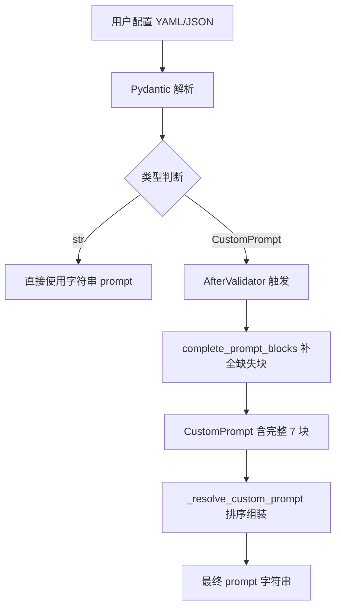
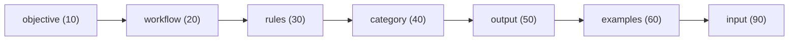
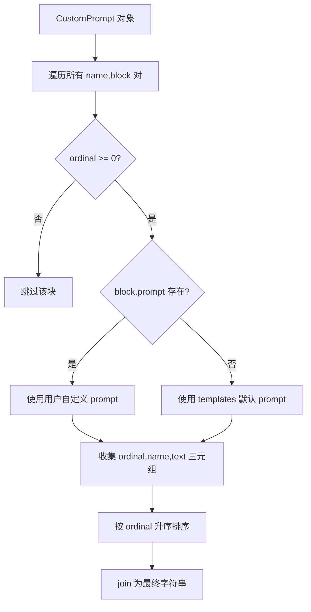
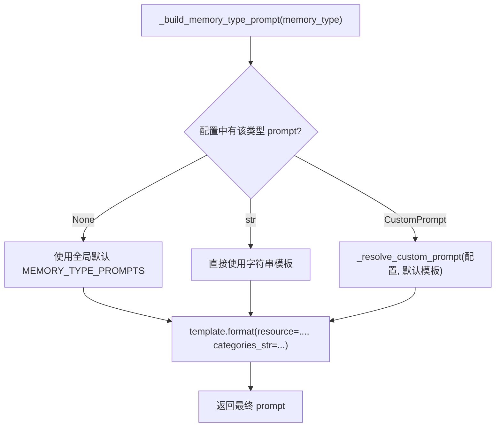

# PD-525.01 memU — CustomPrompt 七块 ordinal 排序与记忆类型定制模板

> 文档编号：PD-525.01
> 来源：memU `src/memu/app/settings.py`, `src/memu/prompts/memory_type/`, `src/memu/app/memorize.py`
> GitHub：https://github.com/NevaMind-AI/memU.git
> 问题域：PD-525 Prompt 工程模板化 Prompt Engineering Templates
> 状态：可复用方案

---

## 第 1 章 问题与动机（≥ 30 行）

### 1.1 核心问题

LLM 应用中，prompt 是最核心的"代码"，但大多数项目将 prompt 硬编码为单一长字符串，导致三个工程痛点：

1. **不可组合**：不同场景需要不同 prompt 片段组合（如提取 profile 和提取 event 的规则不同），硬编码无法灵活拼装
2. **不可覆盖**：用户想定制某一段 prompt（如修改输出格式）时，只能整体替换，无法精确覆盖单个片段
3. **顺序不可控**：prompt 各部分的排列顺序影响 LLM 输出质量，但字符串拼接无法保证顺序语义

memU 作为一个用户记忆提取系统，需要为 6 种记忆类型（profile/event/knowledge/behavior/skill/tool）各自维护独立的提取 prompt，同时支持用户通过配置文件覆盖任意 prompt 块。这要求一套结构化的 prompt 模板系统。

### 1.2 memU 的解法概述

memU 设计了一套 **PromptBlock + CustomPrompt + ordinal 排序** 的三层 prompt 模板架构：

1. **七块标准分区**：每个 prompt 被拆分为 objective/workflow/rules/category/output/examples/input 七个语义块，每块有独立的 `PROMPT_BLOCK_*` 常量（`src/memu/prompts/memory_type/profile.py:56-170`）
2. **ordinal 排序机制**：每个块有一个 ordinal 数值（10/20/30/40/50/60/90），组装时按 ordinal 升序排列，保证语义顺序（`src/memu/prompts/memory_type/__init__.py:30-38`）
3. **用户覆盖合并**：`complete_prompt_blocks()` 函数自动将用户缺失的块补全为默认值，用户只需覆盖想改的块（`src/memu/app/settings.py:54-58`）
4. **Pydantic 验证器自动补全**：通过 `AfterValidator` 在配置加载时自动触发补全逻辑（`src/memu/app/settings.py:61-64`）
5. **负 ordinal 排除**：ordinal < 0 的块在组装时被跳过，实现"禁用某块"的效果（`src/memu/app/memorize.py:416`）

### 1.3 设计思想

| 设计原则 | 具体实现 | 理由 | 替代方案 |
|----------|----------|------|----------|
| 语义分区 | 7 个命名块（objective→input） | 每块有明确职责，便于独立修改 | Jinja2 模板继承（更重） |
| 顺序即语义 | ordinal 数值排序（10/20/30/40/50/60/90） | LLM 对 prompt 顺序敏感，数值间隔允许插入新块 | 固定数组索引（不灵活） |
| 默认补全 | complete_prompt_blocks + AfterValidator | 用户只需覆盖关心的块，其余自动填充 | 要求用户提供完整 prompt（体验差） |
| 类型安全 | Pydantic RootModel[dict[str, PromptBlock]] | 配置加载时即验证结构 | 纯 dict（无校验） |
| 负值排除 | ordinal < 0 跳过该块 | 无需删除配置项即可禁用某块 | 布尔 enabled 字段（多一个字段） |

---

## 第 2 章 源码实现分析（≥ 60 行，核心章节）

### 2.1 架构概览

memU 的 prompt 模板系统由三层组成：

```
┌─────────────────────────────────────────────────────────────┐
│                    配置层 (settings.py)                       │
│  MemorizeConfig.memory_type_prompts: dict[str, str|CustomPrompt] │
│  ├─ CompleteMemoryTypePrompt (AfterValidator)                │
│  └─ CompleteCategoryPrompt (AfterValidator)                  │
├─────────────────────────────────────────────────────────────┤
│                    模板层 (prompts/)                          │
│  prompts/memory_type/                                        │
│  ├─ profile.py   → 7 个 PROMPT_BLOCK_* + CUSTOM_PROMPT dict │
│  ├─ event.py     → 7 个 PROMPT_BLOCK_* + CUSTOM_PROMPT dict │
│  ├─ knowledge.py → 7 个 PROMPT_BLOCK_* + CUSTOM_PROMPT dict │
│  ├─ behavior.py  → 7 个 PROMPT_BLOCK_* + CUSTOM_PROMPT dict │
│  ├─ skill.py     → 7 个 PROMPT_BLOCK_* + CUSTOM_PROMPT dict │
│  └─ tool.py      → 7 个 PROMPT_BLOCK_* + CUSTOM_PROMPT dict │
│  prompts/category_summary/                                   │
│  └─ category.py  → 6 个 PROMPT_BLOCK_* + CUSTOM_PROMPT dict │
│  prompts/retrieve/                                           │
│  └─ pre_retrieval_decision.py → SYSTEM_PROMPT + USER_PROMPT  │
├─────────────────────────────────────────────────────────────┤
│                    组装层 (memorize.py)                       │
│  _resolve_custom_prompt() → ordinal 排序 + 模板填充           │
│  _build_memory_type_prompt() → 类型路由 + 变量注入            │
│  _build_category_summary_prompt() → 分类摘要 prompt 构建      │
└─────────────────────────────────────────────────────────────┘
```

### 2.2 核心实现

#### 2.2.1 PromptBlock 与 CustomPrompt 数据模型



对应源码 `src/memu/app/settings.py:38-58`：

```python
class PromptBlock(BaseModel):
    label: str | None = None
    ordinal: int = Field(default=0)
    prompt: str | None = None


class CustomPrompt(RootModel[dict[str, PromptBlock]]):
    root: dict[str, PromptBlock] = Field(default_factory=dict)

    def get(self, key: str, default: PromptBlock | None = None) -> PromptBlock | None:
        return self.root.get(key, default)

    def items(self) -> list[tuple[str, PromptBlock]]:
        return list(self.root.items())


def complete_prompt_blocks(prompt: CustomPrompt, default_blocks: Mapping[str, int]) -> CustomPrompt:
    for key, ordinal in default_blocks.items():
        if key not in prompt.root:
            prompt.root[key] = PromptBlock(ordinal=ordinal)
    return prompt
```

`PromptBlock` 是最小单元：一个命名的 prompt 片段，带 ordinal 排序值。`CustomPrompt` 是 `dict[str, PromptBlock]` 的 Pydantic 包装，提供类型安全的字典访问。`complete_prompt_blocks` 是补全函数——遍历默认块定义，将用户配置中缺失的块以默认 ordinal 补入。

#### 2.2.2 七块标准分区与 ordinal 定义



对应源码 `src/memu/prompts/memory_type/__init__.py:30-38`：

```python
DEFAULT_MEMORY_CUSTOM_PROMPT_ORDINAL: dict[str, int] = {
    "objective": 10,
    "workflow": 20,
    "rules": 30,
    "category": 40,
    "output": 50,
    "examples": 60,
    "input": 90,
}
```

ordinal 间隔为 10，input 块跳到 90，留出 70/80 给用户插入自定义块。每种记忆类型（profile/event/knowledge/behavior/skill/tool）都遵循这个七块结构，但各块内容不同。

#### 2.2.3 核心组装逻辑 _resolve_custom_prompt



对应源码 `src/memu/app/memorize.py:410-422`：

```python
@staticmethod
def _resolve_custom_prompt(prompt: str | CustomPrompt, templates: Mapping[str, str]) -> str:
    if isinstance(prompt, str):
        return prompt
    valid_blocks = [
        (block.ordinal, name, block.prompt or templates.get(name))
        for name, block in prompt.items()
        if (block.ordinal >= 0 and (block.prompt or templates.get(name)))
    ]
    if not valid_blocks:
        return ""
    sorted_blocks = sorted(valid_blocks)
    return "\n\n".join(block for (_, _, block) in sorted_blocks if block is not None)
```

这是整个模板系统的核心：
- 如果 prompt 是纯字符串，直接返回（向后兼容）
- 如果是 CustomPrompt，遍历每个块，过滤掉 ordinal < 0 的（禁用块）
- 每个块优先使用 `block.prompt`（用户覆盖），否则回退到 `templates` 中的默认值
- 按 ordinal 排序后用 `\n\n` 拼接

#### 2.2.4 记忆类型路由 _build_memory_type_prompt



对应源码 `src/memu/app/memorize.py:965-979`：

```python
def _build_memory_type_prompt(self, *, memory_type: MemoryType, resource_text: str, categories_str: str) -> str:
    configured_prompt = self.memorize_config.memory_type_prompts.get(memory_type)
    if configured_prompt is None:
        template = MEMORY_TYPE_PROMPTS.get(memory_type)
    elif isinstance(configured_prompt, str):
        template = configured_prompt
    else:
        template = self._resolve_custom_prompt(
            configured_prompt, MEMORY_TYPE_CUSTOM_PROMPTS.get(memory_type, CUSTOM_TYPE_CUSTOM_PROMPTS)
        )
    if not template:
        return resource_text
    safe_resource = self._escape_prompt_value(resource_text)
    safe_categories = self._escape_prompt_value(categories_str)
    return template.format(resource=safe_resource, categories_str=safe_categories)
```

三级路由：None → 全局默认；str → 用户完整替换；CustomPrompt → 块级覆盖合并。

### 2.3 实现细节

**六种记忆类型的 prompt 差异化设计：**

每种记忆类型虽然共享七块结构，但各块内容针对性极强：

| 记忆类型 | objective 核心指令 | rules 特殊规则 | output 格式 |
|----------|-------------------|---------------|-------------|
| profile | 提取用户长期稳定特征 | 禁止事件类信息，< 30 词 | XML `<item>` |
| event | 提取特定时间事件 | 禁止行为模式/习惯，< 50 词 | XML `<item>` |
| knowledge | 提取事实知识概念 | 禁止主观意见/个人经历 | XML `<item>` |
| behavior | 提取行为模式/习惯 | 禁止一次性事件 | XML `<item>` |
| skill | 提取技能档案 | 需完整 frontmatter，≥ 300 词 | XML `<item>` |
| tool | 提取工具使用模式 | 需 when_to_use 提示 | XML `<item>` |

**Pydantic AfterValidator 自动补全链：**

```python
# settings.py:61-64
CompleteMemoryTypePrompt = AfterValidator(
    lambda v: complete_prompt_blocks(v, DEFAULT_MEMORY_CUSTOM_PROMPT_ORDINAL)
)
CompleteCategoryPrompt = AfterValidator(
    lambda v: complete_prompt_blocks(v, DEFAULT_CATEGORY_SUMMARY_PROMPT_ORDINAL)
)
```

当用户在配置中只提供部分块时（如只覆盖 `rules` 块），Pydantic 在反序列化阶段自动调用 `complete_prompt_blocks`，将缺失的 objective/workflow/category/output/examples/input 块以默认 ordinal 补入。用户无需感知补全过程。

**变量注入安全：**

`_escape_prompt_value` (`src/memu/app/service.py:372`) 对用户输入进行转义，防止 `{` `}` 字符破坏 `str.format()` 模板。所有 prompt 模板使用 `{resource}` 和 `{categories_str}` 两个标准占位符。

---

## 第 3 章 迁移指南（≥ 40 行）

### 3.1 迁移清单

**阶段 1：定义 PromptBlock 基础设施**

- [ ] 创建 `PromptBlock` Pydantic 模型（label, ordinal, prompt 三字段）
- [ ] 创建 `CustomPrompt` 作为 `RootModel[dict[str, PromptBlock]]` 的包装
- [ ] 实现 `complete_prompt_blocks(prompt, default_blocks)` 补全函数
- [ ] 定义默认 ordinal 映射表（如 objective=10, workflow=20, ...）

**阶段 2：拆分现有 prompt 为语义块**

- [ ] 将每个长 prompt 字符串拆分为 `PROMPT_BLOCK_*` 常量
- [ ] 为每种业务场景创建独立的 prompt 模块文件
- [ ] 导出 `PROMPT`（拼接后的完整字符串）和 `CUSTOM_PROMPT`（块字典）

**阶段 3：实现组装逻辑**

- [ ] 实现 `_resolve_custom_prompt(prompt, templates)` 排序组装函数
- [ ] 在配置模型中添加 `Annotated[CustomPrompt, AfterValidator(...)]` 自动补全
- [ ] 实现业务层的 prompt 路由（None → 默认 / str → 替换 / CustomPrompt → 合并）

**阶段 4：配置化接入**

- [ ] 在配置文件中支持 `str | CustomPrompt` 联合类型
- [ ] 文档化每个块的 ordinal 值和用途
- [ ] 添加负 ordinal 禁用块的说明

### 3.2 适配代码模板

以下是一个可直接复用的最小实现：

```python
from collections.abc import Mapping
from pydantic import AfterValidator, BaseModel, Field, RootModel
from typing import Annotated


class PromptBlock(BaseModel):
    """单个 prompt 语义块"""
    label: str | None = None
    ordinal: int = Field(default=0)
    prompt: str | None = None


class CustomPrompt(RootModel[dict[str, PromptBlock]]):
    """可组合的 prompt 块集合"""
    root: dict[str, PromptBlock] = Field(default_factory=dict)

    def items(self) -> list[tuple[str, PromptBlock]]:
        return list(self.root.items())


# 默认块定义：名称 → ordinal
DEFAULT_BLOCK_ORDINALS: dict[str, int] = {
    "objective": 10,
    "workflow": 20,
    "rules": 30,
    "context": 40,
    "output": 50,
    "examples": 60,
    "input": 90,
}

# 默认块模板内容
DEFAULT_TEMPLATES: dict[str, str] = {
    "objective": "# Task Objective\nYou are a professional assistant...",
    "workflow": "# Workflow\n1. Analyze input\n2. Process\n3. Output",
    "rules": "# Rules\n- Be concise\n- Be accurate",
    "context": "# Context\n{context}",
    "output": "# Output Format\nReturn JSON...",
    "examples": "# Examples\n...",
    "input": "# Input\n{input_text}",
}


def complete_prompt_blocks(
    prompt: CustomPrompt, default_blocks: Mapping[str, int]
) -> CustomPrompt:
    """补全用户配置中缺失的默认块"""
    for key, ordinal in default_blocks.items():
        if key not in prompt.root:
            prompt.root[key] = PromptBlock(ordinal=ordinal)
    return prompt


# Pydantic AfterValidator：配置加载时自动补全
AutoCompletePrompt = AfterValidator(
    lambda v: complete_prompt_blocks(v, DEFAULT_BLOCK_ORDINALS)
)


def resolve_custom_prompt(
    prompt: str | CustomPrompt, templates: Mapping[str, str]
) -> str:
    """将 CustomPrompt 按 ordinal 排序组装为最终字符串"""
    if isinstance(prompt, str):
        return prompt
    valid_blocks = [
        (block.ordinal, name, block.prompt or templates.get(name))
        for name, block in prompt.items()
        if block.ordinal >= 0 and (block.prompt or templates.get(name))
    ]
    if not valid_blocks:
        return ""
    sorted_blocks = sorted(valid_blocks)
    return "\n\n".join(text for (_, _, text) in sorted_blocks if text)


# 使用示例
class TaskConfig(BaseModel):
    system_prompt: str | Annotated[CustomPrompt, AutoCompletePrompt] = Field(
        default="You are a helpful assistant."
    )


# 用户只覆盖 rules 块，其余自动补全
user_config = {
    "system_prompt": {
        "rules": {"ordinal": 30, "prompt": "# My Custom Rules\n- Always respond in Chinese"}
    }
}
config = TaskConfig.model_validate(user_config)
final_prompt = resolve_custom_prompt(config.system_prompt, DEFAULT_TEMPLATES)
```

### 3.3 适用场景

| 场景 | 适用度 | 说明 |
|------|--------|------|
| 多类型记忆/知识提取系统 | ⭐⭐⭐ | 每种类型需要不同 prompt，但共享结构 |
| 用户可配置的 LLM 应用 | ⭐⭐⭐ | 允许用户精确覆盖 prompt 的某一部分 |
| 多租户 SaaS prompt 管理 | ⭐⭐⭐ | 每个租户可定制部分块，默认块保底 |
| 简单单一 prompt 应用 | ⭐ | 过度设计，直接用字符串即可 |
| 需要条件分支的 prompt | ⭐⭐ | 可通过负 ordinal 禁用块，但复杂条件需额外逻辑 |

---

## 第 4 章 测试用例（≥ 20 行）

```python
import pytest
from pydantic import BaseModel, Field
from typing import Annotated


# 假设已导入上述迁移代码中的类和函数
from your_module import (
    PromptBlock, CustomPrompt, complete_prompt_blocks,
    resolve_custom_prompt, DEFAULT_BLOCK_ORDINALS, DEFAULT_TEMPLATES,
    AutoCompletePrompt,
)


class TestPromptBlock:
    def test_default_ordinal_is_zero(self):
        block = PromptBlock()
        assert block.ordinal == 0
        assert block.prompt is None
        assert block.label is None

    def test_custom_block(self):
        block = PromptBlock(label="my_rules", ordinal=35, prompt="Custom rules here")
        assert block.ordinal == 35
        assert block.prompt == "Custom rules here"


class TestCompletePromptBlocks:
    def test_fills_missing_blocks(self):
        prompt = CustomPrompt(root={
            "rules": PromptBlock(ordinal=30, prompt="My rules")
        })
        completed = complete_prompt_blocks(prompt, DEFAULT_BLOCK_ORDINALS)
        assert "objective" in completed.root
        assert completed.root["objective"].ordinal == 10
        assert completed.root["objective"].prompt is None  # 无自定义内容
        assert completed.root["rules"].prompt == "My rules"  # 保留用户覆盖

    def test_does_not_overwrite_existing(self):
        prompt = CustomPrompt(root={
            "objective": PromptBlock(ordinal=5, prompt="Custom objective")
        })
        completed = complete_prompt_blocks(prompt, DEFAULT_BLOCK_ORDINALS)
        assert completed.root["objective"].ordinal == 5  # 保留用户 ordinal
        assert completed.root["objective"].prompt == "Custom objective"

    def test_empty_prompt_gets_all_defaults(self):
        prompt = CustomPrompt(root={})
        completed = complete_prompt_blocks(prompt, DEFAULT_BLOCK_ORDINALS)
        assert len(completed.root) == len(DEFAULT_BLOCK_ORDINALS)


class TestResolveCustomPrompt:
    def test_string_passthrough(self):
        result = resolve_custom_prompt("plain string prompt", {})
        assert result == "plain string prompt"

    def test_ordinal_sorting(self):
        prompt = CustomPrompt(root={
            "input": PromptBlock(ordinal=90, prompt="INPUT"),
            "objective": PromptBlock(ordinal=10, prompt="OBJECTIVE"),
            "rules": PromptBlock(ordinal=30, prompt="RULES"),
        })
        result = resolve_custom_prompt(prompt, {})
        parts = result.split("\n\n")
        assert parts == ["OBJECTIVE", "RULES", "INPUT"]

    def test_negative_ordinal_excluded(self):
        prompt = CustomPrompt(root={
            "objective": PromptBlock(ordinal=10, prompt="OBJ"),
            "examples": PromptBlock(ordinal=-1, prompt="SKIP ME"),
            "input": PromptBlock(ordinal=90, prompt="IN"),
        })
        result = resolve_custom_prompt(prompt, {})
        assert "SKIP ME" not in result
        assert "OBJ" in result
        assert "IN" in result

    def test_fallback_to_templates(self):
        prompt = CustomPrompt(root={
            "objective": PromptBlock(ordinal=10),  # 无 prompt，回退模板
        })
        templates = {"objective": "Default objective text"}
        result = resolve_custom_prompt(prompt, templates)
        assert result == "Default objective text"

    def test_user_override_takes_precedence(self):
        prompt = CustomPrompt(root={
            "objective": PromptBlock(ordinal=10, prompt="User override"),
        })
        templates = {"objective": "Default text"}
        result = resolve_custom_prompt(prompt, templates)
        assert result == "User override"


class TestPydanticIntegration:
    def test_str_config(self):
        class Config(BaseModel):
            prompt: str | Annotated[CustomPrompt, AutoCompletePrompt] = "default"
        c = Config(prompt="simple string")
        assert c.prompt == "simple string"

    def test_custom_prompt_auto_complete(self):
        class Config(BaseModel):
            prompt: str | Annotated[CustomPrompt, AutoCompletePrompt] = "default"
        c = Config.model_validate({"prompt": {"rules": {"ordinal": 30, "prompt": "My rules"}}})
        assert isinstance(c.prompt, CustomPrompt)
        assert "objective" in c.prompt.root  # 自动补全
        assert c.prompt.root["rules"].prompt == "My rules"
```

---

## 第 5 章 跨域关联

| 关联域 | 关系类型 | 说明 |
|--------|----------|------|
| PD-01 上下文管理 | 协同 | prompt 模板的 input 块控制注入到 LLM 的上下文内容，与上下文窗口管理直接相关 |
| PD-06 记忆持久化 | 依赖 | prompt 模板系统为记忆提取服务，提取结果需要持久化存储；category_summary prompt 负责增量更新已持久化的摘要 |
| PD-07 质量检查 | 协同 | prompt 中的 rules 块和 examples 块直接影响提取质量；review & validate 步骤内嵌在 workflow 块中 |
| PD-10 中间件管道 | 协同 | prompt 的七块结构本身就是一种管道模式——每个块是管道中的一个阶段，ordinal 控制执行顺序 |
| PD-04 工具系统 | 协同 | tool 记忆类型的 prompt 模板专门用于提取工具使用模式，与工具系统的设计直接关联 |

---

## 第 6 章 来源文件索引

| 文件 | 行范围 | 关键实现 |
|------|--------|----------|
| `src/memu/app/settings.py` | L38-L58 | PromptBlock、CustomPrompt 数据模型、complete_prompt_blocks 补全函数 |
| `src/memu/app/settings.py` | L61-L64 | CompleteMemoryTypePrompt、CompleteCategoryPrompt AfterValidator 定义 |
| `src/memu/app/settings.py` | L204-L228 | MemorizeConfig 中 memory_type_prompts 和 default_category_summary_prompt 配置 |
| `src/memu/prompts/memory_type/__init__.py` | L1-L47 | 六种记忆类型 prompt 注册表、DEFAULT_MEMORY_CUSTOM_PROMPT_ORDINAL 定义 |
| `src/memu/prompts/memory_type/profile.py` | L56-L190 | profile 类型七块 PROMPT_BLOCK_* 定义和 CUSTOM_PROMPT 导出 |
| `src/memu/prompts/memory_type/event.py` | L57-L182 | event 类型七块定义，含 PROMPT_LEGACY 向后兼容 |
| `src/memu/prompts/memory_type/knowledge.py` | L47-L172 | knowledge 类型七块定义 |
| `src/memu/prompts/memory_type/behavior.py` | L45-L176 | behavior 类型七块定义 |
| `src/memu/prompts/memory_type/skill.py` | L1-L580 | skill 类型七块定义，含完整 skill profile 模板（最复杂的类型） |
| `src/memu/prompts/memory_type/tool.py` | L1-L120 | tool 类型七块定义，含 when_to_use 字段 |
| `src/memu/prompts/category_summary/__init__.py` | L7-L14 | DEFAULT_CATEGORY_SUMMARY_PROMPT_ORDINAL（6 块，无 rules） |
| `src/memu/prompts/category_summary/category.py` | L146-L296 | 分类摘要 prompt 七块定义 |
| `src/memu/prompts/retrieve/pre_retrieval_decision.py` | L1-L53 | 检索意图判断 SYSTEM_PROMPT + USER_PROMPT |
| `src/memu/app/memorize.py` | L410-L422 | _resolve_custom_prompt 核心排序组装逻辑 |
| `src/memu/app/memorize.py` | L965-L979 | _build_memory_type_prompt 三级路由 |
| `src/memu/app/memorize.py` | L1038-L1097 | _build_category_summary_prompt 分类摘要 prompt 构建 |

---

## 第 7 章 横向对比维度

> **重要：** 本章用于自动填充 Butcher Wiki 的横向对比表。
> 必须严格按以下 JSON 格式输出，放在 `comparison_data` 代码块中。

```json comparison_data
{
  "project": "memU",
  "dimensions": {
    "模板结构": "七块语义分区（objective/workflow/rules/category/output/examples/input），每块独立常量",
    "排序机制": "ordinal 数值排序，间隔 10，负值排除禁用块",
    "覆盖策略": "complete_prompt_blocks 自动补全缺失块，用户只需覆盖关心的块",
    "类型定制": "6 种记忆类型各有独立七块模板，共享结构但内容差异化",
    "验证集成": "Pydantic AfterValidator 在配置加载时自动触发补全",
    "向后兼容": "支持 str | CustomPrompt 联合类型，纯字符串直接透传"
  }
}
```

### 域元数据补充

```json domain_metadata
{
  "solution_summary": "memU 通过 PromptBlock 七块语义分区 + ordinal 数值排序 + Pydantic AfterValidator 自动补全，实现 6 种记忆类型的可组合可覆盖 prompt 模板系统",
  "description": "结构化 prompt 的块级组合、排序与用户覆盖合并机制",
  "sub_problems": [
    "负 ordinal 禁用块实现条件性 prompt 组装",
    "多业务场景共享块结构但差异化内容的模板复用",
    "Pydantic 验证阶段自动补全与类型安全保障"
  ],
  "best_practices": [
    "ordinal 间隔设为 10 留出用户插入空间（如 input=90 留出 70/80）",
    "AfterValidator 在配置反序列化时自动补全，用户无感知",
    "str | CustomPrompt 联合类型实现向后兼容的渐进式迁移"
  ]
}
```
