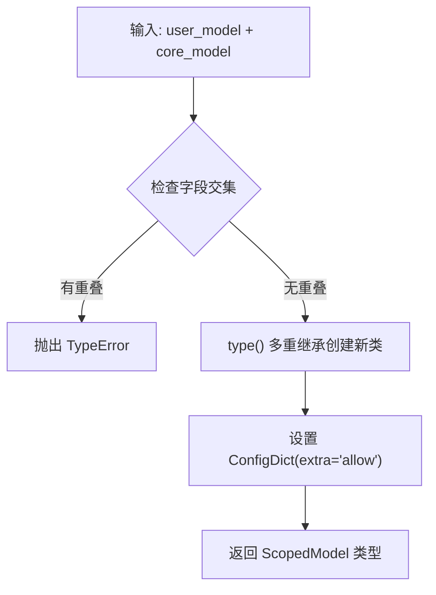
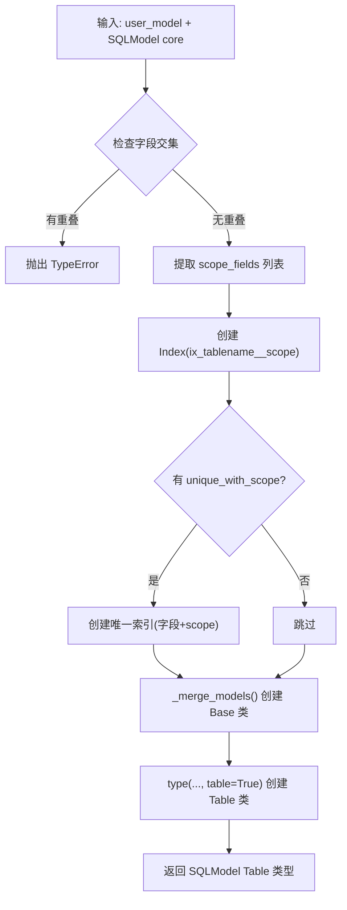

# PD-526.01 memU — merge_scope_model 动态作用域与三后端多租户隔离

> 文档编号：PD-526.01
> 来源：memU `src/memu/database/models.py`, `src/memu/app/settings.py`, `src/memu/app/service.py`
> GitHub：https://github.com/NevaMind-AI/memU.git
> 问题域：PD-526 动态作用域模型 Dynamic Scope Model
> 状态：可复用方案

---

## 第 1 章 问题与动机（≥ 30 行）

### 1.1 核心问题

多租户记忆系统面临一个根本矛盾：核心数据模型（Resource、MemoryItem、MemoryCategory）是固定的，但不同部署场景需要不同的租户隔离维度。有的场景只需 `user_id`，有的需要 `user_id + agent_id + session_id` 三维隔离，甚至可能有自定义的业务字段。

传统做法是在核心模型中硬编码所有可能的租户字段，或者用一个通用的 `tenant_id` 字段。前者导致模型膨胀且无法扩展，后者丢失了类型安全和语义信息。

memU 需要一种机制：让用户在配置时声明自己的作用域字段，系统在运行时自动将这些字段"注入"到所有核心模型中，同时保证类型安全、字段不冲突、查询自动过滤。

### 1.2 memU 的解法概述

1. **用户声明作用域模型** — 用户通过 `UserConfig.model` 传入一个 Pydantic BaseModel 子类（如 `DefaultUserModel`），声明 `user_id`、`agent_id` 等字段 (`src/memu/app/settings.py:249-253`)
2. **运行时动态合并** — `merge_scope_model()` 使用 Python `type()` 元编程，将用户模型与核心模型通过多重继承合并为新类型 (`src/memu/database/models.py:108-121`)
3. **字段冲突检测** — 合并前检查 `model_fields` 交集，若用户字段与核心字段重名则抛出 `TypeError` (`src/memu/database/models.py:112-115`)
4. **三后端统一适配** — InMemory / Postgres / SQLite 三种存储后端各自调用 `merge_scope_model` 或其变体 `build_table_model`，将作用域字段映射为内存属性或数据库列 (`src/memu/database/postgres/models.py:111-154`)
5. **查询自动过滤** — 所有 Repository 的 `list_*`、`vector_search_*` 方法接受 `where` 参数，`_normalize_where` 验证过滤字段必须属于用户模型 (`src/memu/app/crud.py:195-212`)

### 1.3 设计思想

| 设计原则 | 具体实现 | 理由 | 替代方案 |
|----------|----------|------|----------|
| 开放-封闭原则 | 核心模型封闭不改，用户模型开放扩展 | 避免每次新增租户维度都修改核心代码 | 硬编码所有字段（不可扩展） |
| 编译时类型安全 | 用户模型必须是 Pydantic BaseModel | Pydantic 提供字段验证和序列化 | 用 dict 传递（丢失类型信息） |
| 防御性合并 | 合并前检测字段名冲突 | 防止用户字段覆盖 `id`/`summary` 等核心字段 | 静默覆盖（引发隐蔽 bug） |
| 后端无关 | 三后端各自实现 merge 变体 | InMemory 用纯 Pydantic，Postgres/SQLite 用 SQLModel | 统一 ORM（限制后端选择） |
| 查询边界校验 | `_normalize_where` 只允许用户模型字段 | 防止注入核心字段的非法过滤 | 不校验（安全风险） |

---

## 第 2 章 源码实现分析（≥ 60 行，核心章节）

### 2.1 架构概览

memU 的动态作用域系统分为三层：声明层（UserConfig）、合并层（merge_scope_model）、消费层（Repository + where 过滤）。

```
┌─────────────────────────────────────────────────────────────┐
│                    用户配置层 (Declaration)                    │
│  UserConfig.model = DefaultUserModel(user_id, agent_id)     │
└──────────────────────────┬──────────────────────────────────┘
                           │ type[BaseModel]
                           ▼
┌─────────────────────────────────────────────────────────────┐
│                    动态合并层 (Merge)                          │
│  merge_scope_model(user_model, CoreModel) → ScopedModel     │
│  ┌─────────────┐  ┌──────────────┐  ┌───────────────────┐  │
│  │  InMemory    │  │   Postgres   │  │     SQLite        │  │
│  │ merge_scope  │  │ build_table  │  │ build_sqlite_table│  │
│  │ _model()    │  │ _model()     │  │ _model()          │  │
│  └─────────────┘  └──────────────┘  └───────────────────┘  │
└──────────────────────────┬──────────────────────────────────┘
                           │ ScopedModel (含 user_id 等字段)
                           ▼
┌─────────────────────────────────────────────────────────────┐
│                    消费层 (Repository)                        │
│  repo.list_items(where={"user_id": "u1"})                   │
│  repo.vector_search(query, where={"user_id": "u1"})         │
│  _normalize_where() 校验字段合法性                             │
└─────────────────────────────────────────────────────────────┘
```

### 2.2 核心实现

#### 2.2.1 merge_scope_model — Pydantic 层动态合并



对应源码 `src/memu/database/models.py:108-121`：

```python
def merge_scope_model[TBaseRecord: BaseRecord](
    user_model: type[BaseModel], core_model: type[TBaseRecord], *, name_suffix: str
) -> type[TBaseRecord]:
    """Create a scoped model inheriting both the user scope model and the core model."""
    overlap = set(user_model.model_fields) & set(core_model.model_fields)
    if overlap:
        msg = f"Scope fields conflict with core model fields: {sorted(overlap)}"
        raise TypeError(msg)

    return type(
        f"{user_model.__name__}{core_model.__name__}{name_suffix}",
        (user_model, core_model),
        {"model_config": ConfigDict(extra="allow")},
    )
```

关键点：
- 使用 Python 3.12 的 `[TBaseRecord: BaseRecord]` 泛型语法，返回类型保持与 `core_model` 一致
- `type()` 三参数形式动态创建类，MRO 为 `(user_model, core_model)`
- `ConfigDict(extra="allow")` 允许额外字段，兼容不同后端的扩展需求

#### 2.2.2 build_table_model — SQLModel/Postgres 层动态合并



对应源码 `src/memu/database/postgres/models.py:111-154`：

```python
def build_table_model(
    user_model: type[BaseModel],
    core_model: type[SQLModel],
    *,
    tablename: str,
    metadata: MetaData | None = None,
    extra_table_args: tuple[Any, ...] | None = None,
    unique_with_scope: list[str] | None = None,
) -> type[SQLModel]:
    overlap = set(user_model.model_fields) & set(core_model.model_fields)
    if overlap:
        msg = f"Scope fields conflict with core model fields: {sorted(overlap)}"
        raise TypeError(msg)

    scope_fields = list(user_model.model_fields.keys())
    base_table_args, table_kwargs = _normalize_table_args(
        getattr(core_model, "__table_args__", None)
    )
    table_args = list(base_table_args)
    if scope_fields:
        table_args.append(Index(f"ix_{tablename}__scope", *scope_fields))
    if unique_with_scope:
        unique_cols = [*unique_with_scope, *scope_fields]
        table_args.append(Index(f"ix_{tablename}__unique_scoped", *unique_cols, unique=True))

    base_attrs: dict[str, Any] = {"__module__": core_model.__module__, "__tablename__": tablename}
    if metadata is not None:
        base_attrs["metadata"] = metadata
    if table_args or table_kwargs:
        base_attrs["__table_args__"] = tuple(table_args) if not table_kwargs else (*table_args, table_kwargs)

    base = _merge_models(user_model, core_model, name_suffix="Base", base_attrs=base_attrs)
    table_attrs: dict[str, Any] = {"__module__": core_model.__module__}
    return type(f"{user_model.__name__}{core_model.__name__}Table", (base,), table_attrs, table=True)
```

关键点：
- 自动为 scope 字段创建数据库索引 `ix_{tablename}__scope`
- `unique_with_scope` 支持"在同一租户内唯一"的约束（如 `memory_categories.name` 在同一 `user_id` 下唯一）
- 两步创建：先 `_merge_models` 生成 Base（非 table），再 `type(..., table=True)` 生成 Table 类

### 2.3 实现细节

#### 查询过滤链路

用户调用 `memorize(user={"user_id": "u1"})` 或 `retrieve(where={"user_id": "u1"})` 时，过滤链路如下：

```
用户传入 where={"user_id": "u1"}
    │
    ▼
_normalize_where() ── 校验字段属于 user_model.model_fields
    │
    ▼
WorkflowState["where"] = {"user_id": "u1"}
    │
    ▼
Repository.list_items(where={"user_id": "u1"})
    │
    ├─ InMemory: matches_where(obj, where) → getattr 逐字段比较
    │
    └─ Postgres: _build_filters(model, where) → SQLAlchemy column == value
```

`_normalize_where` 的实现 (`src/memu/app/crud.py:195-212`)：

```python
def _normalize_where(self, where: Mapping[str, Any] | None) -> dict[str, Any]:
    if not where:
        return {}
    valid_fields = set(getattr(self.user_model, "model_fields", {}).keys())
    cleaned: dict[str, Any] = {}
    for raw_key, value in where.items():
        if value is None:
            continue
        field = raw_key.split("__", 1)[0]
        if field not in valid_fields:
            msg = f"Unknown filter field '{field}' for current user scope"
            raise ValueError(msg)
        cleaned[raw_key] = value
    return cleaned
```

支持 `field__in` 操作符语法（如 `{"user_id__in": ["u1", "u2"]}`），通过 `split("__", 1)` 提取基础字段名进行校验。

#### InMemory 后端的 matches_where

`src/memu/database/inmemory/repositories/filter.py:7-29` 实现了通用的内存过滤器：

```python
def matches_where(obj: Any, where: Mapping[str, Any] | None) -> bool:
    if not where:
        return True
    for raw_key, expected in where.items():
        if expected is None:
            continue
        field, op = [*raw_key.split("__", 1), None][:2]
        actual = getattr(obj, str(field), None)
        if op == "in":
            if isinstance(expected, str):
                if actual != expected:
                    return False
            else:
                if actual not in expected:
                    return False
        else:
            if actual != expected:
                return False
    return True
```

由于 ScopedModel 通过多重继承拥有 `user_id` 等属性，`getattr(obj, "user_id")` 可以直接访问，无需额外映射。

#### user_data 注入到记录创建

在 `InMemoryMemoryItemRepository.create_item` (`src/memu/database/inmemory/repositories/memory_item_repo.py:109-120`) 中，`user_data` 通过 `**kwargs` 展开注入到 ScopedModel 实例：

```python
it = self.memory_item_model(
    id=mid,
    resource_id=resource_id,
    memory_type=memory_type,
    summary=summary,
    embedding=embedding,
    extra=extra if extra else {},
    **user_data,  # ← user_id, agent_id 等作用域字段在此注入
)
```


---

## 第 3 章 迁移指南（≥ 40 行）

### 3.1 迁移清单

**阶段 1：定义作用域模型**
- [ ] 创建 `ScopeModel(BaseModel)` 声明租户字段（如 `user_id`, `org_id`）
- [ ] 确保字段名不与核心模型冲突（`id`, `created_at`, `updated_at`, `summary`, `embedding` 等）
- [ ] 所有字段设为 `Optional`，允许不传时不过滤

**阶段 2：实现 merge 函数**
- [ ] 实现 `merge_scope_model(user_model, core_model)` 函数
- [ ] 添加字段冲突检测（`model_fields` 交集检查）
- [ ] 如果使用 ORM，实现 `build_table_model` 变体，自动创建 scope 索引

**阶段 3：适配 Repository 层**
- [ ] 所有 CRUD 方法添加 `where` 参数
- [ ] 实现 `_normalize_where` 校验过滤字段合法性
- [ ] 记录创建时通过 `**user_data` 注入作用域字段

**阶段 4：测试验证**
- [ ] 测试字段冲突检测
- [ ] 测试多租户隔离（不同 user_id 的数据互不可见）
- [ ] 测试 `__in` 操作符

### 3.2 适配代码模板

以下是一个可直接复用的最小实现：

```python
from pydantic import BaseModel, ConfigDict
from typing import Any, Mapping

# ---- 1. 作用域模型声明 ----
class TenantScope(BaseModel):
    """用户自定义的租户作用域字段"""
    user_id: str | None = None
    org_id: str | None = None

# ---- 2. 核心记录模型 ----
class BaseRecord(BaseModel):
    id: str
    created_at: str
    content: str

# ---- 3. 动态合并函数 ----
def merge_scope_model(
    scope_model: type[BaseModel],
    core_model: type[BaseRecord],
    *,
    name_suffix: str = "",
) -> type[BaseRecord]:
    overlap = set(scope_model.model_fields) & set(core_model.model_fields)
    if overlap:
        raise TypeError(f"Scope fields conflict: {sorted(overlap)}")
    return type(
        f"{scope_model.__name__}{core_model.__name__}{name_suffix}",
        (scope_model, core_model),
        {"model_config": ConfigDict(extra="allow")},
    )

# ---- 4. 使用 ----
ScopedRecord = merge_scope_model(TenantScope, BaseRecord, name_suffix="Scoped")

# 创建带作用域的记录
record = ScopedRecord(
    id="r1", created_at="2024-01-01", content="hello",
    user_id="u1", org_id="org-a",
)
print(record.user_id)  # "u1"
print(record.content)  # "hello"

# ---- 5. 查询过滤 ----
def matches_where(obj: BaseModel, where: Mapping[str, Any]) -> bool:
    for key, expected in where.items():
        if expected is None:
            continue
        field, *ops = key.split("__", 1)
        actual = getattr(obj, field, None)
        if ops and ops[0] == "in":
            if actual not in expected:
                return False
        elif actual != expected:
            return False
    return True

# 过滤示例
records = [record]
filtered = [r for r in records if matches_where(r, {"user_id": "u1"})]
```

### 3.3 适用场景

| 场景 | 适用度 | 说明 |
|------|--------|------|
| 多租户 SaaS 记忆系统 | ⭐⭐⭐ | 核心场景，user_id/org_id 隔离 |
| 多 Agent 记忆隔离 | ⭐⭐⭐ | agent_id + session_id 维度过滤 |
| 单租户但需扩展字段 | ⭐⭐ | 可用但 merge 机制略重 |
| 固定租户模型不变 | ⭐ | 直接硬编码更简单 |
| 需要运行时动态增减字段 | ⭐ | merge 在初始化时执行，不支持热变更 |

---

## 第 4 章 测试用例（≥ 20 行）

```python
import pytest
from pydantic import BaseModel, ConfigDict


class BaseRecord(BaseModel):
    id: str
    summary: str


def merge_scope_model(user_model, core_model, *, name_suffix=""):
    overlap = set(user_model.model_fields) & set(core_model.model_fields)
    if overlap:
        raise TypeError(f"Scope fields conflict: {sorted(overlap)}")
    return type(
        f"{user_model.__name__}{core_model.__name__}{name_suffix}",
        (user_model, core_model),
        {"model_config": ConfigDict(extra="allow")},
    )


class TestMergeScopeModel:
    def test_basic_merge(self):
        class UserScope(BaseModel):
            user_id: str | None = None

        Scoped = merge_scope_model(UserScope, BaseRecord, name_suffix="Test")
        obj = Scoped(id="1", summary="test", user_id="u1")
        assert obj.user_id == "u1"
        assert obj.summary == "test"
        assert obj.id == "1"

    def test_field_conflict_raises(self):
        class BadScope(BaseModel):
            id: str  # conflicts with BaseRecord.id

        with pytest.raises(TypeError, match="Scope fields conflict"):
            merge_scope_model(BadScope, BaseRecord, name_suffix="Bad")

    def test_multi_scope_fields(self):
        class MultiScope(BaseModel):
            user_id: str | None = None
            agent_id: str | None = None
            session_id: str | None = None

        Scoped = merge_scope_model(MultiScope, BaseRecord, name_suffix="Multi")
        obj = Scoped(id="1", summary="s", user_id="u1", agent_id="a1", session_id="sess1")
        assert obj.user_id == "u1"
        assert obj.agent_id == "a1"
        assert obj.session_id == "sess1"

    def test_optional_scope_fields(self):
        class OptScope(BaseModel):
            user_id: str | None = None

        Scoped = merge_scope_model(OptScope, BaseRecord, name_suffix="Opt")
        obj = Scoped(id="1", summary="s")
        assert obj.user_id is None

    def test_where_filter(self):
        class Scope(BaseModel):
            user_id: str | None = None

        Scoped = merge_scope_model(Scope, BaseRecord, name_suffix="Filter")
        items = [
            Scoped(id="1", summary="a", user_id="u1"),
            Scoped(id="2", summary="b", user_id="u2"),
            Scoped(id="3", summary="c", user_id="u1"),
        ]
        filtered = [i for i in items if getattr(i, "user_id") == "u1"]
        assert len(filtered) == 2
        assert {i.id for i in filtered} == {"1", "3"}

    def test_in_operator_filter(self):
        class Scope(BaseModel):
            user_id: str | None = None

        Scoped = merge_scope_model(Scope, BaseRecord, name_suffix="In")
        items = [
            Scoped(id="1", summary="a", user_id="u1"),
            Scoped(id="2", summary="b", user_id="u2"),
            Scoped(id="3", summary="c", user_id="u3"),
        ]
        target = {"u1", "u3"}
        filtered = [i for i in items if getattr(i, "user_id") in target]
        assert len(filtered) == 2
```


---

## 第 5 章 跨域关联

| 关联域 | 关系类型 | 说明 |
|--------|----------|------|
| PD-06 记忆持久化 | 依赖 | 动态作用域模型是记忆持久化的基础设施，决定了记录如何存储和检索 |
| PD-08 搜索与检索 | 协同 | `where` 过滤器在向量搜索和列表查询中统一应用，确保检索结果的租户隔离 |
| PD-04 工具系统 | 协同 | Tool Memory 的 `create_item` 通过 `**user_data` 注入作用域，工具记忆也受租户隔离保护 |
| PD-10 中间件管道 | 协同 | Workflow 的 `WorkflowState["where"]` 在管道中传递作用域过滤条件 |

---

## 第 6 章 来源文件索引

| 文件 | 行范围 | 关键实现 |
|------|--------|----------|
| `src/memu/database/models.py` | L108-L121 | `merge_scope_model` 核心合并函数 |
| `src/memu/database/models.py` | L124-L134 | `build_scoped_models` 批量构建四模型 |
| `src/memu/database/models.py` | L35-L41 | `BaseRecord` 核心基类定义 |
| `src/memu/app/settings.py` | L249-L257 | `DefaultUserModel` + `UserConfig` 声明 |
| `src/memu/app/service.py` | L62-L63 | `user_config` 解析与 `user_model` 提取 |
| `src/memu/app/service.py` | L77-L80 | `build_database(user_model=...)` 传递作用域 |
| `src/memu/database/factory.py` | L15-L43 | 三后端工厂，统一接收 `user_model` |
| `src/memu/database/postgres/models.py` | L92-L154 | `_merge_models` + `build_table_model` Postgres 变体 |
| `src/memu/database/postgres/schema.py` | L51-L101 | `get_sqlalchemy_models` 缓存 + 构建 |
| `src/memu/database/sqlite/models.py` | L163-L227 | `build_sqlite_table_model` SQLite 变体 |
| `src/memu/database/inmemory/models.py` | L30-L45 | `build_inmemory_models` InMemory 变体 |
| `src/memu/database/inmemory/repo.py` | L20-L57 | `InMemoryStore` 使用 scoped models |
| `src/memu/database/inmemory/repositories/filter.py` | L7-L29 | `matches_where` 通用内存过滤器 |
| `src/memu/database/postgres/repositories/base.py` | L67-L86 | `_build_filters` SQL 过滤器构建 |
| `src/memu/database/inmemory/repositories/memory_item_repo.py` | L109-L120 | `create_item` 中 `**user_data` 注入 |
| `src/memu/app/crud.py` | L195-L212 | `_normalize_where` 字段合法性校验 |

---

## 第 7 章 横向对比维度

> **重要：** 本章用于自动填充 Butcher Wiki 的横向对比表。

```json comparison_data
{
  "project": "memU",
  "dimensions": {
    "作用域声明": "Pydantic BaseModel 子类声明，UserConfig.model 传入",
    "合并机制": "type() 多重继承 + model_fields 冲突检测",
    "后端适配": "三后端各自实现 merge 变体（InMemory/Postgres/SQLite）",
    "索引策略": "自动创建 scope 索引 + unique_with_scope 复合唯一约束",
    "过滤校验": "_normalize_where 白名单校验 + __in 操作符支持",
    "类型安全": "泛型 TBaseRecord 保持返回类型与 core_model 一致"
  }
}
```

### 域元数据补充

```json domain_metadata
{
  "solution_summary": "memU 用 merge_scope_model 通过 type() 多重继承将用户 Pydantic 模型与核心记录模型运行时合并，三后端(InMemory/Postgres/SQLite)各自适配，自动创建 scope 索引和 where 过滤校验",
  "description": "运行时元编程合并用户作用域与核心模型，实现后端无关的多租户隔离",
  "sub_problems": [
    "ORM 层 scope 字段自动建索引与复合唯一约束",
    "三后端 merge 变体的一致性保证",
    "scope 模型缓存避免重复创建"
  ],
  "best_practices": [
    "Postgres schema 用 _MODEL_CACHE 缓存已构建的 scoped SQLModel 避免重复创建",
    "build_table_model 两步创建(Base+Table)保持 SQLModel table 行为正确",
    "unique_with_scope 实现租户内唯一约束而非全局唯一"
  ]
}
```
