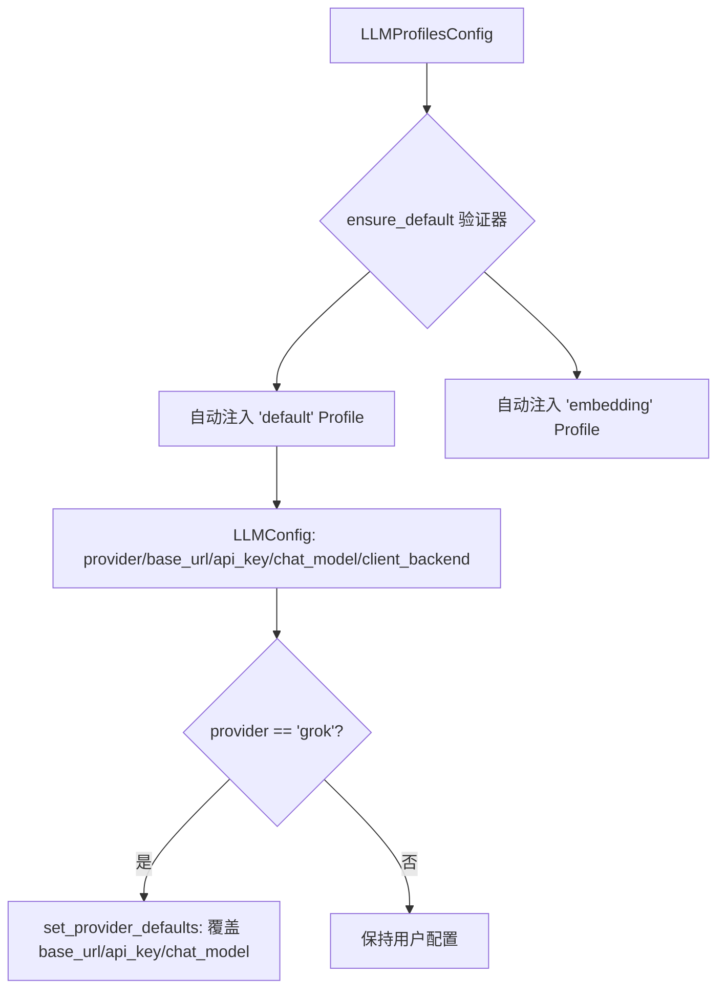
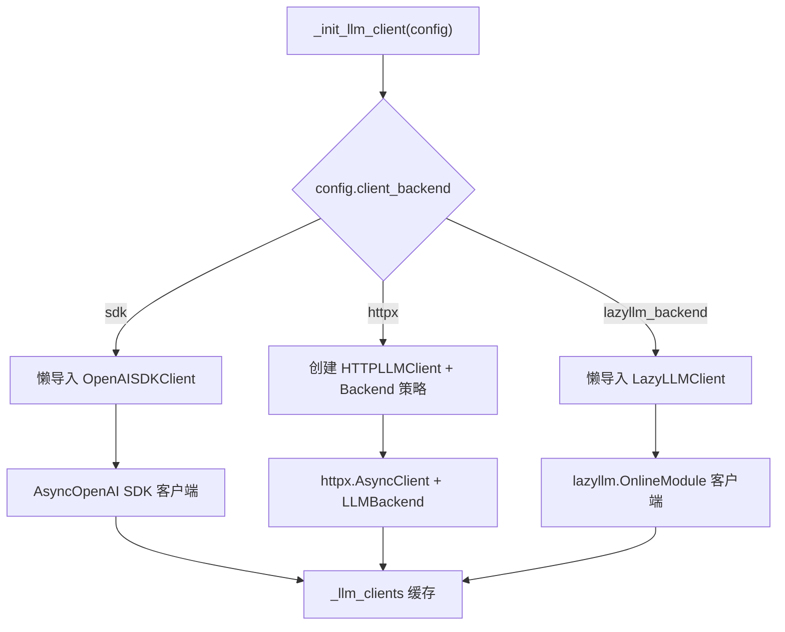
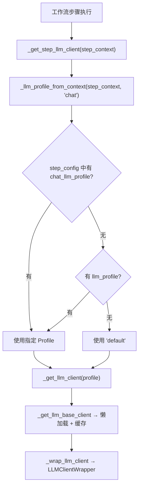

# PD-527.01 memU — 三层 Backend 策略模式与 Profile 驱动多 LLM 适配

> 文档编号：PD-527.01
> 来源：memU `src/memu/app/settings.py`, `src/memu/llm/wrapper.py`, `src/memu/app/service.py`
> GitHub：https://github.com/NevaMind-AI/memU.git
> 问题域：PD-527 多 Provider LLM 抽象层 Multi-Provider LLM Abstraction
> 状态：可复用方案

---

## 第 1 章 问题与动机（≥ 30 行）

### 1.1 核心问题

在 Agent 系统中，不同操作步骤对 LLM 的需求差异巨大：记忆提取需要高精度大模型，嵌入向量化需要专用 Embedding 模型，语音转写需要 STT 模型，视觉理解需要 VLM。同时，不同部署环境可能使用不同的 LLM 提供商（OpenAI、OpenRouter、Grok、Doubao、国产模型平台等），且同一提供商的接入方式也有差异（官方 SDK vs 原始 HTTP vs 第三方框架）。

如果将模型选择和提供商逻辑硬编码到业务代码中，会导致：
- 切换提供商需要修改大量业务代码
- 无法为不同操作步骤指定不同的模型/提供商组合
- SDK 依赖耦合——不使用 LazyLLM 的用户也被迫安装其依赖
- 无法在运行时动态切换客户端实现

### 1.2 memU 的解法概述

memU 通过三层架构解决上述问题：

1. **Profile 配置层**（`LLMProfilesConfig`）：用命名 Profile 字典管理多套 LLM 配置，每个 Profile 独立指定 provider/model/base_url/api_key/client_backend，工作流每个步骤可引用不同 Profile（`settings.py:263-296`）
2. **客户端策略层**（`client_backend` 三分支）：根据 `client_backend` 字段在 `sdk`/`httpx`/`lazyllm_backend` 三种客户端实现间切换，通过懒加载 + 缓存避免不必要的依赖导入（`service.py:97-135`）
3. **Backend 策略层**（`LLMBackend` 继承体系）：HTTP 模式下通过策略模式按 provider 名称加载不同的 payload 构建器和响应解析器，支持 OpenAI/Doubao/Grok/OpenRouter 四种后端（`http_client.py:72-77`）

额外地，`LLMClientWrapper` 在客户端之上叠加拦截器管道，实现全链路追踪和可观测性（`wrapper.py:226-435`）。

### 1.3 设计思想

| 设计原则 | 具体实现 | 理由 | 替代方案 |
|----------|----------|------|----------|
| Profile 驱动 | `LLMProfilesConfig` 命名字典，步骤级 `llm_profile` 引用 | 同一系统内不同步骤可用不同模型，无需改代码 | 全局单一配置 |
| 三模式客户端 | `sdk`/`httpx`/`lazyllm_backend` 按配置切换 | SDK 模式类型安全，HTTP 模式轻量，LazyLLM 接入国产模型 | 统一用 HTTP |
| 懒加载导入 | `from memu.llm.openai_sdk import ...` 在分支内 | 不使用 LazyLLM 的用户无需安装其依赖 | 顶层全量导入 |
| 策略模式后端 | `LLMBackend` 基类 + 4 个子类，工厂字典查找 | 新增 Provider 只需加一个子类 + 注册 | if-else 链 |
| 拦截器包装 | `LLMClientWrapper` 代理所有调用，注入 before/after/on_error | 业务代码无感知地获得追踪能力 | 手动在每个调用点加日志 |

---

## 第 2 章 源码实现分析（≥ 60 行，核心章节）

### 2.1 架构概览

memU 的多 Provider LLM 抽象分为四个层次：

```
┌─────────────────────────────────────────────────────────────┐
│                    MemoryService                             │
│  llm_profiles: LLMProfilesConfig (命名 Profile 字典)         │
│  _llm_clients: dict[str, Any] (懒加载客户端缓存)             │
├─────────────────────────────────────────────────────────────┤
│              LLMClientWrapper (拦截器代理层)                   │
│  before/after/on_error 拦截器 → 全链路追踪                    │
├──────────┬──────────────┬───────────────────────────────────┤
│ SDK 模式  │  HTTP 模式    │  LazyLLM 模式                    │
│ OpenAI   │  HTTPLLMClient│  LazyLLMClient                   │
│ SDKClient│  + Backend    │  + OnlineModule                  │
├──────────┴──────┬───────┴───────────────────────────────────┤
│                 │  Backend 策略层 (仅 HTTP 模式)              │
│  OpenAILLMBackend │ DoubaoLLMBackend │ GrokBackend │ OpenRouter │
└─────────────────┴──────────────────┴─────────────┴───────────┘
```

### 2.2 核心实现

#### 2.2.1 Profile 配置体系



对应源码 `src/memu/app/settings.py:263-296`：

```python
class LLMProfilesConfig(RootModel[dict[Key, LLMConfig]]):
    root: dict[str, LLMConfig] = Field(default_factory=lambda: {"default": LLMConfig()})

    def get(self, key: str, default: LLMConfig | None = None) -> LLMConfig | None:
        return self.root.get(key, default)

    @model_validator(mode="before")
    @classmethod
    def ensure_default(cls, data: Any) -> Any:
        if data is None:
            data = {}
        elif isinstance(data, dict):
            data = dict(data)
        else:
            return data
        if "default" not in data:
            data["default"] = LLMConfig()
        if "embedding" not in data:
            data["embedding"] = data["default"]
        return data

    @property
    def profiles(self) -> dict[str, LLMConfig]:
        return self.root

    @property
    def default(self) -> LLMConfig:
        return self.root.get("default", LLMConfig())
```

关键设计：`ensure_default` 验证器保证即使用户不传任何配置，也始终存在 `default` 和 `embedding` 两个 Profile。`embedding` 默认复用 `default` 配置，用户可单独覆盖。

#### 2.2.2 三模式客户端工厂



对应源码 `src/memu/app/service.py:97-135`：

```python
def _init_llm_client(self, config: LLMConfig | None = None) -> Any:
    """Initialize LLM client based on configuration."""
    cfg = config or self.llm_config
    backend = cfg.client_backend
    if backend == "sdk":
        from memu.llm.openai_sdk import OpenAISDKClient
        return OpenAISDKClient(
            base_url=cfg.base_url,
            api_key=cfg.api_key,
            chat_model=cfg.chat_model,
            embed_model=cfg.embed_model,
            embed_batch_size=cfg.embed_batch_size,
        )
    elif backend == "httpx":
        return HTTPLLMClient(
            base_url=cfg.base_url,
            api_key=cfg.api_key,
            chat_model=cfg.chat_model,
            provider=cfg.provider,
            endpoint_overrides=cfg.endpoint_overrides,
            embed_model=cfg.embed_model,
        )
    elif backend == "lazyllm_backend":
        from memu.llm.lazyllm_client import LazyLLMClient
        return LazyLLMClient(
            llm_source=cfg.lazyllm_source.llm_source or cfg.lazyllm_source.source,
            vlm_source=cfg.lazyllm_source.vlm_source or cfg.lazyllm_source.source,
            embed_source=cfg.lazyllm_source.embed_source or cfg.lazyllm_source.source,
            stt_source=cfg.lazyllm_source.stt_source or cfg.lazyllm_source.source,
            chat_model=cfg.chat_model,
            embed_model=cfg.embed_model,
            vlm_model=cfg.lazyllm_source.vlm_model,
            stt_model=cfg.lazyllm_source.stt_model,
        )
    else:
        msg = f"Unknown llm_client_backend '{cfg.client_backend}'"
        raise ValueError(msg)
```

注意 `from memu.llm.openai_sdk import OpenAISDKClient` 和 `from memu.llm.lazyllm_client import LazyLLMClient` 都在分支内部懒导入，避免未安装对应依赖时的 ImportError。

#### 2.2.3 步骤级 Profile 路由



对应源码 `src/memu/app/service.py:202-226`：

```python
@staticmethod
def _llm_profile_from_context(
    step_context: Mapping[str, Any] | None, task: Literal["chat", "embedding"] = "chat"
) -> str | None:
    if not isinstance(step_context, Mapping):
        return None
    step_cfg = step_context.get("step_config")
    if not isinstance(step_cfg, Mapping):
        return None
    if task == "chat":
        profile = step_cfg.get("chat_llm_profile", step_cfg.get("llm_profile"))
    elif task == "embedding":
        profile = step_cfg.get("embed_llm_profile", step_cfg.get("llm_profile"))
    else:
        raise ValueError(task)
    if isinstance(profile, str) and profile.strip():
        return profile.strip()
    return None
```

这段代码实现了步骤级的 Profile 路由：每个工作流步骤的 `step_config` 可以通过 `chat_llm_profile` 或 `embed_llm_profile` 指定独立的 LLM Profile，chat 和 embedding 可以使用不同的 Profile。

### 2.3 实现细节

#### HTTP 模式的 Backend 策略

HTTP 客户端内部维护一个 `LLM_BACKENDS` 工厂字典（`http_client.py:72-77`）：

```python
LLM_BACKENDS: dict[str, Callable[[], LLMBackend]] = {
    OpenAILLMBackend.name: OpenAILLMBackend,      # "openai"
    DoubaoLLMBackend.name: DoubaoLLMBackend,      # "doubao"
    GrokBackend.name: GrokBackend,                # "grok"
    OpenRouterLLMBackend.name: OpenRouterLLMBackend,  # "openrouter"
}
```

每个 Backend 子类定义自己的 `summary_endpoint`、`build_summary_payload`、`parse_summary_response` 和 `build_vision_payload`。Grok 直接继承 OpenAI（`grok.py:6`），因为 xAI API 与 OpenAI 完全兼容。

#### Embedding 后端独立分离

HTTP 客户端同时维护独立的 `_EmbeddingBackend` 体系（`http_client.py:24-67`），因为不同 Provider 的 Embedding API 端点和 payload 格式不同（如 Doubao 用 `/api/v3/embeddings`，OpenRouter 用 `/api/v1/embeddings`）。这实现了聊天模型与嵌入模型的完全解耦。

#### LazyLLM 的多模态 Source 分离

`LazyLLMSource` 配置（`settings.py:92-99`）为 LLM/VLM/Embed/STT 四种模态分别指定 source，支持同一 Profile 内不同模态使用不同提供商：

```python
class LazyLLMSource(BaseModel):
    source: str | None = Field(default=None)
    llm_source: str | None = Field(default=None)
    embed_source: str | None = Field(default=None)
    vlm_source: str | None = Field(default=None)
    stt_source: str | None = Field(default=None)
```

#### Provider 默认值自动推导

`LLMConfig.set_provider_defaults`（`settings.py:128-138`）在 `provider="grok"` 时自动将 OpenAI 默认值替换为 Grok 默认值，用户只需指定 `provider: grok` 即可，无需手动填写 base_url 和 api_key 环境变量名。

---

## 第 3 章 迁移指南（≥ 40 行）

### 3.1 迁移清单

**阶段 1：Profile 配置体系**
- [ ] 定义 `LLMConfig` Pydantic 模型，包含 provider/base_url/api_key/chat_model/client_backend/embed_model 字段
- [ ] 定义 `LLMProfilesConfig` 字典容器，实现 `ensure_default` 验证器自动注入默认 Profile
- [ ] 在业务配置中支持多 Profile 声明

**阶段 2：客户端策略切换**
- [ ] 实现 `_init_llm_client` 工厂方法，按 `client_backend` 分支创建不同客户端
- [ ] 对非核心依赖（如 LazyLLM）使用分支内懒导入
- [ ] 实现客户端缓存（`_llm_clients` 字典），避免重复创建

**阶段 3：Backend 策略模式（仅 HTTP 模式需要）**
- [ ] 定义 `LLMBackend` 基类，声明 `build_payload` / `parse_response` 抽象方法
- [ ] 为每个 Provider 实现子类，注册到工厂字典
- [ ] 如果 Embedding API 格式不同，独立实现 `EmbeddingBackend` 体系

**阶段 4：步骤级路由**
- [ ] 在工作流步骤配置中添加 `llm_profile` / `chat_llm_profile` / `embed_llm_profile` 字段
- [ ] 实现 `_llm_profile_from_context` 从步骤上下文提取 Profile 名称

### 3.2 适配代码模板

以下是一个最小可运行的多 Provider 抽象层实现：

```python
from __future__ import annotations
from typing import Any
from pydantic import BaseModel, Field, RootModel, model_validator


class LLMConfig(BaseModel):
    provider: str = "openai"
    base_url: str = "https://api.openai.com/v1"
    api_key: str = "OPENAI_API_KEY"
    chat_model: str = "gpt-4o-mini"
    client_backend: str = "sdk"  # "sdk" | "httpx" | "lazyllm_backend"
    embed_model: str = "text-embedding-3-small"


class LLMProfiles(RootModel[dict[str, LLMConfig]]):
    root: dict[str, LLMConfig] = Field(default_factory=lambda: {"default": LLMConfig()})

    @model_validator(mode="before")
    @classmethod
    def ensure_default(cls, data: Any) -> Any:
        if data is None:
            data = {}
        elif isinstance(data, dict):
            data = dict(data)
        if "default" not in data:
            data["default"] = LLMConfig()
        if "embedding" not in data:
            data["embedding"] = data["default"]
        return data


class LLMClientFactory:
    """按 Profile 懒加载 + 缓存 LLM 客户端。"""

    def __init__(self, profiles: LLMProfiles):
        self._profiles = profiles
        self._cache: dict[str, Any] = {}

    def get(self, profile: str = "default") -> Any:
        if profile in self._cache:
            return self._cache[profile]
        cfg = self._profiles.root.get(profile)
        if cfg is None:
            raise KeyError(f"Unknown profile '{profile}'")
        client = self._create(cfg)
        self._cache[profile] = client
        return client

    def _create(self, cfg: LLMConfig) -> Any:
        if cfg.client_backend == "sdk":
            from openai import AsyncOpenAI
            return AsyncOpenAI(api_key=cfg.api_key, base_url=cfg.base_url)
        elif cfg.client_backend == "httpx":
            import httpx
            return httpx.AsyncClient(base_url=cfg.base_url, headers={"Authorization": f"Bearer {cfg.api_key}"})
        else:
            raise ValueError(f"Unknown backend: {cfg.client_backend}")
```

### 3.3 适用场景

| 场景 | 适用度 | 说明 |
|------|--------|------|
| 多模型 Agent 系统 | ⭐⭐⭐ | 不同步骤用不同模型（推理用大模型，摘要用小模型） |
| 多提供商容灾 | ⭐⭐⭐ | 主 Provider 故障时切换到备用 Profile |
| 国产模型接入 | ⭐⭐⭐ | LazyLLM 模式接入 Qwen/Doubao/SiliconFlow |
| 成本优化 | ⭐⭐ | 按步骤选择性价比最高的模型 |
| 单模型简单应用 | ⭐ | 过度设计，直接用 SDK 即可 |

---

## 第 4 章 测试用例（≥ 20 行）

```python
import pytest
from unittest.mock import AsyncMock, patch, MagicMock
from memu.app.settings import LLMConfig, LLMProfilesConfig, LazyLLMSource


class TestLLMProfilesConfig:
    def test_ensure_default_from_none(self):
        """空输入自动生成 default + embedding Profile。"""
        profiles = LLMProfilesConfig.model_validate(None)
        assert "default" in profiles.profiles
        assert "embedding" in profiles.profiles

    def test_ensure_default_preserves_custom(self):
        """用户自定义 Profile 不被覆盖。"""
        data = {"fast": LLMConfig(chat_model="gpt-4o-mini", provider="openai")}
        profiles = LLMProfilesConfig.model_validate(data)
        assert "fast" in profiles.profiles
        assert "default" in profiles.profiles
        assert profiles.profiles["fast"].chat_model == "gpt-4o-mini"

    def test_embedding_defaults_to_default(self):
        """embedding Profile 默认复用 default。"""
        profiles = LLMProfilesConfig.model_validate({"default": LLMConfig(chat_model="gpt-4o")})
        assert profiles.profiles["embedding"].chat_model == "gpt-4o"


class TestLLMConfigProviderDefaults:
    def test_grok_auto_defaults(self):
        """provider=grok 时自动替换 base_url/api_key/chat_model。"""
        cfg = LLMConfig(provider="grok")
        assert cfg.base_url == "https://api.x.ai/v1"
        assert cfg.api_key == "XAI_API_KEY"
        assert cfg.chat_model == "grok-2-latest"

    def test_grok_preserves_custom_url(self):
        """用户自定义 base_url 不被 grok 默认值覆盖。"""
        cfg = LLMConfig(provider="grok", base_url="https://custom.api/v1")
        assert cfg.base_url == "https://custom.api/v1"

    def test_openai_keeps_defaults(self):
        """provider=openai 保持 OpenAI 默认值。"""
        cfg = LLMConfig(provider="openai")
        assert cfg.base_url == "https://api.openai.com/v1"


class TestClientBackendSelection:
    def test_sdk_backend(self):
        """sdk 模式创建 OpenAISDKClient。"""
        from memu.app.service import MemoryService
        svc = MemoryService(llm_profiles={"default": {"client_backend": "sdk"}})
        client = svc._init_llm_client()
        assert type(client).__name__ == "OpenAISDKClient"

    def test_httpx_backend(self):
        """httpx 模式创建 HTTPLLMClient。"""
        from memu.app.service import MemoryService
        svc = MemoryService(llm_profiles={"default": {"client_backend": "httpx"}})
        client = svc._init_llm_client()
        assert type(client).__name__ == "HTTPLLMClient"

    def test_unknown_backend_raises(self):
        """未知 backend 抛出 ValueError。"""
        from memu.app.service import MemoryService
        svc = MemoryService(llm_profiles={"default": {"client_backend": "unknown"}})
        with pytest.raises(ValueError, match="Unknown llm_client_backend"):
            svc._init_llm_client()


class TestStepProfileRouting:
    def test_chat_profile_from_step_config(self):
        """步骤配置中的 chat_llm_profile 被正确提取。"""
        from memu.app.service import MemoryService
        ctx = {"step_config": {"chat_llm_profile": "fast"}}
        profile = MemoryService._llm_profile_from_context(ctx, task="chat")
        assert profile == "fast"

    def test_embed_profile_from_step_config(self):
        """步骤配置中的 embed_llm_profile 被正确提取。"""
        from memu.app.service import MemoryService
        ctx = {"step_config": {"embed_llm_profile": "embedding"}}
        profile = MemoryService._llm_profile_from_context(ctx, task="embedding")
        assert profile == "embedding"

    def test_fallback_to_llm_profile(self):
        """无专用 Profile 时回退到通用 llm_profile。"""
        from memu.app.service import MemoryService
        ctx = {"step_config": {"llm_profile": "general"}}
        profile = MemoryService._llm_profile_from_context(ctx, task="chat")
        assert profile == "general"

    def test_none_when_no_config(self):
        """无步骤配置时返回 None。"""
        from memu.app.service import MemoryService
        profile = MemoryService._llm_profile_from_context(None, task="chat")
        assert profile is None
```

---

## 第 5 章 跨域关联

| 关联域 | 关系类型 | 说明 |
|--------|----------|------|
| PD-11 可观测性 | 协同 | `LLMClientWrapper` 的拦截器管道为每次 LLM 调用注入 profile/provider/model 元数据，支持按 Provider 维度的成本追踪和延迟监控 |
| PD-10 中间件管道 | 协同 | 步骤级 Profile 路由依赖工作流管道的 `step_context` 传递配置，`PipelineManager` 负责构建步骤序列 |
| PD-03 容错与重试 | 协同 | 多 Profile 配置天然支持 Provider 级容灾——主 Profile 失败时可切换到备用 Profile 的不同 Provider |
| PD-06 记忆持久化 | 依赖 | 记忆的嵌入向量化依赖 embedding Profile 的模型选择，不同 embed_model 产生不同维度的向量 |
| PD-04 工具系统 | 协同 | LazyLLM 模式通过 `lazyllm.namespace("MEMU").OnlineModule` 接入国产模型，类似工具注册的动态发现机制 |

---

## 第 6 章 来源文件索引

| 文件 | 行范围 | 关键实现 |
|------|--------|----------|
| `src/memu/app/settings.py` | L92-99 | `LazyLLMSource` 多模态 source 配置 |
| `src/memu/app/settings.py` | L102-138 | `LLMConfig` 核心配置模型 + Grok 默认值推导 |
| `src/memu/app/settings.py` | L263-296 | `LLMProfilesConfig` Profile 字典 + ensure_default 验证器 |
| `src/memu/app/service.py` | L97-135 | `_init_llm_client` 三模式客户端工厂 |
| `src/memu/app/service.py` | L137-151 | `_get_llm_base_client` 懒加载 + 缓存 |
| `src/memu/app/service.py` | L168-189 | `_wrap_llm_client` + `_get_llm_client` 拦截器包装 |
| `src/memu/app/service.py` | L202-226 | `_llm_profile_from_context` 步骤级 Profile 路由 |
| `src/memu/llm/wrapper.py` | L226-435 | `LLMClientWrapper` 拦截器代理层 |
| `src/memu/llm/http_client.py` | L72-77 | `LLM_BACKENDS` 工厂字典 |
| `src/memu/llm/http_client.py` | L80-300 | `HTTPLLMClient` HTTP 模式客户端 |
| `src/memu/llm/openai_sdk.py` | L20-219 | `OpenAISDKClient` SDK 模式客户端 |
| `src/memu/llm/lazyllm_client.py` | L9-159 | `LazyLLMClient` LazyLLM 模式客户端 |
| `src/memu/llm/backends/base.py` | L6-31 | `LLMBackend` 策略基类 |
| `src/memu/llm/backends/openai.py` | L8-65 | `OpenAILLMBackend` OpenAI 后端 |
| `src/memu/llm/backends/doubao.py` | L8-70 | `DoubaoLLMBackend` Doubao 后端 |
| `src/memu/llm/backends/grok.py` | L6-12 | `GrokBackend` 继承 OpenAI |
| `src/memu/llm/backends/openrouter.py` | L8-71 | `OpenRouterLLMBackend` OpenRouter 后端 |

---

## 第 7 章 横向对比维度

```json comparison_data
{
  "project": "memU",
  "dimensions": {
    "抽象层级": "四层：Profile 配置 → 客户端策略 → Backend 策略 → 拦截器代理",
    "Provider 数量": "5 个：OpenAI/Doubao/Grok/OpenRouter/LazyLLM(Qwen/SiliconFlow)",
    "客户端模式": "三模式：SDK(类型安全) / HTTPX(轻量) / LazyLLM(国产模型)",
    "模型路由粒度": "步骤级：每个工作流步骤可指定独立 chat/embed Profile",
    "依赖隔离": "分支内懒导入，不使用 LazyLLM 无需安装其依赖",
    "Embedding 分离": "独立 EmbeddingBackend 体系，chat 和 embed 端点/格式完全解耦",
    "默认值推导": "Grok provider 自动覆盖 base_url/api_key/model 默认值"
  }
}
```

### 域元数据补充

```json domain_metadata
{
  "solution_summary": "memU 用 LLMProfilesConfig 命名字典 + sdk/httpx/lazyllm 三模式客户端工厂 + LLMBackend 策略模式实现四层 Provider 抽象，支持步骤级 Profile 路由",
  "description": "多 Provider 抽象需同时处理客户端协议差异和 API payload 格式差异两个正交维度",
  "sub_problems": [
    "多模态 Source 分离（LLM/VLM/Embed/STT 各自指定 Provider）",
    "Provider 默认值自动推导（减少用户配置负担）"
  ],
  "best_practices": [
    "Embedding 后端独立于 Chat 后端，避免端点格式耦合",
    "客户端实例按 Profile 名缓存，避免重复创建连接"
  ]
}
```
