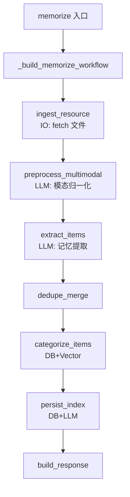
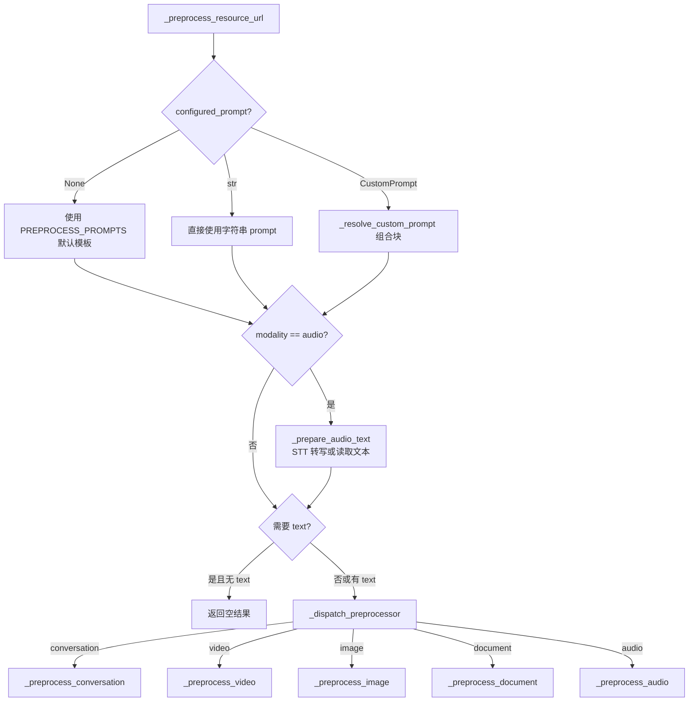
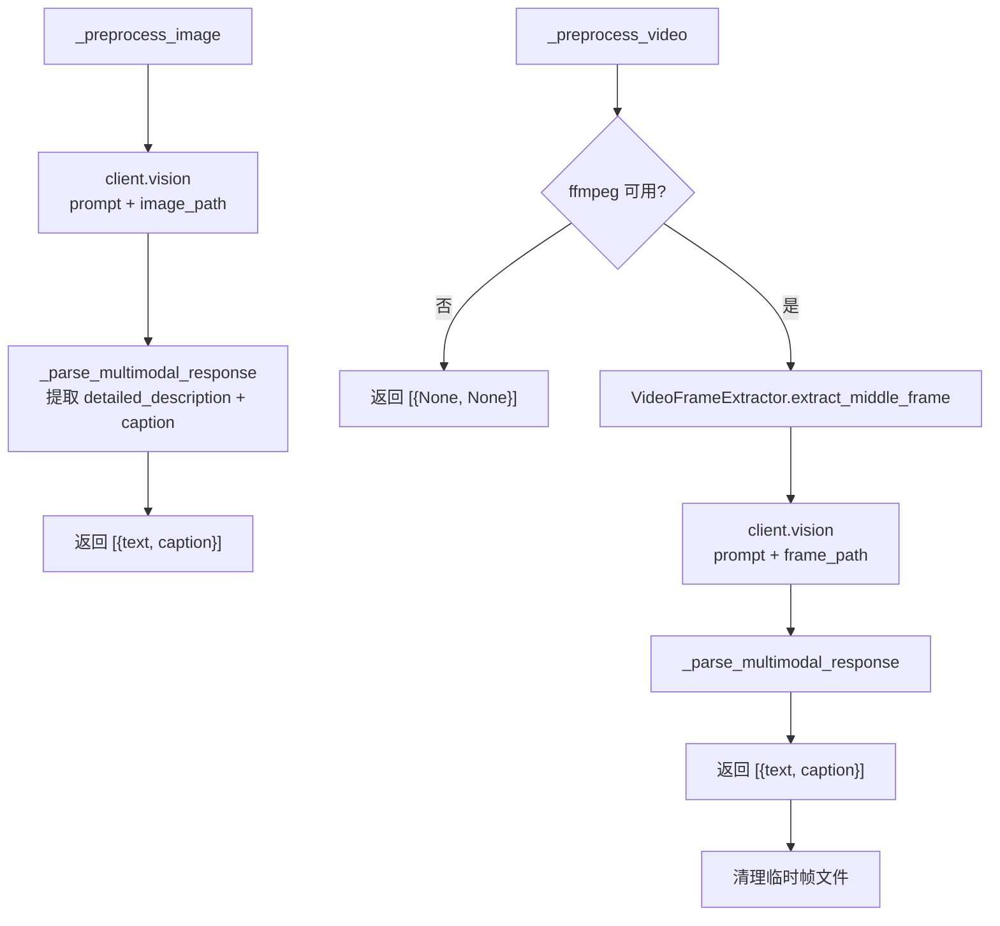
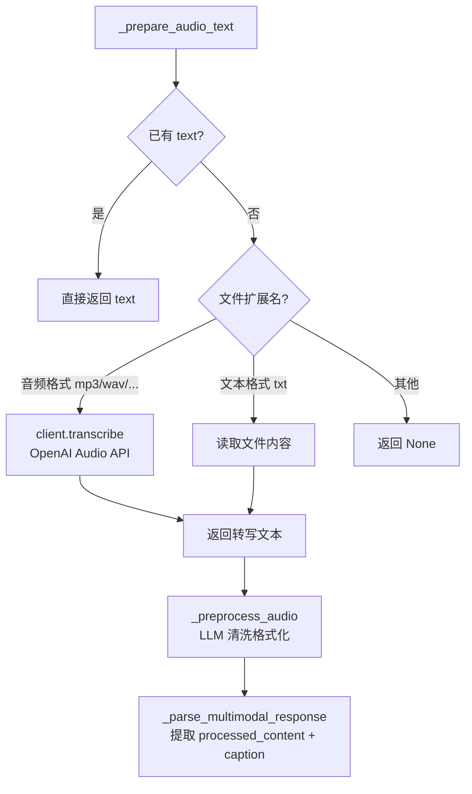

# PD-528.01 memU — 五模态统一预处理管道与 LLM 驱动模态归一化

> 文档编号：PD-528.01
> 来源：memU `src/memu/app/memorize.py`, `src/memu/prompts/preprocess/`
> GitHub：https://github.com/NevaMind-AI/memU.git
> 问题域：PD-528 多模态预处理 Multimodal Preprocessing
> 状态：可复用方案

---

## 第 1 章 问题与动机

### 1.1 核心问题

记忆系统需要接收多种模态的输入——对话文本、文档、图片、视频、音频——但下游的记忆提取（memory extraction）和分类（categorization）管道只能处理文本。如何将五种异构模态统一归一化为文本表示，同时保留每种模态的语义特征（图片的视觉细节、音频的时序信息、视频的时空内容），是多模态记忆系统的核心挑战。

关键子问题：
- **模态检测与路由**：根据 `modality` 字符串将资源分发到对应的预处理器
- **非文本→文本转换**：图片需要 Vision API 描述，音频需要 STT 转写，视频需要帧提取+Vision
- **统一输出格式**：所有模态预处理后输出 `{text, caption}` 二元组，无缝对接下游
- **Prompt 可配置**：每种模态的预处理 prompt 支持用户覆盖和 CustomPrompt 块组合

### 1.2 memU 的解法概述

memU 采用 **WorkflowStep 管道 + 模态分发器 + LLM 驱动归一化** 的三层架构：

1. **7 步 WorkflowStep 管道**：`memorize` 工作流定义了 `ingest_resource → preprocess_multimodal → extract_items → dedupe_merge → categorize_items → persist_index → build_response` 七个步骤，预处理是第 2 步（`src/memu/app/memorize.py:107-115`）
2. **模态分发器 `_dispatch_preprocessor`**：根据 modality 字符串路由到 5 个专用预处理方法（`memorize.py:775-794`）
3. **LLM 驱动归一化**：图片/视频通过 Vision API、音频通过 STT API + LLM 清洗、对话/文档通过 LLM 摘要，最终统一输出 `list[dict[text, caption]]`
4. **Prompt 模板注册表**：`PREPROCESS_PROMPTS` 字典按模态注册默认 prompt，用户可通过 `MemorizeConfig.multimodal_preprocess_prompts` 覆盖（`settings.py:206-209`）
5. **XML 标签解析**：所有模态的 LLM 输出通过 `_parse_multimodal_response` 统一解析 `<detailed_description>/<processed_content>` 和 `<caption>` 标签（`memorize.py:1146-1171`）

### 1.3 设计思想

| 设计原则 | 具体实现 | 理由 | 替代方案 |
|----------|----------|------|----------|
| 模态归一化 | 所有模态预处理后输出 `{text, caption}` 二元组 | 下游管道只需处理文本，大幅降低复杂度 | 每种模态独立管道（复杂度爆炸） |
| 分发器模式 | `_dispatch_preprocessor` 按 modality 字符串路由 | 新增模态只需添加一个 elif 分支 + prompt 模板 | 策略模式注册表（过度设计） |
| Prompt 可覆盖 | `MemorizeConfig.multimodal_preprocess_prompts` 支持 str 或 CustomPrompt | 用户可微调每种模态的预处理行为 | 硬编码 prompt（不灵活） |
| 两阶段音频处理 | 先 STT 转写再 LLM 清洗格式化 | STT 输出常有标点/格式问题，LLM 清洗提升质量 | 直接用 STT 原始输出（质量差） |
| 视频帧采样 | ffmpeg 提取中间帧 → Vision API 分析 | 单帧足以获取视频主题，成本可控 | 多帧分析（成本高）或全视频理解（API 不支持） |

---

## 第 2 章 源码实现分析

### 2.1 架构概览

memU 的多模态预处理位于 7 步 memorize 工作流的第 2 步，整体架构如下：

```
┌─────────────────────────────────────────────────────────────────┐
│                    Memorize Workflow (7 steps)                   │
├─────────┬──────────────┬──────────┬───────┬──────┬──────┬──────┤
│ ingest  │ preprocess   │ extract  │dedupe │categ.│persist│build │
│ resource│ multimodal   │ items    │merge  │items │index  │resp. │
│ (IO)    │ (LLM)        │ (LLM)   │       │(DB)  │(DB)   │      │
└─────────┴──────┬───────┴──────────┴───────┴──────┴──────┴──────┘
                 │
    ┌────────────┴────────────────────────┐
    │   _preprocess_resource_url          │
    │   (模态分发入口)                      │
    ├─────────────────────────────────────┤
    │ 1. 查找 prompt 模板                  │
    │ 2. 音频特殊处理: STT 转写            │
    │ 3. 文本模态检查: 需要 text 才继续     │
    │ 4. 调用 _dispatch_preprocessor       │
    └────────────┬────────────────────────┘
                 │
    ┌────────────┴────────────────────────┐
    │   _dispatch_preprocessor            │
    │   (五路模态分发)                      │
    ├──────┬──────┬──────┬──────┬─────────┤
    │conv. │video │image │doc.  │audio    │
    │      │      │      │      │(已转写)  │
    ├──────┴──────┴──────┴──────┴─────────┤
    │ 统一输出: list[{text, caption}]      │
    └─────────────────────────────────────┘
```

### 2.2 核心实现

#### 2.2.1 WorkflowStep 定义与预处理步骤注册



对应源码 `src/memu/app/memorize.py:97-166`：

```python
def _build_memorize_workflow(self) -> list[WorkflowStep]:
    steps = [
        WorkflowStep(
            step_id="ingest_resource",
            role="ingest",
            handler=self._memorize_ingest_resource,
            requires={"resource_url", "modality"},
            produces={"local_path", "raw_text"},
            capabilities={"io"},
        ),
        WorkflowStep(
            step_id="preprocess_multimodal",
            role="preprocess",
            handler=self._memorize_preprocess_multimodal,
            requires={"local_path", "modality", "raw_text"},
            produces={"preprocessed_resources"},
            capabilities={"llm"},
            config={"chat_llm_profile": self.memorize_config.preprocess_llm_profile},
        ),
        # ... extract_items, dedupe_merge, categorize_items, persist_index, build_response
    ]
    return steps
```

每个 WorkflowStep 声明 `requires`/`produces` 键集合，运行时 `run_steps`（`workflow/step.py:50-101`）会校验前置键是否存在，确保管道数据流完整。`preprocess_multimodal` 步骤通过 `config.chat_llm_profile` 指定使用哪个 LLM profile，支持为预处理单独配置模型。

#### 2.2.2 模态分发器与预处理入口



对应源码 `src/memu/app/memorize.py:689-735`：

```python
async def _preprocess_resource_url(
    self, *, local_path: str, text: str | None, modality: str, llm_client: Any | None = None
) -> list[dict[str, str | None]]:
    configured_prompt = self.memorize_config.multimodal_preprocess_prompts.get(modality)
    if configured_prompt is None:
        template = PREPROCESS_PROMPTS.get(modality)
    elif isinstance(configured_prompt, str):
        template = configured_prompt
    else:
        template = self._resolve_custom_prompt(configured_prompt, {})

    if not template:
        return [{"text": text, "caption": None}]

    if modality == "audio":
        text = await self._prepare_audio_text(local_path, text, llm_client=llm_client)
        if text is None:
            return [{"text": None, "caption": None}]

    if self._modality_requires_text(modality) and not text:
        return [{"text": text, "caption": None}]

    return await self._dispatch_preprocessor(
        modality=modality, local_path=local_path, text=text,
        template=template, llm_client=llm_client,
    )
```

关键设计点：
- **三级 prompt 解析**：`None` → 默认模板，`str` → 直接使用，`CustomPrompt` → ordinal 排序组合块（`memorize.py:410-422`）
- **音频前置处理**：音频模态在分发前先调用 `_prepare_audio_text` 完成 STT 转写（`memorize.py:737-770`）
- **文本模态守卫**：`conversation` 和 `document` 必须有 text 才继续（`memorize.py:772-773`）

#### 2.2.3 图片/视频 Vision API 调用



对应源码 `src/memu/app/memorize.py:891-908`（图片）和 `memorize.py:845-889`（视频）：

```python
async def _preprocess_image(
    self, local_path: str, template: str, llm_client: Any | None = None
) -> list[dict[str, str | None]]:
    client = llm_client or self._get_llm_client()
    processed = await client.vision(prompt=template, image_path=local_path, system_prompt=None)
    description, caption = self._parse_multimodal_response(processed, "detailed_description", "caption")
    return [{"text": description, "caption": caption}]

async def _preprocess_video(
    self, local_path: str, template: str, llm_client: Any | None = None
) -> list[dict[str, str | None]]:
    try:
        if not VideoFrameExtractor.is_ffmpeg_available():
            return [{"text": None, "caption": None}]
        frame_path = VideoFrameExtractor.extract_middle_frame(local_path)
        try:
            client = llm_client or self._get_llm_client()
            processed = await client.vision(prompt=template, image_path=frame_path, system_prompt=None)
            description, caption = self._parse_multimodal_response(processed, "detailed_description", "caption")
            return [{"text": description, "caption": caption}]
        finally:
            pathlib.Path(frame_path).unlink(missing_ok=True)
    except Exception:
        return [{"text": None, "caption": None}]
```

Vision API 调用链：`LLMClientWrapper.vision`（`wrapper.py:308-338`）→ `OpenAISDKClient.vision`（`openai_sdk.py:89-153`），后者将图片 base64 编码后通过 OpenAI Chat Completions API 的 `image_url` content part 发送。

#### 2.2.4 音频两阶段处理



对应源码 `src/memu/app/memorize.py:737-770`：

```python
async def _prepare_audio_text(self, local_path: str, text: str | None, llm_client: Any | None = None) -> str | None:
    if text:
        return text
    audio_extensions = {".mp3", ".mp4", ".mpeg", ".mpga", ".m4a", ".wav", ".webm"}
    text_extensions = {".txt", ".text"}
    file_ext = pathlib.Path(local_path).suffix.lower()

    if file_ext in audio_extensions:
        try:
            client = llm_client or self._get_llm_client()
            transcribed = cast(str, await client.transcribe(local_path))
        except Exception:
            logger.exception("Audio transcription failed for %s", local_path)
            return None
        else:
            return transcribed

    if file_ext in text_extensions:
        return pathlib.Path(local_path).read_text(encoding="utf-8")
    return None
```

STT 调用链：`LLMClientWrapper.transcribe`（`wrapper.py:354-385`）→ `OpenAISDKClient.transcribe`（`openai_sdk.py:172-218`），使用 `gpt-4o-mini-transcribe` 模型。转写完成后，`_preprocess_audio` 再用 LLM 清洗格式化（`memorize.py:920-928`）。

### 2.3 实现细节

**Prompt 模板注册表**（`src/memu/prompts/preprocess/__init__.py:1-11`）：

```python
PROMPTS: dict[str, str] = {
    "conversation": conversation.PROMPT.strip(),
    "video": video.PROMPT.strip(),
    "image": image.PROMPT.strip(),
    "document": document.PROMPT.strip(),
    "audio": audio.PROMPT.strip(),
}
```

每种模态有独立的 prompt 模块（`preprocess/image.py`, `preprocess/video.py`, `preprocess/audio.py` 等），prompt 使用 XML 标签约束输出格式（如 `<detailed_description>`, `<caption>`, `<processed_content>`）。

**统一响应解析**（`memorize.py:1146-1171`）：`_parse_multimodal_response` 通过正则提取 XML 标签内容，带双重 fallback——无标签时用原始响应作 content，无 caption 时取 content 首句。

**LLMClientWrapper 拦截器**（`wrapper.py:226-505`）：所有 LLM 调用（chat/vision/embed/transcribe）经过 `LLMClientWrapper` 代理，支持 before/after/on_error 三阶段拦截器，实现全链路追踪和 token 计量。

**LocalFS 资源获取**（`blob/local_fs.py:57-80`）：`fetch` 方法根据 modality 决定是否读取文本内容——`conversation`/`document` 模态返回文本，其他模态只返回本地路径。

**VideoFrameExtractor**（`utils/video.py:15-271`）：封装 ffmpeg 调用，提供 `extract_middle_frame`（单帧）和 `extract_multiple_frames`（多帧）两种模式，带路径安全校验（防止 CLI 注入）和临时文件清理。


---

## 第 3 章 迁移指南

### 3.1 迁移清单

**阶段 1：基础模态分发（1 个文件）**
- [ ] 定义 `PreprocessResult = TypedDict("PreprocessResult", text=str|None, caption=str|None)`
- [ ] 实现 `preprocess_resource(modality, local_path, text, llm_client)` 分发函数
- [ ] 为 conversation/document 实现文本直通预处理

**阶段 2：Vision 模态（2 个文件）**
- [ ] 集成 OpenAI Vision API（或兼容 API），实现 `vision(prompt, image_path)` 方法
- [ ] 实现图片预处理：读取图片 → base64 编码 → Vision API → XML 解析
- [ ] 实现视频预处理：ffmpeg 帧提取 → Vision API → 清理临时文件

**阶段 3：音频模态（1 个文件）**
- [ ] 集成 OpenAI Audio API（或 Whisper），实现 `transcribe(audio_path)` 方法
- [ ] 实现两阶段音频处理：STT 转写 → LLM 格式化清洗

**阶段 4：Prompt 可配置化**
- [ ] 定义 prompt 模板注册表（dict[modality, str]）
- [ ] 支持用户通过配置覆盖默认 prompt
- [ ] 可选：实现 CustomPrompt 块组合（ordinal 排序）

### 3.2 适配代码模板

```python
"""可直接复用的多模态预处理分发器模板"""
from __future__ import annotations
import base64
import pathlib
from typing import Any, TypedDict

class PreprocessResult(TypedDict):
    text: str | None
    caption: str | None

# 默认 prompt 模板注册表
PREPROCESS_PROMPTS: dict[str, str] = {
    "image": "Analyze the image. Output <detailed_description>...</detailed_description><caption>...</caption>",
    "video": "Analyze the video frame. Output <detailed_description>...</detailed_description><caption>...</caption>",
    "audio": "Clean the transcription. Output <processed_content>...</processed_content><caption>...</caption>",
    "document": "Condense the document. Output <processed_content>...</processed_content><caption>...</caption>",
    "conversation": "Segment the conversation. Output <conversation>...</conversation>",
}

async def preprocess_resource(
    modality: str,
    local_path: str,
    text: str | None,
    llm_client: Any,
    prompt_overrides: dict[str, str] | None = None,
) -> list[PreprocessResult]:
    """模态分发入口 — 移植自 memU _preprocess_resource_url"""
    template = (prompt_overrides or {}).get(modality) or PREPROCESS_PROMPTS.get(modality)
    if not template:
        return [{"text": text, "caption": None}]

    # 音频前置：STT 转写
    if modality == "audio" and not text:
        text = await llm_client.transcribe(local_path)
        if not text:
            return [{"text": None, "caption": None}]

    # 文本模态守卫
    if modality in ("conversation", "document") and not text:
        return [{"text": text, "caption": None}]

    # 分发到具体预处理器
    if modality == "image":
        return await _preprocess_image(local_path, template, llm_client)
    if modality == "video":
        return await _preprocess_video(local_path, template, llm_client)
    if modality in ("audio", "document"):
        return await _preprocess_text_with_llm(text, template, modality, llm_client)
    if modality == "conversation":
        return await _preprocess_conversation(text, template, llm_client)
    return [{"text": text, "caption": None}]

async def _preprocess_image(
    local_path: str, template: str, llm_client: Any
) -> list[PreprocessResult]:
    response = await llm_client.vision(prompt=template, image_path=local_path)
    description, caption = _parse_xml_response(response, "detailed_description", "caption")
    return [{"text": description, "caption": caption}]

async def _preprocess_video(
    local_path: str, template: str, llm_client: Any
) -> list[PreprocessResult]:
    import subprocess, tempfile
    # 提取中间帧
    duration_cmd = ["ffprobe", "-v", "error", "-show_entries", "format=duration",
                    "-of", "default=noprint_wrappers=1:nokey=1", local_path]
    duration = float(subprocess.run(duration_cmd, capture_output=True, text=True, check=True).stdout.strip())
    with tempfile.NamedTemporaryFile(suffix=".jpg", delete=False) as tmp:
        frame_path = tmp.name
    subprocess.run(["ffmpeg", "-ss", str(duration / 2), "-i", local_path,
                    "-vframes", "1", "-q:v", "2", "-y", frame_path], check=True, capture_output=True)
    try:
        result = await _preprocess_image(frame_path, template, llm_client)
    finally:
        pathlib.Path(frame_path).unlink(missing_ok=True)
    return result

async def _preprocess_text_with_llm(
    text: str, template: str, modality: str, llm_client: Any
) -> list[PreprocessResult]:
    placeholder = "transcription" if modality == "audio" else "document_text"
    prompt = template.format(**{placeholder: text})
    response = await llm_client.chat(prompt)
    content, caption = _parse_xml_response(response, "processed_content", "caption")
    return [{"text": content or text, "caption": caption}]

def _parse_xml_response(raw: str, content_tag: str, caption_tag: str) -> tuple[str | None, str | None]:
    """统一 XML 标签解析 — 移植自 memU _parse_multimodal_response"""
    import re
    content = _extract_tag(raw, content_tag)
    caption = _extract_tag(raw, caption_tag)
    if not content:
        content = raw.strip()
    if not caption and content:
        caption = content.split(".")[0][:200]
    return content, caption

def _extract_tag(raw: str, tag: str) -> str | None:
    import re
    m = re.search(rf"<{tag}>(.*?)</{tag}>", raw, re.IGNORECASE | re.DOTALL)
    return m.group(1).strip() if m else None
```

### 3.3 适用场景

| 场景 | 适用度 | 说明 |
|------|--------|------|
| 多模态记忆/知识库系统 | ⭐⭐⭐ | 核心场景，五模态归一化后统一入库 |
| RAG 系统多模态文档处理 | ⭐⭐⭐ | 图片/音频/视频文档需要文本化后才能检索 |
| 聊天机器人多模态输入 | ⭐⭐ | 用户发送图片/语音消息时需要理解内容 |
| 纯文本 Agent 系统 | ⭐ | 只有 conversation/document 模态，预处理层过重 |
| 实时视频流分析 | ⭐ | memU 方案是单帧采样，不适合连续视频流 |

---

## 第 4 章 测试用例

```python
"""基于 memU 真实函数签名的测试用例"""
import pytest
from unittest.mock import AsyncMock, MagicMock, patch

class TestPreprocessResourceUrl:
    """测试 _preprocess_resource_url 模态分发逻辑"""

    @pytest.fixture
    def mixin(self):
        """构造 MemorizeMixin 测试实例"""
        obj = MagicMock()
        obj.memorize_config = MagicMock()
        obj.memorize_config.multimodal_preprocess_prompts = {}
        obj._get_llm_client = MagicMock(return_value=AsyncMock())
        obj._escape_prompt_value = lambda self, v: v
        obj._resolve_custom_prompt = MagicMock(return_value="custom prompt")
        return obj

    @pytest.mark.asyncio
    async def test_image_modality_calls_vision_api(self):
        """图片模态应调用 Vision API 并返回 {text, caption}"""
        mock_client = AsyncMock()
        mock_client.vision = AsyncMock(return_value="<detailed_description>A cat</detailed_description><caption>Cat photo</caption>")
        result = await _preprocess_image("/tmp/test.jpg", "Analyze image", mock_client)
        assert result == [{"text": "A cat", "caption": "Cat photo"}]
        mock_client.vision.assert_called_once()

    @pytest.mark.asyncio
    async def test_audio_two_stage_processing(self):
        """音频模态应先 STT 转写再 LLM 清洗"""
        mock_client = AsyncMock()
        mock_client.transcribe = AsyncMock(return_value="hello world")
        mock_client.chat = AsyncMock(return_value="<processed_content>Hello, world.</processed_content><caption>Greeting</caption>")
        result = await preprocess_resource("audio", "/tmp/test.mp3", None, mock_client)
        mock_client.transcribe.assert_called_once_with("/tmp/test.mp3")
        assert result[0]["text"] == "Hello, world."
        assert result[0]["caption"] == "Greeting"

    @pytest.mark.asyncio
    async def test_text_modality_requires_text(self):
        """conversation/document 模态无 text 时应返回空结果"""
        mock_client = AsyncMock()
        result = await preprocess_resource("conversation", "/tmp/test.json", None, mock_client)
        assert result == [{"text": None, "caption": None}]

    @pytest.mark.asyncio
    async def test_unknown_modality_passthrough(self):
        """未知模态应直通返回原始 text"""
        mock_client = AsyncMock()
        result = await preprocess_resource("unknown_type", "/tmp/test.bin", "raw data", mock_client)
        assert result == [{"text": "raw data", "caption": None}]

    @pytest.mark.asyncio
    async def test_prompt_override(self):
        """用户自定义 prompt 应覆盖默认模板"""
        mock_client = AsyncMock()
        mock_client.vision = AsyncMock(return_value="<detailed_description>Custom</detailed_description><caption>C</caption>")
        custom = {"image": "My custom prompt"}
        result = await preprocess_resource("image", "/tmp/test.jpg", None, mock_client, prompt_overrides=custom)
        assert result[0]["text"] == "Custom"

class TestParseXmlResponse:
    """测试 XML 标签解析与 fallback"""

    def test_normal_xml_parsing(self):
        raw = "<detailed_description>A dog</detailed_description><caption>Dog</caption>"
        content, caption = _parse_xml_response(raw, "detailed_description", "caption")
        assert content == "A dog"
        assert caption == "Dog"

    def test_fallback_no_tags(self):
        raw = "Just plain text response"
        content, caption = _parse_xml_response(raw, "detailed_description", "caption")
        assert content == "Just plain text response"
        assert caption == "Just plain text response"  # 首句 fallback

    def test_fallback_no_caption(self):
        raw = "<detailed_description>Long description here. More details.</detailed_description>"
        content, caption = _parse_xml_response(raw, "detailed_description", "caption")
        assert content == "Long description here. More details."
        assert caption == "Long description here"

class TestVideoFrameExtractor:
    """测试视频帧提取的边界情况"""

    def test_ffmpeg_not_available(self):
        with patch("shutil.which", return_value=None):
            from memu.utils.video import VideoFrameExtractor
            # 当 ffmpeg 不可用时应返回 False
            with patch.object(VideoFrameExtractor, "_run_ffmpeg_command", side_effect=FileNotFoundError):
                assert VideoFrameExtractor.is_ffmpeg_available() is False

    def test_safe_path_validation(self):
        from memu.utils.video import VideoFrameExtractor
        with pytest.raises(ValueError, match="Unsafe path"):
            VideoFrameExtractor._ensure_safe_cli_path(pathlib.Path("-malicious"))
```


---

## 第 5 章 跨域关联

| 关联域 | 关系类型 | 说明 |
|--------|----------|------|
| PD-01 上下文管理 | 协同 | 预处理后的文本摘要直接影响下游 token 消耗；caption 作为压缩表示可用于上下文窗口管理 |
| PD-04 工具系统 | 依赖 | Vision API、STT API、ffmpeg 都是工具调用；memU 通过 LLMClientWrapper 统一封装 |
| PD-06 记忆持久化 | 协同 | 预处理输出的 `{text, caption}` 直接进入记忆提取和持久化管道；caption 用于 Resource 的 embedding |
| PD-10 中间件管道 | 依赖 | 预处理是 WorkflowStep 管道的第 2 步，依赖 WorkflowStep 的 requires/produces 数据流校验 |
| PD-11 可观测性 | 协同 | LLMClientWrapper 的拦截器机制为所有模态的 LLM 调用提供 token 计量和延迟追踪 |
| PD-521 去重与强化 | 协同 | 预处理后的文本进入 dedupe_merge 步骤，与记忆去重机制衔接 |

---

## 第 6 章 来源文件索引

| 文件 | 行范围 | 关键实现 |
|------|--------|----------|
| `src/memu/app/memorize.py` | L65-96 | `memorize` 入口方法，构建 WorkflowState |
| `src/memu/app/memorize.py` | L97-166 | `_build_memorize_workflow` 七步管道定义 |
| `src/memu/app/memorize.py` | L186-197 | `_memorize_preprocess_multimodal` 预处理步骤 handler |
| `src/memu/app/memorize.py` | L689-735 | `_preprocess_resource_url` 模态分发入口 |
| `src/memu/app/memorize.py` | L737-770 | `_prepare_audio_text` 音频 STT 转写 |
| `src/memu/app/memorize.py` | L775-794 | `_dispatch_preprocessor` 五路模态分发 |
| `src/memu/app/memorize.py` | L845-889 | `_preprocess_video` 视频帧提取+Vision |
| `src/memu/app/memorize.py` | L891-908 | `_preprocess_image` 图片 Vision API |
| `src/memu/app/memorize.py` | L910-928 | `_preprocess_document` / `_preprocess_audio` 文本 LLM 处理 |
| `src/memu/app/memorize.py` | L1146-1171 | `_parse_multimodal_response` 统一 XML 解析 |
| `src/memu/app/settings.py` | L92-99 | `LazyLLMSource` VLM/STT 模型配置 |
| `src/memu/app/settings.py` | L204-209 | `MemorizeConfig.multimodal_preprocess_prompts` |
| `src/memu/prompts/preprocess/__init__.py` | L1-11 | `PREPROCESS_PROMPTS` 五模态 prompt 注册表 |
| `src/memu/prompts/preprocess/image.py` | L1-34 | 图片预处理 prompt 模板 |
| `src/memu/prompts/preprocess/video.py` | L1-35 | 视频预处理 prompt 模板 |
| `src/memu/prompts/preprocess/audio.py` | L1-35 | 音频预处理 prompt 模板 |
| `src/memu/llm/openai_sdk.py` | L89-153 | `OpenAISDKClient.vision` Vision API 调用 |
| `src/memu/llm/openai_sdk.py` | L172-218 | `OpenAISDKClient.transcribe` STT 调用 |
| `src/memu/llm/wrapper.py` | L226-505 | `LLMClientWrapper` 拦截器代理 |
| `src/memu/utils/video.py` | L15-271 | `VideoFrameExtractor` ffmpeg 帧提取 |
| `src/memu/blob/local_fs.py` | L57-80 | `LocalFS.fetch` 资源获取与模态感知文本读取 |
| `src/memu/utils/conversation.py` | L7-69 | `format_conversation_for_preprocess` JSON 对话格式化 |
| `src/memu/workflow/step.py` | L17-48 | `WorkflowStep` 数据类定义 |

---

## 第 7 章 横向对比维度

```json comparison_data
{
  "project": "memU",
  "dimensions": {
    "模态覆盖": "conversation/document/image/video/audio 五模态全覆盖",
    "归一化策略": "LLM 驱动：Vision API + STT + LLM 清洗统一输出 {text, caption}",
    "视频处理": "ffmpeg 中间帧提取 → Vision API 单帧分析",
    "音频处理": "两阶段：OpenAI STT 转写 → LLM 格式化清洗",
    "Prompt 配置": "三级解析：默认模板 / 字符串覆盖 / CustomPrompt ordinal 块组合",
    "输出格式": "统一 list[{text, caption}] 二元组，XML 标签解析 + 双重 fallback"
  }
}
```

### 域元数据补充

```json domain_metadata
{
  "solution_summary": "memU 通过 WorkflowStep 管道 + 五路模态分发器，用 Vision API/STT/LLM 将 conversation/document/image/video/audio 统一归一化为 {text, caption} 二元组",
  "description": "非文本模态通过 LLM 驱动的归一化转换为文本摘要后统一进入下游处理管道",
  "sub_problems": [
    "视频帧采样策略（单帧 vs 多帧 vs 关键帧）",
    "预处理 LLM profile 独立配置（与提取/分类步骤使用不同模型）"
  ],
  "best_practices": [
    "音频采用两阶段处理：STT 转写 + LLM 格式化清洗，提升转写质量",
    "所有模态 LLM 输出用 XML 标签约束格式，配合双重 fallback 解析保证鲁棒性",
    "视频处理后立即清理临时帧文件，防止磁盘泄漏"
  ]
}
```
