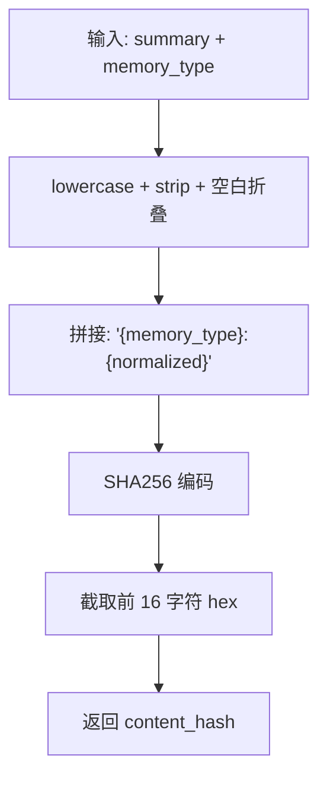
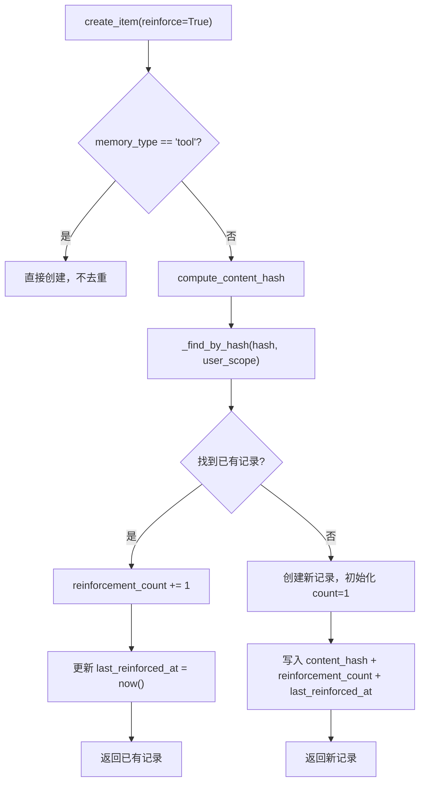
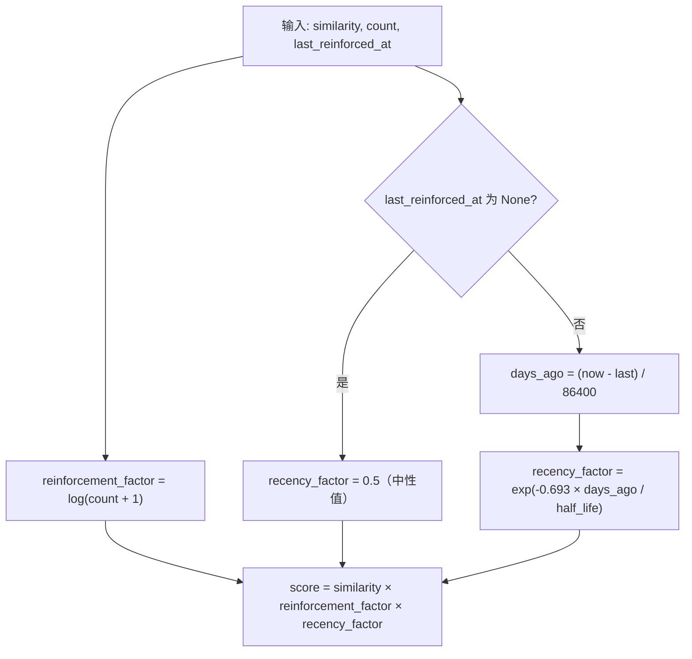

# PD-529.01 memU — SHA256 内容哈希去重与 Salience 强化评分

> 文档编号：PD-529.01
> 来源：memU `src/memu/database/models.py`, `src/memu/database/inmemory/vector.py`, `src/memu/database/inmemory/repositories/memory_item_repo.py`
> GitHub：https://github.com/NevaMind-AI/memU.git
> 问题域：PD-529 记忆去重与强化 Deduplication & Reinforcement
> 状态：可复用方案

---

## 第 1 章 问题与动机

### 1.1 核心问题

Agent 记忆系统在持续运行中会反复接收语义相同的信息。如果不做去重，记忆库会膨胀出大量冗余条目，导致检索噪声增大、存储浪费、以及 LLM 上下文被无关重复内容占据。同时，被反复提及的信息往往更重要——系统需要一种机制将"重复"转化为"重要性信号"，而非简单丢弃。

检索排序也不能只依赖向量相似度。一条高度相关但半年前只出现过一次的记忆，和一条相关度稍低但最近被反复强化的记忆，后者往往更值得优先返回。

### 1.2 memU 的解法概述

memU 采用三层协同机制解决去重与强化问题：

1. **内容归一化哈希**：对 LLM 提取的摘要文本做 `lowercase + 空白折叠 + memory_type 前缀`，再取 SHA256 前 16 字符作为 `content_hash`（`src/memu/database/models.py:15-32`）
2. **写入时去重 + 强化计数**：`create_item_reinforce()` 在写入前按 `content_hash + user_scope` 查找已有记录，命中则递增 `reinforcement_count` 并更新 `last_reinforced_at`，未命中才创建新条目（`src/memu/database/inmemory/repositories/memory_item_repo.py:122-167`）
3. **Salience 评分检索**：检索时可选 `ranking="salience"` 模式，用 `similarity × log(reinforcement_count + 1) × exp(-0.693 × days / half_life)` 公式综合排序（`src/memu/database/inmemory/vector.py:16-53`）

### 1.3 设计思想

| 设计原则 | 具体实现 | 理由 | 替代方案 |
|----------|----------|------|----------|
| 摘要级哈希 | 对 LLM 摘要而非原文做 SHA256 | 原文格式多变（换行、标点），摘要已归一化语义 | 对原文做 SimHash / MinHash |
| 截断哈希 | 取 SHA256 前 16 字符（64 bit） | 存储在 JSON extra 字段中，16 字符足够避免碰撞 | 全长 64 字符哈希 |
| 写入时拦截 | 在 `create_item` 入口判断 reinforce 标志 | 避免先写后删的两步操作，原子性更好 | 后台异步去重任务 |
| 对数抑制 | `log(count + 1)` 而非线性 count | 防止高频重复项垄断排序，count=100 和 count=1000 差距不大 | 线性加权 / 平方根 |
| 半衰期衰减 | `exp(-0.693 × days / T)` | 物理半衰期公式，T 天后因子降为 0.5，语义直观 | 线性衰减 / 阶梯衰减 |
| 配置驱动 | `enable_item_reinforcement` 开关 + `recency_decay_days` 参数 | 不同场景需要不同策略，默认关闭不影响已有用户 | 硬编码策略 |

---

## 第 2 章 源码实现分析

### 2.1 架构概览

memU 的去重与强化系统横跨三层：模型层（哈希计算）、仓库层（去重写入）、向量层（Salience 检索）。三个后端（InMemory / SQLite / Postgres）共享同一套逻辑。

```
┌─────────────────────────────────────────────────────────┐
│                    MemorizeMixin                         │
│  memorize() → _persist_memory_items()                   │
│       ↓ reinforce=config.enable_item_reinforcement      │
├─────────────────────────────────────────────────────────┤
│              MemoryItemRepo (Protocol)                   │
│  create_item(reinforce=True) → create_item_reinforce()  │
├──────────┬──────────────┬───────────────────────────────┤
│ InMemory │   SQLite     │   Postgres                    │
│ dict查找  │ json_extract │ extra->>'content_hash'        │
├──────────┴──────────────┴───────────────────────────────┤
│              models.py: compute_content_hash()           │
│              vector.py: salience_score()                 │
│              vector.py: cosine_topk_salience()           │
└─────────────────────────────────────────────────────────┘
```

### 2.2 核心实现

#### 2.2.1 内容哈希计算



对应源码 `src/memu/database/models.py:15-32`：

```python
def compute_content_hash(summary: str, memory_type: str) -> str:
    """
    Generate unique hash for memory deduplication.

    Operates on post-summary content. Normalizes whitespace to handle
    minor formatting differences like "I love coffee" vs "I  love  coffee".
    """
    # Normalize: lowercase, strip, collapse whitespace
    normalized = " ".join(summary.lower().split())
    content = f"{memory_type}:{normalized}"
    return hashlib.sha256(content.encode()).hexdigest()[:16]
```

关键设计点：
- `" ".join(summary.lower().split())` 一行完成三件事：转小写、去首尾空白、折叠连续空白为单空格
- `memory_type` 作为前缀参与哈希，确保不同类型的相同文本不会被误判为重复
- 截取 16 字符（64 bit 熵），在单用户记忆库规模下碰撞概率极低

#### 2.2.2 写入时去重与强化



对应源码 `src/memu/database/inmemory/repositories/memory_item_repo.py:122-167`：

```python
def create_item_reinforce(
    self,
    *,
    resource_id: str,
    memory_type: MemoryType,
    summary: str,
    embedding: list[float],
    user_data: dict[str, Any],
    reinforce: bool = False,
) -> MemoryItem:
    content_hash = compute_content_hash(summary, memory_type)

    # Check for existing item with same hash in same scope (deduplication)
    existing = self._find_by_hash(content_hash, user_data)
    if existing:
        # Reinforce existing memory instead of creating duplicate
        current_extra = existing.extra or {}
        current_count = current_extra.get("reinforcement_count", 1)
        existing.extra = {
            **current_extra,
            "reinforcement_count": current_count + 1,
            "last_reinforced_at": pendulum.now("UTC").isoformat(),
        }
        existing.updated_at = pendulum.now("UTC")
        return existing

    # Create new item with salience tracking in extra
    mid = str(uuid.uuid4())
    now = pendulum.now("UTC")
    item_extra = user_data.pop("extra", {}) if "extra" in user_data else {}
    item_extra.update({
        "content_hash": content_hash,
        "reinforcement_count": 1,
        "last_reinforced_at": now.isoformat(),
    })
    it = self.memory_item_model(
        id=mid, resource_id=resource_id, memory_type=memory_type,
        summary=summary, embedding=embedding, extra=item_extra, **user_data,
    )
    self.items[mid] = it
    return it
```

#### 2.2.3 Salience 评分公式



对应源码 `src/memu/database/inmemory/vector.py:16-53`：

```python
def salience_score(
    similarity: float,
    reinforcement_count: int,
    last_reinforced_at: datetime | None,
    recency_decay_days: float = 30.0,
) -> float:
    """
    Compute salience-aware score combining similarity, reinforcement, and recency.
    Formula: similarity * reinforcement_factor * recency_factor
    """
    # Reinforcement factor (logarithmic to prevent runaway scores)
    reinforcement_factor = math.log(reinforcement_count + 1)

    # Recency factor (exponential decay with half-life)
    if last_reinforced_at is None:
        recency_factor = 0.5  # Unknown recency gets neutral score
    else:
        now = datetime.now(last_reinforced_at.tzinfo) if last_reinforced_at.tzinfo else datetime.utcnow()
        days_ago = (now - last_reinforced_at).total_seconds() / 86400
        # 0.693 = ln(2), gives us proper half-life decay
        recency_factor = math.exp(-0.693 * days_ago / recency_decay_days)

    return similarity * reinforcement_factor * recency_factor
```

### 2.3 实现细节

**三后端一致性**：InMemory 用 `_find_by_hash()` 遍历 dict；SQLite 用 `json_extract(extra, '$.content_hash')` SQL 查询（`src/memu/database/sqlite/repositories/memory_item_repo.py:309-320`）；Postgres 用 `extra->>'content_hash'` JSONB 操作符。三者逻辑完全一致，只是查询方式适配各自存储引擎。

**元数据存储在 extra 字段**：`content_hash`、`reinforcement_count`、`last_reinforced_at` 三个字段都存储在 `MemoryItem.extra` JSON 字典中（`src/memu/database/models.py:83-88`），而非独立列。这避免了 schema 迁移，但牺牲了索引效率。

**Tool 记忆豁免**：`create_item()` 中 `memory_type == "tool"` 时跳过去重（`src/memu/database/inmemory/repositories/memory_item_repo.py:90`），因为工具调用记忆有独立的 `call_hash`（MD5）去重机制（`src/memu/database/models.py:56-60`）。

**配置入口**：`MemorizeConfig.enable_item_reinforcement`（`src/memu/app/settings.py:239-242`）控制是否启用去重强化，`RetrieveItemConfig.ranking`（`src/memu/app/settings.py:160-163`）控制检索时使用 similarity 还是 salience 排序。

**OpenAI Wrapper 默认 salience**：`MemuChatCompletions` 包装器默认使用 `ranking="salience"`（`src/memu/client/openai_wrapper.py:26`），让透明记忆注入自动受益于强化排序。


---

## 第 3 章 迁移指南

### 3.1 迁移清单

**阶段 1：内容哈希去重（最小可用）**

- [ ] 实现 `compute_content_hash(summary, memory_type)` 函数
- [ ] 在记忆模型中添加 `content_hash` 字段（或 JSON extra）
- [ ] 在写入路径中添加哈希查重逻辑
- [ ] 命中时更新 `reinforcement_count` 而非创建新记录

**阶段 2：Salience 检索（增强排序）**

- [ ] 实现 `salience_score()` 评分函数
- [ ] 在向量检索接口中添加 `ranking` 参数
- [ ] 配置 `recency_decay_days` 半衰期参数

**阶段 3：配置化（生产就绪）**

- [ ] 添加 `enable_reinforcement` 开关（默认关闭，向后兼容）
- [ ] 添加 `ranking` 配置项（similarity / salience）
- [ ] 在 LLM wrapper 层默认启用 salience 排序

### 3.2 适配代码模板

以下是可直接复用的 Python 实现：

```python
import hashlib
import math
from datetime import datetime, timezone


def compute_content_hash(summary: str, memory_type: str) -> str:
    """对摘要做归一化 SHA256 哈希，返回 16 字符 hex。"""
    normalized = " ".join(summary.lower().split())
    content = f"{memory_type}:{normalized}"
    return hashlib.sha256(content.encode()).hexdigest()[:16]


def salience_score(
    similarity: float,
    reinforcement_count: int,
    last_reinforced_at: datetime | None,
    recency_decay_days: float = 30.0,
) -> float:
    """
    Salience = similarity × log(count+1) × exp(-ln2 × days / half_life)
    """
    reinforcement_factor = math.log(reinforcement_count + 1)

    if last_reinforced_at is None:
        recency_factor = 0.5
    else:
        now = datetime.now(timezone.utc)
        if last_reinforced_at.tzinfo is None:
            last_reinforced_at = last_reinforced_at.replace(tzinfo=timezone.utc)
        days_ago = (now - last_reinforced_at).total_seconds() / 86400
        recency_factor = math.exp(-0.693 * days_ago / recency_decay_days)

    return similarity * reinforcement_factor * recency_factor


class MemoryStore:
    """最小化去重 + 强化记忆存储示例。"""

    def __init__(self):
        self.items: dict[str, dict] = {}
        self._hash_index: dict[str, str] = {}  # content_hash -> item_id

    def upsert(
        self,
        summary: str,
        memory_type: str,
        embedding: list[float],
        **metadata,
    ) -> dict:
        content_hash = compute_content_hash(summary, memory_type)

        if content_hash in self._hash_index:
            item_id = self._hash_index[content_hash]
            item = self.items[item_id]
            item["reinforcement_count"] += 1
            item["last_reinforced_at"] = datetime.now(timezone.utc)
            return item

        import uuid
        item_id = str(uuid.uuid4())
        now = datetime.now(timezone.utc)
        item = {
            "id": item_id,
            "summary": summary,
            "memory_type": memory_type,
            "embedding": embedding,
            "content_hash": content_hash,
            "reinforcement_count": 1,
            "last_reinforced_at": now,
            "created_at": now,
            **metadata,
        }
        self.items[item_id] = item
        self._hash_index[content_hash] = item_id
        return item

    def search(
        self,
        query_vec: list[float],
        top_k: int = 5,
        ranking: str = "salience",
        recency_decay_days: float = 30.0,
    ) -> list[tuple[str, float]]:
        import numpy as np

        q = np.array(query_vec, dtype=np.float32)
        scored = []
        for item in self.items.values():
            v = np.array(item["embedding"], dtype=np.float32)
            sim = float(np.dot(q, v) / (np.linalg.norm(q) * np.linalg.norm(v) + 1e-9))

            if ranking == "salience":
                score = salience_score(
                    sim, item["reinforcement_count"],
                    item["last_reinforced_at"], recency_decay_days,
                )
            else:
                score = sim
            scored.append((item["id"], score))

        scored.sort(key=lambda x: x[1], reverse=True)
        return scored[:top_k]
```

### 3.3 适用场景

| 场景 | 适用度 | 说明 |
|------|--------|------|
| 长期对话 Agent | ⭐⭐⭐ | 用户反复提及偏好/事实，去重 + 强化最有价值 |
| 知识库 RAG | ⭐⭐ | 文档更新时可用哈希检测重复，但强化计数意义不大 |
| 工具调用记忆 | ⭐ | memU 自身也对 tool 类型豁免，工具调用有独立去重机制 |
| 短期会话 | ⭐ | 会话内重复少，半衰期衰减来不及生效 |
| 多用户系统 | ⭐⭐⭐ | 哈希 + user_scope 双重隔离，天然支持多租户 |

---

## 第 4 章 测试用例

```python
import math
from datetime import datetime, timedelta, timezone

import pytest


class TestComputeContentHash:
    """测试内容哈希归一化与计算。"""

    def test_basic_hash(self):
        from memu.database.models import compute_content_hash
        h = compute_content_hash("I love coffee", "profile")
        assert isinstance(h, str)
        assert len(h) == 16

    def test_whitespace_normalization(self):
        from memu.database.models import compute_content_hash
        h1 = compute_content_hash("I love coffee", "profile")
        h2 = compute_content_hash("I  love  coffee", "profile")
        h3 = compute_content_hash("  I love coffee  ", "profile")
        assert h1 == h2 == h3

    def test_case_insensitive(self):
        from memu.database.models import compute_content_hash
        h1 = compute_content_hash("I Love Coffee", "profile")
        h2 = compute_content_hash("i love coffee", "profile")
        assert h1 == h2

    def test_different_types_different_hash(self):
        from memu.database.models import compute_content_hash
        h1 = compute_content_hash("I love coffee", "profile")
        h2 = compute_content_hash("I love coffee", "event")
        assert h1 != h2


class TestSalienceScore:
    """测试 Salience 评分公式。"""

    def test_basic_score(self):
        from memu.database.inmemory.vector import salience_score
        now = datetime.now(timezone.utc)
        score = salience_score(0.9, 5, now, recency_decay_days=30.0)
        expected = 0.9 * math.log(6) * 1.0  # recency ~1.0 for now
        assert abs(score - expected) < 0.01

    def test_half_life_decay(self):
        from memu.database.inmemory.vector import salience_score
        past = datetime.now(timezone.utc) - timedelta(days=30)
        score = salience_score(1.0, 1, past, recency_decay_days=30.0)
        # After 1 half-life: recency ~0.5, reinforcement = log(2) ~0.693
        expected = 1.0 * math.log(2) * 0.5
        assert abs(score - expected) < 0.05

    def test_none_recency_neutral(self):
        from memu.database.inmemory.vector import salience_score
        score = salience_score(1.0, 1, None, recency_decay_days=30.0)
        expected = 1.0 * math.log(2) * 0.5
        assert abs(score - expected) < 0.01

    def test_log_dampening(self):
        from memu.database.inmemory.vector import salience_score
        now = datetime.now(timezone.utc)
        score_10 = salience_score(1.0, 10, now)
        score_100 = salience_score(1.0, 100, now)
        # log(101)/log(11) ≈ 1.92, not 10x
        ratio = score_100 / score_10
        assert 1.5 < ratio < 2.5


class TestDeduplication:
    """测试写入时去重与强化。"""

    def test_reinforce_increments_count(self):
        """重复写入应递增 reinforcement_count 而非创建新记录。"""
        # 需要构造 InMemoryMemoryItemRepository 实例
        # 此处为逻辑验证伪测试
        from memu.database.models import compute_content_hash
        h1 = compute_content_hash("User likes Python", "profile")
        h2 = compute_content_hash("User likes Python", "profile")
        assert h1 == h2  # 相同内容应产生相同哈希

    def test_tool_memory_bypasses_reinforce(self):
        """tool 类型记忆不走去重路径。"""
        # create_item(reinforce=True, memory_type="tool") 应直接创建
        # 验证 memory_type == "tool" 时不调用 create_item_reinforce
        pass
```


---

## 第 5 章 跨域关联

| 关联域 | 关系类型 | 说明 |
|--------|----------|------|
| PD-06 记忆持久化 | 依赖 | 去重元数据（content_hash, reinforcement_count）存储在 MemoryItem.extra JSON 字段中，依赖持久化层的 JSON 支持 |
| PD-08 搜索与检索 | 协同 | Salience 评分直接影响检索排序，`cosine_topk_salience()` 是检索管道的可选排序策略 |
| PD-01 上下文管理 | 协同 | 去重减少记忆条目数量，间接降低注入 LLM 上下文的 token 消耗 |
| PD-10 中间件管道 | 协同 | memorize 工作流中 `dedupe_merge` 是独立的 WorkflowStep（`src/memu/app/memorize.py:132-138`），可作为管道中间件扩展 |
| PD-07 质量检查 | 互补 | 强化计数可作为记忆质量的间接信号——被多次强化的记忆更可信 |

---

## 第 6 章 来源文件索引

| 文件 | 行范围 | 关键实现 |
|------|--------|----------|
| `src/memu/database/models.py` | L15-L32 | `compute_content_hash()` 归一化哈希函数 |
| `src/memu/database/models.py` | L56-L60 | `ToolCallResult.generate_hash()` 工具调用 MD5 去重 |
| `src/memu/database/models.py` | L76-L94 | `MemoryItem` 模型定义，extra 字段说明 |
| `src/memu/database/inmemory/vector.py` | L16-L53 | `salience_score()` 评分公式 |
| `src/memu/database/inmemory/vector.py` | L94-L127 | `cosine_topk_salience()` Salience 排序检索 |
| `src/memu/database/inmemory/repositories/memory_item_repo.py` | L62-L77 | `_find_by_hash()` 哈希查找 |
| `src/memu/database/inmemory/repositories/memory_item_repo.py` | L79-L120 | `create_item()` 入口，reinforce 分发 |
| `src/memu/database/inmemory/repositories/memory_item_repo.py` | L122-L167 | `create_item_reinforce()` 去重 + 强化核心逻辑 |
| `src/memu/database/inmemory/repositories/memory_item_repo.py` | L169-L196 | `vector_search_items()` 双模式检索 |
| `src/memu/database/sqlite/repositories/memory_item_repo.py` | L285-L386 | SQLite 版 `create_item_reinforce()`，json_extract 查询 |
| `src/memu/database/sqlite/repositories/memory_item_repo.py` | L477-L519 | SQLite 版 `vector_search_items()` |
| `src/memu/database/repositories/memory_item.py` | L10-L54 | `MemoryItemRepo` Protocol 接口定义 |
| `src/memu/app/settings.py` | L239-L242 | `enable_item_reinforcement` 配置项 |
| `src/memu/app/settings.py` | L160-L167 | `RetrieveItemConfig.ranking` 和 `recency_decay_days` 配置 |
| `src/memu/app/memorize.py` | L132-L138 | `dedupe_merge` WorkflowStep 定义 |
| `src/memu/app/memorize.py` | L603-L614 | `_persist_memory_items()` 中 reinforce 调用入口 |
| `src/memu/client/openai_wrapper.py` | L17-L32 | `MemuChatCompletions` 默认 salience 排序 |

---

## 第 7 章 横向对比维度

```json comparison_data
{
  "project": "memU",
  "dimensions": {
    "去重粒度": "摘要级 SHA256 前 16 字符，按 memory_type 隔离",
    "强化机制": "写入时原子递增 reinforcement_count，无后台任务",
    "评分公式": "similarity × log(count+1) × exp(-ln2 × days/T)",
    "衰减模型": "指数半衰期，默认 30 天，可配置",
    "存储方式": "extra JSON 字段存储元数据，无 schema 迁移",
    "多后端一致性": "InMemory/SQLite/Postgres 三后端共享去重逻辑"
  }
}
```

### 域元数据补充

```json domain_metadata
{
  "solution_summary": "memU 用 SHA256(归一化摘要+类型) 前 16 字符做写入时去重，命中则原子递增强化计数，检索时用 similarity×log(count+1)×半衰期衰减 三因子 Salience 排序",
  "description": "写入时拦截去重与检索时强化加权的协同设计",
  "sub_problems": [
    "多存储后端的去重查询一致性（dict遍历 vs json_extract vs JSONB）",
    "Tool 类型记忆的独立去重策略（MD5 call_hash）"
  ],
  "best_practices": [
    "memory_type 参与哈希前缀，避免跨类型误判",
    "未知 recency 给 0.5 中性值而非 0 或 1",
    "去重开关默认关闭，向后兼容已有用户"
  ]
}
```

