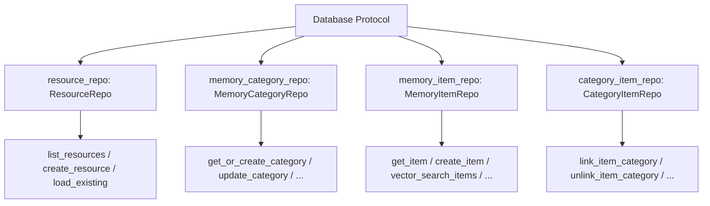
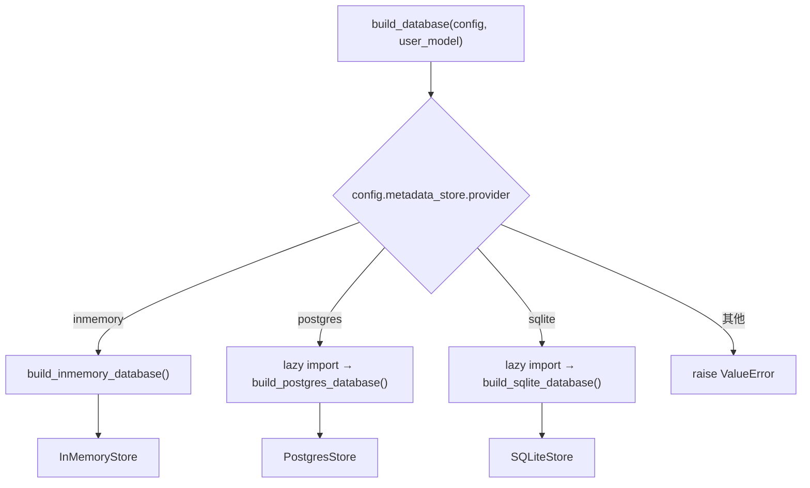
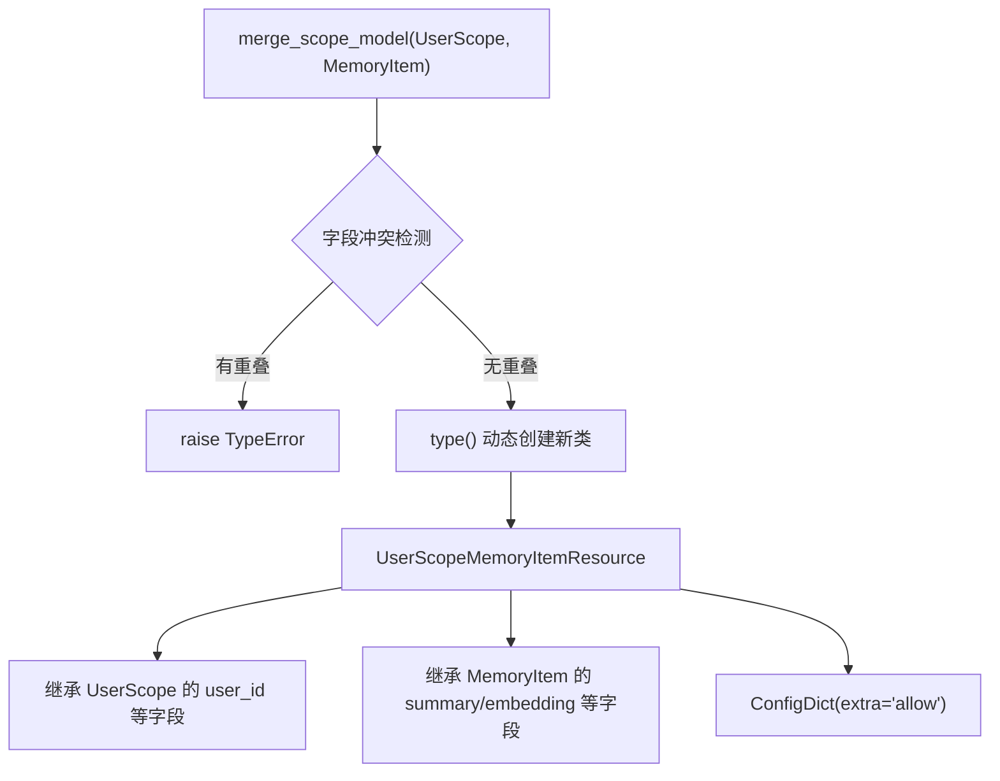

# PD-530.01 memU — Repository-Factory 可插拔存储架构

> 文档编号：PD-530.01
> 来源：memU `src/memu/database/`
> GitHub：https://github.com/NevaMind-AI/memU.git
> 问题域：PD-530 可插拔存储架构 Pluggable Storage Architecture
> 状态：可复用方案

---

## 第 1 章 问题与动机（≥ 30 行）

### 1.1 核心问题

Agent 记忆系统需要在不同部署场景下使用不同的存储后端：开发阶段用 InMemory 快速迭代，单机部署用 SQLite 轻量持久化，生产环境用 PostgreSQL + pgvector 支撑向量检索。如果存储逻辑与业务逻辑耦合，每增加一个后端就要修改上层代码，违反开闭原则。

更复杂的是，记忆系统天然具有多租户需求——不同用户的记忆必须隔离。传统做法是在每个查询中手动拼接 `WHERE user_id = ?`，容易遗漏导致数据泄露。memU 需要一种机制让作用域字段自动注入到所有存储操作中。

### 1.2 memU 的解法概述

1. **Protocol 定义接口契约** — 用 Python `typing.Protocol` 而非 ABC 定义 `Database` 和四个 `Repo` 接口，实现结构化子类型（鸭子类型 + 静态检查）(`src/memu/database/interfaces.py:12-26`)
2. **Factory 按配置实例化** — `build_database()` 工厂函数读取 `DatabaseConfig.metadata_store.provider` 字段，分发到三个后端构建函数，非默认后端使用懒导入避免依赖污染 (`src/memu/database/factory.py:15-43`)
3. **动态类型组合 (merge_scope_model)** — 运行时用 `type()` 将用户作用域 Pydantic 模型与核心记录模型合并为新类型，自动为所有表添加作用域字段 (`src/memu/database/models.py:108-121`)
4. **向量索引与元数据存储分离** — `DatabaseConfig` 将 `metadata_store` 和 `vector_index` 拆为独立配置，允许 InMemory 用 bruteforce 余弦、Postgres 用 pgvector 原生向量索引 (`src/memu/app/settings.py:310-321`)
5. **共享 DatabaseState 缓存层** — 所有后端共用 `DatabaseState` dataclass 作为内存缓存，保证上层代码通过统一的 dict 接口访问数据 (`src/memu/database/state.py:8-13`)

### 1.3 设计思想

| 设计原则 | 具体实现 | 理由 | 替代方案 |
|----------|----------|------|----------|
| 结构化子类型 | `@runtime_checkable Protocol` 定义 Database/Repo 接口 | 无需继承即可满足契约，降低耦合 | ABC 强制继承 |
| 配置驱动工厂 | `build_database()` 按 provider 字符串分发 | 新增后端只需加 elif 分支 + 懒导入 | 注册表模式 |
| 动态类型组合 | `merge_scope_model()` 运行时生成带作用域的 Pydantic 模型 | 一次定义作用域，自动注入所有表 | 手动为每个模型添加字段 |
| 存储关注点分离 | metadata_store 与 vector_index 独立配置 | 向量检索可独立升级（bruteforce→pgvector） | 单一 provider 同时管理两者 |
| 懒导入 | postgres/sqlite 后端在 elif 分支内 import | 不使用的后端不需要安装其依赖 | 顶层全量导入 |

---

## 第 2 章 源码实现分析（≥ 60 行，核心章节）

### 2.1 架构概览

memU 的存储层采用四层架构：Protocol 接口层 → Repository 实现层 → ORM/内存模型层 → 物理存储层。

```
┌─────────────────────────────────────────────────────────┐
│                    上层业务代码                           │
│              (只依赖 Database Protocol)                   │
└──────────────────────┬──────────────────────────────────┘
                       │
┌──────────────────────▼──────────────────────────────────┐
│              build_database() 工厂                        │
│     provider: "inmemory" | "postgres" | "sqlite"         │
└───┬──────────────────┬──────────────────┬───────────────┘
    │                  │                  │
┌───▼───┐        ┌────▼────┐       ┌─────▼─────┐
│InMemory│        │Postgres │       │  SQLite   │
│ Store  │        │  Store  │       │  Store    │
├────────┤        ├─────────┤       ├───────────┤
│4 Repos │        │4 Repos  │       │4 Repos    │
│dict存储 │        │SQLModel │       │SQLModel   │
│numpy向量│        │pgvector │       │bruteforce │
└───┬────┘        └────┬────┘       └─────┬─────┘
    │                  │                  │
┌───▼──────────────────▼──────────────────▼───────────────┐
│              DatabaseState (共享缓存层)                    │
│   resources: dict  items: dict  categories: dict         │
└─────────────────────────────────────────────────────────┘
```

### 2.2 核心实现

#### 2.2.1 Protocol 接口定义



对应源码 `src/memu/database/interfaces.py:12-26`：

```python
@runtime_checkable
class Database(Protocol):
    """Backend-agnostic database contract."""

    resource_repo: ResourceRepo
    memory_category_repo: MemoryCategoryRepo
    memory_item_repo: MemoryItemRepo
    category_item_repo: CategoryItemRepo

    resources: dict[str, ResourceRecord]
    items: dict[str, MemoryItemRecord]
    categories: dict[str, MemoryCategoryRecord]
    relations: list[CategoryItemRecord]

    def close(self) -> None: ...
```

四个 Repo 也用 `@runtime_checkable Protocol` 定义，例如 `MemoryItemRepo` (`src/memu/database/repositories/memory_item.py:10-54`)：

```python
@runtime_checkable
class MemoryItemRepo(Protocol):
    items: dict[str, MemoryItem]

    def get_item(self, item_id: str) -> MemoryItem | None: ...
    def list_items(self, where: Mapping[str, Any] | None = None) -> dict[str, MemoryItem]: ...
    def create_item(self, *, resource_id: str, memory_type: MemoryType,
                    summary: str, embedding: list[float],
                    user_data: dict[str, Any], reinforce: bool = False,
                    tool_record: dict[str, Any] | None = None) -> MemoryItem: ...
    def vector_search_items(self, query_vec: list[float], top_k: int,
                            where: Mapping[str, Any] | None = None) -> list[tuple[str, float]]: ...
    def load_existing(self) -> None: ...
```

#### 2.2.2 Factory 工厂分发



对应源码 `src/memu/database/factory.py:15-43`：

```python
def build_database(*, config: DatabaseConfig, user_model: type[BaseModel]) -> Database:
    provider = config.metadata_store.provider
    if provider == "inmemory":
        return build_inmemory_database(config=config, user_model=user_model)
    elif provider == "postgres":
        from memu.database.postgres import build_postgres_database
        return build_postgres_database(config=config, user_model=user_model)
    elif provider == "sqlite":
        from memu.database.sqlite import build_sqlite_database
        return build_sqlite_database(config=config, user_model=user_model)
    else:
        msg = f"Unsupported metadata_store provider: {provider}"
        raise ValueError(msg)
```

#### 2.2.3 动态类型组合 merge_scope_model



对应源码 `src/memu/database/models.py:108-121`：

```python
def merge_scope_model[TBaseRecord: BaseRecord](
    user_model: type[BaseModel], core_model: type[TBaseRecord], *, name_suffix: str
) -> type[TBaseRecord]:
    """Create a scoped model inheriting both the user scope model and the core model."""
    overlap = set(user_model.model_fields) & set(core_model.model_fields)
    if overlap:
        msg = f"Scope fields conflict with core model fields: {sorted(overlap)}"
        raise TypeError(msg)

    return type(
        f"{user_model.__name__}{core_model.__name__}{name_suffix}",
        (user_model, core_model),
        {"model_config": ConfigDict(extra="allow")},
    )
```

`build_scoped_models()` 批量调用 `merge_scope_model` 为四个核心模型注入作用域 (`src/memu/database/models.py:124-134`)。

### 2.3 实现细节

**Postgres 后端的 ORM 模型构建** — `build_table_model()` (`src/memu/database/postgres/models.py:111-154`) 不仅合并字段，还自动为作用域字段创建数据库索引：

```python
if scope_fields:
    table_args.append(Index(f"ix_{tablename}__scope", *scope_fields))
```

这确保了按 `user_id` 过滤的查询走索引而非全表扫描。

**SQLAlchemy 模型缓存** — `get_sqlalchemy_models()` (`src/memu/database/postgres/schema.py:51-101`) 使用 `_MODEL_CACHE` 字典按 scope_model 类型缓存已构建的 ORM 模型，避免重复创建。

**DatabaseConfig 自动推导向量索引** — `model_post_init` (`src/memu/app/settings.py:314-321`) 根据 metadata_store.provider 自动选择向量索引：postgres 默认用 pgvector，其他默认用 bruteforce。pgvector 的 DSN 自动复用 metadata_store 的 DSN。

**DDL 双模式迁移** — `run_migrations()` (`src/memu/database/postgres/migration.py:31-79`) 支持 `create`（自动建表 + pgvector 扩展）和 `validate`（仅校验表是否存在）两种模式，生产环境可用 validate 防止意外 DDL。

**InMemory 向量检索优化** — `cosine_topk()` (`src/memu/database/inmemory/vector.py:56-91`) 使用 numpy 矩阵化计算 + `argpartition` O(n) 选择 top-k，而非 O(n log n) 全排序。


---

## 第 3 章 迁移指南（≥ 40 行）

### 3.1 迁移清单

**阶段 1：定义接口层**
- [ ] 用 `@runtime_checkable Protocol` 定义 Database 接口和各 Repo 接口
- [ ] 定义核心记录模型（Pydantic BaseModel），包含 id/created_at/updated_at 基础字段
- [ ] 定义 `DatabaseState` dataclass 作为共享缓存容器

**阶段 2：实现 InMemory 后端**
- [ ] 实现 InMemoryStore，用 dict 存储记录
- [ ] 实现 InMemory 各 Repo，用 `matches_where()` 做内存过滤
- [ ] 实现 `cosine_topk()` 向量检索（numpy 矩阵化）

**阶段 3：实现持久化后端**
- [ ] 实现 `merge_scope_model()` 动态类型组合
- [ ] 实现 `build_table_model()` 生成带作用域索引的 SQLAlchemy 表模型
- [ ] 实现 PostgresStore / SQLiteStore，复用 Repo Protocol 接口
- [ ] 实现 `build_database()` 工厂函数 + 懒导入

**阶段 4：配置与迁移**
- [ ] 定义 `DatabaseConfig`（metadata_store + vector_index 分离）
- [ ] 实现 DDL 双模式（create/validate）
- [ ] 集成 Alembic 增量迁移

### 3.2 适配代码模板

以下代码可直接复用，实现一个最小可用的可插拔存储架构：

```python
from __future__ import annotations
from typing import Any, Protocol, runtime_checkable, Mapping
from dataclasses import dataclass, field
from pydantic import BaseModel, Field, ConfigDict
import uuid
from datetime import datetime

# ── 1. 核心记录模型 ──
class BaseRecord(BaseModel):
    id: str = Field(default_factory=lambda: str(uuid.uuid4()))
    created_at: datetime = Field(default_factory=datetime.utcnow)
    updated_at: datetime = Field(default_factory=datetime.utcnow)

class MyRecord(BaseRecord):
    content: str
    embedding: list[float] | None = None

# ── 2. 动态作用域合并 ──
def merge_scope_model(
    user_model: type[BaseModel],
    core_model: type[BaseRecord],
    *,
    name_suffix: str,
) -> type[BaseRecord]:
    overlap = set(user_model.model_fields) & set(core_model.model_fields)
    if overlap:
        raise TypeError(f"Scope fields conflict: {sorted(overlap)}")
    return type(
        f"{user_model.__name__}{core_model.__name__}{name_suffix}",
        (user_model, core_model),
        {"model_config": ConfigDict(extra="allow")},
    )

# ── 3. Repository Protocol ──
@runtime_checkable
class RecordRepo(Protocol):
    def get(self, record_id: str) -> MyRecord | None: ...
    def list_all(self, where: Mapping[str, Any] | None = None) -> dict[str, MyRecord]: ...
    def create(self, *, content: str, embedding: list[float] | None,
               user_data: dict[str, Any]) -> MyRecord: ...

# ── 4. Database Protocol ──
@runtime_checkable
class Database(Protocol):
    record_repo: RecordRepo
    def close(self) -> None: ...

# ── 5. 共享缓存 ──
@dataclass
class DatabaseState:
    records: dict[str, MyRecord] = field(default_factory=dict)

# ── 6. InMemory 实现 ──
class InMemoryRecordRepo:
    def __init__(self, state: DatabaseState, model: type[MyRecord]) -> None:
        self._state = state
        self._model = model

    def get(self, record_id: str) -> MyRecord | None:
        return self._state.records.get(record_id)

    def list_all(self, where: Mapping[str, Any] | None = None) -> dict[str, MyRecord]:
        if not where:
            return dict(self._state.records)
        return {k: v for k, v in self._state.records.items()
                if all(getattr(v, f, None) == val for f, val in where.items() if val is not None)}

    def create(self, *, content: str, embedding: list[float] | None,
               user_data: dict[str, Any]) -> MyRecord:
        rid = str(uuid.uuid4())
        record = self._model(id=rid, content=content, embedding=embedding, **user_data)
        self._state.records[rid] = record
        return record

class InMemoryStore:
    def __init__(self, user_model: type[BaseModel]) -> None:
        self._state = DatabaseState()
        scoped_model = merge_scope_model(user_model, MyRecord, name_suffix="Scoped")
        self.record_repo = InMemoryRecordRepo(self._state, scoped_model)

    def close(self) -> None:
        pass

# ── 7. 工厂函数 ──
def build_database(provider: str, user_model: type[BaseModel]) -> Database:
    if provider == "inmemory":
        return InMemoryStore(user_model)  # type: ignore[return-value]
    elif provider == "postgres":
        from myapp.database.postgres import build_postgres_store
        return build_postgres_store(user_model)
    else:
        raise ValueError(f"Unsupported provider: {provider}")
```

### 3.3 适用场景

| 场景 | 适用度 | 说明 |
|------|--------|------|
| Agent 记忆系统 | ⭐⭐⭐ | 天然多租户 + 多后端需求 |
| 多租户 SaaS 数据层 | ⭐⭐⭐ | merge_scope_model 自动注入租户字段 |
| 开发/测试/生产环境切换 | ⭐⭐⭐ | InMemory→SQLite→Postgres 无缝切换 |
| 向量检索 + 元数据混合存储 | ⭐⭐ | 向量索引与元数据存储独立配置 |
| 单后端简单 CRUD | ⭐ | 过度设计，直接用 ORM 即可 |

---

## 第 4 章 测试用例（≥ 20 行）

```python
import pytest
from pydantic import BaseModel

# 假设已按 3.2 模板实现
from myapp.storage import (
    BaseRecord, MyRecord, merge_scope_model, InMemoryStore,
    build_database, DatabaseState,
)


class UserScope(BaseModel):
    user_id: str
    tenant_id: str


class TestMergeScopeModel:
    def test_merge_creates_combined_model(self):
        ScopedRecord = merge_scope_model(UserScope, MyRecord, name_suffix="Test")
        instance = ScopedRecord(
            user_id="u1", tenant_id="t1", content="hello", embedding=[0.1, 0.2]
        )
        assert instance.user_id == "u1"
        assert instance.content == "hello"
        assert isinstance(instance, MyRecord)

    def test_merge_detects_field_conflict(self):
        class BadScope(BaseModel):
            id: str  # conflicts with BaseRecord.id
        with pytest.raises(TypeError, match="Scope fields conflict"):
            merge_scope_model(BadScope, MyRecord, name_suffix="Bad")

    def test_merge_allows_extra_fields(self):
        ScopedRecord = merge_scope_model(UserScope, MyRecord, name_suffix="Extra")
        instance = ScopedRecord(
            user_id="u1", tenant_id="t1", content="test",
            embedding=None, custom_field="extra"
        )
        assert instance.model_extra.get("custom_field") == "extra"


class TestInMemoryStore:
    def test_create_and_get(self):
        store = InMemoryStore(UserScope)
        record = store.record_repo.create(
            content="test memory", embedding=[0.1, 0.2, 0.3],
            user_data={"user_id": "u1", "tenant_id": "t1"},
        )
        assert record.content == "test memory"
        assert store.record_repo.get(record.id) is record

    def test_list_with_scope_filter(self):
        store = InMemoryStore(UserScope)
        store.record_repo.create(
            content="user1 memory", embedding=None,
            user_data={"user_id": "u1", "tenant_id": "t1"},
        )
        store.record_repo.create(
            content="user2 memory", embedding=None,
            user_data={"user_id": "u2", "tenant_id": "t1"},
        )
        u1_items = store.record_repo.list_all(where={"user_id": "u1"})
        assert len(u1_items) == 1
        assert list(u1_items.values())[0].content == "user1 memory"


class TestBuildDatabase:
    def test_inmemory_provider(self):
        db = build_database("inmemory", UserScope)
        assert hasattr(db, "record_repo")
        assert hasattr(db, "close")

    def test_unsupported_provider_raises(self):
        with pytest.raises(ValueError, match="Unsupported provider"):
            build_database("redis", UserScope)
```


---

## 第 5 章 跨域关联

| 关联域 | 关系类型 | 说明 |
|--------|----------|------|
| PD-06 记忆持久化 | 依赖 | 可插拔存储是记忆持久化的底层基础设施，PD-06 的 InMemory/Postgres/SQLite 三后端记忆存储直接构建在本域之上 |
| PD-08 搜索与检索 | 协同 | 向量索引配置（bruteforce/pgvector）决定了检索性能，`vector_search_items` 方法是检索域的核心依赖 |
| PD-01 上下文管理 | 协同 | 记忆检索结果注入上下文窗口，存储层的查询效率直接影响上下文构建延迟 |
| PD-03 容错与重试 | 协同 | Postgres 后端的 `pool_pre_ping` 和 DDL validate 模式提供了存储层的容错保障 |

---

## 第 6 章 来源文件索引

| 文件 | 行范围 | 关键实现 |
|------|--------|----------|
| `src/memu/database/interfaces.py` | L12-L26 | Database Protocol 定义，四个 Repo 属性声明 |
| `src/memu/database/factory.py` | L15-L43 | `build_database()` 工厂函数，懒导入分发 |
| `src/memu/database/models.py` | L35-L148 | BaseRecord/MemoryItem 等核心模型 + `merge_scope_model()` 动态类型组合 |
| `src/memu/database/repositories/memory_item.py` | L10-L54 | MemoryItemRepo Protocol，含 vector_search_items 签名 |
| `src/memu/database/repositories/memory_category.py` | L10-L33 | MemoryCategoryRepo Protocol |
| `src/memu/database/repositories/resource.py` | L10-L30 | ResourceRepo Protocol |
| `src/memu/database/repositories/category_item.py` | L10-L23 | CategoryItemRepo Protocol |
| `src/memu/database/state.py` | L8-L13 | DatabaseState 共享缓存 dataclass |
| `src/memu/database/inmemory/repo.py` | L20-L61 | InMemoryStore 实现 |
| `src/memu/database/inmemory/__init__.py` | L10-L22 | `build_inmemory_database()` 构建函数 |
| `src/memu/database/inmemory/models.py` | L30-L45 | `build_inmemory_models()` 作用域模型构建 |
| `src/memu/database/inmemory/vector.py` | L56-L91 | `cosine_topk()` numpy 矩阵化向量检索 |
| `src/memu/database/inmemory/repositories/memory_item_repo.py` | L16-L262 | InMemoryMemoryItemRepository 完整实现 |
| `src/memu/database/inmemory/repositories/filter.py` | L7-L29 | `matches_where()` 内存过滤器 |
| `src/memu/database/postgres/postgres.py` | L23-L108 | PostgresStore 实现，SessionManager + DDL 迁移 |
| `src/memu/database/postgres/__init__.py` | L10-L33 | `build_postgres_database()` 构建函数 |
| `src/memu/database/postgres/models.py` | L46-L154 | Postgres ORM 模型 + `build_table_model()` 作用域表构建 |
| `src/memu/database/postgres/schema.py` | L51-L101 | `get_sqlalchemy_models()` 带缓存的 ORM 模型工厂 |
| `src/memu/database/postgres/migration.py` | L31-L79 | `run_migrations()` DDL 双模式 + Alembic 集成 |
| `src/memu/database/postgres/session.py` | L15-L31 | SessionManager 连接池管理 |
| `src/memu/database/postgres/repositories/base.py` | L15-L110 | PostgresRepoBase 公共基类，过滤器构建 + embedding 归一化 |
| `src/memu/database/sqlite/sqlite.py` | L25-L145 | SQLiteStore 实现 |
| `src/memu/database/sqlite/__init__.py` | L11-L33 | `build_sqlite_database()` 构建函数 |
| `src/memu/app/settings.py` | L299-L321 | MetadataStoreConfig / VectorIndexConfig / DatabaseConfig 配置模型 |

---

## 第 7 章 横向对比维度

```json comparison_data
{
  "project": "memU",
  "dimensions": {
    "接口定义": "四个 @runtime_checkable Protocol（Database + 4 Repo），结构化子类型",
    "后端数量": "三后端：InMemory / PostgreSQL+pgvector / SQLite",
    "作用域机制": "merge_scope_model 运行时 type() 动态合并 Pydantic 模型，自动注入作用域字段",
    "向量索引分离": "metadata_store 与 vector_index 独立配置，支持 bruteforce/pgvector 切换",
    "懒导入策略": "非默认后端在 Factory elif 分支内 import，避免依赖污染",
    "缓存层": "DatabaseState dataclass 统一内存缓存，所有后端共享 dict 接口",
    "DDL管理": "双模式 create/validate + Alembic 增量迁移",
    "ORM模型缓存": "_MODEL_CACHE 按 scope_model 类型缓存 SQLAlchemy 模型，避免重复构建"
  }
}
```

### 域元数据补充

```json domain_metadata
{
  "solution_summary": "memU 用四个 @runtime_checkable Protocol 定义存储契约，merge_scope_model 运行时动态合并作用域字段，Factory 懒导入分发三后端（InMemory/Postgres/SQLite），DatabaseState 统一缓存层",
  "description": "运行时动态类型组合实现零侵入多租户隔离",
  "sub_problems": [
    "ORM 模型按作用域缓存避免重复构建",
    "DDL 双模式（create/validate）适配开发与生产",
    "共享 DatabaseState 缓存层统一后端数据访问接口"
  ],
  "best_practices": [
    "build_table_model 自动为作用域字段创建数据库索引",
    "merge_scope_model 前置字段冲突检测防止运行时错误",
    "model_post_init 自动推导向量索引配置减少用户配置负担"
  ]
}
```
