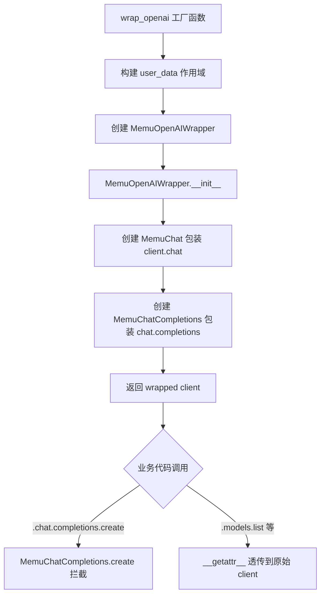
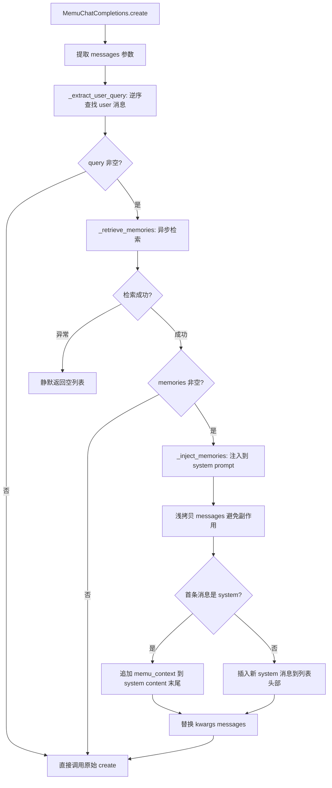

# PD-531.01 memU — MemuOpenAIWrapper 三层代理透明记忆注入与静默降级

> 文档编号：PD-531.01
> 来源：memU `src/memu/client/openai_wrapper.py`
> GitHub：https://github.com/NevaMind-AI/memU.git
> 问题域：PD-531 透明记忆注入 Transparent Memory Injection
> 状态：可复用方案

---

## 第 1 章 问题与动机（≥ 30 行）

### 1.1 核心问题

在 LLM 应用中，记忆系统（长期记忆、用户画像、历史对话摘要）的价值只有在被注入到 LLM 调用时才能体现。传统做法要求业务代码在每次调用 `chat.completions.create` 前手动检索记忆、格式化、拼接到 messages 中，导致：

1. **侵入性强**：每个调用点都需要修改，记忆逻辑与业务逻辑耦合
2. **一致性差**：多处调用点的注入格式、位置、降级策略不统一
3. **维护成本高**：记忆系统升级（如检索策略变更）需要修改所有调用点
4. **测试困难**：业务逻辑测试被迫依赖记忆系统

核心挑战是：如何让记忆注入对业务代码**完全透明**，像 HTTP 中间件一样在请求链路上自动生效？

### 1.2 memU 的解法概述

memU 通过三层代理包装（Proxy Wrapper）模式实现透明记忆注入：

1. **三层代理链**：`MemuOpenAIWrapper → MemuChat → MemuChatCompletions`，精确拦截 `client.chat.completions.create()` 调用路径（`src/memu/client/openai_wrapper.py:155-214`）
2. **自动查询提取**：从 messages 列表中逆序查找最近的 user 消息作为检索 query，支持纯文本和 vision 多模态格式（`openai_wrapper.py:34-46`）
3. **XML 标签注入**：使用 `<memu_context>` 标签包裹记忆内容，追加到 system prompt 末尾或自动创建 system 消息（`openai_wrapper.py:48-71`）
4. **静默降级**：检索失败时返回空列表，不阻断主 LLM 调用（`openai_wrapper.py:73-83`）
5. **便捷工厂函数**：`wrap_openai()` 一行代码完成包装，支持 user_id/agent_id/session_id 多维度作用域（`openai_wrapper.py:217-268`）

### 1.3 设计思想

| 设计原则 | 具体实现 | 理由 | 替代方案 |
|----------|----------|------|----------|
| 代理透明性 | 三层 `__getattr__` 代理，非 chat.completions.create 的调用原样透传 | 业务代码零修改，只需替换 client 变量 | Monkey-patch 原始类（侵入性强、不可逆） |
| 消息不可变 | `messages = [dict(m) for m in messages]` 浅拷贝后再注入 | 避免修改调用方的原始 messages 列表 | 深拷贝（性能开销大）或直接修改（有副作用） |
| 静默降级 | `_retrieve_memories` 中 `except Exception: return []` | 记忆是增强而非必需，检索失败不应阻断主流程 | 抛出异常让调用方处理（破坏透明性） |
| XML 标签隔离 | `<memu_context>` 标签包裹注入内容 | 让 LLM 明确区分原始 prompt 和注入的记忆上下文 | 直接拼接文本（LLM 难以区分边界） |
| 同步/异步兼容 | `create()` 用 ThreadPoolExecutor 桥接异步检索；`acreate()` 原生 async | 适配 OpenAI SDK 的同步和异步两种调用模式 | 只支持异步（限制使用场景） |

---

## 第 2 章 源码实现分析（≥ 60 行，核心章节）

### 2.1 架构概览

memU 的透明记忆注入采用三层代理链架构，精确匹配 OpenAI SDK 的 `client.chat.completions.create()` 调用路径：

```
┌─────────────────────────────────────────────────────────────────┐
│                    业务代码（零修改）                              │
│  wrapped.chat.completions.create(model="gpt-4", messages=[...]) │
└──────────────┬──────────────────────────────────────────────────┘
               │
┌──────────────▼──────────────────┐
│  MemuOpenAIWrapper              │  第 1 层：客户端级代理
│  ├─ self.chat = MemuChat(...)   │  拦截 .chat 属性
│  └─ __getattr__ → 原始 client   │  其他属性透传
└──────────────┬──────────────────┘
               │ .chat
┌──────────────▼──────────────────┐
│  MemuChat                       │  第 2 层：命名空间代理
│  ├─ self.completions = ...      │  拦截 .completions 属性
│  └─ __getattr__ → 原始 chat     │  其他属性透传
└──────────────┬──────────────────┘
               │ .completions
┌──────────────▼──────────────────┐
│  MemuChatCompletions            │  第 3 层：方法级代理
│  ├─ create() → 注入记忆 → 原始  │  核心拦截点
│  ├─ acreate() → 异步版本        │
│  └─ __getattr__ → 原始          │  其他方法透传
└──────────────┬──────────────────┘
               │
┌──────────────▼──────────────────┐
│  MemoryService.retrieve()       │  三层级递进检索
│  ├─ Category → sufficiency?     │
│  ├─ Item → sufficiency?         │
│  └─ Resource                    │
└─────────────────────────────────┘
```

### 2.2 核心实现

#### 2.2.1 三层代理链构建



对应源码 `src/memu/client/openai_wrapper.py:217-268`：

```python
def wrap_openai(
    client,
    service: MemoryService,
    user_data: dict[str, Any] | None = None,
    user_id: str | None = None,
    agent_id: str | None = None,
    session_id: str | None = None,
    ranking: str = "salience",
    top_k: int = 5,
) -> MemuOpenAIWrapper:
    if user_data is None:
        user_data = {}
    if user_id:
        user_data["user_id"] = user_id
    if agent_id:
        user_data["agent_id"] = agent_id
    if session_id:
        user_data["session_id"] = session_id
    return MemuOpenAIWrapper(client, service, user_data, ranking, top_k)
```

`MemuOpenAIWrapper` 在 `__init__` 中构建代理链（`openai_wrapper.py:179-210`）：

```python
class MemuOpenAIWrapper:
    def __init__(self, client, service, user_data, ranking="salience", top_k=5):
        self._client = client
        self._service = service
        self._user_data = user_data
        self._ranking = ranking
        self._top_k = top_k
        # 关键：用 MemuChat 替换 .chat 属性
        self.chat = MemuChat(client.chat, service, user_data, ranking, top_k)

    def __getattr__(self, name: str) -> Any:
        """非 chat 属性透传到原始 client"""
        return getattr(self._client, name)
```

#### 2.2.2 记忆注入核心流程



对应源码 `src/memu/client/openai_wrapper.py:34-108`：

```python
class MemuChatCompletions:
    def _extract_user_query(self, messages: list[dict]) -> str:
        """逆序查找最近的 user 消息，支持 vision 多模态格式"""
        for msg in reversed(messages):
            if msg.get("role") == "user":
                content = msg.get("content", "")
                if isinstance(content, str):
                    return content
                if isinstance(content, list):  # vision models
                    for part in content:
                        if isinstance(part, dict) and part.get("type") == "text":
                            return part.get("text", "")
        return ""

    def _inject_memories(self, messages: list[dict], memories: list[dict]) -> list[dict]:
        """XML 标签包裹注入，浅拷贝保护原始数据"""
        if not memories:
            return messages
        memory_lines = [f"- {m.get('summary', '')}" for m in memories]
        recall_context = (
            "\n\n<memu_context>\n"
            "Relevant context about the user (use only if relevant to the query):\n"
            + "\n".join(memory_lines)
            + "\n</memu_context>"
        )
        messages = [dict(m) for m in messages]  # 浅拷贝
        if messages and messages[0].get("role") == "system":
            messages[0]["content"] = messages[0]["content"] + recall_context
        else:
            messages.insert(0, {"role": "system", "content": recall_context.lstrip("\n")})
        return messages

    async def _retrieve_memories(self, query: str) -> list[dict]:
        """静默降级：异常时返回空列表"""
        try:
            result = await self._service.retrieve(
                queries=[{"role": "user", "content": query}],
                where=self._user_data,
            )
            return result.get("items", [])
        except Exception:
            return []  # Fail silently
```

### 2.3 实现细节

#### 同步/异步桥接

`create()` 方法需要在同步上下文中调用异步的 `_retrieve_memories`，采用三级回退策略（`openai_wrapper.py:85-108`）：

1. 检测当前是否有运行中的事件循环
2. 如果有（如在 Jupyter/FastAPI 中），用 `ThreadPoolExecutor` 在新线程中 `asyncio.run`
3. 如果没有运行中的循环，直接 `loop.run_until_complete`
4. 如果 `get_event_loop` 抛出 `RuntimeError`（无循环），直接 `asyncio.run`

```python
def create(self, **kwargs) -> Any:
    messages = kwargs.get("messages", [])
    query = self._extract_user_query(messages)
    if query:
        try:
            loop = asyncio.get_event_loop()
            if loop.is_running():
                with concurrent.futures.ThreadPoolExecutor() as pool:
                    memories = pool.submit(asyncio.run, self._retrieve_memories(query)).result()
            else:
                memories = loop.run_until_complete(self._retrieve_memories(query))
        except RuntimeError:
            memories = asyncio.run(self._retrieve_memories(query))
        if memories:
            kwargs["messages"] = self._inject_memories(messages, memories)
    return self._original.create(**kwargs)
```

#### 检索后端：三层级递进检索

Wrapper 调用的 `MemoryService.retrieve()` 内部执行一个 7 步 WorkflowStep 管道（`src/memu/app/retrieve.py:42-85`），按 Category → Item → Resource 三层级递进检索，每层之间有 sufficiency check（充分性判断），如果当前层已经足够回答查询则提前终止：

```
route_intention → route_category → sufficiency_after_category
    → recall_items → sufficiency_after_items
    → recall_resources → build_context
```

每个 sufficiency check 调用 LLM 判断已检索内容是否足够，并可能重写查询（`retrieve.py:746-784`）。这意味着 Wrapper 的一次 `_retrieve_memories` 调用可能触发 1-3 次 LLM 调用（意图路由 + 充分性判断），这是一个需要注意的成本点。


---

## 第 3 章 迁移指南（≥ 40 行）

### 3.1 迁移清单

#### 阶段 1：最小可用（1 个文件）

- [ ] 复制 `openai_wrapper.py` 到你的项目
- [ ] 将 `MemoryService` 替换为你自己的记忆检索接口（只需实现 `retrieve(queries, where)` 方法）
- [ ] 在应用入口处用 `wrap_openai()` 包装 OpenAI client

#### 阶段 2：生产就绪

- [ ] 实现检索超时控制（原版无超时，生产环境建议加 2-3 秒超时）
- [ ] 添加检索延迟监控指标（Prometheus/OpenTelemetry）
- [ ] 配置 top_k 和 ranking 策略
- [ ] 实现 user_data 作用域隔离（多租户场景）

#### 阶段 3：高级特性

- [ ] 支持 streaming 模式（当前 Wrapper 不处理 stream=True 的情况）
- [ ] 添加记忆注入的 token 预算控制（避免注入过多记忆超出上下文窗口）
- [ ] 实现注入内容的缓存（相同 query 短时间内不重复检索）

### 3.2 适配代码模板

以下是一个可直接运行的最小适配模板，将 memU 的透明注入模式移植到任意记忆后端：

```python
"""透明记忆注入 Wrapper — 可直接复用的适配模板"""
from __future__ import annotations

import asyncio
import concurrent.futures
from typing import Any, Protocol


class MemoryBackend(Protocol):
    """你的记忆后端只需实现这个接口"""
    async def search(self, query: str, user_id: str, top_k: int = 5) -> list[dict[str, Any]]:
        """返回 [{"summary": "...", "score": 0.95}, ...]"""
        ...


class TransparentMemoryCompletions:
    """拦截 chat.completions.create，自动注入记忆"""

    def __init__(self, original_completions, backend: MemoryBackend, user_id: str, top_k: int = 5):
        self._original = original_completions
        self._backend = backend
        self._user_id = user_id
        self._top_k = top_k

    def create(self, **kwargs) -> Any:
        messages = kwargs.get("messages", [])
        query = self._extract_last_user_message(messages)
        if query:
            memories = self._sync_retrieve(query)
            if memories:
                kwargs["messages"] = self._inject(messages, memories)
        return self._original.create(**kwargs)

    async def acreate(self, **kwargs) -> Any:
        messages = kwargs.get("messages", [])
        query = self._extract_last_user_message(messages)
        if query:
            memories = await self._backend.search(query, self._user_id, self._top_k)
            if memories:
                kwargs["messages"] = self._inject(messages, memories)
        if hasattr(self._original, "acreate"):
            return await self._original.acreate(**kwargs)
        return self._original.create(**kwargs)

    def _sync_retrieve(self, query: str) -> list[dict]:
        """同步上下文中桥接异步检索"""
        try:
            loop = asyncio.get_event_loop()
            if loop.is_running():
                with concurrent.futures.ThreadPoolExecutor() as pool:
                    return pool.submit(
                        asyncio.run,
                        self._backend.search(query, self._user_id, self._top_k)
                    ).result(timeout=3.0)  # 生产环境加超时
            return loop.run_until_complete(
                self._backend.search(query, self._user_id, self._top_k)
            )
        except Exception:
            return []  # 静默降级

    @staticmethod
    def _extract_last_user_message(messages: list[dict]) -> str:
        for msg in reversed(messages):
            if msg.get("role") == "user":
                content = msg.get("content", "")
                if isinstance(content, str):
                    return content
                if isinstance(content, list):
                    for part in content:
                        if isinstance(part, dict) and part.get("type") == "text":
                            return part.get("text", "")
        return ""

    @staticmethod
    def _inject(messages: list[dict], memories: list[dict]) -> list[dict]:
        lines = [f"- {m.get('summary', '')}" for m in memories]
        context = (
            "\n\n<memory_context>\n"
            "Relevant user context (use only if relevant):\n"
            + "\n".join(lines)
            + "\n</memory_context>"
        )
        messages = [dict(m) for m in messages]
        if messages and messages[0].get("role") == "system":
            messages[0]["content"] = messages[0]["content"] + context
        else:
            messages.insert(0, {"role": "system", "content": context.strip()})
        return messages

    def __getattr__(self, name: str) -> Any:
        return getattr(self._original, name)


class TransparentMemoryChat:
    def __init__(self, original_chat, backend: MemoryBackend, user_id: str, top_k: int = 5):
        self._original = original_chat
        self.completions = TransparentMemoryCompletions(
            original_chat.completions, backend, user_id, top_k
        )

    def __getattr__(self, name: str) -> Any:
        return getattr(self._original, name)


class TransparentMemoryClient:
    def __init__(self, client, backend: MemoryBackend, user_id: str, top_k: int = 5):
        self._client = client
        self.chat = TransparentMemoryChat(client.chat, backend, user_id, top_k)

    def __getattr__(self, name: str) -> Any:
        return getattr(self._client, name)


# 使用方式：
# from openai import OpenAI
# client = TransparentMemoryClient(OpenAI(), my_memory_backend, user_id="user123")
# response = client.chat.completions.create(model="gpt-4", messages=[...])
```

### 3.3 适用场景

| 场景 | 适用度 | 说明 |
|------|--------|------|
| OpenAI SDK 直接调用 | ⭐⭐⭐ | 完美适配，零修改业务代码 |
| LangChain/LangGraph Agent | ⭐⭐ | 可用但 LangGraph 有自己的 memory 机制，建议用 memU 的 LangGraph 集成 |
| 多模型路由场景 | ⭐⭐ | 需要为每个 provider 实现对应的 Wrapper |
| Streaming 场景 | ⭐ | 当前实现不处理 stream=True，需要扩展 |
| 高并发低延迟场景 | ⭐⭐ | 每次调用增加一次检索延迟，需要加缓存层 |

---

## 第 4 章 测试用例（≥ 20 行）

```python
"""基于 memU openai_wrapper.py 真实函数签名的测试用例"""
import asyncio
from unittest.mock import AsyncMock, MagicMock, patch
import pytest


class TestMemuChatCompletions:
    """测试 MemuChatCompletions 核心功能"""

    def _make_completions(self, memories=None):
        from memu.client.openai_wrapper import MemuChatCompletions
        original = MagicMock()
        original.create.return_value = {"choices": [{"message": {"content": "hi"}}]}
        service = AsyncMock()
        service.retrieve.return_value = {"items": memories or []}
        return MemuChatCompletions(original, service, {"user_id": "u1"}, top_k=5), original, service

    def test_extract_user_query_text(self):
        comp, _, _ = self._make_completions()
        messages = [
            {"role": "system", "content": "You are helpful"},
            {"role": "user", "content": "What is my name?"},
        ]
        assert comp._extract_user_query(messages) == "What is my name?"

    def test_extract_user_query_vision(self):
        comp, _, _ = self._make_completions()
        messages = [
            {"role": "user", "content": [
                {"type": "image_url", "image_url": {"url": "..."}},
                {"type": "text", "text": "Describe this"},
            ]},
        ]
        assert comp._extract_user_query(messages) == "Describe this"

    def test_extract_user_query_empty(self):
        comp, _, _ = self._make_completions()
        messages = [{"role": "system", "content": "sys"}]
        assert comp._extract_user_query(messages) == ""

    def test_inject_memories_appends_to_system(self):
        comp, _, _ = self._make_completions()
        messages = [{"role": "system", "content": "You are helpful"}]
        memories = [{"summary": "User likes coffee"}]
        result = comp._inject_memories(messages, memories)
        assert "<memu_context>" in result[0]["content"]
        assert "User likes coffee" in result[0]["content"]
        assert result[0]["content"].startswith("You are helpful")

    def test_inject_memories_creates_system_when_missing(self):
        comp, _, _ = self._make_completions()
        messages = [{"role": "user", "content": "hi"}]
        memories = [{"summary": "User likes tea"}]
        result = comp._inject_memories(messages, memories)
        assert result[0]["role"] == "system"
        assert "<memu_context>" in result[0]["content"]
        assert len(result) == 2  # system + user

    def test_inject_memories_does_not_mutate_original(self):
        comp, _, _ = self._make_completions()
        original_messages = [{"role": "system", "content": "original"}]
        memories = [{"summary": "fact"}]
        result = comp._inject_memories(original_messages, memories)
        assert original_messages[0]["content"] == "original"  # 未被修改
        assert "fact" in result[0]["content"]

    def test_inject_memories_empty_returns_original(self):
        comp, _, _ = self._make_completions()
        messages = [{"role": "user", "content": "hi"}]
        result = comp._inject_memories(messages, [])
        assert result is messages  # 空记忆直接返回原列表

    @pytest.mark.asyncio
    async def test_retrieve_memories_silent_on_error(self):
        comp, _, service = self._make_completions()
        service.retrieve.side_effect = RuntimeError("DB down")
        result = await comp._retrieve_memories("test query")
        assert result == []  # 静默降级

    @pytest.mark.asyncio
    async def test_acreate_injects_memories(self):
        memories = [{"summary": "User is a developer"}]
        comp, original, service = self._make_completions(memories)
        original.acreate = AsyncMock(return_value={"choices": [{"message": {"content": "ok"}}]})
        await comp.acreate(messages=[{"role": "user", "content": "Who am I?"}])
        call_kwargs = original.acreate.call_args[1]
        assert "<memu_context>" in call_kwargs["messages"][0]["content"]


class TestWrapOpenai:
    """测试 wrap_openai 工厂函数"""

    def test_wrap_openai_builds_user_data(self):
        from memu.client.openai_wrapper import wrap_openai
        client = MagicMock()
        client.chat.completions = MagicMock()
        service = MagicMock()
        wrapped = wrap_openai(client, service, user_id="u1", agent_id="a1", session_id="s1")
        assert wrapped._user_data == {"user_id": "u1", "agent_id": "a1", "session_id": "s1"}

    def test_wrap_openai_proxies_non_chat(self):
        from memu.client.openai_wrapper import wrap_openai
        client = MagicMock()
        client.chat.completions = MagicMock()
        client.models.list.return_value = ["gpt-4"]
        service = MagicMock()
        wrapped = wrap_openai(client, service, user_id="u1")
        assert wrapped.models.list() == ["gpt-4"]  # 透传
```


---

## 第 5 章 跨域关联

| 关联域 | 关系类型 | 说明 |
|--------|----------|------|
| PD-06 记忆持久化 | 依赖 | Wrapper 的 `_retrieve_memories` 调用 `MemoryService.retrieve()`，依赖底层记忆存储（InMemory/SQLite/PostgreSQL 三后端） |
| PD-08 搜索与检索 | 依赖 | 注入的记忆质量取决于检索管道的三层级递进检索（Category → Item → Resource）和 sufficiency check |
| PD-10 中间件管道 | 协同 | memU 的 `LLMClientWrapper`（`src/memu/llm/wrapper.py:226`）提供 before/after/on_error 拦截器链，与 Wrapper 的透明注入形成互补：Wrapper 在 SDK 层拦截，拦截器在内部 LLM 调用层拦截 |
| PD-11 可观测性 | 协同 | `LLMClientWrapper` 的拦截器可用于追踪注入记忆后的 token 消耗变化，评估记忆注入的 ROI |
| PD-01 上下文管理 | 协同 | 注入记忆会增加 system prompt 长度，需要与上下文窗口管理策略协调，避免超出 token 限制 |
| PD-524 SDK 客户端包装 | 同源 | 同项目的 `LLMClientWrapper` 是内部 LLM 调用的包装层，与 `MemuOpenAIWrapper` 的外部 SDK 包装形成双层代理架构 |

---

## 第 6 章 来源文件索引

| 文件 | 行范围 | 关键实现 |
|------|--------|----------|
| `src/memu/client/openai_wrapper.py` | L1-L269 | 完整的三层代理实现：MemuChatCompletions、MemuChat、MemuOpenAIWrapper、wrap_openai 工厂函数 |
| `src/memu/client/openai_wrapper.py` | L34-L46 | `_extract_user_query`：逆序查找 user 消息，支持 vision 多模态 |
| `src/memu/client/openai_wrapper.py` | L48-L71 | `_inject_memories`：XML 标签注入 + 浅拷贝保护 |
| `src/memu/client/openai_wrapper.py` | L73-L83 | `_retrieve_memories`：静默降级检索 |
| `src/memu/client/openai_wrapper.py` | L85-L108 | `create`：同步/异步桥接的三级回退策略 |
| `src/memu/client/__init__.py` | L1-L26 | 模块公开接口：`wrap_openai`、`MemuOpenAIWrapper` |
| `src/memu/app/service.py` | L49-L95 | `MemoryService` 初始化：Mixin 组合、管道注册 |
| `src/memu/app/retrieve.py` | L42-L85 | `retrieve()` 入口：构建 WorkflowState 并执行检索管道 |
| `src/memu/app/retrieve.py` | L106-L210 | RAG 检索管道：7 步 WorkflowStep 定义 |
| `src/memu/app/retrieve.py` | L746-L784 | `_decide_if_retrieval_needed`：LLM 充分性判断 |
| `src/memu/llm/wrapper.py` | L226-L504 | `LLMClientWrapper`：内部 LLM 调用的拦截器包装层 |
| `src/memu/llm/wrapper.py` | L128-L224 | `LLMInterceptorRegistry`：before/after/on_error 三阶段拦截器注册表 |
| `src/memu/workflow/step.py` | L17-L48 | `WorkflowStep` 数据类：step_id/role/handler/requires/produces |
| `src/memu/workflow/pipeline.py` | L21-L170 | `PipelineManager`：版本化管道管理，支持 insert/replace/remove 步骤 |
| `src/memu/integrations/langgraph.py` | L53-L163 | `MemULangGraphTools`：LangGraph 集成，暴露 save_memory/search_memory 工具 |
| `src/memu/prompts/retrieve/pre_retrieval_decision.py` | L1-L53 | 检索意图路由 prompt：RETRIEVE/NO_RETRIEVE 决策 + 查询重写 |

---

## 第 7 章 横向对比维度

> **重要：** 本章用于自动填充 Butcher Wiki 的横向对比表。

```json comparison_data
{
  "project": "memU",
  "dimensions": {
    "注入方式": "三层 __getattr__ 代理链拦截 client.chat.completions.create",
    "记忆格式化": "XML <memu_context> 标签包裹，追加到 system prompt 末尾",
    "降级策略": "except Exception: return [] 静默降级，不阻断主 LLM 调用",
    "同步异步兼容": "ThreadPoolExecutor 桥接 + asyncio.run 三级回退",
    "作用域隔离": "user_data dict 支持 user_id/agent_id/session_id 多维度过滤",
    "检索深度": "三层级递进检索（Category→Item→Resource）+ LLM sufficiency check"
  }
}
```

### 域元数据补充

```json domain_metadata
{
  "solution_summary": "memU 用三层 __getattr__ 代理链包装 OpenAI SDK，在 chat.completions.create 前自动执行三层级递进检索并以 XML 标签注入 system prompt，支持同步/异步双模式与静默降级",
  "description": "SDK 级透明代理如何与内部拦截器体系协同形成双层注入架构",
  "sub_problems": [
    "同步上下文中桥接异步检索的事件循环冲突处理",
    "注入记忆的 token 预算控制与上下文窗口协调"
  ],
  "best_practices": [
    "浅拷贝 messages 列表避免修改调用方原始数据",
    "工厂函数支持 user_id/agent_id/session_id 多维度作用域构建"
  ]
}
```

