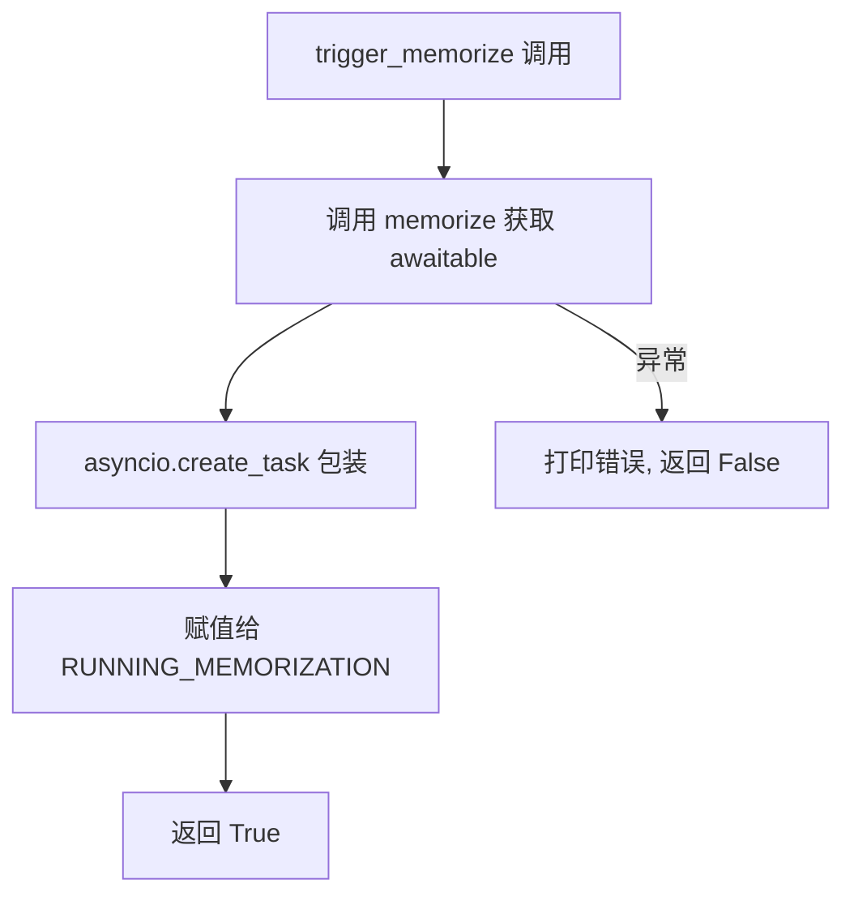
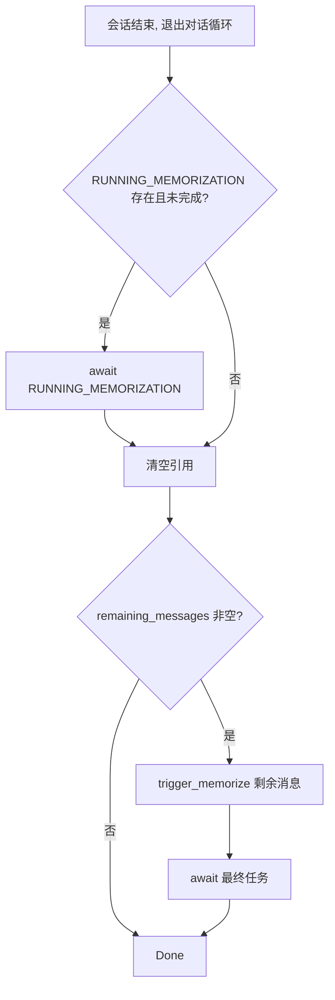

# PD-532.01 memU — asyncio.create_task 主动式后台记忆化与阈值触发

> 文档编号：PD-532.01
> 来源：memU `examples/proactive/proactive.py`
> GitHub：https://github.com/NevaMind-AI/memU.git
> 问题域：PD-532 主动式 Agent 记忆 Proactive Agent Memory
> 状态：可复用方案

---

## 第 1 章 问题与动机

### 1.1 核心问题

传统 Agent 记忆系统采用"被动式"设计——只在用户显式请求或会话结束时才执行记忆化。这带来两个关键问题：

1. **延迟累积**：会话结束时一次性处理大量消息，记忆化耗时长，用户需等待
2. **数据丢失风险**：如果进程意外崩溃，未记忆化的对话内容全部丢失
3. **阻塞对话**：同步记忆化会阻塞 Agent 的响应循环，降低交互体验

memU 的 proactive agent 模式解决了这些问题：在对话进行中，后台异步执行记忆化任务，达到消息阈值自动触发，会话结束时确保剩余消息完成记忆化。这实现了"24/7 持续记忆同步"的效果。

### 1.2 memU 的解法概述

1. **全局单任务锁**：用 `RUNNING_MEMORIZATION: asyncio.Task | None` 全局变量追踪当前后台任务，防止并发重复记忆化（`examples/proactive/proactive.py:17`）
2. **消息阈值触发**：`N_MESSAGES_MEMORIZE = 2` 定义触发阈值，每积累 N 条消息自动触发一次记忆化（`examples/proactive/proactive.py:16`）
3. **asyncio.create_task 非阻塞**：`trigger_memorize()` 通过 `asyncio.create_task()` 将记忆化任务提交到事件循环后台执行，不阻塞对话主循环（`examples/proactive/proactive.py:28`）
4. **会话结束双阶段清理**：先 await 正在运行的任务，再对剩余消息执行最终记忆化（`examples/proactive/proactive.py:171-192`）
5. **7 步 WorkflowStep 管道**：底层记忆化通过 `MemorizeMixin._build_memorize_workflow()` 构建 7 步管道（ingest → preprocess → extract → dedupe → categorize → persist → response），每步声明 requires/produces 实现数据流校验（`src/memu/app/memorize.py:97-166`）

### 1.3 设计思想

| 设计原则 | 具体实现 | 理由 | 替代方案 |
|----------|----------|------|----------|
| 非阻塞优先 | `asyncio.create_task()` 后台执行 | 记忆化是 IO 密集型操作，不应阻塞对话 | 线程池 `run_in_executor`（更重） |
| 单任务互斥 | 全局 `RUNNING_MEMORIZATION` 变量 + `.done()` 检查 | 避免并发记忆化导致数据竞争和资源浪费 | asyncio.Lock（更通用但更复杂） |
| 阈值批处理 | 每 N 条消息触发一次 | 平衡实时性与 LLM API 调用成本 | 时间窗口触发（更复杂） |
| 优雅关闭 | 双阶段 await：运行中任务 + 剩余消息 | 确保零数据丢失 | atexit 钩子（不支持 async） |
| 消息快照 | `conversation_messages.copy()` 传入 + `.clear()` 清空 | 避免后台任务与主循环共享可变列表 | 不可变数据结构（过度设计） |

---

## 第 2 章 源码实现分析

### 2.1 架构概览

memU proactive 模式的整体架构分为两层：上层是对话循环中的触发控制层，下层是 MemoryService 的 7 步记忆化管道。

```
┌─────────────────────────────────────────────────────────┐
│                   对话主循环 (proactive.py)                │
│                                                         │
│  ┌──────────┐    ┌──────────────┐    ┌───────────────┐  │
│  │ 用户输入  │───→│ Agent 响应    │───→│ 消息累积器     │  │
│  └──────────┘    └──────────────┘    └───────┬───────┘  │
│                                              │          │
│                                    ≥ N_MESSAGES?        │
│                                              │          │
│                                    ┌─────────▼────────┐ │
│                                    │ check_and_memorize│ │
│                                    └─────────┬────────┘ │
│                                              │          │
│                              ┌───────────────▼────────┐ │
│                              │ RUNNING_MEMORIZATION   │ │
│                              │ 单任务互斥检查          │ │
│                              └───────────┬────────────┘ │
│                                          │              │
│                              ┌───────────▼────────────┐ │
│                              │ asyncio.create_task()   │ │
│                              │ 后台非阻塞执行          │ │
│                              └───────────┬────────────┘ │
└──────────────────────────────────────────┼──────────────┘
                                           │
┌──────────────────────────────────────────▼──────────────┐
│              MemoryService.memorize() 管道               │
│                                                         │
│  ingest → preprocess → extract → dedupe → categorize    │
│                                    → persist → response  │
└─────────────────────────────────────────────────────────┘
```

### 2.2 核心实现

#### 2.2.1 触发控制层：阈值检查与单任务互斥

```mermaid
graph TD
    A[check_and_memorize 被调用] --> B{消息数 >= N_MESSAGES?}
    B -->|否| C[直接返回]
    B -->|是| D{RUNNING_MEMORIZATION 存在?}
    D -->|否| G[trigger_memorize]
    D -->|是| E{task.done()?}
    E -->|否| F[跳过本轮, 打印 skipping]
    E -->|是| H[检查异常, 清空引用]
    H --> G
    G --> I[asyncio.create_task]
    I --> J[清空消息列表]
```

对应源码 `examples/proactive/proactive.py:97-122`：

```python
async def check_and_memorize(conversation_messages: list[dict[str, any]]) -> None:
    """Check if memorization threshold is reached and trigger if needed.

    Skips triggering if a previous memorization task is still running.
    """
    global RUNNING_MEMORIZATION

    if len(conversation_messages) < N_MESSAGES_MEMORIZE:
        return

    # Check if there's a running memorization task
    if RUNNING_MEMORIZATION is not None:
        if not RUNNING_MEMORIZATION.done():
            print("\n[Info] Have running memorization, skipping...")
            return
        # Previous task completed, check for exceptions
        try:
            RUNNING_MEMORIZATION.result()
        except Exception as e:
            print(f"\n[Memory] Memorization failed: {e!r}")
        RUNNING_MEMORIZATION = None

    print(f"\n[Info] Reached {N_MESSAGES_MEMORIZE} messages, triggering memorization...")
    success = await trigger_memorize(conversation_messages.copy())
    if success:
        conversation_messages.clear()
```

关键设计点：
- **L104**: 阈值检查是第一道门控，避免不必要的任务状态检查
- **L108-109**: `RUNNING_MEMORIZATION is not None` + `not done()` 双重检查实现单任务互斥
- **L113-114**: 已完成任务通过 `.result()` 收割异常，避免 "Task exception was never retrieved" 警告
- **L120**: `conversation_messages.copy()` 创建快照，与主循环解耦
- **L122**: 成功提交后立即 `.clear()` 清空，避免重复记忆化

#### 2.2.2 后台任务提交：trigger_memorize



对应源码 `examples/proactive/proactive.py:20-34`：

```python
async def trigger_memorize(messages: list[dict[str, any]]) -> bool:
    """Create a background task to memorize conversation messages.

    Returns True if the task was successfully created and registered.
    """
    global RUNNING_MEMORIZATION
    try:
        memorize_awaitable = memorize(messages)
        RUNNING_MEMORIZATION = asyncio.create_task(memorize_awaitable)
    except Exception as e:
        print(f"\n[Memory] Memorization initialization failed: {e!r}")
        return False
    else:
        print("\n[Memory] Memorization task submitted.")
        return True
```

关键设计点：
- **L27**: `memorize(messages)` 返回的是 `Awaitable`（非 coroutine），因为 `local/memorize.py:34` 中 `memorize()` 直接返回 `memory_service.memorize(...)` 的 awaitable 对象
- **L28**: `asyncio.create_task()` 将 awaitable 调度到事件循环，立即返回 Task 对象
- **L29-31**: try/except 捕获初始化阶段的异常（如 MemoryService 未就绪），返回 bool 让调用方决定是否清空消息

#### 2.2.3 会话结束双阶段清理



对应源码 `examples/proactive/proactive.py:155-194`：

```python
async def main():
    options = ClaudeAgentOptions(
        mcp_servers={"memu": memu_server},
        allowed_tools=["mcp__memu__memu_todos"],
    )
    async with ClaudeSDKClient(options=options) as client:
        remaining_messages = await run_conversation_loop(client)

    # Phase 1: Wait for any running memorization task to complete
    global RUNNING_MEMORIZATION
    if RUNNING_MEMORIZATION is not None and not RUNNING_MEMORIZATION.done():
        print("\n[Info] Waiting for running memorization task to complete...")
        try:
            await RUNNING_MEMORIZATION
        except Exception as e:
            print(f"\n[Memory] Running memorization failed: {e!r}")
        RUNNING_MEMORIZATION = None

    # Phase 2: Memorize remaining messages and wait for completion
    if remaining_messages:
        print("\n[Info] Session ended, memorizing remaining messages...")
        success = await trigger_memorize(remaining_messages.copy())
        if success and RUNNING_MEMORIZATION is not None:
            try:
                await RUNNING_MEMORIZATION
            except Exception as e:
                print(f"\n[Memory] Final memorization failed: {e!r}")
```

### 2.3 实现细节

#### 底层记忆化管道：7 步 WorkflowStep

`MemorizeMixin._build_memorize_workflow()` 在 `src/memu/app/memorize.py:97-166` 定义了 7 步管道：

| 步骤 | step_id | 角色 | 输入 | 输出 | 能力 |
|------|---------|------|------|------|------|
| 1 | `ingest_resource` | ingest | resource_url, modality | local_path, raw_text | io |
| 2 | `preprocess_multimodal` | preprocess | local_path, modality, raw_text | preprocessed_resources | llm |
| 3 | `extract_items` | extract | preprocessed_resources, memory_types, ... | resource_plans | llm |
| 4 | `dedupe_merge` | dedupe_merge | resource_plans | resource_plans | — |
| 5 | `categorize_items` | categorize | resource_plans, ctx, store, ... | resources, items, relations, category_updates | db, vector |
| 6 | `persist_index` | persist | category_updates, ctx, store | categories | db, llm |
| 7 | `build_response` | emit | resources, items, relations, ... | response | — |

每步通过 `requires` 和 `produces` 声明数据依赖，`PipelineManager._validate_steps()` 在注册时静态校验数据流完整性（`src/memu/workflow/pipeline.py:131-164`）。

#### 消息到记忆的转换路径

`local/memorize.py:34-38` 展示了消息如何进入管道：

```python
def memorize(conversation_messages: list[dict[str, Any]]) -> Awaitable[dict[str, Any]]:
    memory_service = get_memory_service()
    resource_url = dump_conversation_resource(conversation_messages)
    return memory_service.memorize(resource_url=resource_url, modality="conversation", user={"user_id": USER_ID})
```

1. `dump_conversation_resource()` 将消息列表序列化为 JSON 文件（带时间戳命名），写入 `data/` 目录
2. `memory_service.memorize()` 接收文件 URL 和模态类型，启动 7 步管道
3. 返回的是 `Awaitable`，由上层 `asyncio.create_task()` 调度执行

#### 配置驱动的记忆类型与分类

`examples/proactive/memory/config.py:1-66` 定义了 proactive 模式的专用配置：

- `memory_types: ["record"]` — 只提取 record 类型（任务记录），不提取 profile/event 等
- `memory_type_prompts` — 自定义 ordinal 排序的 prompt 块（objective → workflow → examples），`rules` 设为 `ordinal: -1` 表示禁用
- `memory_categories: [{"name": "todo", ...}]` — 单一 todo 分类，用 `[Done]`/`[Todo]` 标记任务状态
- `retrieve_config` — RAG 模式，禁用 category 和 resource 检索，只启用 item 检索（top_k=10）


---

## 第 3 章 迁移指南

### 3.1 迁移清单

**阶段 1：基础后台记忆化**
- [ ] 定义全局任务追踪变量 `RUNNING_TASK: asyncio.Task | None = None`
- [ ] 实现 `trigger_memorize()` 函数，接收消息列表，返回 bool
- [ ] 在对话循环中每轮结束后调用 `check_and_memorize()`
- [ ] 实现会话结束时的双阶段清理

**阶段 2：记忆化管道对接**
- [ ] 实现消息序列化（JSON dump 到文件或直接传入）
- [ ] 对接你的记忆存储后端（向量数据库、关系数据库等）
- [ ] 配置 LLM 提取 prompt（根据业务场景定制 memory_types）

**阶段 3：生产化加固**
- [ ] 将全局变量改为类实例属性（支持多会话并发）
- [ ] 添加任务超时保护（`asyncio.wait_for`）
- [ ] 添加结构化日志替代 print
- [ ] 考虑消息持久化队列（防崩溃丢失）

### 3.2 适配代码模板

以下是一个可直接运行的最小化 proactive 记忆化框架，不依赖 memU 库：

```python
import asyncio
from typing import Any

# === 配置 ===
N_MESSAGES_THRESHOLD = 3  # 每积累 N 条消息触发一次记忆化


class ProactiveMemorizer:
    """主动式后台记忆化管理器。

    核心设计：
    - 单任务互斥：同一时刻只有一个记忆化任务在运行
    - 阈值触发：消息累积到阈值自动触发
    - 优雅关闭：会话结束时确保所有消息完成记忆化
    """

    def __init__(self, threshold: int = N_MESSAGES_THRESHOLD):
        self.threshold = threshold
        self._running_task: asyncio.Task | None = None
        self._pending_messages: list[dict[str, Any]] = []

    async def _do_memorize(self, messages: list[dict[str, Any]]) -> dict[str, Any]:
        """实际的记忆化逻辑 — 替换为你的实现。

        例如：调用 LLM 提取记忆 → 写入向量数据库。
        """
        # 模拟异步记忆化操作
        await asyncio.sleep(0.1)
        return {"memorized_count": len(messages)}

    async def _trigger(self, messages: list[dict[str, Any]]) -> bool:
        """提交后台记忆化任务。"""
        try:
            self._running_task = asyncio.create_task(self._do_memorize(messages))
            return True
        except Exception:
            return False

    def _harvest_completed_task(self) -> None:
        """收割已完成任务的结果/异常。"""
        if self._running_task is None:
            return
        if not self._running_task.done():
            return
        try:
            self._running_task.result()  # 收割异常
        except Exception as e:
            print(f"[Memory] Previous task failed: {e!r}")
        self._running_task = None

    async def on_message(self, message: dict[str, Any]) -> None:
        """每条消息后调用，检查是否需要触发记忆化。"""
        self._pending_messages.append(message)

        if len(self._pending_messages) < self.threshold:
            return

        self._harvest_completed_task()

        # 单任务互斥：如果上一个任务还在跑，跳过
        if self._running_task is not None and not self._running_task.done():
            return

        snapshot = self._pending_messages.copy()
        success = await self._trigger(snapshot)
        if success:
            self._pending_messages.clear()

    async def flush(self) -> None:
        """会话结束时调用，确保所有消息完成记忆化。"""
        # Phase 1: 等待正在运行的任务
        if self._running_task is not None and not self._running_task.done():
            try:
                await self._running_task
            except Exception as e:
                print(f"[Memory] Running task failed: {e!r}")
            self._running_task = None

        # Phase 2: 处理剩余消息
        if self._pending_messages:
            snapshot = self._pending_messages.copy()
            self._pending_messages.clear()
            success = await self._trigger(snapshot)
            if success and self._running_task is not None:
                try:
                    await self._running_task
                except Exception as e:
                    print(f"[Memory] Final task failed: {e!r}")


# === 使用示例 ===
async def main():
    memorizer = ProactiveMemorizer(threshold=2)

    # 模拟对话
    messages = [
        {"role": "user", "content": "Hello"},
        {"role": "assistant", "content": "Hi there!"},
        {"role": "user", "content": "What's the weather?"},
        {"role": "assistant", "content": "It's sunny today."},
        {"role": "user", "content": "Thanks!"},
    ]

    for msg in messages:
        await memorizer.on_message(msg)

    # 会话结束，flush 剩余消息
    await memorizer.flush()
    print("All messages memorized.")


if __name__ == "__main__":
    asyncio.run(main())
```

### 3.3 适用场景

| 场景 | 适用度 | 说明 |
|------|--------|------|
| 长对话 Agent（>20 轮） | ⭐⭐⭐ | 核心场景，阈值触发避免会话结束时的大量处理 |
| 多轮任务助手（编程/写作） | ⭐⭐⭐ | todo 分类 + record 类型天然适配任务追踪 |
| 实时客服 Bot | ⭐⭐ | 需要更低延迟，可能需要每条消息都触发 |
| 短对话（<5 轮） | ⭐ | 阈值触发的优势不明显，直接同步记忆化即可 |
| 多会话并发服务 | ⭐⭐ | 需要将全局变量改为实例级管理（见迁移模板） |

---

## 第 4 章 测试用例

```python
import asyncio
from unittest.mock import AsyncMock, patch

import pytest


class TestProactiveMemorizer:
    """测试主动式后台记忆化的核心行为。"""

    @pytest.fixture
    def memorizer(self):
        from proactive_memorizer import ProactiveMemorizer
        return ProactiveMemorizer(threshold=2)

    @pytest.mark.asyncio
    async def test_threshold_trigger(self, memorizer):
        """消息达到阈值时应触发记忆化。"""
        memorizer._do_memorize = AsyncMock(return_value={"memorized_count": 2})

        await memorizer.on_message({"role": "user", "content": "msg1"})
        assert memorizer._running_task is None  # 未达阈值

        await memorizer.on_message({"role": "assistant", "content": "msg2"})
        assert memorizer._running_task is not None  # 达到阈值，已触发
        assert len(memorizer._pending_messages) == 0  # 消息已清空

    @pytest.mark.asyncio
    async def test_single_task_mutex(self, memorizer):
        """正在运行的任务未完成时，应跳过新的触发。"""
        # 模拟一个长时间运行的任务
        slow_future = asyncio.Future()
        memorizer._do_memorize = AsyncMock(return_value=slow_future)
        memorizer._running_task = asyncio.create_task(slow_future)

        await memorizer.on_message({"role": "user", "content": "msg1"})
        await memorizer.on_message({"role": "assistant", "content": "msg2"})

        # 消息未被清空，因为上一个任务还在跑
        assert len(memorizer._pending_messages) == 2

        slow_future.set_result({"memorized_count": 0})

    @pytest.mark.asyncio
    async def test_flush_waits_running_task(self, memorizer):
        """flush 应等待正在运行的任务完成。"""
        completed = asyncio.Event()

        async def slow_memorize(msgs):
            await asyncio.sleep(0.05)
            completed.set()
            return {"memorized_count": len(msgs)}

        memorizer._do_memorize = slow_memorize

        await memorizer.on_message({"role": "user", "content": "msg1"})
        await memorizer.on_message({"role": "assistant", "content": "msg2"})

        await memorizer.flush()
        assert completed.is_set()

    @pytest.mark.asyncio
    async def test_flush_handles_remaining_messages(self, memorizer):
        """flush 应处理未达阈值的剩余消息。"""
        memorizer._do_memorize = AsyncMock(return_value={"memorized_count": 1})

        await memorizer.on_message({"role": "user", "content": "only_one"})
        assert memorizer._running_task is None  # 未达阈值

        await memorizer.flush()
        memorizer._do_memorize.assert_called_once()  # flush 触发了记忆化

    @pytest.mark.asyncio
    async def test_task_exception_harvested(self, memorizer):
        """已完成任务的异常应被正确收割，不影响后续触发。"""
        call_count = 0

        async def failing_then_ok(msgs):
            nonlocal call_count
            call_count += 1
            if call_count == 1:
                raise RuntimeError("LLM API error")
            return {"memorized_count": len(msgs)}

        memorizer._do_memorize = failing_then_ok

        # 第一次触发（会失败）
        await memorizer.on_message({"role": "user", "content": "msg1"})
        await memorizer.on_message({"role": "assistant", "content": "msg2"})
        await asyncio.sleep(0.01)  # 让任务完成

        # 第二次触发（应成功，异常已被收割）
        await memorizer.on_message({"role": "user", "content": "msg3"})
        await memorizer.on_message({"role": "assistant", "content": "msg4"})

        assert call_count == 2

    @pytest.mark.asyncio
    async def test_message_snapshot_isolation(self, memorizer):
        """传入记忆化的消息应是快照，与主列表解耦。"""
        captured_messages = []

        async def capture_memorize(msgs):
            captured_messages.extend(msgs)
            return {"memorized_count": len(msgs)}

        memorizer._do_memorize = capture_memorize

        await memorizer.on_message({"role": "user", "content": "msg1"})
        await memorizer.on_message({"role": "assistant", "content": "msg2"})
        await asyncio.sleep(0.01)

        # 主列表已清空，但记忆化收到的是快照
        assert len(memorizer._pending_messages) == 0
        assert len(captured_messages) == 2
```


---

## 第 5 章 跨域关联

| 关联域 | 关系类型 | 说明 |
|--------|----------|------|
| PD-01 上下文管理 | 协同 | 主动式记忆化通过阈值批处理减少上下文窗口压力，每 N 条消息提取记忆后清空原始消息 |
| PD-06 记忆持久化 | 依赖 | proactive 模式是记忆持久化的触发策略层，底层依赖 MemoryService 的 7 步管道完成实际持久化 |
| PD-10 中间件管道 | 依赖 | 记忆化管道通过 WorkflowStep + PipelineManager 实现，支持拦截器注入（before/after/on_error） |
| PD-03 容错与重试 | 协同 | trigger_memorize 的 try/except + bool 返回值实现了初始化阶段容错；flush 的双阶段 await 实现了关闭阶段容错 |
| PD-04 工具系统 | 协同 | proactive 模式通过 MCP 工具（memu_todos）暴露记忆检索能力，Agent 可在对话中查询已记忆的 todo 状态 |

---

## 第 6 章 来源文件索引

| 文件 | 行范围 | 关键实现 |
|------|--------|----------|
| `examples/proactive/proactive.py` | L1-198 | 主入口：对话循环、阈值触发、单任务互斥、双阶段清理 |
| `examples/proactive/proactive.py` | L16-17 | 全局配置：N_MESSAGES_MEMORIZE 阈值、RUNNING_MEMORIZATION 任务锁 |
| `examples/proactive/proactive.py` | L20-34 | trigger_memorize：asyncio.create_task 后台提交 |
| `examples/proactive/proactive.py` | L97-122 | check_and_memorize：阈值检查 + 单任务互斥 + 消息快照 |
| `examples/proactive/proactive.py` | L155-194 | main：会话结束双阶段清理 |
| `examples/proactive/memory/local/memorize.py` | L13-38 | 消息序列化（dump_conversation_resource）+ MemoryService.memorize 调用 |
| `examples/proactive/memory/local/common.py` | L1-31 | 单例 MemoryService 工厂（SHARED_MEMORY_SERVICE） |
| `examples/proactive/memory/config.py` | L1-66 | proactive 专用配置：record 类型 + todo 分类 + RAG 检索 |
| `examples/proactive/memory/local/tools.py` | L1-42 | MCP 工具定义：memu_memory 检索 + memu_todos 查询 |
| `src/memu/app/memorize.py` | L65-95 | MemorizeMixin.memorize：管道入口 |
| `src/memu/app/memorize.py` | L97-166 | _build_memorize_workflow：7 步 WorkflowStep 定义 |
| `src/memu/app/service.py` | L49-96 | MemoryService 初始化：Mixin 组合 + PipelineManager 注册 |
| `src/memu/workflow/step.py` | L17-48 | WorkflowStep 数据类：requires/produces 声明式数据流 |
| `src/memu/workflow/pipeline.py` | L21-170 | PipelineManager：版本化管道注册 + 静态数据流校验 |

---

## 第 7 章 横向对比维度

```json comparison_data
{
  "project": "memU",
  "dimensions": {
    "触发策略": "消息计数阈值（N_MESSAGES_MEMORIZE），达标后 asyncio.create_task 后台执行",
    "并发控制": "全局单任务锁（RUNNING_MEMORIZATION），done() 检查实现互斥",
    "关闭保障": "双阶段 await：先等运行中任务，再处理剩余消息",
    "消息隔离": "list.copy() 快照传入 + clear() 清空，主循环与后台任务解耦",
    "管道架构": "7 步 WorkflowStep 管道，requires/produces 声明式数据流校验"
  }
}
```

### 域元数据补充

```json domain_metadata
{
  "solution_summary": "memU 用 asyncio.create_task 单任务锁 + 消息计数阈值触发后台记忆化，会话结束双阶段 await 确保零丢失，底层 7 步 WorkflowStep 管道完成 ingest→extract→persist 全流程",
  "description": "Agent 对话过程中非阻塞地将消息增量同步到长期记忆存储的工程模式",
  "sub_problems": [
    "消息快照与主循环的数据隔离",
    "记忆化管道的声明式数据流校验"
  ],
  "best_practices": [
    "用 task.result() 收割已完成任务异常避免 asyncio 警告",
    "消息传入后台任务前 copy() 快照再 clear() 原列表"
  ]
}
```

