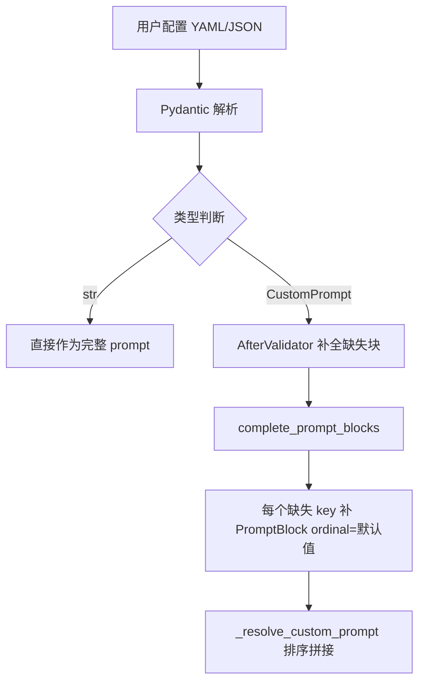
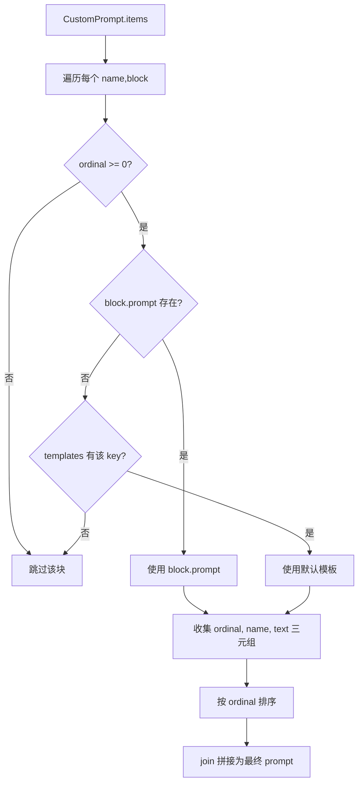

# PD-533.01 memU — CustomPrompt/PromptBlock 七块 ordinal 排序与记忆类型定制模板

> 文档编号：PD-533.01
> 来源：memU `src/memu/app/settings.py`, `src/memu/app/memorize.py`, `src/memu/prompts/`
> GitHub：https://github.com/NevaMind-AI/memU.git
> 问题域：PD-533 配置驱动的 Prompt 工程 Configurable Prompt Engineering
> 状态：可复用方案

---

## 第 1 章 问题与动机（≥ 30 行）

### 1.1 核心问题

LLM 应用中 prompt 管理面临三个层次的挑战：

1. **硬编码 prompt 不可维护** — 当 prompt 散落在业务代码中，修改一个措辞需要改代码、重新部署。对于记忆系统这种需要为 profile/event/knowledge/behavior/skill/tool 六种记忆类型各维护一套提取 prompt 的场景，硬编码意味着 6×7=42 个 prompt 块的维护噩梦。
2. **用户定制需求** — 不同用户/租户对记忆提取的侧重点不同（有人关注事件细节，有人关注行为模式），需要支持用户级别的 prompt 覆盖，同时保留合理的默认值。
3. **prompt 注入风险** — 用户提供的文本（对话内容、文档）会被插入到 prompt 模板中，如果不做转义，`{` 和 `}` 字符会破坏 Python format string，导致 KeyError 或注入攻击。

### 1.2 memU 的解法概述

memU 设计了一套 **PromptBlock + CustomPrompt + ordinal 排序** 的三层 prompt 工程体系：

1. **PromptBlock 分块** — 每个 prompt 被拆分为 7 个语义块（objective/workflow/rules/category/output/examples/input），每块有独立的 `ordinal` 排序值（`src/memu/prompts/memory_type/__init__.py:30-38`）
2. **CustomPrompt 覆盖** — 用户可以通过 Pydantic 配置覆盖任意块的内容或排序，未覆盖的块自动补全默认值（`src/memu/app/settings.py:54-58`）
3. **_escape_prompt_value 防注入** — 所有用户输入在插入 prompt 前统一转义 `{` → `{{`，`}` → `}}`（`src/memu/app/service.py:372-373`）
4. **记忆类型独立模板** — 6 种记忆类型各有完整的 PROMPT_BLOCK_* 定义和 CUSTOM_PROMPT 字典，支持独立定制（`src/memu/prompts/memory_type/`）
5. **AfterValidator 自动补全** — Pydantic 的 AfterValidator 在配置加载时自动将缺失的 prompt 块补全为默认 ordinal（`src/memu/app/settings.py:61-64`）

### 1.3 设计思想

| 设计原则 | 具体实现 | 理由 | 替代方案 |
|----------|----------|------|----------|
| 分块组合优于整体替换 | 7 块 PromptBlock 独立可覆盖 | 用户只需改一块，其余保持默认 | Jinja2 模板继承（更重） |
| ordinal 排序优于固定顺序 | 每块有 ordinal 字段，排序后拼接 | 用户可插入新块或调整顺序 | 数组索引（不灵活） |
| 配置即代码 | Pydantic BaseModel + RootModel | 类型安全 + 序列化 + 校验一体 | YAML/JSON schema（无运行时校验） |
| 防御性转义 | `_escape_prompt_value` 统一入口 | 防止 format string 注入 | 用 Jinja2 的 autoescape（引入新依赖） |
| 默认值自动补全 | AfterValidator + complete_prompt_blocks | 用户只需声明要改的块 | 手动 merge dict（易遗漏） |

---

## 第 2 章 源码实现分析（≥ 60 行，核心章节）

### 2.1 架构概览

memU 的 prompt 工程体系分为三层：定义层（prompts/）、配置层（settings.py）、运行层（memorize.py）。

```
┌─────────────────────────────────────────────────────────────┐
│                    Settings (Pydantic)                       │
│  MemorizeConfig.memory_type_prompts: dict[str, str|Custom]  │
│  MemorizeConfig.default_category_summary_prompt             │
│  CategoryConfig.summary_prompt                              │
└──────────────┬──────────────────────────────────────────────┘
               │ AfterValidator: complete_prompt_blocks()
               ▼
┌─────────────────────────────────────────────────────────────┐
│              CustomPrompt (RootModel)                        │
│  root: dict[str, PromptBlock]                               │
│    PromptBlock { label, ordinal: int, prompt: str|None }    │
└──────────────┬──────────────────────────────────────────────┘
               │ _resolve_custom_prompt()
               ▼
┌─────────────────────────────────────────────────────────────┐
│           Default Prompt Templates (prompts/)               │
│  profile.py / event.py / knowledge.py / behavior.py ...    │
│  每个文件: PROMPT_BLOCK_* (7块) + CUSTOM_PROMPT (dict)      │
│  + PROMPT (join 后的完整 prompt)                             │
└──────────────┬──────────────────────────────────────────────┘
               │ .format(resource=..., categories_str=...)
               ▼
┌─────────────────────────────────────────────────────────────┐
│           Runtime: _escape_prompt_value()                    │
│  所有用户输入 { → {{, } → }} 后再 format                     │
└─────────────────────────────────────────────────────────────┘
```

### 2.2 核心实现

#### 2.2.1 PromptBlock 与 CustomPrompt 数据结构



对应源码 `src/memu/app/settings.py:38-58`：

```python
class PromptBlock(BaseModel):
    label: str | None = None
    ordinal: int = Field(default=0)
    prompt: str | None = None


class CustomPrompt(RootModel[dict[str, PromptBlock]]):
    root: dict[str, PromptBlock] = Field(default_factory=dict)

    def get(self, key: str, default: PromptBlock | None = None) -> PromptBlock | None:
        return self.root.get(key, default)

    def items(self) -> list[tuple[str, PromptBlock]]:
        return list(self.root.items())


def complete_prompt_blocks(prompt: CustomPrompt, default_blocks: Mapping[str, int]) -> CustomPrompt:
    for key, ordinal in default_blocks.items():
        if key not in prompt.root:
            prompt.root[key] = PromptBlock(ordinal=ordinal)
    return prompt
```

关键设计：`PromptBlock.prompt` 为 `None` 时，`_resolve_custom_prompt` 会回退到默认模板中对应 key 的内容。`ordinal` 为负数时该块被跳过（禁用机制）。

#### 2.2.2 _resolve_custom_prompt 排序拼接逻辑



对应源码 `src/memu/app/memorize.py:410-422`：

```python
@staticmethod
def _resolve_custom_prompt(prompt: str | CustomPrompt, templates: Mapping[str, str]) -> str:
    if isinstance(prompt, str):
        return prompt
    valid_blocks = [
        (block.ordinal, name, block.prompt or templates.get(name))
        for name, block in prompt.items()
        if (block.ordinal >= 0 and (block.prompt or templates.get(name)))
    ]
    if not valid_blocks:
        return ""
    sorted_blocks = sorted(valid_blocks)
    return "\n\n".join(block for (_, _, block) in sorted_blocks if block is not None)
```

这段代码的精妙之处：`block.prompt or templates.get(name)` 实现了"用户覆盖优先，默认兜底"的双层回退。`ordinal >= 0` 的判断让用户可以通过设置 `ordinal: -1` 来禁用某个块。

#### 2.2.3 记忆类型 prompt 模板结构

每种记忆类型（以 profile 为例）定义了 7 个 PROMPT_BLOCK_* 常量和两个导出：

- `PROMPT` — 7 块 join 后的完整默认 prompt
- `CUSTOM_PROMPT` — key→text 的字典，供 `_resolve_custom_prompt` 作为 templates 参数

对应源码 `src/memu/prompts/memory_type/profile.py:172-190`：

```python
PROMPT = "\n\n".join([
    PROMPT_BLOCK_OBJECTIVE.strip(),
    PROMPT_BLOCK_WORKFLOW.strip(),
    PROMPT_BLOCK_RULES.strip(),
    PROMPT_BLOCK_CATEGORY.strip(),
    PROMPT_BLOCK_OUTPUT.strip(),
    PROMPT_BLOCK_EXAMPLES.strip(),
    PROMPT_BLOCK_INPUT.strip(),
])

CUSTOM_PROMPT = {
    "objective": PROMPT_BLOCK_OBJECTIVE.strip(),
    "workflow": PROMPT_BLOCK_WORKFLOW.strip(),
    "rules": PROMPT_BLOCK_RULES.strip(),
    "category": PROMPT_BLOCK_CATEGORY.strip(),
    "output": PROMPT_BLOCK_OUTPUT.strip(),
    "examples": PROMPT_BLOCK_EXAMPLES.strip(),
    "input": PROMPT_BLOCK_INPUT.strip(),
}
```

默认 ordinal 定义在 `src/memu/prompts/memory_type/__init__.py:30-38`：

```python
DEFAULT_MEMORY_CUSTOM_PROMPT_ORDINAL: dict[str, int] = {
    "objective": 10,
    "workflow": 20,
    "rules": 30,
    "category": 40,
    "output": 50,
    "examples": 60,
    "input": 90,
}
```

ordinal 间隔为 10，留出了插入自定义块的空间（如 ordinal=25 可以在 workflow 和 rules 之间插入新块）。

### 2.3 实现细节

#### prompt 值转义防注入

`_escape_prompt_value` (`src/memu/app/service.py:372-373`) 将 `{` 和 `}` 转义为 `{{` 和 `}}`，防止用户输入中的花括号破坏 Python `str.format()` 调用：

```python
@staticmethod
def _escape_prompt_value(value: str) -> str:
    return value.replace("{", "{{").replace("}", "}}")
```

所有 `.format()` 调用前都经过此转义，如 `src/memu/app/memorize.py:977-979`：

```python
safe_resource = self._escape_prompt_value(resource_text)
safe_categories = self._escape_prompt_value(categories_str)
return template.format(resource=safe_resource, categories_str=safe_categories)
```

#### 三层 prompt 解析优先级

`_build_memory_type_prompt` (`src/memu/app/memorize.py:965-979`) 展示了完整的三层优先级：

1. 用户配置为 `str` → 直接使用
2. 用户配置为 `CustomPrompt` → `_resolve_custom_prompt` 排序拼接
3. 用户未配置 → 使用默认 `MEMORY_TYPE_PROMPTS[memory_type]`

#### category summary prompt 的双入口覆盖

`_build_category_summary_prompt` (`src/memu/app/memorize.py:1038-1098`) 支持两级覆盖：

1. **CategoryConfig.summary_prompt** — 单个分类级别的 prompt 覆盖
2. **MemorizeConfig.default_category_summary_prompt** — 全局默认 summary prompt

这意味着用户可以为"个人信息"分类用一套 prompt，为"工作生活"分类用另一套，其余分类用全局默认。

---

## 第 3 章 迁移指南（≥ 40 行）

### 3.1 迁移清单

**阶段 1：定义 PromptBlock 基础设施**
- [ ] 创建 `PromptBlock` 和 `CustomPrompt` Pydantic 模型
- [ ] 定义默认 ordinal 映射表（建议间隔 10）
- [ ] 实现 `complete_prompt_blocks` 自动补全函数
- [ ] 配置 Pydantic `AfterValidator` 绑定补全逻辑

**阶段 2：拆分现有 prompt 为块**
- [ ] 将每个 prompt 拆分为语义块（objective/workflow/rules/output/examples/input）
- [ ] 为每个块创建 `PROMPT_BLOCK_*` 常量
- [ ] 导出 `PROMPT`（join 后完整版）和 `CUSTOM_PROMPT`（dict 版）

**阶段 3：实现运行时解析**
- [ ] 实现 `_resolve_custom_prompt` 排序拼接方法
- [ ] 实现 `_escape_prompt_value` 转义方法
- [ ] 在所有 `.format()` 调用前统一转义用户输入

**阶段 4：接入配置系统**
- [ ] 在 Settings 中添加 `prompt` 字段，类型为 `str | CustomPrompt`
- [ ] 实现三层优先级：用户 str > 用户 CustomPrompt > 默认模板

### 3.2 适配代码模板

以下代码可直接复用，实现 PromptBlock 分块组合系统：

```python
from __future__ import annotations

from collections.abc import Mapping
from typing import Any

from pydantic import AfterValidator, BaseModel, Field, RootModel


class PromptBlock(BaseModel):
    """单个 prompt 块，支持 ordinal 排序和内容覆盖。"""
    label: str | None = None
    ordinal: int = Field(default=0, description="排序权重，负数表示禁用该块")
    prompt: str | None = None


class CustomPrompt(RootModel[dict[str, PromptBlock]]):
    """用户自定义 prompt 配置，key 为块名，value 为 PromptBlock。"""
    root: dict[str, PromptBlock] = Field(default_factory=dict)

    def get(self, key: str, default: PromptBlock | None = None) -> PromptBlock | None:
        return self.root.get(key, default)

    def items(self) -> list[tuple[str, PromptBlock]]:
        return list(self.root.items())


def complete_prompt_blocks(
    prompt: CustomPrompt,
    default_blocks: Mapping[str, int],
) -> CustomPrompt:
    """自动补全用户未声明的 prompt 块，填入默认 ordinal。"""
    for key, ordinal in default_blocks.items():
        if key not in prompt.root:
            prompt.root[key] = PromptBlock(ordinal=ordinal)
    return prompt


# 默认 ordinal 映射（间隔 10，方便插入）
DEFAULT_ORDINALS: dict[str, int] = {
    "objective": 10,
    "workflow": 20,
    "rules": 30,
    "output": 50,
    "examples": 60,
    "input": 90,
}

# Pydantic AfterValidator 绑定
CompletePrompt = AfterValidator(
    lambda v: complete_prompt_blocks(v, DEFAULT_ORDINALS)
)


def resolve_custom_prompt(
    prompt: str | CustomPrompt,
    templates: Mapping[str, str],
) -> str:
    """将 CustomPrompt 按 ordinal 排序拼接为最终 prompt 字符串。"""
    if isinstance(prompt, str):
        return prompt
    valid_blocks = [
        (block.ordinal, name, block.prompt or templates.get(name))
        for name, block in prompt.items()
        if block.ordinal >= 0 and (block.prompt or templates.get(name))
    ]
    if not valid_blocks:
        return ""
    sorted_blocks = sorted(valid_blocks)
    return "\n\n".join(
        text for (_, _, text) in sorted_blocks if text is not None
    )


def escape_prompt_value(value: str) -> str:
    """转义用户输入中的花括号，防止 format string 注入。"""
    return value.replace("{", "{{").replace("}", "}}")
```

### 3.3 适用场景

| 场景 | 适用度 | 说明 |
|------|--------|------|
| 多记忆类型/多任务 prompt 管理 | ⭐⭐⭐ | 每种类型独立模板 + 统一覆盖机制 |
| SaaS 多租户 prompt 定制 | ⭐⭐⭐ | 用户只需覆盖关心的块，其余保持默认 |
| prompt A/B 测试 | ⭐⭐⭐ | 通过 ordinal 调整块顺序，观察效果差异 |
| 单一 prompt 简单应用 | ⭐ | 过度设计，直接用字符串即可 |
| 需要条件分支的 prompt | ⭐⭐ | ordinal 排序是线性的，复杂分支需额外逻辑 |

---

## 第 4 章 测试用例（≥ 20 行）

```python
import pytest
from pydantic import BaseModel, Field
from typing import Annotated


# 假设已导入上述迁移代码
from prompt_blocks import (
    PromptBlock,
    CustomPrompt,
    complete_prompt_blocks,
    resolve_custom_prompt,
    escape_prompt_value,
    DEFAULT_ORDINALS,
    CompletePrompt,
)


class TestPromptBlock:
    def test_default_ordinal_is_zero(self):
        block = PromptBlock()
        assert block.ordinal == 0
        assert block.prompt is None
        assert block.label is None

    def test_custom_prompt_with_content(self):
        block = PromptBlock(ordinal=15, prompt="Custom objective text")
        assert block.ordinal == 15
        assert block.prompt == "Custom objective text"


class TestCompletePromptBlocks:
    def test_fills_missing_blocks(self):
        prompt = CustomPrompt(root={
            "objective": PromptBlock(ordinal=10, prompt="My objective"),
        })
        defaults = {"objective": 10, "workflow": 20, "rules": 30}
        result = complete_prompt_blocks(prompt, defaults)
        assert "workflow" in result.root
        assert result.root["workflow"].ordinal == 20
        assert result.root["workflow"].prompt is None  # 未覆盖

    def test_preserves_existing_blocks(self):
        prompt = CustomPrompt(root={
            "workflow": PromptBlock(ordinal=25, prompt="Custom workflow"),
        })
        defaults = {"objective": 10, "workflow": 20}
        result = complete_prompt_blocks(prompt, defaults)
        assert result.root["workflow"].ordinal == 25  # 保持用户值
        assert result.root["workflow"].prompt == "Custom workflow"


class TestResolveCustomPrompt:
    def test_string_passthrough(self):
        assert resolve_custom_prompt("raw prompt", {}) == "raw prompt"

    def test_ordinal_sorting(self):
        prompt = CustomPrompt(root={
            "input": PromptBlock(ordinal=90, prompt="INPUT"),
            "objective": PromptBlock(ordinal=10, prompt="OBJECTIVE"),
            "rules": PromptBlock(ordinal=30, prompt="RULES"),
        })
        result = resolve_custom_prompt(prompt, {})
        assert result == "OBJECTIVE\n\nRULES\n\nINPUT"

    def test_negative_ordinal_disables_block(self):
        prompt = CustomPrompt(root={
            "objective": PromptBlock(ordinal=10, prompt="OBJ"),
            "examples": PromptBlock(ordinal=-1, prompt="SKIP ME"),
            "input": PromptBlock(ordinal=90, prompt="IN"),
        })
        result = resolve_custom_prompt(prompt, {})
        assert "SKIP ME" not in result
        assert result == "OBJ\n\nIN"

    def test_fallback_to_template(self):
        prompt = CustomPrompt(root={
            "objective": PromptBlock(ordinal=10),  # prompt=None
        })
        templates = {"objective": "Default objective"}
        result = resolve_custom_prompt(prompt, templates)
        assert result == "Default objective"

    def test_user_prompt_overrides_template(self):
        prompt = CustomPrompt(root={
            "objective": PromptBlock(ordinal=10, prompt="User objective"),
        })
        templates = {"objective": "Default objective"}
        result = resolve_custom_prompt(prompt, templates)
        assert result == "User objective"


class TestEscapePromptValue:
    def test_escapes_braces(self):
        assert escape_prompt_value("Hello {world}") == "Hello {{world}}"

    def test_no_change_without_braces(self):
        assert escape_prompt_value("Hello world") == "Hello world"

    def test_nested_braces(self):
        assert escape_prompt_value("{{already}}") == "{{{{already}}}}"

    def test_format_safe_after_escape(self):
        template = "Resource: {resource}"
        user_input = "data with {key} inside"
        safe = escape_prompt_value(user_input)
        result = template.format(resource=safe)
        assert result == "Resource: data with {key} inside"
```

---

## 第 5 章 跨域关联

| 关联域 | 关系类型 | 说明 |
|--------|----------|------|
| PD-01 上下文管理 | 协同 | prompt 块的 ordinal 排序直接影响 token 消耗；category summary prompt 中的 `target_length` 参数是上下文窗口管理的一部分 |
| PD-06 记忆持久化 | 依赖 | prompt 模板驱动记忆提取（profile/event/knowledge/behavior），提取结果写入持久化存储；category summary prompt 控制摘要更新策略 |
| PD-10 中间件管道 | 协同 | memU 的 WorkflowStep 管道中，每个步骤可通过 `config` 字段指定 `llm_profile`，prompt 配置与管道步骤配置协同工作 |
| PD-04 工具系统 | 协同 | skill/tool 类型的记忆提取 prompt 本质上是工具能力的结构化描述，prompt 模板定义了工具信息的提取规范 |

---

## 第 6 章 来源文件索引

| 文件 | 行范围 | 关键实现 |
|------|--------|----------|
| `src/memu/app/settings.py` | L38-L58 | PromptBlock、CustomPrompt、complete_prompt_blocks 核心数据结构 |
| `src/memu/app/settings.py` | L61-L64 | AfterValidator 绑定 CompleteMemoryTypePrompt / CompleteCategoryPrompt |
| `src/memu/app/settings.py` | L204-L228 | MemorizeConfig 中 memory_type_prompts 和 default_category_summary_prompt 配置 |
| `src/memu/app/settings.py` | L67-L71 | CategoryConfig.summary_prompt 分类级 prompt 覆盖 |
| `src/memu/app/memorize.py` | L410-L422 | _resolve_custom_prompt 排序拼接核心逻辑 |
| `src/memu/app/memorize.py` | L965-L979 | _build_memory_type_prompt 三层优先级解析 |
| `src/memu/app/memorize.py` | L1038-L1098 | _build_category_summary_prompt 双入口覆盖 |
| `src/memu/app/service.py` | L372-L373 | _escape_prompt_value 转义防注入 |
| `src/memu/prompts/memory_type/__init__.py` | L1-L47 | DEFAULT_MEMORY_TYPES、PROMPTS、CUSTOM_PROMPTS、DEFAULT_MEMORY_CUSTOM_PROMPT_ORDINAL |
| `src/memu/prompts/memory_type/profile.py` | L56-L190 | profile 类型 7 块 PROMPT_BLOCK_* 定义 |
| `src/memu/prompts/memory_type/event.py` | L57-L182 | event 类型 7 块 PROMPT_BLOCK_* 定义 |
| `src/memu/prompts/memory_type/knowledge.py` | L47-L172 | knowledge 类型 7 块定义 |
| `src/memu/prompts/memory_type/behavior.py` | L45-L176 | behavior 类型 7 块定义 |
| `src/memu/prompts/category_summary/__init__.py` | L1-L22 | DEFAULT_CATEGORY_SUMMARY_PROMPT_ORDINAL |
| `src/memu/prompts/category_summary/category.py` | L146-L296 | category summary 6 块 PROMPT_BLOCK_* + CUSTOM_PROMPT |

---

## 第 7 章 横向对比维度

```json comparison_data
{
  "project": "memU",
  "dimensions": {
    "模板结构": "7 块 PromptBlock（objective/workflow/rules/category/output/examples/input）ordinal 排序拼接",
    "覆盖机制": "三层优先级：用户 str 直接替换 > CustomPrompt 块级覆盖 > 默认模板回退",
    "类型特化": "6 种记忆类型（profile/event/knowledge/behavior/skill/tool）各有独立完整模板",
    "防注入": "_escape_prompt_value 统一转义 { → {{ 防止 format string 注入",
    "自动补全": "Pydantic AfterValidator + complete_prompt_blocks 自动填充缺失块的默认 ordinal",
    "分类级定制": "CategoryConfig.summary_prompt 支持单分类级别 prompt 覆盖，优先于全局默认"
  }
}
```

### 域元数据补充

```json domain_metadata
{
  "solution_summary": "memU 用 PromptBlock 七块 ordinal 排序 + CustomPrompt RootModel 实现 6 种记忆类型的 prompt 分块组合与三层优先级覆盖，配合 AfterValidator 自动补全和 _escape_prompt_value 防注入",
  "description": "prompt 模板的分块组合、排序拼接与多层级覆盖机制",
  "sub_problems": [
    "分类级 prompt 覆盖（单个 category 独立 prompt 配置）",
    "prompt 块禁用机制（负 ordinal 跳过）",
    "Legacy prompt 到分块 prompt 的渐进迁移"
  ],
  "best_practices": [
    "ordinal 间隔设为 10 留出插入空间",
    "AfterValidator 在配置加载时自动补全缺失块",
    "所有 .format() 调用前统一经过转义函数"
  ]
}
```
