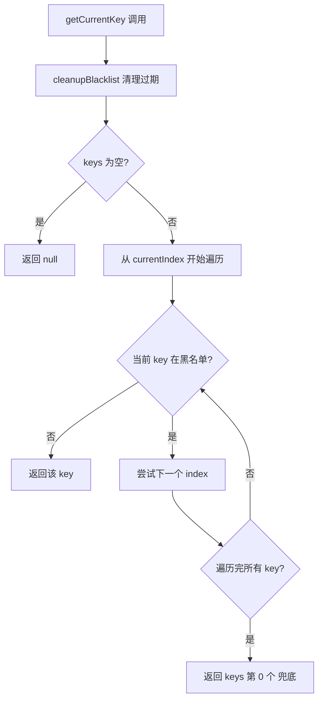
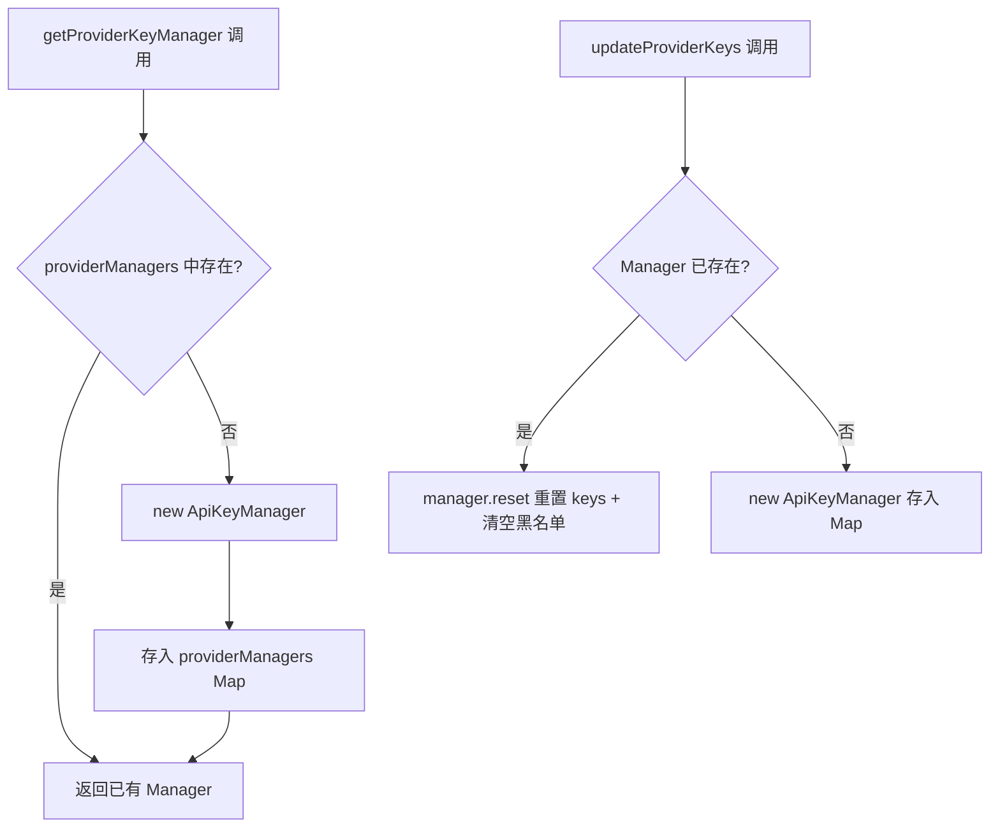

# PD-535.01 moyin-creator — ApiKeyManager 多 Key 轮转与黑名单冷却恢复

> 文档编号：PD-535.01
> 来源：moyin-creator `src/lib/api-key-manager.ts`
> GitHub：https://github.com/MemeCalculate/moyin-creator.git
> 问题域：PD-535 API Key 轮转管理
> 状态：可复用方案

---

## 第 1 章 问题与动机

### 1.1 核心问题

AI 应用在生产环境中频繁调用多个 LLM/图床 API，单 Key 面临三大风险：

1. **速率限制（429）**：单 Key 的 RPM/TPM 配额耗尽后请求全部失败
2. **Key 失效（401）**：Key 过期、被吊销或余额不足导致服务中断
3. **服务不可用（503）**：供应商临时故障需要快速切换

moyin-creator 是一个 AI 短视频创作工具，单次创作流程涉及剧本分析、角色生成、场景生成、视频生成、图片上传等多个 AI 调用环节，任何一个环节的 Key 失效都会中断整个流水线。因此需要一套统一的多 Key 管理机制，覆盖所有 API 调用场景。

### 1.2 moyin-creator 的解法概述

moyin-creator 采用三层架构解决 API Key 轮转问题：

1. **ApiKeyManager 核心类**（`src/lib/api-key-manager.ts:259-387`）：封装 Key 池管理、Round-Robin 轮转、黑名单冷却恢复，是所有 Key 轮转的基础设施
2. **Provider 级全局管理器映射**（`src/lib/api-key-manager.ts:392-425`）：`providerManagers` 全局 Map 为每个供应商维护独立的 ApiKeyManager 实例，Key 更新时自动 reset
3. **Feature Router 多模型轮询**（`src/lib/ai/feature-router.ts:36-37`）：在 Key 轮转之上叠加功能级模型轮询，实现 Provider×Model×Key 三维负载分散
4. **Image Host 双层轮转**（`src/lib/image-host.ts:167-172`）：图床上传场景额外实现 Provider 级轮转 + Key 级轮转的双层 fallback

### 1.3 设计思想

| 设计原则 | 具体实现 | 理由 | 替代方案 |
|----------|----------|------|----------|
| 冷却而非永久移除 | 黑名单 90s 自动过期（`BLACKLIST_DURATION_MS = 90_000`） | 429 是临时状态，永久移除会浪费可用 Key | 永久移除 + 手动恢复 |
| 随机起始索引 | 构造时 `Math.random()` 选起点 | 多实例并发时避免全部从 Key[0] 开始导致热点 | 固定从 0 开始 |
| 按 HTTP 状态码分类处理 | 仅 429/401/503 触发轮转 | 400（参数错误）等不应轮转，轮转无意义 | 所有错误都轮转 |
| 全局单例 Map | `providerManagers` 全局 Map 按 providerId 索引 | 同一 Provider 的不同调用点共享黑名单状态 | 每次调用新建 Manager |
| 解析即池化 | `parseApiKeys()` 支持逗号/换行分隔 | 用户在 UI 文本框粘贴多 Key 时无需关心格式 | 仅支持逗号分隔 |

---

## 第 2 章 源码实现分析

### 2.1 架构概览

```
┌─────────────────────────────────────────────────────────────┐
│                    api-config-store (Zustand)                │
│  providers: IProvider[]  ←→  updateProviderKeys(id, apiKey) │
└──────────────┬──────────────────────────────────────────────┘
               │ 写入/更新
               ▼
┌─────────────────────────────────────────────────────────────┐
│              providerManagers: Map<string, ApiKeyManager>    │
│  ┌──────────┐  ┌──────────┐  ┌──────────┐                  │
│  │ memefast │  │runninghub│  │ imgbb    │                  │
│  │ Manager  │  │ Manager  │  │ Manager  │                  │
│  └──────────┘  └──────────┘  └──────────┘                  │
└──────────────┬──────────────────────────────────────────────┘
               │ getCurrentKey() / rotateKey() / handleError()
               ▼
┌─────────────────────────────────────────────────────────────┐
│  消费者                                                      │
│  ├─ feature-router.ts  → callFeatureAPI() 文本/图片/视频     │
│  ├─ script-parser.ts   → callChatAPI() 剧本解析              │
│  ├─ image-host.ts      → uploadToImageHost() 图床上传        │
│  └─ use-video-generation.ts → getVideoApiConfig() 视频生成   │
└─────────────────────────────────────────────────────────────┘
```

### 2.2 核心实现

#### 2.2.1 ApiKeyManager 类 — Key 池与黑名单



对应源码 `src/lib/api-key-manager.ts:259-387`：

```typescript
const BLACKLIST_DURATION_MS = 90 * 1000; // 90 seconds

export class ApiKeyManager {
  private keys: string[];
  private currentIndex: number;
  private blacklist: Map<string, BlacklistedKey> = new Map();

  constructor(apiKeyString: string) {
    this.keys = parseApiKeys(apiKeyString);
    // 随机起始索引，多实例并发时避免热点
    this.currentIndex = this.keys.length > 0
      ? Math.floor(Math.random() * this.keys.length) : 0;
  }

  getCurrentKey(): string | null {
    this.cleanupBlacklist();
    if (this.keys.length === 0) return null;
    for (let i = 0; i < this.keys.length; i++) {
      const index = (this.currentIndex + i) % this.keys.length;
      const key = this.keys[index];
      if (!this.blacklist.has(key)) {
        this.currentIndex = index;
        return key;
      }
    }
    // 全部黑名单时兜底返回第一个
    return this.keys.length > 0 ? this.keys[0] : null;
  }

  handleError(statusCode: number): boolean {
    if (statusCode === 429 || statusCode === 401 || statusCode === 503) {
      this.markCurrentKeyFailed();
      return true;
    }
    return false;
  }

  private cleanupBlacklist(): void {
    const now = Date.now();
    for (const [key, entry] of this.blacklist.entries()) {
      if (now - entry.blacklistedAt >= BLACKLIST_DURATION_MS) {
        this.blacklist.delete(key);
      }
    }
  }
}
```

关键设计点：
- **`cleanupBlacklist()` 惰性清理**（`api-key-manager.ts:370-377`）：每次 `getCurrentKey()` 和 `rotateKey()` 调用时自动清理过期条目，无需定时器
- **全部黑名单兜底**（`api-key-manager.ts:290`）：当所有 Key 都在冷却期时，仍返回第一个 Key 而非 null，避免服务完全中断
- **`handleError()` 状态码过滤**（`api-key-manager.ts:336-343`）：仅对 429/401/503 触发轮转，400 等客户端错误不轮转

#### 2.2.2 Provider 级全局管理器



对应源码 `src/lib/api-key-manager.ts:392-425`：

```typescript
const providerManagers = new Map<string, ApiKeyManager>();

export function getProviderKeyManager(providerId: string, apiKey: string): ApiKeyManager {
  let manager = providerManagers.get(providerId);
  if (!manager) {
    manager = new ApiKeyManager(apiKey);
    providerManagers.set(providerId, manager);
  }
  return manager;
}

export function updateProviderKeys(providerId: string, apiKey: string): void {
  const manager = providerManagers.get(providerId);
  if (manager) {
    manager.reset(apiKey);
  } else {
    providerManagers.set(providerId, new ApiKeyManager(apiKey));
  }
}
```

### 2.3 实现细节

#### 双层轮转：图床上传场景

`image-host.ts` 实现了 Provider 级 + Key 级的双层轮转：

1. **Provider 轮转**（`image-host.ts:167-172`）：`getRotatedProviders()` 用全局 `providerCursor` 实现 Round-Robin，每次上传从不同 Provider 开始尝试
2. **Key 轮转**（`image-host.ts:207-229`）：每个 Provider 内部用独立的 `ApiKeyManager` 管理多 Key，失败时 `markCurrentKeyFailed()` 并重试

```
Provider A (imgbb)          Provider B (custom)
  ├─ Key A1 ← 当前          ├─ Key B1
  ├─ Key A2                  ├─ Key B2 ← 当前
  └─ Key A3 [黑名单 60s]     └─ Key B3
```

上传失败时：先在当前 Provider 内轮转 Key（最多 `min(3, keyCount)` 次），全部失败后切换到下一个 Provider。

#### Feature Router 多模型轮询

`feature-router.ts:36-37` 在 Key 轮转之上叠加了功能级模型轮询：

```typescript
const featureRoundRobinIndex: Map<AIFeature, number> = new Map();
```

每个 AI 功能（如 `character_generation`）可绑定多个 Provider:Model 组合，`getFeatureConfig()` 每次调用递增索引，实现 Provider×Model 维度的负载分散。Key 轮转在此之下独立运作。

#### callChatAPI 中的 Key 轮转集成

`script-parser.ts:287-460` 展示了 Key 轮转在实际 API 调用中的集成方式：

- 请求前：`keyManager.getCurrentKey()` 获取当前可用 Key
- 请求失败：`keyManager.handleError(response.status)` 按状态码决定是否轮转
- 请求成功：`keyManager.rotateKey()` 主动轮转分散负载（仅多 Key 时）
- 内容过滤：`keyManager.handleError(403)` 对智谱 sensitive 过滤也触发轮转

---

## 第 3 章 迁移指南

### 3.1 迁移清单

**阶段 1：核心 Key 管理器（1 个文件）**

- [ ] 复制 `ApiKeyManager` 类 + `parseApiKeys()` + `BlacklistedKey` 接口
- [ ] 调整 `BLACKLIST_DURATION_MS` 为你的场景（默认 90s，高频调用可缩短到 30s）
- [ ] 实现全局 `providerManagers` Map + `getProviderKeyManager()` / `updateProviderKeys()`

**阶段 2：集成到 API 调用层**

- [ ] 在 API 调用前用 `keyManager.getCurrentKey()` 获取 Key
- [ ] 在 catch/error 中调用 `keyManager.handleError(statusCode)` 触发轮转
- [ ] 成功请求后调用 `keyManager.rotateKey()` 分散负载（可选）

**阶段 3：集成到状态管理**

- [ ] Provider 增删改时调用 `updateProviderKeys()` 同步 Manager
- [ ] UI 层用 `parseApiKeys()` 显示 Key 数量和掩码

### 3.2 适配代码模板

以下是一个可直接运行的 TypeScript 实现，从 moyin-creator 提炼而来：

```typescript
// api-key-manager.ts — 可独立使用的 Key 轮转管理器

interface BlacklistedKey {
  key: string;
  blacklistedAt: number;
}

export function parseApiKeys(raw: string): string[] {
  if (!raw) return [];
  return raw.split(/[,\n]/).map(k => k.trim()).filter(k => k.length > 0);
}

export class ApiKeyManager {
  private keys: string[];
  private idx: number;
  private blacklist = new Map<string, BlacklistedKey>();
  private cooldownMs: number;

  constructor(apiKeyString: string, cooldownMs = 90_000) {
    this.keys = parseApiKeys(apiKeyString);
    this.idx = this.keys.length > 0 ? Math.floor(Math.random() * this.keys.length) : 0;
    this.cooldownMs = cooldownMs;
  }

  getCurrentKey(): string | null {
    this.cleanup();
    if (this.keys.length === 0) return null;
    for (let i = 0; i < this.keys.length; i++) {
      const index = (this.idx + i) % this.keys.length;
      if (!this.blacklist.has(this.keys[index])) {
        this.idx = index;
        return this.keys[index];
      }
    }
    return this.keys[0]; // 全部冷却时兜底
  }

  rotateKey(): string | null {
    this.cleanup();
    if (this.keys.length <= 1) return this.getCurrentKey();
    this.idx = (this.idx + 1) % this.keys.length;
    return this.getCurrentKey();
  }

  markFailed(key?: string): void {
    const k = key || this.keys[this.idx];
    if (k) this.blacklist.set(k, { key: k, blacklistedAt: Date.now() });
    this.rotateKey();
  }

  /** 返回 true 表示已轮转 */
  handleError(statusCode: number): boolean {
    if ([429, 401, 403, 503].includes(statusCode)) {
      this.markFailed();
      return true;
    }
    return false;
  }

  getAvailableCount(): number {
    this.cleanup();
    return this.keys.filter(k => !this.blacklist.has(k)).length;
  }

  reset(apiKeyString: string): void {
    this.keys = parseApiKeys(apiKeyString);
    this.idx = this.keys.length > 0 ? Math.floor(Math.random() * this.keys.length) : 0;
    this.blacklist.clear();
  }

  private cleanup(): void {
    const now = Date.now();
    for (const [k, entry] of this.blacklist) {
      if (now - entry.blacklistedAt >= this.cooldownMs) this.blacklist.delete(k);
    }
  }
}

// 全局 Provider 管理器
const managers = new Map<string, ApiKeyManager>();

export function getManager(providerId: string, apiKey: string): ApiKeyManager {
  let m = managers.get(providerId);
  if (!m) { m = new ApiKeyManager(apiKey); managers.set(providerId, m); }
  return m;
}

export function updateManager(providerId: string, apiKey: string): void {
  const m = managers.get(providerId);
  if (m) m.reset(apiKey); else managers.set(providerId, new ApiKeyManager(apiKey));
}
```

使用示例：

```typescript
const manager = getManager('openai', 'sk-key1,sk-key2,sk-key3');

async function callAPI(prompt: string) {
  const key = manager.getCurrentKey();
  if (!key) throw new Error('No API keys available');

  const resp = await fetch('https://api.openai.com/v1/chat/completions', {
    headers: { 'Authorization': `Bearer ${key}` },
    // ...
  });

  if (!resp.ok) {
    if (manager.handleError(resp.status)) {
      console.log(`Rotated key, available: ${manager.getAvailableCount()}`);
    }
    throw new Error(`API error: ${resp.status}`);
  }

  // 成功后主动轮转分散负载
  manager.rotateKey();
  return resp.json();
}
```

### 3.3 适用场景

| 场景 | 适用度 | 说明 |
|------|--------|------|
| 多 Key 负载均衡 | ⭐⭐⭐ | Round-Robin + 随机起始，天然适合多 Key 分散 |
| 单 Key 容错 | ⭐⭐ | 单 Key 时黑名单无意义，但兜底逻辑仍保证不返回 null |
| 高并发批量调用 | ⭐⭐⭐ | 全局 Manager Map 共享黑名单状态，避免并发请求打同一个坏 Key |
| 多供应商 fallback | ⭐⭐⭐ | image-host 的双层轮转模式可直接复用 |
| 需要权重调度 | ⭐ | 当前仅 Round-Robin，不支持按 Key 配额设置权重 |

---

## 第 4 章 测试用例

```typescript
import { describe, it, expect, vi, beforeEach, afterEach } from 'vitest';

// 从迁移模板导入
import { ApiKeyManager, parseApiKeys } from './api-key-manager';

describe('parseApiKeys', () => {
  it('should parse comma-separated keys', () => {
    expect(parseApiKeys('sk-a,sk-b,sk-c')).toEqual(['sk-a', 'sk-b', 'sk-c']);
  });

  it('should parse newline-separated keys', () => {
    expect(parseApiKeys('sk-a\nsk-b\nsk-c')).toEqual(['sk-a', 'sk-b', 'sk-c']);
  });

  it('should handle mixed separators and whitespace', () => {
    expect(parseApiKeys('sk-a, sk-b\n sk-c ')).toEqual(['sk-a', 'sk-b', 'sk-c']);
  });

  it('should return empty array for empty input', () => {
    expect(parseApiKeys('')).toEqual([]);
  });

  it('should filter out empty entries', () => {
    expect(parseApiKeys('sk-a,,sk-b,,,sk-c')).toEqual(['sk-a', 'sk-b', 'sk-c']);
  });
});

describe('ApiKeyManager', () => {
  beforeEach(() => { vi.useFakeTimers(); });
  afterEach(() => { vi.useRealTimers(); });

  it('should return keys via round-robin rotation', () => {
    // 固定随机种子使起始索引可预测
    vi.spyOn(Math, 'random').mockReturnValue(0);
    const mgr = new ApiKeyManager('sk-a,sk-b,sk-c');
    
    const key1 = mgr.getCurrentKey();
    expect(key1).toBe('sk-a');
    
    const key2 = mgr.rotateKey();
    expect(key2).toBe('sk-b');
    
    const key3 = mgr.rotateKey();
    expect(key3).toBe('sk-c');
    
    // 循环回到第一个
    const key4 = mgr.rotateKey();
    expect(key4).toBe('sk-a');
    
    vi.restoreAllMocks();
  });

  it('should blacklist failed key and skip it', () => {
    vi.spyOn(Math, 'random').mockReturnValue(0);
    const mgr = new ApiKeyManager('sk-a,sk-b,sk-c');
    
    // 标记 sk-a 失败
    mgr.markFailed();
    
    // 应跳过 sk-a
    const key = mgr.getCurrentKey();
    expect(key).toBe('sk-b');
    
    vi.restoreAllMocks();
  });

  it('should recover blacklisted key after cooldown', () => {
    vi.spyOn(Math, 'random').mockReturnValue(0);
    const mgr = new ApiKeyManager('sk-a,sk-b', 90_000);
    
    mgr.markFailed(); // 黑名单 sk-a
    expect(mgr.getCurrentKey()).toBe('sk-b');
    
    // 推进 90 秒
    vi.advanceTimersByTime(90_000);
    
    // sk-a 应已恢复
    expect(mgr.getAvailableCount()).toBe(2);
    
    vi.restoreAllMocks();
  });

  it('should fallback to first key when all blacklisted', () => {
    vi.spyOn(Math, 'random').mockReturnValue(0);
    const mgr = new ApiKeyManager('sk-a,sk-b');
    
    mgr.markFailed(); // 黑名单 sk-a
    mgr.markFailed(); // 黑名单 sk-b
    
    // 全部黑名单时兜底返回第一个
    const key = mgr.getCurrentKey();
    expect(key).toBe('sk-a');
    
    vi.restoreAllMocks();
  });

  it('should only rotate on specific HTTP status codes', () => {
    vi.spyOn(Math, 'random').mockReturnValue(0);
    const mgr = new ApiKeyManager('sk-a,sk-b');
    
    // 400 不应触发轮转
    expect(mgr.handleError(400)).toBe(false);
    expect(mgr.getCurrentKey()).toBe('sk-a');
    
    // 429 应触发轮转
    expect(mgr.handleError(429)).toBe(true);
    expect(mgr.getCurrentKey()).toBe('sk-b');
    
    vi.restoreAllMocks();
  });

  it('should reset keys and clear blacklist', () => {
    const mgr = new ApiKeyManager('sk-a,sk-b');
    mgr.markFailed();
    
    mgr.reset('sk-x,sk-y,sk-z');
    expect(mgr.getAvailableCount()).toBe(3);
    
    const key = mgr.getCurrentKey();
    expect(['sk-x', 'sk-y', 'sk-z']).toContain(key);
  });
});
```

---

## 第 5 章 跨域关联

| 关联域 | 关系类型 | 说明 |
|--------|----------|------|
| PD-03 容错与重试 | 协同 | ApiKeyManager 的 `handleError()` 是容错重试链的一环，Key 轮转发生在 `retryOperation()` 的重试循环内部 |
| PD-04 工具系统 | 协同 | Feature Router 将 `keyManager` 注入到每个 AI 功能调用的配置中，工具系统通过 `FeatureConfig.keyManager` 消费 |
| PD-06 记忆持久化 | 依赖 | Provider 配置（含多 Key 字符串）通过 Zustand persist 持久化到 localStorage，Manager 在运行时从持久化数据重建 |
| PD-10 中间件管道 | 协同 | `callChatAPI` 中 Key 轮转逻辑嵌入在请求-响应管道中，成功/失败都有对应的 Key 管理动作 |
| PD-11 可观测性 | 协同 | 每次 Key 轮转都有 `console.log` 输出可用 Key 数量，便于调试和监控 |

---

## 第 6 章 来源文件索引

| 文件 | 行范围 | 关键实现 |
|------|--------|----------|
| `src/lib/api-key-manager.ts` | L222-228 | `parseApiKeys()` 多格式解析 |
| `src/lib/api-key-manager.ts` | L248-253 | `BlacklistedKey` 接口 + 90s 冷却常量 |
| `src/lib/api-key-manager.ts` | L259-387 | `ApiKeyManager` 类完整实现 |
| `src/lib/api-key-manager.ts` | L392-425 | 全局 `providerManagers` Map + CRUD |
| `src/lib/ai/feature-router.ts` | L36-37 | `featureRoundRobinIndex` 多模型轮询 |
| `src/lib/ai/feature-router.ts` | L97-125 | `getAllFeatureConfigs()` 注入 keyManager |
| `src/lib/ai/feature-router.ts` | L133-182 | `getFeatureConfig()` Round-Robin 调度 |
| `src/lib/image-host.ts` | L29-45 | 图床独立 Key Manager 缓存 |
| `src/lib/image-host.ts` | L167-172 | `getRotatedProviders()` Provider 级轮转 |
| `src/lib/image-host.ts` | L180-233 | `uploadToImageHost()` 双层轮转上传 |
| `src/stores/api-config-store.ts` | L332 | `updateProviderKeys()` 同步 Manager |
| `src/lib/script/script-parser.ts` | L287-460 | `callChatAPI` 中 Key 轮转集成 |

---

## 第 7 章 横向对比维度

```json comparison_data
{
  "project": "moyin-creator",
  "dimensions": {
    "Key解析方式": "parseApiKeys 逗号/换行分隔，trim + filter 空值",
    "轮转策略": "Round-Robin + 随机起始索引，成功后也主动轮转分散负载",
    "失败处理": "按 HTTP 状态码分类（429/401/503 轮转），黑名单 90s 自动恢复",
    "管理器作用域": "全局 providerManagers Map 按 providerId 索引，跨调用点共享状态",
    "多层轮转": "图床场景 Provider 级 + Key 级双层轮转，Feature Router 叠加模型级轮询"
  }
}
```

### 域元数据补充

```json domain_metadata
{
  "solution_summary": "moyin-creator 用 ApiKeyManager 类封装 Round-Robin 轮转 + 90s 黑名单冷却，全局 providerManagers Map 按供应商隔离，图床场景叠加 Provider 级双层轮转",
  "description": "API Key 的运行时健康管理与多维度负载分散机制",
  "sub_problems": [
    "成功请求后的主动轮转负载分散",
    "全部 Key 冷却时的兜底降级策略"
  ],
  "best_practices": [
    "随机起始索引避免多实例并发热点",
    "按 HTTP 状态码分类决定是否轮转（429/401/503 轮转，400 不轮转）",
    "全局单例 Map 共享黑名单状态避免并发打同一坏 Key"
  ]
}
```
