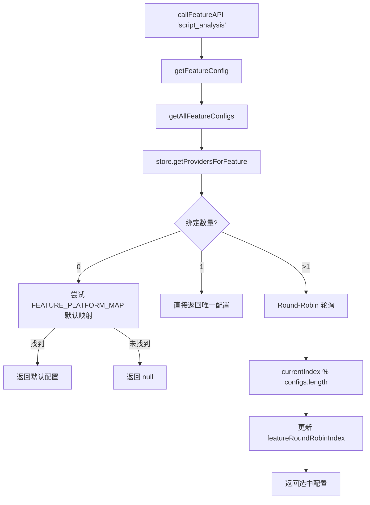
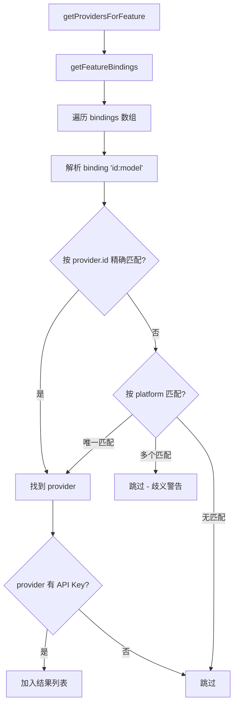

# PD-536.01 moyin-creator — AIFeature 配置驱动多供应商路由与轮询调度

> 文档编号：PD-536.01
> 来源：moyin-creator `src/lib/ai/feature-router.ts` `src/stores/api-config-store.ts`
> GitHub：https://github.com/MemeCalculate/moyin-creator.git
> 问题域：PD-536 多供应商路由 Multi-Provider Routing
> 状态：可复用方案

---

## 第 1 章 问题与动机

### 1.1 核心问题

一个 AI 应用通常需要同时使用多种 AI 能力——文本对话、图片生成、视频生成、图片理解等。不同能力的最优供应商和模型各不相同：文本用 DeepSeek，图片用 Gemini，视频用 Sora。如果全局绑定单一供应商，要么功能受限，要么成本失控。

核心挑战：
1. **功能级粒度绑定**：8 种 AI 功能各自独立选择供应商和模型
2. **多模型负载均衡**：同一功能绑定多个模型时，需要轮询调度避免单一 API 限流
3. **供应商能力匹配**：552+ 模型需要自动分类，确保图片功能只能选图片模型
4. **配置持久化与迁移**：绑定格式从 v1 单选字符串演进到 v9 多选 `id:model` 数组，需要 9 版迁移链

### 1.2 moyin-creator 的解法概述

moyin-creator 实现了一套三层架构的多供应商路由系统：

1. **FeatureRouter 路由层** (`src/lib/ai/feature-router.ts:133-182`)：`getFeatureConfig()` 函数根据 AIFeature 枚举查询绑定配置，支持单模型直返和多模型 Round-Robin 轮询
2. **APIConfigStore 状态层** (`src/stores/api-config-store.ts:316-1167`)：Zustand persist store 管理供应商注册、Feature→Provider:Model 绑定、9 版迁移链
3. **ApiKeyManager 密钥层** (`src/lib/api-key-manager.ts:259-387`)：每个供应商独立的 Key 轮询 + 黑名单机制，90 秒自动恢复
4. **FeatureBindingPanel UI 层** (`src/components/api-manager/FeatureBindingPanel.tsx:240-705`)：品牌分类多选面板，四级能力过滤（硬编码→平台元数据→名称推断→平台 fallback）
5. **callFeatureAPI 统一入口** (`src/lib/ai/feature-router.ts:238-279`)：业务代码只需传 feature 枚举 + prompt，路由层自动解析供应商、模型、密钥、baseUrl

### 1.3 设计思想

| 设计原则 | 具体实现 | 理由 | 替代方案 |
|----------|----------|------|----------|
| 功能级绑定 | 8 个 AIFeature 各自独立绑定 `platform:model` 数组 | 不同功能最优模型不同，全局绑定无法满足 | 全局单供应商（功能受限） |
| 配置驱动 | Zustand persist + localStorage，UI 多选面板 | 用户可视化配置，无需改代码 | 硬编码映射（不灵活） |
| 多模型轮询 | `featureRoundRobinIndex` Map 记录每个功能的当前索引 | 避免单一 API 限流，提高吞吐 | 随机选择（不均匀） |
| 四级能力过滤 | 硬编码→平台元数据→名称推断→平台 fallback | 552+ 模型自动分类，无需逐一配置 | 手动标注（维护成本高） |
| 渐进式迁移 | 9 版 migrate 函数链，兼容 string→string[]→id:model | 用户无感升级，不丢失配置 | 破坏性迁移（用户需重新配置） |

---

## 第 2 章 源码实现分析

### 2.1 架构概览

```
┌─────────────────────────────────────────────────────────────┐
│                    业务调用层                                  │
│  callFeatureAPI('script_analysis', system, user)            │
│  callFeatureAPI('video_generation', system, user)           │
└──────────────────────┬──────────────────────────────────────┘
                       │
┌──────────────────────▼──────────────────────────────────────┐
│              FeatureRouter 路由层                              │
│  feature-router.ts                                          │
│  ┌─────────────────┐  ┌──────────────────┐                  │
│  │ getFeatureConfig │  │ getAllFeatureConfigs│                │
│  │ (单配置+轮询)    │  │ (全部配置列表)     │                │
│  └────────┬────────┘  └────────┬─────────┘                  │
│           │ Round-Robin         │                            │
│  ┌────────▼─────────────────────▼────────┐                  │
│  │ featureRoundRobinIndex: Map<Feature,N>│                  │
│  └───────────────────────────────────────┘                  │
└──────────────────────┬──────────────────────────────────────┘
                       │
┌──────────────────────▼──────────────────────────────────────┐
│            APIConfigStore 状态层 (Zustand persist)            │
│  api-config-store.ts                                        │
│  ┌──────────┐  ┌────────────────┐  ┌──────────────────┐    │
│  │providers[]│  │featureBindings │  │modelTypes/Tags   │    │
│  │IProvider  │  │Record<Feature, │  │(pricing_new 元数据)│   │
│  │           │  │ string[]|null> │  │                  │    │
│  └─────┬────┘  └───────┬────────┘  └──────────────────┘    │
│        │               │                                    │
│  ┌─────▼───────────────▼────────────────────────────────┐  │
│  │ getProvidersForFeature(feature)                       │  │
│  │ → 解析 binding "id:model" → 查找 provider → 返回列表  │  │
│  └──────────────────────────────────────────────────────┘  │
└──────────────────────┬──────────────────────────────────────┘
                       │
┌──────────────────────▼──────────────────────────────────────┐
│            ApiKeyManager 密钥层                               │
│  api-key-manager.ts                                         │
│  ┌──────────────┐  ┌─────────────┐  ┌──────────────────┐   │
│  │ 多Key轮询     │  │ 黑名单(90s) │  │ classifyModel    │   │
│  │ rotateKey()   │  │ handleError()│  │ ByName()         │   │
│  └──────────────┘  └─────────────┘  └──────────────────┘   │
└─────────────────────────────────────────────────────────────┘
```

### 2.2 核心实现

#### 2.2.1 Feature→Provider 路由核心



对应源码 `src/lib/ai/feature-router.ts:133-182`：

```typescript
export function getFeatureConfig(feature: AIFeature): FeatureConfig | null {
  const configs = getAllFeatureConfigs(feature);
  
  if (configs.length === 0) {
    // Fallback: 尝试使用默认平台映射
    const store = useAPIConfigStore.getState();
    const defaultPlatform = FEATURE_PLATFORM_MAP[feature];
    if (defaultPlatform) {
      const provider = store.providers.find(p => p.platform === defaultPlatform);
      if (provider) {
        const keys = parseApiKeys(provider.apiKey);
        if (keys.length > 0) {
          // ... 构建默认 FeatureConfig
          return { feature, provider, apiKey, ... };
        }
      }
    }
    return null;
  }
  
  // 单模型直接返回
  if (configs.length === 1) return configs[0];
  
  // 多模型轮询
  const currentIndex = featureRoundRobinIndex.get(feature) || 0;
  const config = configs[currentIndex % configs.length];
  featureRoundRobinIndex.set(feature, currentIndex + 1);
  return config;
}
```

#### 2.2.2 绑定解析与供应商查找



对应源码 `src/stores/api-config-store.ts:583-609`：

```typescript
getProvidersForFeature: (feature) => {
  const bindings = get().getFeatureBindings(feature);
  const results: Array<{ provider: IProvider; model: string }> = [];
  
  for (const binding of bindings) {
    const idx = binding.indexOf(':');
    if (idx <= 0) continue;
    const platformOrId = binding.slice(0, idx);
    const model = binding.slice(idx + 1);
    // 1. 优先按 provider.id 精确匹配
    let provider = get().providers.find(p => p.id === platformOrId);
    // 2. Fallback: 按 platform 匹配，仅当唯一时
    if (!provider) {
      const platformMatches = get().providers.filter(p => p.platform === platformOrId);
      if (platformMatches.length === 1) {
        provider = platformMatches[0];
      } else if (platformMatches.length > 1) {
        console.warn(`Ambiguous platform binding "${binding}"`);
      }
    }
    if (provider && parseApiKeys(provider.apiKey).length > 0) {
      results.push({ provider, model });
    }
  }
  return results;
},
```

### 2.3 实现细节

#### 四级模型能力过滤

FeatureBindingPanel 在展示可选模型时，通过四级过滤确保功能只能绑定兼容模型 (`src/components/api-manager/FeatureBindingPanel.tsx:195-238`)：

1. **硬编码映射** `MODEL_CAPABILITIES`：30+ 预设模型精确标注能力
2. **平台元数据** `modelTypes/modelTags`：从 `/api/pricing_new` 同步的 `model_type`（文本/图像/音视频）和 `tags`（对话/识图/视频）
3. **名称模式推断** `classifyModelByName()`：正则匹配 `veo|sora|flux|dall-e` 等模式自动分类
4. **平台级 fallback** `DEFAULT_PLATFORM_CAPABILITIES`：memefast 默认支持全部能力

#### API Key 轮询与黑名单

`ApiKeyManager` (`src/lib/api-key-manager.ts:259-387`) 实现了供应商级别的多 Key 管理：

- 构造时随机起始索引（负载均衡）
- `getCurrentKey()` 跳过黑名单 Key
- `handleError(statusCode)` 在 429/401/503 时自动黑名单当前 Key 并轮转
- 黑名单 90 秒自动过期（`BLACKLIST_DURATION_MS = 90000`）

#### 9 版迁移链

`api-config-store.ts:864-1149` 实现了从 v0 到 v9 的完整迁移链：

- v1→v2：`apiKeys` 字典迁移为 `providers[]` 数组
- v5→v6：`featureBindings` 从 `string` 单选迁移为 `string[]` 多选
- v6→v7：清理废弃供应商（dik3, nanohajimi, apimart, zhipu）
- v8→v9：`platform:model` 格式转为 `id:model` 格式（修复多 custom 供应商歧义 bug）

---

## 第 3 章 迁移指南

### 3.1 迁移清单

**阶段 1：类型定义（0.5h）**
- [ ] 定义 `AIFeature` 联合类型，枚举项目中所有 AI 功能
- [ ] 定义 `IProvider` 接口（id, platform, name, baseUrl, apiKey, model[], capabilities[]）
- [ ] 定义 `FeatureBindings` 类型：`Record<AIFeature, string[] | null>`
- [ ] 定义 `ModelCapability` 联合类型（text, vision, image_generation, video_generation 等）

**阶段 2：状态管理（1h）**
- [ ] 创建 Zustand persist store，包含 `providers[]` 和 `featureBindings`
- [ ] 实现 `getProvidersForFeature(feature)` — 解析 `id:model` 绑定，查找 provider
- [ ] 实现 `toggleFeatureBinding(feature, binding)` — 添加/移除单个绑定
- [ ] 实现 `syncProviderModels(providerId)` — 从 `/v1/models` 同步模型列表

**阶段 3：路由层（0.5h）**
- [ ] 实现 `getFeatureConfig(feature)` — 单模型直返 + 多模型 Round-Robin
- [ ] 实现 `callFeatureAPI(feature, system, user)` — 统一调用入口
- [ ] 实现 `FEATURE_PLATFORM_MAP` 默认映射作为 fallback

**阶段 4：密钥管理（0.5h）**
- [ ] 实现 `ApiKeyManager` 类 — 多 Key 轮询 + 黑名单 + 自动恢复
- [ ] 实现 `getProviderKeyManager(providerId, apiKey)` — 全局单例管理

**阶段 5：UI 面板（可选）**
- [ ] 实现 FeatureBindingPanel — 品牌分类多选面板
- [ ] 实现四级能力过滤逻辑

### 3.2 适配代码模板

#### 最小可运行的 Feature Router（TypeScript）

```typescript
// === types.ts ===
export type AIFeature = 'chat' | 'image_gen' | 'video_gen' | 'vision';

export interface IProvider {
  id: string;
  platform: string;
  name: string;
  baseUrl: string;
  apiKey: string;
  models: string[];
}

export type FeatureBindings = Record<AIFeature, string[] | null>;

// === feature-router.ts ===
import { create } from 'zustand';
import { persist } from 'zustand/middleware';

interface RouterState {
  providers: IProvider[];
  featureBindings: FeatureBindings;
  addProvider: (p: Omit<IProvider, 'id'>) => void;
  setFeatureBinding: (feature: AIFeature, bindings: string[] | null) => void;
  getProvidersForFeature: (feature: AIFeature) => Array<{ provider: IProvider; model: string }>;
}

export const useRouterStore = create<RouterState>()(
  persist(
    (set, get) => ({
      providers: [],
      featureBindings: { chat: null, image_gen: null, video_gen: null, vision: null },

      addProvider: (data) => {
        const provider: IProvider = { ...data, id: crypto.randomUUID() };
        set((s) => ({ providers: [...s.providers, provider] }));
      },

      setFeatureBinding: (feature, bindings) => {
        set((s) => ({ featureBindings: { ...s.featureBindings, [feature]: bindings } }));
      },

      getProvidersForFeature: (feature) => {
        const bindings = get().featureBindings[feature] || [];
        const results: Array<{ provider: IProvider; model: string }> = [];
        for (const binding of bindings) {
          const colonIdx = binding.indexOf(':');
          if (colonIdx <= 0) continue;
          const providerId = binding.slice(0, colonIdx);
          const model = binding.slice(colonIdx + 1);
          const provider = get().providers.find((p) => p.id === providerId);
          if (provider && provider.apiKey) results.push({ provider, model });
        }
        return results;
      },
    }),
    { name: 'feature-router-store' }
  )
);

// Round-Robin 调度器
const roundRobinIndex = new Map<AIFeature, number>();

export function getFeatureConfig(feature: AIFeature) {
  const store = useRouterStore.getState();
  const providers = store.getProvidersForFeature(feature);
  if (providers.length === 0) return null;
  if (providers.length === 1) return providers[0];

  const idx = roundRobinIndex.get(feature) || 0;
  const selected = providers[idx % providers.length];
  roundRobinIndex.set(feature, idx + 1);
  return selected;
}

// 统一调用入口
export async function callFeatureAPI(
  feature: AIFeature,
  systemPrompt: string,
  userPrompt: string
): Promise<string> {
  const config = getFeatureConfig(feature);
  if (!config) throw new Error(`Feature ${feature} not configured`);

  const { provider, model } = config;
  const baseUrl = provider.baseUrl.replace(/\/+$/, '');

  const response = await fetch(`${baseUrl}/v1/chat/completions`, {
    method: 'POST',
    headers: {
      'Content-Type': 'application/json',
      Authorization: `Bearer ${provider.apiKey}`,
    },
    body: JSON.stringify({
      model,
      messages: [
        { role: 'system', content: systemPrompt },
        { role: 'user', content: userPrompt },
      ],
    }),
  });

  const data = await response.json();
  return data.choices[0].message.content;
}
```

### 3.3 适用场景

| 场景 | 适用度 | 说明 |
|------|--------|------|
| 多功能 AI 应用（文本+图片+视频） | ⭐⭐⭐ | 核心场景，每个功能独立选择最优供应商 |
| 单供应商多模型切换 | ⭐⭐⭐ | 同一供应商下多模型轮询，避免限流 |
| 多 API Key 负载均衡 | ⭐⭐⭐ | ApiKeyManager 自动轮询 + 黑名单 |
| 用户可配置的 AI 后端 | ⭐⭐⭐ | Zustand persist + UI 面板，用户自主管理 |
| 服务端 AI 路由 | ⭐⭐ | 需改造为服务端状态管理，去掉 Zustand/localStorage |
| 实时流式响应路由 | ⭐⭐ | 当前 callFeatureAPI 不支持 streaming，需扩展 |

---

## 第 4 章 测试用例

```typescript
import { describe, it, expect, beforeEach, vi } from 'vitest';

// Mock Zustand store
const mockProviders = [
  { id: 'p1', platform: 'openai', name: 'OpenAI', baseUrl: 'https://api.openai.com', apiKey: 'sk-test1', models: ['gpt-4o'] },
  { id: 'p2', platform: 'deepseek', name: 'DeepSeek', baseUrl: 'https://api.deepseek.com', apiKey: 'sk-test2', models: ['deepseek-v3'] },
];

describe('FeatureRouter', () => {
  describe('getProvidersForFeature', () => {
    it('should resolve id:model binding to provider', () => {
      const bindings = ['p1:gpt-4o'];
      const results = resolveBindings(bindings, mockProviders);
      expect(results).toHaveLength(1);
      expect(results[0].provider.id).toBe('p1');
      expect(results[0].model).toBe('gpt-4o');
    });

    it('should skip binding when provider has no API key', () => {
      const noKeyProviders = [{ ...mockProviders[0], apiKey: '' }];
      const results = resolveBindings(['p1:gpt-4o'], noKeyProviders);
      expect(results).toHaveLength(0);
    });

    it('should handle ambiguous platform binding gracefully', () => {
      const dupeProviders = [
        { id: 'c1', platform: 'custom', name: 'Custom1', baseUrl: 'https://a.com', apiKey: 'k1', models: ['m1'] },
        { id: 'c2', platform: 'custom', name: 'Custom2', baseUrl: 'https://b.com', apiKey: 'k2', models: ['m2'] },
      ];
      // platform:model 格式在多个 custom 供应商时应跳过
      const results = resolveBindings(['custom:m1'], dupeProviders);
      expect(results).toHaveLength(0);
    });
  });

  describe('Round-Robin scheduling', () => {
    it('should cycle through multiple configs', () => {
      const configs = [
        { provider: mockProviders[0], model: 'gpt-4o' },
        { provider: mockProviders[1], model: 'deepseek-v3' },
      ];
      
      const roundRobinIndex = new Map<string, number>();
      const feature = 'chat';
      
      function getNext() {
        const idx = roundRobinIndex.get(feature) || 0;
        const selected = configs[idx % configs.length];
        roundRobinIndex.set(feature, idx + 1);
        return selected;
      }
      
      expect(getNext().model).toBe('gpt-4o');
      expect(getNext().model).toBe('deepseek-v3');
      expect(getNext().model).toBe('gpt-4o'); // 循环回来
    });
  });

  describe('ApiKeyManager', () => {
    it('should rotate keys on 429 error', () => {
      const manager = new MockApiKeyManager('key1,key2,key3');
      const first = manager.getCurrentKey();
      manager.handleError(429);
      const second = manager.getCurrentKey();
      expect(second).not.toBe(first);
    });

    it('should auto-recover blacklisted keys after 90s', () => {
      const manager = new MockApiKeyManager('key1,key2');
      manager.handleError(429); // blacklist key1
      // Simulate 90s passage
      vi.advanceTimersByTime(90_000);
      // key1 should be available again
      expect(manager.getAvailableKeyCount()).toBe(2);
    });
  });
});

// Helper: simplified binding resolver for testing
function resolveBindings(
  bindings: string[],
  providers: typeof mockProviders
) {
  const results: Array<{ provider: (typeof mockProviders)[0]; model: string }> = [];
  for (const binding of bindings) {
    const idx = binding.indexOf(':');
    if (idx <= 0) continue;
    const platformOrId = binding.slice(0, idx);
    const model = binding.slice(idx + 1);
    let provider = providers.find((p) => p.id === platformOrId);
    if (!provider) {
      const matches = providers.filter((p) => p.platform === platformOrId);
      if (matches.length === 1) provider = matches[0];
    }
    if (provider && provider.apiKey) results.push({ provider, model });
  }
  return results;
}
```

---

## 第 5 章 跨域关联

| 关联域 | 关系类型 | 说明 |
|--------|----------|------|
| PD-04 工具系统 | 协同 | feature-router 本质是一个"AI 调用工具"的路由层，与工具注册/分发机制互补 |
| PD-03 容错与重试 | 依赖 | ApiKeyManager 的黑名单+轮转机制是容错的一部分；callFeatureAPI 依赖 retryOperation |
| PD-06 记忆持久化 | 协同 | Zustand persist 将供应商配置和绑定关系持久化到 localStorage |
| PD-10 中间件管道 | 协同 | callFeatureAPI 可作为管道中的一个节点，batch-processor 已集成 feature-router |
| PD-11 可观测性 | 协同 | feature-router 的 console.log 记录每次路由决策，可扩展为结构化追踪 |
| PD-476 API Key 轮询 | 强依赖 | ApiKeyManager 是 PD-536 路由系统的密钥管理子组件 |
| PD-510 多供应商调度 | 互补 | PD-510 侧重查表轮询与 Error-driven 模型发现，PD-536 侧重功能级绑定与 UI 配置 |

---

## 第 6 章 来源文件索引

| 文件 | 行范围 | 关键实现 |
|------|--------|----------|
| `src/lib/ai/feature-router.ts` | L1-L336 | FeatureRouter 核心：getFeatureConfig、callFeatureAPI、Round-Robin 调度 |
| `src/stores/api-config-store.ts` | L1-L1196 | Zustand persist store：providers、featureBindings、9 版迁移链 |
| `src/lib/api-key-manager.ts` | L1-L426 | IProvider 类型、ApiKeyManager 类、classifyModelByName、resolveImageApiFormat |
| `src/packages/ai-core/providers/types.ts` | L1-L132 | APIProvider/ChatProvider/ImageProvider/VideoProvider 接口、ProviderRegistry |
| `src/components/api-manager/FeatureBindingPanel.tsx` | L1-L706 | 品牌分类多选 UI、四级能力过滤、MODEL_CAPABILITIES 硬编码映射 |
| `src/lib/ai/batch-processor.ts` | L1-L80+ | 批量处理器集成 callFeatureAPI，双重 token 约束分批 |
| `src/lib/ai/model-registry.ts` | L1-L80+ | 模型能力注册表，三层查找（持久化缓存→静态注册→默认值） |
| `src/lib/ai/image-generator.ts` | L1-L60+ | 图片生成服务，通过 getFeatureConfig 获取路由配置 |

---

## 第 7 章 横向对比维度

```json comparison_data
{
  "project": "moyin-creator",
  "dimensions": {
    "路由粒度": "AIFeature 功能级绑定，8 种功能各自独立选择 provider:model",
    "绑定格式": "id:model 字符串数组，Zustand persist 持久化，9 版迁移链",
    "负载均衡": "双层轮询：Feature 级 Round-Robin 模型轮询 + Provider 级 ApiKeyManager Key 轮询",
    "能力匹配": "四级过滤：硬编码→平台元数据(pricing_new)→名称正则推断→平台 fallback",
    "配置方式": "UI 品牌分类多选面板 + Zustand localStorage 持久化",
    "迁移兼容": "9 版 migrate 链，string→string[]→id:model 渐进式无损迁移"
  }
}
```

### 域元数据补充

```json domain_metadata
{
  "solution_summary": "moyin-creator 通过 FeatureRouter 实现 8 种 AIFeature 到 provider:model 的配置驱动绑定，支持多模型 Round-Robin 轮询调度 + ApiKeyManager 多 Key 黑名单轮转 + 四级能力过滤 + 9 版迁移链",
  "description": "功能级多供应商路由需要解决绑定格式演进、模型能力自动分类、多层负载均衡等工程问题",
  "sub_problems": [
    "绑定格式版本迁移（单选→多选→id:model）",
    "552+模型自动能力分类与过滤",
    "多 custom 供应商同 platform 歧义消解"
  ],
  "best_practices": [
    "绑定格式用 id:model 而非 platform:model 避免多供应商歧义",
    "模型能力过滤采用多级 fallback 策略覆盖已知和未知模型",
    "API Key 黑名单设置过期时间自动恢复而非永久禁用"
  ]
}
```
