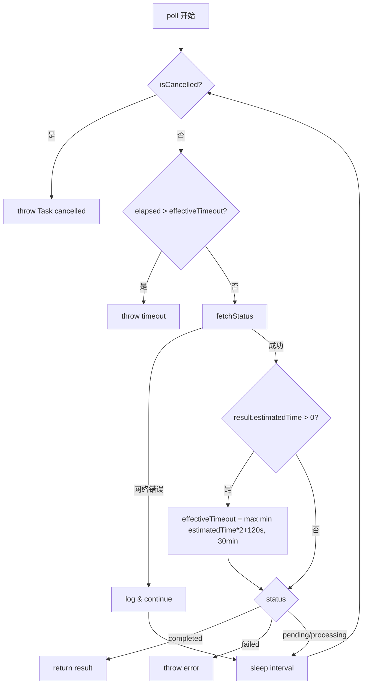
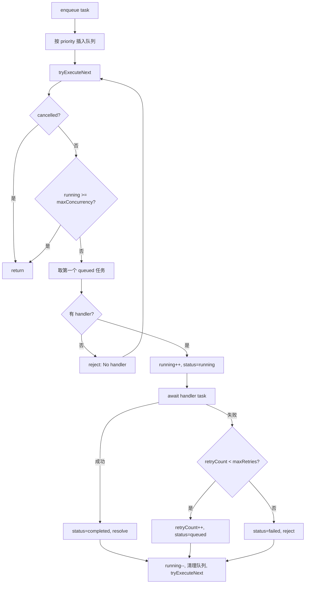
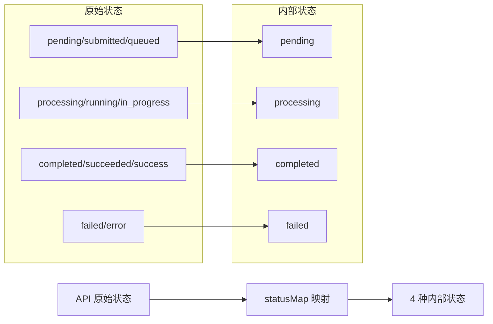

# PD-537.01 moyin-creator — 双层异步轮询与优先级任务队列

> 文档编号：PD-537.01
> 来源：moyin-creator `src/packages/ai-core/api/task-poller.ts`, `task-queue.ts`, `src/lib/storyboard/storyboard-service.ts`
> GitHub：https://github.com/MemeCalculate/moyin-creator.git
> 问题域：PD-537 异步任务轮询 Async Task Polling
> 状态：可复用方案

---

## 第 1 章 问题与动机（≥ 30 行）

### 1.1 核心问题

AI 图片/视频生成 API 通常是异步的：客户端提交生成请求后，服务端返回一个 `taskId`，客户端需要反复轮询 `/v1/tasks/{taskId}` 直到任务完成或失败。这个模式看似简单，但在生产环境中面临多个工程挑战：

1. **多提供商状态码不统一** — 不同 API 返回的状态字段名和值各不相同（`completed` vs `succeeded` vs `success`），需要归一化处理
2. **并发控制** — 批量生成多个场景的图片/视频时，不能同时发起所有请求，需要队列化管理并发数
3. **超时不可预测** — 图片生成可能 10 秒完成，视频生成可能需要 10 分钟，固定超时不合理
4. **网络抖动容错** — 轮询过程中的偶发网络错误不应导致整个任务失败
5. **取消与恢复** — 用户可能中途取消批量生成，需要优雅地停止排队任务而不影响正在运行的任务

### 1.2 moyin-creator 的解法概述

moyin-creator 采用**双层架构**解决异步任务轮询问题：

1. **TaskPoller（轮询层）** — 封装单个任务的轮询逻辑，支持动态超时调整、取消检测、网络错误容错（`src/packages/ai-core/api/task-poller.ts:24-139`）
2. **TaskQueue（调度层）** — 优先级队列 + 并发控制，管理多个任务的排队、执行、重试（`src/packages/ai-core/api/task-queue.ts:26-152`）
3. **pollTaskCompletion（业务层）** — 在 storyboard-service 中实现的轮询函数，包含多提供商状态码归一化映射（`src/lib/storyboard/storyboard-service.ts:242-359`）
4. **retryOperation（重试层）** — 独立的指数退避重试工具，专门处理 429 限流（`src/lib/utils/retry.ts:49-86`）
5. **rateLimitedBatch（限流层）** — 批量操作间的速率控制，避免触发 API 限流（`src/lib/utils/rate-limiter.ts:31-61`）

### 1.3 设计思想

| 设计原则 | 具体实现 | 理由 | 替代方案 |
|----------|----------|------|----------|
| 关注点分离 | TaskPoller 只管轮询，TaskQueue 只管调度 | 轮询逻辑和并发控制是正交关注点 | 单一类同时管理轮询+队列（耦合度高） |
| 动态超时 | 根据服务端 estimatedTime 自动延长超时（2x + 120s 缓冲） | 视频生成比图片慢 10 倍，固定超时不合理 | 固定超时 / 无限等待 |
| 状态码归一化 | 11 种原始状态映射到 4 种内部状态 | 不同提供商返回不同状态字符串 | 每个提供商写独立解析逻辑 |
| Promise 封装队列 | enqueue 返回 Promise，任务完成时 resolve | 调用方用 await 即可，无需回调地狱 | 事件驱动 / 回调模式 |
| 动态并发上限 | getMaxConcurrency 是函数而非常量 | 用户可在运行时调整并发数 | 构造时固定并发数 |

---

## 第 2 章 源码实现分析（≥ 60 行，核心章节）

### 2.1 架构概览

```
┌─────────────────────────────────────────────────────────┐
│                   storyboard-service                     │
│  generateStoryboardImage / generateSceneVideos           │
│  ┌─────────────┐  ┌──────────────────────────────────┐  │
│  │ submitTask   │→│ pollTaskCompletion (状态码归一化)  │  │
│  │ (POST /v1/)  │  │ GET /v1/tasks/{id} × N 次        │  │
│  └─────────────┘  └──────────────────────────────────┘  │
└────────────────────────┬────────────────────────────────┘
                         │ 批量场景时使用
┌────────────────────────▼────────────────────────────────┐
│                     TaskQueue                            │
│  ┌──────────┐  ┌──────────┐  ┌──────────┐              │
│  │ queued   │→│ running  │→│ completed │              │
│  │ (优先级)  │  │ (≤ max)  │  │ / failed  │              │
│  └──────────┘  └──────────┘  └──────────┘              │
│  handlers: Map<type, TaskHandler>                        │
│  retry: retryCount < maxRetries → re-queue               │
└────────────────────────┬────────────────────────────────┘
                         │ 每个任务内部
┌────────────────────────▼────────────────────────────────┐
│                    TaskPoller                             │
│  while(true) {                                           │
│    fetchStatus() → check completed/failed                │
│    dynamicTimeout(estimatedTime × 2 + 120s)              │
│    isCancelled? → throw                                  │
│    networkError? → log & continue                        │
│    sleep(interval)                                       │
│  }                                                       │
└─────────────────────────────────────────────────────────┘
                         │ HTTP 层
┌────────────────────────▼────────────────────────────────┐
│              retryOperation (429 指数退避)                │
│  attempt 0 → fail 429 → wait 2s                         │
│  attempt 1 → fail 429 → wait 4s                         │
│  attempt 2 → fail 429 → wait 8s → throw                 │
└─────────────────────────────────────────────────────────┘
```

### 2.2 核心实现

#### 2.2.1 TaskPoller — 动态超时轮询器



对应源码 `src/packages/ai-core/api/task-poller.ts:33-120`：

```typescript
async poll(
  taskId: string,
  type: 'image' | 'video',
  options: PollOptions
): Promise<AsyncTaskResult> {
  const { fetchStatus, onProgress, isCancelled,
          interval = this.defaultInterval,
          timeout = this.defaultTimeout } = options;
  const startTime = Date.now();
  let effectiveTimeout = timeout;
  let pollCount = 0;

  while (true) {
    pollCount++;
    if (isCancelled?.()) throw new Error('Task cancelled');
    const elapsed = Date.now() - startTime;
    if (elapsed > effectiveTimeout) {
      throw new Error(`${type} generation timeout after ${Math.floor(effectiveTimeout / 60000)} minutes`);
    }
    try {
      const result = await fetchStatus();
      onProgress?.(result.progress ?? 0, result.status);
      // 动态超时：服务端预估时间 × 2 + 120s，上限 30 分钟
      if (result.estimatedTime && result.estimatedTime > 0) {
        const buffered = (result.estimatedTime * 2 + 120) * 1000;
        const newTimeout = Math.min(buffered, this.maxTimeout);
        if (newTimeout > effectiveTimeout) effectiveTimeout = newTimeout;
      }
      if (result.status === 'completed') return result;
      if (result.status === 'failed') throw new Error(result.error || 'Task failed');
    } catch (e) {
      const error = e as Error;
      if (error.message.includes('cancelled') || error.message.includes('timeout') || error.message.includes('Task failed'))
        throw error;
      // 网络错误：静默重试
      console.warn(`[TaskPoller] Network error on poll #${pollCount}, will retry:`, error.message);
    }
    await this.sleep(interval);
  }
}
```

关键设计点：
- **动态超时**（`task-poller.ts:76-84`）：当服务端返回 `estimatedTime` 时，自动将超时调整为 `estimatedTime × 2 + 120s`，上限 30 分钟。这解决了图片（~30s）和视频（~10min）超时差异巨大的问题
- **网络错误容错**（`task-poller.ts:103-115`）：只有 `cancelled`、`timeout`、`Task failed` 三类错误会终止轮询，其他网络错误（如 DNS 解析失败、连接超时）只记录日志后继续轮询
- **取消检测**（`task-poller.ts:56-59`）：每次轮询前检查 `isCancelled()` 回调，支持外部取消

#### 2.2.2 TaskQueue — 优先级并发队列



对应源码 `src/packages/ai-core/api/task-queue.ts:48-112`：

```typescript
enqueue<T, R>(
  task: Omit<TaskItem<T>, 'status' | 'resolve' | 'reject' | 'createdAt'>
): Promise<R> {
  return new Promise((resolve, reject) => {
    const fullTask: TaskItem<T> = {
      ...task, status: 'queued', createdAt: Date.now(),
      resolve: resolve as (result: unknown) => void, reject,
    };
    // 按优先级插入（高优先级在前）
    const idx = this.queue.findIndex(t => t.priority < fullTask.priority);
    if (idx === -1) this.queue.push(fullTask as TaskItem);
    else this.queue.splice(idx, 0, fullTask as TaskItem);
    this.tryExecuteNext();
  });
}

private async tryExecuteNext(): Promise<void> {
  if (this.cancelled) return;
  if (this.running >= this.getMaxConcurrency()) return;
  const task = this.queue.find(t => t.status === 'queued');
  if (!task) return;
  const handler = this.handlers.get(task.type);
  if (!handler) {
    task.status = 'failed';
    task.reject(new Error(`No handler registered for task type: ${task.type}`));
    this.tryExecuteNext();
    return;
  }
  this.running++;
  task.status = 'running';
  try {
    const result = await handler(task);
    task.status = 'completed';
    task.resolve(result);
  } catch (e) {
    if (task.retryCount < task.maxRetries) {
      task.retryCount++;
      task.status = 'queued'; // 重新入队
    } else {
      task.status = 'failed';
      task.reject(e as Error);
    }
  } finally {
    this.running--;
    this.queue = this.queue.filter(t => t.status === 'queued' || t.status === 'running');
    this.tryExecuteNext(); // 递归驱动下一个任务
  }
}
```

关键设计点：
- **Promise 封装**（`task-queue.ts:48-69`）：`enqueue` 返回 Promise，内部将 `resolve/reject` 存入 TaskItem，任务完成时自动 resolve。调用方只需 `await queue.enqueue(task)`
- **优先级插入**（`task-queue.ts:61-66`）：用 `findIndex` 找到第一个优先级更低的位置，`splice` 插入。时间复杂度 O(n)，对于 AI 生成场景（通常 < 100 个任务）完全够用
- **动态并发**（`task-queue.ts:29,77`）：`getMaxConcurrency` 是构造时传入的函数，每次 `tryExecuteNext` 都重新调用，允许运行时调整
- **失败重试**（`task-queue.ts:99-106`）：失败后如果 `retryCount < maxRetries`，将状态重置为 `queued` 重新入队，而非立即重试

#### 2.2.3 状态码归一化映射



对应源码 `src/lib/storyboard/storyboard-service.ts:290-302`：

```typescript
const statusMap: Record<string, string> = {
  'pending': 'pending',
  'submitted': 'pending',
  'queued': 'pending',
  'processing': 'processing',
  'running': 'processing',
  'in_progress': 'processing',
  'completed': 'completed',
  'succeeded': 'completed',
  'success': 'completed',
  'failed': 'failed',
  'error': 'failed',
};
const mappedStatus = statusMap[status] || 'processing'; // 未知状态默认为 processing
```

### 2.3 实现细节

**同步/异步双模式路由**（`storyboard-service.ts:150-168`）：提交任务后，API 可能直接返回图片 URL（同步模式）或返回 taskId（异步模式）。代码先检查是否有直接 URL，没有才进入轮询流程。这使得同一套代码兼容同步和异步两种 API。

**缓存破坏**（`storyboard-service.ts:264-265`）：轮询请求添加 `_ts` 时间戳参数和 `Cache-Control: no-cache` 头，防止 CDN 或浏览器缓存导致状态不更新。

**结果 URL 多路径提取**（`storyboard-service.ts:311-327`）：不同提供商的结果 URL 位于不同的 JSON 路径（`data.result.images[0].url[0]`、`data.result.images[0].url`、`data.output_url` 等），代码按优先级逐一尝试。

**retryOperation 指数退避**（`src/lib/utils/retry.ts:49-86`）：只对 429 限流错误重试，非限流错误直接抛出。退避公式为 `baseDelay × 2^attempt`（如 3000ms → 6000ms → 12000ms）。

**批量场景速率控制**（`storyboard-service.ts:687-693`）：`generateSceneVideos` 中场景间使用 `RATE_LIMITS.BATCH_ITEM_DELAY`（3000ms）间隔，避免短时间内大量请求触发限流。


---

## 第 3 章 迁移指南（≥ 40 行）

### 3.1 迁移清单

**阶段 1：基础轮询器（1 个文件）**
- [ ] 定义 `AsyncTaskResult` 接口（status/progress/resultUrl/error/estimatedTime）
- [ ] 实现 `TaskPoller` 类，包含动态超时和取消检测
- [ ] 实现状态码归一化映射表

**阶段 2：任务队列（1 个文件）**
- [ ] 定义 `TaskItem` 接口（id/type/priority/status/retryCount/resolve/reject）
- [ ] 实现 `TaskQueue` 类，包含优先级插入和并发控制
- [ ] 实现 `cancelAll` 和 `resume` 方法

**阶段 3：重试与限流工具（2 个文件）**
- [ ] 实现 `retryOperation`，支持 429 检测和指数退避
- [ ] 实现 `rateLimitedBatch`，支持批量操作间延迟
- [ ] 配置 `RATE_LIMITS` 常量

**阶段 4：业务集成**
- [ ] 在提交任务函数中处理同步/异步双模式返回
- [ ] 在轮询函数中添加缓存破坏参数
- [ ] 在批量生成函数中集成 TaskQueue

### 3.2 适配代码模板

以下是一个可直接复用的 TypeScript 轮询器模板，融合了 moyin-creator 的核心设计：

```typescript
// async-task-poller.ts — 可复用的异步任务轮询器
interface AsyncTaskResult {
  status: 'pending' | 'processing' | 'completed' | 'failed';
  progress?: number;
  resultUrl?: string;
  error?: string;
  estimatedTime?: number; // 服务端预估秒数
}

interface PollConfig {
  taskId: string;
  fetchStatus: () => Promise<AsyncTaskResult>;
  onProgress?: (progress: number, status: string) => void;
  isCancelled?: () => boolean;
  interval?: number;   // 默认 3000ms
  timeout?: number;    // 默认 600000ms (10min)
  maxTimeout?: number; // 默认 1800000ms (30min)
}

// 状态码归一化映射（覆盖主流 AI API 提供商）
const STATUS_MAP: Record<string, AsyncTaskResult['status']> = {
  pending: 'pending', submitted: 'pending', queued: 'pending',
  processing: 'processing', running: 'processing', in_progress: 'processing',
  completed: 'completed', succeeded: 'completed', success: 'completed',
  failed: 'failed', error: 'failed',
};

function normalizeStatus(raw: string): AsyncTaskResult['status'] {
  return STATUS_MAP[raw.toLowerCase()] ?? 'processing';
}

async function pollTask(config: PollConfig): Promise<AsyncTaskResult> {
  const {
    fetchStatus, onProgress, isCancelled,
    interval = 3000, timeout = 600_000, maxTimeout = 1_800_000,
  } = config;
  const startTime = Date.now();
  let effectiveTimeout = timeout;

  while (true) {
    if (isCancelled?.()) throw new Error('Task cancelled');
    if (Date.now() - startTime > effectiveTimeout) {
      throw new Error(`Task timed out after ${Math.floor(effectiveTimeout / 60000)} minutes`);
    }

    try {
      const result = await fetchStatus();
      onProgress?.(result.progress ?? 0, result.status);

      // 动态超时调整
      if (result.estimatedTime && result.estimatedTime > 0) {
        const buffered = (result.estimatedTime * 2 + 120) * 1000;
        effectiveTimeout = Math.max(effectiveTimeout, Math.min(buffered, maxTimeout));
      }

      if (result.status === 'completed') return result;
      if (result.status === 'failed') throw new Error(result.error || 'Task failed');
    } catch (e) {
      const err = e as Error;
      if (['cancelled', 'timed out', 'Task failed'].some(k => err.message.includes(k))) throw err;
      console.warn(`[Poller] Network error, will retry: ${err.message}`);
    }

    await new Promise(r => setTimeout(r, interval));
  }
}
```

以下是优先级任务队列模板：

```typescript
// task-queue.ts — 可复用的优先级并发队列
interface QueueTask<T = unknown> {
  id: string;
  type: string;
  priority: number;
  payload: T;
  maxRetries: number;
  // 内部字段
  status: 'queued' | 'running' | 'completed' | 'failed';
  retryCount: number;
  resolve: (result: unknown) => void;
  reject: (error: Error) => void;
}

class PriorityTaskQueue {
  private queue: QueueTask[] = [];
  private running = 0;
  private cancelled = false;
  private handlers = new Map<string, (task: QueueTask) => Promise<unknown>>();

  constructor(private getConcurrency: () => number) {}

  register(type: string, handler: (task: QueueTask) => Promise<unknown>) {
    this.handlers.set(type, handler);
  }

  enqueue<T>(params: { id: string; type: string; priority: number; payload: T; maxRetries?: number }): Promise<unknown> {
    return new Promise((resolve, reject) => {
      const task: QueueTask<T> = {
        ...params, status: 'queued', retryCount: 0,
        maxRetries: params.maxRetries ?? 3, resolve, reject,
      };
      const idx = this.queue.findIndex(t => t.priority < task.priority);
      idx === -1 ? this.queue.push(task as QueueTask) : this.queue.splice(idx, 0, task as QueueTask);
      this.drain();
    });
  }

  private async drain() {
    if (this.cancelled || this.running >= this.getConcurrency()) return;
    const task = this.queue.find(t => t.status === 'queued');
    if (!task) return;
    const handler = this.handlers.get(task.type);
    if (!handler) { task.reject(new Error(`No handler: ${task.type}`)); return; }

    this.running++;
    task.status = 'running';
    try {
      const result = await handler(task);
      task.status = 'completed';
      task.resolve(result);
    } catch (e) {
      if (task.retryCount < task.maxRetries) {
        task.retryCount++;
        task.status = 'queued';
      } else {
        task.status = 'failed';
        task.reject(e as Error);
      }
    } finally {
      this.running--;
      this.queue = this.queue.filter(t => t.status === 'queued' || t.status === 'running');
      this.drain();
    }
  }

  cancelAll() {
    this.cancelled = true;
    this.queue.filter(t => t.status === 'queued').forEach(t => {
      t.status = 'failed';
      t.reject(new Error('Cancelled'));
    });
    this.queue = this.queue.filter(t => t.status === 'running');
  }

  resume() { this.cancelled = false; }
  isIdle() { return this.running === 0 && !this.queue.some(t => t.status === 'queued'); }
}
```

### 3.3 适用场景

| 场景 | 适用度 | 说明 |
|------|--------|------|
| AI 图片/视频生成轮询 | ⭐⭐⭐ | 核心场景，完美匹配 |
| 批量文档处理（OCR、翻译） | ⭐⭐⭐ | 提交-轮询模式通用 |
| CI/CD 流水线状态监控 | ⭐⭐ | 轮询器可用，队列不一定需要 |
| 实时通信（聊天、协作） | ⭐ | 应使用 WebSocket/SSE 而非轮询 |
| 单次同步 API 调用 | ⭐ | 无需轮询，直接 await 即可 |

---

## 第 4 章 测试用例（≥ 20 行）

```typescript
import { describe, it, expect, vi, beforeEach } from 'vitest';

// 基于 TaskPoller 真实签名的测试
describe('TaskPoller', () => {
  it('should complete after 3 polls', async () => {
    let callCount = 0;
    const fetchStatus = vi.fn(async () => {
      callCount++;
      if (callCount < 3) return { status: 'processing' as const, progress: callCount * 30 };
      return { status: 'completed' as const, progress: 100, resultUrl: 'https://example.com/result.png' };
    });

    const poller = new TaskPoller();
    const result = await poller.poll('task-123', 'image', {
      fetchStatus, interval: 10, timeout: 5000,
    });
    expect(result.status).toBe('completed');
    expect(fetchStatus).toHaveBeenCalledTimes(3);
  });

  it('should extend timeout based on estimatedTime', async () => {
    let callCount = 0;
    const fetchStatus = vi.fn(async () => {
      callCount++;
      if (callCount === 1) return { status: 'processing' as const, estimatedTime: 300 }; // 5 min estimate
      if (callCount < 5) return { status: 'processing' as const };
      return { status: 'completed' as const, resultUrl: 'url' };
    });

    const poller = new TaskPoller();
    // 初始超时 1s，但 estimatedTime=300 会扩展到 300*2+120=720s
    const result = await poller.poll('task-456', 'video', {
      fetchStatus, interval: 10, timeout: 1000,
    });
    expect(result.status).toBe('completed');
  });

  it('should throw on cancellation', async () => {
    const fetchStatus = vi.fn(async () => ({ status: 'processing' as const }));
    const poller = new TaskPoller();
    await expect(poller.poll('task-789', 'image', {
      fetchStatus, interval: 10, timeout: 5000,
      isCancelled: () => true,
    })).rejects.toThrow('cancelled');
  });

  it('should survive network errors and continue polling', async () => {
    let callCount = 0;
    const fetchStatus = vi.fn(async () => {
      callCount++;
      if (callCount === 2) throw new Error('Network timeout');
      if (callCount === 4) return { status: 'completed' as const, resultUrl: 'url' };
      return { status: 'processing' as const };
    });

    const poller = new TaskPoller();
    const result = await poller.poll('task-net', 'image', {
      fetchStatus, interval: 10, timeout: 5000,
    });
    expect(result.status).toBe('completed');
    expect(fetchStatus).toHaveBeenCalledTimes(4);
  });
});

describe('TaskQueue', () => {
  it('should execute tasks by priority (higher first)', async () => {
    const order: string[] = [];
    const queue = new TaskQueue(() => 1); // 并发 1
    queue.setHandler('image', async (task) => { order.push(task.id); return task.id; });

    // 同时入队 3 个任务，优先级不同
    const p1 = queue.enqueue({ id: 'low', type: 'image', priority: 1, payload: null, retryCount: 0, maxRetries: 0 });
    const p2 = queue.enqueue({ id: 'high', type: 'image', priority: 10, payload: null, retryCount: 0, maxRetries: 0 });
    const p3 = queue.enqueue({ id: 'mid', type: 'image', priority: 5, payload: null, retryCount: 0, maxRetries: 0 });

    await Promise.all([p1, p2, p3]);
    // 第一个入队的 low 已经在 running，后续按优先级排序
    expect(order[0]).toBe('low'); // 已经开始执行
    expect(order[1]).toBe('high');
    expect(order[2]).toBe('mid');
  });

  it('should retry failed tasks up to maxRetries', async () => {
    let attempts = 0;
    const queue = new TaskQueue(() => 1);
    queue.setHandler('image', async () => {
      attempts++;
      if (attempts < 3) throw new Error('Transient error');
      return 'success';
    });

    const result = await queue.enqueue({
      id: 'retry-test', type: 'image', priority: 1,
      payload: null, retryCount: 0, maxRetries: 3,
    });
    expect(result).toBe('success');
    expect(attempts).toBe(3);
  });

  it('should cancel pending tasks without affecting running ones', async () => {
    const queue = new TaskQueue(() => 1);
    queue.setHandler('image', async () => {
      await new Promise(r => setTimeout(r, 100));
      return 'done';
    });

    const p1 = queue.enqueue({ id: 't1', type: 'image', priority: 1, payload: null, retryCount: 0, maxRetries: 0 });
    const p2 = queue.enqueue({ id: 't2', type: 'image', priority: 1, payload: null, retryCount: 0, maxRetries: 0 });

    // t1 正在运行，t2 在排队
    queue.cancelAll();
    await expect(p2).rejects.toThrow('cancelled');
    await expect(p1).resolves.toBe('done'); // 运行中的不受影响
  });
});

describe('Status normalization', () => {
  const statusMap: Record<string, string> = {
    pending: 'pending', submitted: 'pending', queued: 'pending',
    processing: 'processing', running: 'processing', in_progress: 'processing',
    completed: 'completed', succeeded: 'completed', success: 'completed',
    failed: 'failed', error: 'failed',
  };

  it.each(Object.entries(statusMap))('should map "%s" to "%s"', (raw, expected) => {
    expect(statusMap[raw]).toBe(expected);
  });

  it('should default unknown status to processing', () => {
    expect(statusMap['uploading'] || 'processing').toBe('processing');
  });
});
```


---

## 第 5 章 跨域关联

| 关联域 | 关系类型 | 说明 |
|--------|----------|------|
| PD-03 容错与重试 | 依赖 | TaskQueue 的 maxRetries 机制和 retryOperation 的指数退避都是容错策略的具体实现 |
| PD-04 工具系统 | 协同 | TaskQueue 的 `setHandler` 按 type 注册处理器，本质是工具注册模式的变体 |
| PD-10 中间件管道 | 协同 | retryOperation 和 rateLimitedBatch 可视为请求管道中的中间件层 |
| PD-11 可观测性 | 协同 | TaskPoller 的 `onProgress` 回调和 `pollCount` 日志为可观测性提供数据源 |
| PD-538 并发与限流 | 依赖 | TaskQueue 的并发控制和 RATE_LIMITS 常量直接服务于限流需求 |
| PD-516 异步任务轮询 | 同源 | 同项目的另一个轮询实现视角，本文档覆盖更完整的双层架构 |

---

## 第 6 章 来源文件索引

| 文件 | 行范围 | 关键实现 |
|------|--------|----------|
| `src/packages/ai-core/api/task-poller.ts` | L24-L139 | TaskPoller 类：动态超时轮询、取消检测、网络容错 |
| `src/packages/ai-core/api/task-queue.ts` | L9-L152 | TaskQueue 类：优先级队列、并发控制、Promise 封装、失败重试 |
| `src/lib/storyboard/storyboard-service.ts` | L242-L359 | pollTaskCompletion：状态码归一化、缓存破坏、多路径 URL 提取 |
| `src/lib/storyboard/storyboard-service.ts` | L51-L184 | submitImageGenTask：同步/异步双模式路由、AbortController 超时 |
| `src/lib/storyboard/storyboard-service.ts` | L511-L629 | submitVideoGenTask：视频任务提交、retryOperation 429 重试 |
| `src/lib/storyboard/storyboard-service.ts` | L649-L766 | generateSceneVideos：批量场景顺序处理、RATE_LIMITS 间隔控制 |
| `src/lib/utils/retry.ts` | L49-L86 | retryOperation：429 检测、指数退避（baseDelay × 2^attempt） |
| `src/lib/utils/rate-limiter.ts` | L31-L61 | rateLimitedBatch：批量操作速率控制 |
| `src/lib/utils/rate-limiter.ts` | L96-L165 | batchProcess：分批并行 + 批间延迟 |
| `src/lib/utils/rate-limiter.ts` | L170-L177 | RATE_LIMITS 常量定义 |
| `src/packages/ai-core/types/index.ts` | L157-L163 | AsyncTaskResult 接口定义 |
| `src/packages/ai-core/providers/types.ts` | L45-L70 | ImageProvider/VideoProvider 接口：pollImageTask/pollVideoTask 方法签名 |
| `src/lib/ai/image-generator.ts` | L412-L484 | pollTaskStatus：image-generator 中的独立轮询实现（与 storyboard-service 同构） |

---

## 第 7 章 横向对比维度

```json comparison_data
{
  "project": "moyin-creator",
  "dimensions": {
    "轮询架构": "双层分离：TaskPoller 管轮询 + TaskQueue 管调度，职责正交",
    "超时策略": "动态超时：estimatedTime × 2 + 120s 缓冲，上限 30 分钟",
    "状态归一化": "11 种原始状态 → 4 种内部状态的 Record 映射表",
    "并发控制": "优先级队列 + 动态并发上限（运行时可调）",
    "重试机制": "双层重试：队列级 maxRetries 重入队 + HTTP 级 429 指数退避",
    "取消支持": "TaskQueue.cancelAll 停止排队任务 + TaskPoller.isCancelled 中断轮询",
    "同步异步兼容": "提交后检测 taskId/imageUrl 自动路由同步或异步模式"
  }
}
```

### 域元数据补充

```json domain_metadata
{
  "solution_summary": "moyin-creator 用 TaskPoller + TaskQueue 双层分离架构实现异步轮询，TaskPoller 支持动态超时（estimatedTime×2+120s）和网络容错，TaskQueue 提供优先级插入与 Promise 封装的并发队列",
  "description": "异步任务轮询需要同时解决单任务超时控制和多任务并发调度两个正交问题",
  "sub_problems": [
    "多提供商状态码归一化（11种原始状态→4种内部状态）",
    "同步/异步 API 双模式自动路由",
    "轮询请求的缓存破坏（CDN/浏览器缓存导致状态不更新）",
    "结果 URL 多路径提取（不同提供商 JSON 结构不同）"
  ],
  "best_practices": [
    "将轮询逻辑和队列调度分离为独立模块，避免职责耦合",
    "用 Promise 封装队列任务的 resolve/reject，调用方 await 即可无需回调",
    "网络错误应静默重试而非终止轮询，只有业务错误才终止",
    "并发上限应为函数而非常量，支持运行时动态调整"
  ]
}
```
