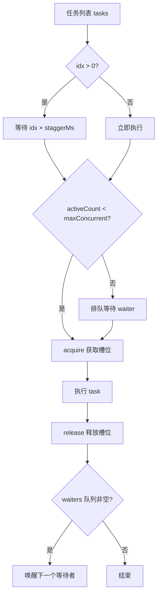
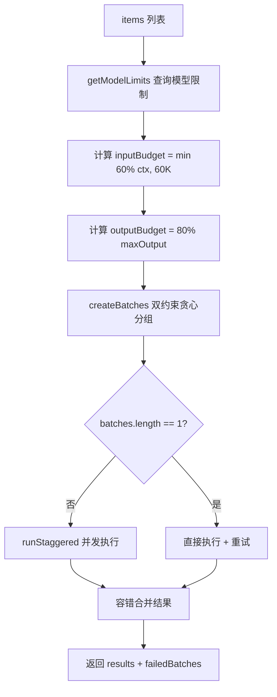
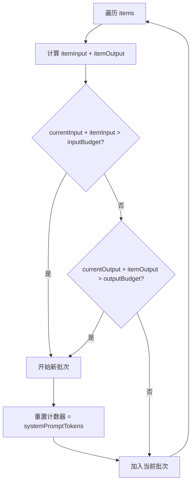

# PD-538.01 moyin-creator — 三层并发限流与双约束自适应分批

> 文档编号：PD-538.01
> 来源：moyin-creator `src/lib/utils/concurrency.ts`, `src/lib/utils/rate-limiter.ts`, `src/lib/ai/batch-processor.ts`
> GitHub：https://github.com/MemeCalculate/moyin-creator.git
> 问题域：PD-538 并发与限流 Concurrency & Rate Limiting
> 状态：可复用方案

---

## 第 1 章 问题与动机（≥ 30 行）

### 1.1 核心问题

AI 应用在批量调用 LLM API 时面临三重约束：

1. **API 速率限制**：供应商对 RPM（每分钟请求数）和 RPD（每日请求数）有硬性限制，超出会被 429 拒绝
2. **上下文窗口限制**：单次请求的 input + output token 不能超过模型的 contextWindow 和 maxOutput
3. **并发资源竞争**：多个 AI 任务同时运行时，共享同一组 API Key，需要协调避免互相挤占

Moyin Creator 是一个 AI 驱动的影视分镜生成工具，核心流程包括：剧本分析（60集×多场景）、角色校准、场景校准、分镜校准、视频生成。每个环节都涉及大量 AI API 调用，单个项目可能产生数百次 LLM 请求。如果不做并发控制和限流，要么被 API 限流导致大量失败，要么因为上下文超限导致请求被拒。

### 1.2 moyin-creator 的解法概述

该项目设计了三层并发限流体系，从底层到顶层分别是：

1. **runStaggered 错开启动并发控制器**（`src/lib/utils/concurrency.ts:27`）：信号量 + 定时错开启动，同时控制最大并发数和请求间隔
2. **rateLimitedBatch / batchProcess 顺序限流器**（`src/lib/utils/rate-limiter.ts:31-165`）：为不支持并发的场景提供顺序执行 + 固定延迟的限流方案
3. **processBatched 自适应批处理器**（`src/lib/ai/batch-processor.ts:105`）：双重约束（input token + output token）贪心分批 + 复用 runStaggered 并发执行

三层之间的关系：`processBatched` 在内部调用 `runStaggered` 实现并发控制，而 `rateLimitedBatch` 用于视频生成等需要严格顺序执行的场景。用户通过 Zustand store 中的 `concurrency` 参数统一控制全局并发度（`src/stores/api-config-store.ts:164`）。

### 1.3 设计思想

| 设计原则 | 具体实现 | 理由 | 替代方案 |
|----------|----------|------|----------|
| 双重约束分批 | input token + output token 同时约束，任一超出即开新批次 | 仅约束 input 会导致 output 超限被截断；仅约束 output 会导致 input 超限被拒 | 单约束分批（只看 input 或只看 output） |
| 60K Hard Cap | 无论模型支持多大上下文，每批 input 最多 60K token | 防止超长上下文导致 TTFT 过高和 Lost in the middle 问题 | 直接使用模型的 contextWindow 上限 |
| 错开启动 | 每个新任务在前一个启动后至少等待 staggerMs | 避免瞬间并发冲击 API 速率限制 | 全部同时启动（容易触发 429） |
| 容错隔离 | 单批次失败不影响其他批次，部分成功也返回结果 | 60 集剧本中某几集失败不应导致全部重来 | 全部失败则全部重试 |
| 用户可配并发度 | concurrency 参数存储在 Zustand persist store 中 | 不同用户的 API Key 配额不同，需要灵活调整 | 硬编码并发数 |

---

## 第 2 章 源码实现分析（≥ 60 行，核心章节）

### 2.1 架构概览

```
┌─────────────────────────────────────────────────────────┐
│                    调用方（业务层）                        │
│  full-script-service / character-calibrator / scene-cal  │
└──────────┬──────────────────────┬───────────────────────┘
           │                      │
           ▼                      ▼
┌─────────────────────┐  ┌──────────────────────────────┐
│  processBatched()   │  │  rateLimitedBatch()          │
│  自适应批处理器      │  │  顺序限流器                   │
│  ┌───────────────┐  │  │  固定延迟 + 顺序执行          │
│  │ createBatches  │  │  └──────────────────────────────┘
│  │ 双约束贪心分组  │  │           │
│  └───────┬───────┘  │           ▼
│          ▼          │  ┌──────────────────────────────┐
│  ┌───────────────┐  │  │  storyboard-service.ts       │
│  │ runStaggered   │  │  │  视频生成（顺序+delay）       │
│  │ 错开启动并发   │  │  └──────────────────────────────┘
│  └───────────────┘  │
└─────────────────────┘
           │
           ▼
┌─────────────────────────────────────────────────────────┐
│  api-config-store.concurrency  （用户可配全局并发度）      │
│  model-registry.getModelLimits （三层查表获取模型限制）    │
└─────────────────────────────────────────────────────────┘
```

### 2.2 核心实现

#### 2.2.1 runStaggered — 错开启动的并发控制器



对应源码 `src/lib/utils/concurrency.ts:27-83`：

```typescript
export async function runStaggered<T>(
  tasks: (() => Promise<T>)[],
  maxConcurrent: number,
  staggerMs: number = 5000
): Promise<PromiseSettledResult<T>[]> {
  if (tasks.length === 0) return [];
  const results: PromiseSettledResult<T>[] = new Array(tasks.length);

  // 信号量：控制最大并发数
  let activeCount = 0;
  const waiters: (() => void)[] = [];

  const acquire = async (): Promise<void> => {
    if (activeCount < maxConcurrent) { activeCount++; return; }
    await new Promise<void>((resolve) => waiters.push(resolve));
  };

  const release = (): void => {
    activeCount--;
    if (waiters.length > 0) {
      activeCount++;
      const next = waiters.shift()!;
      next();
    }
  };

  const taskPromises = tasks.map(async (task, idx) => {
    if (idx > 0) {
      await new Promise<void>((r) => setTimeout(r, idx * staggerMs));
    }
    await acquire();
    try {
      const value = await task();
      results[idx] = { status: 'fulfilled', value };
    } catch (reason) {
      results[idx] = { status: 'rejected', reason: reason as any };
    } finally {
      release();
    }
  });

  await Promise.all(taskPromises);
  return results;
}
```

关键设计点：
- **信号量模式**（`acquire/release`）：用闭包 + Promise 实现轻量级信号量，无需引入外部库
- **错开启动**：第 N 个任务至少在 `N × staggerMs` 后才启动，避免瞬间并发冲击
- **双重保护**：即使 stagger 到期，如果并发已满仍需等待有任务完成
- **PromiseSettledResult**：返回 settled 结果而非 all-or-nothing，支持部分成功

#### 2.2.2 processBatched — 双约束自适应批处理器



对应源码 `src/lib/ai/batch-processor.ts:105-233`：

```typescript
export async function processBatched<TItem, TResult>(
  opts: ProcessBatchedOptions<TItem, TResult>,
): Promise<ProcessBatchedResult<TResult>> {
  // ...
  // === 1. 获取模型限制 ===
  const limits = getModelLimits(modelName);
  const inputBudget = Math.min(Math.floor(limits.contextWindow * 0.6), HARD_CAP_TOKENS);
  const outputBudget = Math.floor(limits.maxOutput * 0.8);

  // === 2. 估算 system prompt 的 token 开销 ===
  const samplePrompts = buildPrompts([items[0]]);
  const systemPromptTokens = estimateTokens(samplePrompts.system);

  // === 3. 双重约束贪心分组 ===
  const batches = createBatches(items, getItemTokens, getItemOutputTokens,
    inputBudget, outputBudget, systemPromptTokens);

  // === 4. 并发执行 ===
  const concurrency = store.concurrency || 1;
  const settled = await runStaggered(batchTasks, concurrency, 5000);

  // === 5. 容错合并 ===
  for (const result of settled) {
    if (result.status === 'fulfilled') successResults.push(result.value);
    else { failedBatches++; }
  }
  return { results: finalResults, failedBatches, totalBatches: batches.length };
}
```

#### 2.2.3 createBatches — 双约束贪心分组算法



对应源码 `src/lib/ai/batch-processor.ts:246-285`：

```typescript
function createBatches<TItem>(
  items: TItem[],
  getItemTokens: (item: TItem) => number,
  getItemOutputTokens: (item: TItem) => number,
  inputBudget: number, outputBudget: number,
  systemPromptTokens: number,
): TItem[][] {
  const batches: TItem[][] = [];
  let currentBatch: TItem[] = [];
  let currentInputTokens = systemPromptTokens; // system prompt 每批都要带
  let currentOutputTokens = 0;

  for (const item of items) {
    const itemInput = getItemTokens(item);
    const itemOutput = getItemOutputTokens(item);
    const wouldExceedInput = currentInputTokens + itemInput > inputBudget;
    const wouldExceedOutput = currentOutputTokens + itemOutput > outputBudget;

    if (currentBatch.length > 0 && (wouldExceedInput || wouldExceedOutput)) {
      batches.push(currentBatch);
      currentBatch = [];
      currentInputTokens = systemPromptTokens;
      currentOutputTokens = 0;
    }
    currentBatch.push(item);
    currentInputTokens += itemInput;
    currentOutputTokens += itemOutput;
  }
  if (currentBatch.length > 0) batches.push(currentBatch);
  return batches;
}
```

### 2.3 实现细节

**Token 估算策略**（`src/lib/ai/model-registry.ts:260-262`）：

使用 `字符数 / 1.5` 的保守算法，不引入 tiktoken 等重型库。对中文（1 token ≈ 0.6-1.0 汉字）和英文（1 token ≈ 3-4 字符）都偏安全——宁可高估多分批，也不低估撞限制。

**单批次重试**（`src/lib/ai/batch-processor.ts:292-326`）：

指数退避重试（基础延迟 3s，最多 2 次），但 `TOKEN_BUDGET_EXCEEDED` 错误不重试（输入太大，重试也没用）。

**视频生成的顺序限流**（`src/lib/storyboard/storyboard-service.ts:686-692`）：

视频生成 API 通常有更严格的并发限制，采用简单的顺序执行 + 固定 3 秒延迟：

```typescript
for (let i = 0; i < scenes.length; i++) {
  if (i > 0) {
    await delay(RATE_LIMITS.BATCH_ITEM_DELAY); // 3000ms
  }
  // ... 提交视频生成任务
}
```

**全局并发度配置**（`src/stores/api-config-store.ts:164, 692-695`）：

```typescript
concurrency: 1,  // Default to serial execution (single key rate limit)
setConcurrency: (n) => {
  const value = Math.max(1, n); // 最小为1，无上限
  set({ concurrency: value });
},
```

默认并发度为 1（串行），用户可根据自己的 API Key 配额调高。视角分析场景还额外限制了上限为 10（`src/lib/script/full-script-service.ts:249-251`）：

```typescript
const userConcurrency = useAPIConfigStore.getState().concurrency || 1;
const concurrency = Math.min(userConcurrency, 10);
```


---

## 第 3 章 迁移指南（≥ 40 行）

### 3.1 迁移清单

**阶段 1：基础并发控制（1-2 小时）**
- [ ] 复制 `runStaggered` 函数到项目的 utils 目录
- [ ] 将现有的 `Promise.all` 批量调用替换为 `runStaggered`
- [ ] 添加 concurrency 配置项到应用设置中

**阶段 2：自适应批处理（2-4 小时）**
- [ ] 实现 `estimateTokens` 函数（可直接用 `字符数/1.5` 保守算法）
- [ ] 实现 `createBatches` 双约束分组
- [ ] 实现 `processBatched` 主函数，集成 `runStaggered`
- [ ] 为每个 AI 调用场景实现 `buildPrompts` 和 `parseResult` 回调

**阶段 3：顺序限流（可选，0.5 小时）**
- [ ] 对于不支持并发的 API（如视频生成），使用 `rateLimitedBatch` 或简单的 `delay` + 循环

### 3.2 适配代码模板

#### 最小可用版本：runStaggered

```typescript
/**
 * 错开启动的并发控制器
 * 可直接复制使用，零依赖
 */
export async function runStaggered<T>(
  tasks: (() => Promise<T>)[],
  maxConcurrent: number,
  staggerMs: number = 5000
): Promise<PromiseSettledResult<T>[]> {
  if (tasks.length === 0) return [];
  const results: PromiseSettledResult<T>[] = new Array(tasks.length);
  let activeCount = 0;
  const waiters: (() => void)[] = [];

  const acquire = async (): Promise<void> => {
    if (activeCount < maxConcurrent) { activeCount++; return; }
    await new Promise<void>((resolve) => waiters.push(resolve));
  };
  const release = (): void => {
    activeCount--;
    if (waiters.length > 0) { activeCount++; waiters.shift()!(); }
  };

  const taskPromises = tasks.map(async (task, idx) => {
    if (idx > 0) await new Promise<void>((r) => setTimeout(r, idx * staggerMs));
    await acquire();
    try {
      results[idx] = { status: 'fulfilled', value: await task() };
    } catch (reason) {
      results[idx] = { status: 'rejected', reason: reason as any };
    } finally { release(); }
  });

  await Promise.all(taskPromises);
  return results;
}
```

#### 完整版本：processBatched 适配模板

```typescript
interface BatchOptions<TItem, TResult> {
  items: TItem[];
  maxInputTokens: number;       // 如 60000
  maxOutputTokens: number;      // 如模型 maxOutput × 0.8
  systemPromptTokens: number;   // system prompt 的 token 开销
  estimateItemInput: (item: TItem) => number;
  estimateItemOutput: (item: TItem) => number;
  execute: (batch: TItem[]) => Promise<Map<string, TResult>>;
  concurrency?: number;
  staggerMs?: number;
  maxRetries?: number;
}

async function processBatched<TItem, TResult>(
  opts: BatchOptions<TItem, TResult>
): Promise<{ results: Map<string, TResult>; failedBatches: number }> {
  const {
    items, maxInputTokens, maxOutputTokens, systemPromptTokens,
    estimateItemInput, estimateItemOutput, execute,
    concurrency = 1, staggerMs = 5000, maxRetries = 2,
  } = opts;

  // 1. 双约束贪心分组
  const batches: TItem[][] = [];
  let batch: TItem[] = [], inputTk = systemPromptTokens, outputTk = 0;
  for (const item of items) {
    const iIn = estimateItemInput(item), iOut = estimateItemOutput(item);
    if (batch.length > 0 && (inputTk + iIn > maxInputTokens || outputTk + iOut > maxOutputTokens)) {
      batches.push(batch);
      batch = []; inputTk = systemPromptTokens; outputTk = 0;
    }
    batch.push(item); inputTk += iIn; outputTk += iOut;
  }
  if (batch.length > 0) batches.push(batch);

  // 2. 带重试的执行函数
  const executeWithRetry = async (b: TItem[]): Promise<Map<string, TResult>> => {
    for (let attempt = 0; attempt <= maxRetries; attempt++) {
      try { return await execute(b); }
      catch (err) {
        if (attempt === maxRetries) throw err;
        await new Promise(r => setTimeout(r, 3000 * Math.pow(2, attempt)));
      }
    }
    throw new Error('unreachable');
  };

  // 3. 并发执行
  const tasks = batches.map(b => () => executeWithRetry(b));
  const settled = await runStaggered(tasks, concurrency, staggerMs);

  // 4. 容错合并
  const results = new Map<string, TResult>();
  let failedBatches = 0;
  for (const r of settled) {
    if (r.status === 'fulfilled') {
      for (const [k, v] of r.value) results.set(k, v);
    } else failedBatches++;
  }
  return { results, failedBatches };
}
```

### 3.3 适用场景

| 场景 | 适用度 | 说明 |
|------|--------|------|
| 批量 LLM 文本生成（翻译、摘要、校准） | ⭐⭐⭐ | 核心场景，双约束分批 + 并发控制完美匹配 |
| 批量图片生成 | ⭐⭐ | 图片 API 通常无 token 约束，但并发控制和错开启动仍有价值 |
| 批量视频生成 | ⭐ | 视频 API 通常限制更严，建议用简单的顺序 + delay |
| 单次 LLM 调用 | ⭐ | 无需批处理，直接调用即可 |
| 多 Key 轮询场景 | ⭐⭐⭐ | concurrency 可设为 Key 数量，每个 Key 独立限流 |

---

## 第 4 章 测试用例（≥ 20 行）

```typescript
import { describe, it, expect, vi } from 'vitest';

// ==================== runStaggered 测试 ====================

describe('runStaggered', () => {
  it('应该限制最大并发数', async () => {
    let maxActive = 0;
    let activeCount = 0;

    const tasks = Array.from({ length: 5 }, () => async () => {
      activeCount++;
      maxActive = Math.max(maxActive, activeCount);
      await new Promise(r => setTimeout(r, 100));
      activeCount--;
      return 'done';
    });

    await runStaggered(tasks, 2, 10); // maxConcurrent=2, stagger=10ms
    expect(maxActive).toBeLessThanOrEqual(2);
  });

  it('应该保持错开启动间隔', async () => {
    const startTimes: number[] = [];
    const tasks = Array.from({ length: 3 }, () => async () => {
      startTimes.push(Date.now());
      return 'done';
    });

    const start = Date.now();
    await runStaggered(tasks, 10, 50); // stagger=50ms
    // 第2个任务应在 ~50ms 后启动，第3个在 ~100ms 后
    expect(startTimes[1]! - startTimes[0]!).toBeGreaterThanOrEqual(40);
    expect(startTimes[2]! - startTimes[0]!).toBeGreaterThanOrEqual(80);
  });

  it('单个任务失败不影响其他任务', async () => {
    const tasks = [
      async () => 'ok',
      async () => { throw new Error('fail'); },
      async () => 'ok2',
    ];

    const results = await runStaggered(tasks, 3, 0);
    expect(results[0]).toEqual({ status: 'fulfilled', value: 'ok' });
    expect(results[1]).toMatchObject({ status: 'rejected' });
    expect(results[2]).toEqual({ status: 'fulfilled', value: 'ok2' });
  });

  it('空任务列表应返回空数组', async () => {
    const results = await runStaggered([], 3);
    expect(results).toEqual([]);
  });
});

// ==================== createBatches 测试 ====================

describe('createBatches (双约束分组)', () => {
  it('应该按 input token 约束分批', () => {
    const items = [100, 200, 300, 400, 500]; // 每项的 input token
    const batches = createBatches(
      items,
      (item) => item,       // input estimator
      () => 50,             // output estimator (固定)
      500,                  // inputBudget
      10000,                // outputBudget (不触发)
      100,                  // systemPromptTokens
    );
    // 预算 500, system=100, 剩余 400
    // batch1: 100+200=300 ✓, +300=600 ✗ → [100, 200]
    // batch2: 300 ✓, +400=700 ✗ → [300]
    // batch3: 400 ✓, +500=900 ✗ → [400]
    // batch4: [500]
    expect(batches.length).toBe(4);
  });

  it('应该按 output token 约束分批', () => {
    const items = [1, 2, 3, 4, 5];
    const batches = createBatches(
      items,
      () => 10,             // input (不触发)
      (item) => item * 100, // output: 100, 200, 300, 400, 500
      100000,               // inputBudget (不触发)
      500,                  // outputBudget
      0,
    );
    // batch1: 100+200=300 ✓, +300=600 ✗ → [1, 2]
    // batch2: 300+400=700 ✗ → [3]
    // batch3: 400+500=900 ✗ → [4]
    // batch4: [5]
    expect(batches.length).toBe(4);
  });

  it('单个超大 item 应独立成批', () => {
    const items = [10, 99999, 10];
    const batches = createBatches(items, (i) => i, () => 50, 500, 10000, 0);
    expect(batches.length).toBe(3);
    expect(batches[1]).toEqual([99999]);
  });
});
```


---

## 第 5 章 跨域关联

| 关联域 | 关系类型 | 说明 |
|--------|----------|------|
| PD-01 上下文管理 | 依赖 | `processBatched` 的双约束分批直接依赖 `estimateTokens` 和 `getModelLimits`，本质上是上下文窗口管理的执行层 |
| PD-03 容错与重试 | 协同 | `executeBatchWithRetry` 实现了单批次指数退避重试，`TOKEN_BUDGET_EXCEEDED` 不重试的判断属于智能容错 |
| PD-04 工具系统 | 协同 | `processBatched` 通过 `callFeatureAPI` 调用 AI，feature-router 负责模型路由，两者配合实现功能级模型分配 |
| PD-06 记忆持久化 | 协同 | `concurrency` 配置通过 Zustand persist 持久化到 localStorage，用户设置跨会话保留 |
| PD-11 可观测性 | 协同 | 批处理器通过 `onProgress` 回调和 `console.log` 提供执行进度和批次分配信息 |

---

## 第 6 章 来源文件索引

| 文件 | 行范围 | 关键实现 |
|------|--------|----------|
| `src/lib/utils/concurrency.ts` | L27-L83 | `runStaggered` 错开启动并发控制器（信号量 + stagger） |
| `src/lib/utils/rate-limiter.ts` | L31-L61 | `rateLimitedBatch` 顺序限流执行器 |
| `src/lib/utils/rate-limiter.ts` | L74-L91 | `createRateLimitedFn` 函数级限流装饰器 |
| `src/lib/utils/rate-limiter.ts` | L96-L165 | `batchProcess` 分批顺序/并行处理器 |
| `src/lib/utils/rate-limiter.ts` | L170-L177 | `RATE_LIMITS` 常量定义（3s/1.5s/5s） |
| `src/lib/ai/batch-processor.ts` | L27-L33 | 常量：HARD_CAP_TOKENS=60K, MAX_BATCH_RETRIES=2 |
| `src/lib/ai/batch-processor.ts` | L37-L91 | `ProcessBatchedOptions` / `ProcessBatchedResult` 类型定义 |
| `src/lib/ai/batch-processor.ts` | L105-L233 | `processBatched` 主函数（分批 + 并发 + 容错合并） |
| `src/lib/ai/batch-processor.ts` | L246-L285 | `createBatches` 双约束贪心分组算法 |
| `src/lib/ai/batch-processor.ts` | L292-L326 | `executeBatchWithRetry` 单批次指数退避重试 |
| `src/lib/ai/model-registry.ts` | L50-L89 | `STATIC_REGISTRY` 模型限制静态注册表 |
| `src/lib/ai/model-registry.ts` | L125-L142 | `getModelLimits` 三层查找（缓存→静态→默认） |
| `src/lib/ai/model-registry.ts` | L260-L262 | `estimateTokens` 保守 token 估算 |
| `src/stores/api-config-store.ts` | L164 | `concurrency: 1` 默认并发度 |
| `src/stores/api-config-store.ts` | L692-L695 | `setConcurrency` 用户可配并发度 |
| `src/lib/script/full-script-service.ts` | L249-L251 | 视角分析并发上限 `Math.min(userConcurrency, 10)` |
| `src/lib/script/full-script-service.ts` | L284-L291 | `runStaggered` 在视角分析中的实际使用 |
| `src/lib/script/full-script-service.ts` | L1156-L1196 | `runStaggered` 在分镜校准中的实际使用 |
| `src/lib/script/full-script-service.ts` | L902-L960 | `processBatched` 在标题校准中的实际使用 |
| `src/lib/script/full-script-service.ts` | L1995-L2067 | `processBatched` 在大纲生成中的实际使用 |
| `src/lib/storyboard/storyboard-service.ts` | L686-L692 | 视频生成顺序限流（delay + RATE_LIMITS） |
| `src/lib/script/character-calibrator.ts` | L19 | `processBatched` 在角色校准中的导入 |
| `src/lib/script/scene-calibrator.ts` | L19 | `processBatched` 在场景校准中的导入 |

---

## 第 7 章 横向对比维度

> **重要：** 本章用于自动填充 Butcher Wiki 的横向对比表。

```json comparison_data
{
  "project": "moyin-creator",
  "dimensions": {
    "并发模型": "信号量 + 错开启动（stagger）双重保护",
    "分批策略": "双约束贪心分组（input token + output token）",
    "限流机制": "三层体系：runStaggered / rateLimitedBatch / processBatched",
    "容错设计": "单批次指数退避重试 + 部分成功返回 + TOKEN_BUDGET_EXCEEDED 不重试",
    "配置方式": "用户可配 concurrency，Zustand persist 持久化，场景级上限覆盖"
  }
}
```

### 域元数据补充

```json domain_metadata
{
  "solution_summary": "moyin-creator 用信号量+错开启动的 runStaggered 并发控制器配合双约束（input+output token）贪心分批的 processBatched 实现三层并发限流体系",
  "description": "AI批量调用场景下的并发控制、token约束分批与多层限流协调",
  "sub_problems": [
    "input token 与 output token 的双重约束分批",
    "超长上下文 Hard Cap 防护（TTFT 与 Lost in the middle）",
    "场景级并发上限覆盖（如视角分析限制10并发）"
  ],
  "best_practices": [
    "用信号量+stagger双重保护避免瞬间并发冲击",
    "token估算宁可高估多分批也不低估撞限制",
    "TOKEN_BUDGET_EXCEEDED等确定性错误不重试避免无效消耗"
  ]
}
```

