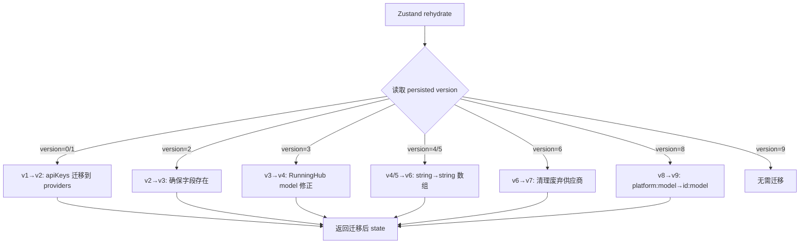
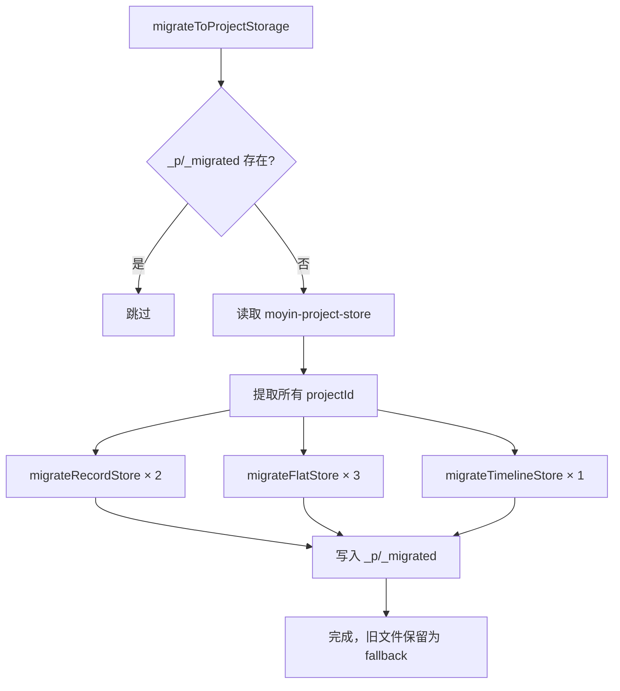
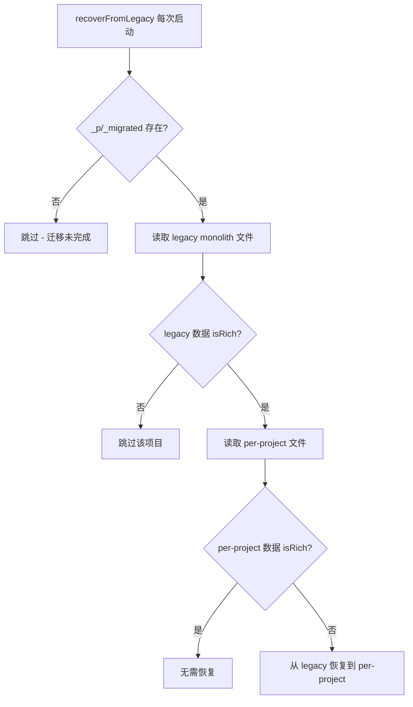

# PD-539.01 moyin-creator — Zustand 双层版本迁移链与 Monolith 拆分恢复

> 文档编号：PD-539.01
> 来源：moyin-creator `src/stores/api-config-store.ts` `src/lib/storage-migration.ts`
> GitHub：https://github.com/MemeCalculate/moyin-creator.git
> 问题域：PD-539 数据版本迁移 Data Schema Migration
> 状态：可复用方案

---

## 第 1 章 问题与动机

### 1.1 核心问题

Electron 桌面应用的持久化数据 schema 会随功能迭代频繁变更。moyin-creator 面临两个层次的迁移挑战：

1. **Store 级 schema 迁移**：单个 Zustand store 的字段类型变更（如 `featureBindings` 从 `string` 变为 `string[]`、废弃供应商清理、binding 格式从 `platform:model` 转为 `id:model`），需要 v1→v9 共 9 个版本的渐进式升级。
2. **存储架构迁移**：整个应用从单体 JSON 文件（monolith）拆分为 `_p/{projectId}/` 的项目级文件结构，涉及 5 个 store 的数据重新分区，且需要在迁移后持续检测并恢复被 bug 覆盖的数据。

这两层迁移相互独立但时序耦合：架构迁移在 App 启动时先于 store rehydration 执行，store 级迁移在 Zustand persist 的 `migrate` 回调中自动触发。

### 1.2 moyin-creator 的解法概述

1. **Zustand persist `version` + `migrate` 回调**：`api-config-store.ts:863-864` 声明 `version: 9`，`migrate` 函数按 `version` 分支执行对应的 schema 变换，每个版本处理一种特定变更。
2. **Monolith→Per-Project 拆分迁移**：`storage-migration.ts:23-103` 的 `migrateToProjectStorage()` 读取旧单体文件，按 `projectId` 拆分写入 `_p/{pid}/` 和 `_shared/` 目录，用 `_p/_migrated` 标志位实现幂等。
3. **Bug 驱动的数据恢复**：`storage-migration.ts:254-276` 的 `recoverFromLegacy()` 在每次启动时对比 legacy 文件与 per-project 文件的"丰富度"，自动修复被 `switchProject()` 竞态 bug 覆盖的数据。
4. **三源存储适配器**：`indexed-db-storage.ts:61-156` 在 Electron 环境下同时检查 fileStorage、localStorage、IndexedDB 三个数据源，自动将最丰富的数据迁移到 fileStorage 并清理旧源。
5. **项目级路由存储**：`project-storage.ts:61-145` 的 `createProjectScopedStorage()` 在 setItem 时从数据本身提取 `activeProjectId`（而非依赖全局状态），防止竞态条件导致跨项目数据覆盖。

### 1.3 设计思想

| 设计原则 | 具体实现 | 理由 | 替代方案 |
|----------|----------|------|----------|
| 版本分支式迁移 | `migrate` 中按 `version` 做 if 分支，每个版本独立处理 | 每个版本的变更逻辑隔离，易于理解和测试 | 迁移函数链（顺序执行所有中间版本） |
| 幂等标志位 | `_p/_migrated` JSON 标志文件 | 防止重复迁移，支持崩溃后重试 | 版本号比较 |
| 数据丰富度比较 | `isScriptDataRich()` / `isDirectorDataRich()` 检查实际内容 | 不依赖版本号，直接判断数据质量 | 时间戳比较 |
| 写前读后恢复 | 每次启动运行 `recoverFromLegacy()` | 修复已知 bug 造成的数据丢失，成本低（只读比较） | 用户手动恢复 |
| 数据驱动路由 | setItem 从 JSON payload 提取 projectId | 避免全局状态竞态，确保数据写入正确文件 | 依赖 getActiveProjectId() |

---

## 第 2 章 源码实现分析

### 2.1 架构概览

moyin-creator 的数据迁移系统分为两层，在 App 启动时按顺序执行：

```
┌─────────────────────────────────────────────────────────────┐
│                    App.tsx 启动序列                           │
│                                                             │
│  ① migrateToProjectStorage()  ─── 架构级迁移（一次性）        │
│       │                                                     │
│       ├─ 读取 moyin-project-store → 获取所有 projectId       │
│       ├─ migrateRecordStore() × 2  (script, director)       │
│       ├─ migrateFlatStore() × 3    (media, characters, scenes)│
│       ├─ migrateTimelineStore() × 1                         │
│       └─ 写入 _p/_migrated 标志                              │
│                                                             │
│  ② recoverFromLegacy()  ─── Bug 修复恢复（每次启动）          │
│       │                                                     │
│       ├─ 对比 legacy vs per-project 数据丰富度               │
│       └─ 丰富度不足时从 legacy 恢复                          │
│                                                             │
│  ③ Zustand persist rehydrate  ─── Store 级迁移（自动）       │
│       │                                                     │
│       └─ api-config-store migrate(state, version)           │
│           ├─ v1→v2: apiKeys → providers                     │
│           ├─ v2→v3: 确保 providers + featureBindings 存在    │
│           ├─ v3→v4: RunningHub model 修正                   │
│           ├─ v4/v5→v6: string → string[] 多选               │
│           ├─ v6→v7: 清理废弃供应商                           │
│           └─ v8→v9: platform:model → id:model               │
└─────────────────────────────────────────────────────────────┘
```

### 2.2 核心实现

#### 2.2.1 Zustand persist 版本迁移链



对应源码 `src/stores/api-config-store.ts:864-1149`：

```typescript
// api-config-store.ts:861-866
{
  name: 'opencut-api-config',  // localStorage key
  version: 9,  // v9: convert platform:model bindings to id:model
  migrate: (persistedState: unknown, version: number) => {
    const state = persistedState as Partial<APIConfigState> & { imageHostConfig?: LegacyImageHostConfig } | undefined;
    console.log(`[APIConfig] Migrating from version ${version}`);

    // v1 -> v2: Migrate apiKeys to providers (api-config-store.ts:934-958)
    if (version === 1 || version === 0) {
      const oldApiKeys = state?.apiKeys || {};
      const providers: IProvider[] = [];
      for (const template of DEFAULT_PROVIDERS) {
        const existingKey = oldApiKeys[template.platform as ProviderId] || '';
        providers.push({ id: generateId(), ...template, apiKey: existingKey });
      }
      return { ...state, providers, featureBindings: defaultBindings,
               imageHostProviders: resolveImageHostProviders() };
    }

    // v8 -> v9: Convert platform:model to id:model (api-config-store.ts:1002-1057)
    if (version === 8) {
      const providers: IProvider[] = state?.providers || [];
      const oldBindings = state?.featureBindings || {};
      const newBindings: FeatureBindings = { ...defaultBindings };
      for (const [key, value] of Object.entries(oldBindings)) {
        // ... 逐条检查 binding，按 provider 数量决定转换/删除/保留
        const matches = providers.filter(p => p.platform === platformOrId);
        if (matches.length === 1) {
          converted.push(`${matches[0].id}:${model}`); // 无歧义：转换
        } else if (matches.length > 1) {
          removedCount++; // 有歧义：删除，用户需重新绑定
        }
      }
      return { ...state, featureBindings: newBindings };
    }
    // ... 其他版本分支
  }
}
```

关键设计点：
- **非链式执行**：每个 `if (version === N)` 只处理从 N 到 N+1 的变更，Zustand persist 内部只调用一次 `migrate`，传入当前持久化版本号（`api-config-store.ts:864`）
- **兜底处理**：函数末尾（`api-config-store.ts:1122-1148`）对任何未匹配版本做 `featureBindings` 的 string→string[] 兼容和 `imageHostProviders` 的默认填充
- **Legacy 类型保留**：`LegacyImageHostConfig`（`api-config-store.ts:138-151`）专门定义旧版图床配置类型，供 `resolveImageHostProviders()` 在迁移时转换

#### 2.2.2 Monolith→Per-Project 架构迁移



对应源码 `src/lib/storage-migration.ts:23-103`：

```typescript
// storage-migration.ts:23-103
export async function migrateToProjectStorage(): Promise<void> {
  if (!window.fileStorage) return; // 仅 Electron 环境

  // 幂等检查：标志文件存在则跳过 (storage-migration.ts:28-38)
  try {
    const flagExists = await window.fileStorage.exists(MIGRATION_FLAG_KEY);
    if (flagExists) { console.log('[Migration] Already migrated, skipping.'); return; }
  } catch {
    const flag = await fileStorage.getItem(MIGRATION_FLAG_KEY);
    if (flag) return;
  }

  // 读取项目索引获取所有 projectId (storage-migration.ts:44-53)
  const projectStoreRaw = await fileStorage.getItem('moyin-project-store');
  const projectState = projectStoreData.state ?? projectStoreData;
  const projectIds: string[] = (projectState.projects ?? []).map((p: any) => p.id);

  // Record 型 store 迁移：按 projects[pid] 拆分 (storage-migration.ts:64-65)
  await migrateRecordStore('moyin-script-store', 'script', projectIds);
  await migrateRecordStore('moyin-director-store', 'director', projectIds);

  // Flat 型 store 迁移：按 projectIdField 过滤 + shared 分离 (storage-migration.ts:68-87)
  await migrateFlatStore('moyin-media-store', 'media', projectIds, {
    arrayKeys: ['mediaFiles', 'folders'],
    projectIdField: 'projectId',
    sharedFilter: (item, key) => {
      if (key === 'folders') return item.isSystem || !item.projectId;
      return !item.projectId;
    },
  });

  // 写入迁移标志 (storage-migration.ts:93)
  await writeMigrationFlag();
}
```

关键设计点：
- **两种拆分策略**：Record 型（script/director）按 `projects[pid]` 键拆分；Flat 型（media/characters/scenes）按数组元素的 `projectIdField` 过滤
- **Shared 分离**：系统文件夹（`isSystem`）和无 `projectId` 的项目放入 `_shared/` 目录
- **失败不写标志**：`catch` 块不调用 `writeMigrationFlag()`，下次启动会重试（`storage-migration.ts:99-102`）

#### 2.2.3 Bug 驱动的数据恢复



对应源码 `src/lib/storage-migration.ts:254-362`：

```typescript
// storage-migration.ts:279-286 — 数据丰富度判断
function isScriptDataRich(data: any): boolean {
  if (!data) return false;
  if (data.rawScript && data.rawScript.length > 10) return true;
  if (data.shots && data.shots.length > 0) return true;
  if (data.scriptData && data.scriptData.episodes && data.scriptData.episodes.length > 0) return true;
  if (data.episodeRawScripts && data.episodeRawScripts.length > 0) return true;
  return false;
}

// storage-migration.ts:339-354 — 恢复逻辑
if (!isRich(currentData)) {
  const payload = JSON.stringify({
    state: { activeProjectId: pid, projectData: legacyData,
             ...(state.config ? { config: state.config } : {}) },
    version: parsed.version ?? 0,
  });
  await fileStorage.setItem(projectKey, payload);
  recoveredCount++;
}
```

### 2.3 实现细节

**三源存储优先级**（`indexed-db-storage.ts:62-124`）：

```
读取优先级: localStorage(有丰富数据) > IndexedDB(有丰富数据) > fileStorage
写入目标: 始终写入 fileStorage（Electron）或 localStorage（浏览器）
清理策略: fileStorage 有数据后，自动清理 localStorage 和 IndexedDB 中的副本
```

**竞态防护**（`project-storage.ts:96-133`）：

setItem 时从 JSON payload 中提取 `state.activeProjectId`，而非调用 `getActiveProjectId()`。这解决了 `switchProject()` 在 `setActiveProjectId()` 之后、`rehydrate()` 之前触发 persist 写入的竞态问题。当检测到 `dataProjectId !== routerPid` 时记录警告日志。


---

## 第 3 章 迁移指南

### 3.1 迁移清单

**阶段 1：Store 级版本迁移（1-2 天）**

- [ ] 在 Zustand persist 配置中添加 `version` 字段
- [ ] 实现 `migrate(persistedState, version)` 回调
- [ ] 为每个版本变更编写独立的 if 分支
- [ ] 定义 Legacy 类型接口用于类型安全的迁移
- [ ] 在 `partialize` 中明确持久化字段列表
- [ ] 添加兜底处理确保未知版本也能正常加载

**阶段 2：架构级迁移（2-3 天）**

- [ ] 设计目标文件结构（如 `_p/{projectId}/`）
- [ ] 实现幂等迁移函数 + 标志文件检查
- [ ] 区分 Record 型和 Flat 型 store 的拆分策略
- [ ] 实现 shared 数据分离逻辑
- [ ] 在 App 入口处调用迁移函数，确保在 store rehydrate 之前执行
- [ ] 实现 `createProjectScopedStorage()` 自定义 StateStorage

**阶段 3：恢复与防护（1 天）**

- [ ] 实现数据丰富度检查函数
- [ ] 实现 `recoverFromLegacy()` 启动时恢复
- [ ] 在 setItem 中从 payload 提取 projectId 防竞态

### 3.2 适配代码模板

#### 模板 1：Zustand persist 版本迁移

```typescript
import { create } from 'zustand';
import { persist } from 'zustand/middleware';

interface MyStoreState {
  items: string[];
  config: Record<string, unknown>;
}

// Legacy 类型定义（用于迁移时的类型安全）
interface LegacyV1State {
  oldItems: string; // v1 是逗号分隔字符串
}

const CURRENT_VERSION = 3;

export const useMyStore = create<MyStoreState>()(
  persist(
    (set, get) => ({
      items: [],
      config: {},
      // ... actions
    }),
    {
      name: 'my-store-key',
      version: CURRENT_VERSION,
      migrate: (persisted: unknown, version: number) => {
        const state = persisted as Partial<MyStoreState> & Partial<LegacyV1State>;
        console.log(`[MyStore] Migrating from v${version} to v${CURRENT_VERSION}`);

        // v1 → v2: 逗号字符串 → 数组
        if (version === 1) {
          const oldItems = (state as LegacyV1State).oldItems || '';
          return {
            ...state,
            items: oldItems.split(',').filter(Boolean),
          };
        }

        // v2 → v3: 添加 config 字段默认值
        if (version === 2) {
          return {
            ...state,
            config: state.config || { theme: 'dark' },
          };
        }

        // 兜底：确保关键字段存在
        return {
          ...state,
          items: Array.isArray(state.items) ? state.items : [],
          config: state.config || {},
        };
      },
      partialize: (state) => ({
        items: state.items,
        config: state.config,
      }),
    }
  )
);
```

#### 模板 2：幂等架构迁移

```typescript
const MIGRATION_FLAG = '_migrated_v2';

export async function migrateStorage(): Promise<void> {
  // 幂等检查
  const flag = await storage.getItem(MIGRATION_FLAG);
  if (flag) return;

  try {
    // 读取旧数据
    const legacyData = await storage.getItem('legacy-store');
    if (!legacyData) {
      await writeMigrationFlag();
      return;
    }

    const parsed = JSON.parse(legacyData);
    const projectIds = extractProjectIds(parsed);

    // 按项目拆分写入
    for (const pid of projectIds) {
      const projectData = extractProjectData(parsed, pid);
      await storage.setItem(`projects/${pid}/data`, JSON.stringify(projectData));
    }

    // 成功后写标志
    await writeMigrationFlag();
  } catch (error) {
    console.error('Migration failed, will retry on next startup:', error);
    // 不写标志 → 下次启动重试
  }
}

async function writeMigrationFlag(): Promise<void> {
  await storage.setItem(MIGRATION_FLAG, JSON.stringify({
    migratedAt: new Date().toISOString(),
    version: 1,
  }));
}
```

### 3.3 适用场景

| 场景 | 适用度 | 说明 |
|------|--------|------|
| Electron 桌面应用 schema 演进 | ⭐⭐⭐ | 完美匹配：本地持久化 + 版本迭代频繁 |
| Zustand + persist 的 Web 应用 | ⭐⭐⭐ | 直接复用 migrate 回调模式 |
| 多项目/多租户本地存储拆分 | ⭐⭐⭐ | Monolith→Per-Project 拆分方案可直接移植 |
| 纯后端数据库迁移 | ⭐ | 不适用，后端应使用 Flyway/Alembic 等专业工具 |
| 无版本号的遗留数据修复 | ⭐⭐ | 数据丰富度比较策略可借鉴 |

---

## 第 4 章 测试用例

```typescript
import { describe, it, expect, vi, beforeEach } from 'vitest';

// ==================== Store 级迁移测试 ====================

describe('api-config-store migrate', () => {
  // 模拟 migrate 函数（从 api-config-store 提取核心逻辑）
  function migrate(persistedState: any, version: number): any {
    const state = persistedState;
    const defaultBindings = {
      script_analysis: null,
      character_generation: null,
      chat: null,
    };

    if (version === 1 || version === 0) {
      const oldApiKeys = state?.apiKeys || {};
      const providers = Object.entries(oldApiKeys).map(([platform, key]) => ({
        id: `gen-${platform}`,
        platform,
        apiKey: key,
      }));
      return { ...state, providers, featureBindings: defaultBindings };
    }

    if (version === 5) {
      const oldBindings = state?.featureBindings || {};
      const newBindings: Record<string, string[] | null> = { ...defaultBindings };
      for (const [key, value] of Object.entries(oldBindings)) {
        if (typeof value === 'string' && value) {
          newBindings[key] = [value];
        } else if (Array.isArray(value)) {
          newBindings[key] = value;
        }
      }
      return { ...state, featureBindings: newBindings };
    }

    return state;
  }

  it('v1→v2: should migrate apiKeys to providers', () => {
    const v1State = { apiKeys: { memefast: 'sk-123', openai: 'sk-456' } };
    const result = migrate(v1State, 1);
    expect(result.providers).toHaveLength(2);
    expect(result.providers[0].apiKey).toBe('sk-123');
    expect(result.featureBindings.chat).toBeNull();
  });

  it('v5→v6: should convert string bindings to arrays', () => {
    const v5State = {
      featureBindings: {
        script_analysis: 'memefast:deepseek-v3',
        chat: null,
        character_generation: ['memefast:flux'],
      },
    };
    const result = migrate(v5State, 5);
    expect(result.featureBindings.script_analysis).toEqual(['memefast:deepseek-v3']);
    expect(result.featureBindings.chat).toBeNull();
    expect(result.featureBindings.character_generation).toEqual(['memefast:flux']);
  });

  it('v0: should handle empty state gracefully', () => {
    const result = migrate({}, 0);
    expect(result.providers).toEqual([]);
    expect(result.featureBindings).toBeDefined();
  });
});

// ==================== 架构迁移测试 ====================

describe('storage-migration', () => {
  let mockStorage: Map<string, string>;

  beforeEach(() => {
    mockStorage = new Map();
  });

  it('should be idempotent with migration flag', async () => {
    mockStorage.set('_p/_migrated', JSON.stringify({ version: 1 }));
    // migrateToProjectStorage should skip when flag exists
    const flagExists = mockStorage.has('_p/_migrated');
    expect(flagExists).toBe(true);
  });

  it('should split record store by projectId', () => {
    const monolith = {
      state: {
        projects: {
          'proj-1': { rawScript: 'Hello world', shots: [] },
          'proj-2': { rawScript: 'Another script', shots: [{ id: 's1' }] },
        },
      },
      version: 0,
    };

    const state = monolith.state;
    const results: Record<string, any> = {};
    for (const pid of Object.keys(state.projects)) {
      results[`_p/${pid}/script`] = state.projects[pid as keyof typeof state.projects];
    }

    expect(Object.keys(results)).toHaveLength(2);
    expect(results['_p/proj-1/script'].rawScript).toBe('Hello world');
    expect(results['_p/proj-2/script'].shots).toHaveLength(1);
  });

  it('should separate shared items from project items', () => {
    const folders = [
      { id: 'f1', isSystem: true, projectId: null },
      { id: 'f2', isSystem: false, projectId: 'proj-1' },
      { id: 'f3', isSystem: false, projectId: 'proj-2' },
    ];

    const shared = folders.filter(f => f.isSystem || !f.projectId);
    const proj1 = folders.filter(f => f.projectId === 'proj-1' && !f.isSystem);

    expect(shared).toHaveLength(1);
    expect(proj1).toHaveLength(1);
    expect(proj1[0].id).toBe('f2');
  });
});

// ==================== 数据恢复测试 ====================

describe('recoverFromLegacy', () => {
  it('should detect rich script data', () => {
    const isRich = (data: any): boolean => {
      if (!data) return false;
      if (data.rawScript && data.rawScript.length > 10) return true;
      if (data.shots && data.shots.length > 0) return true;
      return false;
    };

    expect(isRich(null)).toBe(false);
    expect(isRich({ rawScript: 'short' })).toBe(false);
    expect(isRich({ rawScript: 'A long enough script text' })).toBe(true);
    expect(isRich({ shots: [{ id: 's1' }] })).toBe(true);
  });

  it('should recover when per-project data is empty but legacy is rich', () => {
    const legacyData = { rawScript: 'Full script content here', shots: [{ id: 's1' }] };
    const perProjectData = { rawScript: '', shots: [] };

    const isRich = (d: any) => d?.rawScript?.length > 10 || d?.shots?.length > 0;
    const shouldRecover = isRich(legacyData) && !isRich(perProjectData);

    expect(shouldRecover).toBe(true);
  });
});
```


---

## 第 5 章 跨域关联

| 关联域 | 关系类型 | 说明 |
|--------|----------|------|
| PD-06 记忆持久化 | 强依赖 | 迁移系统的目标就是将持久化数据从单体拆分为项目级，`project-storage.ts` 的 `createProjectScopedStorage()` 和 `createSplitStorage()` 是持久化层的核心适配器 |
| PD-03 容错与重试 | 协同 | 迁移失败不写标志位实现自动重试；`recoverFromLegacy()` 是对已知 bug 的容错恢复；三源存储的优先级选择也是容错设计 |
| PD-10 中间件管道 | 协同 | Zustand persist 本身是中间件模式，`migrate` 回调是 persist 中间件的钩子；`createProjectScopedStorage()` 是自定义 StateStorage 适配器 |
| PD-518 Zustand 状态架构 | 强依赖 | 迁移系统服务于 Zustand store 的 schema 演进，`partialize` 控制持久化范围，`onRehydrateStorage` 处理恢复后的状态修正 |

---

## 第 6 章 来源文件索引

| 文件 | 行范围 | 关键实现 |
|------|--------|----------|
| `src/stores/api-config-store.ts` | L861-L866 | persist 配置：version=9, migrate 回调入口 |
| `src/stores/api-config-store.ts` | L934-L958 | v1→v2 迁移：apiKeys 转 providers |
| `src/stores/api-config-store.ts` | L1000-L1057 | v8→v9 迁移：platform:model 转 id:model，歧义绑定删除 |
| `src/stores/api-config-store.ts` | L1094-L1120 | v5→v6 迁移：string 转 string[] 多选 |
| `src/stores/api-config-store.ts` | L1059-L1092 | v6→v7 迁移：清理废弃供应商 + 关联绑定 |
| `src/stores/api-config-store.ts` | L1122-L1148 | 兜底处理：未知版本的字段兼容 |
| `src/stores/api-config-store.ts` | L138-L151 | LegacyImageHostConfig 类型定义 |
| `src/stores/api-config-store.ts` | L879-L931 | resolveImageHostProviders() 图床迁移辅助 |
| `src/lib/storage-migration.ts` | L23-L103 | migrateToProjectStorage() 架构级迁移主函数 |
| `src/lib/storage-migration.ts` | L107-L152 | migrateRecordStore() Record 型拆分 |
| `src/lib/storage-migration.ts` | L162-L218 | migrateFlatStore() Flat 型拆分 + shared 分离 |
| `src/lib/storage-migration.ts` | L254-L276 | recoverFromLegacy() Bug 驱动恢复 |
| `src/lib/storage-migration.ts` | L279-L295 | isScriptDataRich() / isDirectorDataRich() 丰富度判断 |
| `src/lib/storage-migration.ts` | L301-L362 | recoverRecordStore() 恢复逻辑 |
| `src/lib/storage-migration.ts` | L366-L373 | writeMigrationFlag() 幂等标志写入 |
| `src/lib/project-storage.ts` | L61-L145 | createProjectScopedStorage() 项目级路由存储 |
| `src/lib/project-storage.ts` | L96-L133 | setItem 竞态防护：从 payload 提取 projectId |
| `src/lib/project-storage.ts` | L169-L315 | createSplitStorage() 分裂存储适配器 |
| `src/lib/indexed-db-storage.ts` | L61-L124 | 三源存储适配器：fileStorage > localStorage > IndexedDB |
| `src/lib/indexed-db-storage.ts` | L31-L59 | hasRichData() 数据丰富度检查 |
| `src/App.tsx` | L19-L28 | 启动时迁移 + 恢复调用序列 |
| `src/stores/project-store.ts` | L123-L131 | project-store migrate：确保默认项目存在 |

---

## 第 7 章 横向对比维度

```json comparison_data
{
  "project": "moyin-creator",
  "dimensions": {
    "版本管理方式": "Zustand persist version 字段 + if 分支式 migrate 回调，v1→v9 共 9 版本",
    "迁移执行模式": "双层迁移：App 启动时架构级拆分 + Zustand rehydrate 时 store 级 schema 变换",
    "向后兼容策略": "保留 Legacy 类型定义 + apiKeys 字段保留 + 兜底 string→string[] 兼容",
    "回滚与恢复": "recoverFromLegacy 每次启动对比数据丰富度，自动从 monolith 恢复被覆盖数据",
    "存储架构迁移": "Monolith→Per-Project 拆分：Record 型按键拆分 + Flat 型按 projectId 过滤 + shared 分离",
    "幂等保障": "_p/_migrated 标志文件 + 失败不写标志自动重试"
  }
}
```

### 域元数据补充

```json domain_metadata
{
  "solution_summary": "moyin-creator 用 Zustand persist version+migrate 实现 v1→v9 九版本 schema 迁移，配合 Monolith→Per-Project 架构拆分和 recoverFromLegacy 启动时数据恢复",
  "description": "Electron 桌面应用中 Zustand 持久化数据的双层迁移体系与竞态防护",
  "sub_problems": [
    "Monolith 到多文件的存储架构拆分",
    "三源存储（fileStorage/localStorage/IndexedDB）的优先级选择与自动迁移",
    "项目切换竞态导致的跨项目数据覆盖防护"
  ],
  "best_practices": [
    "迁移失败不写标志位，下次启动自动重试",
    "setItem 从 JSON payload 提取 projectId 而非依赖全局状态，防止竞态覆盖",
    "用数据丰富度比较（而非版本号）判断是否需要从旧数据恢复",
    "保留 Legacy 类型定义确保迁移代码的类型安全"
  ]
}
```

