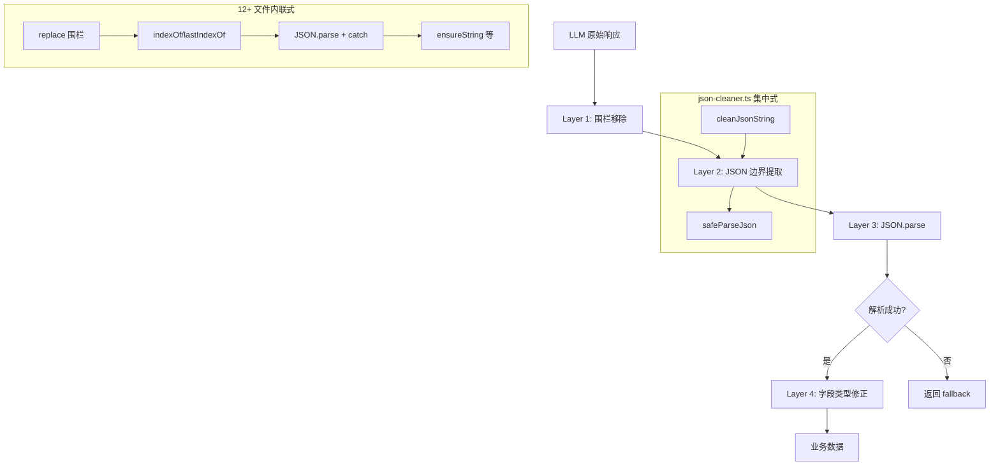
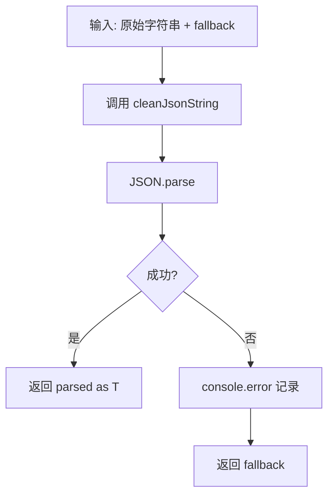
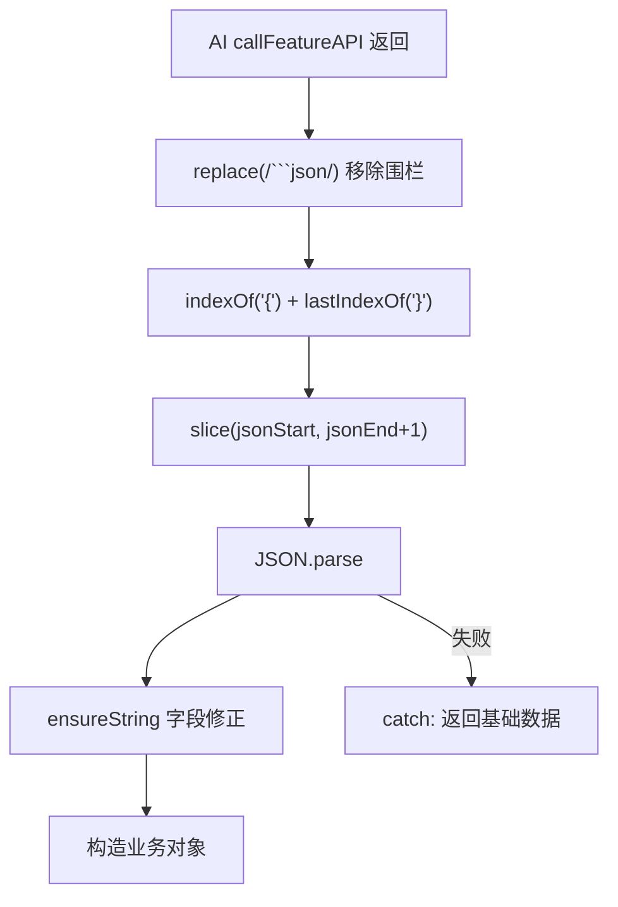
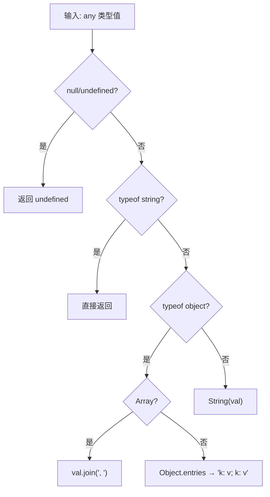

# PD-540.01 moyin-creator — 四层 AI 输出清洗与 JSON 边界提取

> 文档编号：PD-540.01
> 来源：moyin-creator `src/lib/utils/json-cleaner.ts`
> GitHub：https://github.com/MemeCalculate/moyin-creator.git
> 问题域：PD-540 AI 响应解析 AI Response Parsing
> 状态：可复用方案

---

## 第 1 章 问题与动机

### 1.1 核心问题

LLM 的输出格式天然不稳定。即使 prompt 中明确要求"返回 JSON"，实际返回的内容可能包含：

- Markdown 代码围栏（` ```json ... ``` `）包裹的 JSON
- JSON 前后夹杂自然语言解释文本
- 数字类型的 ID 字段（prompt 要求字符串但模型返回 `1` 而非 `"1"`）
- 嵌套对象/数组字段本应是字符串（如 `personality` 返回 `{...}` 而非 `"..."`）
- 完全无法解析的乱码（模型 token 耗尽、安全过滤截断等）

在 moyin-creator 这样一个影视剧本 AI 创作工具中，几乎每个功能模块都需要调用 LLM 并解析 JSON 响应——剧本解析、角色生成、场景校准、分镜生成、视角分析等。如果每个模块各自处理这些问题，代码会极度冗余且容易遗漏边界情况。

### 1.2 moyin-creator 的解法概述

moyin-creator 采用**中心化工具库 + 分散式内联解析**的双层架构：

1. **中心化工具库** `json-cleaner.ts`（`src/lib/utils/json-cleaner.ts:1-98`）提供 5 个通用函数：围栏移除、边界提取、安全解析、ID 归一化、数组校验
2. **内联解析模式**：在 12+ 个业务文件中重复相同的三步清洗模式（围栏移除→边界提取→JSON.parse），用于需要后续字段级类型修正的场景
3. **ensureString 深度类型修正**：在 `ai-scene-finder.ts:238` 和 `ai-character-finder.ts:388` 中定义，处理 LLM 返回对象/数组而非字符串的情况
4. **泛型 fallback 兜底**：`safeParseJson<T>` 接受 fallback 参数，确保解析失败时不会导致运行时崩溃

### 1.3 设计思想

| 设计原则 | 具体实现 | 理由 | 替代方案 |
|----------|----------|------|----------|
| 先清洗再解析 | `cleanJsonString` 在 `JSON.parse` 之前执行 | 将格式问题与解析逻辑分离，单一职责 | 用正则直接提取 JSON（不够健壮） |
| 贪婪边界匹配 | `indexOf('{')` + `lastIndexOf('}')` 取最外层 | 处理 LLM 在 JSON 前后添加解释文本的情况 | 逐字符状态机解析（过度工程） |
| 泛型 fallback | `safeParseJson<T>(str, fallback)` | 调用方决定降级行为，工具库不做业务假设 | 抛异常让调用方 catch（增加样板代码） |
| 类型归一化后置 | `normalizeIds` 在 parse 之后执行 | LLM 的类型错误只能在 parse 后修正 | 在 prompt 中强调类型（不可靠） |
| 对象→字符串深度修正 | `ensureString` 递归处理 object/array/primitive | LLM 可能返回嵌套对象而非扁平字符串 | Zod schema 校验（更重但更严格） |

---

## 第 2 章 源码实现分析

### 2.1 架构概览

moyin-creator 的 AI 响应解析分为四层：

```
┌─────────────────────────────────────────────────────────┐
│                    Layer 4: 业务字段修正                   │
│  ensureString / ensureTags / normalizeTimeValue          │
│  (ai-scene-finder.ts, ai-character-finder.ts,            │
│   script-parser.ts)                                      │
├─────────────────────────────────────────────────────────┤
│                    Layer 3: 安全解析                       │
│  safeParseJson<T>(str, fallback) → T                     │
│  JSON.parse(cleaned) + try/catch fallback                │
├─────────────────────────────────────────────────────────┤
│                    Layer 2: JSON 边界提取                  │
│  indexOf('{') / indexOf('[') + lastIndexOf               │
│  extractJson() 正则版                                     │
├─────────────────────────────────────────────────────────┤
│                    Layer 1: 围栏移除                       │
│  replace(/```json\s*/gi, '') + replace(/```\s*/g, '')    │
│  cleanJsonString()                                       │
└─────────────────────────────────────────────────────────┘
```

**调用关系图：**



### 2.2 核心实现

#### 2.2.1 中心化工具库 cleanJsonString

```mermaid
graph TD
    A[输入: AI 原始字符串] --> B{字符串为空?}
    B -->|是| C["返回 '{}'"]
    B -->|否| D[移除 markdown 围栏]
    D --> E[trim 空白]
    E --> F{查找 JSON 边界}
    F -->|找到 '{...}'| G[提取对象]
    F -->|找到 '[...]'| H[提取数组]
    F -->|都没找到| I[返回清洗后原文]
    G --> J[返回 JSON 字符串]
    H --> J
```

对应源码 `src/lib/utils/json-cleaner.ts:13-41`：

```typescript
export function cleanJsonString(str: string): string {
  if (!str) return "{}";
  let cleaned = str;
  // Layer 1: 移除 markdown 代码围栏
  cleaned = cleaned.replace(/```json\s*/gi, "");
  cleaned = cleaned.replace(/```\s*/g, "");
  cleaned = cleaned.trim();
  // Layer 2: JSON 边界提取 — 贪婪匹配最外层括号
  const firstBrace = cleaned.indexOf("{");
  const firstBracket = cleaned.indexOf("[");
  const lastBrace = cleaned.lastIndexOf("}");
  const lastBracket = cleaned.lastIndexOf("]");
  if (firstBrace !== -1 && lastBrace !== -1 && firstBrace < lastBrace) {
    if (firstBracket === -1 || firstBrace < firstBracket) {
      cleaned = cleaned.slice(firstBrace, lastBrace + 1);
    }
  } else if (firstBracket !== -1 && lastBracket !== -1 && firstBracket < lastBracket) {
    cleaned = cleaned.slice(firstBracket, lastBracket + 1);
  }
  return cleaned;
}
```

关键设计：对象优先于数组（`firstBrace < firstBracket` 判断），因为大多数 LLM 响应是 JSON 对象。

#### 2.2.2 safeParseJson 泛型安全解析



对应源码 `src/lib/utils/json-cleaner.ts:46-54`：

```typescript
export function safeParseJson<T>(str: string, fallback: T): T {
  try {
    const cleaned = cleanJsonString(str);
    return JSON.parse(cleaned) as T;
  } catch (error) {
    console.error("[JSON Parse Error]", error);
    return fallback;
  }
}
```

调用示例 — `script-parser.ts:674-675`：

```typescript
const cleaned = cleanJsonString(response);
const shots = safeParseJson<any[]>(cleaned, []);
```

#### 2.2.3 内联三步清洗模式（12+ 文件重复）

项目中有 12+ 个文件没有使用 `json-cleaner.ts` 的集中工具，而是内联了相同的三步模式。以 `ai-character-finder.ts:378-385` 为例：



对应源码 `src/lib/script/ai-character-finder.ts:378-385`：

```typescript
let cleaned = result.replace(/```json\n?/g, '').replace(/```\n?/g, '').trim();
const jsonStart = cleaned.indexOf('{');
const jsonEnd = cleaned.lastIndexOf('}');
if (jsonStart !== -1 && jsonEnd !== -1) {
  cleaned = cleaned.slice(jsonStart, jsonEnd + 1);
}
const parsed = JSON.parse(cleaned);
```

**内联此模式的文件清单：**

| 文件 | 行号 | 场景 |
|------|------|------|
| `ai-character-finder.ts` | L378-385 | 角色数据生成 |
| `ai-scene-finder.ts` | L228-235 | 场景数据生成 |
| `scene-calibrator.ts` | L388-397, L600-607 | 场景校准（2处） |
| `character-calibrator.ts` | L483-492, L934-941 | 角色校准（2处） |
| `character-stage-analyzer.ts` | L151-158 | 角色阶段分析 |
| `viewpoint-analyzer.ts` | L160-167 | 视角分析 |
| `shot-calibration-stages.ts` | L94-100 | 分镜校准 |
| `full-script-service.ts` | L946-947, L1897-1904, L2049-2050 | 全剧本服务（3处） |
| `character-prompt-service.ts` | L276-283 | 角色提示词 |
| `scene-prompt-generator.ts` | L483 | 场景提示词 |
| `sclass-calibrator.ts` | L132-141 | 风格校准 |

#### 2.2.4 ensureString 深度类型修正



对应源码 `src/lib/script/ai-character-finder.ts:388-402`：

```typescript
const ensureString = (val: any): string | undefined => {
  if (val === null || val === undefined) return undefined;
  if (typeof val === 'string') return val;
  if (typeof val === 'object') {
    if (Array.isArray(val)) {
      return val.join(', ');
    }
    return Object.entries(val)
      .map(([k, v]) => `${k}: ${v}`)
      .join('; ');
  }
  return String(val);
};
```

此函数在 `ai-scene-finder.ts:238-250` 中有完全相同的副本。

### 2.3 实现细节

**extractJson 正则版** (`json-cleaner.ts:88-98`) 使用贪婪正则 `/\{[\s\S]*\}/` 提取 JSON，与 `cleanJsonString` 的 indexOf 方式互补：

- `cleanJsonString`：基于字符位置，更快，适合已知格式
- `extractJson`：基于正则，更灵活，适合未知格式

**normalizeIds** (`json-cleaner.ts:60-67`) 处理 LLM 返回数字 ID 的问题：

```typescript
export function normalizeIds<T extends { id?: string | number }>(
  items: T[]
): (T & { id: string })[] {
  return items.map((item) => ({
    ...item,
    id: String(item.id || ""),
  }));
}
```

**cleanArray** (`json-cleaner.ts:72-83`) 提供可选的类型守卫校验：

```typescript
export function cleanArray<T>(
  data: unknown,
  validator?: (item: unknown) => item is T
): T[] {
  if (!Array.isArray(data)) return [];
  if (validator) return data.filter(validator);
  return data as T[];
}
```

**normalizeTimeValue** (`script-parser.ts:21-54`) 是业务层的类型归一化示例，将中文时间描述映射到标准英文 ID：

```typescript
const timeMap: Record<string, string> = {
  '白天': 'day', '夜晚': 'night', '黄昏': 'dusk',
  '黎明': 'dawn', '中午': 'noon', '深夜': 'midnight',
  // ...
};
```


---

## 第 3 章 迁移指南

### 3.1 迁移清单

**阶段 1：核心工具库（1 个文件）**

- [ ] 创建 `utils/ai-json-parser.ts`，包含 `cleanJsonString`、`safeParseJson`、`extractJson`、`normalizeIds`、`cleanArray` 五个函数
- [ ] 将 `ensureString` 从内联提升为工具库导出函数（消除重复）
- [ ] 添加 `ensureTags` 和 `ensureStringArray` 辅助函数

**阶段 2：业务集成**

- [ ] 在所有 AI 调用点统一使用 `safeParseJson` 替代内联三步模式
- [ ] 对需要字段修正的场景，在 `safeParseJson` 之后调用 `ensureString` 等修正函数
- [ ] 为每个 AI 调用点定义 fallback 默认值

**阶段 3：增强（可选）**

- [ ] 引入 Zod schema 校验替代手动字段修正
- [ ] 添加解析失败的结构化日志（记录原始响应、失败原因、fallback 值）
- [ ] 添加解析成功率监控指标

### 3.2 适配代码模板

**核心工具库（可直接复用）：**

```typescript
// utils/ai-json-parser.ts

/**
 * 移除 Markdown 代码围栏并提取 JSON 边界
 */
export function cleanJsonString(str: string): string {
  if (!str) return "{}";
  let cleaned = str;
  cleaned = cleaned.replace(/```(?:json|typescript|javascript)?\s*/gi, "");
  cleaned = cleaned.replace(/```\s*/g, "");
  cleaned = cleaned.trim();

  const firstBrace = cleaned.indexOf("{");
  const firstBracket = cleaned.indexOf("[");
  const lastBrace = cleaned.lastIndexOf("}");
  const lastBracket = cleaned.lastIndexOf("]");

  if (firstBrace !== -1 && lastBrace !== -1 && firstBrace < lastBrace) {
    if (firstBracket === -1 || firstBrace < firstBracket) {
      cleaned = cleaned.slice(firstBrace, lastBrace + 1);
    }
  } else if (firstBracket !== -1 && lastBracket !== -1 && firstBracket < lastBracket) {
    cleaned = cleaned.slice(firstBracket, lastBracket + 1);
  }
  return cleaned;
}

/**
 * 安全解析 JSON，失败时返回 fallback
 */
export function safeParseJson<T>(str: string, fallback: T): T {
  try {
    const cleaned = cleanJsonString(str);
    return JSON.parse(cleaned) as T;
  } catch (error) {
    console.error("[AI JSON Parse Error]", error);
    return fallback;
  }
}

/**
 * 深度类型修正：将 LLM 返回的任意类型强制转为字符串
 */
export function ensureString(val: unknown): string | undefined {
  if (val === null || val === undefined) return undefined;
  if (typeof val === "string") return val;
  if (Array.isArray(val)) return val.join(", ");
  if (typeof val === "object") {
    return Object.entries(val as Record<string, unknown>)
      .map(([k, v]) => `${k}: ${v}`)
      .join("; ");
  }
  return String(val);
}

/**
 * 确保数组中所有 ID 为字符串类型
 */
export function normalizeIds<T extends { id?: string | number }>(
  items: T[]
): (T & { id: string })[] {
  return items.map((item) => ({
    ...item,
    id: String(item.id || ""),
  }));
}
```

**业务调用示例：**

```typescript
import { safeParseJson, ensureString, normalizeIds } from '@/utils/ai-json-parser';

// 场景 1：简单解析 + fallback
const shots = safeParseJson<ShotData[]>(aiResponse, []);

// 场景 2：解析 + 字段修正
const raw = safeParseJson<Record<string, unknown>>(aiResponse, {});
const character = {
  id: `char_${Date.now()}`,
  name: ensureString(raw.name) || '未知角色',
  personality: ensureString(raw.personality),
  appearance: ensureString(raw.appearance),
};

// 场景 3：解析 + ID 归一化
const items = safeParseJson<{ id: number; name: string }[]>(aiResponse, []);
const normalized = normalizeIds(items);
```

### 3.3 适用场景

| 场景 | 适用度 | 说明 |
|------|--------|------|
| LLM JSON 输出解析 | ⭐⭐⭐ | 核心场景，直接复用 |
| 多模型多提供商项目 | ⭐⭐⭐ | 不同模型的格式差异更大，更需要清洗 |
| 流式 JSON 解析 | ⭐⭐ | 需额外处理不完整 JSON 片段 |
| 结构化输出（function calling） | ⭐ | 模型原生返回 JSON，清洗需求低 |
| 非 JSON 格式（Markdown/XML） | ⭐ | 需要不同的解析策略 |

---

## 第 4 章 测试用例

```typescript
import { describe, it, expect } from 'vitest';
import { cleanJsonString, safeParseJson, normalizeIds, cleanArray, extractJson } from './ai-json-parser';

describe('cleanJsonString', () => {
  it('应移除 markdown json 围栏', () => {
    const input = '```json\n{"name": "test"}\n```';
    expect(cleanJsonString(input)).toBe('{"name": "test"}');
  });

  it('应移除无语言标记的围栏', () => {
    const input = '```\n{"key": "value"}\n```';
    expect(cleanJsonString(input)).toBe('{"key": "value"}');
  });

  it('应提取被自然语言包裹的 JSON 对象', () => {
    const input = '好的，以下是结果：\n{"name": "张三"}\n希望对你有帮助！';
    expect(cleanJsonString(input)).toBe('{"name": "张三"}');
  });

  it('应提取 JSON 数组', () => {
    const input = '结果如下：[{"id": 1}, {"id": 2}]';
    expect(cleanJsonString(input)).toBe('[{"id": 1}, {"id": 2}]');
  });

  it('对象优先于数组（当对象在前时）', () => {
    const input = '{"items": [1, 2, 3]}';
    expect(cleanJsonString(input)).toBe('{"items": [1, 2, 3]}');
  });

  it('空字符串返回 {}', () => {
    expect(cleanJsonString('')).toBe('{}');
    expect(cleanJsonString(null as any)).toBe('{}');
  });
});

describe('safeParseJson', () => {
  it('正常解析 JSON', () => {
    const result = safeParseJson('{"name": "test"}', { name: '' });
    expect(result).toEqual({ name: 'test' });
  });

  it('解析失败返回 fallback', () => {
    const fallback = { name: 'default' };
    const result = safeParseJson('not json at all', fallback);
    expect(result).toBe(fallback);
  });

  it('处理围栏包裹的 JSON', () => {
    const result = safeParseJson('```json\n{"x": 1}\n```', { x: 0 });
    expect(result).toEqual({ x: 1 });
  });

  it('fallback 为数组时正常工作', () => {
    const result = safeParseJson<number[]>('invalid', []);
    expect(result).toEqual([]);
  });
});

describe('normalizeIds', () => {
  it('将数字 ID 转为字符串', () => {
    const items = [{ id: 1, name: 'a' }, { id: 2, name: 'b' }];
    const result = normalizeIds(items);
    expect(result[0].id).toBe('1');
    expect(result[1].id).toBe('2');
  });

  it('保留已有字符串 ID', () => {
    const items = [{ id: 'char_1', name: 'a' }];
    const result = normalizeIds(items);
    expect(result[0].id).toBe('char_1');
  });

  it('处理缺失 ID', () => {
    const items = [{ name: 'a' } as any];
    const result = normalizeIds(items);
    expect(result[0].id).toBe('');
  });
});

describe('cleanArray', () => {
  it('非数组返回空数组', () => {
    expect(cleanArray('not array')).toEqual([]);
    expect(cleanArray(null)).toEqual([]);
    expect(cleanArray(123)).toEqual([]);
  });

  it('无 validator 时直接返回', () => {
    expect(cleanArray([1, 2, 3])).toEqual([1, 2, 3]);
  });

  it('使用 validator 过滤', () => {
    const isString = (x: unknown): x is string => typeof x === 'string';
    expect(cleanArray(['a', 1, 'b', null], isString)).toEqual(['a', 'b']);
  });
});

describe('extractJson', () => {
  it('提取 JSON 对象', () => {
    const text = 'Here is the result: {"key": "value"} end';
    expect(extractJson(text)).toBe('{"key": "value"}');
  });

  it('提取 JSON 数组', () => {
    const text = 'Result: [1, 2, 3]';
    expect(extractJson(text)).toBe('[1, 2, 3]');
  });

  it('无 JSON 返回 null', () => {
    expect(extractJson('no json here')).toBeNull();
  });
});
```


---

## 第 5 章 跨域关联

| 关联域 | 关系类型 | 说明 |
|--------|----------|------|
| PD-03 容错与重试 | 协同 | `safeParseJson` 的 fallback 机制是容错策略的一部分；`script-parser.ts` 中 `callChatAPI` 使用 `retryOperation` 包裹 API 调用，解析失败可触发重试 |
| PD-04 工具系统 | 依赖 | AI 响应解析是工具调用结果处理的下游环节；`callFeatureAPI` 返回的原始字符串需要经过清洗才能使用 |
| PD-07 质量检查 | 协同 | 解析后的数据质量直接影响下游校准（scene-calibrator、character-calibrator）；`cleanArray` 的 validator 参数可用于数据质量校验 |
| PD-10 中间件管道 | 协同 | 四层清洗架构本身就是一个微型管道（围栏移除→边界提取→解析→类型修正）；可以抽象为中间件链 |
| PD-11 可观测性 | 依赖 | 解析失败的 `console.error` 是可观测性的基础；建议增加结构化日志记录解析成功率 |

---

## 第 6 章 来源文件索引

| 文件 | 行范围 | 关键实现 |
|------|--------|----------|
| `src/lib/utils/json-cleaner.ts` | L1-98 | 核心工具库：5 个导出函数 |
| `src/lib/script/script-parser.ts` | L12, L204, L485-488, L674-675 | 集中式调用：import + cleanJsonString + safeParseJson |
| `src/lib/script/ai-character-finder.ts` | L378-385, L388-402 | 内联三步清洗 + ensureString 深度修正 |
| `src/lib/script/ai-scene-finder.ts` | L228-235, L238-250, L253-262 | 内联三步清洗 + ensureString + ensureTags |
| `src/lib/script/scene-calibrator.ts` | L388-397, L600-607 | 内联三步清洗（2处） |
| `src/lib/script/character-calibrator.ts` | L483-492, L934-941 | 内联三步清洗（2处） |
| `src/lib/script/character-stage-analyzer.ts` | L151-158 | 内联三步清洗 |
| `src/lib/script/viewpoint-analyzer.ts` | L160-167 | 内联三步清洗 |
| `src/lib/script/shot-calibration-stages.ts` | L93-100 | 内联三步清洗（parseStageJSON 局部函数） |
| `src/lib/script/full-script-service.ts` | L946-947, L1897-1904, L2049-2050 | 内联三步清洗（3处） |
| `src/lib/character/character-prompt-service.ts` | L276-283 | 内联三步清洗 |
| `src/lib/storyboard/scene-prompt-generator.ts` | L483 | 简化版围栏移除 |
| `src/components/panels/sclass/sclass-calibrator.ts` | L132-141 | 组件层内联三步清洗 |
| `src/lib/script/script-parser.ts` | L21-54 | normalizeTimeValue 业务层类型归一化 |

---

## 第 7 章 横向对比维度

```json comparison_data
{
  "project": "moyin-creator",
  "dimensions": {
    "清洗架构": "四层管道：围栏移除→边界提取→安全解析→类型修正",
    "集中化程度": "中心工具库 + 12 文件内联重复的双轨模式",
    "类型修正": "ensureString 递归处理 object/array→string 深度类型转换",
    "fallback策略": "泛型 safeParseJson<T>(str, fallback) 调用方决定降级值",
    "边界检测": "indexOf/lastIndexOf 贪婪匹配 + extractJson 正则互补",
    "ID归一化": "normalizeIds 将数字 ID 统一转字符串"
  }
}
```

### 域元数据补充

```json domain_metadata
{
  "solution_summary": "moyin-creator 用 json-cleaner.ts 四层管道（围栏移除→边界提取→安全解析→ensureString 深度类型修正）处理 12+ 个 AI 调用点的 JSON 输出清洗",
  "description": "LLM 输出格式不稳定的工程化解决方案，覆盖围栏、边界、类型三类问题",
  "sub_problems": [
    "深层类型不匹配(对象/数组字段应为字符串)",
    "内联解析代码大量重复的治理",
    "中文时间描述到标准ID的映射归一化"
  ],
  "best_practices": [
    "ensureString 递归处理 object→键值对字符串、array→逗号拼接",
    "对象优先于数组的边界检测策略(firstBrace < firstBracket)",
    "cleanArray 支持可选类型守卫实现运行时类型安全"
  ]
}
```

