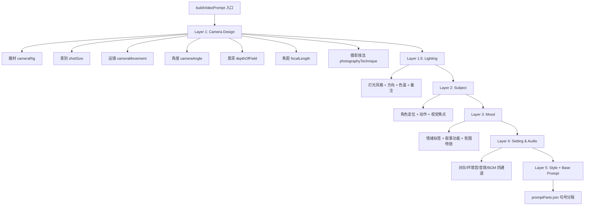
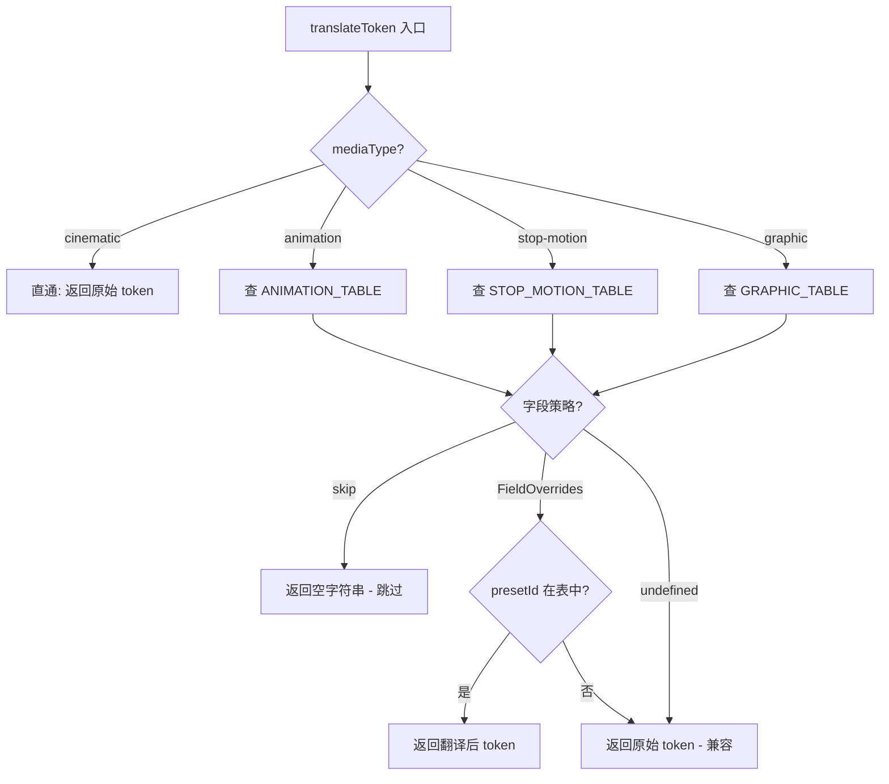
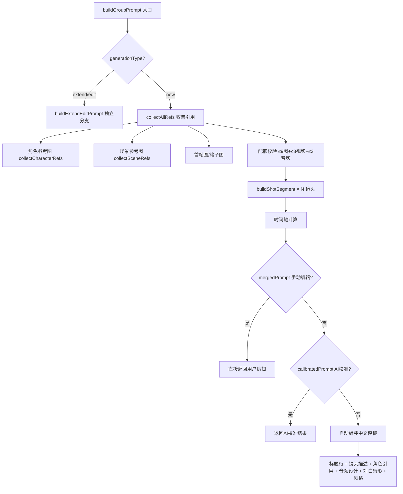

# PD-541.01 moyin-creator — 三层 Prompt 编排引擎与媒介翻译管道

> 文档编号：PD-541.01
> 来源：moyin-creator `src/lib/generation/prompt-builder.ts` `src/components/panels/sclass/sclass-prompt-builder.ts` `src/packages/ai-core/services/prompt-compiler.ts`
> GitHub：https://github.com/MemeCalculate/moyin-creator.git
> 问题域：PD-541 Prompt 编排引擎 Prompt Orchestration Engine
> 状态：可复用方案

---

## 第 1 章 问题与动机

### 1.1 核心问题

AI 视频生成的 Prompt 编排面临三重挑战：

1. **信号稀释**：将摄影参数（运镜、灯光、景深、焦距、氛围）平铺堆叠会导致模型无法区分优先级，关键指令被淹没在修饰词中。
2. **媒介不兼容**：物理摄影词汇（如 dolly track、rack focus）在动画、定格动画、平面图形等非真人拍摄媒介中无意义甚至产生负面效果。
3. **多镜头叙事的复杂度爆炸**：当一个视频包含 3-9 个镜头时，需要同时管理角色一致性（Character Bible）、场景参考图、对白唇形同步、音频设计、时间轴编排，且总 prompt 不能超过 API 限制（Seedance 2.0 的 5000 字符）。

### 1.2 moyin-creator 的解法概述

moyin-creator 实现了三层 Prompt 编排架构，每层解决不同粒度的问题：

1. **Layer 0 — PromptCompiler**（`src/packages/ai-core/services/prompt-compiler.ts:50`）：Mustache 模板引擎，处理单场景的图片/视频/剧本 prompt 编译，提供模板热更新能力。
2. **Layer 1 — buildVideoPrompt**（`src/lib/generation/prompt-builder.ts:112`）：五层语义分层构建器，将 30+ 个分镜字段按 Camera → Lighting → Subject → Mood → Setting/Audio → Style 的优先级组装为结构化 prompt，配合 `media-type-tokens.ts` 的翻译层实现跨媒介适配。
3. **Layer 2 — buildGroupPrompt**（`src/components/panels/sclass/sclass-prompt-builder.ts:579`）：组级多镜头叙事编排器，管理角色参考图收集、场景参考图收集、首帧网格图合并、对白唇形同步、音频设计、时间轴编排，支持 new/extend/edit 三种生成模式。

### 1.3 设计思想

| 设计原则 | 具体实现 | 理由 | 替代方案 |
|----------|----------|------|----------|
| 语义分层优先级 | 5 层 Layer 结构（Camera > Lighting > Subject > Mood > Style） | 避免信号稀释，让模型先理解镜头设计再处理修饰 | 平铺所有参数（信号稀释严重） |
| 媒介翻译而非媒介过滤 | `translateToken()` 将物理摄影词汇翻译为等效表达 | 保留创作意图，只改变表达方式 | 按媒介类型硬编码不同模板 |
| 摄影档案回退 | 逐镜字段为空时回退到 `CinematographyProfile` 默认值 | 减少用户配置负担，保证风格一致性 | 要求用户填写每个字段 |
| 配额感知组装 | `SEEDANCE_LIMITS` 硬编码 API 限制，组装时实时校验 | 避免 API 调用失败，提前预警 | 发送后由 API 返回错误 |
| 三模式分支 | new/extend/edit 走独立构建路径 | 延长和编辑的 prompt 结构与新建完全不同 | 用条件分支在同一函数中处理 |

---

## 第 2 章 源码实现分析

### 2.1 架构概览

```
┌─────────────────────────────────────────────────────────────────┐
│                    Layer 2: buildGroupPrompt                     │
│  (sclass-prompt-builder.ts:579)                                 │
│  多镜头叙事编排 · 角色/场景引用收集 · 唇形同步 · 配额校验        │
│                                                                  │
│  ┌──────────────┐  ┌──────────────┐  ┌──────────────────────┐   │
│  │ collectChar  │  │ collectScene │  │ mergeToGridImage     │   │
│  │ Refs :190    │  │ Refs :229    │  │ (Canvas N×N) :112    │   │
│  └──────┬───────┘  └──────┬───────┘  └──────────┬───────────┘   │
│         └────────┬─────────┘                     │               │
│                  ▼                                ▼               │
│         collectAllRefs :311 ──→ 配额校验 ──→ taggedImages/Videos │
│                  │                                               │
│                  ▼                                               │
│  ┌──────────────────────────────────────────────────────────┐   │
│  │ buildShotSegment :444 × N 镜头                           │   │
│  │ (运镜 + 景别 + 灯光 + 景深 + 氛围 + @Image引用)          │   │
│  └──────────────────────────────────────────────────────────┘   │
│                  │                                               │
│                  ▼                                               │
│  时间轴编排 + 角色引用指令 + 音频设计 + 对白唇形同步 + 风格      │
│                  │                                               │
│                  ▼                                               │
│  prompt 字符串 (≤5000 chars) + CollectedRefs + ShotSegments     │
└─────────────────────────────────────────────────────────────────┘

┌─────────────────────────────────────────────────────────────────┐
│                    Layer 1: buildVideoPrompt                     │
│  (prompt-builder.ts:112)                                        │
│  单镜头五层语义分层 + 媒介翻译                                    │
│                                                                  │
│  Layer 1:   Camera Design (rig + shot + movement + angle + DoF) │
│  Layer 1.5: Lighting (style + direction + colorTemp + notes)    │
│  Layer 2:   Subject (blocking + action + visualFocus)           │
│  Layer 3:   Mood (emotion + narrative + atmosphere)             │
│  Layer 4:   Setting & Audio (dialogue + ambient + SFX + music)  │
│  Layer 5:   Style (styleTokens)                                 │
│  Base:      User prompt + speed + continuity                    │
│                                                                  │
│  ┌──────────────────────────────────────────────────────────┐   │
│  │ translateToken (media-type-tokens.ts:185)                 │   │
│  │ cinematic→直通 | animation→虚拟摄像机 | stop-motion→微缩  │   │
│  │ graphic→跳过物理参数                                      │   │
│  └──────────────────────────────────────────────────────────┘   │
└─────────────────────────────────────────────────────────────────┘

┌─────────────────────────────────────────────────────────────────┐
│                    Layer 0: PromptCompiler                       │
│  (prompt-compiler.ts:50)                                        │
│  Mustache 模板引擎 · 单场景图片/视频/剧本编译                    │
│  compile('sceneImage', {style_tokens, character_description...})│
└─────────────────────────────────────────────────────────────────┘
```

### 2.2 核心实现

#### 2.2.1 五层语义分层构建器



对应源码 `src/lib/generation/prompt-builder.ts:112-350`：

```typescript
export function buildVideoPrompt(
  scene: SplitScene,
  cinProfile: CinematographyProfile | undefined,
  config: VideoPromptConfig = {},
): string {
  const promptParts: string[] = [];
  const mt = config.mediaType;

  // ---------- Layer 1: 镜头设计 ----------
  const cameraDesignParts: string[] = [];

  // 器材类型 — 逐镜优先，回退摄影档案
  const effectiveRig = scene.cameraRig || cinProfile?.defaultRig?.cameraRig;
  const rigToken = findPresetToken(CAMERA_RIG_PRESETS, effectiveRig, mt, 'cameraRig');
  if (rigToken) cameraDesignParts.push(rigToken);

  // ... 景别、运镜、角度、景深、焦距、技法 ...

  if (cameraDesignParts.length > 0) {
    promptParts.push(`Camera: ${cameraDesignParts.join(', ')}`);
  }

  // ---------- Layer 1.5: 灯光 ----------
  // ---------- Layer 2: 内容焦点 ----------
  // ---------- Layer 3: 氛围修饰 ----------
  // ---------- Layer 4: 场景与音频 ----------
  // ---------- Layer 5: 视觉风格 ----------

  return promptParts.join('. ');
}
```

关键设计：每个 Layer 内部用逗号分隔参数，Layer 之间用句号分隔，形成 `Camera: ..., .... Lighting: .... Subject: ...` 的结构化格式，让模型能清晰识别各维度。

#### 2.2.2 媒介翻译层



对应源码 `src/lib/generation/media-type-tokens.ts:185-208`：

```typescript
export function translateToken(
  mediaType: MediaType,
  field: CinematographyField,
  presetId: string,
  originalToken: string,
): string {
  if (mediaType === 'cinematic') return originalToken;
  const table = TRANSLATION_TABLES[mediaType];
  if (!table) return originalToken;
  const strategy = table[field];
  if (strategy === undefined) return originalToken;
  if (strategy === 'skip') return '';
  const override = strategy[presetId];
  return override !== undefined ? override : originalToken;
}
```

翻译示例：`dolly` 器材在 animation 下变为 `smooth tracking with parallax layers`，在 stop-motion 下变为 `miniature rail push-in`，在 graphic 下被完全跳过。

#### 2.2.3 组级多镜头编排器



对应源码 `src/components/panels/sclass/sclass-prompt-builder.ts:579-759`：

```typescript
export function buildGroupPrompt(options: BuildGroupPromptOptions): GroupPromptResult {
  const { group, scenes, characters, sceneLibrary, styleTokens, aspectRatio,
          enableLipSync = true, gridImageRef } = options;

  // 延长/编辑模式走独立分支
  const genType = group.generationType || 'new';
  if (genType === 'extend' || genType === 'edit') {
    return buildExtendEditPrompt(group, scenes, characters, sceneLibrary, styleTokens);
  }

  // 收集所有 @引用（格子图模式或旧版模式）
  const refs = collectAllRefs(group, scenes, characters, sceneLibrary, gridImageRef);

  // 构建各镜头片段
  const shotSegments = scenes.map((scene, idx) =>
    buildShotSegment(scene, idx + 1, refs)
  );

  // 优先级：手动编辑 > AI校准 > 自动组装
  if (group.mergedPrompt?.trim()) { /* 返回手动编辑 */ }
  if (group.calibratedPrompt && group.calibrationStatus === 'done') { /* 返回AI校准 */ }

  // 自动组装中文模板
  const promptParts: string[] = [];
  promptParts.push(`多镜头叙事视频（共${scenes.length}个镜头，总时长${totalDuration}s）：`);
  // ... 镜头描述 + 角色引用 + 场景引用 + 音频设计 + 对白唇形 + 风格 ...
  promptParts.push('全部镜头保持角色外观一致，镜头间平滑过渡，不出现文字或水印。');

  return { prompt, charCount, overCharLimit, refs, shotSegments, dialogueSegments };
}
```

### 2.3 实现细节

**摄影档案回退机制**（`prompt-builder.ts:124`）：每个摄影参数字段都遵循 `scene.field || cinProfile?.defaultField` 的回退链。`CinematographyProfile` 定义了 13 个预设档案（经典电影、黑色电影、赛博朋克、古典武侠等），每个档案包含灯光、焦点、器材、氛围、速度的完整默认值，以及 AI 指导文本和参考影片列表（`cinematography-profiles.ts:36-84`）。

**对白唇形同步**（`sclass-prompt-builder.ts:381-437`）：`extractDialogueSegments` 从分镜的 `dialogue` 字段提取对白，自动检测 `说话人：台词` 格式（支持中文冒号），计算时间偏移量，生成 `[约Xs处] 角色名：「台词」— 口型同步，自然口部动作` 格式的唇形指令。

**网格图合并**（`sclass-prompt-builder.ts:95-182`）：`mergeToGridImage` 使用 Canvas API 将多张首帧图片合并为 N×N 网格图（1-4张→2×2，5-9张→3×3），每格按目标画幅比居中裁剪（cover 模式），空格子填充灰色。这将多张参考图压缩为 1 个 @Image 槽位，为角色参考图腾出配额。

**Prompt 优先级三级覆盖**（`sclass-prompt-builder.ts:610-633`）：`mergedPrompt`（用户手动编辑）> `calibratedPrompt`（AI 校准结果，需 `calibrationStatus === 'done'`）> 自动组装。这允许用户在任何阶段介入修改，同时保留 AI 校准的中间结果。


---

## 第 3 章 迁移指南

### 3.1 迁移清单

**阶段 1：语义分层构建器（1 个文件）**

- [ ] 定义 Layer 枚举和优先级顺序
- [ ] 实现 `buildVideoPrompt(scene, profile, config)` 函数
- [ ] 每个 Layer 内部用逗号分隔，Layer 之间用句号分隔
- [ ] 实现摄影档案回退：`scene.field || profile?.defaultField`

**阶段 2：媒介翻译层（1 个文件）**

- [ ] 定义 `CinematographyField` 类型和 `MediaType` 类型
- [ ] 为每种非 cinematic 媒介编写翻译表（支持 `skip` 整体跳过）
- [ ] 实现 `translateToken(mediaType, field, presetId, originalToken)` 函数
- [ ] 在 Layer 1 构建器中集成翻译调用

**阶段 3：组级编排器（1 个文件）**

- [ ] 定义 API 限制常量（图片/视频/音频数量、prompt 字符数）
- [ ] 实现引用收集器（角色、场景、首帧）+ 配额校验
- [ ] 实现多镜头 prompt 组装（时间轴 + 引用指令 + 唇形同步）
- [ ] 实现 extend/edit 模式的独立构建路径

### 3.2 适配代码模板

以下是一个可直接运行的语义分层 Prompt 构建器模板（TypeScript）：

```typescript
// prompt-builder.ts — 语义分层 Prompt 构建器

interface SceneData {
  cameraRig?: string;
  shotSize?: string;
  cameraMovement?: string;
  lightingStyle?: string;
  lightingDirection?: string;
  colorTemperature?: string;
  actionSummary?: string;
  emotionTags?: string[];
  dialogue?: string;
  ambientSound?: string;
  soundEffects?: string;
}

interface ProfileDefaults {
  cameraRig?: string;
  lightingStyle?: string;
  lightingDirection?: string;
  colorTemperature?: string;
  depthOfField?: string;
}

type MediaType = 'cinematic' | 'animation' | 'stop-motion' | 'graphic';

// 媒介翻译表（简化版）
const MEDIA_TRANSLATIONS: Record<string, Record<string, Record<string, string> | 'skip'>> = {
  graphic: {
    cameraRig: 'skip',
    depthOfField: 'skip',
    lightingStyle: {
      'high-key': 'bright palette, open composition',
      'low-key': 'dark tones, heavy contrast',
    },
  },
  animation: {
    cameraRig: {
      dolly: 'smooth tracking with parallax layers',
      handheld: 'slight camera wobble, animated shake',
    },
  },
};

function translateToken(
  mediaType: MediaType, field: string, presetId: string, original: string
): string {
  if (mediaType === 'cinematic') return original;
  const table = MEDIA_TRANSLATIONS[mediaType];
  if (!table) return original;
  const strategy = table[field];
  if (!strategy) return original;
  if (strategy === 'skip') return '';
  return strategy[presetId] ?? original;
}

export function buildPrompt(
  scene: SceneData,
  profile: ProfileDefaults | undefined,
  mediaType: MediaType = 'cinematic',
  styleTokens: string[] = [],
): string {
  const parts: string[] = [];

  // Layer 1: Camera
  const cameraParts: string[] = [];
  const rig = scene.cameraRig || profile?.cameraRig;
  if (rig) {
    const token = translateToken(mediaType, 'cameraRig', rig, rig);
    if (token) cameraParts.push(token);
  }
  if (scene.shotSize) cameraParts.push(scene.shotSize);
  if (scene.cameraMovement) cameraParts.push(scene.cameraMovement);
  if (cameraParts.length > 0) parts.push(`Camera: ${cameraParts.join(', ')}`);

  // Layer 1.5: Lighting
  const lightParts: string[] = [];
  const ls = scene.lightingStyle || profile?.lightingStyle;
  if (ls) {
    const token = translateToken(mediaType, 'lightingStyle', ls, ls);
    if (token) lightParts.push(token);
  }
  if (lightParts.length > 0) parts.push(`Lighting: ${lightParts.join(' ')}`);

  // Layer 2: Subject
  if (scene.actionSummary) parts.push(`Subject: ${scene.actionSummary}`);

  // Layer 3: Mood
  if (scene.emotionTags?.length) parts.push(`Mood: ${scene.emotionTags.join(' → ')}`);

  // Layer 4: Audio
  if (scene.dialogue) parts.push(`Dialogue: "${scene.dialogue}"`);
  if (scene.ambientSound) parts.push(`Ambient: ${scene.ambientSound}`);

  // Layer 5: Style
  if (styleTokens.length > 0) parts.push(`Style: ${styleTokens.join(', ')}`);

  return parts.join('. ');
}
```

### 3.3 适用场景

| 场景 | 适用度 | 说明 |
|------|--------|------|
| AI 视频生成（多镜头叙事） | ⭐⭐⭐ | 完全匹配，直接复用三层架构 |
| AI 图片生成（单场景） | ⭐⭐⭐ | 复用 Layer 0 + Layer 1 即可 |
| 多模态 AI 内容创作 | ⭐⭐ | 引用收集和配额校验机制可复用 |
| 纯文本 LLM Prompt 工程 | ⭐ | 语义分层思想可借鉴，但不需要媒介翻译 |

---

## 第 4 章 测试用例

```typescript
import { describe, it, expect } from 'vitest';

// ===== Layer 1: 媒介翻译 =====

describe('translateToken', () => {
  it('cinematic 直通原始 token', () => {
    const result = translateToken('cinematic', 'cameraRig', 'dolly', 'dolly tracking shot');
    expect(result).toBe('dolly tracking shot');
  });

  it('animation 翻译 dolly 为虚拟摄像机语义', () => {
    const result = translateToken('animation', 'cameraRig', 'dolly', 'dolly tracking shot');
    expect(result).toBe('smooth tracking with parallax layers,');
  });

  it('graphic 跳过物理摄影参数', () => {
    const result = translateToken('graphic', 'cameraRig', 'dolly', 'dolly tracking shot');
    expect(result).toBe('');
  });

  it('未知 presetId 回退原始 token', () => {
    const result = translateToken('animation', 'cameraRig', 'unknown_rig', 'original');
    expect(result).toBe('original');
  });
});

// ===== Layer 1: 语义分层构建 =====

describe('buildVideoPrompt', () => {
  it('按 Layer 优先级组装 prompt', () => {
    const scene = {
      cameraRig: 'dolly', shotSize: 'medium-shot',
      lightingStyle: 'natural', actionSummary: 'character walks forward',
      emotionTags: ['tense'], dialogue: '你好',
    };
    const result = buildVideoPrompt(scene as any, undefined, {});
    expect(result).toContain('Camera:');
    expect(result).toContain('Lighting:');
    expect(result).toContain('Subject:');
    expect(result).toContain('Dialogue:');
    // Camera 在 Lighting 之前
    expect(result.indexOf('Camera:')).toBeLessThan(result.indexOf('Lighting:'));
  });

  it('摄影档案回退：场景字段为空时使用档案默认值', () => {
    const scene = { cameraRig: undefined } as any;
    const profile = { defaultRig: { cameraRig: 'steadicam', movementSpeed: 'slow' } } as any;
    const result = buildVideoPrompt(scene, profile, {});
    expect(result).toContain('steadicam');
  });
});

// ===== Layer 2: 组级编排 =====

describe('collectAllRefs', () => {
  it('格子图模式：格子图占 1 槽，剩余给角色引用', () => {
    const gridRef = { id: 'grid_image', type: 'image', tag: '@图片1' } as any;
    const group = { videoRefs: [], audioRefs: [] } as any;
    const scenes = [{ characterIds: ['c1', 'c2'] }] as any;
    const characters = [
      { id: 'c1', name: 'A', views: [{ imageBase64: 'data:...' }] },
      { id: 'c2', name: 'B', views: [{ imageBase64: 'data:...' }] },
    ] as any;
    const result = collectAllRefs(group, scenes, characters, [], gridRef);
    expect(result.images[0].id).toBe('grid_image');
    expect(result.images.length).toBeLessThanOrEqual(9);
  });

  it('配额超限时生成警告', () => {
    const group = { videoRefs: Array(4).fill({}), audioRefs: Array(4).fill({}) } as any;
    const result = collectAllRefs(group, [], [], [], null);
    expect(result.overLimit).toBe(true);
    expect(result.limitWarnings.length).toBeGreaterThan(0);
  });
});

describe('extractDialogueSegments', () => {
  it('自动检测说话人格式', () => {
    const scenes = [
      { id: 0, duration: 5, dialogue: '村民：妹子你好啊', characterIds: [] },
    ] as any;
    const result = extractDialogueSegments(scenes, []);
    expect(result[0].characterName).toBe('村民');
    expect(result[0].text).toBe('妹子你好啊');
  });

  it('无说话人格式时回退到 characterIds', () => {
    const scenes = [
      { id: 0, duration: 5, dialogue: '你好世界', characterIds: ['c1'] },
    ] as any;
    const characters = [{ id: 'c1', name: '小明' }] as any;
    const result = extractDialogueSegments(scenes, characters);
    expect(result[0].characterName).toBe('小明');
  });
});
```


---

## 第 5 章 跨域关联

| 关联域 | 关系类型 | 说明 |
|--------|----------|------|
| PD-01 上下文管理 | 协同 | Prompt 字符数限制（5000 chars）本质是上下文窗口管理；网格图合并是一种视觉上下文压缩策略 |
| PD-04 工具系统 | 协同 | PromptCompiler 的模板热更新（`updateTemplates`）可作为工具系统的配置化扩展点 |
| PD-07 质量检查 | 依赖 | 5 阶段分镜校准（`shot-calibration-stages.ts`）是 Prompt 编排的上游质量保证，校准结果直接影响 prompt 质量 |
| PD-10 中间件管道 | 协同 | 五层语义分层本质是一个 Prompt 构建管道，每层可独立测试和替换 |
| PD-513 角色一致性 | 依赖 | 角色参考图收集（`collectCharacterRefs`）和角色引用指令是角色一致性的 Prompt 层实现 |

---

## 第 6 章 来源文件索引

| 文件 | 行范围 | 关键实现 |
|------|--------|----------|
| `src/lib/generation/prompt-builder.ts` | L1-L350 | 五层语义分层构建器 `buildVideoPrompt`，摄影档案回退机制 |
| `src/lib/generation/media-type-tokens.ts` | L1-L234 | 媒介翻译层 `translateToken`，4 种媒介的翻译表 |
| `src/lib/constants/cinematography-profiles.ts` | L1-L467 | 13 个摄影风格档案预设，`buildCinematographyGuidance` AI 指导文本生成 |
| `src/components/panels/sclass/sclass-prompt-builder.ts` | L1-L890 | 组级多镜头编排器 `buildGroupPrompt`，引用收集，配额校验，唇形同步，网格图合并 |
| `src/packages/ai-core/services/prompt-compiler.ts` | L1-L164 | Mustache 模板引擎 `PromptCompiler`，单场景编译 |
| `src/components/panels/sclass/use-sclass-generation.ts` | L1-L738 | 生成 Hook，调用 `buildGroupPrompt` 并管理格子图缓存和 API 调用 |
| `src/lib/script/shot-calibration-stages.ts` | L1-L80 | 5 阶段分镜校准，注入摄影档案指导到 AI system prompt |

---

## 第 7 章 横向对比维度

```json comparison_data
{
  "project": "moyin-creator",
  "dimensions": {
    "编排架构": "三层分离：Mustache模板编译 → 五层语义分层 → 组级多镜头叙事",
    "媒介适配": "translateToken 翻译层，4种媒介（cinematic/animation/stop-motion/graphic）独立翻译表",
    "参考资料管理": "角色/场景/首帧三源收集 + N×N网格图压缩 + Seedance配额校验（≤9图+≤3视频+≤3音频）",
    "模式支持": "new/extend/edit 三模式独立构建路径，extend支持前后向延长",
    "优先级覆盖": "手动编辑 > AI校准 > 自动组装 三级prompt覆盖机制",
    "风格档案": "13个CinematographyProfile预设，逐镜字段为空时回退档案默认值"
  }
}
```

### 域元数据补充

```json domain_metadata
{
  "solution_summary": "moyin-creator 用三层架构（Mustache模板→五层语义分层→组级多镜头编排）+ 媒介翻译表实现跨4种媒介的Prompt编排，支持角色/场景引用收集、N×N网格图压缩、对白唇形同步和new/extend/edit三模式",
  "description": "Prompt编排需要解决信号稀释、媒介不兼容和多模态引用配额管理问题",
  "sub_problems": [
    "跨媒介摄影词汇翻译（物理摄影→虚拟摄像机/微缩/图形）",
    "多模态引用配额管理（图片/视频/音频数量限制）",
    "Prompt优先级覆盖链（手动编辑>AI校准>自动组装）",
    "对白唇形同步指令生成与时间轴对齐"
  ],
  "best_practices": [
    "语义分层避免信号稀释：Layer间句号分隔，Layer内逗号分隔",
    "摄影档案回退链减少用户配置负担",
    "网格图压缩多张参考图为单槽位节省API配额"
  ]
}
```
