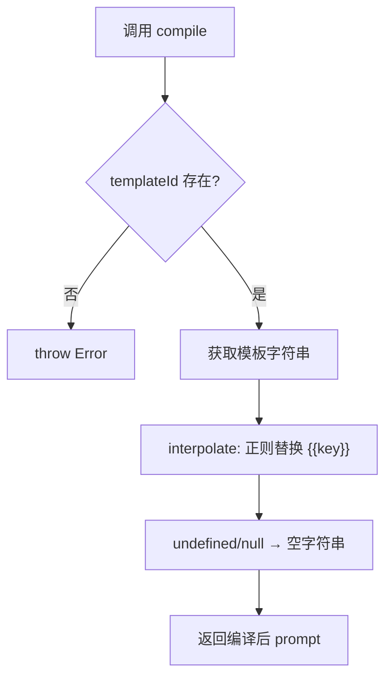
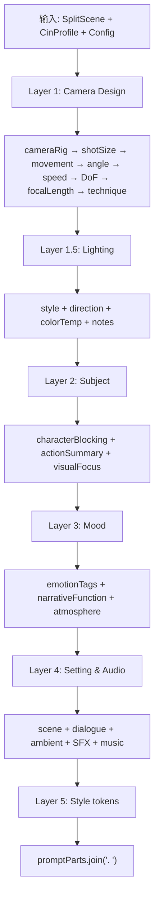
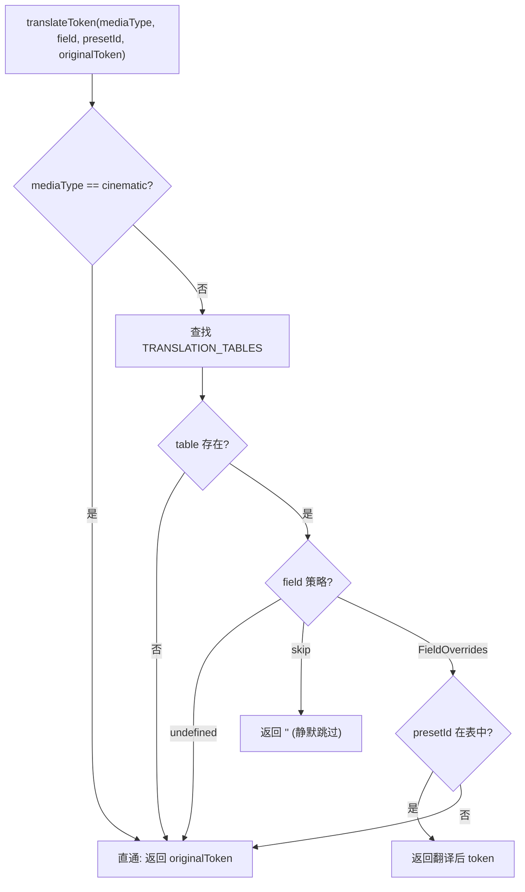
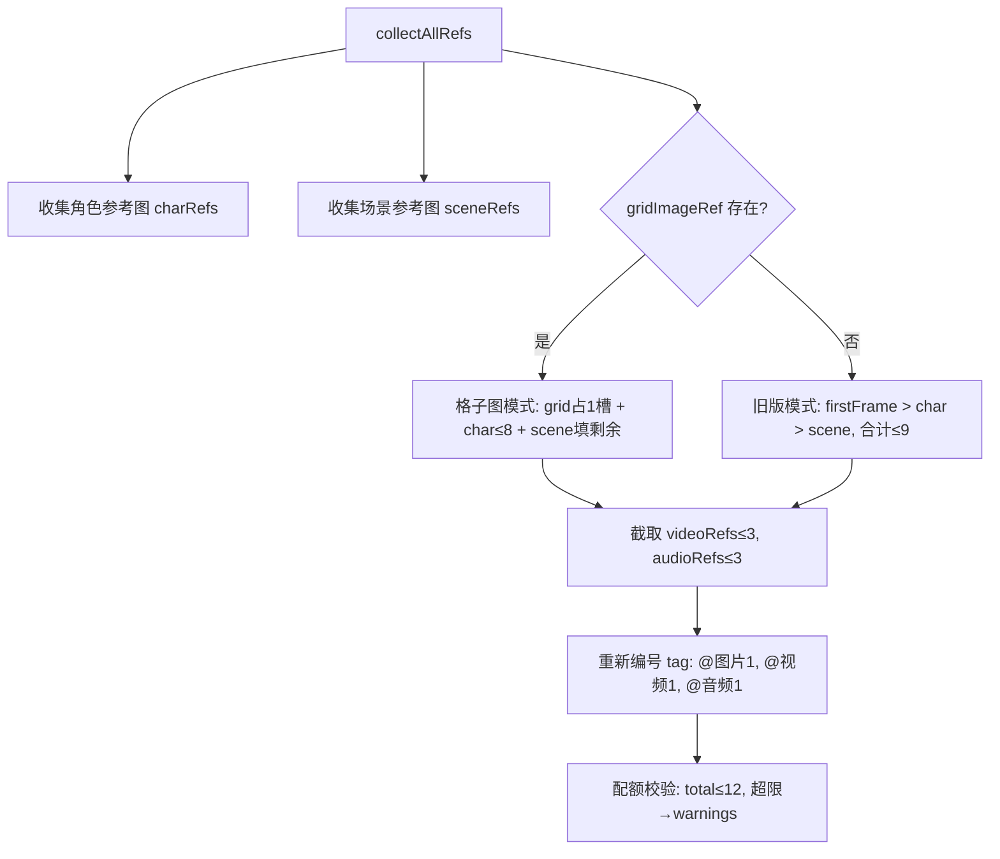

# PD-542.01 moyin-creator — 四层提示词编译与媒介翻译管道

> 文档编号：PD-542.01
> 来源：moyin-creator `src/packages/ai-core/services/prompt-compiler.ts` `src/lib/generation/prompt-builder.ts` `src/components/panels/sclass/sclass-prompt-builder.ts` `src/lib/generation/media-type-tokens.ts`
> GitHub：https://github.com/MemeCalculate/moyin-creator.git
> 问题域：PD-542 提示词工程系统 Prompt Engineering System
> 状态：可复用方案

---

## 第 1 章 问题与动机（≥ 30 行）

### 1.1 核心问题

视频生成 AI（如 Seedance 2.0）对提示词质量极度敏感。一个分镜卡片上可能有 30+ 字段（景别、运镜、灯光、景深、焦距、情绪、对白、音效……），如果简单拼接所有字段，会导致：

1. **信号稀释** — 关键摄影指令被大量修饰词淹没，模型无法抓住重点
2. **媒介不匹配** — 物理摄影词汇（dolly、rack focus）对动画/像素风格毫无意义，反而干扰生成
3. **配额浪费** — Seedance 2.0 有严格的 5000 字符 + 9 图 + 3 视频 + 3 音频限制，超限直接报错
4. **多模态引用混乱** — 角色参考图、场景图、首帧图、用户上传视频/音频需要按优先级编号，手动管理极易出错

### 1.2 moyin-creator 的解法概述

moyin-creator 构建了四层提示词编译体系，每层职责清晰：

1. **PromptCompiler（模板引擎层）** — Mustache 风格 `{{var}}` 模板插值，支持运行时更新模板，提供 sceneImage / sceneVideo / screenplay / negative 四种模板（`prompt-compiler.ts:50-163`）
2. **buildVideoPrompt（5 层语义组装层）** — 将 30+ 字段按 Camera → Lighting → Subject → Mood → Style 五层优先级组装，每层用语义前缀标记（`prompt-builder.ts:112-350`）
3. **translateToken（媒介翻译层）** — 根据 MediaType（cinematic/animation/stop-motion/graphic）将物理摄影 token 翻译为等效表达或静默跳过（`media-type-tokens.ts:185-208`）
4. **buildGroupPrompt（组级编排层）** — 多镜头叙事组装 + @引用收集 + Seedance 配额校验 + 唇形同步指令（`sclass-prompt-builder.ts:579-759`）

### 1.3 设计思想

| 设计原则 | 具体实现 | 理由 | 替代方案 |
|----------|----------|------|----------|
| 分层优先级 | Camera > Lighting > Subject > Mood > Style 五层 | 摄影指令对视频生成影响最大，必须排在最前 | 平铺拼接（信号稀释严重） |
| 媒介感知翻译 | 4 种 MediaType 各有独立翻译表，graphic 直接 skip 物理参数 | 动画不需要 dolly 轨道，像素画不需要景深 | 统一词汇（生成质量下降） |
| 配额前置校验 | collectAllRefs 在组装前就执行 9+3+3+12 限制检查 | 避免 prompt 组装完毕后才发现超限，浪费计算 | 后置校验（API 报错才知道） |
| 模板可热更新 | PromptCompiler.updateTemplates() 运行时替换 | 不同 AI 模型可能需要不同模板格式 | 硬编码模板（改模板要改代码） |
| 摄影档案回退 | 逐镜字段为空时回退到 CinematographyProfile 默认值 | 用户只需选一个摄影风格，30+ 字段自动填充 | 每个字段都要手动设置 |

---

## 第 2 章 源码实现分析（≥ 60 行，核心章节）

### 2.1 架构概览

```
┌─────────────────────────────────────────────────────────────────┐
│                    moyin-creator Prompt Pipeline                 │
├─────────────────────────────────────────────────────────────────┤
│                                                                 │
│  Layer 0: PromptCompiler (Mustache 模板引擎)                     │
│  ┌──────────────────────────────────────────┐                   │
│  │ {{style_tokens}}, {{character}}, {{camera}} │                │
│  │ compile() → interpolate() → 字符串输出     │                │
│  └──────────────────────────────────────────┘                   │
│                          ↓                                      │
│  Layer 1: buildVideoPrompt (5 层语义组装)                        │
│  ┌──────────────────────────────────────────┐                   │
│  │ Camera → Lighting → Subject → Mood → Style │                │
│  │ + CinematographyProfile 回退              │                  │
│  │ + translateToken() 媒介翻译               │                  │
│  └──────────────────────────────────────────┘                   │
│                          ↓                                      │
│  Layer 2: buildGroupPrompt (组级多镜头编排)                       │
│  ┌──────────────────────────────────────────┐                   │
│  │ collectAllRefs() → 配额校验               │                  │
│  │ buildShotSegment() × N → 时间轴拼接       │                  │
│  │ extractDialogueSegments() → 唇形同步      │                  │
│  │ styleTokens + aspectRatio → 尾部约束       │                  │
│  └──────────────────────────────────────────┘                   │
│                          ↓                                      │
│  Output: GroupPromptResult                                      │
│  { prompt, charCount, overCharLimit, refs, shotSegments }       │
└─────────────────────────────────────────────────────────────────┘
```

### 2.2 核心实现

#### 2.2.1 PromptCompiler — Mustache 模板引擎



对应源码 `src/packages/ai-core/services/prompt-compiler.ts:50-82`：

```typescript
export class PromptCompiler {
  private templates: PromptTemplateConfig;

  constructor(customTemplates?: Partial<PromptTemplateConfig>) {
    this.templates = { ...DEFAULT_TEMPLATES, ...customTemplates };
  }

  compile(templateId: keyof PromptTemplateConfig,
          variables: Record<string, string | number | undefined>): string {
    const template = this.templates[templateId];
    if (!template) throw new Error(`Template "${templateId}" not found`);
    return this.interpolate(template, variables);
  }

  private interpolate(template: string,
                      variables: Record<string, string | number | undefined>): string {
    return template.replace(/\{\{(\w+)\}\}/g, (match, key) => {
      const value = variables[key];
      return (value === undefined || value === null) ? '' : String(value);
    });
  }

  updateTemplates(updates: Partial<PromptTemplateConfig>): void {
    this.templates = { ...this.templates, ...updates };
  }
}

export const promptCompiler = new PromptCompiler(); // 单例
```

关键设计：模板引擎极简（20 行核心逻辑），不引入 Handlebars 等重依赖。`updateTemplates()` 支持运行时热更新，适配不同 AI 后端。

#### 2.2.2 buildVideoPrompt — 5 层语义组装



对应源码 `src/lib/generation/prompt-builder.ts:112-350`：

```typescript
export function buildVideoPrompt(
  scene: SplitScene,
  cinProfile: CinematographyProfile | undefined,
  config: VideoPromptConfig = {},
): string {
  const promptParts: string[] = [];
  const mt = config.mediaType;

  // Layer 1: Camera Design — 最高优先级
  const cameraDesignParts: string[] = [];
  const effectiveRig = scene.cameraRig || cinProfile?.defaultRig?.cameraRig;
  const rigToken = findPresetToken(CAMERA_RIG_PRESETS, effectiveRig, mt, 'cameraRig');
  if (rigToken) cameraDesignParts.push(rigToken);
  // ... shotSize, cameraMovement, angle, speed, DoF, focalLength, technique
  if (cameraDesignParts.length > 0) {
    promptParts.push(`Camera: ${cameraDesignParts.join(', ')}`);
  }

  // Layer 1.5: Lighting
  // Layer 2: Subject
  // Layer 3: Mood
  // Layer 4: Setting & Audio (含对白禁止/允许控制)
  // Layer 5: Style tokens

  return promptParts.join('. ');
}
```

每个字段都遵循「逐镜优先 → 摄影档案回退」模式（`prompt-builder.ts:124`）：
```typescript
const effectiveRig = scene.cameraRig || cinProfile?.defaultRig?.cameraRig;
```


#### 2.2.3 translateToken — 媒介类型翻译



对应源码 `src/lib/generation/media-type-tokens.ts:185-208`：

```typescript
export function translateToken(
  mediaType: MediaType,
  field: CinematographyField,
  presetId: string,
  originalToken: string,
): string {
  if (mediaType === 'cinematic') return originalToken;  // 直通
  const table = TRANSLATION_TABLES[mediaType];
  if (!table) return originalToken;
  const strategy = table[field];
  if (strategy === undefined) return originalToken;     // 无特殊处理
  if (strategy === 'skip') return '';                    // 整体跳过
  const override = strategy[presetId];
  return override !== undefined ? override : originalToken; // 查表替换
}
```

四种媒介的翻译策略差异（`media-type-tokens.ts:57-172`）：

| 媒介 | cameraRig | depthOfField | lightingStyle | 物理参数 |
|------|-----------|-------------|---------------|----------|
| cinematic | 直通 | 直通 | 直通 | 全部保留 |
| animation | dolly→parallax layers | shallow→layer blur | 直通 | 虚拟摄像机适配 |
| stop-motion | dolly→miniature rail | shallow→macro lens | 直通 | 微缩实拍约束 |
| graphic | **skip** | **skip** | 转译为色彩/情绪 | **全部跳过** |

#### 2.2.4 collectAllRefs — 多模态引用收集与配额校验



对应源码 `src/components/panels/sclass/sclass-prompt-builder.ts:311-374`：

```typescript
export function collectAllRefs(
  group: ShotGroup, scenes: SplitScene[],
  characters: Character[], sceneLibrary: Scene[],
  gridImageRef?: AssetRef | null,
): CollectedRefs {
  const allCharIds = Array.from(new Set(scenes.flatMap(s => s.characterIds || [])));
  const charRefs = collectCharacterRefs(allCharIds, characters);
  const sceneRefs = collectSceneRefs(scenes, sceneLibrary);

  let images: AssetRef[];
  if (gridImageRef) {
    // 格子图模式：grid 占 1 槽，剩余给角色+场景
    const remainingSlots = SEEDANCE_LIMITS.maxImages - 1;
    const charSlice = charRefs.slice(0, remainingSlots);
    images = [gridImageRef, ...charSlice];
    const usedSlots = images.length;
    if (usedSlots < SEEDANCE_LIMITS.maxImages) {
      images.push(...sceneRefs.slice(0, SEEDANCE_LIMITS.maxImages - usedSlots));
    }
  } else {
    const frameRefs = collectFirstFrameRefs(scenes);
    images = [...frameRefs, ...charRefs, ...sceneRefs].slice(0, SEEDANCE_LIMITS.maxImages);
  }

  // 重新编号 + 配额校验
  const taggedImages = images.map((ref, i) => ({ ...ref, tag: `@图片${i + 1}` }));
  const totalFiles = taggedImages.length + taggedVideos.length + taggedAudios.length;
  return { images: taggedImages, videos: taggedVideos, audios: taggedAudios,
           totalFiles, overLimit: totalFiles > SEEDANCE_LIMITS.maxTotalFiles, limitWarnings };
}
```

Seedance 2.0 硬限制常量（`sclass-prompt-builder.ts:80-88`）：
```typescript
export const SEEDANCE_LIMITS = {
  maxImages: 9, maxVideos: 3, maxAudios: 3,
  maxTotalFiles: 12, maxPromptChars: 5000,
  maxDuration: 15, minDuration: 4,
} as const;
```

### 2.3 实现细节

**摄影档案回退机制**：`CinematographyProfile` 定义了项目级摄影基准（灯光、焦点、器材、氛围、速度），`buildVideoPrompt` 中每个字段都用 `scene.field || cinProfile?.defaultXxx` 模式回退（`prompt-builder.ts:124,149,156,168,183,189,210,214,218`）。这意味着用户只需选择一个摄影风格（如"黑色电影"），30+ 字段就有了合理默认值。

**5 阶段校准集成**：`shot-calibration-stages.ts` 将 30+ 字段拆分为 5 个独立 AI 调用（叙事骨架 → 视觉描述 → 拍摄控制 → 首帧提示词 → 动态提示词），每个阶段的 system prompt 都注入了 `getMediaTypeGuidance(mt)` 媒介约束（`shot-calibration-stages.ts:88-90`），确保 AI 校准结果与媒介类型一致。

**优先级链**：`buildGroupPrompt` 中 prompt 来源有三级优先级（`sclass-prompt-builder.ts:610-633`）：
1. 用户手动编辑的 `mergedPrompt`（最高）
2. AI 校准后的 `calibratedPrompt`（calibrationStatus === 'done'）
3. 自动组装（最低）

---

## 第 3 章 迁移指南（≥ 40 行）

### 3.1 迁移清单

**阶段 1：模板引擎（1 个文件）**
- [ ] 移植 `PromptCompiler` 类（~60 行），零外部依赖
- [ ] 定义项目专属的 `PromptTemplateConfig`（按业务场景定义模板 ID）
- [ ] 创建单例 `promptCompiler` 实例

**阶段 2：语义分层组装（2 个文件）**
- [ ] 定义项目的语义层次（不一定是 Camera/Lighting/Subject/Mood/Style，按业务调整）
- [ ] 实现 `findPresetToken()` 预设查找 + 翻译桥接函数
- [ ] 实现 `buildXxxPrompt()` 主组装函数，遵循「层内拼接 → 层间句号分隔」模式

**阶段 3：媒介翻译（1 个文件）**
- [ ] 定义项目的 `MediaType` 枚举
- [ ] 为每种非默认媒介编写翻译表（`FieldOverrides | 'skip'`）
- [ ] 实现 `translateToken()` 核心函数（~25 行）

**阶段 4：多模态引用管理（按需）**
- [ ] 定义 `AssetRef` 引用类型和 API 配额常量
- [ ] 实现 `collectAllRefs()` 收集 + 编号 + 校验逻辑
- [ ] 实现优先级策略（格子图模式 vs 逐张模式）

### 3.2 适配代码模板

以下是一个可直接运行的精简版分层 prompt builder：

```typescript
// === 媒介翻译层 ===
type MediaType = 'realistic' | 'cartoon' | 'abstract';
type FieldStrategy = Record<string, string> | 'skip';

const TRANSLATION_TABLES: Record<MediaType, Partial<Record<string, FieldStrategy>>> = {
  realistic: {},  // 直通
  cartoon: {
    cameraRig: { dolly: 'smooth virtual tracking,', crane: 'sweeping arc,' },
    depthOfField: 'skip',  // 卡通不需要景深
  },
  abstract: {
    cameraRig: 'skip',
    depthOfField: 'skip',
    lightingDirection: 'skip',
  },
};

function translateToken(
  mediaType: MediaType, field: string, presetId: string, original: string
): string {
  if (mediaType === 'realistic') return original;
  const table = TRANSLATION_TABLES[mediaType];
  const strategy = table?.[field];
  if (!strategy) return original;
  if (strategy === 'skip') return '';
  return strategy[presetId] ?? original;
}

// === 分层组装 ===
interface PromptLayer { prefix: string; tokens: string[] }

function buildLayeredPrompt(layers: PromptLayer[]): string {
  return layers
    .filter(l => l.tokens.length > 0)
    .map(l => `${l.prefix}: ${l.tokens.join(', ')}`)
    .join('. ');
}

// 使用示例
const prompt = buildLayeredPrompt([
  { prefix: 'Camera', tokens: ['dolly push-in', 'shallow DOF'] },
  { prefix: 'Lighting', tokens: ['natural side light', 'warm'] },
  { prefix: 'Subject', tokens: ['character walks toward camera'] },
  { prefix: 'Style', tokens: ['cinematic', 'film grain'] },
]);
// → "Camera: dolly push-in, shallow DOF. Lighting: natural side light, warm. Subject: ..."
```

### 3.3 适用场景

| 场景 | 适用度 | 说明 |
|------|--------|------|
| 视频生成 prompt 工程 | ⭐⭐⭐ | 完美匹配，直接复用 5 层架构 |
| 图片生成 prompt 工程 | ⭐⭐⭐ | 去掉 Layer 4 音频层即可 |
| 多风格 AI 绘画平台 | ⭐⭐⭐ | 媒介翻译层价值最大 |
| 纯文本 LLM prompt | ⭐⭐ | 分层思想可用，但不需要媒介翻译 |
| 简单单模态生成 | ⭐ | 过度设计，直接拼接即可 |

---

## 第 4 章 测试用例（≥ 20 行）

```typescript
import { describe, it, expect } from 'vitest';

// === PromptCompiler 测试 ===
describe('PromptCompiler', () => {
  it('should interpolate Mustache variables', () => {
    const compiler = new PromptCompiler();
    const result = compiler.compile('sceneImage', {
      style_tokens: 'cinematic, film grain',
      character_description: 'a young woman',
      visual_content: 'walking in rain',
      camera: 'medium shot',
      quality_tokens: '8k, detailed',
    });
    expect(result).toContain('cinematic, film grain');
    expect(result).toContain('a young woman');
    expect(result).not.toContain('{{');
  });

  it('should replace undefined variables with empty string', () => {
    const compiler = new PromptCompiler();
    const result = compiler.compile('sceneImage', {
      style_tokens: 'cinematic',
      character_description: undefined,
      visual_content: 'scene',
      camera: 'wide',
      quality_tokens: '4k',
    });
    expect(result).not.toContain('undefined');
    expect(result).toContain('cinematic');
  });

  it('should support runtime template update', () => {
    const compiler = new PromptCompiler();
    compiler.updateTemplates({ sceneImage: '{{style_tokens}} ONLY' });
    const result = compiler.compile('sceneImage', { style_tokens: 'anime' });
    expect(result).toBe('anime ONLY');
  });
});

// === translateToken 测试 ===
describe('translateToken', () => {
  it('should pass through for cinematic', () => {
    const result = translateToken('cinematic', 'cameraRig', 'dolly', 'smooth dolly push,');
    expect(result).toBe('smooth dolly push,');
  });

  it('should translate for animation', () => {
    const result = translateToken('animation', 'cameraRig', 'dolly', 'smooth dolly push,');
    expect(result).toBe('smooth tracking with parallax layers,');
  });

  it('should skip for graphic media type', () => {
    const result = translateToken('graphic', 'cameraRig', 'dolly', 'smooth dolly push,');
    expect(result).toBe('');
  });

  it('should fallback to original for unknown preset', () => {
    const result = translateToken('animation', 'cameraRig', 'unknown-rig', 'custom rig,');
    expect(result).toBe('custom rig,');
  });
});

// === collectAllRefs 配额校验测试 ===
describe('collectAllRefs quota', () => {
  it('should enforce maxImages=9 limit', () => {
    // 构造 15 张首帧图的场景
    const scenes = Array.from({ length: 15 }, (_, i) => ({
      id: i, imageDataUrl: `data:image/png;base64,${i}`,
      characterIds: [], sceneReferenceImage: null, sceneLibraryId: null,
    }));
    const refs = collectAllRefs(
      { videoRefs: [], audioRefs: [] } as any,
      scenes as any, [], [],
    );
    expect(refs.images.length).toBeLessThanOrEqual(9);
    expect(refs.images[0].tag).toBe('@图片1');
  });

  it('should detect overLimit when total > 12', () => {
    const refs: CollectedRefs = {
      images: Array(9).fill({}) as any,
      videos: Array(3).fill({}) as any,
      audios: Array(3).fill({}) as any,
      totalFiles: 15,
      overLimit: true,
      limitWarnings: ['总文件数 15 超出限制 12'],
    };
    expect(refs.overLimit).toBe(true);
  });
});
```


---

## 第 5 章 跨域关联

| 关联域 | 关系类型 | 说明 |
|--------|----------|------|
| PD-01 上下文管理 | 协同 | 5 阶段校准将 30+ 字段拆分为 5 次 AI 调用，避免单次 token 耗尽；prompt 字符数限制（5000）也是上下文管理的一种 |
| PD-04 工具系统 | 协同 | PromptCompiler 作为工具被 shot-calibration-stages 和 sclass-prompt-builder 调用，是工具链的一环 |
| PD-07 质量检查 | 依赖 | buildGroupPrompt 的 overCharLimit / overLimit 校验是质量门控的前置检查 |
| PD-10 中间件管道 | 协同 | 四层编译体系本身就是一个管道：模板 → 语义组装 → 媒介翻译 → 组级编排，每层可独立替换 |
| PD-11 可观测性 | 协同 | GroupPromptResult 返回 charCount / shotSegments / limitWarnings，为 UI 预览和调试提供可观测数据 |

---

## 第 6 章 来源文件索引

| 文件 | 行范围 | 关键实现 |
|------|--------|----------|
| `src/packages/ai-core/services/prompt-compiler.ts` | L50-L163 | PromptCompiler 类：Mustache 模板引擎 + 运行时更新 |
| `src/lib/generation/prompt-builder.ts` | L78-L89 | findPresetToken()：预设查找 + 媒介翻译桥接 |
| `src/lib/generation/prompt-builder.ts` | L112-L350 | buildVideoPrompt()：5 层语义组装核心函数 |
| `src/lib/generation/media-type-tokens.ts` | L21-L35 | CinematographyField 类型定义 |
| `src/lib/generation/media-type-tokens.ts` | L57-L172 | 三种非 cinematic 媒介的翻译表 |
| `src/lib/generation/media-type-tokens.ts` | L185-L208 | translateToken() 核心翻译函数 |
| `src/lib/generation/media-type-tokens.ts` | L222-L233 | getMediaTypeGuidance()：AI 校准用媒介指导 |
| `src/components/panels/sclass/sclass-prompt-builder.ts` | L80-L88 | SEEDANCE_LIMITS 配额常量 |
| `src/components/panels/sclass/sclass-prompt-builder.ts` | L190-L276 | collectCharacterRefs / collectSceneRefs 引用收集 |
| `src/components/panels/sclass/sclass-prompt-builder.ts` | L311-L374 | collectAllRefs()：汇总 + 编号 + 配额校验 |
| `src/components/panels/sclass/sclass-prompt-builder.ts` | L444-L515 | buildShotSegment()：单镜头描述构建 |
| `src/components/panels/sclass/sclass-prompt-builder.ts` | L579-L759 | buildGroupPrompt()：组级多镜头编排核心 |
| `src/lib/constants/visual-styles.ts` | L21 | MediaType 类型定义 |
| `src/lib/constants/cinematography-profiles.ts` | L36-L84 | CinematographyProfile 接口定义 |
| `src/lib/script/shot-calibration-stages.ts` | L65-L90 | calibrateShotsMultiStage()：5 阶段校准入口 |

---

## 第 7 章 横向对比维度

```json comparison_data
{
  "project": "moyin-creator",
  "dimensions": {
    "模板引擎": "Mustache 风格 {{var}} 插值，PromptCompiler 单例 + 运行时 updateTemplates",
    "语义分层": "5 层优先级：Camera > Lighting > Subject > Mood > Style，句号分隔",
    "媒介适配": "4 种 MediaType 独立翻译表，graphic 全跳过物理参数",
    "配额管理": "Seedance 2.0 硬限制前置校验（9图+3视频+3音频+5000字符）",
    "回退机制": "CinematographyProfile 项目级摄影档案，逐镜字段为空时自动回退",
    "多模态编排": "格子图模式 vs 逐张模式，自动收集角色/场景/首帧引用并编号"
  }
}
```

### 域元数据补充

```json domain_metadata
{
  "solution_summary": "moyin-creator 用 4 层编译管道（Mustache 模板 → 5 层语义组装 → 媒介翻译表 → 组级配额校验）将 30+ 分镜字段编译为 Seedance 2.0 合规 prompt",
  "description": "面向多媒介视频生成的分层提示词编译与 API 配额前置校验体系",
  "sub_problems": [
    "摄影档案回退：项目级默认值与逐镜覆盖的优先级链",
    "多镜头时间轴编排与唇形同步指令生成",
    "格子图 vs 逐张首帧的引用槽位分配策略"
  ],
  "best_practices": [
    "语义前缀标记（Camera:/Lighting:/Subject:）防止层间信号混淆",
    "graphic 媒介整体 skip 物理摄影参数而非逐个适配",
    "三级 prompt 优先级链（手动编辑 > AI 校准 > 自动组装）保留人工干预空间"
  ]
}
```
