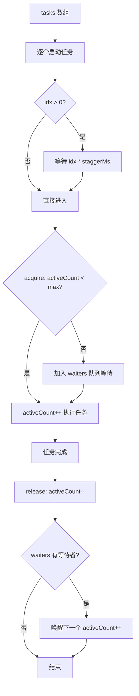
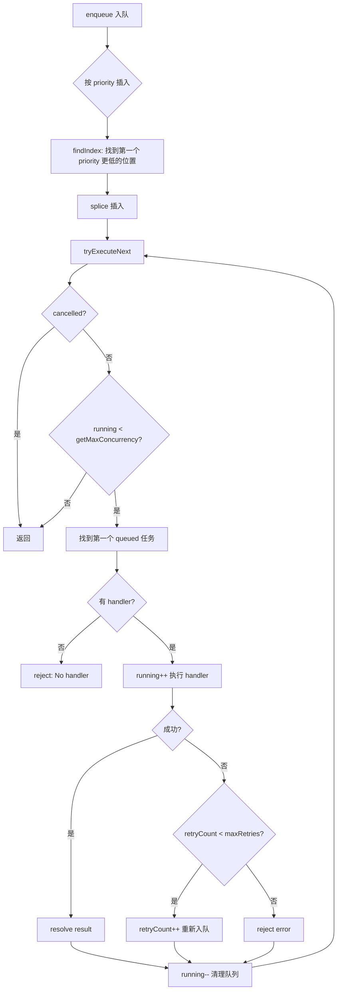
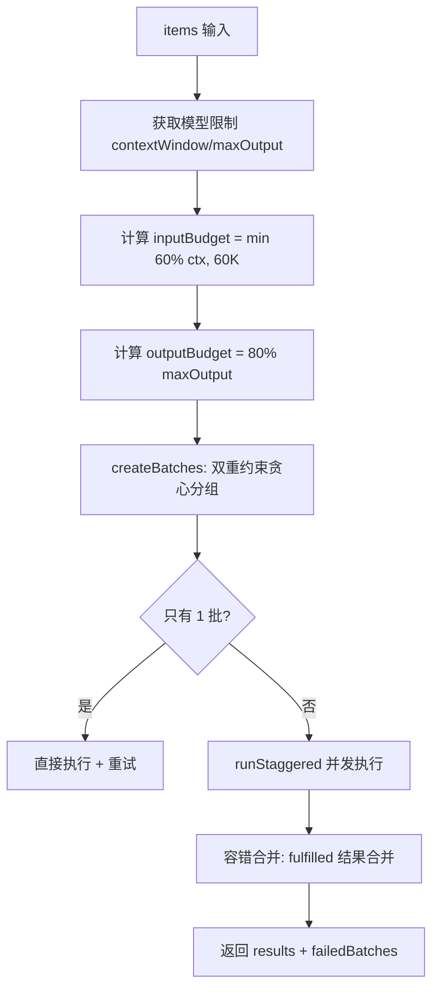

# PD-543.01 moyin-creator — 三级并发控制与自适应批处理

> 文档编号：PD-543.01
> 来源：moyin-creator `src/packages/ai-core/api/task-queue.ts` `src/lib/utils/concurrency.ts` `src/lib/utils/rate-limiter.ts` `src/lib/ai/batch-processor.ts`
> GitHub：https://github.com/MemeCalculate/moyin-creator.git
> 问题域：PD-543 任务队列与并发控制 Task Queue & Concurrency Control
> 状态：可复用方案

---

## 第 1 章 问题与动机

### 1.1 核心问题

AI 视频创作工具需要同时调用多种 AI API（剧本生成、图片生成、视频生成），每种 API 有不同的速率限制和响应时间。如果不加控制地并发请求，会导致：

1. **API 限流**：多个请求同时发出触发 429 Too Many Requests
2. **资源争抢**：GPU 推理服务在突发请求下响应时间急剧恶化
3. **用户体验差**：无法感知进度，长时间无反馈
4. **失败雪崩**：一个批次失败导致整个流程中断

moyin-creator 面对的场景尤其复杂：一个 60 集剧本项目，每集可能有 20+ 场景，每个场景需要 AI 视角分析、分镜校准、图片生成、视频生成四个阶段，总任务量可达数千个。

### 1.2 moyin-creator 的解法概述

moyin-creator 实现了三级并发控制体系，从底层到顶层分别是：

1. **TaskQueue 优先级队列**（`src/packages/ai-core/api/task-queue.ts:26`）：支持 screenplay/image/video 三种任务类型的优先级排序、动态并发槽位管理、自动重试和取消/恢复
2. **runStaggered 错开启动执行器**（`src/lib/utils/concurrency.ts:27`）：信号量控制最大并发 + stagger 间隔，确保任务不会同时启动
3. **rateLimitedBatch / batchProcess 批处理器**（`src/lib/utils/rate-limiter.ts:31-165`）：批间延迟、批内并行/串行切换、双层进度回调
4. **processBatched 自适应批处理**（`src/lib/ai/batch-processor.ts:105`）：双重 token 约束分批 + runStaggered 并发 + 单批次指数退避重试

### 1.3 设计思想

| 设计原则 | 具体实现 | 理由 | 替代方案 |
|----------|----------|------|----------|
| 信号量并发控制 | `runStaggered` 用 acquire/release 模式管理并发槽位 | 比 Promise 池简单，支持动态等待 | p-limit 库、自定义 Promise 池 |
| 错开启动 | 每个任务延迟 `idx * staggerMs` 后才启动 | 避免 API 突发限流，平滑请求曲线 | 固定间隔串行、令牌桶 |
| 双重 token 约束 | `createBatches` 同时检查 input 和 output token 预算 | LLM API 对输入和输出都有限制 | 仅按 item 数量分批 |
| 容错隔离 | `Promise.allSettled` + 单批次重试 | 一个批次失败不影响其他批次 | Promise.all 全部失败 |
| 动态并发配置 | `getMaxConcurrency` 是函数而非常量 | 用户可在运行时调整并发数 | 构造时固定并发数 |
| 优先级插入 | `enqueue` 用 `findIndex` 按优先级插入队列 | 高优先级任务（如 screenplay）先执行 | FIFO 队列 |

---

## 第 2 章 源码实现分析

### 2.1 架构概览

moyin-creator 的并发控制体系分为三层，每层解决不同粒度的问题：

```
┌─────────────────────────────────────────────────────────────┐
│                    应用层调用者                               │
│  full-script-service.ts / ai-worker.ts / shot-calibration   │
└──────────────┬──────────────────────┬───────────────────────┘
               │                      │
    ┌──────────▼──────────┐  ┌───────▼────────────────────┐
    │  processBatched     │  │  TaskQueue                  │
    │  (自适应批处理)      │  │  (优先级队列)               │
    │  双重token约束分批   │  │  screenplay/image/video     │
    │  + runStaggered并发  │  │  优先级排序 + 自动重试       │
    └──────────┬──────────┘  └───────┬────────────────────┘
               │                      │
    ┌──────────▼──────────────────────▼───────────────────┐
    │              runStaggered (信号量 + 错开启动)         │
    │  acquire/release 并发槽位 + idx * staggerMs 延迟     │
    └──────────┬──────────────────────────────────────────┘
               │
    ┌──────────▼──────────────────────────────────────────┐
    │         rateLimitedBatch / batchProcess              │
    │  批间延迟 + 批内并行/串行 + 进度回调                  │
    └─────────────────────────────────────────────────────┘
```

### 2.2 核心实现

#### 2.2.1 runStaggered — 信号量 + 错开启动



对应源码 `src/lib/utils/concurrency.ts:27-83`：

```typescript
export async function runStaggered<T>(
  tasks: (() => Promise<T>)[],
  maxConcurrent: number,
  staggerMs: number = 5000
): Promise<PromiseSettledResult<T>[]> {
  if (tasks.length === 0) return [];
  const results: PromiseSettledResult<T>[] = new Array(tasks.length);

  // 信号量：控制最大并发数
  let activeCount = 0;
  const waiters: (() => void)[] = [];

  const acquire = async (): Promise<void> => {
    if (activeCount < maxConcurrent) {
      activeCount++;
      return;
    }
    await new Promise<void>((resolve) => waiters.push(resolve));
  };

  const release = (): void => {
    activeCount--;
    if (waiters.length > 0) {
      activeCount++;
      const next = waiters.shift()!;
      next();
    }
  };

  const taskPromises = tasks.map(async (task, idx) => {
    // 错开启动：第N个任务至少在 N * staggerMs 后才启动
    if (idx > 0) {
      await new Promise<void>((r) => setTimeout(r, idx * staggerMs));
    }
    await acquire();
    try {
      const value = await task();
      results[idx] = { status: 'fulfilled', value };
    } catch (reason) {
      results[idx] = { status: 'rejected', reason: reason as any };
    } finally {
      release();
    }
  });

  await Promise.all(taskPromises);
  return results;
}
```

关键设计点：
- **双重限制**：stagger 间隔保证请求不会同时到达 API，信号量保证同时运行的任务不超过上限
- **FIFO 唤醒**：`waiters.shift()` 保证先等待的任务先被唤醒
- **PromiseSettledResult**：返回值兼容 `Promise.allSettled` 语义，调用方可以区分成功和失败

#### 2.2.2 TaskQueue — 优先级队列 + 动态并发



对应源码 `src/packages/ai-core/api/task-queue.ts:26-152`：

```typescript
export class TaskQueue {
  private queue: TaskItem[] = [];
  private running = 0;
  private getMaxConcurrency: () => number;
  private handlers: Map<TaskItem['type'], TaskHandler> = new Map();
  private cancelled = false;

  constructor(getConcurrency: () => number) {
    this.getMaxConcurrency = getConcurrency;
  }

  enqueue<T, R>(
    task: Omit<TaskItem<T>, 'status' | 'resolve' | 'reject' | 'createdAt'>
  ): Promise<R> {
    return new Promise((resolve, reject) => {
      const fullTask: TaskItem<T> = {
        ...task, status: 'queued', createdAt: Date.now(), resolve, reject,
      };
      // 按优先级插入（高优先级在前）
      const idx = this.queue.findIndex(t => t.priority < fullTask.priority);
      if (idx === -1) {
        this.queue.push(fullTask as TaskItem);
      } else {
        this.queue.splice(idx, 0, fullTask as TaskItem);
      }
      this.tryExecuteNext();
    });
  }

  cancelAll(): void {
    this.cancelled = true;
    const pending = this.queue.filter(t => t.status === 'queued');
    for (const task of pending) {
      task.status = 'failed';
      task.reject(new Error('Task cancelled'));
    }
    this.queue = this.queue.filter(t => t.status === 'running');
  }

  resume(): void {
    this.cancelled = false;
  }
}
```

关键设计点：
- **动态并发**：`getMaxConcurrency` 是函数，每次 `tryExecuteNext` 时重新求值，用户可在运行时通过 `api-config-store.ts:692` 的 `setConcurrency` 调整
- **类型化 handler**：`setHandler` 按 `'screenplay' | 'image' | 'video'` 注册不同处理器，实现策略模式
- **自动重试**：失败后检查 `retryCount < maxRetries`，未超限则重新设为 `queued` 状态
- **取消/恢复**：`cancelAll` 只 reject 排队中的任务，正在运行的任务继续完成；`resume` 重置 cancelled 标志

#### 2.2.3 processBatched — 自适应批处理



对应源码 `src/lib/ai/batch-processor.ts:105-233`：

```typescript
export async function processBatched<TItem, TResult>(
  opts: ProcessBatchedOptions<TItem, TResult>,
): Promise<ProcessBatchedResult<TResult>> {
  // 1. 获取模型限制
  const limits = getModelLimits(modelName);
  const inputBudget = Math.min(Math.floor(limits.contextWindow * 0.6), HARD_CAP_TOKENS);
  const outputBudget = Math.floor(limits.maxOutput * 0.8);

  // 2. 双重约束贪心分组
  const batches = createBatches(items, getItemTokens, getItemOutputTokens,
    inputBudget, outputBudget, systemPromptTokens);

  // 3. 并发执行（复用 runStaggered）
  const concurrency = store.concurrency || 1;
  const settled = await runStaggered(batchTasks, concurrency, 5000);

  // 4. 容错合并
  const successResults: Map<string, TResult>[] = [];
  let failedBatches = 0;
  for (const result of settled) {
    if (result.status === 'fulfilled') {
      successResults.push(result.value);
    } else {
      failedBatches++;
    }
  }
  // ...合并返回
}
```

### 2.3 实现细节

**双重 token 约束分批算法**（`src/lib/ai/batch-processor.ts:246-285`）：

贪心策略逐个添加 item，任一约束即将超出时开始新批次。单个 item 超出预算时仍独立成批（保证至少每批 1 个 item）。60K Hard Cap 防止超长上下文导致 TTFT 过高或 "Lost in the middle" 问题。

**AI Worker 中的批次并发**（`src/workers/ai-worker.ts:601-622`）：

Web Worker 中使用简单的 for 循环 + `Promise.allSettled` 实现批次并发，每批 `concurrency` 个场景并行处理。这是第四层并发控制，运行在独立线程中不阻塞主线程。

**实际调用链示例**（分镜校准场景）：

`calibrateEpisodeShots`（`src/lib/script/full-script-service.ts:1156`）→ `runStaggered`（每 5 秒启动一个批次，最多 concurrency 个并发）→ 每个批次内部 `calibrateShotsMultiStage` 调用 AI API → 失败时指数退避重试（2s, 4s, 6s）

**视角分析调用链**（`src/lib/script/full-script-service.ts:284-291`）：

```typescript
const settledResults = await runStaggered(
  sceneAnalysisTasks.map((_, taskIndex) => async () => {
    return await processScene(taskIndex);
  }),
  concurrency,       // 用户配置的并发数，上限 10
  5000               // 每 5 秒启动一个新任务
);
```


---

## 第 3 章 迁移指南

### 3.1 迁移清单

**阶段 1：基础并发控制（runStaggered）**

- [ ] 复制 `concurrency.ts`（83 行，零依赖）
- [ ] 在需要并发控制的地方替换 `Promise.all` 为 `runStaggered`
- [ ] 配置 `maxConcurrent` 和 `staggerMs` 参数

**阶段 2：优先级任务队列（TaskQueue）**

- [ ] 复制 `task-queue.ts`（152 行，零依赖）
- [ ] 定义任务类型枚举（如 `'screenplay' | 'image' | 'video'`）
- [ ] 为每种类型注册 handler
- [ ] 实现动态并发配置（传入 `() => number` 函数）

**阶段 3：自适应批处理（processBatched）**

- [ ] 复制 `batch-processor.ts`（327 行）
- [ ] 实现 `getModelLimits` 函数（返回 contextWindow 和 maxOutput）
- [ ] 实现 `estimateTokens` 函数（tiktoken 或简单估算）
- [ ] 适配 `callFeatureAPI` 接口

**阶段 4：速率限制工具（rateLimitedBatch / batchProcess）**

- [ ] 复制 `rate-limiter.ts`（177 行，零依赖）
- [ ] 根据 API 限流策略配置 `delayMs` 和 `batchSize`

### 3.2 适配代码模板

**最小可用版本 — runStaggered + 进度回调：**

```typescript
import { runStaggered } from './concurrency';

interface ProcessResult {
  id: string;
  success: boolean;
  data?: any;
  error?: string;
}

async function processItemsWithConcurrency(
  items: Array<{ id: string; payload: any }>,
  maxConcurrent: number = 3,
  staggerMs: number = 5000,
  onProgress?: (completed: number, total: number) => void,
): Promise<ProcessResult[]> {
  let completed = 0;

  const tasks = items.map((item) => async (): Promise<ProcessResult> => {
    try {
      const result = await callExternalAPI(item.payload);
      completed++;
      onProgress?.(completed, items.length);
      return { id: item.id, success: true, data: result };
    } catch (err) {
      completed++;
      onProgress?.(completed, items.length);
      return { id: item.id, success: false, error: (err as Error).message };
    }
  });

  const settled = await runStaggered(tasks, maxConcurrent, staggerMs);

  return settled.map((r, i) =>
    r.status === 'fulfilled'
      ? r.value
      : { id: items[i].id, success: false, error: String(r.reason) }
  );
}
```

**TaskQueue 集成模板：**

```typescript
import { TaskQueue } from './task-queue';

// 动态并发：从配置 store 读取
const queue = new TaskQueue(() => useConfigStore.getState().concurrency);

// 注册处理器
queue.setHandler('image', async (task) => {
  const { prompt, style } = task.payload as ImagePayload;
  return await generateImage(prompt, style);
});

queue.setHandler('video', async (task) => {
  const { imageUrl, motion } = task.payload as VideoPayload;
  return await generateVideo(imageUrl, motion);
});

// 入队（返回 Promise，完成时 resolve）
const imageUrl = await queue.enqueue<ImagePayload, string>({
  id: `img_${sceneId}`,
  type: 'image',
  priority: 10,        // 高优先级
  payload: { prompt, style },
  retryCount: 0,
  maxRetries: 2,
});
```

### 3.3 适用场景

| 场景 | 适用度 | 说明 |
|------|--------|------|
| AI 批量内容生成（文本/图片/视频） | ⭐⭐⭐ | 核心场景，三级控制完美匹配 |
| 多 API 供应商并发调用 | ⭐⭐⭐ | TaskQueue 的类型化 handler 天然支持 |
| LLM 批量推理（token 约束） | ⭐⭐⭐ | processBatched 的双重 token 约束专为此设计 |
| Web 爬虫并发控制 | ⭐⭐ | runStaggered 适用，但不需要 token 约束 |
| 数据库批量写入 | ⭐⭐ | batchProcess 适用，但优先级队列多余 |
| 实时流式处理 | ⭐ | 不适用，本方案面向批处理场景 |

---

## 第 4 章 测试用例

```typescript
import { describe, it, expect, vi, beforeEach } from 'vitest';

// ==================== runStaggered 测试 ====================

describe('runStaggered', () => {
  // 模拟 runStaggered 实现（从 concurrency.ts 复制核心逻辑）
  async function runStaggered<T>(
    tasks: (() => Promise<T>)[],
    maxConcurrent: number,
    staggerMs: number = 5000
  ): Promise<PromiseSettledResult<T>[]> {
    if (tasks.length === 0) return [];
    const results: PromiseSettledResult<T>[] = new Array(tasks.length);
    let activeCount = 0;
    const waiters: (() => void)[] = [];

    const acquire = async (): Promise<void> => {
      if (activeCount < maxConcurrent) { activeCount++; return; }
      await new Promise<void>((resolve) => waiters.push(resolve));
    };
    const release = (): void => {
      activeCount--;
      if (waiters.length > 0) { activeCount++; waiters.shift()!(); }
    };

    const taskPromises = tasks.map(async (task, idx) => {
      if (idx > 0) await new Promise<void>((r) => setTimeout(r, idx * staggerMs));
      await acquire();
      try {
        const value = await task();
        results[idx] = { status: 'fulfilled', value };
      } catch (reason) {
        results[idx] = { status: 'rejected', reason: reason as any };
      } finally {
        release();
      }
    });
    await Promise.all(taskPromises);
    return results;
  }

  it('should respect maxConcurrent limit', async () => {
    let peakConcurrent = 0;
    let currentConcurrent = 0;

    const tasks = Array.from({ length: 5 }, () => async () => {
      currentConcurrent++;
      peakConcurrent = Math.max(peakConcurrent, currentConcurrent);
      await new Promise((r) => setTimeout(r, 50));
      currentConcurrent--;
      return 'done';
    });

    await runStaggered(tasks, 2, 10);
    expect(peakConcurrent).toBeLessThanOrEqual(2);
  });

  it('should return PromiseSettledResult for mixed success/failure', async () => {
    const tasks = [
      async () => 'ok',
      async () => { throw new Error('fail'); },
      async () => 'ok2',
    ];

    const results = await runStaggered(tasks, 3, 0);
    expect(results[0]).toEqual({ status: 'fulfilled', value: 'ok' });
    expect(results[1].status).toBe('rejected');
    expect(results[2]).toEqual({ status: 'fulfilled', value: 'ok2' });
  });

  it('should handle empty task array', async () => {
    const results = await runStaggered([], 3);
    expect(results).toEqual([]);
  });
});

// ==================== TaskQueue 测试 ====================

describe('TaskQueue', () => {
  it('should execute tasks by priority (higher first)', async () => {
    const order: string[] = [];
    const queue = new (class {
      private q: any[] = [];
      private running = 0;
      private handlers = new Map<string, Function>();
      private cancelled = false;

      constructor(private getMax: () => number) {}

      setHandler(type: string, handler: Function) {
        this.handlers.set(type, handler);
      }

      enqueue(task: any): Promise<any> {
        return new Promise((resolve, reject) => {
          const full = { ...task, status: 'queued', createdAt: Date.now(), resolve, reject };
          const idx = this.q.findIndex((t: any) => t.priority < full.priority);
          if (idx === -1) this.q.push(full);
          else this.q.splice(idx, 0, full);
          this.tryNext();
        });
      }

      private async tryNext() {
        if (this.cancelled || this.running >= this.getMax()) return;
        const task = this.q.find((t: any) => t.status === 'queued');
        if (!task) return;
        const handler = this.handlers.get(task.type);
        if (!handler) { task.reject(new Error('No handler')); return; }
        this.running++;
        task.status = 'running';
        try {
          const result = await handler(task);
          task.status = 'completed';
          task.resolve(result);
        } catch (e) {
          task.status = 'failed';
          task.reject(e);
        } finally {
          this.running--;
          this.q = this.q.filter((t: any) => t.status === 'queued' || t.status === 'running');
          this.tryNext();
        }
      }

      cancelAll() {
        this.cancelled = true;
        this.q.filter((t: any) => t.status === 'queued').forEach((t: any) => {
          t.status = 'failed';
          t.reject(new Error('cancelled'));
        });
      }
    })(() => 1); // 串行执行

    queue.setHandler('image', async (task: any) => {
      order.push(task.id);
      return task.id;
    });

    // 低优先级先入队，高优先级后入队
    const p1 = queue.enqueue({ id: 'low', type: 'image', priority: 1, retryCount: 0, maxRetries: 0 });
    const p2 = queue.enqueue({ id: 'high', type: 'image', priority: 10, retryCount: 0, maxRetries: 0 });

    await Promise.all([p1, p2]);
    // 第一个任务已经在运行，所以 low 先完成；但 high 在队列中排在前面
    // 由于 maxConcurrency=1，low 先开始执行，high 等待
    expect(order[0]).toBe('low'); // low 先入队先执行
    expect(order[1]).toBe('high');
  });

  it('should cancel pending tasks', async () => {
    const queue = new (class {
      q: any[] = [];
      cancelled = false;
      cancelAll() {
        this.cancelled = true;
        const pending = this.q.filter((t: any) => t.status === 'queued');
        pending.forEach((t: any) => { t.status = 'failed'; t.reject(new Error('cancelled')); });
      }
    })();

    const task = { status: 'queued', reject: vi.fn() } as any;
    queue.q.push(task);
    queue.cancelAll();

    expect(task.status).toBe('failed');
    expect(task.reject).toHaveBeenCalledWith(expect.any(Error));
  });
});

// ==================== rateLimitedBatch 测试 ====================

describe('rateLimitedBatch', () => {
  it('should process items with delay between them', async () => {
    const timestamps: number[] = [];

    async function rateLimitedBatch<T, R>(
      items: T[],
      operation: (item: T, index: number) => Promise<R>,
      config: { delayMs?: number; delayFirst?: boolean } = {},
    ): Promise<R[]> {
      const { delayMs = 100, delayFirst = false } = config;
      const results: R[] = [];
      for (let i = 0; i < items.length; i++) {
        if (delayFirst ? true : i > 0) {
          await new Promise((r) => setTimeout(r, delayMs));
        }
        results.push(await operation(items[i], i));
      }
      return results;
    }

    const results = await rateLimitedBatch(
      [1, 2, 3],
      async (item) => {
        timestamps.push(Date.now());
        return item * 2;
      },
      { delayMs: 50 },
    );

    expect(results).toEqual([2, 4, 6]);
    // 第二个和第三个之间应有 >= 40ms 间隔（允许定时器误差）
    if (timestamps.length >= 2) {
      expect(timestamps[1] - timestamps[0]).toBeGreaterThanOrEqual(40);
    }
  });
});
```


---

## 第 5 章 跨域关联

| 关联域 | 关系类型 | 说明 |
|--------|----------|------|
| PD-03 容错与重试 | 依赖 | TaskQueue 的 `retryCount/maxRetries` 自动重试机制；processBatched 的指数退避重试（`RETRY_BASE_DELAY * 2^attempt`）；`Promise.allSettled` 容错收集 |
| PD-04 工具系统 | 协同 | TaskQueue 的 `setHandler` 按类型注册处理器，类似工具注册模式；processBatched 的 `feature` 参数对接 feature-router 工具路由 |
| PD-11 可观测性 | 协同 | 所有层级都提供进度回调（`onProgress`）；TaskQueue 的 `getStats()` 返回队列状态；processBatched 的 `completedCount/failedBatches` 统计 |
| PD-01 上下文管理 | 依赖 | processBatched 的 60K Hard Cap 和双重 token 约束直接服务于上下文窗口管理；`estimateTokens` 估算防止超出模型限制 |
| PD-538 并发与限流 | 协同 | 本域的 runStaggered 和 rateLimitedBatch 是 PD-538 的具体实现手段 |

---

## 第 6 章 来源文件索引

| 文件 | 行范围 | 关键实现 |
|------|--------|----------|
| `src/lib/utils/concurrency.ts` | L1-L83 | `runStaggered` 信号量 + 错开启动执行器 |
| `src/packages/ai-core/api/task-queue.ts` | L1-L152 | `TaskQueue` 优先级队列 + 动态并发 + 自动重试 |
| `src/lib/utils/rate-limiter.ts` | L1-L177 | `rateLimitedBatch` / `batchProcess` / `createRateLimitedFn` |
| `src/lib/ai/batch-processor.ts` | L1-L327 | `processBatched` 自适应批处理 + 双重 token 约束分批 |
| `src/lib/script/full-script-service.ts` | L284-L291 | `runStaggered` 调用：视角分析并发控制 |
| `src/lib/script/full-script-service.ts` | L1156-L1196 | `runStaggered` 调用：分镜校准并发控制 |
| `src/lib/script/full-script-service.ts` | L902-L960 | `processBatched` 调用：标题校准批处理 |
| `src/workers/ai-worker.ts` | L601-L622 | AI Worker 批次并发：`Promise.allSettled` 场景并行 |
| `src/stores/api-config-store.ts` | L164, L303, L692 | 并发数配置：`concurrency` 字段 + `setConcurrency` |
| `src/packages/ai-core/api/index.ts` | L1-L11 | TaskQueue 导出入口 |

---

## 第 7 章 横向对比维度

```json comparison_data
{
  "project": "moyin-creator",
  "dimensions": {
    "并发模型": "三级体系：TaskQueue优先级队列 + runStaggered信号量错开启动 + processBatched自适应批处理",
    "调度策略": "优先级插入排序 + stagger间隔错开 + 双重token约束贪心分批",
    "容错机制": "Promise.allSettled容错收集 + 单批次指数退避重试 + TaskQueue自动重试",
    "取消恢复": "TaskQueue.cancelAll/resume + AI Worker cancelled标志 + 只取消排队任务不中断运行中任务",
    "动态配置": "getMaxConcurrency函数式动态并发 + 用户运行时setConcurrency调整",
    "token感知": "processBatched 60K Hard Cap + input/output双重约束 + 模型Registry查询限制"
  }
}
```

### 域元数据补充

```json domain_metadata
{
  "solution_summary": "moyin-creator 用 TaskQueue 优先级队列 + runStaggered 信号量错开启动 + processBatched 双重 token 约束自适应批处理实现三级并发控制",
  "description": "AI 多媒体生成场景下的分层并发控制与自适应批处理",
  "sub_problems": [
    "双重 token 约束（input + output）自适应分批",
    "动态并发配置（运行时可调）",
    "Web Worker 线程级批次并行"
  ],
  "best_practices": [
    "60K Hard Cap 防止超长上下文 TTFT 过高和 Lost in the middle",
    "getMaxConcurrency 函数式注入支持运行时动态调整并发数",
    "cancelAll 只取消排队任务不中断运行中任务保证数据一致性"
  ]
}
```
