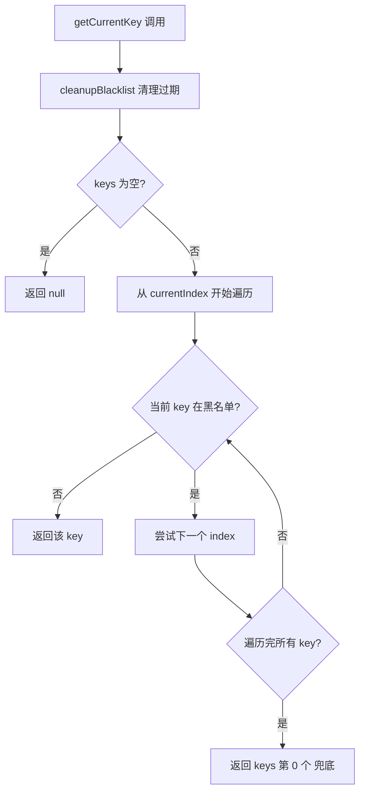
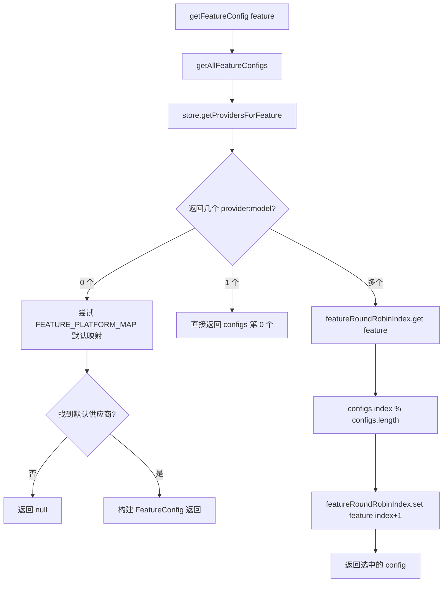
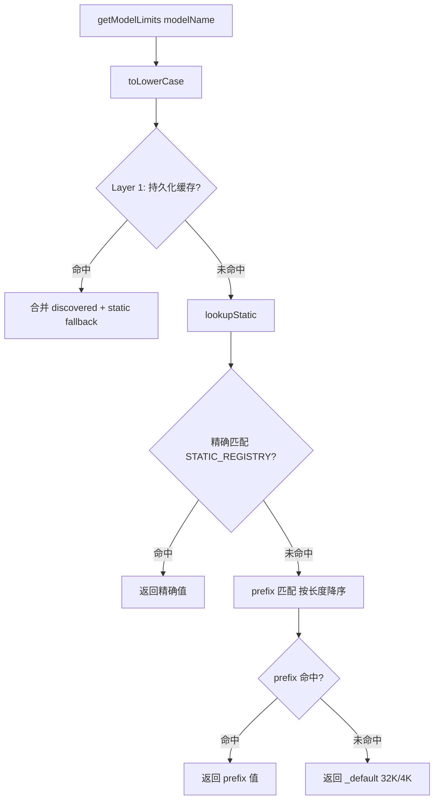

# PD-544.01 moyin-creator — 三层查表轮询与 Error-driven Discovery 多供应商 AI 调度

> 文档编号：PD-544.01
> 来源：moyin-creator `src/lib/api-key-manager.ts` `src/lib/ai/feature-router.ts` `src/lib/ai/model-registry.ts`
> GitHub：https://github.com/MemeCalculate/moyin-creator.git
> 问题域：PD-544 多供应商 AI 调度 Multi-Provider AI Dispatch
> 状态：可复用方案

---

## 第 1 章 问题与动机

### 1.1 核心问题

多供应商 AI 调度要解决的核心矛盾是：**应用需要调用多个 AI 供应商（OpenAI、DeepSeek、GLM、Gemini、Kimi 等 10+ 家），每家的 API Key 配额有限、模型参数限制各异、服务可用性不稳定**。如果只硬编码一个供应商，一旦该供应商限流或宕机，整个应用就瘫痪。

具体子问题包括：
1. **Key 池管理**：同一供应商可能有多个 API Key，需要轮换使用以分散配额压力
2. **故障隔离**：某个 Key 被限流（429）或认证失败（401）时，需要临时屏蔽并自动恢复
3. **功能级路由**：不同 AI 功能（剧本分析、角色生成、视频生成等）可能绑定不同供应商
4. **模型参数适配**：552+ 模型的 contextWindow 和 maxOutput 各不相同，需要自动适配
5. **未知模型兼容**：新模型上线时参数未知，需要从 API 错误中自动学习

### 1.2 moyin-creator 的解法概述

moyin-creator 构建了一个三层调度架构：

1. **ApiKeyManager**（`src/lib/api-key-manager.ts:259`）：每个供应商一个实例，管理多 Key 轮换 + 90 秒临时黑名单 + 随机起始负载均衡
2. **FeatureRouter**（`src/lib/ai/feature-router.ts:133`）：按功能维度绑定供应商，支持多模型 round-robin 轮询调度
3. **ModelRegistry**（`src/lib/ai/model-registry.ts:125`）：三层查找模型限制（持久化缓存 → 静态注册表 → 保守默认值），配合 Error-driven Discovery 自动学习未知模型参数

三层协同工作：FeatureRouter 决定"用哪个供应商的哪个模型"，ApiKeyManager 决定"用哪个 Key"，ModelRegistry 决定"max_tokens 设多少"。

### 1.3 设计思想

| 设计原则 | 具体实现 | 理由 | 替代方案 |
|----------|----------|------|----------|
| 随机起始均衡 | `Math.floor(Math.random() * keys.length)` 初始化 currentIndex | 多实例/多页面同时启动时避免全部打同一个 Key | 固定从 0 开始（会导致第一个 Key 压力集中） |
| 临时黑名单 | 90 秒自动过期的 Map，不永久封禁 | 429 限流是临时的，永久封禁会浪费可用 Key | 永久移除（过于激进）/ 不隔离（反复撞限流） |
| 功能级绑定 | `featureBindings: Record<AIFeature, string[]>` | 不同功能对模型能力要求不同（视频生成 vs 文本分析） | 全局统一供应商（无法满足多模态需求） |
| Error-driven Discovery | 从 400 错误消息中正则提取 maxOutput/contextWindow | 552+ 模型不可能全部手动维护，让系统自动学习 | 手动维护全量模型表（维护成本高且滞后） |
| 按模型名查表 | 不按 URL 查，因为代理平台的模型名和直连一样 | memefast 等中转平台代理了多家模型，URL 相同但模型不同 | 按 URL 查（代理场景下失效） |

---

## 第 2 章 源码实现分析

### 2.1 架构概览

```
┌─────────────────────────────────────────────────────────────────┐
│                        callFeatureAPI()                         │
│                    feature-router.ts:238                        │
└──────────────────────────┬──────────────────────────────────────┘
                           │
              ┌────────────▼────────────┐
              │   getFeatureConfig()    │
              │  Round-Robin 多模型轮询  │
              │  feature-router.ts:133  │
              └────────────┬────────────┘
                           │
         ┌─────────────────┼─────────────────┐
         ▼                 ▼                 ▼
┌─────────────┐   ┌──────────────┐   ┌──────────────┐
│FeatureConfig│   │FeatureConfig │   │FeatureConfig │
│ DeepSeek-V3 │   │  GLM-4.7     │   │ Gemini-3-Pro │
│ Provider A  │   │  Provider B  │   │ Provider A   │
└──────┬──────┘   └──────┬───────┘   └──────┬───────┘
       │                 │                   │
       ▼                 ▼                   ▼
┌──────────────────────────────────────────────────┐
│              ApiKeyManager (per provider)         │
│  keys: [k1, k2, k3]  blacklist: Map<key, time>  │
│  currentIndex → round-robin with skip-blacklist  │
│              api-key-manager.ts:259              │
└──────────────────────┬───────────────────────────┘
                       │
                       ▼
┌──────────────────────────────────────────────────┐
│              callChatAPI()                        │
│  1. getModelLimits(model) → clamp max_tokens     │
│  2. fetch() → on error: handleError(status)      │
│  3. 400 → parseModelLimitsFromError → retry      │
│  4. success → rotateKey() for next call          │
│              script-parser.ts:209                │
└──────────────────────────────────────────────────┘
                       │
                       ▼
┌──────────────────────────────────────────────────┐
│              ModelRegistry                        │
│  Layer 1: discoveredModelLimits (localStorage)   │
│  Layer 2: STATIC_REGISTRY (精确 → prefix 匹配)   │
│  Layer 3: _default (32K ctx / 4K output)         │
│              model-registry.ts:125               │
└──────────────────────────────────────────────────┘
```

### 2.2 核心实现

#### 2.2.1 ApiKeyManager — 多 Key 轮换与临时黑名单



对应源码 `src/lib/api-key-manager.ts:259-387`：

```typescript
export class ApiKeyManager {
  private keys: string[];
  private currentIndex: number;
  private blacklist: Map<string, BlacklistedKey> = new Map();

  constructor(apiKeyString: string) {
    this.keys = parseApiKeys(apiKeyString);
    // 随机起始索引：多实例同时启动时分散到不同 Key
    this.currentIndex = this.keys.length > 0
      ? Math.floor(Math.random() * this.keys.length) : 0;
  }

  getCurrentKey(): string | null {
    this.cleanupBlacklist();
    if (this.keys.length === 0) return null;
    // 从 currentIndex 开始找第一个不在黑名单的 Key
    for (let i = 0; i < this.keys.length; i++) {
      const index = (this.currentIndex + i) % this.keys.length;
      const key = this.keys[index];
      if (!this.blacklist.has(key)) {
        this.currentIndex = index;
        return key;
      }
    }
    return this.keys.length > 0 ? this.keys[0] : null;
  }

  handleError(statusCode: number): boolean {
    // 429 限流、401 认证失败、503 服务不可用 → 黑名单 + 轮换
    if (statusCode === 429 || statusCode === 401 || statusCode === 503) {
      this.markCurrentKeyFailed();
      return true;
    }
    return false;
  }
}
```

关键设计点：
- **随机起始**（`api-key-manager.ts:267`）：`Math.floor(Math.random() * this.keys.length)` 确保多个页面/Worker 不会同时从 Key[0] 开始
- **90 秒黑名单**（`api-key-manager.ts:253`）：`BLACKLIST_DURATION_MS = 90 * 1000`，cleanupBlacklist 在每次 getCurrentKey/rotateKey 时自动清理过期条目
- **全局单例 Map**（`api-key-manager.ts:392`）：`providerManagers = new Map<string, ApiKeyManager>()` 确保同一供应商在整个应用中共享同一个 Manager 实例

#### 2.2.2 FeatureRouter — 功能级多模型 Round-Robin



对应源码 `src/lib/ai/feature-router.ts:133-182`：

```typescript
const featureRoundRobinIndex: Map<AIFeature, number> = new Map();

export function getFeatureConfig(feature: AIFeature): FeatureConfig | null {
  const configs = getAllFeatureConfigs(feature);
  if (configs.length === 0) {
    // Fallback: 使用 FEATURE_PLATFORM_MAP 默认映射
    const store = useAPIConfigStore.getState();
    const defaultPlatform = FEATURE_PLATFORM_MAP[feature];
    if (defaultPlatform) {
      const provider = store.providers.find(p => p.platform === defaultPlatform);
      if (provider) { /* 构建并返回 FeatureConfig */ }
    }
    return null;
  }
  if (configs.length === 1) return configs[0];

  // 多模型 round-robin
  const currentIndex = featureRoundRobinIndex.get(feature) || 0;
  const config = configs[currentIndex % configs.length];
  featureRoundRobinIndex.set(feature, currentIndex + 1);
  return config;
}
```

关键设计点：
- **功能绑定**（`feature-router.ts:41-49`）：`FEATURE_PLATFORM_MAP` 提供默认映射，用户可在 UI 中覆盖
- **多模型轮询**（`feature-router.ts:173-177`）：简单递增取模，无权重，适合同质模型池
- **重置机制**（`feature-router.ts:187-193`）：`resetFeatureRoundRobin()` 在新任务开始时重置索引

#### 2.2.3 ModelRegistry — 三层查找与 Error-driven Discovery



对应源码 `src/lib/ai/model-registry.ts:125-162`：

```typescript
export function getModelLimits(modelName: string): ModelLimits {
  const m = modelName.toLowerCase();

  // Layer 1: 持久化缓存（从 API 错误中学到的真实限制）
  if (_getDiscoveredLimits) {
    const discovered = _getDiscoveredLimits(m);
    if (discovered) {
      const staticFallback = lookupStatic(m);
      return {
        contextWindow: discovered.contextWindow ?? staticFallback.contextWindow,
        maxOutput: discovered.maxOutput ?? staticFallback.maxOutput,
      };
    }
  }
  // Layer 2 + 3: 静态注册表 → _default
  return lookupStatic(m);
}

function lookupStatic(modelNameLower: string): ModelLimits {
  if (STATIC_REGISTRY[modelNameLower]) return STATIC_REGISTRY[modelNameLower];
  // prefix 匹配（SORTED_KEYS 按长度降序，长前缀优先）
  for (const key of SORTED_KEYS) {
    if (modelNameLower.startsWith(key)) return STATIC_REGISTRY[key];
  }
  return STATIC_REGISTRY['_default'];
}
```

**Error-driven Discovery**（`model-registry.ts:178-229`）从 API 400 错误中正则提取限制：

```typescript
export function parseModelLimitsFromError(errorText: string): Partial<DiscoveredModelLimits> | null {
  // Pattern 1: "valid range of max_tokens is [1, 8192]"
  const rangeMatch = errorText.match(/valid\s+range.*?\[\s*\d+\s*,\s*(\d+)\s*\]/i);
  // Pattern 2: "max_tokens must be less than or equal to 8192"
  const lteMatch = errorText.match(/max_tokens.*?(?:less than or equal to|<=|不超过|上限为?)\s*(\d{3,6})/i);
  // Pattern 3: Generic "max_tokens ... 8192"
  const genericMatch = errorText.match(/max_tokens.*?\b(\d{3,6})\b/i);
  // Pattern 4: "context length is 128000"
  const ctxMatch = errorText.match(/context.*?length.*?(\d{4,7})/i);
  // ...
}
```

### 2.3 实现细节

**调用链数据流：**

```
用户触发 AI 功能（如"分析剧本"）
  → callFeatureAPI('script_analysis', system, user)
    → getFeatureConfig('script_analysis')
      → store.getProvidersForFeature('script_analysis')
        → 解析 featureBindings['script_analysis'] = ['memefast:deepseek-v3.2', 'memefast:glm-4.7']
        → 返回 [{provider: memefast, model: 'deepseek-v3.2'}, {provider: memefast, model: 'glm-4.7'}]
      → round-robin 选中 deepseek-v3.2
    → getProviderKeyManager('memefast-id', 'key1,key2,key3')
      → ApiKeyManager 随机起始，选中 key2
    → getModelLimits('deepseek-v3.2')
      → 静态表命中：{contextWindow: 128000, maxOutput: 8192}
    → callChatAPI(system, user, {keyManager, model: 'deepseek-v3.2', ...})
      → max_tokens = min(4096, 8192) = 4096
      → fetch() with key2
      → 成功 → rotateKey() → 下次用 key3
      → 429 → handleError(429) → 黑名单 key2 90秒 → 自动切 key3 重试
      → 400 → parseModelLimitsFromError → 学习真实限制 → 缓存到 localStorage → 重试
```

**模型能力自动分类**（`api-key-manager.ts:75-112`）：`classifyModelByName()` 通过模式匹配将 552+ 模型自动归类为 text/vision/image_generation/video_generation/embedding/reasoning，无需手动标注每个模型。

**Token 预算计算**（`script-parser.ts:254-283`）：在发送请求前用 `estimateTokens(text) = Math.ceil(text.length / 1.5)` 保守估算输入 token 数，如果超过 contextWindow 的 90% 直接抛错不发请求（省钱），输出空间不足 50% 时打 warning。


---

## 第 3 章 迁移指南

### 3.1 迁移清单

**阶段 1：Key 池管理（1 个文件）**
- [ ] 移植 `ApiKeyManager` 类（含 parseApiKeys、blacklist、rotateKey）
- [ ] 配置 `BLACKLIST_DURATION_MS`（默认 90 秒，可按供应商调整）
- [ ] 实现全局 `providerManagers` Map 单例

**阶段 2：模型注册表（1 个文件）**
- [ ] 移植 `ModelRegistry`（STATIC_REGISTRY + prefix 匹配 + _default）
- [ ] 实现 `parseModelLimitsFromError()` 的正则模式（至少覆盖 DeepSeek/OpenAI/智谱三种格式）
- [ ] 接入持久化存储（localStorage / Redis / DB）存放 discoveredModelLimits

**阶段 3：功能路由（1 个文件）**
- [ ] 定义 `AIFeature` 枚举和 `FeatureBindings` 类型
- [ ] 实现 `getFeatureConfig()` 含 round-robin 和默认映射 fallback
- [ ] 实现 `callFeatureAPI()` 统一入口，串联 KeyManager + ModelRegistry

**阶段 4：集成与测试**
- [ ] 在 API 调用层接入 `keyManager.handleError(status)` 自动轮换
- [ ] 在 400 错误处理中接入 `parseModelLimitsFromError` + `cacheDiscoveredLimits`
- [ ] 成功请求后调用 `keyManager.rotateKey()` 分散负载

### 3.2 适配代码模板

以下是一个可直接运行的 TypeScript 最小实现，包含 Key 轮换 + 黑名单 + Error-driven Discovery：

```typescript
// === api-key-manager.ts ===

interface BlacklistedKey {
  key: string;
  blacklistedAt: number;
}

const BLACKLIST_DURATION_MS = 90_000;

export class ApiKeyManager {
  private keys: string[];
  private currentIndex: number;
  private blacklist = new Map<string, BlacklistedKey>();

  constructor(keys: string[]) {
    this.keys = keys;
    this.currentIndex = keys.length > 0
      ? Math.floor(Math.random() * keys.length) : 0;
  }

  getCurrentKey(): string | null {
    this.cleanup();
    for (let i = 0; i < this.keys.length; i++) {
      const idx = (this.currentIndex + i) % this.keys.length;
      if (!this.blacklist.has(this.keys[idx])) {
        this.currentIndex = idx;
        return this.keys[idx];
      }
    }
    return this.keys[0] ?? null; // 全部黑名单时兜底
  }

  rotateKey(): string | null {
    this.currentIndex = (this.currentIndex + 1) % this.keys.length;
    return this.getCurrentKey();
  }

  handleError(status: number): boolean {
    if ([429, 401, 503].includes(status)) {
      const key = this.keys[this.currentIndex];
      if (key) this.blacklist.set(key, { key, blacklistedAt: Date.now() });
      this.rotateKey();
      return true;
    }
    return false;
  }

  private cleanup() {
    const now = Date.now();
    for (const [k, v] of this.blacklist) {
      if (now - v.blacklistedAt >= BLACKLIST_DURATION_MS) this.blacklist.delete(k);
    }
  }
}

// === model-registry.ts ===

interface ModelLimits { contextWindow: number; maxOutput: number; }

const REGISTRY: Record<string, ModelLimits> = {
  'gpt-4o':       { contextWindow: 128000, maxOutput: 16384 },
  'deepseek-v3':  { contextWindow: 128000, maxOutput: 8192  },
  'gpt-':         { contextWindow: 128000, maxOutput: 16384 }, // prefix
  '_default':     { contextWindow: 32000,  maxOutput: 4096  },
};

const SORTED_KEYS = Object.keys(REGISTRY)
  .filter(k => k !== '_default')
  .sort((a, b) => b.length - a.length);

const discoveredCache = new Map<string, Partial<ModelLimits>>();

export function getModelLimits(model: string): ModelLimits {
  const m = model.toLowerCase();
  const cached = discoveredCache.get(m);
  const fallback = lookupStatic(m);
  if (cached) {
    return {
      contextWindow: cached.contextWindow ?? fallback.contextWindow,
      maxOutput: cached.maxOutput ?? fallback.maxOutput,
    };
  }
  return fallback;
}

function lookupStatic(m: string): ModelLimits {
  if (REGISTRY[m]) return REGISTRY[m];
  for (const k of SORTED_KEYS) {
    if (m.startsWith(k)) return REGISTRY[k];
  }
  return REGISTRY['_default'];
}

export function learnFromError(model: string, errorText: string): boolean {
  const match = errorText.match(/max_tokens.*?(\d{3,6})/i);
  if (match) {
    discoveredCache.set(model.toLowerCase(), {
      maxOutput: parseInt(match[1], 10),
    });
    return true;
  }
  return false;
}
```

### 3.3 适用场景

| 场景 | 适用度 | 说明 |
|------|--------|------|
| 多供应商 AI 应用（SaaS） | ⭐⭐⭐ | 核心场景，Key 轮换 + 功能路由 + 模型适配全覆盖 |
| 单供应商多 Key | ⭐⭐⭐ | 仅需 ApiKeyManager，不需要 FeatureRouter |
| AI 中转/代理平台 | ⭐⭐⭐ | ModelRegistry 的"按模型名查表不按 URL"设计专为此场景 |
| 后端 API 网关 | ⭐⭐ | 需将前端 Zustand 存储替换为 Redis/DB，核心逻辑可复用 |
| 单模型简单调用 | ⭐ | 过度设计，直接 fetch 即可 |

---

## 第 4 章 测试用例

```typescript
import { describe, it, expect, vi, beforeEach } from 'vitest';

// === ApiKeyManager Tests ===
describe('ApiKeyManager', () => {
  it('should rotate through keys in round-robin', () => {
    const mgr = new ApiKeyManager('key1,key2,key3');
    // 由于随机起始，先获取当前 key
    const first = mgr.getCurrentKey();
    expect(['key1', 'key2', 'key3']).toContain(first);
    
    const second = mgr.rotateKey();
    expect(second).not.toBe(first);
  });

  it('should blacklist key on 429 and skip it', () => {
    const mgr = new ApiKeyManager('key1,key2');
    // 强制从 key1 开始
    (mgr as any).currentIndex = 0;
    
    expect(mgr.getCurrentKey()).toBe('key1');
    mgr.handleError(429); // 黑名单 key1，自动切到 key2
    expect(mgr.getCurrentKey()).toBe('key2');
  });

  it('should auto-recover blacklisted key after 90s', () => {
    vi.useFakeTimers();
    const mgr = new ApiKeyManager('key1');
    (mgr as any).currentIndex = 0;
    
    mgr.handleError(429);
    expect(mgr.getAvailableKeyCount()).toBe(0);
    
    vi.advanceTimersByTime(91_000);
    expect(mgr.getAvailableKeyCount()).toBe(1);
    vi.useRealTimers();
  });

  it('should not rotate on 400 errors', () => {
    const mgr = new ApiKeyManager('key1,key2');
    (mgr as any).currentIndex = 0;
    
    const rotated = mgr.handleError(400);
    expect(rotated).toBe(false);
    expect(mgr.getCurrentKey()).toBe('key1');
  });
});

// === ModelRegistry Tests ===
describe('ModelRegistry', () => {
  it('should return exact match over prefix', () => {
    const limits = getModelLimits('deepseek-v3.2');
    expect(limits.contextWindow).toBe(128000);
    expect(limits.maxOutput).toBe(8192);
  });

  it('should fallback to prefix match', () => {
    const limits = getModelLimits('deepseek-v3.2-turbo-unknown');
    // 匹配 'deepseek-' prefix
    expect(limits.contextWindow).toBe(128000);
  });

  it('should return _default for unknown models', () => {
    const limits = getModelLimits('totally-unknown-model');
    expect(limits.contextWindow).toBe(32000);
    expect(limits.maxOutput).toBe(4096);
  });

  it('should parse maxOutput from DeepSeek error', () => {
    const result = parseModelLimitsFromError(
      'Invalid max_tokens value, the valid range of max_tokens is [1, 8192]'
    );
    expect(result?.maxOutput).toBe(8192);
  });

  it('should parse contextWindow from OpenAI error', () => {
    const result = parseModelLimitsFromError(
      "This model's maximum context length is 128000 tokens. You requested 150000 tokens."
    );
    expect(result?.contextWindow).toBe(128000);
  });
});

// === FeatureRouter Tests ===
describe('FeatureRouter round-robin', () => {
  it('should cycle through multiple configs', () => {
    // 假设 script_analysis 绑定了 3 个模型
    const seen = new Set<string>();
    for (let i = 0; i < 6; i++) {
      const config = getFeatureConfig('script_analysis');
      if (config) seen.add(config.model);
    }
    // 6 次调用应该覆盖所有绑定的模型
    expect(seen.size).toBeGreaterThanOrEqual(1);
  });
});
```


---

## 第 5 章 跨域关联

| 关联域 | 关系类型 | 说明 |
|--------|----------|------|
| PD-01 上下文管理 | 协同 | ModelRegistry 的 contextWindow 查询直接服务于 Token Budget 计算，`estimateTokens()` + `safeTruncate()` 在发请求前预判是否超窗口 |
| PD-03 容错与重试 | 协同 | ApiKeyManager 的 handleError + 黑名单是容错的一部分；callChatAPI 的 `retryOperation` 包裹了整个调用链 |
| PD-04 工具系统 | 依赖 | FeatureRouter 的 `callFeatureAPI` 是所有 AI 工具调用的统一入口，工具系统通过它获取正确的供应商配置 |
| PD-06 记忆持久化 | 协同 | discoveredModelLimits 通过 Zustand persist 中间件持久化到 localStorage，跨会话保留学习到的模型限制 |
| PD-11 可观测性 | 协同 | callChatAPI 中大量 console.log 记录了 Key 轮换、Token 预算、Error-driven Discovery 等关键事件 |

---

## 第 6 章 来源文件索引

| 文件 | 行范围 | 关键实现 |
|------|--------|----------|
| `src/lib/api-key-manager.ts` | L11-19 | ModelCapability 类型定义（8 种能力） |
| `src/lib/api-key-manager.ts` | L75-112 | classifyModelByName 模型能力自动分类 |
| `src/lib/api-key-manager.ts` | L120-208 | ModelApiFormat 类型 + resolveImageApiFormat/resolveVideoApiFormat 端点路由 |
| `src/lib/api-key-manager.ts` | L248-253 | BLACKLIST_DURATION_MS = 90 秒 |
| `src/lib/api-key-manager.ts` | L259-387 | ApiKeyManager 类（核心：轮换 + 黑名单 + 错误处理） |
| `src/lib/api-key-manager.ts` | L392-425 | 全局 providerManagers Map + getProviderKeyManager |
| `src/lib/ai/feature-router.ts` | L22-33 | FeatureConfig 接口定义 |
| `src/lib/ai/feature-router.ts` | L36-49 | featureRoundRobinIndex Map + FEATURE_PLATFORM_MAP 默认映射 |
| `src/lib/ai/feature-router.ts` | L97-125 | getAllFeatureConfigs 获取功能的所有可用配置 |
| `src/lib/ai/feature-router.ts` | L133-182 | getFeatureConfig 含 round-robin 多模型轮询 |
| `src/lib/ai/feature-router.ts` | L238-279 | callFeatureAPI 统一 AI 调用入口 |
| `src/lib/ai/model-registry.ts` | L50-89 | STATIC_REGISTRY 静态注册表（含 prefix 规则） |
| `src/lib/ai/model-registry.ts` | L93-95 | SORTED_KEYS 按长度降序排列 |
| `src/lib/ai/model-registry.ts` | L107-113 | injectDiscoveryCache 依赖注入避免循环引用 |
| `src/lib/ai/model-registry.ts` | L125-162 | getModelLimits 三层查找核心函数 |
| `src/lib/ai/model-registry.ts` | L178-229 | parseModelLimitsFromError 四种正则模式 |
| `src/lib/ai/model-registry.ts` | L260-262 | estimateTokens 保守 token 估算 |
| `src/lib/script/script-parser.ts` | L209-464 | callChatAPI 含 Key 轮换 + Error-driven Discovery + 推理模型回退 |
| `src/lib/script/script-parser.ts` | L246-275 | Token Budget Calculator 预算计算与超限拦截 |
| `src/lib/script/script-parser.ts` | L336-367 | 400 错误 → parseModelLimitsFromError → 自动重试 |
| `src/stores/api-config-store.ts` | L33-41 | AIFeature 类型（8 种功能） |
| `src/stores/api-config-store.ts` | L48 | FeatureBindings 类型定义 |
| `src/stores/api-config-store.ts` | L583-609 | getProvidersForFeature 解析绑定 |

---

## 第 7 章 横向对比维度

```json comparison_data
{
  "project": "moyin-creator",
  "dimensions": {
    "调度架构": "三层分离：ApiKeyManager(Key池) + FeatureRouter(功能路由) + ModelRegistry(参数适配)",
    "Key 管理": "多 Key 轮换 + 90秒临时黑名单 + 随机起始负载均衡",
    "模型路由": "功能级绑定 + round-robin 多模型轮询 + 默认平台 fallback",
    "参数适配": "三层查找(持久化缓存→静态表→prefix→default) + Error-driven Discovery 自动学习",
    "端点路由": "resolveImageApiFormat/resolveVideoApiFormat 按 endpoint_types 元数据 + 模型名推断",
    "供应商数量": "10+ 供应商(OpenAI/DeepSeek/GLM/Gemini/Kimi/Kling/Runway/Luma 等)",
    "容错策略": "429/401/503 自动黑名单轮换 + 400 自动学习限制重试 + 推理模型 token 耗尽双倍重试"
  }
}
```

### 域元数据补充

```json domain_metadata
{
  "solution_summary": "moyin-creator 用 ApiKeyManager+FeatureRouter+ModelRegistry 三层分离架构实现多供应商调度，支持功能级绑定、round-robin 轮询、三层模型参数查找与 Error-driven Discovery 自动学习",
  "description": "功能维度的供应商绑定与模型参数自适应调度",
  "sub_problems": [
    "功能级供应商绑定与默认映射 fallback",
    "多模型 round-robin 轮询调度",
    "Token 预算预判与超限拦截",
    "推理模型 token 耗尽的双倍重试恢复"
  ],
  "best_practices": [
    "依赖注入避免 registry↔store 循环引用",
    "prefix 匹配按长度降序确保最具体前缀优先命中",
    "成功请求后也 rotateKey 分散负载而非仅失败时轮换",
    "输入超 contextWindow 90% 时直接拦截不发请求省钱"
  ]
}
```
