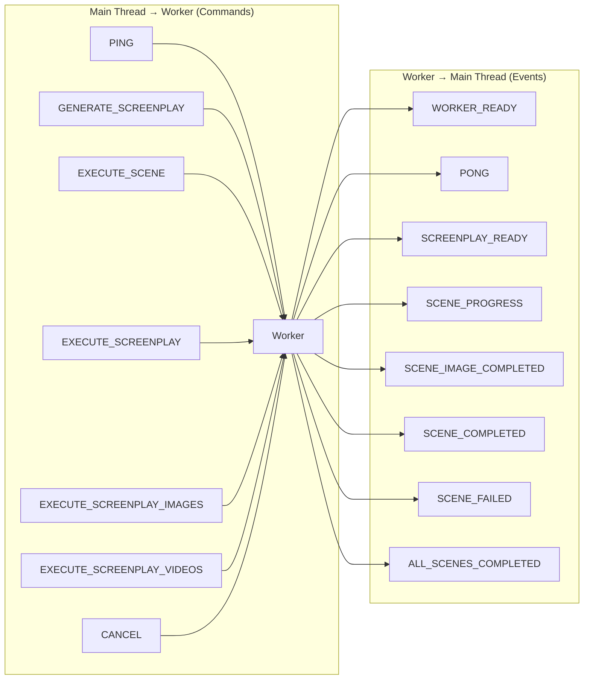
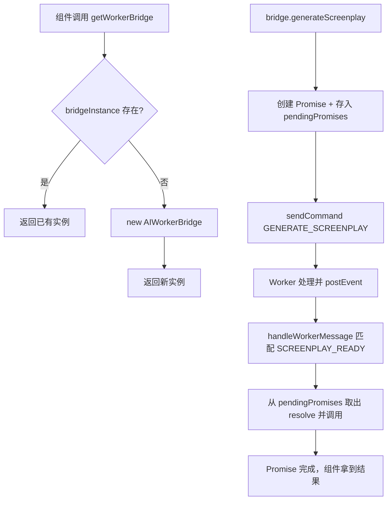

# PD-545.01 moyin-creator — AIWorkerBridge 单例桥接与 Command/Event 双向消息卸载

> 文档编号：PD-545.01
> 来源：moyin-creator `src/lib/ai/worker-bridge.ts` `src/workers/ai-worker.ts`
> GitHub：https://github.com/MemeCalculate/moyin-creator.git
> 问题域：PD-545 Web Worker 后台处理 Web Worker Offloading
> 状态：可复用方案

---

## 第 1 章 问题与动机

### 1.1 核心问题

AI 视频创作应用需要执行多种耗时任务——剧本生成（LLM 调用）、图片生成（Diffusion API + 轮询）、视频生成（视频模型 API + 轮询）。这些任务如果在主线程执行，会导致：

1. **UI 冻结**：fetch + 轮询循环阻塞事件循环，用户无法操作界面
2. **状态混乱**：多个异步任务并发时，进度回调与 UI 状态更新交织，难以管理
3. **取消困难**：主线程中取消一个正在轮询的任务需要复杂的 AbortController 编排
4. **循环依赖**：Worker 需要更新 Zustand Store，但直接 import Store 会导致 Worker 打包失败

moyin-creator 通过 **AIWorkerBridge 单例桥接模式** 解决了这些问题：将所有 AI 生成任务卸载到 Web Worker 后台线程，主线程只负责发送命令和接收事件。

### 1.2 moyin-creator 的解法概述

1. **类型安全的 Command/Event 协议**：`protocol/index.ts:16-92` 定义了 7 种 Command（主线程→Worker）和 8 种 Event（Worker→主线程），使用 TypeScript 联合类型确保消息类型安全
2. **Singleton Bridge 模式**：`worker-bridge.ts:413-433` 通过模块级变量 + `getWorkerBridge()` 工厂函数确保全局唯一实例，避免多次创建 Worker
3. **Promise 管理层**：`worker-bridge.ts:30` 使用 `Map<string, PromiseCallbacks>` 将异步 Command 转为 Promise，支持超时和错误传播
4. **动态 import 解耦**：`worker-bridge.ts:341-343` 在 Worker 回调中使用 `await import()` 动态加载 Store，避免 Worker↔Store 循环依赖
5. **两阶段批量执行**：`ai-worker.ts:642-738` 支持先批量生成图片（Step 1），再批量生成视频（Step 2），每阶段内部通过 `concurrency` 参数控制并行度

### 1.3 设计思想

| 设计原则 | 具体实现 | 理由 | 替代方案 |
|----------|----------|------|----------|
| 单例桥接 | 模块级 `bridgeInstance` + `getWorkerBridge()` | 避免多 Worker 实例竞争资源 | 每个组件创建独立 Worker（浪费内存） |
| 类型安全协议 | `WorkerCommand` / `WorkerEvent` 联合类型 | 编译期捕获消息类型错误 | 字符串 type + any payload（运行时出错） |
| 动态 import 解耦 | `await import('@/stores/...')` | Worker 回调中安全访问 Store | 通过 postMessage 回传让主线程更新（多一次通信） |
| 两阶段流水线 | EXECUTE_SCREENPLAY_IMAGES → EXECUTE_SCREENPLAY_VIDEOS | 用户可在图片阶段审核后再生成视频，节省成本 | 一次性生成全部（无法中间审核） |
| 全局取消标志 | `cancelled` 布尔变量 + 轮询检查 | 简单有效，Worker 单线程无竞态 | AbortController（Worker 中支持有限） |

---

## 第 2 章 源码实现分析

### 2.1 架构概览

moyin-creator 的 Web Worker 卸载架构分为三层：协议层、桥接层、执行层。

```
┌─────────────────────────────────────────────────────────────┐
│                     Main Thread (UI)                         │
│                                                             │
│  ┌──────────────┐    ┌──────────────────┐    ┌───────────┐ │
│  │ScreenplayInput│───→│  AIWorkerBridge   │    │ Director  │ │
│  │  (触发生成)   │    │  (Singleton)      │    │  Store    │ │
│  └──────────────┘    │                    │    └─────┬─────┘ │
│  ┌──────────────┐    │ pendingPromises    │          │       │
│  │ Generation   │───→│ eventHandlers     │←─────────┘       │
│  │ Progress     │    │ sendCommand()     │  dynamic import  │
│  │  (进度展示)   │    │ handleWorkerMsg() │                   │
│  └──────────────┘    └────────┬─────────┘                   │
│                         postMessage ↕                        │
├─────────────────────────────────────────────────────────────┤
│                     Worker Thread                            │
│                                                             │
│  ┌──────────────────────────────────────────────────────┐   │
│  │                   ai-worker.ts                        │   │
│  │  self.onmessage → switch(command.type)                │   │
│  │    GENERATE_SCREENPLAY → fetch /api/ai/screenplay     │   │
│  │    EXECUTE_SCENE → generateImage → generateVideo      │   │
│  │    EXECUTE_SCREENPLAY_IMAGES → batch image gen        │   │
│  │    EXECUTE_SCREENPLAY_VIDEOS → batch video gen        │   │
│  │    CANCEL → set cancelled = true                      │   │
│  │  postEvent() → self.postMessage(event)                │   │
│  └──────────────────────────────────────────────────────┘   │
└─────────────────────────────────────────────────────────────┘
```

### 2.2 核心实现

#### 2.2.1 Command/Event 协议定义



对应源码 `src/packages/ai-core/protocol/index.ts:16-92`：

```typescript
// 7 种 Command 类型（主线程 → Worker）
export type WorkerCommand =
  | PingCommand
  | GenerateScreenplayCommand
  | ExecuteScreenplayCommand
  | ExecuteSceneCommand
  | RetrySceneCommand
  | CancelCommand
  | UpdateConfigCommand;

// 8 种 Event 类型（Worker → 主线程）
export type WorkerEvent =
  | PongEvent
  | ScreenplayReadyEvent
  | ScreenplayErrorEvent
  | SceneProgressEvent
  | SceneCompletedEvent
  | SceneFailedEvent
  | AllScenesCompletedEvent
  | WorkerErrorEvent
  | WorkerReadyEvent;

// 类型安全的事件处理器映射
export type EventHandlers = {
  [K in EventType]?: (
    payload: Extract<WorkerEvent, { type: K }>['payload']
  ) => void;
};
```

关键设计：使用 TypeScript 的 `Extract` 条件类型，让每个事件处理器的 `payload` 参数自动推导为对应事件的 payload 类型，编译期即可捕获类型错误。

#### 2.2.2 Singleton Bridge 与 Promise 管理



对应源码 `src/lib/ai/worker-bridge.ts:27-148`：

```typescript
export class AIWorkerBridge {
  private worker: Worker | null = null;
  private eventHandlers: Partial<EventHandlers> = {};
  private pendingPromises: Map<string, PromiseCallbacks> = new Map();
  private isReady = false;
  private readyPromise: Promise<void>;
  private readyResolve: (() => void) | null = null;

  async initialize(): Promise<void> {
    if (this.worker) return; // 幂等初始化
    this.worker = new Worker(
      new URL('../../workers/ai-worker.ts', import.meta.url)
    );
    this.worker.onmessage = this.handleWorkerMessage.bind(this);
    this.worker.onerror = this.handleWorkerError.bind(this);
    await this.readyPromise; // 等待 WORKER_READY 事件
  }

  async generateScreenplay(prompt, referenceImages?, config?): Promise<AIScreenplay> {
    return new Promise((resolve, reject) => {
      const id = `screenplay_${Date.now()}`;
      this.pendingPromises.set(id, { resolve, reject });
      this.sendCommand({ type: 'GENERATE_SCREENPLAY', payload: { prompt, ... } });
    });
  }
}

// 模块级单例
let bridgeInstance: AIWorkerBridge | null = null;
export function getWorkerBridge(): AIWorkerBridge {
  if (!bridgeInstance) bridgeInstance = new AIWorkerBridge();
  return bridgeInstance;
}
```

Promise 管理的关键：`pendingPromises` Map 以 `{type}_{timestamp}` 为 key，在收到对应 Event 时通过前缀匹配找到 Promise 并 resolve/reject。`handleWorkerError` 会批量 reject 所有 pending Promise，确保不会泄漏。

### 2.3 实现细节

#### 动态 import 解耦 Store

Worker 完成场景后需要更新主线程的 Zustand Store。直接 import 会导致 Worker 打包时引入 React 等浏览器 API。moyin-creator 的解法是在 Bridge 的回调方法中使用动态 import（`worker-bridge.ts:341-343`）：

```typescript
private async handleSceneCompleted(payload): Promise<void> {
  const { useMediaStore } = await import('@/stores/media-store');
  const { useProjectStore } = await import('@/stores/project-store');
  const { useDirectorStore } = await import('@/stores/director-store');
  // ... 使用 store.getState() 更新状态
}
```

这确保了 Store 只在主线程运行时加载，Worker 打包不受影响。

#### 两阶段批量执行与并发控制

`ai-worker.ts:601-622` 实现了基于 `concurrency` 参数的批量并行处理：

```typescript
// 按 concurrency 分批，每批内 Promise.allSettled 并行
for (let i = 0; i < scenes.length; i += concurrency) {
  if (cancelled) break;
  const batch = scenes.slice(i, i + concurrency);
  await Promise.allSettled(
    batch.map(async (scene) => {
      await executeSceneInternal(screenplay.id, scene, extendedConfig, ...);
    })
  );
}
```

使用 `Promise.allSettled` 而非 `Promise.all`，确保单个场景失败不会中断整批执行。

#### 进度映射策略

每个场景的生成分为 image（0-45%）和 video（50-95%）两个阶段，下载阶段占 95-100%。`ai-worker.ts:446-472` 通过线性映射将 API 返回的进度值映射到统一的 0-100 区间：

```
image progress: API_progress × 0.45 → 0~45%
video progress: 50 + API_progress × 0.45 → 50~95%
download: 95~100%
```

#### 取消机制

`ai-worker.ts:1178-1186` 使用模块级 `cancelled` 标志，在每个轮询循环和批处理入口检查。取消后 100ms 自动重置，允许后续新任务：

```typescript
function handleCancel(command: CancelCommand): void {
  cancelled = true;
  setTimeout(() => { cancelled = false; }, 100);
}
```


---

## 第 3 章 迁移指南

### 3.1 迁移清单

**阶段 1：协议定义（1 个文件）**
- [ ] 定义 `WorkerCommand` 和 `WorkerEvent` 联合类型
- [ ] 为每种命令/事件定义独立 interface（含 `type` 字面量和 `payload`）
- [ ] 定义 `EventHandlers` 类型映射（使用 `Extract` 条件类型）

**阶段 2：Worker 实现（1 个文件）**
- [ ] 创建 Worker 文件，实现 `self.onmessage` 命令分发
- [ ] 实现各命令处理函数（含 API 调用和轮询逻辑）
- [ ] 实现进度上报和错误处理
- [ ] 实现取消标志检查

**阶段 3：Bridge 实现（1 个文件）**
- [ ] 实现 `WorkerBridge` 类（Worker 创建、消息路由、Promise 管理）
- [ ] 实现 Singleton 工厂函数
- [ ] 实现动态 import Store 更新逻辑
- [ ] 实现 `handleWorkerError` 批量 reject

**阶段 4：UI 集成**
- [ ] 在入口组件调用 `initializeWorkerBridge()`
- [ ] 在触发组件调用 `getWorkerBridge()` 发送命令
- [ ] 在进度组件注册事件处理器

### 3.2 适配代码模板

以下是一个可直接复用的最小化 Worker Bridge 模板（TypeScript）：

```typescript
// === protocol.ts ===
export type WorkerCommand =
  | { type: 'PROCESS'; payload: { taskId: string; data: unknown } }
  | { type: 'CANCEL'; payload?: { taskId?: string } };

export type WorkerEvent =
  | { type: 'READY'; payload: { version: string } }
  | { type: 'PROGRESS'; payload: { taskId: string; percent: number } }
  | { type: 'COMPLETED'; payload: { taskId: string; result: unknown } }
  | { type: 'FAILED'; payload: { taskId: string; error: string; retryable: boolean } }
  | { type: 'ERROR'; payload: { message: string } };

export type EventType = WorkerEvent['type'];
export type EventHandlers = {
  [K in EventType]?: (payload: Extract<WorkerEvent, { type: K }>['payload']) => void;
};

// === worker-bridge.ts ===
type PromiseCallbacks = {
  resolve: (value: unknown) => void;
  reject: (error: Error) => void;
};

export class TaskWorkerBridge {
  private worker: Worker | null = null;
  private handlers: Partial<EventHandlers> = {};
  private pending: Map<string, PromiseCallbacks> = new Map();
  private readyResolve: (() => void) | null = null;
  private readyPromise = new Promise<void>(r => { this.readyResolve = r; });

  async initialize(workerUrl: URL): Promise<void> {
    if (this.worker) return;
    this.worker = new Worker(workerUrl);
    this.worker.onmessage = (e) => this.dispatch(e.data);
    this.worker.onerror = (e) => this.rejectAll(e.message);
    await this.readyPromise;
  }

  on<K extends EventType>(type: K, handler: EventHandlers[K]): void {
    this.handlers[type] = handler;
  }

  async process(taskId: string, data: unknown): Promise<unknown> {
    return new Promise((resolve, reject) => {
      this.pending.set(taskId, { resolve, reject });
      this.send({ type: 'PROCESS', payload: { taskId, data } });
    });
  }

  cancel(taskId?: string): void {
    this.send({ type: 'CANCEL', payload: taskId ? { taskId } : undefined });
  }

  private send(cmd: WorkerCommand): void {
    if (!this.worker) throw new Error('Worker not initialized');
    this.worker.postMessage(cmd);
  }

  private dispatch(event: WorkerEvent): void {
    switch (event.type) {
      case 'READY':
        this.readyResolve?.();
        break;
      case 'COMPLETED':
        this.pending.get(event.payload.taskId)?.resolve(event.payload.result);
        this.pending.delete(event.payload.taskId);
        break;
      case 'FAILED':
        this.pending.get(event.payload.taskId)?.reject(new Error(event.payload.error));
        this.pending.delete(event.payload.taskId);
        break;
      default:
        (this.handlers as any)[event.type]?.(event.payload);
    }
  }

  private rejectAll(msg: string): void {
    for (const [, cb] of this.pending) cb.reject(new Error(msg));
    this.pending.clear();
  }

  terminate(): void {
    this.worker?.terminate();
    this.worker = null;
  }
}

// Singleton
let instance: TaskWorkerBridge | null = null;
export function getBridge(): TaskWorkerBridge {
  if (!instance) instance = new TaskWorkerBridge();
  return instance;
}
```

### 3.3 适用场景

| 场景 | 适用度 | 说明 |
|------|--------|------|
| AI 生成任务（图片/视频/音频） | ⭐⭐⭐ | 完美匹配：长时间 API 调用 + 轮询 + 进度上报 |
| 大文件处理（解析/转码） | ⭐⭐⭐ | CPU 密集型任务天然适合 Worker 卸载 |
| 批量数据处理 | ⭐⭐⭐ | 并发控制 + 进度追踪模式可直接复用 |
| 实时通信（WebSocket） | ⭐⭐ | 可用但 SharedWorker 更适合多标签页场景 |
| 简单 API 调用 | ⭐ | 过度设计，直接在主线程 fetch 即可 |

---

## 第 4 章 测试用例

```typescript
import { describe, it, expect, vi, beforeEach, afterEach } from 'vitest';

// Mock Worker
class MockWorker {
  onmessage: ((e: MessageEvent) => void) | null = null;
  onerror: ((e: ErrorEvent) => void) | null = null;
  private messageHandler: ((data: any) => void) | null = null;

  postMessage(data: any): void {
    this.messageHandler?.(data);
  }

  // Test helper: simulate worker sending event
  simulateEvent(event: any): void {
    this.onmessage?.({ data: event } as MessageEvent);
  }

  // Test helper: register command handler
  onCommand(handler: (data: any) => void): void {
    this.messageHandler = handler;
  }

  terminate(): void {}
}

describe('AIWorkerBridge', () => {
  let bridge: AIWorkerBridge;
  let mockWorker: MockWorker;

  beforeEach(() => {
    mockWorker = new MockWorker();
    vi.stubGlobal('Worker', vi.fn(() => mockWorker));
    bridge = new AIWorkerBridge();
  });

  afterEach(() => {
    bridge.terminate();
    vi.restoreAllMocks();
  });

  it('should initialize and wait for WORKER_READY', async () => {
    const initPromise = bridge.initialize();
    // Worker signals ready
    mockWorker.simulateEvent({ type: 'WORKER_READY', payload: { version: '1.0' } });
    await expect(initPromise).resolves.toBeUndefined();
  });

  it('should resolve generateScreenplay on SCREENPLAY_READY', async () => {
    // Initialize
    const initP = bridge.initialize();
    mockWorker.simulateEvent({ type: 'WORKER_READY', payload: { version: '1.0' } });
    await initP;

    // Capture command
    let sentCommand: any;
    mockWorker.onCommand((data) => { sentCommand = data; });

    const resultPromise = bridge.generateScreenplay('test prompt');

    // Verify command sent
    expect(sentCommand.type).toBe('GENERATE_SCREENPLAY');
    expect(sentCommand.payload.prompt).toBe('test prompt');

    // Simulate response
    const mockScreenplay = { id: 'sp_1', scenes: [] };
    mockWorker.simulateEvent({ type: 'SCREENPLAY_READY', payload: mockScreenplay });

    await expect(resultPromise).resolves.toEqual(mockScreenplay);
  });

  it('should reject all pending promises on worker error', async () => {
    const initP = bridge.initialize();
    mockWorker.simulateEvent({ type: 'WORKER_READY', payload: { version: '1.0' } });
    await initP;

    const p1 = bridge.generateScreenplay('prompt1');
    const p2 = bridge.ping();

    // Simulate worker crash
    mockWorker.onerror?.({ message: 'Worker crashed' } as ErrorEvent);

    await expect(p1).rejects.toThrow('Worker error');
    await expect(p2).rejects.toThrow('Worker error');
  });

  it('should handle event handlers for SCENE_PROGRESS', async () => {
    const initP = bridge.initialize();
    mockWorker.simulateEvent({ type: 'WORKER_READY', payload: { version: '1.0' } });
    await initP;

    const progressHandler = vi.fn();
    bridge.on('SCENE_PROGRESS', progressHandler);

    const progressPayload = { screenplayId: 'sp_1', sceneId: 1, progress: { sceneId: 1, status: 'generating', stage: 'image', progress: 45 } };
    mockWorker.simulateEvent({ type: 'SCENE_PROGRESS', payload: progressPayload });

    expect(progressHandler).toHaveBeenCalledWith(progressPayload);
  });

  it('should support cancel operation', async () => {
    const initP = bridge.initialize();
    mockWorker.simulateEvent({ type: 'WORKER_READY', payload: { version: '1.0' } });
    await initP;

    let sentCommand: any;
    mockWorker.onCommand((data) => { sentCommand = data; });

    bridge.cancel('sp_1', 2);
    expect(sentCommand.type).toBe('CANCEL');
    expect(sentCommand.payload).toEqual({ screenplayId: 'sp_1', sceneId: 2 });
  });
});

describe('Worker Batch Execution', () => {
  it('should process scenes in batches with concurrency control', async () => {
    // Verify that with concurrency=2 and 5 scenes,
    // scenes are processed in batches: [0,1], [2,3], [4]
    const scenes = Array.from({ length: 5 }, (_, i) => ({ sceneId: i }));
    const concurrency = 2;
    const executionOrder: number[] = [];

    for (let i = 0; i < scenes.length; i += concurrency) {
      const batch = scenes.slice(i, i + concurrency);
      await Promise.allSettled(
        batch.map(async (scene) => {
          executionOrder.push(scene.sceneId);
        })
      );
    }

    // Batch 1: [0,1], Batch 2: [2,3], Batch 3: [4]
    expect(executionOrder).toEqual([0, 1, 2, 3, 4]);
  });

  it('should not abort batch on single scene failure', async () => {
    const results: string[] = [];
    const tasks = [
      Promise.resolve('ok'),
      Promise.reject(new Error('fail')),
      Promise.resolve('ok'),
    ];

    const settled = await Promise.allSettled(tasks);
    settled.forEach((r, i) => {
      results.push(r.status === 'fulfilled' ? 'ok' : 'failed');
    });

    expect(results).toEqual(['ok', 'failed', 'ok']);
  });
});
```


---

## 第 5 章 跨域关联

| 关联域 | 关系类型 | 说明 |
|--------|----------|------|
| PD-03 容错与重试 | 协同 | Worker 中的 `retryable` 标志和 `RETRY_SCENE` 命令实现了场景级重试；`Promise.allSettled` 确保单场景失败不影响批次 |
| PD-04 工具系统 | 协同 | Worker 内部的 `PromptCompiler` 和 `TaskPoller` 是工具层组件，通过 Worker 隔离执行 |
| PD-10 中间件管道 | 协同 | 两阶段流水线（Images → Videos）本质是一个两步管道，每步内部又有批量并行 |
| PD-11 可观测性 | 依赖 | `SCENE_PROGRESS` 事件提供了细粒度的进度追踪（阶段 + 百分比），是可观测性的数据源 |
| PD-514 Web Worker 通信 | 依赖 | 本域的 Command/Event 协议是 PD-514 类型安全命令事件协议的具体应用 |

---

## 第 6 章 来源文件索引

| 文件 | 行范围 | 关键实现 |
|------|--------|----------|
| `src/packages/ai-core/protocol/index.ts` | L16-L194 | Command/Event 联合类型定义、EventHandlers 类型映射 |
| `src/lib/ai/worker-bridge.ts` | L27-L434 | AIWorkerBridge 类、Singleton 工厂、Promise 管理、动态 import Store |
| `src/workers/ai-worker.ts` | L84-L1207 | Worker 命令分发、场景执行、批量处理、轮询、取消 |
| `src/packages/ai-core/api/task-poller.ts` | L24-L139 | TaskPoller 动态超时轮询、网络错误容忍 |
| `src/components/panels/director/screenplay-input.tsx` | L371-L401 | UI 层调用 initializeWorkerBridge + generateScreenplay |
| `src/components/panels/director/generation-progress.tsx` | L101-L162 | UI 层注册事件处理器 + 自动启动生成 |

---

## 第 7 章 横向对比维度

```json comparison_data
{
  "project": "moyin-creator",
  "dimensions": {
    "通信协议": "TypeScript 联合类型 Command/Event 双向协议，7 种命令 + 8 种事件",
    "Worker 管理": "Singleton Bridge 模式，模块级变量 + 工厂函数，幂等初始化",
    "Promise 管理": "Map<id, callbacks> 前缀匹配，handleWorkerError 批量 reject",
    "并发控制": "concurrency 参数分批 + Promise.allSettled 容错并行",
    "取消机制": "模块级 cancelled 布尔标志 + 轮询检查 + 100ms 自动重置",
    "Store 解耦": "动态 import() 在 Bridge 回调中加载 Zustand Store，避免循环依赖",
    "执行模式": "两阶段流水线：先批量图片后批量视频，支持中间审核"
  }
}
```

### 域元数据补充

```json domain_metadata
{
  "solution_summary": "moyin-creator 通过 AIWorkerBridge 单例桥接 + TypeScript 联合类型 Command/Event 协议，将 AI 图片/视频生成任务卸载到 Web Worker，支持两阶段批量流水线和 concurrency 分批并行",
  "description": "Web Worker 卸载模式中的 Store 解耦与两阶段流水线编排",
  "sub_problems": [
    "Worker 与主线程 Store 的循环依赖解耦",
    "两阶段流水线中间审核点设计",
    "进度百分比跨阶段线性映射"
  ],
  "best_practices": [
    "动态 import() 在 Bridge 回调中加载 Store 避免 Worker 打包污染",
    "Promise.allSettled 替代 Promise.all 实现批次内容错",
    "cancelled 标志 + 100ms 自动重置实现可复用取消机制"
  ]
}
```

