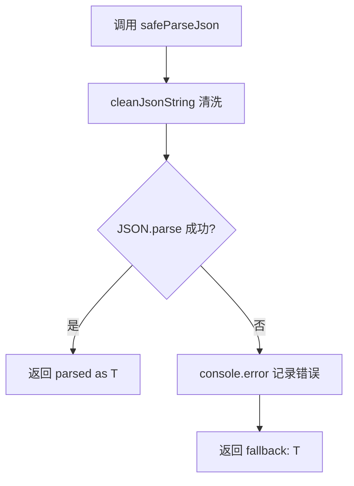
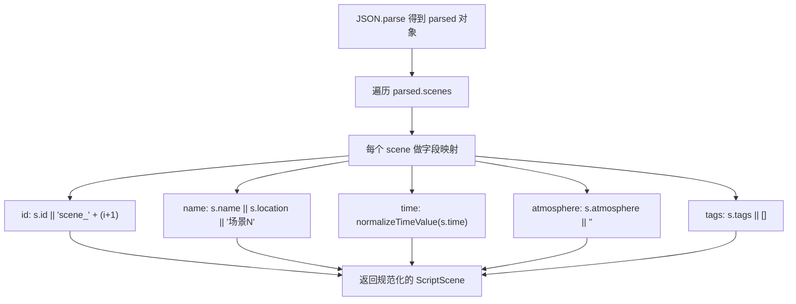

# PD-546.01 moyin-creator — 四层 AI 输出清洗与 JSON 边界提取

> 文档编号：PD-546.01
> 来源：moyin-creator `src/lib/utils/json-cleaner.ts` + `src/lib/script/script-parser.ts`
> GitHub：https://github.com/MemeCalculate/moyin-creator.git
> 问题域：PD-546 AI 输出解析与清洗 AI Output Parsing & Cleaning
> 状态：可复用方案

---

## 第 1 章 问题与动机（≥ 30 行）

### 1.1 核心问题

LLM 返回的 JSON 天然不可靠。即使 prompt 明确要求"只返回 JSON，不要包含任何其他文字"，实际输出仍然会出现以下问题：

1. **Markdown 代码围栏包裹**：模型习惯性地用 ` ```json ... ``` ` 包裹 JSON，导致直接 `JSON.parse` 失败
2. **前后夹杂自然语言**：模型在 JSON 前后添加解释性文字（"以下是分析结果："、"希望对你有帮助"等）
3. **类型不一致**：prompt 要求字符串 ID（`"char_1"`），模型返回数字 ID（`1`）
4. **字段缺失**：模型省略了 prompt 中要求的字段（如 `atmosphere`、`visualPrompt`）
5. **值域不规范**：中文时间描述（"白天"、"黄昏"）需要映射到标准枚举值（`day`、`dusk`）
6. **完全不可解析**：token 耗尽导致 JSON 截断、安全过滤导致空响应

在 moyin-creator 这个影视剧本 AI 创作工具中，几乎每个功能模块都依赖 LLM 返回结构化 JSON——剧本解析、角色校准、场景校准、分镜生成、视角分析等。一次解析失败就意味着整个创作流程中断。

### 1.2 moyin-creator 的解法概述

moyin-creator 采用**四层防御式解析架构**，从原始字符串到业务对象逐层清洗：

1. **L1 围栏剥离**（`cleanJsonString`）：正则移除 markdown 代码围栏标记（`src/lib/utils/json-cleaner.ts:13-41`）
2. **L2 边界定位**（`cleanJsonString` + `extractJson`）：通过 `indexOf`/`lastIndexOf` 定位 JSON 对象/数组的首尾边界，丢弃前后杂文（`src/lib/utils/json-cleaner.ts:26-38`、`88-98`）
3. **L3 安全解析**（`safeParseJson`）：泛型 `try/catch` 包裹 `JSON.parse`，失败时返回调用方提供的 fallback 值，绝不抛异常（`src/lib/utils/json-cleaner.ts:46-54`）
4. **L4 业务校验**（`script-parser.ts` 各 `map` 链）：对解析后的对象做字段存在性检查、默认值填充、ID 规范化、枚举值映射（`src/lib/script/script-parser.ts:491-561`）

### 1.3 设计思想

| 设计原则 | 具体实现 | 理由 | 替代方案 |
|----------|----------|------|----------|
| 防御式编程 | 每层都假设输入不可信，逐层清洗 | LLM 输出格式不可控，必须层层兜底 | 信任 LLM 输出直接 parse（脆弱） |
| 泛型 fallback | `safeParseJson<T>(str, fallback: T)` 返回类型安全的默认值 | 避免 parse 失败导致整个流程崩溃 | 抛异常让调用方处理（代码冗余） |
| 中心化工具 + 分散式校验 | 通用清洗在 `json-cleaner.ts`，业务校验在各 parser | 通用逻辑复用，业务逻辑就近维护 | 每个模块各自实现清洗（重复） |
| 枚举值映射表 | `normalizeTimeValue` 用 Record 映射中英文时间词 | AI 返回的中文需要转换为系统标准枚举 | 让 AI 直接返回英文（不可靠） |
| ID 类型归一化 | `normalizeIds` 强制 `String(item.id)` | AI 混合返回数字和字符串 ID | 在 prompt 中反复强调（仍不可靠） |

---

## 第 2 章 源码实现分析（≥ 60 行，核心章节）

### 2.1 架构概览

moyin-creator 的 AI 输出解析系统由两个核心模块组成，形成四层清洗管道：

```
┌─────────────────────────────────────────────────────────────┐
│                    AI API 原始响应                            │
│  "以下是分析结果：```json\n{\"title\":...}\n```希望有帮助"     │
└──────────────────────────┬──────────────────────────────────┘
                           ▼
┌──────────────────────────────────────────────────────────────┐
│  L1: cleanJsonString — 围栏剥离                               │
│  移除 ```json 和 ``` 标记                                     │
│  src/lib/utils/json-cleaner.ts:13-41                         │
└──────────────────────────┬───────────────────────────────────┘
                           ▼
┌──────────────────────────────────────────────────────────────┐
│  L2: 边界定位 — indexOf/lastIndexOf                           │
│  找到第一个 { 和最后一个 }，截取 JSON 子串                      │
│  src/lib/utils/json-cleaner.ts:26-38                         │
└──────────────────────────┬───────────────────────────────────┘
                           ▼
┌──────────────────────────────────────────────────────────────┐
│  L3: safeParseJson — 安全解析                                 │
│  JSON.parse + try/catch + 泛型 fallback                      │
│  src/lib/utils/json-cleaner.ts:46-54                         │
└──────────────────────────┬───────────────────────────────────┘
                           ▼
┌──────────────────────────────────────────────────────────────┐
│  L4: 业务校验 — 字段填充 + ID 规范化 + 枚举映射                │
│  script-parser.ts:491-561 / shot-calibration-stages.ts:93-101│
└──────────────────────────────────────────────────────────────┘
```

### 2.2 核心实现

#### 2.2.1 L1+L2: cleanJsonString — 围栏剥离与边界定位

```mermaid
graph TD
    A[原始字符串输入] --> B{字符串为空?}
    B -->|是| C["返回 '{}'"]
    B -->|否| D[正则移除 ```json 和 ``` 标记]
    D --> E[trim 去除首尾空白]
    E --> F{查找 JSON 边界}
    F -->|找到 { ... }| G[slice 截取对象]
    F -->|找到 [ ... ]| H[slice 截取数组]
    F -->|都没找到| I[返回 trim 后的原文]
    G --> J[返回清洗后的 JSON 字符串]
    H --> J
    I --> J
```

对应源码 `src/lib/utils/json-cleaner.ts:13-41`：

```typescript
export function cleanJsonString(str: string): string {
  if (!str) return "{}";
  
  let cleaned = str;
  
  // Remove markdown code fences (```json ... ``` or ``` ... ```)
  cleaned = cleaned.replace(/```json\s*/gi, "");
  cleaned = cleaned.replace(/```\s*/g, "");
  
  // Remove leading/trailing whitespace
  cleaned = cleaned.trim();
  
  // Try to find JSON object or array bounds
  const firstBrace = cleaned.indexOf("{");
  const firstBracket = cleaned.indexOf("[");
  const lastBrace = cleaned.lastIndexOf("}");
  const lastBracket = cleaned.lastIndexOf("]");
  
  // If we found valid JSON bounds, extract just the JSON
  if (firstBrace !== -1 && lastBrace !== -1 && firstBrace < lastBrace) {
    if (firstBracket === -1 || firstBrace < firstBracket) {
      cleaned = cleaned.slice(firstBrace, lastBrace + 1);
    }
  } else if (firstBracket !== -1 && lastBracket !== -1 && firstBracket < lastBracket) {
    cleaned = cleaned.slice(firstBracket, lastBracket + 1);
  }
  
  return cleaned;
}
```

关键设计：边界定位使用 `indexOf`/`lastIndexOf` 而非正则，因为正则 `/\{[\s\S]*\}/` 在超长字符串上有回溯性能问题。优先检测对象（`{}`）再检测数组（`[]`），符合 AI 返回 JSON 的常见模式。

#### 2.2.2 L3: safeParseJson — 泛型安全解析



对应源码 `src/lib/utils/json-cleaner.ts:46-54`：

```typescript
export function safeParseJson<T>(str: string, fallback: T): T {
  try {
    const cleaned = cleanJsonString(str);
    return JSON.parse(cleaned) as T;
  } catch (error) {
    console.error("[JSON Parse Error]", error);
    return fallback;
  }
}
```

调用示例（`src/lib/script/script-parser.ts:675`）：

```typescript
const shots = safeParseJson<any[]>(cleaned, []);
```

fallback 为空数组 `[]`，确保即使 AI 返回完全不可解析的内容，后续的 `Array.isArray(shots)` 检查和 `.map()` 链也不会崩溃。

#### 2.2.3 L4: 业务级字段校验与默认值填充



对应源码 `src/lib/script/script-parser.ts:491-501`：

```typescript
const scenes = (parsed.scenes || []).map((s: any, i: number) => ({
  id: s.id || `scene_${i + 1}`,
  name: s.name || s.location || `场景${i + 1}`,
  location: s.location || '未知地点',
  time: normalizeTimeValue(s.time),
  atmosphere: s.atmosphere || '',
  visualPrompt: s.visualPrompt || '',
  tags: s.tags || [],
  notes: s.notes || '',
  episodeId: s.episodeId,
}));
```

### 2.3 实现细节

#### normalizeTimeValue — 中英文枚举映射

`src/lib/script/script-parser.ts:21-54` 实现了一个双语时间词映射表，将 AI 返回的中文时间描述（"白天"、"黄昏"、"深夜"等 16 种变体）统一映射到 6 个标准英文枚举值（`day`/`night`/`dawn`/`dusk`/`noon`/`midnight`）：

```typescript
function normalizeTimeValue(time: string | undefined): string {
  if (!time) return 'day';
  const timeMap: Record<string, string> = {
    '白天': 'day', '日间': 'day', '上午': 'day', '下午': 'day',
    '夜晚': 'night', '夜间': 'night',
    '深夜': 'midnight', '半夜': 'midnight',
    '黄昏': 'dusk', '日落': 'dusk', '働晚': 'dusk',
    '黎明': 'dawn', '早晨': 'dawn', '清晨': 'dawn', '日出': 'dawn',
    '中午': 'noon', '正午': 'noon',
    // English pass-through
    'day': 'day', 'night': 'night', 'dawn': 'dawn',
    'dusk': 'dusk', 'noon': 'noon', 'midnight': 'midnight',
  };
  const normalized = time.toLowerCase().trim();
  return timeMap[normalized] || timeMap[time] || 'day';
}
```

#### extractJson — 正则贪婪匹配备选方案

`src/lib/utils/json-cleaner.ts:88-98` 提供了基于正则的 JSON 提取，作为 `cleanJsonString` 的补充。当文本中 JSON 嵌套在更复杂的上下文中时使用：

```typescript
export function extractJson(text: string): string | null {
  const objectMatch = text.match(/\{[\s\S]*\}/);
  if (objectMatch) return objectMatch[0];
  const arrayMatch = text.match(/\[[\s\S]*\]/);
  if (arrayMatch) return arrayMatch[0];
  return null;
}
```

#### shot-calibration-stages 的内联解析

`src/lib/script/shot-calibration-stages.ts:93-101` 在 5 阶段分镜校准中使用了与 `cleanJsonString` 相同的内联清洗模式，但增加了对 `shots` 键的自动解包：

```typescript
function parseStageJSON(raw: string): Record<string, any> {
  let cleaned = raw.replace(/^```json\s*/i, '').replace(/^```\s*/i, '')
                    .replace(/\s*```$/i, '').trim();
  const jsonStart = cleaned.indexOf('{');
  const jsonEnd = cleaned.lastIndexOf('}');
  if (jsonStart !== -1 && jsonEnd > jsonStart) {
    cleaned = cleaned.slice(jsonStart, jsonEnd + 1);
  }
  const parsed = JSON.parse(cleaned);
  return parsed.shots || parsed || {};
}
```

#### normalizeIds — 混合类型 ID 归一化

`src/lib/utils/json-cleaner.ts:60-67` 处理 AI 返回数字 ID 的问题：

```typescript
export function normalizeIds<T extends { id?: string | number }>(
  items: T[]
): (T & { id: string })[] {
  return items.map((item) => ({
    ...item,
    id: String(item.id || ""),
  }));
}
```

#### cleanArray — 类型安全的数组校验

`src/lib/utils/json-cleaner.ts:72-83` 提供可选的 type guard 校验：

```typescript
export function cleanArray<T>(
  data: unknown,
  validator?: (item: unknown) => item is T
): T[] {
  if (!Array.isArray(data)) return [];
  if (validator) {
    return data.filter(validator);
  }
  return data as T[];
}
```

---

## 第 3 章 迁移指南（≥ 40 行）

### 3.1 迁移清单

**阶段 1：基础清洗层（1 个文件）**

- [ ] 创建 `lib/utils/json-cleaner.ts`，包含 `cleanJsonString`、`safeParseJson`、`extractJson`、`normalizeIds`、`cleanArray` 五个函数
- [ ] 为 `safeParseJson` 添加泛型约束，确保 fallback 类型与返回类型一致

**阶段 2：业务校验层（按模块逐步添加）**

- [ ] 为每个 AI 调用点添加字段映射 `.map()` 链，包含默认值填充
- [ ] 为需要枚举映射的字段创建 `normalizeXxx` 函数（如时间、景别、镜头运动等）
- [ ] 在 `.map()` 链中使用 `|| ''` 或 `|| []` 为可选字段提供默认值

**阶段 3：错误恢复增强（可选）**

- [ ] 在 `safeParseJson` 中添加结构化日志（记录原始字符串前 200 字符用于调试）
- [ ] 为关键业务路径添加 fallback 重试（如 `script-parser.ts:564-567` 的 catch 块）

### 3.2 适配代码模板

以下是一个可直接复用的 AI 输出解析工具库：

```typescript
// lib/ai-output-cleaner.ts — 可直接复用的 AI 输出清洗工具库

/**
 * 清洗 AI 返回的 JSON 字符串
 * 1. 移除 markdown 代码围栏
 * 2. 定位 JSON 对象/数组边界
 */
export function cleanJsonString(str: string): string {
  if (!str) return "{}";
  let cleaned = str
    .replace(/```json\s*/gi, "")
    .replace(/```\s*/g, "")
    .trim();

  const firstBrace = cleaned.indexOf("{");
  const firstBracket = cleaned.indexOf("[");
  const lastBrace = cleaned.lastIndexOf("}");
  const lastBracket = cleaned.lastIndexOf("]");

  if (firstBrace !== -1 && lastBrace > firstBrace) {
    if (firstBracket === -1 || firstBrace < firstBracket) {
      return cleaned.slice(firstBrace, lastBrace + 1);
    }
  }
  if (firstBracket !== -1 && lastBracket > firstBracket) {
    return cleaned.slice(firstBracket, lastBracket + 1);
  }
  return cleaned;
}

/**
 * 安全解析 JSON，失败返回 fallback
 */
export function safeParseJson<T>(str: string, fallback: T): T {
  try {
    return JSON.parse(cleanJsonString(str)) as T;
  } catch {
    console.error("[AI JSON Parse Error]", str.slice(0, 200));
    return fallback;
  }
}

/**
 * 强制将混合类型 ID 归一化为字符串
 */
export function normalizeIds<T extends { id?: string | number }>(
  items: T[]
): (T & { id: string })[] {
  return items.map((item) => ({
    ...item,
    id: String(item.id || ""),
  }));
}

/**
 * 创建枚举映射函数的工厂
 * 用法：const normalizeTime = createEnumMapper(timeMap, 'day');
 */
export function createEnumMapper<T extends string>(
  mapping: Record<string, T>,
  defaultValue: T
): (input: string | undefined) => T {
  return (input) => {
    if (!input) return defaultValue;
    const normalized = input.toLowerCase().trim();
    return mapping[normalized] || mapping[input] || defaultValue;
  };
}
```

### 3.3 适用场景

| 场景 | 适用度 | 说明 |
|------|--------|------|
| LLM 返回 JSON 的任何应用 | ⭐⭐⭐ | 通用方案，几乎所有 AI 应用都需要 |
| 多语言 AI 输出（中英混合） | ⭐⭐⭐ | `normalizeTimeValue` 模式可扩展到任何枚举映射 |
| 流式 JSON 解析 | ⭐⭐ | 需要额外处理不完整 JSON 的情况 |
| 结构化输出（function calling） | ⭐ | OpenAI function calling 已保证 JSON 格式，清洗层可简化 |
| 多模型混用场景 | ⭐⭐⭐ | 不同模型的输出格式差异大，四层清洗更有价值 |

---

## 第 4 章 测试用例（≥ 20 行）

```typescript
import { describe, it, expect } from 'vitest';
import { cleanJsonString, safeParseJson, normalizeIds, extractJson, cleanArray } from './json-cleaner';

describe('cleanJsonString', () => {
  it('should remove markdown code fences', () => {
    const input = '```json\n{"title": "test"}\n```';
    expect(cleanJsonString(input)).toBe('{"title": "test"}');
  });

  it('should extract JSON from surrounding text', () => {
    const input = '以下是分析结果：\n{"title": "test"}\n希望对你有帮助';
    expect(cleanJsonString(input)).toBe('{"title": "test"}');
  });

  it('should handle JSON arrays', () => {
    const input = '```json\n[{"id": 1}, {"id": 2}]\n```';
    expect(cleanJsonString(input)).toBe('[{"id": 1}, {"id": 2}]');
  });

  it('should prefer object over array when object comes first', () => {
    const input = '{"items": [1, 2, 3]}';
    expect(cleanJsonString(input)).toBe('{"items": [1, 2, 3]}');
  });

  it('should return empty object for empty input', () => {
    expect(cleanJsonString('')).toBe('{}');
    expect(cleanJsonString(null as any)).toBe('{}');
  });
});

describe('safeParseJson', () => {
  it('should parse valid JSON after cleaning', () => {
    const result = safeParseJson('```json\n{"name": "test"}\n```', {});
    expect(result).toEqual({ name: 'test' });
  });

  it('should return fallback on invalid JSON', () => {
    const result = safeParseJson('not json at all', { default: true });
    expect(result).toEqual({ default: true });
  });

  it('should return typed fallback for arrays', () => {
    const result = safeParseJson<any[]>('broken', []);
    expect(result).toEqual([]);
    expect(Array.isArray(result)).toBe(true);
  });
});

describe('normalizeIds', () => {
  it('should convert numeric IDs to strings', () => {
    const items = [{ id: 1, name: 'a' }, { id: 2, name: 'b' }];
    const result = normalizeIds(items);
    expect(result[0].id).toBe('1');
    expect(result[1].id).toBe('2');
  });

  it('should handle missing IDs', () => {
    const items = [{ name: 'no-id' }];
    const result = normalizeIds(items);
    expect(result[0].id).toBe('');
  });

  it('should preserve string IDs', () => {
    const items = [{ id: 'char_1', name: 'a' }];
    const result = normalizeIds(items);
    expect(result[0].id).toBe('char_1');
  });
});

describe('extractJson', () => {
  it('should extract JSON object from text', () => {
    const text = 'Here is the result: {"key": "value"} end';
    expect(extractJson(text)).toBe('{"key": "value"}');
  });

  it('should return null when no JSON found', () => {
    expect(extractJson('no json here')).toBeNull();
  });
});

describe('cleanArray', () => {
  it('should return empty array for non-array input', () => {
    expect(cleanArray('not array')).toEqual([]);
    expect(cleanArray(null)).toEqual([]);
  });

  it('should filter with validator', () => {
    const isString = (x: unknown): x is string => typeof x === 'string';
    expect(cleanArray(['a', 1, 'b', null], isString)).toEqual(['a', 'b']);
  });
});
```

---

## 第 5 章 跨域关联

| 关联域 | 关系类型 | 说明 |
|--------|----------|------|
| PD-03 容错与重试 | 协同 | `safeParseJson` 的 fallback 机制是容错的最后一道防线；`script-parser.ts:288` 的 `retryOperation` 在 API 失败时重试，与解析层形成双重保护 |
| PD-04 工具系统 | 依赖 | `json-cleaner.ts` 是所有 AI 工具调用的输出处理基础设施，`callChatAPI` 返回的原始字符串必须经过清洗才能被业务层消费 |
| PD-07 质量检查 | 协同 | `shot-calibration-stages.ts` 的 5 阶段校准本质上是对 AI 输出的质量校准，`parseStageJSON` 是每个阶段的入口清洗函数 |
| PD-10 中间件管道 | 协同 | 四层清洗管道本身就是一个微型中间件管道：围栏剥离 → 边界定位 → 安全解析 → 业务校验，每层可独立替换 |
| PD-11 可观测性 | 协同 | `safeParseJson` 中的 `console.error("[JSON Parse Error]")` 和 `callChatAPI` 中的详细诊断日志（`src/lib/script/script-parser.ts:382-388`）为解析失败提供可观测性 |

---

## 第 6 章 来源文件索引

| 文件 | 行范围 | 关键实现 |
|------|--------|----------|
| `src/lib/utils/json-cleaner.ts` | L1-98 | 完整的 5 函数清洗工具库：cleanJsonString、safeParseJson、normalizeIds、cleanArray、extractJson |
| `src/lib/script/script-parser.ts` | L13-41 | cleanJsonString 的导入和使用 |
| `src/lib/script/script-parser.ts` | L21-54 | normalizeTimeValue 中英文时间枚举映射 |
| `src/lib/script/script-parser.ts` | L485-567 | parseScript 函数：L1-L3 清洗 + L4 业务校验（scenes/characters/episodes 字段填充） |
| `src/lib/script/script-parser.ts` | L674-675 | generateShotList 中 safeParseJson 的使用（fallback 为空数组） |
| `src/lib/script/script-parser.ts` | L399-406 | reasoning_content 中的 JSON 提取（正则匹配 ```json 块或含 characters 的对象） |
| `src/lib/script/shot-calibration-stages.ts` | L93-101 | parseStageJSON 内联清洗 + shots 键自动解包 |
| `src/lib/script/shot-calibration-stages.ts` | L104-139 | runStage 通用执行器中的 parseResult 回调 |

---

## 第 7 章 横向对比维度

```json comparison_data
{
  "project": "moyin-creator",
  "dimensions": {
    "清洗策略": "四层管道：围栏剥离→边界定位→安全解析→业务校验",
    "边界定位": "indexOf/lastIndexOf 优先对象再数组，O(n) 无回溯",
    "fallback 机制": "泛型 safeParseJson<T> 返回调用方指定的类型安全默认值",
    "枚举映射": "normalizeTimeValue 16 种中英文变体映射到 6 个标准值",
    "ID 归一化": "normalizeIds 泛型函数强制 String() 转换混合类型 ID",
    "内联解析": "shot-calibration-stages 内联 parseStageJSON 增加 shots 键解包"
  }
}
```

### 域元数据补充

```json domain_metadata
{
  "solution_summary": "moyin-creator 用 json-cleaner 五函数工具库 + script-parser 业务校验链实现四层 AI 输出清洗管道，覆盖围栏剥离、边界定位、安全解析、字段填充全流程",
  "description": "AI 输出从原始字符串到业务对象的逐层防御式清洗与类型归一化",
  "sub_problems": [
    "中英文枚举值双语映射（如时间词 16 种变体→6 个标准值）",
    "推理模型 reasoning_content 中的 JSON 提取"
  ],
  "best_practices": [
    "indexOf/lastIndexOf 定位边界比正则贪婪匹配性能更优且无回溯风险",
    "内联 parseStageJSON 增加业务键自动解包（如 parsed.shots || parsed）",
    "createEnumMapper 工厂函数统一生成枚举映射器避免重复代码"
  ]
}
```
