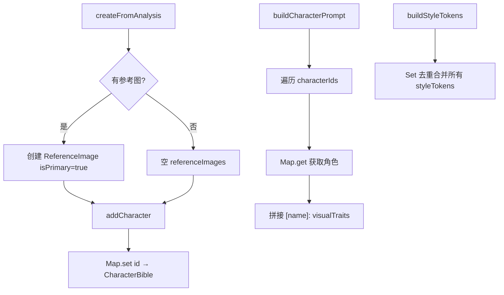
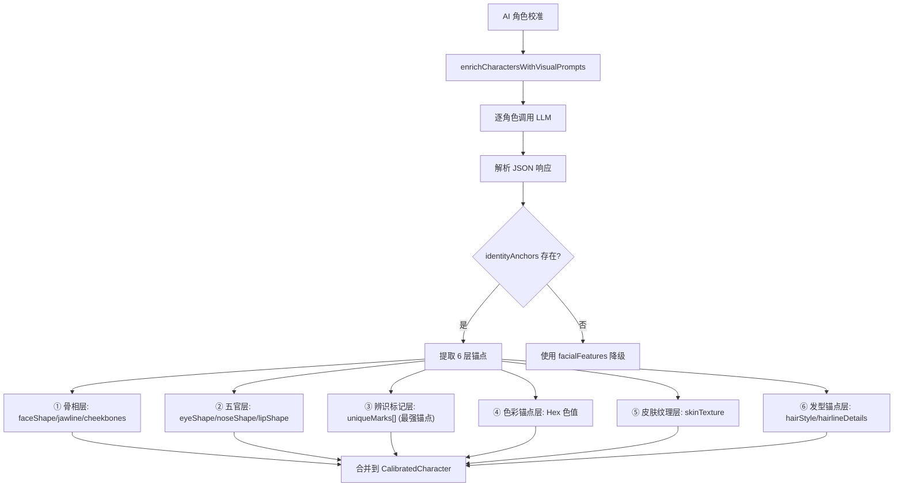

# PD-547.01 moyin-creator — 三层角色圣经与6层身份锚点一致性系统

> 文档编号：PD-547.01
> 来源：moyin-creator `src/packages/ai-core/services/character-bible.ts`, `src/stores/character-library-store.ts`, `src/lib/script/character-calibrator.ts`
> GitHub：https://github.com/MemeCalculate/moyin-creator.git
> 问题域：PD-547 角色一致性系统 Character Consistency
> 状态：可复用方案

---

## 第 1 章 问题与动机

### 1.1 核心问题

AI 图像生成中最棘手的问题之一是**角色视觉一致性**：同一角色在不同分镜、不同场景中生成的图片往往面部特征、服装、色彩差异巨大，导致视频/漫画作品中角色"变脸"。

这个问题的根源在于：
- 文生图模型（DALL-E、Midjourney、Stable Diffusion）每次生成都是独立的，没有"记忆"
- 自然语言描述角色外貌时，"大眼睛"、"黑头发"等描述太模糊，不同生成结果差异大
- 长篇剧集中角色可能跨越多个年龄阶段，需要在"变化"和"一致"之间取得平衡
- 多角色同时出现时，需要确保每个角色的视觉特征不互相污染

### 1.2 moyin-creator 的解法概述

moyin-creator 构建了一个三层角色一致性架构：

1. **CharacterBible 层**（`character-bible.ts:14-47`）：定义角色的视觉身份数据结构，包含 visualTraits、styleTokens、colorPalette 和三视图参考图，作为角色视觉一致性的"圣经"
2. **6 层身份锚点层**（`src/types/script.ts:31-60`）：CharacterIdentityAnchors 接口定义了从骨相→五官→辨识标记→色彩→皮肤纹理→发型的 6 层特征锁定系统，精确到 Hex 色值和毫米级位置描述
3. **多阶段变体层**（`character-stage-analyzer.ts:21-40`）：CharacterStageAnalysis 支持同一角色在不同剧情阶段（青年→中年→老年）拥有不同视觉变体，同时通过 consistencyElements 保持面部一致性
4. **Prompt 注入层**（`character-bible.ts:126-136`）：buildCharacterPrompt 将角色视觉特征自动注入每个分镜的生成提示词，确保跨场景一致
5. **AI 校准层**（`character-calibrator.ts:753-994`）：enrichCharactersWithVisualPrompts 调用 AI 为每个主角生成专业的 6 层身份锚点和负面提示词

### 1.3 设计思想

| 设计原则 | 具体实现 | 理由 | 替代方案 |
|----------|----------|------|----------|
| 结构化特征描述 | 6 层身份锚点替代自然语言描述 | 自然语言太模糊，结构化字段（faceShape: "oval"）可精确控制 | 纯文本 prompt 模板 |
| 负面提示词排除 | CharacterNegativePrompt 定义 avoid 和 styleExclusions | 正向描述不够，需要明确排除不符合角色的特征 | 仅依赖正向 prompt |
| 多阶段一致性 | consistencyElements 跨阶段共享 + 阶段独立 visualPrompt | 长篇剧集角色会变化，但面部骨骼不变 | 每阶段独立角色 |
| Singleton 全局共享 | CharacterBibleManager 单例模式 | 角色数据需要在分镜生成、角色库、导演面板间共享 | 每个组件独立管理 |
| AI 辅助生成 | 调用 LLM 生成 6 层锚点而非手动填写 | 手动填写 6 层锚点工作量大，AI 可从角色描述自动推断 | 纯手动配置 |

---

## 第 2 章 源码实现分析

### 2.1 架构概览

moyin-creator 的角色一致性系统由 5 个核心模块组成：

```
┌─────────────────────────────────────────────────────────────────┐
│                    Character Consistency System                   │
├─────────────────────────────────────────────────────────────────┤
│                                                                   │
│  ┌──────────────────┐    ┌──────────────────────────────────┐   │
│  │ CharacterBible   │    │ CharacterIdentityAnchors         │   │
│  │ Manager          │    │ (6-Layer Identity Lock)           │   │
│  │ (Singleton)      │    │                                    │   │
│  │                  │    │ ① faceShape / jawline / cheekbones│   │
│  │ • visualTraits   │    │ ② eyeShape / noseShape / lipShape│   │
│  │ • styleTokens    │    │ ③ uniqueMarks[] (strongest!)     │   │
│  │ • colorPalette   │    │ ④ colorAnchors (Hex values)      │   │
│  │ • threeViewImages│    │ ⑤ skinTexture                    │   │
│  │ • referenceImages│    │ ⑥ hairStyle / hairlineDetails    │   │
│  └────────┬─────────┘    └──────────────┬───────────────────┘   │
│           │                              │                       │
│           ▼                              ▼                       │
│  ┌──────────────────────────────────────────────────────────┐   │
│  │ Character Library Store (Zustand + Persist)               │   │
│  │                                                            │   │
│  │ • Character { identityAnchors, negativePrompt, views,     │   │
│  │   variations[], visualTraits, styleId }                    │   │
│  │ • CharacterVariation { episodeRange, isStageVariation }   │   │
│  │ • Split/Merge per-project storage                          │   │
│  └────────┬──────────────────────────────────┬──────────────┘   │
│           │                                    │                 │
│           ▼                                    ▼                 │
│  ┌─────────────────────┐    ┌──────────────────────────────┐   │
│  │ Character Calibrator│    │ Character Stage Analyzer      │   │
│  │ (AI Enrichment)     │    │ (Multi-Stage Detection)       │   │
│  │                     │    │                                │   │
│  │ • 6-layer anchors   │    │ • detectMultiStageHints()     │   │
│  │ • negativePrompt    │    │ • analyzeCharacterStages()    │   │
│  │ • visualPromptEn/Zh │    │ • convertStagesToVariations() │   │
│  └─────────────────────┘    └──────────────────────────────┘   │
│                                                                   │
│  ┌──────────────────────────────────────────────────────────┐   │
│  │ Prompt Injection (buildCharacterPrompt / generateConsistencyPrompt) │
│  │ → "[角色名]: visualTraits, styleTokens, character: name"  │   │
│  └──────────────────────────────────────────────────────────┘   │
└─────────────────────────────────────────────────────────────────┘
```

### 2.2 核心实现

#### 2.2.1 CharacterBible 数据模型与 Singleton Manager



对应源码 `src/packages/ai-core/services/character-bible.ts:60-155`：

```typescript
export class CharacterBibleManager {
  private characters: Map<string, CharacterBible> = new Map();
  
  // 从 AI 分析结果创建角色圣经
  createFromAnalysis(
    screenplayId: string,
    analysisResult: any,
    referenceImageUrl?: string
  ): CharacterBible {
    const referenceImages: ReferenceImage[] = [];
    if (referenceImageUrl) {
      referenceImages.push({
        id: `ref_${Date.now()}`,
        url: referenceImageUrl,
        analysisResult,
        isPrimary: true,
      });
    }
    return this.addCharacter({
      screenplayId,
      name: analysisResult.name || 'Unknown',
      type: analysisResult.type || 'other',
      visualTraits: analysisResult.visualTraits || '',
      styleTokens: analysisResult.styleTokens || [],
      colorPalette: analysisResult.colorPalette || [],
      personality: analysisResult.personality || '',
      referenceImages,
    });
  }
  
  // 构建跨场景一致性 prompt
  buildCharacterPrompt(characterIds: string[]): string {
    const characters = characterIds
      .map(id => this.characters.get(id))
      .filter((c): c is CharacterBible => c !== null);
    if (characters.length === 0) return '';
    return characters
      .map(c => `[${c.name}]: ${c.visualTraits}`)
      .join('; ');
  }
  
  // 去重合并 styleTokens
  buildStyleTokens(characterIds: string[]): string[] {
    const tokenSet = new Set<string>();
    for (const c of characterIds
      .map(id => this.characters.get(id))
      .filter((c): c is CharacterBible => c !== null)) {
      for (const token of c.styleTokens) {
        tokenSet.add(token);
      }
    }
    return Array.from(tokenSet);
  }
}

// Singleton 模式
let managerInstance: CharacterBibleManager | null = null;
export function getCharacterBibleManager(): CharacterBibleManager {
  if (!managerInstance) {
    managerInstance = new CharacterBibleManager();
  }
  return managerInstance;
}
```

#### 2.2.2 6 层身份锚点系统



对应源码 `src/types/script.ts:31-69`：

```typescript
export interface CharacterIdentityAnchors {
  // ① 骨相层 - 面部骨骼结构
  faceShape?: string;       // oval/square/heart/round/diamond/oblong
  jawline?: string;         // sharp angular/soft rounded/prominent
  cheekbones?: string;      // high prominent/subtle/wide set
  
  // ② 五官层 - 眼鼻唇精确描述
  eyeShape?: string;        // almond/round/hooded/monolid/upturned
  eyeDetails?: string;      // double eyelids, slight epicanthic fold
  noseShape?: string;       // straight bridge, rounded tip, medium width
  lipShape?: string;        // full lips, defined cupid's bow
  
  // ③ 辨识标记层 - 最强锚点
  uniqueMarks: string[];    // 必填！"small mole 2cm below left eye"
  
  // ④ 色彩锚点层 - Hex色值
  colorAnchors?: {
    iris?: string;          // #3D2314 (dark brown)
    hair?: string;          // #1A1A1A (jet black)
    skin?: string;          // #E8C4A0 (warm beige)
    lips?: string;          // #C4727E (dusty rose)
  };
  
  // ⑤ 皮肤纹理层
  skinTexture?: string;     // visible pores on nose, light smile lines
  
  // ⑥ 发型锚点层
  hairStyle?: string;       // shoulder-length, layered, side-parted
  hairlineDetails?: string; // natural hairline, slight widow's peak
}

export interface CharacterNegativePrompt {
  avoid: string[];          // ["blonde hair", "blue eyes", "beard"]
  styleExclusions?: string[]; // ["anime style", "cartoon"]
}
```


### 2.3 实现细节

#### 多阶段变体与集数匹配

CharacterStageAnalyzer 通过分析剧本大纲自动检测角色是否需要多阶段形象（`character-stage-analyzer.ts:222-304`），然后为每个阶段生成独立的 visualPrompt，同时通过 consistencyElements 保持面部一致性。

关键数据流：

```
剧本大纲 → detectMultiStageHints() → 是否需要多阶段?
    ↓ 是
analyzeCharacterStages() → AI 分析 → CharacterStageAnalysis[]
    ↓
convertStagesToVariations() → CharacterVariation[]
    ↓
getVariationForEpisode(variations, episodeIndex) → 当前集数的变体
```

每个变体的 visualPrompt 由 consistencyElements（不变特征）+ 阶段独立 prompt 拼接而成（`character-stage-analyzer.ts:177-191`）：

```typescript
export function convertStagesToVariations(
  analysis: CharacterStageAnalysis
): Omit<CharacterVariation, 'id'>[] {
  return analysis.stages.map(stage => ({
    name: stage.name,
    visualPrompt: [
      analysis.consistencyElements.facialFeatures,
      analysis.consistencyElements.bodyType,
      analysis.consistencyElements.uniqueMarks,
      stage.visualPromptEn,
    ].filter(Boolean).join(', '),
    visualPromptZh: stage.visualPromptZh,
    isStageVariation: true,
    episodeRange: stage.episodeRange,
    ageDescription: stage.ageDescription,
    stageDescription: stage.stageDescription,
  }));
}
```

#### 多参考图合并分析

当同一角色有多张参考图时，`mergeCharacterAnalyses`（`character-bible.ts:256-300`）采用"最长描述优先 + Set 去重合并"策略：
- visualTraits：取所有分析结果中最长（最详细）的描述
- styleTokens：Set 去重合并所有分析的 token
- colorPalette：Set 去重合并所有色值
- personality：取第一个非空值

#### Zustand 持久化与项目隔离

Character Library Store（`character-library-store.ts:166-196`）使用 splitCharData/mergeCharData 实现按项目隔离存储：

```typescript
function splitCharData(state: CharPersistedState, pid: string) {
  return {
    projectData: {
      folders: state.folders.filter((f) => f.projectId === pid),
      characters: state.characters.filter((c) => c.projectId === pid),
      currentFolderId: state.currentFolderId,
    },
    sharedData: {
      folders: state.folders.filter((f) => !f.projectId),
      characters: state.characters.filter((c) => !c.projectId),
      currentFolderId: null,
    },
  };
}
```

持久化时剥离 base64 数据避免 localStorage 配额溢出（`character-library-store.ts:450-466`）。

---

## 第 3 章 迁移指南

### 3.1 迁移清单

**阶段 1：核心数据模型（1-2 天）**
- [ ] 定义 CharacterIdentityAnchors 接口（6 层结构）
- [ ] 定义 CharacterNegativePrompt 接口
- [ ] 定义 CharacterBible 接口（含 visualTraits、styleTokens、colorPalette、referenceImages）
- [ ] 实现 CharacterBibleManager 单例（Map 存储 + CRUD）

**阶段 2：Prompt 注入（1 天）**
- [ ] 实现 buildCharacterPrompt：将角色视觉特征拼接为 `[name]: traits` 格式
- [ ] 实现 buildStyleTokens：Set 去重合并多角色 styleTokens
- [ ] 实现 generateConsistencyPrompt：组合 visualTraits + styleTokens + name
- [ ] 在图像生成调用处注入角色 prompt

**阶段 3：AI 锚点生成（2-3 天）**
- [ ] 实现 enrichCharactersWithVisualPrompts：调用 LLM 生成 6 层锚点
- [ ] 设计 system prompt（角色设计大师 + 6 层锚点输出格式）
- [ ] 实现 JSON 解析与容错（截断修复、部分结果降级）
- [ ] 逐角色调用避免输出截断

**阶段 4：多阶段变体（可选，1-2 天）**
- [ ] 实现 detectMultiStageHints：关键词检测是否需要多阶段
- [ ] 实现 analyzeCharacterStages：AI 分析阶段划分
- [ ] 实现 getVariationForEpisode：按集数匹配变体
- [ ] 变体 prompt = consistencyElements + 阶段独立 prompt

### 3.2 适配代码模板

以下是一个可直接运行的最小化角色一致性系统：

```typescript
// === 1. 数据模型 ===
interface IdentityAnchors {
  faceShape?: string;
  eyeShape?: string;
  uniqueMarks: string[];  // 最强锚点，必填
  colorAnchors?: { iris?: string; hair?: string; skin?: string };
  hairStyle?: string;
}

interface NegativePrompt {
  avoid: string[];
  styleExclusions?: string[];
}

interface CharacterProfile {
  id: string;
  name: string;
  visualTraits: string;
  styleTokens: string[];
  identityAnchors?: IdentityAnchors;
  negativePrompt?: NegativePrompt;
}

// === 2. Singleton Manager ===
class CharacterManager {
  private static instance: CharacterManager;
  private characters = new Map<string, CharacterProfile>();
  
  static getInstance(): CharacterManager {
    if (!this.instance) this.instance = new CharacterManager();
    return this.instance;
  }
  
  add(profile: CharacterProfile): void {
    this.characters.set(profile.id, profile);
  }
  
  // 核心：构建跨场景一致性 prompt
  buildPrompt(ids: string[]): string {
    return ids
      .map(id => this.characters.get(id))
      .filter(Boolean)
      .map(c => `[${c!.name}]: ${c!.visualTraits}`)
      .join('; ');
  }
  
  // 构建完整的一致性 prompt（含锚点）
  buildFullPrompt(id: string): string {
    const c = this.characters.get(id);
    if (!c) return '';
    const parts = [c.visualTraits];
    if (c.identityAnchors?.uniqueMarks?.length) {
      parts.push(c.identityAnchors.uniqueMarks.join(', '));
    }
    if (c.styleTokens.length) {
      parts.push(c.styleTokens.join(', '));
    }
    parts.push(`character: ${c.name}`);
    return parts.join(', ');
  }
  
  // 构建负面提示词
  buildNegativePrompt(id: string): string {
    const c = this.characters.get(id);
    if (!c?.negativePrompt) return '';
    return [
      ...c.negativePrompt.avoid,
      ...(c.negativePrompt.styleExclusions || []),
    ].join(', ');
  }
  
  // 去重合并多角色 styleTokens
  mergeStyleTokens(ids: string[]): string[] {
    const set = new Set<string>();
    for (const id of ids) {
      const c = this.characters.get(id);
      if (c) c.styleTokens.forEach(t => set.add(t));
    }
    return Array.from(set);
  }
}

// === 3. 使用示例 ===
const mgr = CharacterManager.getInstance();
mgr.add({
  id: 'char_1',
  name: '张明',
  visualTraits: '30 year old Chinese male, sharp jawline, confident gaze',
  styleTokens: ['realistic', 'cinematic lighting', 'detailed skin texture'],
  identityAnchors: {
    faceShape: 'oval',
    eyeShape: 'almond',
    uniqueMarks: ['small mole below left eye', 'faint scar on right eyebrow'],
    colorAnchors: { iris: '#3D2314', hair: '#1A1A1A', skin: '#E8C4A0' },
    hairStyle: 'short neat business cut',
  },
  negativePrompt: {
    avoid: ['blonde hair', 'blue eyes', 'beard'],
    styleExclusions: ['anime', 'cartoon'],
  },
});

// 生成图片时注入
const prompt = `scene description, ${mgr.buildFullPrompt('char_1')}`;
const negative = mgr.buildNegativePrompt('char_1');
// → 传给图像生成 API 的 prompt 和 negative_prompt
```

### 3.3 适用场景

| 场景 | 适用度 | 说明 |
|------|--------|------|
| AI 漫画/短剧生成 | ⭐⭐⭐ | 核心场景，多分镜角色一致性 |
| AI 绘本创作 | ⭐⭐⭐ | 角色跨页面一致性 |
| 游戏角色设计 | ⭐⭐ | 多视角设定图生成 |
| 虚拟主播形象管理 | ⭐⭐ | 固定角色多场景一致性 |
| 单张图片生成 | ⭐ | 不需要跨场景一致性 |

---

## 第 4 章 测试用例

```typescript
import { describe, it, expect, beforeEach } from 'vitest';

// 测试 CharacterBibleManager
describe('CharacterBibleManager', () => {
  let manager: CharacterBibleManager;
  
  beforeEach(() => {
    manager = new CharacterBibleManager();
  });
  
  it('should create character from analysis result', () => {
    const char = manager.createFromAnalysis('sp_1', {
      name: '张明',
      type: 'protagonist',
      visualTraits: '30yo Chinese male, sharp jawline',
      styleTokens: ['realistic', 'cinematic'],
      colorPalette: ['#1A1A1A', '#E8C4A0'],
      personality: '自信果断',
    }, 'https://example.com/ref.png');
    
    expect(char.name).toBe('张明');
    expect(char.visualTraits).toBe('30yo Chinese male, sharp jawline');
    expect(char.styleTokens).toEqual(['realistic', 'cinematic']);
    expect(char.referenceImages).toHaveLength(1);
    expect(char.referenceImages[0].isPrimary).toBe(true);
  });
  
  it('should build character prompt for multiple characters', () => {
    const c1 = manager.addCharacter({
      screenplayId: 'sp_1', name: '张明', type: 'protagonist',
      visualTraits: 'male, sharp jawline', styleTokens: ['realistic'],
      colorPalette: [], personality: '', referenceImages: [],
    });
    const c2 = manager.addCharacter({
      screenplayId: 'sp_1', name: '李芳', type: 'supporting',
      visualTraits: 'female, gentle face', styleTokens: ['soft lighting'],
      colorPalette: [], personality: '', referenceImages: [],
    });
    
    const prompt = manager.buildCharacterPrompt([c1.id, c2.id]);
    expect(prompt).toContain('[张明]: male, sharp jawline');
    expect(prompt).toContain('[李芳]: female, gentle face');
    expect(prompt).toContain('; ');
  });
  
  it('should deduplicate style tokens across characters', () => {
    const c1 = manager.addCharacter({
      screenplayId: 'sp_1', name: 'A', type: 'protagonist',
      visualTraits: '', styleTokens: ['realistic', 'cinematic'],
      colorPalette: [], personality: '', referenceImages: [],
    });
    const c2 = manager.addCharacter({
      screenplayId: 'sp_1', name: 'B', type: 'supporting',
      visualTraits: '', styleTokens: ['cinematic', 'detailed'],
      colorPalette: [], personality: '', referenceImages: [],
    });
    
    const tokens = manager.buildStyleTokens([c1.id, c2.id]);
    expect(tokens).toEqual(['realistic', 'cinematic', 'detailed']);
  });
  
  it('should return empty string for unknown character IDs', () => {
    const prompt = manager.buildCharacterPrompt(['nonexistent']);
    expect(prompt).toBe('');
  });
});

// 测试 mergeCharacterAnalyses
describe('mergeCharacterAnalyses', () => {
  it('should pick longest visualTraits from multiple analyses', () => {
    const result = mergeCharacterAnalyses([
      { visualTraits: 'short desc', styleTokens: ['a'], colorPalette: ['#000'] },
      { visualTraits: 'a much longer and more detailed description', styleTokens: ['b'], colorPalette: ['#fff'] },
    ]);
    
    expect(result.visualTraits).toBe('a much longer and more detailed description');
    expect(result.styleTokens).toEqual(expect.arrayContaining(['a', 'b']));
    expect(result.colorPalette).toEqual(expect.arrayContaining(['#000', '#fff']));
  });
  
  it('should handle single analysis', () => {
    const result = mergeCharacterAnalyses([
      { visualTraits: 'only one', styleTokens: ['x'], colorPalette: [] },
    ]);
    expect(result.visualTraits).toBe('only one');
  });
  
  it('should return empty for no analyses', () => {
    const result = mergeCharacterAnalyses([]);
    expect(result).toEqual({});
  });
});

// 测试 getVariationForEpisode
describe('getVariationForEpisode', () => {
  const variations: CharacterVariation[] = [
    { id: 'v1', name: '青年版', visualPrompt: 'young', isStageVariation: true, episodeRange: [1, 15] },
    { id: 'v2', name: '中年版', visualPrompt: 'mature', isStageVariation: true, episodeRange: [16, 40] },
    { id: 'v3', name: '日常装', visualPrompt: 'casual', isStageVariation: false },
  ];
  
  it('should match correct stage by episode index', () => {
    expect(getVariationForEpisode(variations, 5)?.name).toBe('青年版');
    expect(getVariationForEpisode(variations, 20)?.name).toBe('中年版');
  });
  
  it('should return undefined for non-stage variations', () => {
    expect(getVariationForEpisode(variations, 50)).toBeUndefined();
  });
  
  it('should ignore non-stage variations', () => {
    const result = getVariationForEpisode([variations[2]], 1);
    expect(result).toBeUndefined();
  });
});
```


---

## 第 5 章 跨域关联

| 关联域 | 关系类型 | 说明 |
|--------|----------|------|
| PD-04 工具系统 | 协同 | CharacterBibleManager 作为工具被分镜生成服务调用，buildCharacterPrompt 是图像生成工具链的一环 |
| PD-06 记忆持久化 | 依赖 | Character Library Store 使用 Zustand persist + splitStorage 实现角色数据的项目级持久化，依赖 IndexedDB 迁移 |
| PD-01 上下文管理 | 协同 | 6 层身份锚点本质上是一种结构化的上下文压缩——将角色视觉信息从自然语言压缩为结构化字段，减少 prompt token 消耗 |
| PD-07 质量检查 | 协同 | negativePrompt 机制是一种质量控制手段，通过排除不符合角色设定的特征来提升生成质量 |
| PD-10 中间件管道 | 协同 | buildCharacterPrompt 可视为图像生成管道中的一个中间件，在 prompt 构建阶段注入角色一致性信息 |
| PD-513 角色一致性 | 同域 | PD-513 与 PD-547 是同一问题域的不同编号，本文档覆盖了角色一致性的完整实现 |

---

## 第 6 章 来源文件索引

| 文件 | 行范围 | 关键实现 |
|------|--------|----------|
| `src/packages/ai-core/services/character-bible.ts` | L14-L47 | CharacterBible 接口定义（visualTraits, styleTokens, threeViewImages） |
| `src/packages/ai-core/services/character-bible.ts` | L60-L211 | CharacterBibleManager 类（Singleton, CRUD, buildCharacterPrompt） |
| `src/packages/ai-core/services/character-bible.ts` | L233-L300 | generateConsistencyPrompt + mergeCharacterAnalyses |
| `src/types/script.ts` | L31-L60 | CharacterIdentityAnchors 6 层身份锚点接口 |
| `src/types/script.ts` | L66-L69 | CharacterNegativePrompt 负面提示词接口 |
| `src/stores/character-library-store.ts` | L44-L94 | Character 接口（含 identityAnchors, variations, views） |
| `src/stores/character-library-store.ts` | L166-L196 | splitCharData/mergeCharData 项目级存储隔离 |
| `src/stores/character-library-store.ts` | L200-L487 | Zustand store 完整实现（CRUD + Wardrobe + Persist） |
| `src/lib/script/character-calibrator.ts` | L753-L994 | enrichCharactersWithVisualPrompts AI 6 层锚点生成 |
| `src/lib/script/character-calibrator.ts` | L699-L731 | convertToScriptCharacters 锚点合并到角色数据 |
| `src/lib/character/character-prompt-service.ts` | L43-L61 | CharacterDesign 接口（consistencyElements 跨阶段一致性） |
| `src/lib/character/character-prompt-service.ts` | L312-L343 | getCharacterPromptForEpisode 按集数获取阶段 prompt |
| `src/lib/character/character-prompt-service.ts` | L352-L366 | convertDesignToVariations 设计转变体 |
| `src/lib/script/character-stage-analyzer.ts` | L54-L164 | analyzeCharacterStages AI 多阶段分析 |
| `src/lib/script/character-stage-analyzer.ts` | L170-L216 | convertStagesToVariations + getVariationForEpisode |
| `src/lib/script/character-stage-analyzer.ts` | L222-L304 | detectMultiStageHints 关键词检测 |
| `src/components/panels/characters/character-generator.tsx` | L89-L143 | handleGenerateSheet 角色设定图生成流程 |
| `src/components/panels/characters/character-generator.tsx` | L397-L442 | buildCharacterSheetPrompt 设定图 prompt 构建 |
| `src/lib/ai/image-generator.ts` | L81-L166 | generateCharacterImage 多提供商图像生成 |

---

## 第 7 章 横向对比维度

```json comparison_data
{
  "project": "moyin-creator",
  "dimensions": {
    "一致性模型": "6层身份锚点（骨相→五官→辨识标记→色彩Hex→皮肤纹理→发型）+ negativePrompt 排除",
    "特征存储": "CharacterBible Map + Zustand persist splitStorage 项目级隔离",
    "Prompt注入": "buildCharacterPrompt 拼接 [name]: visualTraits 格式注入分镜 prompt",
    "多阶段支持": "CharacterVariation episodeRange 按集数匹配 + consistencyElements 跨阶段共享",
    "AI辅助生成": "逐角色调用 LLM 生成 6 层锚点 + 负面提示词，单角色 4096 token 避免截断",
    "参考图策略": "多参考图 mergeAnalyses 最长描述优先 + Set 去重合并 styleTokens/colorPalette"
  }
}
```

### 域元数据补充

```json domain_metadata
{
  "solution_summary": "moyin-creator 通过 6 层身份锚点（骨相/五官/辨识标记/色彩Hex/皮肤纹理/发型）+ CharacterBible Singleton + negativePrompt 排除机制实现跨场景角色视觉一致性",
  "description": "AI 生图场景下通过结构化特征锁定和负面排除保持角色跨分镜视觉一致",
  "sub_problems": [
    "负面提示词排除不符合角色设定的生成结果",
    "长篇剧集角色多阶段形象按集数自动匹配",
    "AI 自动生成结构化身份锚点替代手动填写",
    "多角色同场景 styleTokens 去重防止特征污染"
  ],
  "best_practices": [
    "6 层递进式特征锁定：辨识标记层（uniqueMarks）是最强锚点",
    "色彩锚点使用 Hex 色值而非自然语言描述",
    "逐角色调用 LLM 生成锚点避免批量输出截断",
    "consistencyElements 跨阶段共享 + 阶段独立 prompt 拼接"
  ]
}
```

