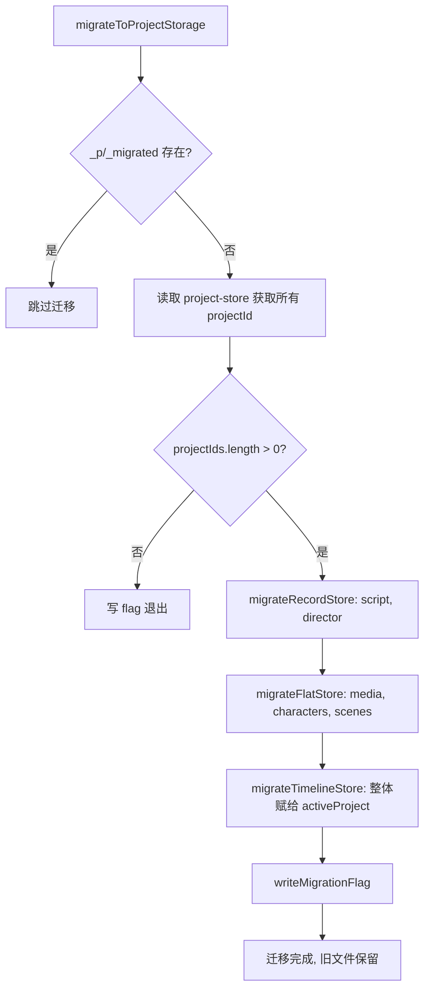
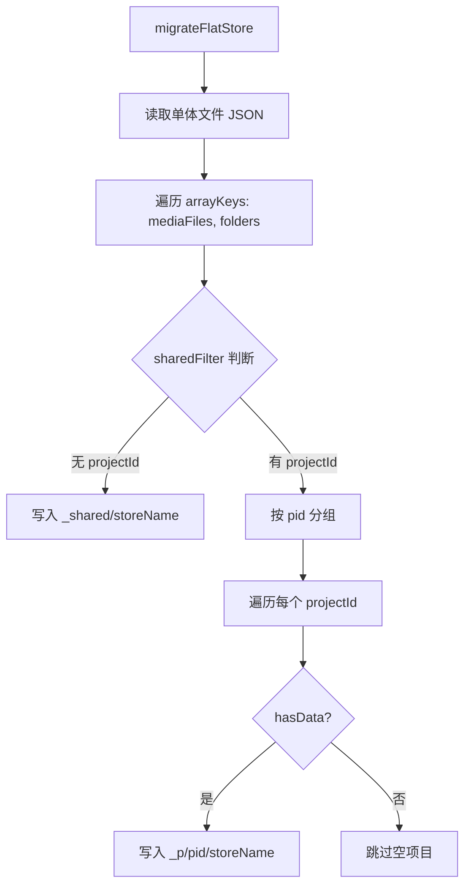
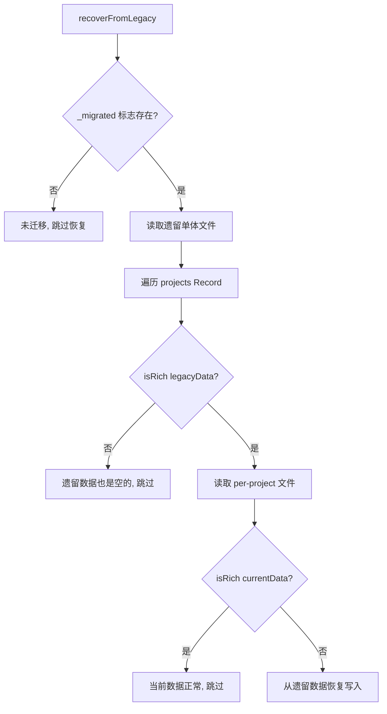

# PD-548.01 moyin-creator — 三层安全迁移与遗留数据自动恢复

> 文档编号：PD-548.01
> 来源：moyin-creator `src/lib/storage-migration.ts` `src/lib/project-storage.ts` `src/lib/project-switcher.ts`
> GitHub：https://github.com/MemeCalculate/moyin-creator.git
> 问题域：PD-548 数据迁移与恢复 Data Migration & Recovery
> 状态：可复用方案

---

## 第 1 章 问题与动机

### 1.1 核心问题

Electron 桌面应用在演进过程中，存储架构从"单体 JSON 文件"升级到"per-project 目录结构"。这带来两个关键挑战：

1. **数据迁移**：已有用户的数据存储在单体文件中（如 `moyin-script-store`、`moyin-director-store`），需要安全拆分到 `_p/{projectId}/` 目录下，同时将共享资源（无 projectId 的素材、角色、场景）分离到 `_shared/` 目录
2. **数据恢复**：项目切换（switchProject）存在一个时序 bug——`setActiveProjectId()` 在 `rehydrate()` 之前执行，触发 Zustand persist 写入空默认值覆盖了 per-project 文件。需要从遗留单体文件中恢复被覆盖的数据

### 1.2 moyin-creator 的解法概述

moyin-creator 实现了一套三层防御的迁移与恢复体系：

1. **幂等迁移引擎**（`migrateToProjectStorage`）：通过 `_p/_migrated` 标志位保证只执行一次，支持 Record 和 FlatArray 两种迁移策略（`src/lib/storage-migration.ts:23`）
2. **双策略数据拆分**：Record 型 store（script/director）按 `projects[pid]` 键直接拆分；FlatArray 型 store（media/characters/scenes）按 `projectIdField` 过滤 + `sharedFilter` 分离共享数据（`src/lib/storage-migration.ts:107-218`）
3. **richness 驱动的自动恢复**（`recoverFromLegacy`）：每次启动对比 per-project 文件与遗留单体文件的"丰富度"，空数据自动从遗留文件恢复（`src/lib/storage-migration.ts:254-362`）
4. **竞态安全的存储适配器**：`createProjectScopedStorage` 从 persist 数据中提取 `activeProjectId` 而非依赖全局状态，防止跨项目写入覆盖（`src/lib/project-storage.ts:96-133`）
5. **启动阻塞保护**：App.tsx 在迁移完成前显示 loading 界面，阻止 store rehydration 读到未迁移的数据（`src/App.tsx:18-28`）

### 1.3 设计思想

| 设计原则 | 具体实现 | 理由 | 替代方案 |
|----------|----------|------|----------|
| 幂等执行 | `_p/_migrated` 标志位，迁移前检查 | 用户可能多次重启，迁移必须安全重入 | 版本号比较（更复杂） |
| 先写后标记 | 先写入所有 per-project 文件，最后才写 flag | 中途崩溃不会丢数据，下次重启重新迁移 | 事务式写入（浏览器不支持） |
| 保留旧文件 | 迁移后不删除单体文件，作为 fallback | 恢复机制需要读取遗留数据 | 重命名为 .bak（增加复杂度） |
| richness 比较 | `isScriptDataRich` / `isDirectorDataRich` 检查实际内容 | 空 JSON 结构也是合法数据，不能只看文件是否存在 | 时间戳比较（不可靠） |
| 数据来源优先级 | persist 数据中的 pid > 全局 activeProjectId | 防止 rehydration 竞态导致写入错误项目 | 加锁（过度工程） |

---

## 第 2 章 源码实现分析

### 2.1 架构概览

moyin-creator 的存储迁移系统由四个核心模块组成，在应用启动时按严格顺序执行：

```
┌─────────────────────────────────────────────────────────────────┐
│                        App.tsx (启动入口)                        │
│  useEffect → migrateToProjectStorage() → recoverFromLegacy()   │
│  isMigrating=true 时显示 Loading，阻止 store rehydration        │
└──────────────┬──────────────────────────┬───────────────────────┘
               │                          │
               ▼                          ▼
┌──────────────────────────┐  ┌──────────────────────────────────┐
│  storage-migration.ts    │  │  project-storage.ts              │
│                          │  │                                  │
│  migrateToProjectStorage │  │  createProjectScopedStorage()    │
│  ├─ migrateRecordStore   │  │  ├─ getItem: pid路由 + fallback  │
│  ├─ migrateFlatStore     │  │  └─ setItem: 从data提取pid防竞态 │
│  └─ migrateTimelineStore │  │                                  │
│                          │  │  createSplitStorage()            │
│  recoverFromLegacy       │  │  ├─ getItem: 多项目合并(sharing) │
│  ├─ isScriptDataRich     │  │  └─ setItem: splitFn拆分写入     │
│  ├─ isDirectorDataRich   │  │                                  │
│  └─ recoverRecordStore   │  └──────────────────────────────────┘
└──────────────────────────┘
               │                          │
               ▼                          ▼
┌──────────────────────────┐  ┌──────────────────────────────────┐
│  indexed-db-storage.ts   │  │  project-switcher.ts             │
│                          │  │                                  │
│  fileStorage adapter     │  │  switchProject()                 │
│  ├─ 三源richness比较     │  │  1. setActiveProject(newId)      │
│  │  (file > local > idb) │  │  2. rehydrate() 所有 store       │
│  └─ 自动迁移到file存储   │  │  3. setActiveProjectId(newId)    │
└──────────────────────────┘  └──────────────────────────────────┘
```

### 2.2 核心实现

#### 2.2.1 幂等迁移入口与 Record 策略



对应源码 `src/lib/storage-migration.ts:23-103`：

```typescript
export async function migrateToProjectStorage(): Promise<void> {
  if (!window.fileStorage) return;

  // 幂等检查：标志位存在则跳过
  try {
    const flagExists = await window.fileStorage.exists(MIGRATION_FLAG_KEY);
    if (flagExists) {
      console.log('[Migration] Already migrated, skipping.');
      return;
    }
  } catch {
    const flag = await fileStorage.getItem(MIGRATION_FLAG_KEY);
    if (flag) return;
  }

  try {
    // 读取项目索引
    const projectStoreRaw = await fileStorage.getItem('moyin-project-store');
    if (!projectStoreRaw) {
      await writeMigrationFlag();
      return;
    }
    const projectStoreData = JSON.parse(projectStoreRaw);
    const projectState = projectStoreData.state ?? projectStoreData;
    const projectIds: string[] = (projectState.projects ?? []).map((p: any) => p.id);

    // Record 型迁移：按 projects[pid] 键直接拆分
    await migrateRecordStore('moyin-script-store', 'script', projectIds);
    await migrateRecordStore('moyin-director-store', 'director', projectIds);

    // FlatArray 型迁移：按 projectIdField 过滤
    await migrateFlatStore('moyin-media-store', 'media', projectIds, {
      arrayKeys: ['mediaFiles', 'folders'],
      projectIdField: 'projectId',
      sharedFilter: (item: any, key: string) => {
        if (key === 'folders') return item.isSystem || !item.projectId;
        return !item.projectId;
      },
    });

    // 最后写标志位
    await writeMigrationFlag();
  } catch (error) {
    console.error('[Migration] ❌ Migration failed:', error);
    // 不写 flag，下次启动重试
  }
}
```

Record 型迁移的核心逻辑（`src/lib/storage-migration.ts:107-152`）：单体文件中 `state.projects` 是一个 `Record<string, ProjectData>`，直接按 key 拆分写入 `_p/{pid}/{storeName}`。

#### 2.2.2 FlatArray 迁移策略与 shared/project 分离



对应源码 `src/lib/storage-migration.ts:162-218`：

```typescript
async function migrateFlatStore(
  legacyKey: string,
  storeName: string,
  projectIds: string[],
  config: FlatMigrationConfig,
): Promise<void> {
  const raw = await fileStorage.getItem(legacyKey);
  if (!raw) return;

  const parsed = JSON.parse(raw);
  const state = parsed.state ?? parsed;
  const version = parsed.version ?? 0;

  // 1. 收集共享数据（无 projectId 的项）
  const sharedState: Record<string, any[]> = {};
  for (const key of config.arrayKeys) {
    const arr = state[key] ?? [];
    sharedState[key] = arr.filter((item: any) => config.sharedFilter(item, key));
  }
  await fileStorage.setItem(`_shared/${storeName}`, JSON.stringify({ state: sharedState, version }));

  // 2. 按 projectId 分组写入 per-project 文件
  for (const pid of projectIds) {
    const projectState: Record<string, any[]> = {};
    let hasData = false;
    for (const key of config.arrayKeys) {
      const arr = state[key] ?? [];
      const projectItems = arr.filter((item: any) => {
        if (key === 'folders' && item.isSystem) return false;
        return item[config.projectIdField] === pid;
      });
      projectState[key] = projectItems;
      if (projectItems.length > 0) hasData = true;
    }
    if (hasData) {
      await fileStorage.setItem(`_p/${pid}/${storeName}`, JSON.stringify({ state: projectState, version }));
    }
  }
}
```

#### 2.2.3 richness 驱动的自动恢复



对应源码 `src/lib/storage-migration.ts:254-362`：

```typescript
export async function recoverFromLegacy(): Promise<void> {
  if (!window.fileStorage) return;

  // 仅在迁移完成后运行
  try {
    const flagExists = await window.fileStorage.exists(MIGRATION_FLAG_KEY);
    if (!flagExists) return;
  } catch { return; }

  // 恢复 Record 型 store
  await recoverRecordStore('moyin-script-store', 'script', isScriptDataRich);
  await recoverRecordStore('moyin-director-store', 'director', isDirectorDataRich);
}

function isScriptDataRich(data: any): boolean {
  if (!data) return false;
  if (data.rawScript && data.rawScript.length > 10) return true;
  if (data.shots && data.shots.length > 0) return true;
  if (data.scriptData?.episodes?.length > 0) return true;
  return false;
}
```

恢复的核心判断：遗留数据 `isRich` 但 per-project 数据 `!isRich`，说明 per-project 文件被空数据覆盖了，需要从遗留文件恢复。

### 2.3 实现细节

**竞态防护：persist 数据中提取 pid**

`createProjectScopedStorage` 的 `setItem` 不直接使用 `getActiveProjectId()`，而是先从要写入的 JSON 数据中解析 `state.activeProjectId`（`src/lib/project-storage.ts:96-133`）。这解决了项目切换时 rehydration 竞态：

```
时序问题：
  setActiveProject("B")  →  store-A 的 persist 触发  →  写入 _p/B/ ← 错误！
  
修复后：
  setActiveProject("B")  →  store-A 的 persist 触发  →  从 data 读到 pid="A"  →  写入 _p/A/ ← 正确
```

**三源 richness 比较**

`indexed-db-storage.ts` 的 `getItem` 同时读取 file、localStorage、IndexedDB 三个数据源，通过 `hasRichData()` 判断哪个源有实质内容，自动将最丰富的数据迁移到 file 存储并清理旧源（`src/lib/indexed-db-storage.ts:61-124`）。

**启动时序保障**

`project-storage.ts:66-73` 中 `createProjectScopedStorage` 的 `getItem` 会等待 `project-store` 完成 rehydration 后再读取 `activeProjectId`，避免启动时读到默认值 `"default-project"` 导致读错文件。

---

## 第 3 章 迁移指南

### 3.1 迁移清单

**阶段 1：定义迁移策略**
- [ ] 识别所有需要迁移的 store，分类为 Record 型或 FlatArray 型
- [ ] 为 FlatArray 型 store 定义 `sharedFilter`（哪些数据是跨项目共享的）
- [ ] 确定迁移标志位的存储位置（建议与数据同层级）

**阶段 2：实现迁移引擎**
- [ ] 实现幂等检查（标志位读取）
- [ ] 实现 Record 型迁移函数
- [ ] 实现 FlatArray 型迁移函数（含 shared 分离）
- [ ] 实现标志位写入（放在所有迁移完成之后）
- [ ] 错误处理：迁移失败不写标志位，下次重试

**阶段 3：实现恢复机制**
- [ ] 为每种 store 定义 `isRich` 判断函数
- [ ] 实现 per-project vs legacy 的 richness 比较
- [ ] 恢复逻辑：仅在 legacy 更丰富时覆盖

**阶段 4：集成启动流程**
- [ ] 在 App 入口调用迁移 → 恢复，完成前阻塞 UI
- [ ] 存储适配器支持 fallback 到 legacy 路径

### 3.2 适配代码模板

```typescript
// === 通用幂等迁移框架 ===

const MIGRATION_FLAG = '_migrated_v2';

interface MigrationConfig<T> {
  legacyKey: string;
  storeName: string;
  strategy: 'record' | 'flat-array';
  // FlatArray 专用
  arrayKeys?: string[];
  projectIdField?: string;
  sharedFilter?: (item: any, key: string) => boolean;
  // 恢复专用
  isRich?: (data: T) => boolean;
}

async function runMigration(
  storage: StateStorage,
  configs: MigrationConfig<any>[],
  getProjectIds: () => Promise<string[]>,
): Promise<void> {
  // 幂等检查
  const flag = await storage.getItem(MIGRATION_FLAG);
  if (flag) return;

  const projectIds = await getProjectIds();
  if (projectIds.length === 0) {
    await storage.setItem(MIGRATION_FLAG, JSON.stringify({ at: Date.now() }));
    return;
  }

  for (const config of configs) {
    const raw = await storage.getItem(config.legacyKey);
    if (!raw) continue;

    const parsed = JSON.parse(raw);
    const state = parsed.state ?? parsed;

    if (config.strategy === 'record') {
      // Record 型：按 key 直接拆分
      const projects = state.projects;
      if (!projects || typeof projects !== 'object') continue;
      for (const pid of Object.keys(projects)) {
        await storage.setItem(
          `_p/${pid}/${config.storeName}`,
          JSON.stringify({ state: { projectData: projects[pid] }, version: parsed.version ?? 0 }),
        );
      }
    } else {
      // FlatArray 型：按 projectIdField 过滤 + shared 分离
      const sharedState: Record<string, any[]> = {};
      for (const key of config.arrayKeys!) {
        sharedState[key] = (state[key] ?? []).filter(
          (item: any) => config.sharedFilter!(item, key),
        );
      }
      await storage.setItem(`_shared/${config.storeName}`, JSON.stringify({ state: sharedState }));

      for (const pid of projectIds) {
        const projectState: Record<string, any[]> = {};
        let hasData = false;
        for (const key of config.arrayKeys!) {
          const items = (state[key] ?? []).filter(
            (item: any) => item[config.projectIdField!] === pid,
          );
          projectState[key] = items;
          if (items.length > 0) hasData = true;
        }
        if (hasData) {
          await storage.setItem(`_p/${pid}/${config.storeName}`, JSON.stringify({ state: projectState }));
        }
      }
    }
  }

  // 所有迁移完成后才写标志位
  await storage.setItem(MIGRATION_FLAG, JSON.stringify({ at: Date.now(), version: 1 }));
}
```

### 3.3 适用场景

| 场景 | 适用度 | 说明 |
|------|--------|------|
| Electron 桌面应用存储架构升级 | ⭐⭐⭐ | 完美匹配：文件系统 + Zustand persist |
| Web 应用 localStorage → IndexedDB 迁移 | ⭐⭐⭐ | 核心模式通用，替换底层 storage adapter 即可 |
| 多租户 SaaS 数据隔离 | ⭐⭐ | shared/project 分离模式可复用，但需要服务端事务 |
| 移动端 SQLite schema 迁移 | ⭐ | 理念可借鉴，但 SQLite 有原生 migration 支持 |


---

## 第 4 章 测试用例

```typescript
import { describe, it, expect, vi, beforeEach } from 'vitest';

// Mock fileStorage
const mockStorage = new Map<string, string>();
const fileStorage = {
  getItem: vi.fn(async (key: string) => mockStorage.get(key) ?? null),
  setItem: vi.fn(async (key: string, value: string) => { mockStorage.set(key, value); }),
  removeItem: vi.fn(async (key: string) => { mockStorage.delete(key); }),
  exists: vi.fn(async (key: string) => mockStorage.has(key)),
};

describe('migrateToProjectStorage', () => {
  beforeEach(() => {
    mockStorage.clear();
    vi.clearAllMocks();
  });

  it('should skip if migration flag exists (idempotent)', async () => {
    mockStorage.set('_p/_migrated', '{"version":1}');
    await migrateToProjectStorage();
    // 不应该读取任何 store 数据
    expect(fileStorage.getItem).not.toHaveBeenCalledWith('moyin-project-store');
  });

  it('should migrate Record store by splitting projects record', async () => {
    // 准备单体数据
    mockStorage.set('moyin-project-store', JSON.stringify({
      state: { projects: [{ id: 'proj-1' }, { id: 'proj-2' }] }
    }));
    mockStorage.set('moyin-script-store', JSON.stringify({
      state: { projects: {
        'proj-1': { rawScript: 'Hello world script', shots: [{ id: 's1' }] },
        'proj-2': { rawScript: '', shots: [] },
      }},
      version: 2,
    }));

    await migrateToProjectStorage();

    // 验证 per-project 文件
    const proj1 = JSON.parse(mockStorage.get('_p/proj-1/script')!);
    expect(proj1.state.projectData.rawScript).toBe('Hello world script');
    expect(proj1.version).toBe(2);

    // 验证标志位
    expect(mockStorage.has('_p/_migrated')).toBe(true);
  });

  it('should separate shared and project data in FlatArray migration', async () => {
    mockStorage.set('moyin-project-store', JSON.stringify({
      state: { projects: [{ id: 'proj-1' }] }
    }));
    mockStorage.set('moyin-media-store', JSON.stringify({
      state: {
        mediaFiles: [
          { id: 'm1', projectId: 'proj-1', name: 'photo.jpg' },
          { id: 'm2', name: 'global-asset.png' },  // 无 projectId → shared
        ],
        folders: [
          { id: 'f1', isSystem: true, name: 'System' },  // isSystem → shared
          { id: 'f2', projectId: 'proj-1', name: 'My Folder' },
        ],
      }
    }));

    await migrateToProjectStorage();

    const shared = JSON.parse(mockStorage.get('_shared/media')!);
    expect(shared.state.mediaFiles).toHaveLength(1);
    expect(shared.state.mediaFiles[0].id).toBe('m2');
    expect(shared.state.folders).toHaveLength(1);
    expect(shared.state.folders[0].isSystem).toBe(true);

    const proj = JSON.parse(mockStorage.get('_p/proj-1/media')!);
    expect(proj.state.mediaFiles).toHaveLength(1);
    expect(proj.state.mediaFiles[0].id).toBe('m1');
  });

  it('should not write flag on migration failure (retry on next startup)', async () => {
    mockStorage.set('moyin-project-store', JSON.stringify({
      state: { projects: [{ id: 'proj-1' }] }
    }));
    // 让 getItem 对 script-store 抛异常
    fileStorage.getItem.mockRejectedValueOnce(new Error('disk full'));

    await migrateToProjectStorage();

    expect(mockStorage.has('_p/_migrated')).toBe(false);
  });
});

describe('recoverFromLegacy', () => {
  beforeEach(() => {
    mockStorage.clear();
  });

  it('should skip recovery if migration has not run', async () => {
    // 无 _migrated 标志
    await recoverFromLegacy();
    expect(fileStorage.getItem).not.toHaveBeenCalledWith('moyin-script-store');
  });

  it('should recover when legacy has rich data but per-project is empty', async () => {
    mockStorage.set('_p/_migrated', '{"version":1}');
    // 遗留文件有丰富数据
    mockStorage.set('moyin-script-store', JSON.stringify({
      state: { projects: {
        'proj-1': { rawScript: 'A long script with real content...', shots: [{ id: 's1' }] },
      }},
      version: 2,
    }));
    // per-project 文件是空的（被 switchProject bug 覆盖）
    mockStorage.set('_p/proj-1/script', JSON.stringify({
      state: { projectData: { rawScript: '', shots: [] } },
    }));

    await recoverFromLegacy();

    const recovered = JSON.parse(mockStorage.get('_p/proj-1/script')!);
    expect(recovered.state.projectData.rawScript).toContain('A long script');
  });

  it('should NOT overwrite when per-project already has rich data', async () => {
    mockStorage.set('_p/_migrated', '{"version":1}');
    mockStorage.set('moyin-script-store', JSON.stringify({
      state: { projects: { 'proj-1': { rawScript: 'old data', shots: [{ id: 's1' }] } } },
    }));
    mockStorage.set('_p/proj-1/script', JSON.stringify({
      state: { projectData: { rawScript: 'newer better data', shots: [{ id: 's1' }, { id: 's2' }] } },
    }));

    await recoverFromLegacy();

    const current = JSON.parse(mockStorage.get('_p/proj-1/script')!);
    expect(current.state.projectData.rawScript).toBe('newer better data');
  });
});

describe('isScriptDataRich', () => {
  it('should return true for data with rawScript > 10 chars', () => {
    expect(isScriptDataRich({ rawScript: 'Hello World!' })).toBe(true);
  });

  it('should return true for data with non-empty shots', () => {
    expect(isScriptDataRich({ shots: [{ id: 's1' }] })).toBe(true);
  });

  it('should return false for null/empty data', () => {
    expect(isScriptDataRich(null)).toBe(false);
    expect(isScriptDataRich({ rawScript: '', shots: [] })).toBe(false);
  });
});
```

---

## 第 5 章 跨域关联

| 关联域 | 关系类型 | 说明 |
|--------|----------|------|
| PD-06 记忆持久化 | 依赖 | 迁移系统本质上是持久化层的架构升级，per-project 存储适配器是 Zustand persist 的自定义 StateStorage |
| PD-518 Zustand 状态架构 | 协同 | 迁移系统与 Zustand store 的 persist middleware 深度耦合，`rehydrate()` 是项目切换的核心机制 |
| PD-484 Store 版本迁移 | 协同 | PD-484 处理 store schema 版本升级（字段增删），PD-548 处理存储拓扑变更（单体→per-project），两者互补 |
| PD-478 项目级状态隔离 | 依赖 | per-project 目录结构是状态隔离的物理基础，迁移系统负责将旧数据搬入新结构 |
| PD-03 容错与重试 | 协同 | 迁移失败不写标志位的设计是容错模式的应用；三源 richness 比较是数据完整性的防御 |

---

## 第 6 章 来源文件索引

| 文件 | 行范围 | 关键实现 |
|------|--------|----------|
| `src/lib/storage-migration.ts` | L1-L374 | 完整迁移引擎：幂等检查、Record/FlatArray 双策略、richness 恢复 |
| `src/lib/storage-migration.ts` | L23-L103 | `migrateToProjectStorage` 主入口 |
| `src/lib/storage-migration.ts` | L107-L152 | `migrateRecordStore` Record 型迁移 |
| `src/lib/storage-migration.ts` | L162-L218 | `migrateFlatStore` FlatArray 型迁移 + shared 分离 |
| `src/lib/storage-migration.ts` | L254-L362 | `recoverFromLegacy` + richness 判断函数 |
| `src/lib/project-storage.ts` | L61-L145 | `createProjectScopedStorage` 竞态安全的项目级存储适配器 |
| `src/lib/project-storage.ts` | L169-L315 | `createSplitStorage` 支持跨项目共享的拆分存储 |
| `src/lib/project-switcher.ts` | L39-L114 | `switchProject` 安全的项目切换流程（先 rehydrate 后 setId） |
| `src/lib/indexed-db-storage.ts` | L31-L59 | `hasRichData` 三源数据丰富度判断 |
| `src/lib/indexed-db-storage.ts` | L61-L124 | `fileStorage.getItem` 三源优先级迁移 |
| `src/App.tsx` | L18-L28 | 启动时迁移+恢复，阻塞 UI 直到完成 |

---

## 第 7 章 横向对比维度

```json comparison_data
{
  "project": "moyin-creator",
  "dimensions": {
    "迁移策略": "Record 键拆分 + FlatArray projectId 过滤双策略",
    "幂等保障": "_p/_migrated 标志位，失败不写 flag 自动重试",
    "数据分离": "shared/project 双目录，sharedFilter 配置化分离",
    "恢复机制": "richness 比较驱动，每次启动自动检测并恢复",
    "竞态防护": "从 persist 数据提取 pid，不依赖全局状态路由写入"
  }
}
```

### 域元数据补充

```json domain_metadata
{
  "solution_summary": "moyin-creator 用 Record/FlatArray 双策略拆分单体存储到 per-project 目录，richness 比较驱动遗留数据自动恢复，persist 数据提取 pid 防竞态覆盖",
  "description": "桌面应用存储拓扑变更时的安全迁移与 bug 导致的数据覆盖恢复",
  "sub_problems": [
    "项目切换时序竞态导致 persist 写入错误目录",
    "三源存储（file/localStorage/IndexedDB）数据一致性合并"
  ],
  "best_practices": [
    "从 persist 数据而非全局状态提取目标 pid 防止竞态写入",
    "启动时阻塞 UI 直到迁移完成防止 store 读到未迁移数据",
    "保留旧文件不删除作为恢复数据源"
  ]
}
```
