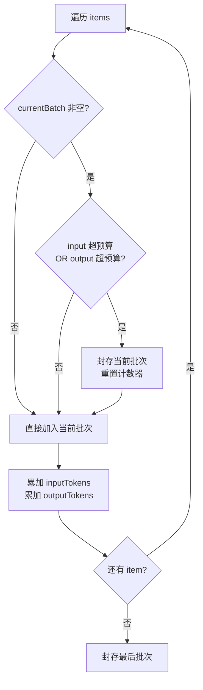
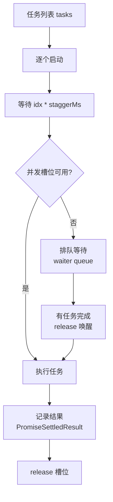

# PD-549.01 moyin-creator — 双约束贪心分批与错开并发容错执行

> 文档编号：PD-549.01
> 来源：moyin-creator `src/lib/ai/batch-processor.ts` `src/lib/utils/concurrency.ts`
> GitHub：https://github.com/MemeCalculate/moyin-creator.git
> 问题域：PD-549 自适应批处理 Adaptive Batch Processing
> 状态：可复用方案

---

## 第 1 章 问题与动机

### 1.1 核心问题

当 AI 应用需要对大量 items（如 60 集剧本的标题校准、数百个分镜的视觉描述生成）进行批量 AI 调用时，面临三重约束：

1. **Input Token 约束**：每次 API 调用的 prompt 不能超过模型的 contextWindow，否则请求直接被拒绝
2. **Output Token 约束**：每次调用的期望输出不能超过模型的 maxOutput，否则输出被截断导致 JSON 解析失败
3. **TTFT（Time To First Token）约束**：即使模型支持 1M context，超长上下文会导致首 token 延迟极高（"Lost in the middle" 问题），用户体验崩溃

传统做法是手动设定固定 batch size（如每批 10 个），但这在多模型场景下完全不可行——DeepSeek-V3 的 contextWindow 是 128K，Gemini 2.5 是 1M，GLM-4.7 是 200K，固定 batch size 要么浪费大模型的能力，要么撞小模型的限制。

### 1.2 moyin-creator 的解法概述

moyin-creator 的 `batch-processor.ts` 实现了一套完整的自适应批处理管线：

1. **模型感知分批**：从 `model-registry.ts:125` 的三层查找（持久化缓存 → 静态注册表 → 保守默认值）获取当前模型的真实 contextWindow 和 maxOutput 限制
2. **双重约束贪心分组**：`createBatches()` 函数（`batch-processor.ts:246`）同时检查 input token 和 output token 两个约束，任一即将超出时开始新批次
3. **60K Hard Cap**：无论模型声称支持多大上下文，每批 input 最多 60K token（`batch-processor.ts:27`），防止 TTFT 过高
4. **错开并发执行**：通过 `runStaggered()`（`concurrency.ts:27`）实现信号量 + 定时错开启动，避免 API 突发流量
5. **容错隔离**：单批次失败不影响其他批次，部分成功也返回结果（`batch-processor.ts:200-215`）

### 1.3 设计思想

| 设计原则 | 具体实现 | 理由 | 替代方案 |
|----------|----------|------|----------|
| 模型感知而非硬编码 | 三层查找 model-registry + Error-driven Discovery | 不同模型限制差异巨大（4K~1M），硬编码无法适配 | 固定 batch size（不灵活） |
| 双重约束同时满足 | input + output 两个预算独立检查 | 只检查 input 会导致 output 截断；只检查 output 会撞 context 限制 | 只检查 input（不完整） |
| 保守优于激进 | 60K Hard Cap + estimateTokens 用 字符/1.5 高估 | 宁可多分批也不撞限制，撞限制的代价远高于多一次 API 调用 | 精确 tokenizer（前端 WASM 兼容性差） |
| 错开启动而非同时并发 | staggerMs=5000 间隔启动 | 避免 API rate limit 突发拒绝，平滑流量 | Promise.all 同时启动（容易触发限流） |
| 容错隔离 | PromiseSettledResult + 部分成功返回 | 10 批中 1 批失败不应丢弃其他 9 批的结果 | Promise.all（一个失败全部失败） |

---

## 第 2 章 源码实现分析

### 2.1 架构概览

moyin-creator 的批处理系统由三个核心模块组成，形成清晰的分层架构：

```
┌─────────────────────────────────────────────────────────┐
│                    业务调用层                              │
│  full-script-service.ts / scene-calibrator.ts /          │
│  character-calibrator.ts / shot-calibration-stages.ts    │
│  → 调用 processBatched<TItem, TResult>()                 │
└──────────────────────┬──────────────────────────────────┘
                       │ 泛型接口
┌──────────────────────▼──────────────────────────────────┐
│              batch-processor.ts (调度核心)                │
│  ┌──────────┐  ┌──────────────┐  ┌───────────────────┐  │
│  │ 模型查询  │  │ 双约束贪心分组 │  │ 重试 + 容错合并   │  │
│  │getModel  │  │createBatches │  │executeBatchWith   │  │
│  │Limits()  │  │()            │  │Retry()            │  │
│  └────┬─────┘  └──────────────┘  └───────────────────┘  │
│       │                                                  │
└───────┼──────────────────┬──────────────────────────────┘
        │                  │ 并发调度
┌───────▼────────┐  ┌──────▼──────────────────────────────┐
│ model-registry │  │        concurrency.ts                │
│ .ts            │  │  runStaggered(tasks, max, staggerMs) │
│ 三层查找 +      │  │  信号量 + 定时错开启动                │
│ Error-driven   │  │                                      │
│ Discovery      │  │                                      │
└────────────────┘  └─────────────────────────────────────┘
```

### 2.2 核心实现

#### 2.2.1 双重约束贪心分组



对应源码 `src/lib/ai/batch-processor.ts:246-285`：

```typescript
function createBatches<TItem>(
  items: TItem[],
  getItemTokens: (item: TItem) => number,
  getItemOutputTokens: (item: TItem) => number,
  inputBudget: number,
  outputBudget: number,
  systemPromptTokens: number,
): TItem[][] {
  const batches: TItem[][] = [];
  let currentBatch: TItem[] = [];
  let currentInputTokens = systemPromptTokens; // system prompt 每批都要带
  let currentOutputTokens = 0;

  for (const item of items) {
    const itemInput = getItemTokens(item);
    const itemOutput = getItemOutputTokens(item);

    const wouldExceedInput = currentInputTokens + itemInput > inputBudget;
    const wouldExceedOutput = currentOutputTokens + itemOutput > outputBudget;

    if (currentBatch.length > 0 && (wouldExceedInput || wouldExceedOutput)) {
      batches.push(currentBatch);
      currentBatch = [];
      currentInputTokens = systemPromptTokens;
      currentOutputTokens = 0;
    }

    currentBatch.push(item);
    currentInputTokens += itemInput;
    currentOutputTokens += itemOutput;
  }

  if (currentBatch.length > 0) {
    batches.push(currentBatch);
  }
  return batches;
}
```

关键设计点：
- `currentBatch.length > 0` 保证每批至少 1 个 item，即使单个 item 超出预算也不会死循环（`batch-processor.ts:266`）
- `systemPromptTokens` 每批都要扣除，因为 system prompt 在每次 API 调用中都会重复发送（`batch-processor.ts:256`）
- 预算计算：`inputBudget = Math.min(contextWindow * 0.6, 60000)`，留 40% 给 system prompt 和格式开销（`batch-processor.ts:131`）

#### 2.2.2 错开启动的并发控制器



对应源码 `src/lib/utils/concurrency.ts:27-83`：

```typescript
export async function runStaggered<T>(
  tasks: (() => Promise<T>)[],
  maxConcurrent: number,
  staggerMs: number = 5000
): Promise<PromiseSettledResult<T>[]> {
  if (tasks.length === 0) return [];

  const results: PromiseSettledResult<T>[] = new Array(tasks.length);
  let activeCount = 0;
  const waiters: (() => void)[] = [];

  const acquire = async (): Promise<void> => {
    if (activeCount < maxConcurrent) {
      activeCount++;
      return;
    }
    await new Promise<void>((resolve) => waiters.push(resolve));
  };

  const release = (): void => {
    activeCount--;
    if (waiters.length > 0) {
      activeCount++;
      const next = waiters.shift()!;
      next();
    }
  };

  const taskPromises = tasks.map(async (task, idx) => {
    if (idx > 0) {
      await new Promise<void>((r) => setTimeout(r, idx * staggerMs));
    }
    await acquire();
    try {
      const value = await task();
      results[idx] = { status: 'fulfilled', value };
    } catch (reason) {
      results[idx] = { status: 'rejected', reason: reason as any };
    } finally {
      release();
    }
  });

  await Promise.all(taskPromises);
  return results;
}
```

### 2.3 实现细节

**预算计算公式**（`batch-processor.ts:131-132`）：

```
inputBudget  = min(contextWindow × 0.6, 60000)   // 60% 给 items，40% 给 system prompt
outputBudget = maxOutput × 0.8                     // 留 20% 给 JSON 格式开销
```

**Token 估算策略**（`model-registry.ts:260-262`）：

```typescript
export function estimateTokens(text: string): number {
  return Math.ceil(text.length / 1.5);
}
```

使用 `字符数/1.5` 而非精确 tokenizer，理由：
- 中文 1 token ≈ 0.6~1.0 汉字，/1.5 偏安全
- 不引入 tiktoken 等重型库，避免前端 WASM 兼容性问题
- 宁可高估（多分批）也不低估（撞限制）

**Error-driven Discovery**（`model-registry.ts:178-229`）：

当 API 返回 400 错误时，`parseModelLimitsFromError()` 从错误消息中正则提取真实的模型限制（覆盖 DeepSeek/OpenAI/智谱等格式），并通过 `cacheDiscoveredLimits()` 持久化到 localStorage。下次查询时，持久化缓存优先级最高，实现"从错误中学习"。

**TOKEN_BUDGET_EXCEEDED 不重试**（`batch-processor.ts:310-312`）：

```typescript
if ((lastError as any).code === 'TOKEN_BUDGET_EXCEEDED') {
  throw lastError; // 输入太大，重试也没用，直接抛出节省成本
}
```

**业务层调用示例** — 集标题校准（`full-script-service.ts:902-960`）：

```typescript
const { results, failedBatches, totalBatches } = await processBatched<TitleItem, string>({
  items,
  feature: 'script_analysis',
  buildPrompts: (batch) => ({
    system: `你是好莱坞资深编剧...`,
    user: `请为以下集数生成标题：\n\n${batch.map(ep => 
      `第${ep.index}集内容摘要：${ep.contentSummary}`
    ).join('\n\n')}`,
  }),
  parseResult: (raw) => {
    const parsed = JSON.parse(raw.replace(/```json\n?/g, '').replace(/```\n?/g, '').trim());
    const result = new Map<string, string>();
    for (const [key, value] of Object.entries(parsed.titles)) {
      result.set(key, value as string);
    }
    return result;
  },
  estimateItemOutputTokens: () => 30, // 标题很短
  onProgress: (completed, total, message) => {
    onProgress?.(completed, total, `[标题校准] ${message}`);
  },
});
```


---

## 第 3 章 迁移指南

### 3.1 迁移清单

**阶段 1：核心分批逻辑（1 个文件）**

- [ ] 移植 `createBatches()` 函数 — 双重约束贪心分组
- [ ] 定义 `ModelLimits` 接口（contextWindow + maxOutput）
- [ ] 实现 `estimateTokens()` — 可用 `字符/1.5` 保守算法或接入 tiktoken
- [ ] 设定 HARD_CAP_TOKENS 常量（建议 60K）

**阶段 2：并发控制（1 个文件）**

- [ ] 移植 `runStaggered()` — 信号量 + 定时错开
- [ ] 配置 staggerMs（建议 3000-5000ms）和 maxConcurrent（建议从用户设置读取）

**阶段 3：容错与重试（集成到批处理器）**

- [ ] 实现 `executeBatchWithRetry()` — 指数退避重试
- [ ] 使用 `PromiseSettledResult` 收集结果，区分 fulfilled/rejected
- [ ] 实现 TOKEN_BUDGET_EXCEEDED 短路（不重试）

**阶段 4：模型注册表（可选但推荐）**

- [ ] 建立静态模型注册表（至少覆盖你使用的模型）
- [ ] 实现 prefix 匹配（按长度降序排序）
- [ ] 可选：实现 Error-driven Discovery 从 API 错误中学习

### 3.2 适配代码模板

以下是一个可直接运行的最小化批处理器（TypeScript），从 moyin-creator 提炼：

```typescript
// adaptive-batch-processor.ts — 最小化可复用版本

interface ModelLimits {
  contextWindow: number;
  maxOutput: number;
}

interface BatchProcessorOptions<TItem, TResult> {
  items: TItem[];
  modelLimits: ModelLimits;
  buildPrompts: (batch: TItem[]) => { system: string; user: string };
  parseResult: (raw: string, batch: TItem[]) => Map<string, TResult>;
  callAPI: (system: string, user: string) => Promise<string>;
  estimateItemTokens?: (item: TItem) => number;
  estimateItemOutputTokens?: (item: TItem) => number;
  concurrency?: number;
  staggerMs?: number;
  onProgress?: (completed: number, total: number) => void;
}

const HARD_CAP_TOKENS = 60000;
const MAX_RETRIES = 2;
const RETRY_BASE_DELAY = 3000;

function estimateTokens(text: string): number {
  return Math.ceil(text.length / 1.5);
}

function createBatches<T>(
  items: T[],
  getInputTokens: (item: T) => number,
  getOutputTokens: (item: T) => number,
  inputBudget: number,
  outputBudget: number,
  systemTokens: number,
): T[][] {
  const batches: T[][] = [];
  let batch: T[] = [];
  let inputUsed = systemTokens;
  let outputUsed = 0;

  for (const item of items) {
    const iTokens = getInputTokens(item);
    const oTokens = getOutputTokens(item);

    if (batch.length > 0 && (inputUsed + iTokens > inputBudget || outputUsed + oTokens > outputBudget)) {
      batches.push(batch);
      batch = [];
      inputUsed = systemTokens;
      outputUsed = 0;
    }
    batch.push(item);
    inputUsed += iTokens;
    outputUsed += oTokens;
  }
  if (batch.length > 0) batches.push(batch);
  return batches;
}

async function runStaggered<T>(
  tasks: (() => Promise<T>)[],
  maxConcurrent: number,
  staggerMs: number,
): Promise<PromiseSettledResult<T>[]> {
  const results: PromiseSettledResult<T>[] = new Array(tasks.length);
  let active = 0;
  const waiters: (() => void)[] = [];

  const acquire = async () => {
    if (active < maxConcurrent) { active++; return; }
    await new Promise<void>(r => waiters.push(r));
  };
  const release = () => {
    active--;
    if (waiters.length > 0) { active++; waiters.shift()!(); }
  };

  await Promise.all(tasks.map(async (task, i) => {
    if (i > 0) await new Promise<void>(r => setTimeout(r, i * staggerMs));
    await acquire();
    try {
      results[i] = { status: 'fulfilled', value: await task() };
    } catch (reason) {
      results[i] = { status: 'rejected', reason: reason as any };
    } finally { release(); }
  }));
  return results;
}

export async function processBatched<TItem, TResult>(
  opts: BatchProcessorOptions<TItem, TResult>,
): Promise<{ results: Map<string, TResult>; failedBatches: number; totalBatches: number }> {
  const { items, modelLimits, buildPrompts, parseResult, callAPI } = opts;
  if (items.length === 0) return { results: new Map(), failedBatches: 0, totalBatches: 0 };

  const inputBudget = Math.min(Math.floor(modelLimits.contextWindow * 0.6), HARD_CAP_TOKENS);
  const outputBudget = Math.floor(modelLimits.maxOutput * 0.8);

  const samplePrompts = buildPrompts([items[0]]);
  const systemTokens = estimateTokens(samplePrompts.system);

  const getInput = opts.estimateItemTokens || ((item: TItem) => estimateTokens(JSON.stringify(item)));
  const getOutput = opts.estimateItemOutputTokens || (() => 300);

  const batches = createBatches(items, getInput, getOutput, inputBudget, outputBudget, systemTokens);

  const executeBatch = async (batch: TItem[]): Promise<Map<string, TResult>> => {
    let lastErr: Error | null = null;
    for (let attempt = 0; attempt <= MAX_RETRIES; attempt++) {
      try {
        const { system, user } = buildPrompts(batch);
        const raw = await callAPI(system, user);
        return parseResult(raw, batch);
      } catch (err) {
        lastErr = err instanceof Error ? err : new Error(String(err));
        if ((lastErr as any).code === 'TOKEN_BUDGET_EXCEEDED') throw lastErr;
        if (attempt < MAX_RETRIES) {
          await new Promise(r => setTimeout(r, RETRY_BASE_DELAY * Math.pow(2, attempt)));
        }
      }
    }
    throw lastErr!;
  };

  const settled = await runStaggered(
    batches.map((batch, i) => async () => {
      opts.onProgress?.(i, batches.length);
      return executeBatch(batch);
    }),
    opts.concurrency || 1,
    opts.staggerMs || 5000,
  );

  const successResults: Map<string, TResult>[] = [];
  let failedBatches = 0;
  for (const r of settled) {
    if (r.status === 'fulfilled') successResults.push(r.value);
    else failedBatches++;
  }

  const merged = new Map<string, TResult>();
  for (const map of successResults) for (const [k, v] of map) merged.set(k, v);

  return { results: merged, failedBatches, totalBatches: batches.length };
}
```

### 3.3 适用场景

| 场景 | 适用度 | 说明 |
|------|--------|------|
| 批量 AI 内容生成（标题/摘要/翻译） | ⭐⭐⭐ | 核心场景，items 数量大、每项 output 可预估 |
| 批量 AI 校准/评审 | ⭐⭐⭐ | 如分镜校准、角色校准，output 结构化 JSON |
| 多模型混合调度 | ⭐⭐⭐ | 不同模型限制差异大，自适应分批价值最高 |
| 实时对话/流式输出 | ⭐ | 不适用，批处理器面向非流式场景 |
| 单次大文档处理 | ⭐⭐ | 可用但收益有限，单次调用不需要分批 |

---

## 第 4 章 测试用例

```typescript
import { describe, it, expect, vi } from 'vitest';

// 测试 createBatches 的双重约束逻辑
describe('createBatches', () => {
  const getInput = (item: { tokens: number }) => item.tokens;
  const getOutput = (item: { outTokens: number }) => item.outTokens;

  it('单个 item 超出 input 预算仍独立成批', () => {
    const items = [{ tokens: 70000, outTokens: 100 }];
    const batches = createBatches(items, getInput, getOutput, 60000, 8000, 1000);
    expect(batches.length).toBe(1);
    expect(batches[0].length).toBe(1);
  });

  it('input 约束触发分批', () => {
    const items = [
      { tokens: 20000, outTokens: 100 },
      { tokens: 20000, outTokens: 100 },
      { tokens: 20000, outTokens: 100 }, // 累计 60000 + systemTokens 超出
    ];
    const batches = createBatches(items, getInput, getOutput, 50000, 80000, 5000);
    // 5000 + 20000 + 20000 = 45000 < 50000 → 前两个一批
    // 5000 + 20000 = 25000 < 50000 → 第三个单独一批
    expect(batches.length).toBe(2);
  });

  it('output 约束触发分批', () => {
    const items = [
      { tokens: 100, outTokens: 3000 },
      { tokens: 100, outTokens: 3000 },
      { tokens: 100, outTokens: 3000 }, // 累计 9000 > 8000
    ];
    const batches = createBatches(items, getInput, getOutput, 60000, 8000, 1000);
    expect(batches.length).toBe(2);
    expect(batches[0].length).toBe(2); // 6000 < 8000
    expect(batches[1].length).toBe(1); // 3000 < 8000
  });

  it('空输入返回空数组', () => {
    const batches = createBatches([], getInput, getOutput, 60000, 8000, 1000);
    expect(batches.length).toBe(0);
  });
});

// 测试 runStaggered 的并发控制
describe('runStaggered', () => {
  it('尊重 maxConcurrent 限制', async () => {
    let maxActive = 0;
    let active = 0;
    const tasks = Array.from({ length: 5 }, () => async () => {
      active++;
      maxActive = Math.max(maxActive, active);
      await new Promise(r => setTimeout(r, 50));
      active--;
      return 'done';
    });

    await runStaggered(tasks, 2, 10);
    expect(maxActive).toBeLessThanOrEqual(2);
  });

  it('单个任务失败不影响其他任务', async () => {
    const tasks = [
      async () => 'ok',
      async () => { throw new Error('fail'); },
      async () => 'ok2',
    ];
    const results = await runStaggered(tasks, 3, 0);
    expect(results[0].status).toBe('fulfilled');
    expect(results[1].status).toBe('rejected');
    expect(results[2].status).toBe('fulfilled');
  });
});

// 测试 processBatched 的容错合并
describe('processBatched', () => {
  it('部分批次失败仍返回成功批次的结果', async () => {
    let callCount = 0;
    const result = await processBatched({
      items: [{ id: '1' }, { id: '2' }, { id: '3' }],
      modelLimits: { contextWindow: 1000, maxOutput: 500 },
      buildPrompts: (batch) => ({ system: 'sys', user: batch.map(i => i.id).join(',') }),
      parseResult: (raw, batch) => {
        const map = new Map<string, string>();
        batch.forEach(i => map.set(i.id, `result_${i.id}`));
        return map;
      },
      callAPI: async () => {
        callCount++;
        if (callCount === 2) throw new Error('API error');
        return 'ok';
      },
      estimateItemTokens: () => 400, // 每批只能放 1 个 item
      concurrency: 3,
      staggerMs: 0,
    });

    expect(result.totalBatches).toBe(3);
    expect(result.failedBatches).toBe(1);
    expect(result.results.size).toBe(2); // 2 个成功批次的结果
  });

  it('TOKEN_BUDGET_EXCEEDED 不重试', async () => {
    let attempts = 0;
    const err = new Error('too large') as any;
    err.code = 'TOKEN_BUDGET_EXCEEDED';

    try {
      await processBatched({
        items: [{ id: '1' }],
        modelLimits: { contextWindow: 100000, maxOutput: 8000 },
        buildPrompts: () => ({ system: 's', user: 'u' }),
        parseResult: () => new Map(),
        callAPI: async () => { attempts++; throw err; },
      });
    } catch {}

    expect(attempts).toBe(1); // 只调用 1 次，不重试
  });
});
```


---

## 第 5 章 跨域关联

| 关联域 | 关系类型 | 说明 |
|--------|----------|------|
| PD-01 上下文管理 | 依赖 | 批处理器的 inputBudget 计算依赖 contextWindow 限制，60K Hard Cap 本质是上下文管理策略 |
| PD-03 容错与重试 | 协同 | `executeBatchWithRetry` 实现指数退避重试，`TOKEN_BUDGET_EXCEEDED` 短路是容错策略的一部分 |
| PD-04 工具系统 | 协同 | `processBatched` 作为泛型工具被 4 个业务模块复用（标题校准、大纲生成、角色校准、场景校准） |
| PD-11 可观测性 | 协同 | `onProgress` 回调提供批次级进度追踪，console.log 输出分批结果和失败统计 |

---

## 第 6 章 来源文件索引

| 文件 | 行范围 | 关键实现 |
|------|--------|----------|
| `src/lib/ai/batch-processor.ts` | L1-L327 | 完整的自适应批处理器：类型定义、processBatched 主函数、createBatches 分组、executeBatchWithRetry 重试 |
| `src/lib/utils/concurrency.ts` | L1-L83 | runStaggered 错开启动并发控制器：信号量 acquire/release + 定时错开 |
| `src/lib/ai/model-registry.ts` | L1-L303 | 模型能力注册表：三层查找、静态注册表、Error-driven Discovery、estimateTokens、safeTruncate |
| `src/lib/ai/feature-router.ts` | L238-L279 | callFeatureAPI 统一调用入口：自动从服务映射获取配置，被 batch-processor 间接调用 |
| `src/lib/script/full-script-service.ts` | L902-L960 | processBatched 业务调用示例：集标题校准 |
| `src/lib/script/full-script-service.ts` | L1995-L2067 | processBatched 业务调用示例：集大纲生成 |
| `src/lib/script/scene-calibrator.ts` | L19 | processBatched 导入：场景校准 |
| `src/lib/script/character-calibrator.ts` | L19 | processBatched 导入：角色校准 |
| `src/lib/script/shot-calibration-stages.ts` | L16 | processBatched 导入：5 阶段分镜校准 |

---

## 第 7 章 横向对比维度

```json comparison_data
{
  "project": "moyin-creator",
  "dimensions": {
    "分批策略": "双重约束贪心分组（input+output token），60K Hard Cap",
    "模型感知": "三层查找注册表 + Error-driven Discovery 自动学习限制",
    "并发模型": "runStaggered 信号量 + 定时错开启动（staggerMs=5000）",
    "容错隔离": "PromiseSettledResult 部分成功返回 + TOKEN_BUDGET_EXCEEDED 短路",
    "泛型复用": "processBatched<TItem, TResult> 泛型接口，5 个业务模块复用",
    "预算计算": "inputBudget=min(ctx×0.6, 60K), outputBudget=maxOutput×0.8"
  }
}
```

### 域元数据补充

```json domain_metadata
{
  "solution_summary": "moyin-creator 用 model-registry 三层查找获取模型限制，双重约束贪心分组（input+output token）+ 60K Hard Cap 分批，runStaggered 错开并发执行，PromiseSettledResult 容错隔离",
  "description": "AI 批量调用的自适应分批与并发调度，核心是模型感知的动态预算计算",
  "sub_problems": [
    "system prompt 每批重复发送的 token 开销扣除",
    "Error-driven Discovery 从 API 错误中自动学习模型限制",
    "多业务模块复用同一泛型批处理器的接口设计"
  ],
  "best_practices": [
    "预算留 40% 余量给 system prompt 和格式开销",
    "estimateTokens 用字符/1.5 高估避免前端引入重型 tokenizer",
    "单个 item 超预算仍独立成批防止死循环"
  ]
}
```
