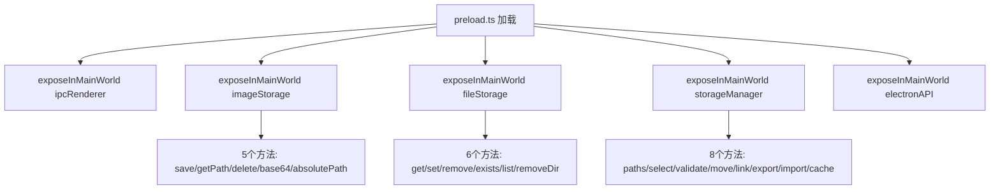
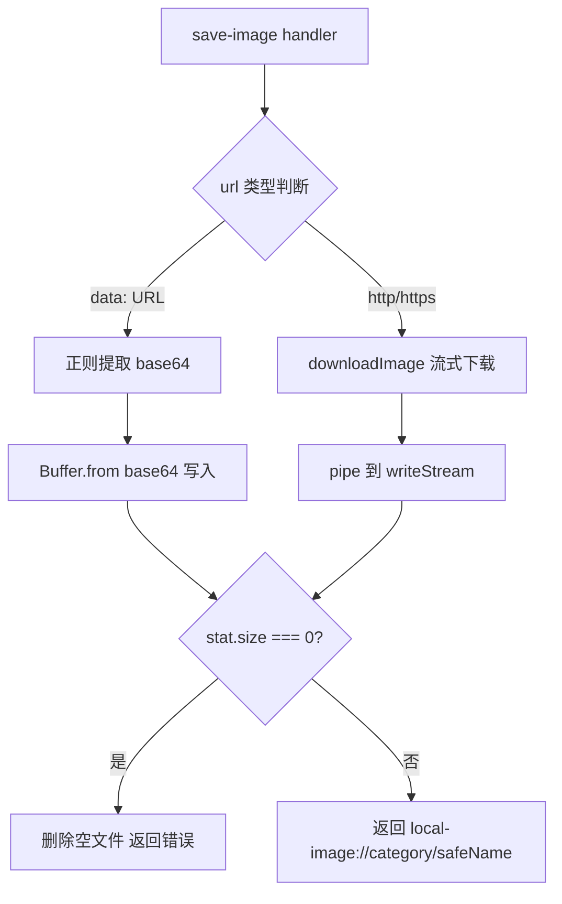
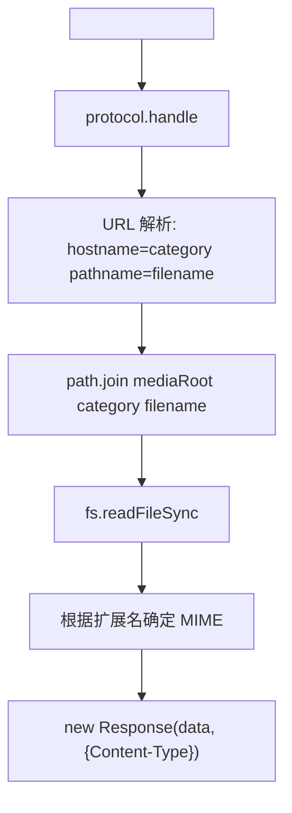

# PD-550.01 moyin-creator — 四命名空间 contextBridge 安全桥接与自定义协议媒体加载

> 文档编号：PD-550.01
> 来源：moyin-creator `electron/preload.ts` `electron/main.ts`
> GitHub：https://github.com/MemeCalculate/moyin-creator.git
> 问题域：PD-550 Electron 安全桥接 Electron Secure Bridge
> 状态：可复用方案

---

## 第 1 章 问题与动机

### 1.1 核心问题

Electron 应用的渲染进程运行在 Chromium 沙箱中，无法直接访问 Node.js API（文件系统、路径操作、原生对话框等）。早期 Electron 应用通过 `nodeIntegration: true` 直接暴露 Node 给渲染进程，但这等于把整个操作系统 API 交给了网页代码——一旦渲染进程加载了恶意脚本（XSS、第三方依赖注入），攻击者可以读写任意文件、执行任意命令。

moyin-creator 是一个 AI 驱动的漫画创作工具，需要处理大量图片/视频的本地存储、项目数据的无限大小持久化、以及数据导入导出。这些操作都需要文件系统访问，但必须在安全边界内完成。

核心挑战：
1. **安全性**：渲染进程不能直接访问 `fs`、`path` 等 Node 模块
2. **功能完整性**：需要图片下载/base64 转换、无限大小 JSON 存储、缓存管理、数据迁移等完整文件操作
3. **协议统一**：本地图片需要在 `` 标签中直接渲染，不能每次都走 IPC 读取
4. **存储容量**：localStorage 有 5-10MB 限制，无法存储大型项目数据

### 1.2 moyin-creator 的解法概述

moyin-creator 通过 `contextBridge.exposeInMainWorld` 暴露四个命名空间，每个命名空间对应一个功能域：

1. **ipcRenderer** — 底层 IPC 通道代理，仅暴露 `on/off/send/invoke` 四个方法（`electron/preload.ts:7-24`）
2. **imageStorage** — 图片生命周期管理：保存（URL/data URL/下载）、路径解析、删除、base64 读取、绝对路径获取（`electron/preload.ts:27-47`）
3. **fileStorage** — 无限大小的 JSON 键值存储：get/set/remove/exists/listKeys/removeDir，替代 localStorage（`electron/preload.ts:50-57`）
4. **storageManager** — 存储路径管理与数据运维：路径查询、目录选择、数据迁移/链接/导入导出、缓存清理（`electron/preload.ts:59-73`）

额外还有 **electronAPI** 命名空间用于原生对话框（`electron/preload.ts:76-79`）。

主进程通过 `local-image://` 自定义协议实现零 IPC 开销的媒体加载（`electron/main.ts:1067-1075`）。

### 1.3 设计思想

| 设计原则 | 具体实现 | 理由 | 替代方案 |
|----------|----------|------|----------|
| 最小权限暴露 | contextBridge 只暴露 invoke 包装函数，不暴露 fs/path | 渲染进程无法构造任意文件操作 | nodeIntegration: true（不安全） |
| 功能域分组 | 四个独立命名空间（imageStorage/fileStorage/storageManager/electronAPI） | 关注点分离，类型安全，IDE 自动补全 | 单一 ipcRenderer.invoke 全部走 channel 字符串 |
| 自定义协议替代 IPC | `local-image://` 协议直接在 `` 中使用 | 避免每张图片都走 IPC→base64→blob URL 的开销 | 每次渲染都 invoke + base64 转换 |
| 统一异步模型 | 所有 API 都用 `ipcRenderer.invoke` 返回 Promise | 渲染进程代码风格一致，无回调地狱 | send + on 事件对模式 |
| 三源数据迁移 | fileStorage 适配器自动检测 localStorage/IndexedDB/文件系统三个数据源 | 从 Web 版平滑迁移到 Electron 版 | 手动导出导入 |

---

## 第 2 章 源码实现分析

### 2.1 架构概览

```
┌─────────────────────────────────────────────────────────────┐
│                    渲染进程 (Renderer)                        │
│                                                             │
│  window.imageStorage ──┐                                    │
│  window.fileStorage  ──┼── ipcRenderer.invoke ──┐           │
│  window.storageManager─┘                        │           │
│  window.electronAPI  ──────────────────────────→│           │
│                                                  │           │
│           │           │
│       │                                          │           │
│       └── protocol.handle('local-image') ────────┤           │
└──────────────────────────────────────────────────┼───────────┘
                    contextBridge                   │
                    (安全边界)                       │
┌──────────────────────────────────────────────────┼───────────┐
│                    主进程 (Main)                   │           │
│                                                  ▼           │
│  ipcMain.handle('save-image')     ← 图片下载/base64写入      │
│  ipcMain.handle('get-image-path') ← local-image → file://   │
│  ipcMain.handle('read-image-base64') ← 文件→base64          │
│  ipcMain.handle('file-storage-*') ← JSON 文件读写            │
│  ipcMain.handle('storage-*')      ← 路径管理/迁移/缓存       │
│                                                              │
│  protocol.handle('local-image')   ← 自定义协议直接返回文件    │
│                                                              │
│  StorageConfig (JSON) ← 存储路径配置持久化                    │
│  getStorageBasePath() → projects/ + media/ 双目录             │
└──────────────────────────────────────────────────────────────┘
```

### 2.2 核心实现

#### 2.2.1 preload 四命名空间暴露



对应源码 `electron/preload.ts:7-79`：

```typescript
// 命名空间 1: 底层 IPC 代理（最小化暴露）
contextBridge.exposeInMainWorld('ipcRenderer', {
  on(...args: Parameters<typeof ipcRenderer.on>) {
    const [channel, listener] = args
    return ipcRenderer.on(channel, (event, ...args) => listener(event, ...args))
  },
  off(...args: Parameters<typeof ipcRenderer.off>) {
    const [channel, ...omit] = args
    return ipcRenderer.off(channel, ...omit)
  },
  send(...args: Parameters<typeof ipcRenderer.send>) {
    const [channel, ...omit] = args
    return ipcRenderer.send(channel, ...omit)
  },
  invoke(...args: Parameters<typeof ipcRenderer.invoke>) {
    const [channel, ...omit] = args
    return ipcRenderer.invoke(channel, ...omit)
  },
})

// 命名空间 2: 图片存储（高层语义 API）
contextBridge.exposeInMainWorld('imageStorage', {
  saveImage: (url: string, category: string, filename: string) => 
    ipcRenderer.invoke('save-image', { url, category, filename }),
  getImagePath: (localPath: string) => 
    ipcRenderer.invoke('get-image-path', localPath),
  deleteImage: (localPath: string) => 
    ipcRenderer.invoke('delete-image', localPath),
  readAsBase64: (localPath: string) => 
    ipcRenderer.invoke('read-image-base64', localPath),
  getAbsolutePath: (localPath: string) => 
    ipcRenderer.invoke('get-absolute-path', localPath),
})
```

#### 2.2.2 图片保存：URL/data URL 双路径处理



对应源码 `electron/main.ts:338-373`：

```typescript
ipcMain.handle('save-image', async (_event, { url, category, filename }) => {
  try {
    const imagesDir = getImagesDir(category)
    const ext = path.extname(filename) || '.png'
    // 时间戳 + 随机串防冲突
    const safeName = `${Date.now()}_${Math.random().toString(36).substring(2, 8)}${ext}`
    const filePath = path.join(imagesDir, safeName)
    
    // data: URL — 直接解码 base64 写入文件（canvas 切割产物）
    if (url.startsWith('data:')) {
      const matches = url.match(/^data:[^;]+;base64,(.+)$/s)
      if (!matches) {
        return { success: false, error: 'Invalid data URL format' }
      }
      const buffer = Buffer.from(matches[1], 'base64')
      if (buffer.length === 0) {
        return { success: false, error: 'Decoded base64 data is empty (0 bytes)' }
      }
      fs.writeFileSync(filePath, buffer)
    } else {
      await downloadImage(url, filePath)
    }
    
    // 零字节校验：防止空文件污染存储
    const stat = fs.statSync(filePath)
    if (stat.size === 0) {
      fs.unlinkSync(filePath)
      return { success: false, error: 'Saved file is 0 bytes' }
    }
    
    return { success: true, localPath: `local-image://${category}/${safeName}` }
  } catch (error) {
    return { success: false, error: String(error) }
  }
})
```

#### 2.2.3 自定义协议：零 IPC 媒体加载



对应源码 `electron/main.ts:1067-1120`：

```typescript
// 注册为特权协议（必须在 app.ready 之前）
protocol.registerSchemesAsPrivileged([{
  scheme: 'local-image',
  privileges: {
    secure: true,          // 被视为安全来源
    supportFetchAPI: true, // 支持 fetch()
    bypassCSP: true,       // 绕过 CSP 限制
    stream: true,          // 支持流式传输
  }
}])

app.whenReady().then(() => {
  protocol.handle('local-image', async (request) => {
    try {
      const url = new URL(request.url)
      const category = url.hostname
      const filename = decodeURIComponent(url.pathname.slice(1))
      const filePath = path.join(getMediaRoot(), category, filename)
      
      const data = fs.readFileSync(filePath)
      const ext = path.extname(filename).toLowerCase()
      const mimeTypes: Record<string, string> = {
        '.png': 'image/png', '.jpg': 'image/jpeg',
        '.mp4': 'video/mp4', '.webm': 'video/webm',
        // ... 支持图片 + 视频共 10 种格式
      }
      const mimeType = mimeTypes[ext] || 'application/octet-stream'
      
      return new Response(data, {
        headers: { 'Content-Type': mimeType }
      })
    } catch (error) {
      return new Response('Image not found', { status: 404 })
    }
  })
})
```

### 2.3 实现细节

#### 三源数据迁移适配器

渲染进程的 `fileStorage` 适配器（`src/lib/indexed-db-storage.ts:62-156`）实现了 Zustand `StateStorage` 接口，在 `getItem` 时自动检测三个数据源的优先级：

1. **localStorage** — Web 版遗留数据，有 5MB 限制
2. **IndexedDB** — 中间过渡方案
3. **文件系统** — Electron 版最终存储

适配器通过 `hasRichData()` 函数（`src/lib/indexed-db-storage.ts:31-59`）判断哪个源的数据更"丰富"（包含实际项目数据而非空状态），自动将丰富数据迁移到文件系统，并清理旧源。

#### 统一存储路径架构

主进程通过 `StorageConfig`（`electron/main.ts:90-98`）管理存储路径，支持：
- `basePath` — 新版统一基础路径
- `projectPath` / `mediaPath` — 旧版分离路径（向后兼容）
- `getStorageBasePath()`（`electron/main.ts:168-180`）实现新旧路径的自动降级

数据目录结构：
```
{basePath}/
├── projects/          ← JSON 项目数据（fileStorage）
│   ├── moyin-project-store.json
│   ├── _p/{projectId}/script.json
│   └── _shared/media.json
└── media/             ← 二进制媒体文件（imageStorage）
    ├── characters/
    ├── scenes/
    ├── shots/
    └── videos/
```

#### 导入导出的备份回滚机制

`storage-import-data` handler（`electron/main.ts:731-808`）实现了完整的事务性导入：
1. 创建临时备份到 `os.tmpdir()`
2. 执行导入（删除旧数据 + 复制新数据）
3. 成功则清理备份；失败则从备份回滚
4. 清除迁移标记以触发重新评估


---

## 第 3 章 迁移指南

### 3.1 迁移清单

**阶段 1：基础安全桥接**
- [ ] 创建 `electron/preload.ts`，用 `contextBridge.exposeInMainWorld` 暴露命名空间
- [ ] 在 `BrowserWindow` 配置中设置 `preload` 路径，确保 `nodeIntegration` 为 false（默认值）
- [ ] 为每个命名空间创建 TypeScript 类型声明（`Window` 接口扩展）
- [ ] 渲染进程通过 `window.xxx?.method()` 可选链调用，支持非 Electron 环境降级

**阶段 2：文件存储系统**
- [ ] 实现 `ipcMain.handle` 处理器：get/set/remove/exists/listKeys
- [ ] 创建 Zustand `StateStorage` 适配器，桥接 `window.fileStorage` 与 Zustand persist
- [ ] 实现三源迁移逻辑（localStorage → IndexedDB → 文件系统）

**阶段 3：媒体存储与自定义协议**
- [ ] 注册自定义协议（`protocol.registerSchemesAsPrivileged`，必须在 `app.ready` 前）
- [ ] 实现 `protocol.handle` 处理器，解析 URL 并返回文件内容
- [ ] 实现图片保存 handler，支持 URL 下载和 data URL 解码
- [ ] 添加零字节校验防止空文件

**阶段 4：数据运维**
- [ ] 实现存储路径配置持久化（JSON 配置文件）
- [ ] 实现数据迁移/导入导出（含备份回滚）
- [ ] 实现缓存清理（按天数过期 + 定时调度）

### 3.2 适配代码模板

#### 最小化 preload 模板

```typescript
// electron/preload.ts
import { ipcRenderer, contextBridge } from 'electron'

// 按功能域分组暴露 API
contextBridge.exposeInMainWorld('appStorage', {
  // 键值存储
  getItem: (key: string) => ipcRenderer.invoke('storage:get', key),
  setItem: (key: string, value: string) => ipcRenderer.invoke('storage:set', key, value),
  removeItem: (key: string) => ipcRenderer.invoke('storage:remove', key),
})

contextBridge.exposeInMainWorld('appMedia', {
  // 媒体操作
  saveFile: (url: string, category: string) => 
    ipcRenderer.invoke('media:save', { url, category }),
  getFilePath: (localPath: string) => 
    ipcRenderer.invoke('media:resolve', localPath),
})
```

#### Zustand StateStorage 适配器模板

```typescript
// src/lib/electron-storage.ts
import type { StateStorage } from 'zustand/middleware'

const isElectron = () => typeof window !== 'undefined' && !!window.appStorage

export const electronStorage: StateStorage = {
  getItem: async (name: string): Promise<string | null> => {
    if (isElectron()) {
      try {
        const fileData = await window.appStorage!.getItem(name)
        if (fileData) return fileData
        // 降级：从 localStorage 迁移
        const localData = localStorage.getItem(name)
        if (localData) {
          await window.appStorage!.setItem(name, localData)
          localStorage.removeItem(name)
          return localData
        }
        return null
      } catch (error) {
        console.error('Electron storage error:', error)
      }
    }
    return localStorage.getItem(name)
  },
  setItem: async (name: string, value: string): Promise<void> => {
    if (isElectron()) {
      await window.appStorage!.setItem(name, value)
      return
    }
    localStorage.setItem(name, value)
  },
  removeItem: async (name: string): Promise<void> => {
    if (isElectron()) {
      await window.appStorage!.removeItem(name)
      return
    }
    localStorage.removeItem(name)
  },
}
```

#### 自定义协议注册模板

```typescript
// electron/main.ts
import { app, protocol } from 'electron'
import fs from 'node:fs'
import path from 'node:path'

// 必须在 app.ready 之前注册
protocol.registerSchemesAsPrivileged([{
  scheme: 'app-media',
  privileges: { secure: true, supportFetchAPI: true, bypassCSP: true, stream: true }
}])

app.whenReady().then(() => {
  protocol.handle('app-media', async (request) => {
    const url = new URL(request.url)
    const category = url.hostname
    const filename = decodeURIComponent(url.pathname.slice(1))
    const filePath = path.join(MEDIA_ROOT, category, filename)
    
    try {
      const data = fs.readFileSync(filePath)
      const mime = getMimeType(path.extname(filename))
      return new Response(data, { headers: { 'Content-Type': mime } })
    } catch {
      return new Response('Not found', { status: 404 })
    }
  })
})
```

### 3.3 适用场景

| 场景 | 适用度 | 说明 |
|------|--------|------|
| Electron 桌面应用需要本地文件存储 | ⭐⭐⭐ | 完美匹配，四命名空间覆盖所有常见需求 |
| 需要从 Web 版迁移到 Electron 版 | ⭐⭐⭐ | 三源迁移适配器可直接复用 |
| 需要在 `/<video>` 中直接加载本地文件 | ⭐⭐⭐ | 自定义协议方案零 IPC 开销 |
| Zustand 持久化需要突破 localStorage 限制 | ⭐⭐⭐ | fileStorage 适配器直接替换 |
| 纯 Web 应用（无 Electron） | ⭐ | 不适用，但降级逻辑可保证代码兼容 |
| 需要加密存储 | ⭐⭐ | 需在 main 进程 handler 中添加加密层 |

---

## 第 4 章 测试用例

```typescript
import { describe, it, expect, vi, beforeEach } from 'vitest'

// Mock Electron IPC
const mockInvoke = vi.fn()
const mockFileStorage = {
  getItem: vi.fn(),
  setItem: vi.fn(),
  removeItem: vi.fn(),
  exists: vi.fn(),
  listKeys: vi.fn(),
  removeDir: vi.fn(),
}

describe('contextBridge 安全桥接', () => {
  describe('imageStorage.saveImage', () => {
    it('应处理 data URL 并返回 local-image:// 路径', async () => {
      mockInvoke.mockResolvedValue({ 
        success: true, 
        localPath: 'local-image://shots/1234_abc123.png' 
      })
      
      const result = await mockInvoke('save-image', {
        url: 'data:image/png;base64,iVBORw0KGgo=',
        category: 'shots',
        filename: 'test.png'
      })
      
      expect(result.success).toBe(true)
      expect(result.localPath).toMatch(/^local-image:\/\/shots\//)
    })

    it('应拒绝空 base64 数据', async () => {
      mockInvoke.mockResolvedValue({ 
        success: false, 
        error: 'Decoded base64 data is empty (0 bytes)' 
      })
      
      const result = await mockInvoke('save-image', {
        url: 'data:image/png;base64,',
        category: 'shots',
        filename: 'empty.png'
      })
      
      expect(result.success).toBe(false)
    })
  })

  describe('fileStorage 适配器', () => {
    beforeEach(() => {
      vi.clearAllMocks()
      Object.defineProperty(window, 'fileStorage', { value: mockFileStorage, writable: true })
    })

    it('应优先使用文件系统数据', async () => {
      mockFileStorage.getItem.mockResolvedValue('{"state":{"projects":[{},{},{}]}}')
      vi.spyOn(Storage.prototype, 'getItem').mockReturnValue('{"state":{"projects":[]}}')
      
      // fileStorage 有更丰富的数据，应返回文件系统版本
      const result = await mockFileStorage.getItem('moyin-project-store')
      expect(result).toContain('"projects":[{},{},{}]')
    })

    it('应从 localStorage 迁移丰富数据到文件系统', async () => {
      mockFileStorage.getItem.mockResolvedValue(null)
      const richData = '{"state":{"projects":[{"id":"p1"},{"id":"p2"}]}}'
      vi.spyOn(Storage.prototype, 'getItem').mockReturnValue(richData)
      
      // 模拟迁移行为
      await mockFileStorage.setItem('moyin-project-store', richData)
      expect(mockFileStorage.setItem).toHaveBeenCalledWith('moyin-project-store', richData)
    })
  })

  describe('storageManager 数据导入', () => {
    it('导入失败时应回滚到备份', async () => {
      mockInvoke
        .mockResolvedValueOnce({ success: false, error: 'Copy failed' })
      
      const result = await mockInvoke('storage-import-data', '/invalid/path')
      expect(result.success).toBe(false)
    })

    it('应验证源目录包含有效数据结构', async () => {
      mockInvoke.mockResolvedValue({ 
        valid: false, 
        error: '该目录不包含有效的数据（需要 projects/ 或 media/ 子目录）' 
      })
      
      const result = await mockInvoke('storage-validate-data-dir', '/empty/dir')
      expect(result.valid).toBe(false)
    })
  })

  describe('自定义协议路径安全', () => {
    it('应正确解码 URL 编码的文件名', () => {
      const url = new URL('local-image://shots/%E4%B8%AD%E6%96%87%E5%90%8D.png')
      const category = url.hostname
      const filename = decodeURIComponent(url.pathname.slice(1))
      
      expect(category).toBe('shots')
      expect(filename).toBe('中文名.png')
    })

    it('应为未知扩展名返回 octet-stream', () => {
      const mimeTypes: Record<string, string> = {
        '.png': 'image/png', '.jpg': 'image/jpeg',
      }
      const ext = '.xyz'
      const mime = mimeTypes[ext] || 'application/octet-stream'
      expect(mime).toBe('application/octet-stream')
    })
  })
})
```


---

## 第 5 章 跨域关联

| 关联域 | 关系类型 | 说明 |
|--------|----------|------|
| PD-06 记忆持久化 | 强依赖 | fileStorage 是 Zustand 持久化的底层实现，`indexed-db-storage.ts` 的 `StateStorage` 适配器直接桥接 contextBridge 暴露的 API |
| PD-478 项目级状态隔离 | 协同 | `project-storage.ts` 的 `createProjectScopedStorage` 和 `createSplitStorage` 建立在 fileStorage 之上，实现按项目 ID 路由存储 |
| PD-515 数据迁移恢复 | 协同 | `storage-migration.ts` 的 monolithic→per-project 迁移和 `recoverFromLegacy` 恢复机制依赖 fileStorage 的 exists/getItem/setItem |
| PD-519 Electron IPC 安全 | 同域 | 本方案是 PD-519 的具体实现，四命名空间 contextBridge 是 IPC 安全的核心模式 |
| PD-05 沙箱隔离 | 上游 | contextBridge 本身就是 Electron 的沙箱隔离机制，确保渲染进程无法直接访问 Node API |

---

## 第 6 章 来源文件索引

| 文件 | 行范围 | 关键实现 |
|------|--------|----------|
| `electron/preload.ts` | L1-L81 | 四命名空间 contextBridge 暴露：ipcRenderer/imageStorage/fileStorage/storageManager/electronAPI |
| `electron/main.ts` | L89-L131 | StorageConfig 类型定义、加载/保存配置、ensureDir/normalizePath 工具函数 |
| `electron/main.ts` | L168-L201 | getStorageBasePath/getProjectDataRoot/getMediaRoot/getCacheDirs 路径管理 |
| `electron/main.ts` | L305-L373 | downloadImage 流式下载 + save-image handler（URL/data URL 双路径 + 零字节校验） |
| `electron/main.ts` | L407-L458 | read-image-base64 + get-absolute-path handler（多协议路径解析） |
| `electron/main.ts` | L460-L547 | file-storage-* 六个 handler（JSON 键值存储 CRUD + 目录列举/删除） |
| `electron/main.ts` | L548-L953 | storage-* handler 集合（路径管理/数据迁移/导入导出/缓存清理/配置更新） |
| `electron/main.ts` | L1067-L1120 | local-image:// 自定义协议注册与处理（10 种 MIME 类型） |
| `src/types/electron.d.ts` | L1-L24 | storageManager TypeScript 类型声明 |
| `src/lib/image-storage.ts` | L1-L210 | 渲染进程图片操作封装：saveImageToLocal/resolveImagePath/readImageAsBase64/saveVideoToLocal |
| `src/lib/indexed-db-storage.ts` | L1-L211 | Zustand StateStorage 适配器：三源检测（localStorage/IndexedDB/文件系统）+ 自动迁移 |
| `src/lib/project-storage.ts` | L1-L316 | 项目级存储路由：createProjectScopedStorage + createSplitStorage（project/shared 分离） |
| `src/lib/storage-migration.ts` | L1-L374 | Monolithic→Per-Project 迁移引擎 + recoverFromLegacy 数据恢复 |

---

## 第 7 章 横向对比维度

```json comparison_data
{
  "project": "moyin-creator",
  "dimensions": {
    "桥接架构": "四命名空间 contextBridge（imageStorage/fileStorage/storageManager/electronAPI）",
    "协议设计": "local-image:// 自定义特权协议，支持 fetch/stream/bypassCSP",
    "存储分层": "projects/ + media/ 双目录，basePath 统一管理 + legacy 降级",
    "迁移策略": "三源自动检测（localStorage/IndexedDB/文件系统）+ hasRichData 丰富度判断",
    "数据安全": "导入导出含 tmpdir 备份回滚，零字节校验防空文件，路径冲突检测"
  }
}
```

### 域元数据补充

```json domain_metadata
{
  "solution_summary": "moyin-creator 用四命名空间 contextBridge 暴露 imageStorage/fileStorage/storageManager/electronAPI，配合 local-image:// 自定义协议实现零 IPC 媒体加载，三源适配器自动迁移 Web 数据到文件系统",
  "description": "Electron 应用中渲染进程与主进程的安全通信与本地资源访问架构",
  "sub_problems": [
    "自定义协议注册与特权配置（secure/fetchAPI/bypassCSP/stream）",
    "Web→Electron 三源数据迁移（localStorage/IndexedDB/文件系统丰富度判断）",
    "导入导出事务性保护（tmpdir 备份 + 失败回滚）"
  ],
  "best_practices": [
    "自定义协议替代 IPC 实现零开销媒体加载（img/video src 直接引用）",
    "文件保存后零字节校验防止空文件污染存储",
    "存储路径支持 legacy 降级（basePath → projectPath/mediaPath 自动回退）",
    "导入操作先备份到 tmpdir 再执行，失败自动回滚"
  ]
}
```

