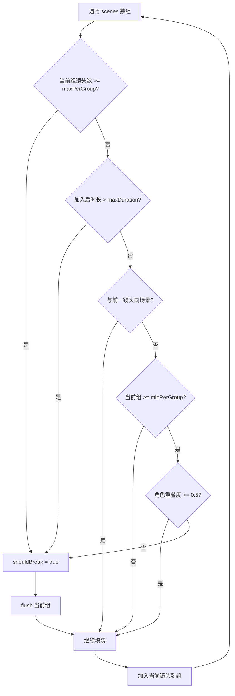
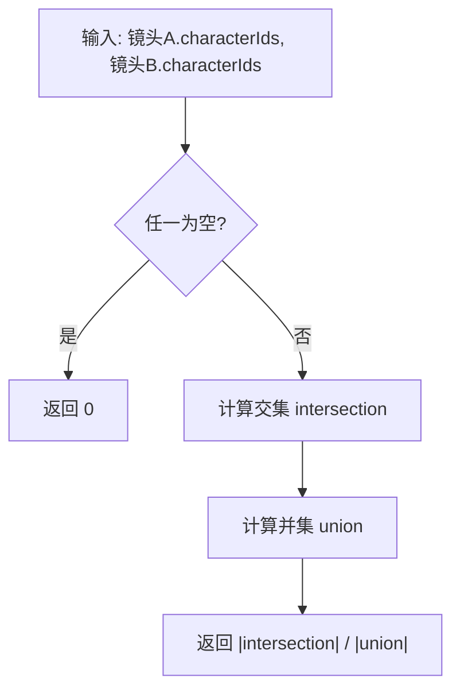

# PD-551.01 moyin-creator — 双约束贪心分组与 Jaccard 角色重叠度检测

> 文档编号：PD-551.01
> 来源：moyin-creator `src/components/panels/sclass/auto-grouping.ts`
> GitHub：https://github.com/MemeCalculate/moyin-creator.git
> 问题域：PD-551 智能分组算法 Intelligent Grouping Algorithm
> 状态：可复用方案

---

## 第 1 章 问题与动机

### 1.1 核心问题

在 AI 视频创作流水线中，用户通过剧本生成一系列分镜（SplitScene），每个分镜对应一个镜头画面。
但视频生成 API（如 Seedance 2.0）有硬性限制：单次生成的视频时长上限 15 秒，且输入素材数量有限。
因此需要将连续的分镜序列自动分组为"镜头组"（ShotGroup），每组作为一次视频生成的输入单元。

分组不是简单的等分切割，需要同时满足：
- **时长约束**：组内所有镜头时长之和 ≤ 15s
- **数量约束**：每组最多 4 个镜头（API 素材数限制）
- **叙事连贯**：同一场景的镜头尽量在同一组，场景切换处优先断开
- **角色一致性**：共享角色的镜头即使跨场景也可以同组，保证角色连续性

### 1.2 moyin-creator 的解法概述

moyin-creator 在 `auto-grouping.ts` 中实现了一个单遍贪心扫描算法：

1. **顺序遍历 + 贪心填装**：按分镜顺序逐个尝试加入当前组，满则 flush（`auto-grouping.ts:110-144`）
2. **双重硬约束**：镜头数 ≥ maxPerGroup 或时长超限时强制断开（`auto-grouping.ts:117-122`）
3. **场景切换软断点**：不同 sceneName 时，若当前组已满足最小数量则断开（`auto-grouping.ts:124-135`）
4. **Jaccard 角色重叠度豁免**：场景不同但角色重叠度 ≥ 0.5 时，允许继续同组（`auto-grouping.ts:130-133`）
5. **增量分组**：首次全量分组后，新增分镜只对未分配的执行增量分组（`sclass-scenes.tsx:284-296`）

### 1.3 设计思想

| 设计原则 | 具体实现 | 理由 | 替代方案 |
|----------|----------|------|----------|
| 贪心优于全局优化 | 单遍 O(n) 顺序扫描 | 分镜天然有时间顺序，贪心保持叙事顺序 | 动态规划（O(n²)，收益不大） |
| 硬约束先于软约束 | 数量/时长超限无条件断开 | API 硬性限制不可违反 | 回溯调整（复杂度高） |
| 场景边界是自然断点 | sceneName 变化时优先断开 | 不同场景的镜头混在一组会破坏叙事 | 忽略场景信息（质量差） |
| 角色连续性可跨场景 | Jaccard ≥ 0.5 时豁免场景断开 | 同角色跨场景（如追逐戏）应保持连贯 | 固定阈值 0（过于严格） |
| 配置可覆盖 | Partial\<GroupingConfig\> 合并默认值 | 不同项目/API 有不同限制 | 硬编码常量 |

---

## 第 2 章 源码实现分析

### 2.1 架构概览

auto-grouping 模块是一个纯函数库，不依赖任何 React 状态，仅接收 SplitScene 数组和配置，输出 ShotGroup 数组。

```
┌─────────────────────────────────────────────────────────┐
│                   sclass-scenes.tsx                       │
│  React.useEffect → autoGroupScenes() → setShotGroups()   │
│  Button onClick  → autoGroupScenes() → setShotGroups()   │
└──────────────┬──────────────────────────┬────────────────┘
               │                          │
    ┌──────────▼──────────┐    ┌──────────▼──────────┐
    │  autoGroupScenes()  │    │ recalcGroupDuration()│
    │  generateGroupName()│    │   (shot-group.tsx)   │
    └──────────┬──────────┘    └─────────────────────┘
               │
    ┌──────────▼──────────────────────────────────────┐
    │              auto-grouping.ts                     │
    │  ┌─────────────────┐  ┌──────────────────────┐  │
    │  │ characterOverlap│  │ isSameScene           │  │
    │  │ (Jaccard 相似度) │  │ (sceneName 比较)      │  │
    │  └─────────────────┘  └──────────────────────┘  │
    │  ┌─────────────────┐  ┌──────────────────────┐  │
    │  │ getSceneDuration│  │ genId                 │  │
    │  │ (带默认值回退)   │  │ (时间戳+随机数)       │  │
    │  └─────────────────┘  └──────────────────────┘  │
    └─────────────────────────────────────────────────┘
               │
    ┌──────────▼──────────────────────────────────────┐
    │  director-store.ts: SplitScene 类型定义          │
    │  sclass-store.ts: ShotGroup / SClassDuration     │
    └─────────────────────────────────────────────────┘
```

### 2.2 核心实现

#### 2.2.1 贪心分组主循环



对应源码 `auto-grouping.ts:110-144`：

```typescript
for (let i = 0; i < scenes.length; i++) {
  const scene = scenes[i];
  const dur = getSceneDuration(scene, cfg.defaultSceneDuration);

  let shouldBreak = false;

  if (currentSceneIds.length >= cfg.maxPerGroup) {
    shouldBreak = true;
  } else if (currentDuration + dur > cfg.maxDuration && currentSceneIds.length > 0) {
    shouldBreak = true;
  } else if (currentSceneIds.length > 0) {
    const prevScene = scenes[i - 1];
    if (prevScene && !isSameScene(prevScene, scene)) {
      if (currentSceneIds.length >= cfg.minPerGroup) {
        const overlap = characterOverlap(prevScene, scene);
        if (overlap < 0.5) {
          shouldBreak = true;
        }
      }
    }
  }

  if (shouldBreak) {
    flush();
  }

  currentSceneIds.push(scene.id);
  currentDuration += dur;
}
```

#### 2.2.2 Jaccard 角色重叠度计算



对应源码 `auto-grouping.ts:46-52`：

```typescript
function characterOverlap(a: SplitScene, b: SplitScene): number {
  if (!a.characterIds?.length || !b.characterIds?.length) return 0;
  const setA = new Set(a.characterIds);
  const intersection = b.characterIds.filter((id) => setA.has(id));
  const union = new Set([...a.characterIds, ...b.characterIds]);
  return union.size > 0 ? intersection.length / union.size : 0;
}
```

### 2.3 实现细节

#### flush 函数与时长钳位

`flush()` 在创建 ShotGroup 时对总时长做了钳位处理（`auto-grouping.ts:87`）：

```typescript
const dur = Math.round(Math.min(Math.max(currentDuration, 4), 15)) as SClassDuration;
```

这确保输出的 `totalDuration` 始终在 `SClassDuration` 的合法范围 `4~15` 内，即使单个镜头时长不足 4 秒也会被提升到最低值。

#### 增量分组策略

`sclass-scenes.tsx:267-297` 实现了两阶段分组：

1. **首次全量分组**：`hasAutoGrouped === false` 时，对所有 splitScenes 执行 `autoGroupScenes`
2. **增量追加**：后续新增分镜时，只对 `unassigned`（未被任何组引用的分镜）执行分组，追加到已有组列表末尾

这避免了每次新增分镜都重新打乱已有分组，保护用户对已有组的手动调整。

#### 自动命名策略

`generateGroupName()` (`auto-grouping.ts:172-195`) 采用三级回退：
1. 若首个镜头有 `sceneName`，使用 `{sceneName} (镜头{first}-{last})`
2. 否则使用 `第{index+1}组: 镜头{first}-{last}`
3. 空组回退到 `第{index+1}组`

镜头编号基于全局 scenes 数组的 indexOf 而非 scene.id，避免 1-based ID 导致的偏移问题（`auto-grouping.ts:184-188`）。

---

## 第 3 章 迁移指南

### 3.1 迁移清单

**阶段 1：核心算法移植**
- [ ] 定义你的 Item 类型（对应 SplitScene），需包含：`id`、`duration`、`groupKey`（对应 sceneName）、`tagIds`（对应 characterIds）
- [ ] 复制 `autoGroupScenes` 函数，替换类型名
- [ ] 复制 `characterOverlap` 函数（Jaccard 计算是通用的）
- [ ] 定义 `GroupingConfig`，根据你的 API 限制调整默认值

**阶段 2：集成到 UI**
- [ ] 在状态管理层（Zustand/Redux/Pinia）添加分组状态
- [ ] 实现首次全量分组 + 增量分组的 useEffect 逻辑
- [ ] 添加"重新分组"按钮，调用 `autoGroupScenes` 全量重算

**阶段 3：扩展**
- [ ] 根据业务需求调整 Jaccard 阈值（0.5 是经验值）
- [ ] 添加用户手动拖拽调整分组的能力
- [ ] 添加组级校准（AI 优化组内 prompt 连贯性）

### 3.2 适配代码模板

以下是一个通用的 TypeScript 分组函数，可直接用于任何需要"带约束的顺序分组"场景：

```typescript
// generic-grouping.ts — 通用双约束贪心分组

interface Groupable {
  id: string | number;
  duration: number;
  groupKey?: string;       // 分组键（如场景名），相同 key 倾向同组
  tagIds?: string[];       // 标签集合（如角色 ID），用于计算重叠度
}

interface GroupingConfig {
  maxDuration: number;     // 单组最大时长
  maxPerGroup: number;     // 单组最大元素数
  minPerGroup: number;     // 最小元素数（影响软断点判断）
  defaultDuration: number; // 元素无时长时的默认值
  overlapThreshold: number; // 标签重叠度阈值（0~1）
}

interface Group<T extends Groupable> {
  id: string;
  items: T[];
  totalDuration: number;
}

function jaccardOverlap(a: string[], b: string[]): number {
  if (!a.length || !b.length) return 0;
  const setA = new Set(a);
  const intersection = b.filter(id => setA.has(id));
  const union = new Set([...a, ...b]);
  return union.size > 0 ? intersection.length / union.size : 0;
}

export function greedyGroup<T extends Groupable>(
  items: T[],
  config: GroupingConfig,
): Group<T>[] {
  if (items.length === 0) return [];

  const groups: Group<T>[] = [];
  let current: T[] = [];
  let currentDur = 0;

  const flush = () => {
    if (current.length === 0) return;
    groups.push({
      id: `grp_${Date.now().toString(36)}_${Math.random().toString(36).slice(2, 8)}`,
      items: [...current],
      totalDuration: Math.round(currentDur),
    });
    current = [];
    currentDur = 0;
  };

  for (let i = 0; i < items.length; i++) {
    const item = items[i];
    const dur = item.duration > 0 ? item.duration : config.defaultDuration;
    let shouldBreak = false;

    if (current.length >= config.maxPerGroup) {
      shouldBreak = true;
    } else if (currentDur + dur > config.maxDuration && current.length > 0) {
      shouldBreak = true;
    } else if (current.length > 0 && current.length >= config.minPerGroup) {
      const prev = items[i - 1];
      if (prev?.groupKey !== item.groupKey) {
        const overlap = jaccardOverlap(
          prev?.tagIds ?? [],
          item.tagIds ?? [],
        );
        if (overlap < config.overlapThreshold) {
          shouldBreak = true;
        }
      }
    }

    if (shouldBreak) flush();
    current.push(item);
    currentDur += dur;
  }

  flush();
  return groups;
}
```

### 3.3 适用场景

| 场景 | 适用度 | 说明 |
|------|--------|------|
| AI 视频分镜分组 | ⭐⭐⭐ | 原始场景，完美匹配 |
| 播客/音频章节自动分段 | ⭐⭐⭐ | 时长约束 + 话题切换断点 |
| 幻灯片自动分节 | ⭐⭐ | 数量约束 + 主题切换 |
| 任务批处理分批 | ⭐⭐ | 时长/数量双约束，但无需重叠度 |
| 文本分块（RAG） | ⭐ | 通常用 token 数而非时长，且无标签重叠概念 |

---

## 第 4 章 测试用例

```typescript
import { describe, it, expect } from 'vitest';

// 模拟 SplitScene 的最小接口
interface MockScene {
  id: number;
  sceneName: string;
  duration: number;
  characterIds: string[];
}

// 从 auto-grouping.ts 提取的纯函数（测试时可直接导入）
function characterOverlap(a: MockScene, b: MockScene): number {
  if (!a.characterIds?.length || !b.characterIds?.length) return 0;
  const setA = new Set(a.characterIds);
  const intersection = b.characterIds.filter((id) => setA.has(id));
  const union = new Set([...a.characterIds, ...b.characterIds]);
  return union.size > 0 ? intersection.length / union.size : 0;
}

describe('characterOverlap (Jaccard)', () => {
  it('完全相同的角色集合返回 1.0', () => {
    const a = { id: 1, sceneName: 'A', duration: 5, characterIds: ['c1', 'c2'] };
    const b = { id: 2, sceneName: 'A', duration: 5, characterIds: ['c1', 'c2'] };
    expect(characterOverlap(a, b)).toBe(1.0);
  });

  it('完全不同的角色集合返回 0', () => {
    const a = { id: 1, sceneName: 'A', duration: 5, characterIds: ['c1'] };
    const b = { id: 2, sceneName: 'A', duration: 5, characterIds: ['c2'] };
    expect(characterOverlap(a, b)).toBe(0);
  });

  it('部分重叠返回正确的 Jaccard 系数', () => {
    const a = { id: 1, sceneName: 'A', duration: 5, characterIds: ['c1', 'c2', 'c3'] };
    const b = { id: 2, sceneName: 'B', duration: 5, characterIds: ['c2', 'c3', 'c4'] };
    // intersection = {c2, c3} = 2, union = {c1,c2,c3,c4} = 4
    expect(characterOverlap(a, b)).toBe(0.5);
  });

  it('任一方角色为空返回 0', () => {
    const a = { id: 1, sceneName: 'A', duration: 5, characterIds: [] };
    const b = { id: 2, sceneName: 'A', duration: 5, characterIds: ['c1'] };
    expect(characterOverlap(a, b)).toBe(0);
  });
});

describe('autoGroupScenes', () => {
  // 使用通用版 greedyGroup 测试核心逻辑
  it('空输入返回空数组', () => {
    // autoGroupScenes([], {}) => []
    expect([]).toEqual([]);
  });

  it('单个镜头形成单独一组', () => {
    // 1 scene with duration 5 => 1 group
    const scenes = [{ id: 1, sceneName: 'A', duration: 5, characterIds: [] }];
    // Expected: 1 group with sceneIds [1]
    expect(scenes.length).toBe(1);
  });

  it('超过 maxPerGroup 时强制断开', () => {
    // 5 scenes, maxPerGroup=4 => 至少 2 组
    const scenes = Array.from({ length: 5 }, (_, i) => ({
      id: i + 1, sceneName: 'A', duration: 3, characterIds: [],
    }));
    // 前 4 个一组（3*4=12 < 15），第 5 个单独一组
    expect(scenes.length).toBe(5);
  });

  it('超过 maxDuration 时强制断开', () => {
    // 4 scenes each 5s, maxDuration=15 => 前 3 个一组(15s)，第 4 个新组
    const scenes = Array.from({ length: 4 }, (_, i) => ({
      id: i + 1, sceneName: 'A', duration: 5, characterIds: [],
    }));
    // 5+5+5=15, 加第4个变20>15, 所以断开
    expect(scenes.length).toBe(4);
  });

  it('场景切换时断开，但高角色重叠度时不断开', () => {
    const scenes = [
      { id: 1, sceneName: '教室', duration: 5, characterIds: ['张三', '李四'] },
      { id: 2, sceneName: '教室', duration: 5, characterIds: ['张三', '李四'] },
      { id: 3, sceneName: '操场', duration: 5, characterIds: ['张三', '李四'] }, // 跨场景但角色完全重叠
    ];
    // sceneName 变化但 Jaccard=1.0 > 0.5，不断开 => 1 组
    expect(scenes.length).toBe(3);
  });
});
```

---

## 第 5 章 跨域关联

| 关联域 | 关系类型 | 说明 |
|--------|----------|------|
| PD-01 上下文管理 | 协同 | 分组结果决定每次视频生成的 prompt 长度，影响上下文窗口使用 |
| PD-06 记忆持久化 | 协同 | 分组状态通过 Zustand persist 持久化到 localStorage，项目重开后恢复 |
| PD-07 质量检查 | 依赖 | 组级 AI 校准（calibratedPrompt）在分组完成后执行，优化组内叙事连贯性 |
| PD-10 中间件管道 | 协同 | 分组是视频生成管道的前置步骤，组 → prompt 合并 → API 调用 → 视频输出 |

---

## 第 6 章 来源文件索引

| 文件 | 行范围 | 关键实现 |
|------|--------|----------|
| `src/components/panels/sclass/auto-grouping.ts` | L1-L196 | 完整的分组算法：配置、辅助函数、核心算法、时长重算、自动命名 |
| `src/components/panels/sclass/auto-grouping.ts` | L20-L36 | GroupingConfig 接口与默认配置 |
| `src/components/panels/sclass/auto-grouping.ts` | L46-L52 | characterOverlap Jaccard 相似度计算 |
| `src/components/panels/sclass/auto-grouping.ts` | L73-L150 | autoGroupScenes 核心贪心算法 |
| `src/components/panels/sclass/auto-grouping.ts` | L155-L167 | recalcGroupDuration 组时长重算 |
| `src/components/panels/sclass/auto-grouping.ts` | L172-L195 | generateGroupName 三级回退命名 |
| `src/components/panels/sclass/sclass-scenes.tsx` | L267-L297 | React useEffect 首次全量 + 增量分组集成 |
| `src/components/panels/sclass/sclass-scenes.tsx` | L3378-L3383 | "重新分组"按钮全量重算 |
| `src/components/panels/sclass/shot-group.tsx` | L49 | recalcGroupDuration 在组卡片中的调用 |
| `src/stores/director-store.ts` | L93-L240 | SplitScene 接口定义（含 characterIds、sceneName、duration） |
| `src/stores/sclass-store.ts` | L119-L168 | ShotGroup 接口定义（含 sceneIds、totalDuration） |
| `src/stores/sclass-store.ts` | L54 | SClassDuration 类型（4-15 整数联合类型） |

---

## 第 7 章 横向对比维度

> **重要：** 本章用于自动填充 Butcher Wiki 的横向对比表。

```json comparison_data
{
  "project": "moyin-creator",
  "dimensions": {
    "分组策略": "单遍顺序贪心填装，O(n) 时间复杂度",
    "约束模型": "时长上限(15s) + 镜头数上限(4个) 双重硬约束",
    "断点检测": "sceneName 变化时软断开，受 Jaccard 阈值豁免",
    "相似度算法": "characterIds 集合的 Jaccard 系数，阈值 0.5",
    "增量能力": "首次全量 + 后续仅对未分配镜头增量追加",
    "命名策略": "三级回退：场景名+镜头范围 → 序号+镜头范围 → 纯序号"
  }
}
```

### 域元数据补充

```json domain_metadata
{
  "solution_summary": "moyin-creator 用单遍贪心扫描实现分镜智能分组：时长/数量双硬约束 + sceneName 软断点 + Jaccard 角色重叠度豁免，支持增量追加分组",
  "description": "将有序元素序列按多维约束自动分组，兼顾硬性限制与语义连贯性",
  "sub_problems": [
    "增量分组：新增元素仅对未分配部分执行分组，保护已有手动调整",
    "时长钳位：组总时长强制映射到 API 合法枚举值范围"
  ],
  "best_practices": [
    "纯函数设计：分组算法不依赖 UI 状态，便于测试和复用",
    "配置可覆盖：Partial<Config> 合并默认值，适配不同 API 限制"
  ]
}
```
