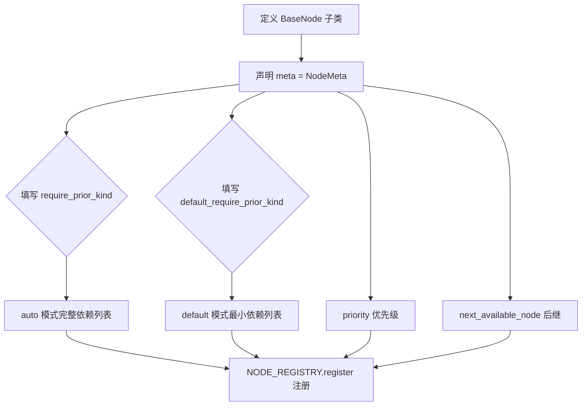
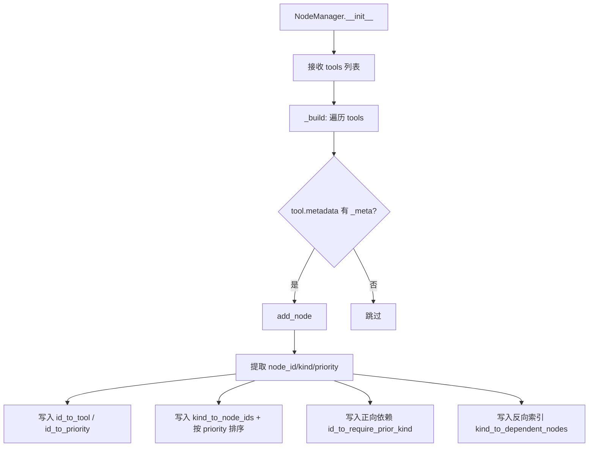
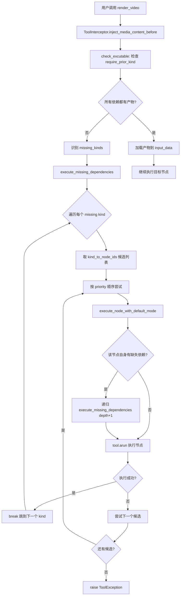

# PD-553.01 FireRed-OpenStoryline — BaseNode 抽象类 + NodeManager 依赖图引擎

> 文档编号：PD-553.01
> 来源：FireRed-OpenStoryline `src/open_storyline/nodes/`
> GitHub：https://github.com/FireRedTeam/FireRed-OpenStoryline.git
> 问题域：PD-553 节点式工作流引擎 Node Workflow Engine
> 状态：可复用方案

---

## 第 1 章 问题与动机

### 1.1 核心问题

视频生成流水线包含十余个处理步骤（媒体加载、镜头分割、片段理解、脚本生成、配音、配乐、时间线编排、渲染等），这些步骤之间存在复杂的依赖关系。传统做法是在编排层硬编码调用顺序，导致：

- **新增节点需要修改编排代码**：每加一个处理步骤，都要改调度逻辑
- **依赖关系散落在调用方**：哪个节点需要哪些前置数据，只有调用方知道
- **跳过/降级逻辑难以统一**：不同节点的 skip 行为各自实现，无法统一管理
- **缺失前置节点时需要人工干预**：用户忘记先执行某个步骤，整个流程就卡住

### 1.2 OpenStoryline 的解法概述

OpenStoryline 设计了一套声明式节点工作流引擎，核心思路是**让每个节点自己声明依赖，由引擎自动解析和补全**：

1. **NodeMeta 声明式依赖**：每个节点通过 `require_prior_kind` 和 `default_require_prior_kind` 声明自己需要哪些前置节点类型（`base_node.py:20-50`）
2. **NodeManager 依赖图索引**：维护 kind→node_ids 的正向索引和反向依赖索引，支持按 priority 排序的候选节点列表（`node_manager.py:11-28`）
3. **ToolInterceptor 递归依赖解析**：在 MCP 工具调用拦截层自动检测缺失依赖，递归执行前置节点直到依赖满足（`node_interceptors.py:112-228`）
4. **auto/skip/default 三模式执行**：`auto` 走完整 `process()`，非 auto 走 `default_process()` 提供降级输出（`base_node.py:206-217`）
5. **ArtifactStore 产物持久化**：每个节点的输出通过 ArtifactMeta 索引，支持按 session_id + node_id 查询最新产物（`agent_memory.py:23-152`）

### 1.3 设计思想

| 设计原则 | 具体实现 | 理由 | 替代方案 |
|----------|----------|------|----------|
| 声明式依赖 | NodeMeta.require_prior_kind 列表 | 依赖关系内聚到节点定义，新增节点零改编排代码 | 在编排层硬编码 DAG 边 |
| 双轨依赖 | require_prior_kind vs default_require_prior_kind | auto 模式需要完整依赖，default 模式可用最小依赖集快速降级 | 单一依赖列表 + 条件判断 |
| 候选 fallback | kind_to_node_ids 按 priority 排序，失败尝试下一个 | 同一 kind 可有多个实现（如 plan_timeline 和 plan_timeline_pro），高优先级失败自动降级 | 固定绑定单一实现 |
| 递归补全 | execute_missing_dependencies 递归解析 | 用户只需调用最终节点，引擎自动补全整条链路 | 要求用户按顺序手动执行 |
| 拦截器模式 | MCP before/after interceptor 注入依赖数据 | 节点代码无需关心数据来源，拦截器统一处理 I/O | 在每个节点内部手动加载前置数据 |

---

## 第 2 章 源码实现分析

### 2.1 架构概览

```
┌─────────────────────────────────────────────────────────────┐
│                    MCP Tool Call Layer                       │
│  ┌─────────────────────────────────────────────────────┐    │
│  │  ToolInterceptor.inject_media_content_before()      │    │
│  │  ┌───────────────────────────────────────────────┐  │    │
│  │  │ 1. 判断执行模式 (auto/skip/default)           │  │    │
│  │  │ 2. 查 NodeManager.check_excutable()           │  │    │
│  │  │ 3. 缺失? → execute_missing_dependencies()     │  │    │
│  │  │    └─ 递归: execute_node_with_default_mode()   │  │    │
│  │  │ 4. 加载前置产物到 input_data                   │  │    │
│  │  └───────────────────────────────────────────────┘  │    │
│  └─────────────────────────────────────────────────────┘    │
│                          ↓                                   │
│  ┌─────────────────────────────────────────────────────┐    │
│  │  BaseNode.__call__(node_state, **params)             │    │
│  │  ┌───────────────────────────────────────────────┐  │    │
│  │  │ mode == 'auto' → process()                    │  │    │
│  │  │ mode != 'auto' → default_process()            │  │    │
│  │  └───────────────────────────────────────────────┘  │    │
│  └─────────────────────────────────────────────────────┘    │
│                          ↓                                   │
│  ┌─────────────────────────────────────────────────────┐    │
│  │  ToolInterceptor.save_media_content_after()          │    │
│  │  → ArtifactStore.save_result() → meta.json           │    │
│  └─────────────────────────────────────────────────────┘    │
└─────────────────────────────────────────────────────────────┘

┌─────────────────────────────────────────────────────────────┐
│                    NodeManager (依赖图)                       │
│  kind_to_node_ids:  {"split_shots": ["split_shots"], ...}   │
│  id_to_priority:    {"split_shots": 5, ...}                 │
│  id_to_require_prior_kind: {"generate_script":              │
│                    ["split_shots","group_clips","understand_clips"]}│
│  kind_to_dependent_nodes: {"split_shots":                   │
│                    {"understand_clips","generate_script",...}}│
└─────────────────────────────────────────────────────────────┘
```

### 2.2 核心实现

#### 2.2.1 NodeMeta 声明式依赖



对应源码 `src/open_storyline/nodes/core_nodes/base_node.py:19-50`：

```python
@dataclass
class NodeMeta:
    name: str
    description: str
    node_id: str
    node_kind: str
    require_prior_kind: List[str] = field(default_factory=list)
    default_require_prior_kind: List[str] = field(default_factory=list)
    next_available_node: List[str] = field(default_factory=list)
    priority: int = 5
```

实际节点声明示例 — `generate_script` 节点（`generate_script.py:13-22`）：

```python
@NODE_REGISTRY.register()
class GenerateScriptNode(BaseNode):
    meta = NodeMeta(
        name="generate_script",
        description="Generate video script/copy...",
        node_id="generate_script",
        node_kind="generate_script",
        require_prior_kind=['split_shots', 'group_clips', 'understand_clips'],
        default_require_prior_kind=['split_shots', 'group_clips'],
        next_available_node=['generate_voiceover'],
    )
```

关键设计：`require_prior_kind` 包含 `understand_clips`（需要 AI 理解片段），而 `default_require_prior_kind` 不包含它——default 模式跳过 AI 理解，直接用空描述降级。

#### 2.2.2 NodeManager 依赖图构建



对应源码 `src/open_storyline/nodes/node_manager.py:30-77`：

```python
def _build(self, tools: List[StructuredTool]):
    for tool in tools:
        if tool.metadata:
            metadata = tool.metadata.get('_meta', {})
            node_id = metadata.get('node_id')
            if node_id:
                self.add_node(tool)

def add_node(self, tool: StructuredTool) -> bool:
    metadata = tool.metadata.get('_meta', {})
    node_id = metadata.get('node_id')
    node_kind = metadata.get('node_kind', node_id)
    priority = metadata.get('priority', 0)
    require_prior_kind = metadata.get('require_prior_kind', [])
    default_require_prior_kind = metadata.get('default_require_prior_kind', [])

    self.id_to_tool[node_id] = tool
    self.id_to_priority[node_id] = priority
    self.id_to_require_prior_kind[node_id] = require_prior_kind
    self.id_to_default_require_prior_kind[node_id] = default_require_prior_kind

    self.kind_to_node_ids[node_kind].append(node_id)
    self._sort_kind(node_kind)  # 按 priority 降序排列

    for kind in require_prior_kind:
        self.kind_to_dependent_nodes[kind].add(node_id)
```

`_sort_kind` 确保同一 kind 下多个候选节点按 priority 降序排列（`node_manager.py:133-139`），高优先级节点优先被选为依赖提供者。


#### 2.2.3 递归依赖解析（核心算法）



对应源码 `src/open_storyline/mcp/hooks/node_interceptors.py:86-232`：

```python
# 1. 判断执行模式，选择依赖列表
is_skip_mode = request.args.get('mode', 'auto') != 'auto'
require_kind = (
    meta_collector.id_to_default_require_prior_kind[node_id]
    if is_skip_mode
    else meta_collector.id_to_require_prior_kind[node_id]
)

# 2. 检查依赖是否满足
collect_result = meta_collector.check_excutable(session_id, store, require_kind)

# 3. 缺失依赖 → 递归补全
if not collect_result['excutable']:
    missing_kinds = collect_result['missing_kind']

    async def execute_missing_dependencies(
        missing_kinds, for_node_id, depth=0
    ):
        for kind in missing_kinds:
            success = False
            candidates = meta_collector.kind_to_node_ids[kind]
            for miss_id in candidates:
                try:
                    await execute_node_with_default_mode(
                        miss_id, for_node_id=for_node_id, depth=depth
                    )
                    success = True
                    break
                except ToolException:
                    continue
            if not success:
                raise ToolException(
                    f"Cannot satisfy dependency `{kind}`"
                )

    async def execute_node_with_default_mode(miss_id, for_node_id, depth=0):
        tool = meta_collector.get_tool(miss_id)
        tool_call_input = {
            'artifact_id': store.generate_artifact_id(miss_id),
            'mode': 'default'  # 强制 default 模式
        }
        # 递归检查该节点自身的依赖
        default_require = meta_collector.id_to_default_require_prior_kind[miss_id]
        default_collect_result = meta_collector.check_excutable(
            session_id, store, default_require
        )
        if not default_collect_result['excutable']:
            await execute_missing_dependencies(
                default_collect_result['missing_kind'],
                for_node_id=miss_id,
                depth=depth + 1
            )
        output = await tool.arun(ToolCall(
            args=tool_call_input,
            tool_call_type='default',
            runtime=runtime
        ))
```

### 2.3 实现细节

#### check_excutable 的产物查询逻辑

`NodeManager.check_excutable()` 遍历所有 require_kind，对每个 kind 查询 ArtifactStore 中是否存在该 kind 对应节点的最新产物（`node_manager.py:145-167`）：

```python
def check_excutable(self, session_id, store, all_require_kind):
    collected_output = {}
    for req_kind in all_require_kind:
        req_ids_queue = self.kind_to_node_ids[req_kind]
        valid_outputs = []
        for node_id in req_ids_queue:
            output = store.get_latest_meta(node_id=node_id, session_id=session_id)
            if output is not None:
                valid_outputs.append(output)
        if valid_outputs:
            latest_output = max(valid_outputs, key=lambda o: o.created_at)
            collected_output[req_kind] = latest_output
    return {
        "excutable": len(collected_output) == len(all_require_kind),
        "collected_node": collected_output,
        "missing_kind": list(set(all_require_kind) - set(collected_output.keys()))
    }
```

关键点：同一 kind 下多个节点（如 `plan_timeline` 和 `plan_timeline_pro`）的产物都会被检查，取 `created_at` 最新的那个。这意味着无论哪个实现产出了结果，下游节点都能使用。

#### BaseNode.__call__ 的三模式分发

`base_node.py:206-245` 中 `__call__` 方法根据 `mode` 参数分发：

- `mode == 'auto'`：调用 `process()` — 完整处理逻辑（如 AI 理解、LLM 生成）
- `mode != 'auto'`（包括 `'default'` 和 `'skip'`）：调用 `default_process()` — 降级/透传逻辑

每个具体节点的 `default_process()` 实现不同的降级策略：
- `SplitShotsNode.default_process()`：不做镜头分割，直接将原始媒体作为单个 clip 透传（`split_shots.py:446-463`）
- `GenerateScriptNode.default_process()`：返回空脚本 `{"group_scripts": [], "title": ""}` （`generate_script.py:26-34`）
- `UnderstandClipsNode.default_process()`：为每个 clip 填充 `"no caption"` 占位描述（`understand_clips.py:29-51`）
- `RecommendTransitionNode.default_process()`：返回空列表，不添加转场效果（`recommend_effects.py:29-35`）

#### NODE_REGISTRY 自动发现

`register.py:7-73` 实现了一个全局 `Registry` 单例，通过 `scan_package()` 自动导入包下所有模块触发 `@NODE_REGISTRY.register()` 装饰器：

```python
NODE_REGISTRY = Registry()

# 使用时
NODE_REGISTRY.scan_package("open_storyline.nodes.core_nodes")
# 自动导入所有模块 → 触发 @NODE_REGISTRY.register() → 注册所有节点类
```

#### 完整依赖图（从实际代码提取）

```
load_media (无前置)
  └→ split_shots (require: load_media)
       └→ understand_clips (require: load_media, split_shots)
       └→ group_clips (require: split_shots)  [推断]
            └→ generate_script (require: split_shots, group_clips, understand_clips)
            │    └→ generate_voiceover (require: generate_script)
            │    └→ elementrec_text (require: generate_script)
            └→ elementrec_transition (require: group_clips)
            └→ select_bgm [推断]
  └→ plan_timeline (require: load_media, split_shots, group_clips, generate_script, tts, music_rec)
       └→ render_video (require: load_media, plan_timeline, transition_rec, text_rec)
```

---

## 第 3 章 迁移指南

### 3.1 迁移清单

**阶段 1：核心抽象（1 个文件）**
- [ ] 定义 `NodeMeta` dataclass，包含 `node_id`, `node_kind`, `require_prior_kind`, `default_require_prior_kind`, `priority`
- [ ] 定义 `BaseNode` 抽象类，包含 `process()` 和 `default_process()` 两个抽象方法
- [ ] 实现 `__call__` 方法的 auto/default 模式分发

**阶段 2：依赖图引擎（1 个文件）**
- [ ] 实现 `NodeManager`，维护 kind→node_ids 正向索引和 id→require_prior_kind 依赖映射
- [ ] 实现 `check_executable()` 方法检查依赖是否满足
- [ ] 实现 `add_node()` / `remove_node()` 动态注册

**阶段 3：产物存储（1 个文件）**
- [ ] 实现 `ArtifactStore`，支持 `save_result()` / `load_result()` / `get_latest_meta()`
- [ ] 按 session_id + node_id 组织存储目录

**阶段 4：递归解析拦截器（1 个文件）**
- [ ] 实现 before interceptor，在工具调用前检查依赖、递归补全
- [ ] 实现 after interceptor，在工具调用后持久化产物

**阶段 5：节点注册表（1 个文件）**
- [ ] 实现 `Registry` 类 + `@register()` 装饰器
- [ ] 实现 `scan_package()` 自动发现

### 3.2 适配代码模板

以下是一个可直接运行的最小实现：

```python
from abc import ABC, abstractmethod
from dataclasses import dataclass, field
from typing import Any, Dict, List, Optional, Set
from collections import defaultdict
import time
import json
from pathlib import Path


@dataclass
class NodeMeta:
    """节点元数据：声明式依赖定义"""
    node_id: str
    node_kind: str
    require_prior_kind: List[str] = field(default_factory=list)
    default_require_prior_kind: List[str] = field(default_factory=list)
    priority: int = 5


class BaseNode(ABC):
    """节点抽象基类"""
    meta: NodeMeta

    async def __call__(self, mode: str = "auto", **inputs) -> Dict[str, Any]:
        if mode == "auto":
            return await self.process(inputs)
        return await self.default_process(inputs)

    @abstractmethod
    async def process(self, inputs: Dict[str, Any]) -> Any:
        """完整处理逻辑"""
        ...

    @abstractmethod
    async def default_process(self, inputs: Dict[str, Any]) -> Any:
        """降级/透传逻辑"""
        ...


class ArtifactStore:
    """产物存储：按 session + node 索引"""
    def __init__(self, base_dir: Path):
        self.base_dir = base_dir
        self._meta: List[dict] = []

    def save(self, session_id: str, node_id: str, data: Any) -> str:
        artifact_id = f"{node_id}_{time.time()}"
        path = self.base_dir / session_id / node_id / f"{artifact_id}.json"
        path.parent.mkdir(parents=True, exist_ok=True)
        with path.open("w") as f:
            json.dump(data, f)
        self._meta.append({
            "session_id": session_id, "node_id": node_id,
            "artifact_id": artifact_id, "path": str(path),
            "created_at": time.time()
        })
        return artifact_id

    def get_latest(self, session_id: str, node_id: str) -> Optional[Any]:
        candidates = [
            m for m in self._meta
            if m["session_id"] == session_id and m["node_id"] == node_id
        ]
        if not candidates:
            return None
        latest = max(candidates, key=lambda m: m["created_at"])
        with open(latest["path"]) as f:
            return json.load(f)


class NodeManager:
    """依赖图引擎"""
    def __init__(self):
        self.kind_to_nodes: Dict[str, List[BaseNode]] = defaultdict(list)
        self.id_to_node: Dict[str, BaseNode] = {}

    def register(self, node: BaseNode):
        self.id_to_node[node.meta.node_id] = node
        self.kind_to_nodes[node.meta.node_kind].append(node)
        self.kind_to_nodes[node.meta.node_kind].sort(
            key=lambda n: n.meta.priority, reverse=True
        )

    def check_executable(
        self, session_id: str, store: ArtifactStore, require_kinds: List[str]
    ) -> Dict[str, Any]:
        collected, missing = {}, []
        for kind in require_kinds:
            nodes = self.kind_to_nodes.get(kind, [])
            latest = None
            for n in nodes:
                result = store.get_latest(session_id, n.meta.node_id)
                if result is not None:
                    latest = result
                    break
            if latest is not None:
                collected[kind] = latest
            else:
                missing.append(kind)
        return {
            "executable": len(missing) == 0,
            "collected": collected,
            "missing": missing,
        }

    async def resolve_and_execute(
        self, session_id: str, store: ArtifactStore,
        node_id: str, mode: str = "auto"
    ) -> Any:
        """递归解析依赖并执行目标节点"""
        node = self.id_to_node[node_id]
        require = (
            node.meta.default_require_prior_kind if mode != "auto"
            else node.meta.require_prior_kind
        )
        result = self.check_executable(session_id, store, require)

        if not result["executable"]:
            for kind in result["missing"]:
                candidates = self.kind_to_nodes[kind]
                for candidate in candidates:
                    try:
                        await self.resolve_and_execute(
                            session_id, store,
                            candidate.meta.node_id, mode="default"
                        )
                        break
                    except Exception:
                        continue

        # 重新收集依赖数据
        result = self.check_executable(session_id, store, require)
        output = await node(mode=mode, **result["collected"])
        store.save(session_id, node.meta.node_id, output)
        return output
```

### 3.3 适用场景

| 场景 | 适用度 | 说明 |
|------|--------|------|
| 多步骤媒体处理流水线 | ⭐⭐⭐ | 视频/音频/图像处理链，节点间有明确数据依赖 |
| AI Agent 工具编排 | ⭐⭐⭐ | Agent 调用多个工具，工具间有前置依赖关系 |
| ETL 数据管道 | ⭐⭐ | 数据清洗→转换→加载，但通常用 Airflow 等成熟方案 |
| 简单线性流程 | ⭐ | 无分支无降级需求时，声明式依赖是过度设计 |
| 需要事务回滚的场景 | ⭐ | 本方案无回滚机制，不适合需要原子性的场景 |


---

## 第 4 章 测试用例

```python
import pytest
import asyncio
import tempfile
from pathlib import Path
from unittest.mock import AsyncMock, MagicMock
from dataclasses import dataclass, field
from typing import Any, Dict, List, Optional
from collections import defaultdict
import json
import time


# ---- 最小化复现核心类型 ----

@dataclass
class NodeMeta:
    node_id: str
    node_kind: str
    require_prior_kind: List[str] = field(default_factory=list)
    default_require_prior_kind: List[str] = field(default_factory=list)
    priority: int = 5


@dataclass
class ArtifactMeta:
    session_id: str
    artifact_id: str
    node_id: str
    created_at: float


class MockArtifactStore:
    """测试用产物存储"""
    def __init__(self):
        self._artifacts: Dict[str, List[ArtifactMeta]] = defaultdict(list)
        self._data: Dict[str, Any] = {}

    def save(self, session_id: str, node_id: str, data: Any) -> str:
        aid = f"{node_id}_{time.time()}"
        meta = ArtifactMeta(session_id, aid, node_id, time.time())
        self._artifacts[f"{session_id}:{node_id}"].append(meta)
        self._data[aid] = data
        return aid

    def get_latest_meta(self, node_id: str, session_id: str) -> Optional[ArtifactMeta]:
        key = f"{session_id}:{node_id}"
        candidates = self._artifacts.get(key, [])
        return max(candidates, key=lambda m: m.created_at) if candidates else None


class MockNodeManager:
    """测试用 NodeManager"""
    def __init__(self):
        self.kind_to_node_ids: Dict[str, List[str]] = defaultdict(list)
        self.id_to_priority: Dict[str, int] = {}
        self.id_to_require_prior_kind: Dict[str, List[str]] = {}
        self.id_to_default_require_prior_kind: Dict[str, List[str]] = {}

    def add_node(self, node_id, node_kind, priority=5,
                 require_prior_kind=None, default_require_prior_kind=None):
        self.kind_to_node_ids[node_kind].append(node_id)
        self.kind_to_node_ids[node_kind].sort(
            key=lambda nid: self.id_to_priority.get(nid, 0), reverse=True
        )
        self.id_to_priority[node_id] = priority
        self.id_to_require_prior_kind[node_id] = require_prior_kind or []
        self.id_to_default_require_prior_kind[node_id] = default_require_prior_kind or []

    def check_excutable(self, session_id, store, all_require_kind):
        collected = {}
        for kind in all_require_kind:
            for nid in self.kind_to_node_ids.get(kind, []):
                meta = store.get_latest_meta(node_id=nid, session_id=session_id)
                if meta:
                    collected[kind] = meta
                    break
        return {
            "excutable": len(collected) == len(all_require_kind),
            "collected_node": collected,
            "missing_kind": list(set(all_require_kind) - set(collected.keys()))
        }


class TestNodeMetaDependencyDeclaration:
    """测试 NodeMeta 声明式依赖"""

    def test_dual_dependency_lists(self):
        meta = NodeMeta(
            node_id="generate_script",
            node_kind="generate_script",
            require_prior_kind=["split_shots", "group_clips", "understand_clips"],
            default_require_prior_kind=["split_shots", "group_clips"],
        )
        assert "understand_clips" in meta.require_prior_kind
        assert "understand_clips" not in meta.default_require_prior_kind
        assert len(meta.require_prior_kind) > len(meta.default_require_prior_kind)

    def test_no_dependency_node(self):
        meta = NodeMeta(node_id="load_media", node_kind="load_media")
        assert meta.require_prior_kind == []
        assert meta.default_require_prior_kind == []

    def test_default_priority(self):
        meta = NodeMeta(node_id="test", node_kind="test")
        assert meta.priority == 5


class TestNodeManagerCheckExcutable:
    """测试 NodeManager.check_excutable"""

    def test_all_dependencies_satisfied(self):
        mgr = MockNodeManager()
        store = MockArtifactStore()
        mgr.add_node("load_media", "load_media")
        mgr.add_node("split_shots", "split_shots", require_prior_kind=["load_media"])
        store.save("sess1", "load_media", {"media": []})
        result = mgr.check_excutable("sess1", store, ["load_media"])
        assert result["excutable"] is True
        assert result["missing_kind"] == []

    def test_missing_dependency_detected(self):
        mgr = MockNodeManager()
        store = MockArtifactStore()
        mgr.add_node("split_shots", "split_shots", require_prior_kind=["load_media"])
        mgr.add_node("load_media", "load_media")
        result = mgr.check_excutable("sess1", store, ["load_media"])
        assert result["excutable"] is False
        assert "load_media" in result["missing_kind"]

    def test_priority_based_candidate_selection(self):
        mgr = MockNodeManager()
        store = MockArtifactStore()
        mgr.add_node("plan_v1", "plan_timeline", priority=3)
        mgr.add_node("plan_v2", "plan_timeline", priority=8)
        store.save("sess1", "plan_v2", {"timeline": "pro"})
        result = mgr.check_excutable("sess1", store, ["plan_timeline"])
        assert result["excutable"] is True

    def test_multiple_missing_kinds(self):
        mgr = MockNodeManager()
        store = MockArtifactStore()
        mgr.add_node("render", "render_video",
                      require_prior_kind=["load_media", "plan_timeline", "transition_rec"])
        mgr.add_node("load_media", "load_media")
        mgr.add_node("plan_timeline", "plan_timeline")
        mgr.add_node("elementrec_transition", "transition_rec")
        result = mgr.check_excutable("sess1", store, ["load_media", "plan_timeline", "transition_rec"])
        assert result["excutable"] is False
        assert len(result["missing_kind"]) == 3


class TestModeDispatch:
    """测试 auto/default 模式分发"""

    def test_auto_mode_selects_full_dependencies(self):
        meta = NodeMeta(
            node_id="gen_script",
            node_kind="generate_script",
            require_prior_kind=["split_shots", "group_clips", "understand_clips"],
            default_require_prior_kind=["split_shots", "group_clips"],
        )
        mode = "auto"
        is_skip = mode != "auto"
        deps = meta.default_require_prior_kind if is_skip else meta.require_prior_kind
        assert deps == ["split_shots", "group_clips", "understand_clips"]

    def test_skip_mode_selects_minimal_dependencies(self):
        meta = NodeMeta(
            node_id="gen_script",
            node_kind="generate_script",
            require_prior_kind=["split_shots", "group_clips", "understand_clips"],
            default_require_prior_kind=["split_shots", "group_clips"],
        )
        mode = "default"
        is_skip = mode != "auto"
        deps = meta.default_require_prior_kind if is_skip else meta.require_prior_kind
        assert deps == ["split_shots", "group_clips"]
        assert "understand_clips" not in deps
```

---

## 第 5 章 跨域关联

| 关联域 | 关系类型 | 说明 |
|--------|----------|------|
| PD-04 工具系统 | 依赖 | 每个 BaseNode 通过 MCP StructuredTool 暴露为工具，NodeManager 管理工具注册和查找 |
| PD-10 中间件管道 | 协同 | ToolInterceptor 的 before/after 拦截器本质是中间件模式，负责依赖注入和产物持久化 |
| PD-06 记忆持久化 | 协同 | ArtifactStore 是节点产物的持久化层，支持跨节点数据传递和会话恢复 |
| PD-02 多 Agent 编排 | 互补 | NodeManager 处理的是工具级依赖编排，与 Agent 级编排（如 LangGraph StateGraph）互补 |
| PD-03 容错与重试 | 协同 | 候选 fallback 机制（同 kind 多实现按 priority 尝试）是节点级容错策略 |

---

## 第 6 章 来源文件索引

| 文件 | 行范围 | 关键实现 |
|------|--------|----------|
| `src/open_storyline/nodes/core_nodes/base_node.py` | L19-L50 | NodeMeta dataclass 定义 |
| `src/open_storyline/nodes/core_nodes/base_node.py` | L54-L245 | BaseNode 抽象类 + __call__ 三模式分发 |
| `src/open_storyline/nodes/node_manager.py` | L11-L169 | NodeManager 依赖图引擎全部实现 |
| `src/open_storyline/mcp/hooks/node_interceptors.py` | L40-L249 | ToolInterceptor before/after 拦截器 |
| `src/open_storyline/mcp/hooks/node_interceptors.py` | L112-L228 | 递归依赖解析核心算法 |
| `src/open_storyline/storage/agent_memory.py` | L14-L152 | ArtifactStore + ArtifactMeta 产物存储 |
| `src/open_storyline/nodes/node_state.py` | L1-L17 | NodeState 执行上下文 |
| `src/open_storyline/utils/register.py` | L7-L73 | Registry 全局注册表 + scan_package 自动发现 |
| `src/open_storyline/nodes/core_nodes/generate_script.py` | L11-L22 | GenerateScriptNode 依赖声明示例 |
| `src/open_storyline/nodes/core_nodes/split_shots.py` | L420-L463 | SplitShotsNode + default_process 降级 |
| `src/open_storyline/nodes/core_nodes/understand_clips.py` | L12-L51 | UnderstandClipsNode + default_process 降级 |
| `src/open_storyline/nodes/core_nodes/recommend_effects.py` | L15-L54 | RecommendTransitionNode 双轨依赖示例 |
| `src/open_storyline/nodes/core_nodes/plan_timeline.py` | L860-L904 | PlanTimelineNode 多依赖声明 |
| `src/open_storyline/nodes/core_nodes/render_video.py` | L1002-L1023 | RenderVideoNode 终端节点 |

---

## 第 7 章 横向对比维度

```json comparison_data
{
  "project": "FireRed-OpenStoryline",
  "dimensions": {
    "节点抽象": "NodeMeta dataclass 声明式依赖 + BaseNode 双抽象方法(process/default_process)",
    "依赖解析": "NodeManager 正向/反向索引 + ToolInterceptor 递归补全缺失前置节点",
    "执行模式": "auto/default/skip 三模式，auto 走完整处理，default 走最小依赖降级",
    "候选机制": "同 kind 多实现按 priority 降序排列，高优先级失败自动尝试下一个",
    "产物存储": "ArtifactStore JSON 文件持久化，按 session_id+node_id 索引最新产物",
    "节点发现": "Registry 装饰器 + scan_package 自动导入触发注册"
  }
}
```

### 域元数据补充

```json domain_metadata
{
  "solution_summary": "OpenStoryline 用 NodeMeta 声明式依赖 + NodeManager 正反向索引 + ToolInterceptor 递归补全，实现 auto/default/skip 三模式节点工作流引擎",
  "description": "节点工作流引擎需要处理产物持久化与跨节点数据传递",
  "sub_problems": [
    "MCP拦截器层的依赖注入与产物序列化",
    "同kind多实现的产物合并与最新选取策略",
    "节点注册表的自动发现与包扫描机制"
  ],
  "best_practices": [
    "用before/after拦截器分离依赖解析与业务逻辑",
    "ArtifactStore按session+node索引支持多会话隔离",
    "Registry.scan_package自动导入触发装饰器注册"
  ]
}
```
