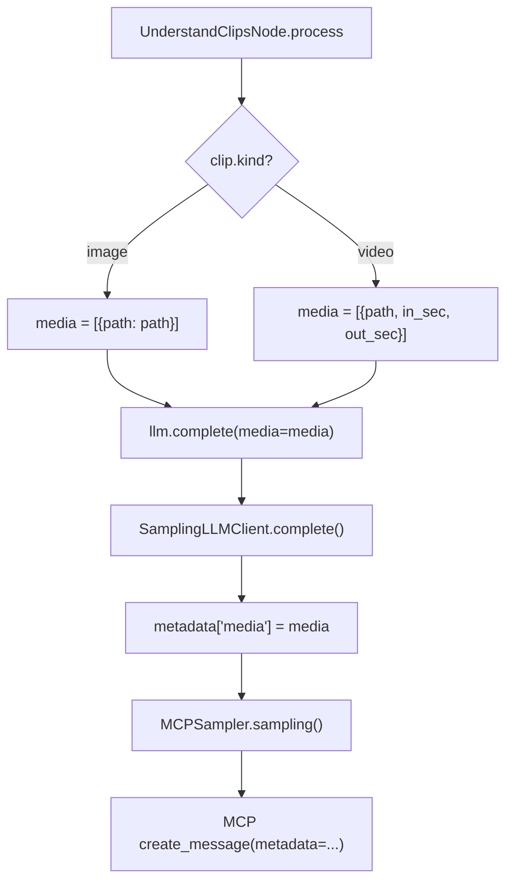
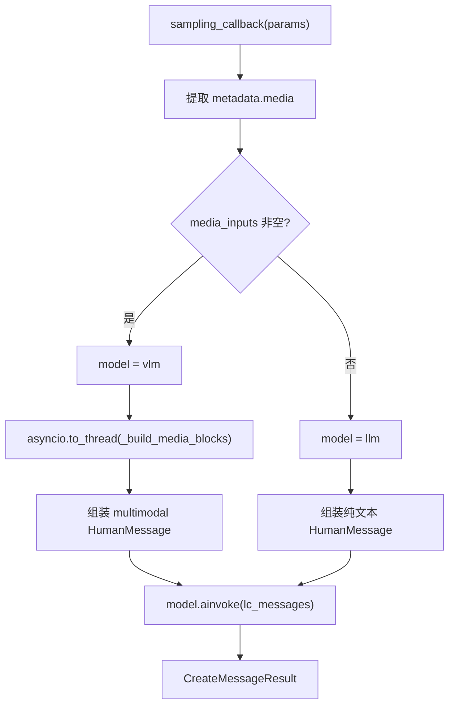
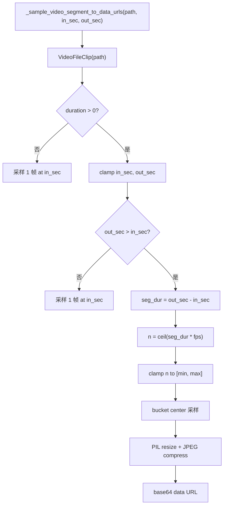

# PD-554.01 FireRed-OpenStoryline — MCP Sampling 双轨多模态处理管道

> 文档编号：PD-554.01
> 来源：FireRed-OpenStoryline `src/open_storyline/mcp/sampling_handler.py`
> GitHub：https://github.com/FireRedTeam/FireRed-OpenStoryline.git
> 问题域：PD-554 多模态处理管道 Multimodal Processing Pipeline
> 状态：可复用方案

---

## 第 1 章 问题与动机

### 1.1 核心问题

在视频故事线自动生成场景中，Agent 需要同时处理文本、图片和视频三种模态的输入。核心挑战包括：

1. **模型选择**：纯文本任务应走 LLM（成本低、速度快），含媒体的任务必须走 VLM（视觉语言模型），如何自动路由？
2. **视频帧采样**：视频不能直接发给 VLM，需要抽帧转图片。但帧数过多会导致 token 爆炸，过少则丢失关键信息。如何在信息量和成本之间取得平衡？
3. **图片压缩**：高分辨率图片的 base64 编码极大，直接发送会超出 API payload 限制。需要统一的缩放和压缩策略。
4. **全局预算控制**：当一次请求包含多个视频片段和图片时，总图片数可能失控。需要全局上限防止 payload 溢出。
5. **MCP 协议适配**：OpenStoryline 基于 MCP（Model Context Protocol）架构，Server 端的 Tool 只传递媒体路径和时间戳，实际的 base64 转换和模型调用发生在 Client 端的 sampling callback 中。这种 Server/Client 分离架构要求多模态处理逻辑必须在 callback 层透明完成。

### 1.2 OpenStoryline 的解法概述

OpenStoryline 采用 **MCP Sampling 双轨架构**，将多模态处理分为 Server 端（请求构建）和 Client 端（媒体处理 + 模型调用）两层：

1. **Server 端透传**：`SamplingLLMClient` (`sampling_requester.py:118`) 将 media 路径和时间戳通过 MCP metadata 透传给 Client，不做任何 base64 转换
2. **Client 端处理**：`make_sampling_callback` (`sampling_handler.py:308`) 在 Client 端接收 metadata.media，执行抽帧、压缩、base64 编码，并根据 media 是否存在自动选择 LLM/VLM
3. **时间段抽帧**：`_sample_video_segment_to_data_urls` (`sampling_handler.py:90`) 支持 `[in_sec, out_sec]` 精确时间段采样，帧数根据片段时长动态计算（`frames_per_sec * duration`，clamp 到 `[min_frames, max_frames]`）
4. **全局图片上限**：`GLOBAL_MAX_IMAGE_BLOCKS = 48` (`sampling_handler.py:24`) 硬性限制单次请求的总图片数（含视频帧 + 独立图片），超出后直接截断
5. **三格式归一化**：`_normalize_media_items` (`sampling_handler.py:169`) 统一处理字符串路径、字典、元组三种输入格式

### 1.3 设计思想

| 设计原则 | 具体实现 | 理由 | 替代方案 |
|----------|----------|------|----------|
| Server/Client 分离 | Server 只传路径+时间戳，Client 做 base64 | 避免大 payload 在 MCP 协议层传输；Server 无需依赖 PIL/moviepy | Server 端直接转 base64（增加 Server 依赖和网络开销） |
| 隐式模型路由 | `bool(media_inputs)` 决定 LLM vs VLM | 调用方无需关心模型选择，只需传 media 字段 | 显式传 model_type 参数（增加调用方负担） |
| 时间段精确采样 | `in_sec/out_sec` 参数 + bucket center 采样 | 视频故事线场景需要按片段理解，不是整段视频 | 均匀采样整个视频（浪费 token 在无关片段） |
| 全局硬上限 | `GLOBAL_MAX_IMAGE_BLOCKS = 48` | 防止多视频+多图片场景下 payload 溢出 | 按单视频限制（无法控制总量） |
| 异步线程卸载 | `asyncio.to_thread(_build_media_blocks, ...)` | PIL/moviepy 是 CPU 密集型同步操作，不能阻塞事件循环 | 直接在 async 函数中调用（阻塞整个事件循环） |

---

## 第 2 章 源码实现分析

### 2.1 架构概览

OpenStoryline 的多模态处理管道横跨 MCP Server 和 Client 两端，通过 MCP Sampling 协议桥接：

```
┌─────────────────── MCP Server 端 ───────────────────┐
│                                                       │
│  UnderstandClipsNode                                  │
│  (understand_clips.py:53)                             │
│       │                                               │
│       ▼                                               │
│  SamplingLLMClient.complete()                         │
│  (sampling_requester.py:127)                          │
│       │ media=[{path, in_sec, out_sec}]               │
│       ▼                                               │
│  MCPSampler.sampling()                                │
│  (sampling_requester.py:93)                           │
│       │ metadata.media = [...]  (透传路径+时间戳)      │
│       ▼                                               │
│  MCP create_message() ──── MCP 协议 ────────────────→ │
└───────────────────────────────────────────────────────┘
                        │
                        ▼
┌─────────────────── MCP Client 端 ──────────────────┐
│                                                      │
│  sampling_callback()                                 │
│  (sampling_handler.py:326)                           │
│       │                                              │
│       ├─ 1. 提取 metadata.media                      │
│       ├─ 2. _build_media_blocks() [asyncio.to_thread]│
│       │      ├─ _normalize_media_items()             │
│       │      ├─ 视频 → _sample_video_segment()       │
│       │      ├─ 图片 → _image_path_to_data_url()     │
│       │      └─ 全局计数 img_count < 48              │
│       ├─ 3. 路由: vlm if media else llm              │
│       ├─ 4. 组装 LangChain multimodal messages       │
│       └─ 5. model.ainvoke(lc_messages)               │
│                                                      │
└──────────────────────────────────────────────────────┘
```

### 2.2 核心实现

#### 2.2.1 Server 端：媒体路径透传



对应源码 `src/open_storyline/mcp/sampling_requester.py:118-160`：

```python
class SamplingLLMClient(LLMClient):
    """
    Only differentiate based on presence of media input.
    Server passes media paths and timestamps to Client, Client handles base64 conversion.
    """

    def __init__(self, sampler: BaseLLMSampling):
        self._sampler = sampler

    async def complete(self,
        *,
        system_prompt: str | None,
        user_prompt: str,
        media: list[dict[str, Any]] | None = None,
        temperature: float = 0.3,
        top_p: float = 0.9,
        max_tokens: int = 2048,
        model_preferences: dict[str, Any] | None = None,
        metadata: dict[str, Any] | None = None,
        stop_sequences: list[str] | None = None
    )-> str:
        messages = [
            SamplingMessage(
                role="user",
                content=TextContent(type="text", text=user_prompt),
            )
        ]

        merged_metadata = dict(metadata or {})
        merged_metadata["modality"] = "multimodal" if media else "text"
        if media:
            merged_metadata["media"] = media  # 关键：透传媒体路径和时间戳

        return await self._sampler.sampling(
            system_prompt=system_prompt,
            messages=messages,
            temperature=temperature,
            top_p=top_p,
            max_tokens=max_tokens,
            model_preferences=model_preferences,
            metadata=merged_metadata,
            stop_sequences=stop_sequences,
        )
```

注意 `merged_metadata["modality"]` 字段标记了请求类型，但实际路由逻辑在 Client 端的 `sampling_callback` 中通过 `bool(media_inputs)` 判断。

#### 2.2.2 Client 端：LLM/VLM 自动路由与媒体处理



对应源码 `src/open_storyline/mcp/sampling_handler.py:308-432`：

```python
def make_sampling_callback(
    llm,
    vlm,
    *,
    resize_edge: int = DEFAULT_RESIZE_EDGE,          # 600
    jpeg_quality: int = DEFAULT_JPEG_QUALITY,         # 80
    min_frames: int = DEFAULT_MIN_FRAMES,             # 2
    max_frames: int = DEFAULT_MAX_FRAMES,             # 6
    frames_per_sec: float = DEFAULT_FRAMES_PER_SEC,   # 3.0
    global_max_images: int = GLOBAL_MAX_IMAGE_BLOCKS, # 48
):
    async def sampling_callback(context, params):
        # 1. 提取 metadata 中的 media 列表
        metadata = getattr(params, "metadata", None) or {}
        media_inputs = list(metadata.get("media", []) or [])

        # 2. 隐式路由：有 media 走 VLM，无 media 走 LLM
        use_multimodal = bool(media_inputs)
        model = vlm if use_multimodal else llm
        if model is None:
            model = vlm or llm  # fallback

        # 3. CPU 密集操作卸载到线程池
        if use_multimodal:
            media_blocks = await asyncio.to_thread(
                _build_media_blocks,
                media_inputs, resize_edge, jpeg_quality,
                min_frames, max_frames, frames_per_sec, global_max_images,
            )

        # 4. 将 media_blocks 附加到最后一条 user message
        # 5. 调用选定模型
        resp = await bound.ainvoke(lc_messages)
        return CreateMessageResult(...)

    return sampling_callback
```

#### 2.2.3 视频时间段抽帧



对应源码 `src/open_storyline/mcp/sampling_handler.py:82-142`：

```python
def _choose_num_frames(duration_sec, min_frames, max_frames, frames_per_sec):
    n = int(math.ceil(duration_sec * frames_per_sec))
    n = max(min_frames, n)
    n = min(max_frames, n)
    return n

def _sample_video_segment_to_data_urls(
    video_path, in_sec, out_sec,
    resize_edge, jpeg_quality, min_frames, max_frames, frames_per_sec,
):
    clip = VideoFileClip(video_path, audio=False)
    try:
        vdur = float(clip.duration or 0.0)
        if vdur <= 0:
            # 保守策略：采样 1 帧
            frame = clip.get_frame(max(0.0, in_sec))
            return [(0.0, _pil_to_data_url(Image.fromarray(frame), resize_edge, jpeg_quality))]

        in_sec = max(0.0, min(in_sec, vdur))
        out_sec = max(0.0, min(out_sec, vdur))
        if out_sec <= in_sec:
            frame = clip.get_frame(in_sec)
            return [(0.0, _pil_to_data_url(Image.fromarray(frame), resize_edge, jpeg_quality))]

        seg_dur = out_sec - in_sec
        n = _choose_num_frames(seg_dur, min_frames, max_frames, frames_per_sec)
        # bucket center 采样：避免边界帧
        times = [((i + 0.5) / n) * seg_dur for i in range(n)]

        out = []
        for rel_t in times:
            abs_t = in_sec + rel_t
            frame = clip.get_frame(abs_t)
            out.append((rel_t, _pil_to_data_url(Image.fromarray(frame), resize_edge, jpeg_quality)))
        return out
    finally:
        clip.close()
```

### 2.3 实现细节

**三格式媒体归一化** (`sampling_handler.py:169-204`)：

`_normalize_media_items` 支持三种输入格式，统一输出为 `{"url": ..., "in_sec": ..., "out_sec": ...}` 字典：

| 输入格式 | 示例 | 说明 |
|----------|------|------|
| 字符串 | `"video.mp4"` | 最简形式，整段视频 |
| 元组 | `("video.mp4", 1.2, 3.4)` | 带时间段的紧凑形式 |
| 字典 | `{"url": "video.mp4", "in_sec": 1.2, "out_sec": 3.4}` | 完整形式，支持 `url`/`path`/`media` 三种 key |

**全局图片计数器** (`sampling_handler.py:222-301`)：

`_build_media_blocks` 维护一个 `img_count` 计数器，每添加一张图片（含视频帧）就递增。当 `img_count >= global_max_images`（默认 48）时，立即停止处理后续媒体项。这个计数器跨越所有媒体项，确保单次请求的总图片数不超限。

**图片压缩策略** (`sampling_handler.py:55-74`)：

所有图片（含视频帧）统一经过：
1. `_resize_long_edge`：长边缩放到 600px（LANCZOS 插值）
2. 转 RGB → JPEG（quality=80, optimize=True）
3. base64 编码为 data URL


---

## 第 3 章 迁移指南

### 3.1 迁移清单

**阶段 1：基础多模态处理（1 个文件）**

- [ ] 实现 `_resize_long_edge` + `_pil_to_data_url` 图片压缩函数
- [ ] 实现 `_sample_video_segment_to_data_urls` 视频抽帧函数
- [ ] 实现 `_normalize_media_items` 三格式归一化
- [ ] 实现 `_build_media_blocks` 全局计数器 + 媒体块构建
- [ ] 依赖：`Pillow`, `moviepy`

**阶段 2：LLM/VLM 路由（1 个文件）**

- [ ] 定义 `LLMClient` Protocol（`complete` 方法含 `media` 参数）
- [ ] 实现 `SamplingLLMClient`：将 media 透传到 metadata
- [ ] 实现 `make_sampling_callback`：根据 media 存在性选择模型

**阶段 3：集成到你的 Agent 框架**

- [ ] 在 Agent 初始化时创建 LLM 和 VLM 两个模型实例
- [ ] 将 `sampling_callback` 注册到你的 MCP Client 或直接作为中间件使用
- [ ] 调整 `GLOBAL_MAX_IMAGE_BLOCKS` 和 `DEFAULT_RESIZE_EDGE` 等参数适配你的模型

### 3.2 适配代码模板

以下是一个独立可运行的多模态处理管道，不依赖 MCP 协议：

```python
import asyncio
import math
import base64
import os
from io import BytesIO
from typing import Any, Dict, List, Tuple, Optional, Protocol

from PIL import Image
from moviepy.video.io.VideoFileClip import VideoFileClip


# ── 配置常量 ──
RESIZE_EDGE = 600
JPEG_QUALITY = 80
MIN_FRAMES = 2
MAX_FRAMES = 6
FRAMES_PER_SEC = 3.0
GLOBAL_MAX_IMAGES = 48

IMAGE_EXTS = {".jpg", ".jpeg", ".png", ".webp", ".bmp", ".gif"}
VIDEO_EXTS = {".mp4", ".mov", ".mkv", ".avi", ".webm"}


class LLMClient(Protocol):
    """统一的 LLM 调用协议"""
    async def invoke(self, messages: list[dict]) -> str: ...


def resize_and_encode(img: Image.Image, resize_edge: int = RESIZE_EDGE,
                      jpeg_quality: int = JPEG_QUALITY) -> str:
    """缩放图片并编码为 base64 data URL"""
    img = img.convert("RGB")
    w, h = img.size
    le = max(w, h)
    if le > resize_edge > 0:
        scale = resize_edge / float(le)
        img = img.resize((max(1, int(w * scale)), max(1, int(h * scale))), Image.LANCZOS)
    buf = BytesIO()
    img.save(buf, format="JPEG", quality=jpeg_quality, optimize=True)
    return f"data:image/jpeg;base64,{base64.b64encode(buf.getvalue()).decode()}"


def sample_video_frames(video_path: str, in_sec: float = 0.0,
                        out_sec: float = 1e12) -> List[str]:
    """从视频时间段中采样帧，返回 base64 data URL 列表"""
    clip = VideoFileClip(video_path, audio=False)
    try:
        dur = float(clip.duration or 0)
        if dur <= 0:
            frame = clip.get_frame(max(0.0, in_sec))
            return [resize_and_encode(Image.fromarray(frame))]

        in_sec = max(0.0, min(in_sec, dur))
        out_sec = max(0.0, min(out_sec, dur))
        if out_sec <= in_sec:
            return [resize_and_encode(Image.fromarray(clip.get_frame(in_sec)))]

        seg_dur = out_sec - in_sec
        n = min(MAX_FRAMES, max(MIN_FRAMES, int(math.ceil(seg_dur * FRAMES_PER_SEC))))
        times = [in_sec + ((i + 0.5) / n) * seg_dur for i in range(n)]

        return [resize_and_encode(Image.fromarray(clip.get_frame(t))) for t in times]
    finally:
        clip.close()


def build_multimodal_content(
    text: str,
    media: List[Dict[str, Any]],
    max_images: int = GLOBAL_MAX_IMAGES,
) -> list[dict]:
    """构建 OpenAI 兼容的多模态 content 块"""
    blocks = [{"type": "text", "text": text}]
    img_count = 0

    for item in media:
        if img_count >= max_images:
            break
        url = item.get("url") or item.get("path") or ""
        ext = os.path.splitext(url)[1].lower()

        if ext in IMAGE_EXTS:
            data_url = resize_and_encode(Image.open(url))
            blocks.append({"type": "image_url", "image_url": {"url": data_url}})
            img_count += 1
        elif ext in VIDEO_EXTS:
            in_s = float(item.get("in_sec", 0))
            out_s = float(item.get("out_sec", 1e12))
            for frame_url in sample_video_frames(url, in_s, out_s):
                if img_count >= max_images:
                    break
                blocks.append({"type": "image_url", "image_url": {"url": frame_url}})
                img_count += 1

    return blocks


async def multimodal_complete(
    llm: LLMClient,
    vlm: LLMClient,
    text: str,
    media: Optional[List[Dict[str, Any]]] = None,
) -> str:
    """自动路由：有 media 走 VLM，无 media 走 LLM"""
    if media:
        content = await asyncio.to_thread(build_multimodal_content, text, media)
        model = vlm
    else:
        content = text
        model = llm
    return await model.invoke([{"role": "user", "content": content}])
```

### 3.3 适用场景

| 场景 | 适用度 | 说明 |
|------|--------|------|
| 视频理解 Agent（故事线/字幕/摘要） | ⭐⭐⭐ | 核心场景，时间段抽帧 + VLM 理解 |
| 多模态 RAG（图文混合检索） | ⭐⭐⭐ | 图片压缩 + base64 编码可直接复用 |
| 视频审核/质检 | ⭐⭐ | 需要调整抽帧密度参数 |
| 实时视频流处理 | ⭐ | 不适用，本方案面向离线文件 |
| 纯文本 Agent | ⭐ | 无需多模态管道，直接用 LLM |

---

## 第 4 章 测试用例

```python
import pytest
import math
import base64
from unittest.mock import MagicMock, AsyncMock, patch
from PIL import Image
from io import BytesIO


class TestResizeLongEdge:
    """测试图片缩放逻辑 - 对应 sampling_handler.py:55-65"""

    def test_small_image_no_resize(self):
        """小于目标尺寸的图片不缩放"""
        img = Image.new("RGB", (400, 300))
        from open_storyline.mcp.sampling_handler import _resize_long_edge
        result = _resize_long_edge(img, 600)
        assert result.size == (400, 300)

    def test_large_image_resize(self):
        """大于目标尺寸的图片按长边缩放"""
        img = Image.new("RGB", (1200, 800))
        from open_storyline.mcp.sampling_handler import _resize_long_edge
        result = _resize_long_edge(img, 600)
        assert max(result.size) == 600
        assert result.size == (600, 400)

    def test_zero_edge_no_resize(self):
        """resize_edge=0 时不缩放"""
        img = Image.new("RGB", (1200, 800))
        from open_storyline.mcp.sampling_handler import _resize_long_edge
        result = _resize_long_edge(img, 0)
        assert result.size == (1200, 800)


class TestChooseNumFrames:
    """测试帧数计算逻辑 - 对应 sampling_handler.py:82-87"""

    def test_short_segment_min_frames(self):
        from open_storyline.mcp.sampling_handler import _choose_num_frames
        # 0.5s * 3fps = 1.5 → ceil=2, clamp to min=2
        assert _choose_num_frames(0.5, min_frames=2, max_frames=6, frames_per_sec=3.0) == 2

    def test_long_segment_max_frames(self):
        from open_storyline.mcp.sampling_handler import _choose_num_frames
        # 10s * 3fps = 30 → ceil=30, clamp to max=6
        assert _choose_num_frames(10.0, min_frames=2, max_frames=6, frames_per_sec=3.0) == 6

    def test_medium_segment(self):
        from open_storyline.mcp.sampling_handler import _choose_num_frames
        # 1.5s * 3fps = 4.5 → ceil=5, within [2,6]
        assert _choose_num_frames(1.5, min_frames=2, max_frames=6, frames_per_sec=3.0) == 5


class TestNormalizeMediaItems:
    """测试三格式归一化 - 对应 sampling_handler.py:169-204"""

    def test_string_input(self):
        from open_storyline.mcp.sampling_handler import _normalize_media_items
        result = _normalize_media_items(["video.mp4"])
        assert result == [{"url": "video.mp4"}]

    def test_tuple_input(self):
        from open_storyline.mcp.sampling_handler import _normalize_media_items
        result = _normalize_media_items([("video.mp4", 1.0, 3.0)])
        assert result == [{"url": "video.mp4", "in_sec": 1.0, "out_sec": 3.0}]

    def test_dict_input_with_path_key(self):
        from open_storyline.mcp.sampling_handler import _normalize_media_items
        result = _normalize_media_items([{"path": "img.jpg"}])
        assert result == [{"url": "img.jpg"}]

    def test_mixed_inputs(self):
        from open_storyline.mcp.sampling_handler import _normalize_media_items
        items = ["a.jpg", ("b.mp4", 0, 5), {"url": "c.png"}]
        result = _normalize_media_items(items)
        assert len(result) == 3
        assert all("url" in r for r in result)


class TestGlobalImageLimit:
    """测试全局图片上限 - 对应 sampling_handler.py:222-301"""

    def test_exceeds_global_limit(self):
        from open_storyline.mcp.sampling_handler import _build_media_blocks
        # 构造 50 张图片输入，全局上限 5
        items = [f"data:image/jpeg;base64,{base64.b64encode(b'x').decode()}" for _ in range(50)]
        blocks = _build_media_blocks(
            items, resize_edge=600, jpeg_quality=80,
            min_frames=2, max_frames=6, frames_per_sec=3.0,
            global_max_images=5,
        )
        image_blocks = [b for b in blocks if b.get("type") == "image_url"]
        assert len(image_blocks) == 5


class TestModelRouting:
    """测试 LLM/VLM 自动路由 - 对应 sampling_handler.py:346-347"""

    @pytest.mark.asyncio
    async def test_text_only_uses_llm(self):
        llm = MagicMock()
        vlm = MagicMock()
        llm.bind.return_value = llm
        llm.ainvoke = AsyncMock(return_value=MagicMock(content="text response"))

        from open_storyline.mcp.sampling_handler import make_sampling_callback
        callback = make_sampling_callback(llm, vlm)

        params = MagicMock()
        params.systemPrompt = ""
        params.messages = []
        params.metadata = {}  # 无 media
        params.temperature = 0.6
        params.maxTokens = 4096

        result = await callback(None, params)
        llm.ainvoke.assert_called_once()
        vlm.ainvoke.assert_not_called()
```


---

## 第 5 章 跨域关联

| 关联域 | 关系类型 | 说明 |
|--------|----------|------|
| PD-01 上下文管理 | 协同 | `GLOBAL_MAX_IMAGE_BLOCKS=48` 本质是 token 预算控制，图片压缩（600px + JPEG 80）也是为了减少 base64 体积从而控制上下文窗口消耗 |
| PD-03 容错与重试 | 协同 | `UnderstandClipsNode` 中对每个 clip 的 VLM 调用有 `max_retries=2` 重试 + 指数退避（`0.3 * (attempt+1)`），`sampling_callback` 中对 `model.bind()` 参数不兼容有 try/except 降级 |
| PD-04 工具系统 | 依赖 | 整个多模态管道通过 MCP Tool 系统暴露，`register_tools.py` 将 `BaseNode` 子类自动注册为 MCP Tool，`make_llm(mcp_ctx)` 在 Tool wrapper 中创建 |
| PD-10 中间件管道 | 协同 | `sampling_callback` 本身就是 MCP Sampling 协议的中间件，拦截所有 `create_message` 请求并注入多模态处理逻辑 |
| PD-11 可观测性 | 潜在 | 当前实现缺少对图片数量、压缩比、抽帧耗时的指标采集，可通过在 `_build_media_blocks` 中添加计数器增强 |

---

## 第 6 章 来源文件索引

| 文件 | 行范围 | 关键实现 |
|------|--------|----------|
| `src/open_storyline/mcp/sampling_handler.py` | L1-L433 | 核心：多模态处理全部逻辑（抽帧、压缩、路由、全局限制） |
| `src/open_storyline/mcp/sampling_handler.py` | L19-L24 | 6 个可配置常量（resize_edge, jpeg_quality, min/max_frames, fps, global_max） |
| `src/open_storyline/mcp/sampling_handler.py` | L55-L74 | 图片缩放 + JPEG 压缩 + base64 编码 |
| `src/open_storyline/mcp/sampling_handler.py` | L82-L142 | 视频时间段抽帧（bucket center 采样） |
| `src/open_storyline/mcp/sampling_handler.py` | L169-L204 | 三格式媒体输入归一化 |
| `src/open_storyline/mcp/sampling_handler.py` | L207-L305 | 媒体块构建 + 全局图片计数器 |
| `src/open_storyline/mcp/sampling_handler.py` | L308-L432 | make_sampling_callback 工厂 + LLM/VLM 路由 |
| `src/open_storyline/mcp/sampling_requester.py` | L12-L26 | BaseLLMSampling Protocol 定义 |
| `src/open_storyline/mcp/sampling_requester.py` | L28-L44 | LLMClient Protocol（含 media 参数） |
| `src/open_storyline/mcp/sampling_requester.py` | L46-L116 | MCPSampler：MCP create_message 封装 |
| `src/open_storyline/mcp/sampling_requester.py` | L118-L164 | SamplingLLMClient：媒体路径透传 + modality 标记 |
| `src/open_storyline/nodes/core_nodes/understand_clips.py` | L53-L194 | UnderstandClipsNode：按 clip 遍历调用 VLM + 重试 |
| `src/open_storyline/nodes/core_nodes/understand_clips.py` | L89-L115 | 媒体组装：image 直传路径，video 计算 in_sec/out_sec |
| `src/open_storyline/agent.py` | L59-L94 | LLM/VLM 双模型初始化 + sampling_callback 注册 |
| `src/open_storyline/mcp/register_tools.py` | L21-L89 | Node → MCP Tool 自动注册工厂 |
| `src/open_storyline/nodes/node_state.py` | L1-L17 | NodeState dataclass（含 llm: SamplingLLMClient） |

---

## 第 7 章 横向对比维度

```json comparison_data
{
  "project": "FireRed-OpenStoryline",
  "dimensions": {
    "处理架构": "MCP Sampling 双轨：Server 透传路径，Client 端 callback 做 base64 转换和模型调用",
    "路由策略": "隐式路由：bool(media_inputs) 决定 LLM/VLM，调用方无需指定模型",
    "帧采样策略": "时间段 bucket center 采样：fps×duration 动态帧数，clamp [2,6]",
    "压缩策略": "统一 JPEG：长边 600px LANCZOS + quality=80 + optimize",
    "预算控制": "全局计数器 GLOBAL_MAX_IMAGE_BLOCKS=48，跨所有媒体项累计",
    "输入归一化": "三格式（str/tuple/dict）统一为 {url, in_sec, out_sec} 字典",
    "异步策略": "asyncio.to_thread 卸载 PIL/moviepy CPU 密集操作"
  }
}
```

### 域元数据补充

```json domain_metadata
{
  "solution_summary": "OpenStoryline 用 MCP Sampling 双轨架构实现多模态处理：Server 端透传媒体路径+时间戳，Client 端 callback 做视频 bucket-center 抽帧、JPEG 压缩、LLM/VLM 隐式路由，全局 48 帧硬上限控制 payload",
  "description": "MCP 协议下 Server/Client 分离的多模态处理与模型路由",
  "sub_problems": [
    "MCP 协议层媒体数据透传策略",
    "CPU 密集型媒体处理的异步卸载"
  ],
  "best_practices": [
    "用 asyncio.to_thread 卸载 PIL/moviepy 同步操作避免阻塞事件循环",
    "bucket center 采样避免视频边界帧（黑帧/转场帧）"
  ]
}
```

