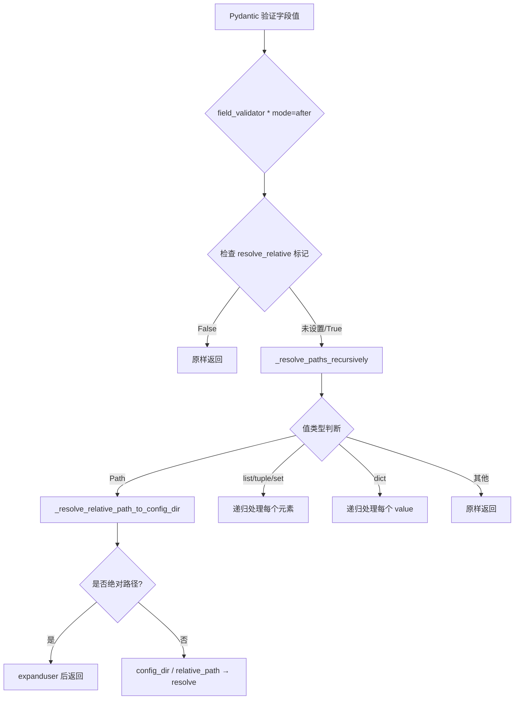
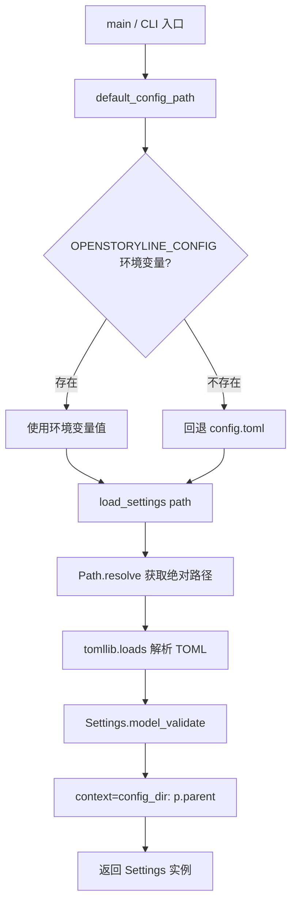

# PD-555.01 FireRed-OpenStoryline — TOML+Pydantic 类型安全配置与路径自解析

> 文档编号：PD-555.01
> 来源：FireRed-OpenStoryline `src/open_storyline/config.py`
> GitHub：https://github.com/FireRedTeam/FireRed-OpenStoryline.git
> 问题域：PD-555 配置管理 Configuration Management
> 状态：可复用方案

---

## 第 1 章 问题与动机

### 1.1 核心问题

多模态 AI 应用（视频理解、TTS、BGM 选择等）涉及大量异构配置：LLM/VLM 模型参数、MCP 服务器连接、多个 TTS 供应商凭证、视频处理参数、路径引用等。这些配置有三个典型痛点：

1. **路径漂移**：`config.toml` 中写的相对路径（如 `./outputs/media`）在不同工作目录下解析结果不同，导致文件找不到
2. **类型不安全**：TOML 解析后是 `dict[str, Any]`，拼写错误或类型错误只在运行时才暴露
3. **多模型配置膨胀**：LLM、VLM、TTS 各有独立的 model/base_url/api_key/timeout 参数组，手动管理容易遗漏

### 1.2 FireRed-OpenStoryline 的解法概述

OpenStoryline 用一个 261 行的 `config.py`（`src/open_storyline/config.py:1-261`）解决了上述全部问题：

1. **ConfigBaseModel 基类** — 继承 Pydantic BaseModel，通过 `field_validator("*", mode="after")` 对所有字段做后处理，自动将 Path 类型字段解析为基于 config.toml 所在目录的绝对路径（`config.py:61-75`）
2. **递归路径解析** — `_resolve_paths_recursively` 函数递归处理 list/tuple/set/dict 中嵌套的 Path 对象，确保深层配置中的路径也被正确解析（`config.py:36-58`）
3. **context 传递 config_dir** — `load_settings` 通过 `model_validate(data, context={"config_dir": p.parent})` 将 TOML 文件所在目录注入验证上下文（`config.py:254-257`）
4. **环境变量回退** — `default_config_path()` 优先读取 `OPENSTORYLINE_CONFIG` 环境变量，回退到 `config.toml`（`config.py:259-261`）
5. **按职责拆分子模型** — 15 个独立的 Config 子类（LLMConfig、VLMConfig、MCPConfig 等），每个子类只管自己的字段，通过顶层 Settings 聚合（`config.py:77-251`）

### 1.3 设计思想

| 设计原则 | 具体实现 | 理由 | 替代方案 |
|----------|----------|------|----------|
| 路径基于配置文件而非 CWD | `_resolve_relative_path_to_config_dir` 用 config.toml 的 parent 作为 base | 避免 `python -m` 和 `cd` 导致路径漂移 | 全部用绝对路径（不灵活） |
| 通配符验证器 | `field_validator("*")` 一次性拦截所有字段 | 新增 Path 字段无需手动加 validator | 每个 Path 字段单独写 validator（重复） |
| 递归容器处理 | 递归遍历 list/dict/tuple/set 中的 Path | 支持 `List[Path]`、`Dict[str, Path]` 等复合类型 | 只处理顶层 Path（遗漏嵌套） |
| extra="forbid" | ConfigDict(extra="forbid") | TOML 拼写错误立即报错，不会静默忽略 | extra="allow"（隐藏错误） |
| 可选禁用路径解析 | `json_schema_extra={"resolve_relative": False}` | 某些字段（如 URL path）不应被当作文件路径解析 | 无法豁免（过度解析） |

---

## 第 2 章 源码实现分析

### 2.1 架构概览

```
┌─────────────────────────────────────────────────────────┐
│                    config.toml (TOML)                    │
│  [developer] [project] [llm] [vlm] [local_mcp_server]  │
│  [skills] [split_shots] [generate_voiceover] ...        │
└──────────────────────┬──────────────────────────────────┘
                       │ tomllib.loads()
                       ▼
┌─────────────────────────────────────────────────────────┐
│              load_settings(config_path)                  │
│  1. Path(config_path).resolve()                         │
│  2. tomllib.loads(text) → dict                          │
│  3. Settings.model_validate(data,                       │
│       context={"config_dir": p.parent})                 │
└──────────────────────┬──────────────────────────────────┘
                       │ Pydantic validation
                       ▼
┌─────────────────────────────────────────────────────────┐
│                  Settings (顶层聚合)                     │
│  ├── developer: DeveloperConfig                         │
│  ├── project: ProjectConfig     ← Path 字段自动解析     │
│  ├── llm: LLMConfig                                    │
│  ├── vlm: VLMConfig                                    │
│  ├── local_mcp_server: MCPConfig                       │
│  ├── skills: SkillsConfig       ← Path 字段自动解析     │
│  ├── split_shots: SplitShotsConfig ← Path 字段自动解析  │
│  ├── generate_voiceover: GenerateVoiceoverConfig        │
│  └── ... (15 个子模型)                                   │
└──────────────────────┬──────────────────────────────────┘
                       │ 注入到各消费者
                       ▼
        ┌──────────────┼──────────────┐
        ▼              ▼              ▼
   MCP Server      Agent Builder   BaseNode
   (server.py)     (agent.py)     (base_node.py)
```

### 2.2 核心实现

#### 2.2.1 ConfigBaseModel 通配符路径解析器



对应源码 `src/open_storyline/config.py:17-75`：

```python
def _resolve_relative_path_to_config_dir(v: Path, info: ValidationInfo) -> Path:
    """
    Resolve relative paths based on config.toml's directory (not cwd).
    Requires the caller to pass config_dir in model_validate(..., context={"config_dir": <Path|str>}).
    """
    ctx = info.context or {}
    base = ctx.get("config_dir")
    if not base:
        return v
    v2 = v.expanduser()
    if v2.is_absolute():
        return v2
    base_dir = Path(base).expanduser()
    return (base_dir / v2).resolve(strict=False)


def _resolve_paths_recursively(value: Any, info: ValidationInfo) -> Any:
    """Recursively process Path objects in container types (list/tuple/set/dict)."""
    if value is None:
        return None
    if isinstance(value, Path):
        return _resolve_relative_path_to_config_dir(value, info)
    if isinstance(value, list):
        return [_resolve_paths_recursively(v, info) for v in value]
    if isinstance(value, tuple):
        return tuple(_resolve_paths_recursively(v, info) for v in value)
    if isinstance(value, set):
        return {_resolve_paths_recursively(v, info) for v in value}
    if isinstance(value, dict):
        return {k: _resolve_paths_recursively(v, info) for k, v in value.items()}
    return value


class ConfigBaseModel(BaseModel):
    model_config = ConfigDict(extra="forbid")

    @field_validator("*", mode="after")
    @classmethod
    def _resolve_all_path_fields(cls, v: Any, info: ValidationInfo) -> Any:
        if info.field_name:
            field = cls.model_fields.get(info.field_name)
            extra = (field.json_schema_extra or {}) if field else {}
            if extra.get("resolve_relative") is False:
                return v
        return _resolve_paths_recursively(v, info)
```

#### 2.2.2 Settings 顶层聚合与 load_settings 入口



对应源码 `src/open_storyline/config.py:233-261`：

```python
class Settings(ConfigBaseModel):
    developer: DeveloperConfig
    project: ProjectConfig
    llm: LLMConfig
    vlm: VLMConfig
    local_mcp_server: MCPConfig
    skills: SkillsConfig
    search_media: PexelsConfig
    split_shots: SplitShotsConfig
    understand_clips: UnderstandClipsConfig
    script_template: RecommendScriptTemplateConfig
    generate_voiceover: GenerateVoiceoverConfig
    select_bgm: SelectBGMConfig
    recommend_text: RecommendTextConfig
    plan_timeline: PlanTimelineConfig
    plan_timeline_pro: PlanTimelineProConfig


def load_settings(config_path: str | Path) -> Settings:
    p = Path(config_path).expanduser().resolve()
    data = tomllib.loads(p.read_text(encoding="utf-8"))
    return Settings.model_validate(data, context={"config_dir": p.parent})

def default_config_path() -> str:
    return os.getenv("OPENSTORYLINE_CONFIG", "config.toml")
```

### 2.3 实现细节

#### 配置消费链路

Settings 实例在系统中有三条主要消费路径：

1. **MCP Server 启动**（`mcp/server.py:50-55`）：`load_settings` → `create_server(cfg)` → 用 `cfg.local_mcp_server` 配置 FastMCP 实例，用 `cfg.project.outputs_dir` 初始化 SessionLifecycleManager

2. **Agent 构建**（`agent.py:35-126`）：`cfg.llm` / `cfg.vlm` 分别构建 ChatOpenAI 实例，支持运行时 override（用户在 UI 表单中填写的值优先于 config.toml）

3. **Node 初始化**（`base_node.py:59-61`）：每个 BaseNode 子类通过 `__init__(self, server_cfg: Settings)` 接收完整 Settings，按需读取自己关心的子配置

#### 运行时 Override 机制

`agent.py:44-57` 实现了一个简洁的 override 模式：

```python
def _get(override: Optional[dict], key: str, default: Any) -> Any:
    return (override.get(key) if isinstance(override, dict) and key in override else default)

# LLM: use user input from form first, fall back to config.toml
llm_model = _get(llm_override, "model", cfg.llm.model)
llm_base_url = _norm_url(_get(llm_override, "base_url", cfg.llm.base_url))
```

#### LLM 池化与动态模型切换

`chat_middleware.py:67-91` 实现了基于 `developer.chat_models_config` 的动态模型池：

```python
def _make_chat_llm(cfg: Settings, model_name: str, streaming: bool) -> ChatOpenAI:
    model_config = (cfg.developer.chat_models_config.get(model_name) or {})
    base_url = _norm_url(model_config.get("base_url") or "")
    api_key = model_config.get("api_key")
    return ChatOpenAI(
        model=model_name, base_url=base_url, api_key=api_key,
        timeout=cfg.llm.timeout,
        temperature=model_config.get("temperature", cfg.llm.temperature),
        streaming=streaming,
    )

def _get_llm(cfg, llm_pool, model_name, streaming) -> ChatOpenAI:
    hit = llm_pool.get((model_name, streaming))
    if hit:
        return hit
    new_llm = _make_chat_llm(cfg, model_name, streaming=streaming)
    llm_pool[(model_name, streaming)] = new_llm
    return new_llm
```

这里 `developer.chat_models_config` 是一个 `dict[str, dict[str, Any]]`，TOML 中以 `[developer.chat_models_config."model-name"]` 形式定义，实现了按模型名动态查表 + 缺省回退到 `cfg.llm` 全局默认值。


---

## 第 3 章 迁移指南

### 3.1 迁移清单

**阶段 1：基础设施（必须）**

- [ ] 安装依赖：`pip install pydantic tomli`（Python 3.11+ 内置 `tomllib`，低版本用 `tomli`）
- [ ] 创建 `config.toml`，按 TOML 表结构组织配置
- [ ] 实现 `ConfigBaseModel` 基类（含通配符 field_validator）
- [ ] 实现 `load_settings(path)` 入口函数

**阶段 2：子模型拆分（按需）**

- [ ] 为每个功能模块定义独立的 Config 子类
- [ ] 顶层 Settings 聚合所有子模型
- [ ] 为 Path 类型字段添加 `Field(description=...)` 文档

**阶段 3：增强（可选）**

- [ ] 添加环境变量回退（`os.getenv`）
- [ ] 添加 `computed_field` 派生字段
- [ ] 添加 `json_schema_extra={"resolve_relative": False}` 豁免标记
- [ ] 实现运行时 override 机制（UI 表单值优先于配置文件）

### 3.2 适配代码模板

以下代码可直接复用，只需替换子模型定义：

```python
"""config.py — 可复用的 TOML+Pydantic 配置框架"""
from __future__ import annotations
import os
from pathlib import Path
from typing import Any, Optional

try:
    import tomllib
except ImportError:
    import tomli as tomllib

from pydantic import BaseModel, ConfigDict, Field, ValidationInfo, field_validator


def _resolve_relative_path(v: Path, info: ValidationInfo) -> Path:
    """将相对路径解析为基于配置文件目录的绝对路径。"""
    ctx = info.context or {}
    base = ctx.get("config_dir")
    if not base:
        return v
    v2 = v.expanduser()
    if v2.is_absolute():
        return v2
    return (Path(base).expanduser() / v2).resolve(strict=False)


def _resolve_paths_recursively(value: Any, info: ValidationInfo) -> Any:
    """递归处理容器类型中的 Path 对象。"""
    if value is None:
        return None
    if isinstance(value, Path):
        return _resolve_relative_path(value, info)
    if isinstance(value, (list, tuple, set)):
        cls = type(value)
        return cls(_resolve_paths_recursively(v, info) for v in value)
    if isinstance(value, dict):
        return {k: _resolve_paths_recursively(v, info) for k, v in value.items()}
    return value


class ConfigBaseModel(BaseModel):
    """所有配置子模型的基类。自动解析 Path 字段的相对路径。"""
    model_config = ConfigDict(extra="forbid")

    @field_validator("*", mode="after")
    @classmethod
    def _resolve_all_path_fields(cls, v: Any, info: ValidationInfo) -> Any:
        if info.field_name:
            field = cls.model_fields.get(info.field_name)
            extra = (field.json_schema_extra or {}) if field else {}
            if extra.get("resolve_relative") is False:
                return v
        return _resolve_paths_recursively(v, info)


# === 按需定义子模型 ===
class DatabaseConfig(ConfigBaseModel):
    host: str = "localhost"
    port: int = 5432
    name: str = "mydb"

class LLMConfig(ConfigBaseModel):
    model: str
    base_url: str
    api_key: str
    timeout: float = 30.0
    temperature: Optional[float] = None

class ProjectConfig(ConfigBaseModel):
    data_dir: Path = Field(..., description="数据目录")
    output_dir: Path = Field(..., description="输出目录")

class Settings(ConfigBaseModel):
    database: DatabaseConfig
    llm: LLMConfig
    project: ProjectConfig


def load_settings(config_path: str | Path = "config.toml") -> Settings:
    p = Path(config_path).expanduser().resolve()
    data = tomllib.loads(p.read_text(encoding="utf-8"))
    return Settings.model_validate(data, context={"config_dir": p.parent})

def default_config_path() -> str:
    return os.getenv("APP_CONFIG", "config.toml")
```

### 3.3 适用场景

| 场景 | 适用度 | 说明 |
|------|--------|------|
| 多模型 AI 应用（LLM+VLM+TTS） | ⭐⭐⭐ | 天然支持按模型拆分子配置 |
| 需要相对路径的项目 | ⭐⭐⭐ | 自动路径解析是核心卖点 |
| MCP Server 配置 | ⭐⭐⭐ | MCPConfig 子模型可直接复用 |
| 简单脚本（<5 个配置项） | ⭐ | 过度设计，直接用 dict 即可 |
| 需要热重载的场景 | ⭐⭐ | 需额外实现 watch + reload 逻辑 |
| 多环境部署（dev/staging/prod） | ⭐⭐ | 环境变量回退可用，但无分层合并 |

---

## 第 4 章 测试用例

```python
"""test_config.py — 基于 OpenStoryline 真实函数签名的测试"""
import os
import pytest
from pathlib import Path
from unittest.mock import patch
from pydantic import ValidationError, ValidationInfo


# === 测试 _resolve_relative_path_to_config_dir ===

class TestResolveRelativePath:
    """测试路径解析核心函数"""

    def test_relative_path_resolved_to_config_dir(self, tmp_path):
        """相对路径应基于 config_dir 解析"""
        config_dir = tmp_path / "project"
        config_dir.mkdir()
        from open_storyline.config import _resolve_relative_path_to_config_dir

        class FakeInfo:
            context = {"config_dir": str(config_dir)}
        
        result = _resolve_relative_path_to_config_dir(Path("./outputs/media"), FakeInfo())
        assert result == (config_dir / "outputs" / "media").resolve()

    def test_absolute_path_unchanged(self, tmp_path):
        """绝对路径不应被修改"""
        from open_storyline.config import _resolve_relative_path_to_config_dir

        class FakeInfo:
            context = {"config_dir": str(tmp_path)}

        abs_path = Path("/usr/local/bin")
        result = _resolve_relative_path_to_config_dir(abs_path, FakeInfo())
        assert result == abs_path

    def test_no_context_returns_original(self):
        """无 context 时返回原始值"""
        from open_storyline.config import _resolve_relative_path_to_config_dir

        class FakeInfo:
            context = {}

        result = _resolve_relative_path_to_config_dir(Path("./relative"), FakeInfo())
        assert result == Path("./relative")


# === 测试 _resolve_paths_recursively ===

class TestResolvePathsRecursively:
    """测试递归路径解析"""

    def test_list_of_paths(self, tmp_path):
        from open_storyline.config import _resolve_paths_recursively

        class FakeInfo:
            context = {"config_dir": str(tmp_path)}

        paths = [Path("./a"), Path("./b")]
        result = _resolve_paths_recursively(paths, FakeInfo())
        assert all(p.is_absolute() for p in result)

    def test_dict_with_path_values(self, tmp_path):
        from open_storyline.config import _resolve_paths_recursively

        class FakeInfo:
            context = {"config_dir": str(tmp_path)}

        data = {"output": Path("./out"), "input": Path("./in")}
        result = _resolve_paths_recursively(data, FakeInfo())
        assert all(isinstance(v, Path) and v.is_absolute() for v in result.values())

    def test_none_returns_none(self):
        from open_storyline.config import _resolve_paths_recursively

        class FakeInfo:
            context = {}

        assert _resolve_paths_recursively(None, FakeInfo()) is None


# === 测试 Settings 集成 ===

class TestSettingsIntegration:
    """测试完整配置加载"""

    def test_load_settings_resolves_paths(self, tmp_path):
        """load_settings 应将相对路径解析为绝对路径"""
        config_content = '''
[developer]
developer_mode = false
default_llm = "test-model"
default_vlm = "test-vlm"

[project]
media_dir = "./media"
bgm_dir = "./bgm"
outputs_dir = "./outputs"

[llm]
model = "test"
base_url = "http://localhost"
api_key = "sk-test"

[vlm]
model = "test-vlm"
base_url = "http://localhost"
api_key = "sk-test"

[local_mcp_server]
port = 8001

[skills]
skill_dir = "./skills"

[search_media]

[split_shots]
transnet_weights = "./weights.pth"

[understand_clips]

[script_template]
script_template_dir = "./templates"
script_template_info_path = "./templates/meta.json"

[generate_voiceover]
tts_provider_params_path = "./tts.json"

[select_bgm]

[recommend_text]
font_info_path = "./fonts.json"

[plan_timeline]

[plan_timeline_pro]
'''
        config_file = tmp_path / "config.toml"
        config_file.write_text(config_content)

        from open_storyline.config import load_settings
        settings = load_settings(config_file)

        # 验证路径已解析为绝对路径
        assert settings.project.media_dir.is_absolute()
        assert settings.project.media_dir == (tmp_path / "media").resolve()

    def test_extra_field_rejected(self, tmp_path):
        """extra='forbid' 应拒绝未知字段"""
        from open_storyline.config import LLMConfig
        with pytest.raises(ValidationError):
            LLMConfig(model="x", base_url="http://x", api_key="k", unknown_field="bad")

    def test_env_var_fallback(self):
        """环境变量应覆盖默认配置路径"""
        from open_storyline.config import default_config_path
        with patch.dict(os.environ, {"OPENSTORYLINE_CONFIG": "/custom/path.toml"}):
            assert default_config_path() == "/custom/path.toml"

        # 无环境变量时回退
        with patch.dict(os.environ, {}, clear=True):
            os.environ.pop("OPENSTORYLINE_CONFIG", None)
            assert default_config_path() == "config.toml"
```


---

## 第 5 章 跨域关联

| 关联域 | 关系类型 | 说明 |
|--------|----------|------|
| PD-04 工具系统 | 协同 | `MCPConfig` 中的 `available_node_pkgs` 和 `available_nodes` 直接驱动 `register_tools.py` 的工具注册，配置决定了哪些 Node 被暴露为 MCP Tool |
| PD-06 记忆持久化 | 协同 | `ProjectConfig.outputs_dir` 和 `MCPConfig.server_cache_dir` 定义了 SessionLifecycleManager 和 ArtifactStore 的存储根路径 |
| PD-03 容错与重试 | 协同 | `LLMConfig.max_retries` 和 `timeout` 参数直接传递给 ChatOpenAI，控制 LLM 调用的重试和超时行为 |
| PD-10 中间件管道 | 依赖 | `DeveloperConfig.chat_models_config` 被 `chat_middleware.py` 的 `_make_chat_llm` 消费，实现动态模型池化 |
| PD-11 可观测性 | 协同 | `DeveloperConfig.developer_mode` 和 `print_context` 控制 BaseNode 异常时是否输出完整 traceback |

---

## 第 6 章 来源文件索引

| 文件 | 行范围 | 关键实现 |
|------|--------|----------|
| `src/open_storyline/config.py` | L1-261 | 完整配置系统：ConfigBaseModel、15 个子模型、load_settings |
| `src/open_storyline/config.py` | L17-33 | `_resolve_relative_path_to_config_dir` 路径解析核心 |
| `src/open_storyline/config.py` | L36-58 | `_resolve_paths_recursively` 递归容器处理 |
| `src/open_storyline/config.py` | L61-75 | `ConfigBaseModel` 通配符 field_validator |
| `src/open_storyline/config.py` | L233-257 | `Settings` 顶层聚合 + `load_settings` 入口 |
| `src/open_storyline/config.py` | L259-261 | `default_config_path` 环境变量回退 |
| `config.toml` | L1-158 | 完整 TOML 配置文件（15 个 section） |
| `src/open_storyline/mcp/server.py` | L15-55 | `create_server` 消费 Settings 创建 MCP Server |
| `src/open_storyline/agent.py` | L35-126 | `build_agent` 消费 LLM/VLM 配置 + 运行时 override |
| `src/open_storyline/nodes/core_nodes/base_node.py` | L59-61 | BaseNode 接收 Settings 并提取 server_cache_dir |
| `src/open_storyline/mcp/hooks/chat_middleware.py` | L67-91 | `_make_chat_llm` / `_get_llm` 动态模型池化 |
| `src/open_storyline/mcp/register_tools.py` | L92-113 | `register` 函数用 cfg 驱动 Node 扫描和注册 |

---

## 第 7 章 横向对比维度

```json comparison_data
{
  "project": "FireRed-OpenStoryline",
  "dimensions": {
    "配置格式": "TOML 单文件，15 个 section 按功能模块划分",
    "类型校验": "Pydantic BaseModel + ConfigDict(extra=forbid) 严格模式",
    "路径解析": "field_validator(*) 通配符 + 递归容器处理，基于 config.toml 目录",
    "环境适配": "OPENSTORYLINE_CONFIG 环境变量回退，无分层合并",
    "运行时覆盖": "agent.py _get() 函数实现 UI 表单值优先于配置文件",
    "模型池化": "chat_middleware (model_name, streaming) 二元组键缓存 ChatOpenAI 实例"
  }
}
```

```json domain_metadata
{
  "solution_summary": "OpenStoryline 用 ConfigBaseModel 通配符 field_validator(*) 递归解析所有 Path 字段为基于 config.toml 目录的绝对路径，15 个 Pydantic 子模型聚合为 Settings 单例",
  "description": "配置文件路径基准与运行时覆盖的工程实践",
  "sub_problems": [
    "配置驱动的工具注册（available_nodes 列表控制 MCP Tool 暴露）",
    "LLM 实例池化与动态模型切换"
  ],
  "best_practices": [
    "用 model_validate context 传递 config_dir 避免路径基于 CWD 漂移",
    "ConfigDict(extra=forbid) 让 TOML 拼写错误立即报错",
    "用 (model_name, streaming) 二元组做 LLM 实例缓存键"
  ]
}
```

