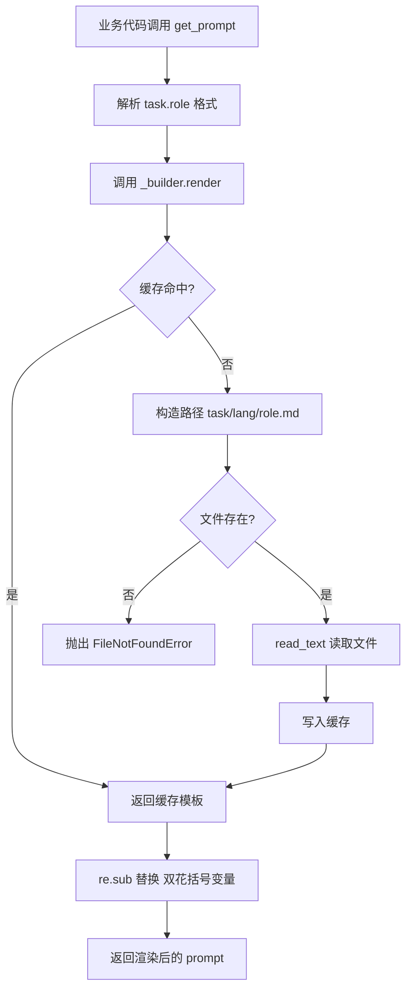
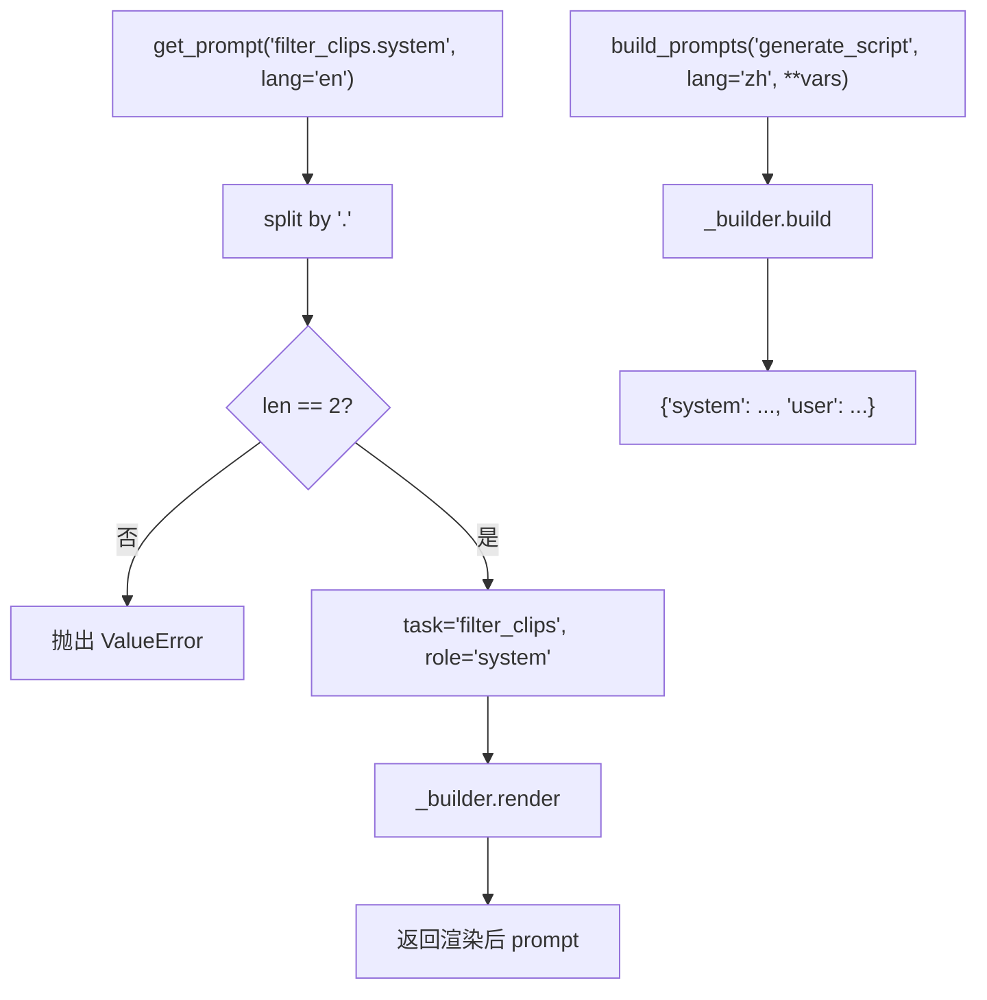

# PD-556.01 FireRed-OpenStoryline — PromptBuilder 文件模板引擎

> 文档编号：PD-556.01
> 来源：FireRed-OpenStoryline `src/open_storyline/utils/prompts.py`
> GitHub：https://github.com/FireRedTeam/FireRed-OpenStoryline.git
> 问题域：PD-556 Prompt模板系统 Prompt Template System
> 状态：可复用方案

---

## 第 1 章 问题与动机

### 1.1 核心问题

在 LLM 驱动的多任务 Agent 系统中，每个任务节点都需要构造 system prompt 和 user prompt。如果将 prompt 硬编码在业务代码中，会导致：

1. **prompt 与逻辑耦合** — 修改 prompt 措辞需要改动 Python 代码并重新部署
2. **多语言维护困难** — 中英双语 prompt 散落在各处，翻译同步成本高
3. **复用性差** — 不同任务的 prompt 结构相似但无法共享模板基础设施
4. **可读性低** — 长 prompt 嵌在 f-string 或三引号字符串中，非工程师难以审阅和迭代

OpenStoryline 是一个 AI 视频编辑 Agent 系统，包含 10+ 个任务节点（理解素材、筛选片段、分组、生成脚本、配音、选BGM、推荐特效等），每个节点都需要精心设计的 system/user prompt 对。这使得 prompt 管理成为核心工程问题。

### 1.2 FireRed-OpenStoryline 的解法概述

OpenStoryline 实现了一个轻量级的 **PromptBuilder 文件模板引擎**，核心设计：

1. **Markdown 文件即模板** — 每个 prompt 是独立的 `.md` 文件，存放在 `prompts/tasks/` 目录下（`src/open_storyline/utils/prompts.py:5`）
2. **task/lang/role 三级目录** — 按 `prompts/tasks/{task_name}/{lang}/{role}.md` 组织，如 `prompts/tasks/filter_clips/en/system.md`（`prompts.py:23`）
3. **`{{变量}}` 正则替换** — 用 `re.sub(r"{{(.*?)}}", ...)` 实现 Mustache 风格变量注入（`prompts.py:35`）
4. **Dict 缓存** — `task:role:lang` 三元组作为缓存键，避免重复文件 IO（`prompts.py:17-20`）
5. **全局单例 + 便捷函数** — `_builder` 单例 + `get_prompt()` / `build_prompts()` 两个顶层函数，业务代码一行调用（`prompts.py:63-100`）

### 1.3 设计思想

| 设计原则 | 具体实现 | 理由 | 替代方案 |
|----------|----------|------|----------|
| 模板与代码分离 | Markdown 文件存放 prompt，Python 只负责加载和渲染 | 非工程师可直接编辑 prompt，无需改代码 | Jinja2 模板引擎（更重） |
| 约定优于配置 | `task/lang/role` 三级目录约定，无需注册表 | 新增任务只需创建目录和文件，零配置 | YAML 注册表映射 |
| 最小化依赖 | 仅用 `re.sub` + `pathlib`，无第三方模板库 | 减少依赖，降低维护成本 | Jinja2 / Mako |
| 单例复用 | 全局 `_builder` 实例 + 进程内 Dict 缓存 | 多节点共享缓存，避免重复 IO | LRU cache 装饰器 |
| 双接口设计 | `get_prompt("task.role")` 获取单个 + `build_prompts("task")` 获取 system/user 对 | 灵活适配不同调用场景 | 只提供 build 接口 |

---

## 第 2 章 源码实现分析

### 2.1 架构概览

整体架构分为三层：模板文件层、引擎层、消费层。

```
┌─────────────────────────────────────────────────────────┐
│                    消费层 (Node 业务代码)                  │
│  filter_clips.py / generate_script.py / select_bgm.py  │
│         get_prompt("task.role", lang=..., **vars)       │
├─────────────────────────────────────────────────────────┤
│                    引擎层 (prompts.py)                    │
│  PromptBuilder: _load_template() → render() → build()  │
│  全局单例 _builder + get_prompt() / build_prompts()      │
│  Dict 缓存: {task:role:lang → content}                   │
├─────────────────────────────────────────────────────────┤
│                    模板文件层 (prompts/tasks/)             │
│  prompts/tasks/{task}/{lang}/{role}.md                   │
│  42 个 Markdown 模板文件，覆盖 10 个任务 × 中英双语        │
│  {{变量}} 占位符，纯 Markdown 格式                        │
└─────────────────────────────────────────────────────────┘
```

模板目录结构（实际扫描到 42 个文件）：

```
prompts/tasks/
├── filter_clips/          # 片段筛选
│   ├── en/
│   │   ├── system.md
│   │   └── user.md
│   └── zh/
│       ├── system.md
│       └── user.md
├── generate_script/       # 脚本生成
│   ├── en/ ...
│   └── zh/ ...
├── generate_voiceover/    # 配音生成
├── generate_title/        # 标题生成
├── group_clips/           # 片段分组
├── understand_clips/      # 素材理解（4 个 role：system_detail/user_detail/system_overall/user_overall）
├── select_bgm/            # 背景音乐选择
├── elementrec_text/       # 文字特效推荐
├── instruction/           # 系统指令（仅 system.md）
└── scripts/               # 辅助脚本模板（omni_bgm_label/script_template_label）
```

### 2.2 核心实现

#### PromptBuilder 类 — 模板加载与渲染



对应源码 `src/open_storyline/utils/prompts.py:8-59`：

```python
class PromptBuilder:
    """Builder for fixed templates with dynamic inputs"""
    
    def __init__(self, prompts_dir: Path = PROMPTS_DIR):
        self.prompts_dir = prompts_dir
        self._cache: Dict[str, str] = {}
    
    def _load_template(self, task: str, role: str, lang: str) -> str:
        """Load template file"""
        cache_key = f"{task}:{role}:{lang}"
        
        if cache_key in self._cache:
            return self._cache[cache_key]
        
        # prompts/tasks/filter_clips/zh/system.md
        template_path = self.prompts_dir / task / lang / f"{role}.md"
        
        if not template_path.exists():
            raise FileNotFoundError(f"Template not found: {template_path}")
        
        content = template_path.read_text(encoding='utf-8')
        self._cache[cache_key] = content
        return content
    
    def render(self, task: str, role: str, lang: str = "zh", **variables: Any) -> str:
        """Render single template"""
        template = self._load_template(task, role, lang)
        return re.sub(r"{{(.*?)}}", lambda m: str(variables[m.group(1)]), template)
    
    def build(self, task: str, lang: str = "zh", **user_vars: Any) -> Dict[str, str]:
        """Build a complete prompt pair"""
        return {
            "system": self.render(task, "system", lang),
            "user": self.render(task, "user", lang, **user_vars)
        }
```

#### 全局便捷接口 — 单例 + 点分格式解析



对应源码 `src/open_storyline/utils/prompts.py:62-100`：

```python
# Global singleton
_builder = PromptBuilder()

def get_prompt(name: str, lang: str = "zh", **kwargs: Any) -> str:
    parts = name.split(".")
    if len(parts) != 2:
        raise ValueError(f"Invalid format: '{name}', expected 'task/role'")
    task, role = parts
    return _builder.render(task, role, lang, **kwargs)

def build_prompts(task: str, lang: str = "zh", **user_vars: Any) -> Dict[str, str]:
    return _builder.build(task, lang, **user_vars)
```

### 2.3 实现细节

**模板变量替换机制**

模板文件中使用 `{{变量名}}` 占位符，如 `prompts/tasks/filter_clips/en/user.md:1-4`：

```markdown
user request: {{user_request}}

Based on user requirements, please determine whether to retain all of the following clips:
{{clip_captions}}
```

渲染时通过 `re.sub(r"{{(.*?)}}", lambda m: str(variables[m.group(1)]), template)` 进行替换。这里有一个重要的设计决策：**变量名直接从正则捕获组取出作为 dict key**，如果变量不存在会抛出 `KeyError`，这是一种 fail-fast 策略。

**多 role 扩展**

大多数任务只有 `system.md` 和 `user.md` 两个 role，但 `understand_clips` 任务扩展为 4 个 role：`system_detail`、`user_detail`、`system_overall`、`user_overall`（`prompts/tasks/understand_clips/en/`）。调用方式：

```python
# understand_clips.py:60-61
system_prompt = get_prompt("understand_clips.system_detail", lang=node_state.lang)
user_prompt = get_prompt("understand_clips.user_detail", lang=node_state.lang)
```

这说明 role 不限于 system/user，可以自由扩展子角色。

**语言切换**

`NodeState.lang` 字段（`node_state.py:14`）在运行时传入，决定加载 `en/` 还是 `zh/` 目录下的模板。每个任务的中英文模板内容完全独立编写（非机器翻译），如 `generate_script/zh/system.md` 开头是"你是一位资深的短视频及Vlog文案策划大师"，而 `en/system.md` 是"You are a seasoned short-form video and vlog copywriting strategist"。

**业务节点调用模式**

所有 7 个核心节点（filter_clips、generate_script、generate_voiceover、understand_clips、group_clips、select_bgm、recommend_effects）都遵循统一的调用模式：

```python
system_prompt = get_prompt("{task}.system", lang=node_state.lang)
user_prompt = get_prompt("{task}.user", lang=node_state.lang, **业务变量)
raw = await llm.complete(system_prompt=system_prompt, user_prompt=user_prompt, ...)
```


---

## 第 3 章 迁移指南

### 3.1 迁移清单

**阶段 1：基础设施（1 个文件）**

- [ ] 创建 `prompts/` 目录结构，按 `tasks/{task_name}/{lang}/{role}.md` 组织
- [ ] 复制 `PromptBuilder` 类到项目的 `utils/prompts.py`
- [ ] 配置 `PROMPTS_DIR` 指向正确的模板根目录

**阶段 2：模板迁移**

- [ ] 将现有硬编码的 prompt 提取为 `.md` 文件
- [ ] 为每个 prompt 确定变量占位符，用 `{{变量名}}` 标记
- [ ] 如需多语言，创建对应的 `en/` 和 `zh/` 子目录

**阶段 3：业务代码改造**

- [ ] 将 `f"..."` 或三引号 prompt 替换为 `get_prompt("task.role", lang=..., **vars)` 调用
- [ ] 确保所有变量名与模板中的 `{{}}` 占位符一致

### 3.2 适配代码模板

以下是可直接复用的 PromptBuilder 实现，增加了类型提示和错误信息优化：

```python
"""prompt_builder.py — 轻量级 Markdown 模板引擎"""
from pathlib import Path
from typing import Any, Dict
import re

class PromptBuilder:
    def __init__(self, prompts_dir: str | Path = "prompts/tasks"):
        self.prompts_dir = Path(prompts_dir)
        self._cache: Dict[str, str] = {}

    def _load_template(self, task: str, role: str, lang: str) -> str:
        cache_key = f"{task}:{role}:{lang}"
        if cache_key in self._cache:
            return self._cache[cache_key]

        template_path = self.prompts_dir / task / lang / f"{role}.md"
        if not template_path.exists():
            raise FileNotFoundError(
                f"Template not found: {template_path}\n"
                f"Expected: prompts/tasks/{task}/{lang}/{role}.md"
            )

        content = template_path.read_text(encoding="utf-8")
        self._cache[cache_key] = content
        return content

    def render(self, task: str, role: str, lang: str = "zh", **variables: Any) -> str:
        template = self._load_template(task, role, lang)

        def _replace(m: re.Match) -> str:
            key = m.group(1).strip()
            if key not in variables:
                raise KeyError(
                    f"Template variable '{{{{{key}}}}}' not provided. "
                    f"Task={task}, role={role}, lang={lang}"
                )
            return str(variables[key])

        return re.sub(r"\{\{(.*?)\}\}", _replace, template)

    def build(self, task: str, lang: str = "zh", **user_vars: Any) -> Dict[str, str]:
        return {
            "system": self.render(task, "system", lang),
            "user": self.render(task, "user", lang, **user_vars),
        }

# 全局单例
_builder = PromptBuilder()

def get_prompt(name: str, lang: str = "zh", **kwargs: Any) -> str:
    task, _, role = name.partition(".")
    if not role:
        raise ValueError(f"Invalid format: '{name}', expected 'task.role'")
    return _builder.render(task, role, lang, **kwargs)

def build_prompts(task: str, lang: str = "zh", **user_vars: Any) -> Dict[str, str]:
    return _builder.build(task, lang, **user_vars)
```

### 3.3 适用场景

| 场景 | 适用度 | 说明 |
|------|--------|------|
| 多任务 LLM Agent 系统 | ⭐⭐⭐ | 每个任务节点独立 prompt，天然适配三级目录 |
| 中英双语产品 | ⭐⭐⭐ | lang 维度直接映射目录，新增语言只需加目录 |
| prompt 快速迭代 | ⭐⭐⭐ | 修改 .md 文件即可，无需改代码重新部署 |
| 单一任务简单 Agent | ⭐⭐ | 杀鸡用牛刀，直接硬编码更简单 |
| 需要条件分支的复杂模板 | ⭐ | 仅支持变量替换，不支持 if/for 等控制流 |
| 模板需要继承/组合 | ⭐ | 无 include/extends 机制，需自行拼接 |

---

## 第 4 章 测试用例

```python
"""test_prompt_builder.py"""
import pytest
from pathlib import Path
from unittest.mock import patch
from prompt_builder import PromptBuilder, get_prompt, build_prompts


@pytest.fixture
def tmp_prompts(tmp_path):
    """创建临时模板目录结构"""
    # filter_clips/en/system.md
    task_dir = tmp_path / "filter_clips" / "en"
    task_dir.mkdir(parents=True)
    (task_dir / "system.md").write_text("You are a clip filter.")
    (task_dir / "user.md").write_text(
        "Filter these clips: {{clip_data}}\nRequirement: {{requirement}}"
    )
    # filter_clips/zh/system.md
    zh_dir = tmp_path / "filter_clips" / "zh"
    zh_dir.mkdir(parents=True)
    (zh_dir / "system.md").write_text("你是一个片段筛选助手。")
    (zh_dir / "user.md").write_text("筛选片段: {{clip_data}}")
    return tmp_path


class TestPromptBuilder:
    def test_load_and_render_system(self, tmp_prompts):
        builder = PromptBuilder(tmp_prompts)
        result = builder.render("filter_clips", "system", "en")
        assert result == "You are a clip filter."

    def test_render_with_variables(self, tmp_prompts):
        builder = PromptBuilder(tmp_prompts)
        result = builder.render(
            "filter_clips", "user", "en",
            clip_data="clip_001, clip_002",
            requirement="keep exciting ones"
        )
        assert "clip_001, clip_002" in result
        assert "keep exciting ones" in result

    def test_cache_hit(self, tmp_prompts):
        builder = PromptBuilder(tmp_prompts)
        builder.render("filter_clips", "system", "en")
        assert "filter_clips:system:en" in builder._cache
        # 第二次调用应命中缓存
        result = builder.render("filter_clips", "system", "en")
        assert result == "You are a clip filter."

    def test_missing_template_raises(self, tmp_prompts):
        builder = PromptBuilder(tmp_prompts)
        with pytest.raises(FileNotFoundError, match="Template not found"):
            builder.render("nonexistent_task", "system", "en")

    def test_missing_variable_raises(self, tmp_prompts):
        builder = PromptBuilder(tmp_prompts)
        with pytest.raises(KeyError, match="clip_data"):
            builder.render("filter_clips", "user", "en", requirement="test")

    def test_build_returns_system_user_pair(self, tmp_prompts):
        builder = PromptBuilder(tmp_prompts)
        result = builder.build("filter_clips", "en",
                               clip_data="data", requirement="req")
        assert "system" in result
        assert "user" in result
        assert result["system"] == "You are a clip filter."

    def test_language_switching(self, tmp_prompts):
        builder = PromptBuilder(tmp_prompts)
        en = builder.render("filter_clips", "system", "en")
        zh = builder.render("filter_clips", "system", "zh")
        assert en == "You are a clip filter."
        assert zh == "你是一个片段筛选助手。"

    def test_build_prompts_convenience(self, tmp_prompts):
        """测试 build_prompts 便捷函数（需 mock 全局单例）"""
        builder = PromptBuilder(tmp_prompts)
        result = builder.build("filter_clips", "zh", clip_data="测试数据")
        assert "筛选片段: 测试数据" in result["user"]
```


---

## 第 5 章 跨域关联

| 关联域 | 关系类型 | 说明 |
|--------|----------|------|
| PD-04 工具系统 | 协同 | 每个工具节点（BaseNode 子类）通过 `get_prompt()` 获取 prompt，模板系统是工具系统的基础设施 |
| PD-01 上下文管理 | 协同 | 模板中的变量注入量直接影响 prompt 长度，需配合上下文窗口管理（如 `script_chars_budget` 控制生成长度） |
| PD-06 记忆持久化 | 互补 | 模板系统管理静态 prompt 结构，记忆系统管理动态上下文；两者共同构成完整的 prompt 组装 |
| PD-10 中间件管道 | 协同 | 节点管道中每个节点的 `process()` 方法都依赖模板系统获取 prompt，模板系统是管道的横切关注点 |
| PD-07 质量检查 | 依赖 | prompt 模板的质量直接决定 LLM 输出质量；模板中内嵌了输出格式约束（JSON schema）和评分标准 |

---

## 第 6 章 来源文件索引

| 文件 | 行范围 | 关键实现 |
|------|--------|----------|
| `src/open_storyline/utils/prompts.py` | L1-L100 | PromptBuilder 类、全局单例、get_prompt/build_prompts 便捷函数 |
| `src/open_storyline/nodes/node_state.py` | L10-L17 | NodeState dataclass，包含 `lang` 字段驱动语言切换 |
| `src/open_storyline/nodes/core_nodes/filter_clips.py` | L69-L70 | 典型调用模式：get_prompt 获取 system/user prompt |
| `src/open_storyline/nodes/core_nodes/generate_script.py` | L84-L87 | 脚本生成节点的 prompt 调用，含多变量注入 |
| `src/open_storyline/nodes/core_nodes/understand_clips.py` | L60-L61, L174-L175 | 多 role 扩展：system_detail/user_detail/system_overall/user_overall |
| `src/open_storyline/nodes/core_nodes/generate_voiceover.py` | L250-L254 | 配音节点的 prompt 调用，含 schema_text 变量注入 |
| `src/open_storyline/nodes/core_nodes/select_bgm.py` | L87-L88 | BGM 选择节点的 prompt 调用 |
| `src/open_storyline/nodes/core_nodes/recommend_effects.py` | L98-L99 | 文字特效推荐节点的 prompt 调用 |
| `src/open_storyline/nodes/core_nodes/group_clips.py` | L49-L56 | 分组节点的 prompt 调用，含多变量注入 |
| `prompts/tasks/filter_clips/en/system.md` | 全文 | 片段筛选 system prompt 模板（含评分规则和数量约束） |
| `prompts/tasks/filter_clips/en/user.md` | 全文 | 片段筛选 user prompt 模板（`{{user_request}}` + `{{clip_captions}}`） |
| `prompts/tasks/generate_script/en/system.md` | 全文 | 脚本生成 system prompt（117 行，含角色设定、风格配置、创作原则、输出格式） |
| `prompts/tasks/generate_voiceover/en/user.md` | 全文 | 配音参数提取 user prompt（`{{provider_name}}` + `{{user_request}}` + `{{schema_text}}`） |
| `prompts/tasks/instruction/en/system.md` | 全文 | 系统级指令模板（188 行，定义完整编辑工作流） |
| `prompts/tasks/understand_clips/en/system_detail.md` | 全文 | 素材理解 system prompt（含美学评分标准 0.0-1.0） |

---

## 第 7 章 横向对比维度

```json comparison_data
{
  "project": "FireRed-OpenStoryline",
  "dimensions": {
    "模板格式": "纯 Markdown 文件，{{变量}} 占位符",
    "目录组织": "task/lang/role 三级约定式目录",
    "渲染引擎": "re.sub 正则替换，无第三方依赖",
    "缓存策略": "进程内 Dict 缓存，task:role:lang 三元组键",
    "多语言支持": "目录级隔离，中英独立编写",
    "接口设计": "全局单例 + get_prompt 点分格式 + build_prompts 对构建"
  }
}
```

### 域元数据补充

```json domain_metadata
{
  "solution_summary": "OpenStoryline 用 PromptBuilder 实现 task/lang/role 三级目录 Markdown 模板引擎，re.sub 正则替换 + Dict 缓存，覆盖 10+ 视频编辑任务的 42 个模板文件",
  "description": "Prompt 模板系统需要平衡灵活性与简洁性，避免过度工程化",
  "sub_problems": [
    "system/user prompt 对的统一构建接口",
    "多 role 扩展（超出 system/user 的子角色）",
    "模板变量缺失时的 fail-fast 错误处理"
  ],
  "best_practices": [
    "全局单例 + 点分格式便捷函数降低调用复杂度",
    "模板中内嵌 JSON 输出格式约束确保 LLM 结构化输出",
    "中英文模板独立编写而非机器翻译保证质量"
  ]
}
```

