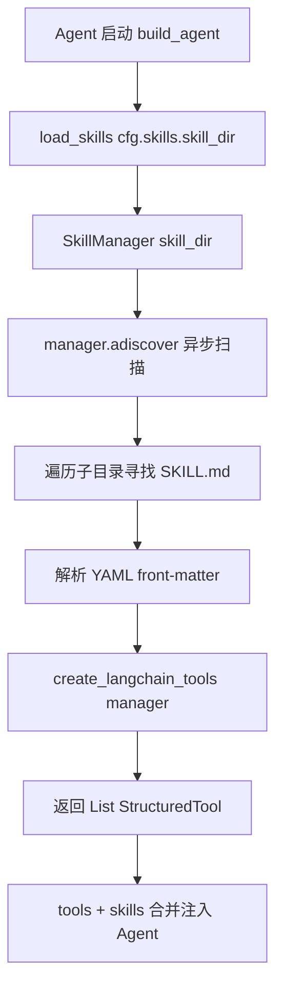
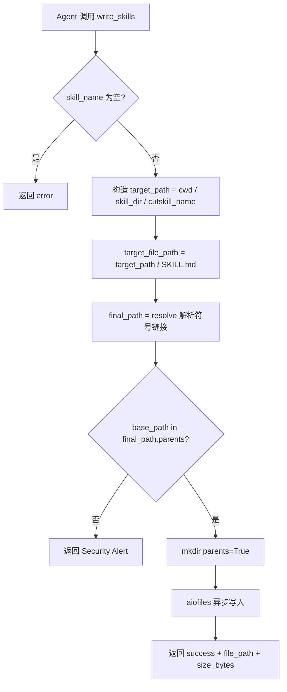

# PD-557.01 FireRed-OpenStoryline — SkillKit Markdown 技能归档与 LangChain 工具转换

> 文档编号：PD-557.01
> 来源：FireRed-OpenStoryline `src/open_storyline/skills/skills_io.py`, `src/open_storyline/mcp/register_tools.py`, `src/open_storyline/agent.py`
> GitHub：https://github.com/FireRedTeam/FireRed-OpenStoryline.git
> 问题域：PD-557 技能归档系统 Skill Archiving System
> 状态：可复用方案

---

## 第 1 章 问题与动机

### 1.1 核心问题

Agent 系统在执行创作类任务（如视频剪辑、文案生成）时，用户会逐步积累出一套个人化的工作流偏好——特定的剪辑节奏、文风模板、工具调用顺序等。这些"经验"如果不能被持久化和复用，每次新会话都要从零开始描述需求，效率极低。

核心挑战在于：
1. **经验格式化**：如何将非结构化的工作流偏好转化为 Agent 可消费的结构化技能？
2. **技能即工具**：如何让保存的技能自动成为 Agent 的可调用工具，而非仅仅是参考文档？
3. **安全写入**：Agent 生成的技能文件需要写入文件系统，如何防止路径遍历攻击？
4. **零代码扩展**：非开发者用户如何在不修改代码的情况下扩展 Agent 能力？

### 1.2 OpenStoryline 的解法概述

OpenStoryline 采用 **Markdown-as-Skill + SkillKit + MCP 工具注册** 三层架构：

1. **Markdown 格式定义技能**：每个技能是一个目录，内含 `SKILL.md` 文件，用 YAML front-matter 定义元数据（name/description/version/tags），正文是自然语言 prompt（`skills/create_profile_style_skill/SKILL.md:1-7`）
2. **SkillKit 库自动发现**：通过 `skillkit==0.4.0` 的 `SkillManager` 扫描技能目录，`adiscover()` 异步发现所有合法技能（`skills_io.py:14-16`）
3. **LangChain 工具转换**：`create_langchain_tools(manager)` 将发现的技能转换为 LangChain `StructuredTool`，直接注入 Agent 工具列表（`skills_io.py:19`）
4. **MCP 工具写入**：`write_skills` 注册为 MCP 工具，Agent 可在对话中生成技能并安全写入文件系统（`register_tools.py:155-191`）
5. **路径遍历防护**：写入前用 `Path.resolve()` + 父目录校验阻止越界写入（`skills_io.py:44-56`）

### 1.3 设计思想

| 设计原则 | 具体实现 | 理由 | 替代方案 |
|----------|----------|------|----------|
| Markdown-as-Code | 技能用 YAML front-matter + Markdown 正文定义 | 人类可读可编辑，Git 友好，LLM 原生理解 | JSON Schema 定义（机器友好但人类难编辑） |
| 约定优于配置 | 目录名 = 技能名，固定文件名 `SKILL.md` | 零配置发现，降低用户门槛 | 注册表文件集中管理（需维护额外索引） |
| Agent 自举 | Agent 自身可调用 `write_skills` 生成新技能 | 实现"元技能"——用技能创建技能 | 仅人工手动创建（无法闭环） |
| 防御性写入 | `Path.resolve()` + `base_path in final_path.parents` | 防止 LLM 生成恶意路径 | 白名单目录（过于死板） |
| 前缀隔离 | 自动添加 `cutskill_` 前缀 | 区分 Agent 生成 vs 人工创建的技能 | 无前缀（混淆来源） |

---

## 第 2 章 源码实现分析

### 2.1 架构概览

OpenStoryline 的技能系统由三个层次组成：存储层（文件系统）、发现层（SkillKit）、集成层（LangChain Agent）。

```
┌─────────────────────────────────────────────────────────┐
│                    LangChain Agent                       │
│  agent = create_agent(model=llm, tools=tools+skills)    │
│                                                         │
│  ┌──────────────┐  ┌──────────────────────────────────┐ │
│  │  MCP Tools   │  │  Skill Tools (from SkillKit)     │ │
│  │  (Node→Tool) │  │  create_langchain_tools(manager) │ │
│  └──────┬───────┘  └──────────────┬───────────────────┘ │
└─────────┼──────────────────────────┼────────────────────┘
          │                          │
          │                          ▼
          │              ┌───────────────────────┐
          │              │  SkillManager          │
          │              │  .adiscover()          │
          │              │  skill_dir scanning    │
          │              └───────────┬───────────┘
          │                          │
          ▼                          ▼
┌──────────────────┐    ┌──────────────────────────┐
│  write_skills    │───→│  .storyline/skills/       │
│  (MCP Tool)      │    │  ├── create_profile_.../  │
│  dump_skills()   │    │  │   └── SKILL.md         │
│  路径遍历防护     │    │  ├── subtitle_imita.../   │
└──────────────────┘    │  │   └── SKILL.md         │
                        │  └── cutskill_{name}/     │
                        │      └── SKILL.md         │
                        └──────────────────────────┘
```

### 2.2 核心实现

#### 2.2.1 技能发现与 LangChain 工具转换



对应源码 `src/open_storyline/skills/skills_io.py:11-20`：

```python
async def load_skills(
    skill_dir: str=".storyline/skills"
):
    # Discover skills
    manager = SkillManager(skill_dir=skill_dir)
    await manager.adiscover()

    # Convert to LangChain tools
    tools = create_langchain_tools(manager)
    return tools
```

Agent 构建时的集成点 `src/open_storyline/agent.py:114-121`：

```python
    tools = await client.get_tools()
    skills = await load_skills(cfg.skills.skill_dir)  # Load skills
    node_manager = NodeManager(tools)

    # Use LangChain's agent runtime to handle the multi-turn tool calling loop
    agent = create_agent(
        model=llm,
        tools=tools+skills,  # MCP 工具 + Skill 工具合并
        middleware=[log_tool_request, handle_tool_errors],
        store=store,
        context_schema=ClientContext,
    )
```

关键设计：`tools+skills` 的简单列表拼接意味着 Skill 工具和 MCP Node 工具在 Agent 视角完全平等，LLM 通过 tool description 自主选择调用哪个。

#### 2.2.2 安全写入与路径遍历防护



对应源码 `src/open_storyline/skills/skills_io.py:22-83`：

```python
async def dump_skills(
    skill_name: str = '',
    skill_dir: str = '',
    skill_content: str = '',
    **kwargs,
):
    clean_name = skill_name.strip()
    if not clean_name:
        return {"status": "error", "message": "skill_name cannot be empty"}

    base_path = Path.cwd()
    # Project_Root + skill_dir + skill_name/
    target_path = base_path / skill_dir / f"cutskill_{clean_name}"
    # Fix name: SKILL.md
    target_file_path = target_path / "SKILL.md"

    # Path Traversal Protection
    try:
        final_path = target_file_path.resolve()
        if base_path not in final_path.parents:
            return {
                "status": "error",
                "message": f"Security Alert: Writing to paths outside "
                           f"the project directory is forbidden: {final_path}"
            }
    except Exception as e:
        return {"status": "error", "message": f"Path resolution error: {str(e)}"}

    # Start write
    try:
        if not target_path.exists():
            target_path.mkdir(parents=True, exist_ok=True)
        async with aiofiles.open(final_path, mode='w', encoding='utf-8') as f:
            await f.write(skill_content)
        return {
            "status": "success",
            "message": f"Skill '{clean_name}' successfully created.",
            "dir_path": str(target_path),
            "file_path": str(final_path),
            "size_bytes": len(skill_content.encode('utf-8'))
        }
    except PermissionError:
        return {"status": "error",
                "message": f"Permission denied: Cannot write to directory {target_path}"}
    except Exception as e:
        return {"status": "error", "message": f"Write operation failed: {str(e)}"}
```

#### 2.2.3 MCP 工具注册：write_skills

`write_skills` 作为 MCP 工具注册在 `register_tools.py:155-191`，使 Agent 在对话中可直接调用：

```python
@server.tool(
    name="write_skills",
    description="Save the generated Agent Skill (Markdown format) to the "
                "file system and return the absolute file path on success."
)
async def mcp_write_skills(
    mcp_ctx: Context[ServerSession, object],
    skill_name: Annotated[str, Field(description="Skill file name, e.g., "
                "'fast_paced_vlog', without extension")],
    skill_dir: Annotated[str, Field(description="Skill storage directory, "
                "defaults to '.storyline/skills/'")] = '.storyline/skills/',
    skill_content: Annotated[str, Field(description="Skill content in "
                   "Markdown format")] = '',
) -> dict:
    res = await dump_skills(
        skill_name=skill_name,
        skill_dir=skill_dir,
        skill_content=skill_content,
    )
    ...
```

### 2.3 实现细节

**技能 Markdown 格式规范**（`SKILL.md` 示例 `.storyline/skills/create_profile_style_skill/SKILL.md:1-7`）：

```yaml
---
name: create_profile_style_skill
description: 【SKILL】分析当前剪辑逻辑与风格，总结并生成一个新的可复用 Skill 文件
version: 1.0.0
author: User_Agent_Architect
tags: [meta-skill, workflow, writing, file-system]
---
```

正文部分是完整的 prompt 指令，包含角色定义、任务目标、执行流程、约束条件四大板块。这种格式让技能同时是：
- **人类文档**：开发者可直接阅读理解
- **LLM 指令**：SkillKit 转换后成为 tool description
- **版本化资产**：可 Git 管理，支持 version 字段

**`cutskill_` 前缀隔离**（`skills_io.py:39`）：Agent 生成的技能自动加 `cutskill_` 前缀，与人工创建的技能（如 `create_profile_style_skill`、`subtitle_imitation_skill`）在目录层面区分来源。

**配置驱动**（`config.py:133-134` + `config.toml:69-70`）：

```toml
[skills]
skill_dir = "./.storyline/skills"
```

技能目录通过 Pydantic `SkillsConfig` 模型验证，支持相对路径自动解析为绝对路径。


---

## 第 3 章 迁移指南

### 3.1 迁移清单

**阶段一：技能格式定义**
- [ ] 确定技能目录结构：`{skill_dir}/{skill_name}/SKILL.md`
- [ ] 定义 YAML front-matter schema（至少 name + description）
- [ ] 编写 2-3 个示例技能作为模板

**阶段二：技能发现与加载**
- [ ] 安装 `skillkit>=0.4.0`（或自行实现目录扫描 + front-matter 解析）
- [ ] 实现 `load_skills()` 函数，返回 LangChain 工具列表
- [ ] 在 Agent 构建时合并 skill tools 到工具列表

**阶段三：技能写入工具**
- [ ] 实现 `dump_skills()` 函数，含路径遍历防护
- [ ] 注册为 MCP/LangChain 工具，使 Agent 可在对话中调用
- [ ] 添加 `cutskill_` 或类似前缀区分 Agent 生成 vs 人工创建

**阶段四：元技能（可选）**
- [ ] 创建"技能生成技能"——一个 SKILL.md 指导 Agent 分析当前工作流并生成新技能
- [ ] 实现技能版本管理（覆盖写入时更新 version 字段）

### 3.2 适配代码模板

#### 最小可用的技能加载器（不依赖 skillkit）

```python
"""minimal_skill_loader.py — 可独立运行的技能发现与加载器"""
import yaml
from pathlib import Path
from typing import List, Optional
from dataclasses import dataclass
from langchain_core.tools import StructuredTool


@dataclass
class SkillMeta:
    name: str
    description: str
    version: str = "1.0.0"
    tags: List[str] = None
    content: str = ""


def discover_skills(skill_dir: str) -> List[SkillMeta]:
    """扫描技能目录，解析所有 SKILL.md"""
    skills = []
    base = Path(skill_dir)
    if not base.exists():
        return skills

    for skill_path in base.iterdir():
        if not skill_path.is_dir():
            continue
        md_file = skill_path / "SKILL.md"
        if not md_file.exists():
            continue

        text = md_file.read_text(encoding="utf-8")
        # 解析 YAML front-matter
        if text.startswith("---"):
            parts = text.split("---", 2)
            if len(parts) >= 3:
                meta = yaml.safe_load(parts[1])
                content = parts[2].strip()
                skills.append(SkillMeta(
                    name=meta.get("name", skill_path.name),
                    description=meta.get("description", ""),
                    version=meta.get("version", "1.0.0"),
                    tags=meta.get("tags", []),
                    content=content,
                ))
    return skills


def skills_to_langchain_tools(skills: List[SkillMeta]) -> List[StructuredTool]:
    """将技能转换为 LangChain StructuredTool"""
    tools = []
    for skill in skills:
        # 技能作为"指令型工具"：调用时返回 prompt 指令
        def make_fn(s=skill):
            def fn(**kwargs) -> str:
                return f"[Skill: {s.name}]\n{s.content}"
            return fn

        tool = StructuredTool.from_function(
            func=make_fn(),
            name=skill.name,
            description=skill.description,
        )
        tools.append(tool)
    return tools
```

#### 安全写入模板

```python
"""safe_skill_writer.py — 含路径遍历防护的技能写入"""
import aiofiles
from pathlib import Path


async def safe_write_skill(
    skill_name: str,
    skill_content: str,
    skill_dir: str = ".skills",
    prefix: str = "cutskill_",
) -> dict:
    clean_name = skill_name.strip()
    if not clean_name:
        return {"status": "error", "message": "skill_name cannot be empty"}

    base_path = Path.cwd()
    target_path = base_path / skill_dir / f"{prefix}{clean_name}"
    target_file = target_path / "SKILL.md"

    # 路径遍历防护
    try:
        resolved = target_file.resolve()
        if base_path not in resolved.parents:
            return {"status": "error",
                    "message": f"Path traversal blocked: {resolved}"}
    except Exception as e:
        return {"status": "error", "message": str(e)}

    target_path.mkdir(parents=True, exist_ok=True)
    async with aiofiles.open(resolved, mode="w", encoding="utf-8") as f:
        await f.write(skill_content)

    return {
        "status": "success",
        "file_path": str(resolved),
        "size_bytes": len(skill_content.encode("utf-8")),
    }
```

### 3.3 适用场景

| 场景 | 适用度 | 说明 |
|------|--------|------|
| 创作类 Agent（文案/剪辑/设计） | ⭐⭐⭐ | 最佳场景：用户风格偏好天然适合 Markdown 描述 |
| 工作流自动化 Agent | ⭐⭐⭐ | SOP 流程可直接写成技能，Agent 按步骤执行 |
| 多租户 Agent 平台 | ⭐⭐ | 每个用户独立技能目录，需额外隔离机制 |
| 高频实时调用场景 | ⭐ | 文件系统扫描有 IO 开销，适合启动时加载而非每次调用 |
| 需要参数化输入的工具 | ⭐ | Markdown 技能本质是 prompt 注入，不适合复杂参数校验 |

---

## 第 4 章 测试用例

```python
"""test_skill_archiving.py — 基于 OpenStoryline 真实函数签名的测试"""
import pytest
import asyncio
from pathlib import Path
from unittest.mock import patch, AsyncMock


# ---- dump_skills 测试 ----

class TestDumpSkills:
    """测试 skills_io.dump_skills 的核心行为"""

    @pytest.fixture
    def tmp_skill_dir(self, tmp_path):
        skill_dir = tmp_path / ".storyline" / "skills"
        skill_dir.mkdir(parents=True)
        return tmp_path, str(skill_dir.relative_to(tmp_path))

    @pytest.mark.asyncio
    async def test_normal_write(self, tmp_skill_dir):
        """正常写入：生成 cutskill_ 前缀目录 + SKILL.md"""
        base, rel_dir = tmp_skill_dir
        with patch("open_storyline.skills.skills_io.Path.cwd", return_value=base):
            from open_storyline.skills.skills_io import dump_skills
            result = await dump_skills(
                skill_name="fast_vlog",
                skill_dir=rel_dir,
                skill_content="---\nname: fast_vlog\n---\n# Test",
            )
        assert result["status"] == "success"
        assert "cutskill_fast_vlog" in result["dir_path"]
        written = Path(result["file_path"]).read_text()
        assert "name: fast_vlog" in written

    @pytest.mark.asyncio
    async def test_empty_name_rejected(self):
        """空名称应返回 error"""
        from open_storyline.skills.skills_io import dump_skills
        result = await dump_skills(skill_name="", skill_dir=".", skill_content="x")
        assert result["status"] == "error"
        assert "empty" in result["message"]

    @pytest.mark.asyncio
    async def test_path_traversal_blocked(self, tmp_skill_dir):
        """路径遍历攻击应被拦截"""
        base, rel_dir = tmp_skill_dir
        with patch("open_storyline.skills.skills_io.Path.cwd", return_value=base):
            from open_storyline.skills.skills_io import dump_skills
            result = await dump_skills(
                skill_name="../../etc/passwd",
                skill_dir=rel_dir,
                skill_content="malicious",
            )
        assert result["status"] == "error"
        assert "Security Alert" in result["message"] or "forbidden" in result["message"].lower()

    @pytest.mark.asyncio
    async def test_whitespace_name_stripped(self, tmp_skill_dir):
        """名称前后空格应被清理"""
        base, rel_dir = tmp_skill_dir
        with patch("open_storyline.skills.skills_io.Path.cwd", return_value=base):
            from open_storyline.skills.skills_io import dump_skills
            result = await dump_skills(
                skill_name="  my_skill  ",
                skill_dir=rel_dir,
                skill_content="test",
            )
        assert result["status"] == "success"
        assert "cutskill_my_skill" in result["dir_path"]


# ---- load_skills 测试 ----

class TestLoadSkills:
    """测试 skills_io.load_skills 的发现逻辑"""

    @pytest.fixture
    def skill_fixtures(self, tmp_path):
        """创建测试用技能目录"""
        skill_dir = tmp_path / "skills"
        # 合法技能
        valid = skill_dir / "my_skill"
        valid.mkdir(parents=True)
        (valid / "SKILL.md").write_text(
            "---\nname: my_skill\ndescription: test skill\n---\n# Hello"
        )
        # 无 SKILL.md 的目录（应被忽略）
        empty = skill_dir / "empty_dir"
        empty.mkdir()
        return str(skill_dir)

    @pytest.mark.asyncio
    async def test_discovers_valid_skills(self, skill_fixtures):
        """应发现含 SKILL.md 的目录"""
        from open_storyline.skills.skills_io import load_skills
        tools = await load_skills(skill_fixtures)
        assert len(tools) >= 1
        tool_names = [t.name for t in tools]
        assert "my_skill" in tool_names

    @pytest.mark.asyncio
    async def test_ignores_invalid_dirs(self, skill_fixtures):
        """无 SKILL.md 的目录应被忽略"""
        from open_storyline.skills.skills_io import load_skills
        tools = await load_skills(skill_fixtures)
        tool_names = [t.name for t in tools]
        assert "empty_dir" not in tool_names
```


---

## 第 5 章 跨域关联

| 关联域 | 关系类型 | 说明 |
|--------|----------|------|
| PD-04 工具系统 | 强依赖 | 技能最终转换为 LangChain StructuredTool，依赖工具注册机制；`register_tools.py` 中 `write_skills` 本身就是 MCP 工具 |
| PD-10 中间件管道 | 协同 | Agent 构建时 `middleware=[log_tool_request, handle_tool_errors]` 对技能工具同样生效，技能调用也经过中间件链 |
| PD-06 记忆持久化 | 协同 | 技能是一种"长期记忆"的具象化——将用户偏好从会话记忆提升为持久化文件；`ArtifactStore` 管理工具执行结果，技能可引用历史 artifact |
| PD-09 Human-in-the-Loop | 协同 | `create_profile_style_skill` 的工作流包含多步用户确认（风格确认→命名→预览→写入），是 HITL 模式的典型应用 |
| PD-05 沙箱隔离 | 互补 | 路径遍历防护是轻量级安全措施；如果技能内容包含可执行代码（非本项目场景），需要沙箱隔离配合 |

---

## 第 6 章 来源文件索引

| 文件 | 行范围 | 关键实现 |
|------|--------|----------|
| `src/open_storyline/skills/skills_io.py` | L1-L83 | 技能发现 `load_skills` + 安全写入 `dump_skills` 完整实现 |
| `src/open_storyline/mcp/register_tools.py` | L155-L191 | `write_skills` MCP 工具注册，Agent 可调用写入技能 |
| `src/open_storyline/mcp/register_tools.py` | L21-L89 | `create_tool_wrapper` 工厂函数，Node→MCP Tool 转换 |
| `src/open_storyline/agent.py` | L114-L121 | `build_agent` 中 `tools+skills` 合并注入 Agent |
| `src/open_storyline/config.py` | L133-L134 | `SkillsConfig` Pydantic 模型，`skill_dir` 配置 |
| `config.toml` | L68-L70 | `[skills]` 配置段，`skill_dir` 默认值 |
| `.storyline/skills/create_profile_style_skill/SKILL.md` | L1-L64 | 元技能示例：分析剪辑风格并生成新技能 |
| `.storyline/skills/subtitle_imitation_skill/SKILL.md` | L1-L55 | 文风仿写技能示例 |
| `src/open_storyline/utils/register.py` | L1-L73 | `Registry` 类 + `NODE_REGISTRY` 全局实例，Node 包扫描注册 |
| `docs/source/en/guide.md` | L203-L220 | 用户文档：自定义技能库创建指南 |

---

## 第 7 章 横向对比维度

```json comparison_data
{
  "project": "FireRed-OpenStoryline",
  "dimensions": {
    "技能格式": "YAML front-matter + Markdown 正文，目录名即技能名",
    "发现机制": "SkillKit SkillManager 异步目录扫描 adiscover()",
    "工具集成": "create_langchain_tools 转 StructuredTool，与 MCP 工具列表拼接",
    "写入安全": "Path.resolve() + 父目录校验 + cutskill_ 前缀隔离",
    "元技能能力": "Agent 可调用 write_skills 自主生成新技能，实现自举闭环",
    "配置管理": "Pydantic SkillsConfig + TOML 配置，支持路径自动解析"
  }
}
```

### 域元数据补充

```json domain_metadata
{
  "solution_summary": "OpenStoryline 用 SkillKit 异步扫描 Markdown 技能目录，通过 create_langchain_tools 转为 Agent 工具，并注册 write_skills MCP 工具实现 Agent 自主生成技能的自举闭环",
  "description": "技能归档不仅是存储，更是 Agent 能力的动态扩展机制",
  "sub_problems": [
    "元技能设计(用技能生成技能的自举模式)",
    "Agent生成技能与人工技能的来源区分"
  ],
  "best_practices": [
    "cutskill_前缀隔离Agent生成与人工创建的技能",
    "技能与MCP工具列表平等拼接让LLM自主选择"
  ]
}
```

