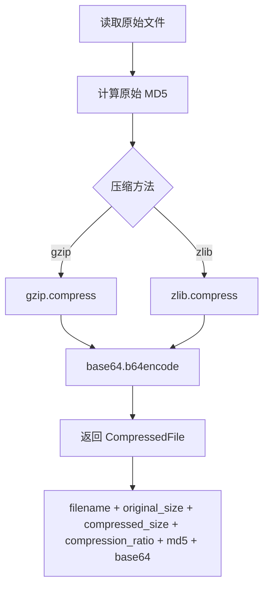
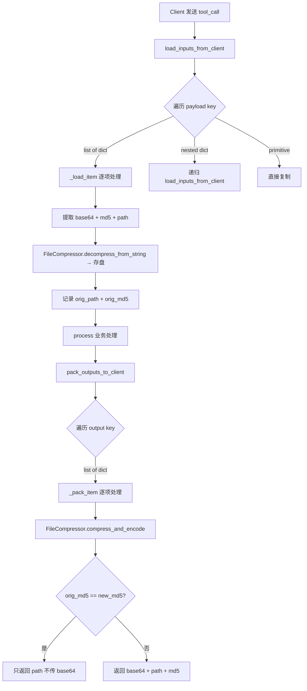
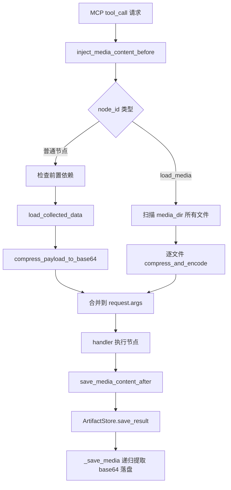

# PD-558.01 FireRed-OpenStoryline — MCP Client-Server 媒体传输协议

> 文档编号：PD-558.01
> 来源：FireRed-OpenStoryline `src/open_storyline/storage/file.py`, `src/open_storyline/nodes/core_nodes/base_node.py`, `src/open_storyline/mcp/hooks/node_interceptors.py`
> GitHub：https://github.com/FireRedTeam/FireRed-OpenStoryline.git
> 问题域：PD-558 媒体数据传输协议 Media Data Transfer Protocol
> 状态：可复用方案

---

## 第 1 章 问题与动机

### 1.1 核心问题

MCP（Model Context Protocol）架构中，Client 与 Server 通过 JSON-RPC 通信。当工作流涉及图片、音频、视频等二进制媒体文件时，面临三个核心挑战：

1. **二进制数据无法直接嵌入 JSON** — MCP 的 tool_call 参数和返回值都是 JSON 格式，二进制文件必须编码为文本
2. **大文件传输效率低** — 未压缩的 base64 编码会使数据膨胀约 33%，对于视频渲染等场景，单次传输可达数十 MB
3. **重复传输浪费带宽** — 多节点工作流中，同一媒体文件可能在多个节点间反复传递，如果文件未被修改则完全是浪费

OpenStoryline 是一个视频故事线生成系统，其工作流包含 `load_media → generate_storyline → generate_voiceover → render_video` 等多个节点，每个节点都可能接收和产出媒体文件。这使得高效的媒体传输协议成为刚需。

### 1.2 OpenStoryline 的解法概述

OpenStoryline 设计了一套完整的三层媒体传输协议：

1. **FileCompressor 压缩编码层** — `storage/file.py:23-76`：gzip/zlib 压缩 + base64 编码 + MD5 校验的 `CompressedFile` 数据类，提供 `compress_and_encode` / `decode_and_decompress` 对称 API
2. **BaseNode 双向序列化层** — `base_node.py:73-103`：`_load_item` 从 client 接收 base64 并解压存盘，`_pack_item` 将 server 文件压缩回传，通过 MD5 比对实现增量传输
3. **ToolInterceptor 拦截器层** — `node_interceptors.py:22-38`：在 MCP tool_call 前后自动注入/提取媒体数据，节点实现者无需关心传输细节
4. **ArtifactStore 持久化层** — `agent_memory.py:53-75`：接收 tool 执行结果中的 base64 数据并落盘，维护 artifact 元数据索引
5. **递归处理** — 所有层都支持嵌套 dict/list 结构的递归遍历，适应复杂的多媒体 payload

### 1.3 设计思想

| 设计原则 | 具体实现 | 理由 | 替代方案 |
|----------|----------|------|----------|
| 传输层透明 | ToolInterceptor 在 tool_call 前后自动处理 | 节点开发者只需关注业务逻辑，不需要手动编解码 | 每个节点自行处理（侵入性强） |
| 增量传输 | MD5 比对，未修改文件只传 path 不传 base64 | 多节点流水线中大量文件不变，避免重复传输 | 全量传输（简单但浪费） |
| 双压缩策略 | 支持 gzip 和 zlib 两种压缩方法 | gzip 适合文件级压缩，zlib 适合流式数据 | 仅 gzip（覆盖场景少） |
| 完整性校验 | 原始数据 MD5 贯穿压缩-传输-解压全链路 | 网络传输可能损坏数据，MD5 提供端到端校验 | 无校验（不安全） |
| 递归遍历 | payload 中 dict/list 嵌套结构递归处理 | 复杂工作流的输入输出可能多层嵌套 | 仅处理顶层（不灵活） |

---

## 第 2 章 源码实现分析

### 2.1 架构概览

```
┌─────────────────────────────────────────────────────────────────┐
│                        MCP Client                               │
│  compress_payload_to_base64() → 文件压缩+编码 → JSON tool_call  │
└──────────────────────────┬──────────────────────────────────────┘
                           │ JSON-RPC (base64 + md5 + path)
                           ▼
┌─────────────────────────────────────────────────────────────────┐
│                   ToolInterceptor (Before)                       │
│  inject_media_content_before() → 自动压缩前置节点输出            │
├─────────────────────────────────────────────────────────────────┤
│                   BaseNode.__call__()                            │
│  ┌─────────────────┐    ┌──────────┐    ┌──────────────────┐   │
│  │load_inputs_from_ │───→│ process()│───→│pack_outputs_to_  │   │
│  │client()          │    │ (业务)   │    │client()          │   │
│  │ _load_item():    │    └──────────┘    │ _pack_item():    │   │
│  │  base64→解压→存盘│                    │  文件→压缩→base64│   │
│  │  记录 orig_md5   │                    │  MD5比对→增量传输│   │
│  └─────────────────┘                     └──────────────────┘   │
├─────────────────────────────────────────────────────────────────┤
│                   ToolInterceptor (After)                        │
│  save_media_content_after() → ArtifactStore 持久化结果           │
├─────────────────────────────────────────────────────────────────┤
│                   ArtifactStore                                  │
│  _save_media() → 递归提取 base64 → 解压落盘 → 更新 meta.json    │
└─────────────────────────────────────────────────────────────────┘
```

### 2.2 核心实现

#### 2.2.1 FileCompressor — 压缩编码核心



对应源码 `src/open_storyline/storage/file.py:13-76`：

```python
@dataclass
class CompressedFile:
    """Data class for compressed file information"""
    filename: str
    original_size: int
    compressed_size: int
    compression_ratio: str
    method: str
    md5: str
    base64: str

class FileCompressor:
    @staticmethod
    def compress_and_encode(
        file_path: Union[str, Path], 
        method: str = 'gzip'
    ) -> CompressedFile:
        file_path = Path(file_path)
        with open(file_path, 'rb') as f:
            original_data = f.read()
        original_md5 = hashlib.md5(original_data).hexdigest()
        original_size = len(original_data)
        if method == 'gzip':
            compressed_data = gzip.compress(original_data)
        elif method == 'zlib':
            compressed_data = zlib.compress(original_data)
        compressed_size = len(compressed_data)
        encoded_data = base64.b64encode(compressed_data).decode('utf-8')
        return CompressedFile(
            filename=file_path.name,
            original_size=original_size,
            compressed_size=compressed_size,
            compression_ratio=f"{(1 - compressed_size/original_size)*100:.2f}%",
            method=method,
            md5=original_md5,
            base64=encoded_data
        )
```

解压侧 `decode_and_decompress`（`file.py:78-104`）执行逆向操作并验证 MD5：

```python
    @staticmethod
    def decode_and_decompress(
        encoded_file: CompressedFile, 
        output_path: Optional[Union[str, Path]] = None
    ) -> bytes:
        compressed_data = base64.b64decode(encoded_file.base64)
        if method == 'gzip':
            original_data = gzip.decompress(compressed_data)
        elif method == 'zlib':
            original_data = zlib.decompress(compressed_data)
        decoded_md5 = hashlib.md5(original_data).hexdigest()
        if decoded_md5 != encoded_file.md5:
            raise ValueError("MD5 checksum verification failed — the file may be corrupted.")
        if output_path:
            output_path = Path(output_path)
            output_path.parent.mkdir(parents=True, exist_ok=True)
            with open(output_path, 'wb') as f:
                f.write(original_data)
        return original_data
```


#### 2.2.2 BaseNode 双向序列化 — _load_item / _pack_item



对应源码 `src/open_storyline/nodes/core_nodes/base_node.py:73-103`：

```python
def _load_item(self, node_state: NodeState, user_info: Dict[str,str], item: Dict[str,Any]):
    new_item: Dict[str,Any] = {}
    item_base64 = item.pop("base64", None)
    item_md5 = item.pop("md5", None)
    item_path = item.pop("path", None)
    new_item.update(item)
    if item_base64 and item_path:
        item_save_path = (self.server_cache_dir / user_info['session_id']
                          / user_info['artifact_id'] / os.path.basename(item_path))
        FileCompressor.decompress_from_string(item_base64, item_save_path)
        new_item['path'] = str(item_save_path.relative_to(os.getcwd()))
        new_item['orig_path'] = str(item_path)
        new_item['orig_md5'] = item_md5
    return new_item

def _pack_item(self, node_state: NodeState, item: Dict[str,Any]):
    orig_path = item.pop('orig_path', None)
    orig_md5 = item.pop('orig_md5', None)
    server_save_path = item.pop('path', None)
    if server_save_path:
        compress_data = FileCompressor.compress_and_encode(server_save_path)
        if orig_path and orig_md5 and compress_data.md5 == orig_md5:
            # 文件未修改，只返回原始路径
            item['path'] = orig_path
        elif orig_md5 is None or compress_data.md5 != orig_md5:
            # 文件已修改或新文件，返回完整 base64
            item['base64'] = compress_data.base64
            item['path'] = compress_data.filename
            item['md5'] = compress_data.md5
    return item
```

关键设计点：`_load_item` 在接收时记录 `orig_path` 和 `orig_md5`，`_pack_item` 在回传时比对 MD5，实现了**零成本增量传输**——未修改的文件只传一个路径字符串。

#### 2.2.3 ToolInterceptor — 拦截器自动注入



对应源码 `src/open_storyline/mcp/hooks/node_interceptors.py:22-38`：

```python
def compress_payload_to_base64(payload: Dict[str,List[Any]]):
    if not isinstance(payload, dict):
        return payload
    for key, value in payload.items():
        if isinstance(value, list) and all([isinstance(item, dict) for item in value]):
            for item in value:
                if 'path' in item.keys():
                    path = item['path']
                    compress_data = FileCompressor.compress_and_encode(path)
                    item.update({
                        "path": path,
                        "base64": compress_data.base64,
                        "md5": compress_data.md5
                    })
        elif isinstance(value, dict):
            compress_payload_to_base64(value)
```

### 2.3 实现细节

**数据流协议格式：**

Client → Server 的媒体 item 格式：
```json
{
  "path": "relative/path/to/file.mp4",
  "base64": "H4sIAAAAAAAAA...(gzip+base64 编码数据)",
  "md5": "d41d8cd98f00b204e9800998ecf8427e"
}
```

Server → Client 的回传格式（文件未修改时）：
```json
{
  "path": "relative/path/to/file.mp4"
}
```

Server → Client 的回传格式（文件已修改时）：
```json
{
  "path": "output_filename.mp4",
  "base64": "H4sIAAAAAAAAA...",
  "md5": "a1b2c3d4e5f6..."
}
```

**ArtifactStore 持久化流程**（`agent_memory.py:53-75`）：

ArtifactStore 在 `save_result` 中递归遍历 `tool_excute_result`，对每个包含 `base64` 字段的 item 调用 `FileCompressor.decompress_from_string` 落盘，然后从 item 中移除 `base64` 字段（只保留 `path`），最终将清理后的 payload 序列化为 JSON 存储。

```python
def _save_single_media(self, item: dict, store_dir: Path, artifact_id: str) -> None:
    base64_data = item.pop('base64', None)
    if not base64_data:
        return
    file_path = store_dir / item.get('path', '')
    FileCompressor.decompress_from_string(base64_data, file_path)
    item['path'] = str(file_path)
```

**Session 隔离**：所有缓存文件按 `server_cache_dir / session_id / artifact_id` 三级目录隔离，不同会话的媒体文件互不干扰（`base_node.py:82`）。


---

## 第 3 章 迁移指南

### 3.1 迁移清单

**阶段 1：压缩编码层（1 个文件）**
- [ ] 复制 `FileCompressor` 类和 `CompressedFile` 数据类
- [ ] 确保 Python 标准库 `gzip`, `zlib`, `base64`, `hashlib` 可用（无第三方依赖）

**阶段 2：节点序列化层（集成到你的 Node 基类）**
- [ ] 在你的 Node 基类中添加 `_load_item` / `_pack_item` 方法
- [ ] 在 `__call__` 入口处调用 `load_inputs_from_client`，出口处调用 `pack_outputs_to_client`
- [ ] 定义 item 协议：`{path, base64?, md5?}` 三字段约定

**阶段 3：拦截器层（可选，推荐）**
- [ ] 如果使用 MCP 架构，实现 before/after 拦截器自动处理媒体编解码
- [ ] 如果不使用 MCP，可在 API 网关层实现类似逻辑

**阶段 4：持久化层**
- [ ] 实现 ArtifactStore 或类似的结果存储，递归提取 base64 并落盘
- [ ] 设计 session_id / artifact_id 目录隔离策略

### 3.2 适配代码模板

以下是一个可直接复用的最小化实现：

```python
"""media_transfer.py — 可复用的媒体传输协议实现"""
import gzip
import base64
import hashlib
from dataclasses import dataclass
from pathlib import Path
from typing import Any, Dict, List, Optional, Union

@dataclass
class CompressedFile:
    filename: str
    original_size: int
    compressed_size: int
    md5: str
    base64_data: str

class MediaTransfer:
    """媒体文件压缩传输工具"""
    
    @staticmethod
    def compress(file_path: Union[str, Path]) -> CompressedFile:
        file_path = Path(file_path)
        raw = file_path.read_bytes()
        md5 = hashlib.md5(raw).hexdigest()
        compressed = gzip.compress(raw)
        encoded = base64.b64encode(compressed).decode('utf-8')
        return CompressedFile(
            filename=file_path.name,
            original_size=len(raw),
            compressed_size=len(compressed),
            md5=md5,
            base64_data=encoded,
        )
    
    @staticmethod
    def decompress(encoded: str, output_path: Path, expected_md5: Optional[str] = None) -> bytes:
        compressed = base64.b64decode(encoded)
        raw = gzip.decompress(compressed)
        if expected_md5 and hashlib.md5(raw).hexdigest() != expected_md5:
            raise ValueError("MD5 mismatch: data may be corrupted")
        output_path.parent.mkdir(parents=True, exist_ok=True)
        output_path.write_bytes(raw)
        return raw

class MediaNodeMixin:
    """混入类：为任意 Node 添加媒体传输能力"""
    
    def load_media_item(self, item: Dict[str, Any], cache_dir: Path) -> Dict[str, Any]:
        result = {k: v for k, v in item.items() if k not in ('base64', 'md5')}
        b64 = item.get('base64')
        path = item.get('path')
        md5 = item.get('md5')
        if b64 and path:
            save_path = cache_dir / Path(path).name
            MediaTransfer.decompress(b64, save_path, md5)
            result['path'] = str(save_path)
            result['_orig_path'] = path
            result['_orig_md5'] = md5
        return result
    
    def pack_media_item(self, item: Dict[str, Any]) -> Dict[str, Any]:
        orig_path = item.pop('_orig_path', None)
        orig_md5 = item.pop('_orig_md5', None)
        local_path = item.pop('path', None)
        if not local_path:
            return item
        cf = MediaTransfer.compress(local_path)
        if orig_md5 and cf.md5 == orig_md5:
            item['path'] = orig_path  # 未修改，只传路径
        else:
            item['base64'] = cf.base64_data
            item['path'] = cf.filename
            item['md5'] = cf.md5
        return item
```

### 3.3 适用场景

| 场景 | 适用度 | 说明 |
|------|--------|------|
| MCP Client-Server 媒体传输 | ⭐⭐⭐ | 完美匹配，直接复用 |
| 多节点工作流中间结果传递 | ⭐⭐⭐ | MD5 增量传输在多节点场景收益最大 |
| REST API 文件上传/下载 | ⭐⭐ | 可用但不如 multipart/form-data 标准 |
| 大文件（>100MB）传输 | ⭐ | base64 膨胀 + 内存全量加载，不适合超大文件 |
| 实时流式传输 | ⭐ | 非流式设计，不适合实时场景 |

---

## 第 4 章 测试用例

```python
"""test_media_transfer.py — 基于 OpenStoryline FileCompressor 的测试"""
import gzip
import base64
import hashlib
import json
import tempfile
from pathlib import Path
from dataclasses import asdict

import pytest

# 假设已将 FileCompressor/CompressedFile 复制到项目中
from open_storyline.storage.file import FileCompressor, CompressedFile


class TestFileCompressor:
    """测试 FileCompressor 压缩编码核心"""

    def setup_method(self):
        self.tmp_dir = Path(tempfile.mkdtemp())
        self.test_file = self.tmp_dir / "test_image.png"
        # 创建一个有一定大小的测试文件（模拟图片）
        self.test_data = b"\x89PNG\r\n" + b"x" * 10000
        self.test_file.write_bytes(self.test_data)

    def test_compress_and_encode_gzip(self):
        result = FileCompressor.compress_and_encode(self.test_file, method='gzip')
        assert isinstance(result, CompressedFile)
        assert result.filename == "test_image.png"
        assert result.original_size == len(self.test_data)
        assert result.compressed_size < result.original_size
        assert result.method == 'gzip'
        assert result.md5 == hashlib.md5(self.test_data).hexdigest()
        # 验证 base64 可解码
        decoded = base64.b64decode(result.base64)
        assert gzip.decompress(decoded) == self.test_data

    def test_compress_and_encode_zlib(self):
        result = FileCompressor.compress_and_encode(self.test_file, method='zlib')
        assert result.method == 'zlib'
        assert result.compressed_size < result.original_size

    def test_roundtrip_compress_decompress(self):
        """完整往返：压缩 → 编码 → 解码 → 解压 → 校验"""
        compressed = FileCompressor.compress_and_encode(self.test_file)
        output_path = self.tmp_dir / "restored.png"
        restored = FileCompressor.decode_and_decompress(compressed, output_path)
        assert restored == self.test_data
        assert output_path.read_bytes() == self.test_data

    def test_md5_integrity_check_fails_on_corruption(self):
        """篡改 base64 数据后 MD5 校验应失败"""
        compressed = FileCompressor.compress_and_encode(self.test_file)
        # 篡改 base64 数据
        corrupted = CompressedFile(
            filename=compressed.filename,
            original_size=compressed.original_size,
            compressed_size=compressed.compressed_size,
            compression_ratio=compressed.compression_ratio,
            method=compressed.method,
            md5=compressed.md5,
            base64=base64.b64encode(gzip.compress(b"corrupted")).decode()
        )
        with pytest.raises(ValueError, match="MD5 checksum verification failed"):
            FileCompressor.decode_and_decompress(corrupted)

    def test_file_not_found(self):
        with pytest.raises(FileNotFoundError):
            FileCompressor.compress_and_encode("/nonexistent/file.png")

    def test_json_serialization_roundtrip(self):
        """CompressedFile 可序列化为 JSON 并恢复"""
        compressed = FileCompressor.compress_and_encode(self.test_file)
        json_path = self.tmp_dir / "encoded.json"
        FileCompressor.save_encoded_to_json(compressed, json_path)
        loaded = FileCompressor.load_encoded_from_json(json_path)
        assert loaded.md5 == compressed.md5
        assert loaded.base64 == compressed.base64


class TestIncrementalTransfer:
    """测试 MD5 增量传输逻辑"""

    def test_unchanged_file_skips_base64(self):
        """未修改文件应只返回 path，不含 base64"""
        tmp_dir = Path(tempfile.mkdtemp())
        test_file = tmp_dir / "media.wav"
        test_file.write_bytes(b"audio_data" * 100)
        
        # 模拟 _load_item 记录的 orig_md5
        orig_cf = FileCompressor.compress_and_encode(test_file)
        orig_md5 = orig_cf.md5
        
        # 模拟 _pack_item：文件未修改
        new_cf = FileCompressor.compress_and_encode(test_file)
        assert new_cf.md5 == orig_md5  # MD5 相同 → 跳过 base64

    def test_modified_file_includes_base64(self):
        """修改后的文件应包含完整 base64"""
        tmp_dir = Path(tempfile.mkdtemp())
        test_file = tmp_dir / "media.wav"
        test_file.write_bytes(b"original_audio" * 100)
        orig_cf = FileCompressor.compress_and_encode(test_file)
        
        # 修改文件
        test_file.write_bytes(b"modified_audio" * 100)
        new_cf = FileCompressor.compress_and_encode(test_file)
        assert new_cf.md5 != orig_cf.md5  # MD5 不同 → 需要传输 base64
```


---

## 第 5 章 跨域关联

| 关联域 | 关系类型 | 说明 |
|--------|----------|------|
| PD-10 中间件管道 | 协同 | ToolInterceptor 的 before/after 拦截器本质上是中间件管道模式，inject_media_content_before 和 save_media_content_after 分别作为前置和后置中间件 |
| PD-06 记忆持久化 | 协同 | ArtifactStore 负责将传输后的媒体数据持久化到磁盘，并维护 meta.json 索引，是记忆持久化在媒体场景的具体实现 |
| PD-04 工具系统 | 依赖 | 媒体传输协议依赖 MCP 工具系统的 tool_call 机制，FileCompressor 通过 register_tools.py 中的 create_tool_wrapper 被间接集成到工具链 |
| PD-03 容错与重试 | 协同 | MD5 校验提供了数据完整性保障，decode_and_decompress 中的校验失败会抛出 ValueError，可与上层重试机制配合 |

---

## 第 6 章 来源文件索引

| 文件 | 行范围 | 关键实现 |
|------|--------|----------|
| `src/open_storyline/storage/file.py` | L13-L76 | CompressedFile 数据类 + FileCompressor.compress_and_encode 压缩编码 |
| `src/open_storyline/storage/file.py` | L78-L104 | FileCompressor.decode_and_decompress 解压 + MD5 校验 |
| `src/open_storyline/storage/file.py` | L124-L145 | FileCompressor.decompress_from_string 简化解压接口 |
| `src/open_storyline/nodes/core_nodes/base_node.py` | L73-L87 | BaseNode._load_item 接收端解压存盘 |
| `src/open_storyline/nodes/core_nodes/base_node.py` | L89-L103 | BaseNode._pack_item MD5 增量传输 |
| `src/open_storyline/nodes/core_nodes/base_node.py` | L106-L138 | BaseNode.load_inputs_from_client 递归遍历 payload |
| `src/open_storyline/nodes/core_nodes/base_node.py` | L141-L157 | BaseNode.pack_outputs_to_client 递归打包输出 |
| `src/open_storyline/nodes/core_nodes/base_node.py` | L206-L245 | BaseNode.__call__ 完整调用链 |
| `src/open_storyline/mcp/hooks/node_interceptors.py` | L22-L38 | compress_payload_to_base64 前置节点输出压缩 |
| `src/open_storyline/mcp/hooks/node_interceptors.py` | L42-L249 | ToolInterceptor.inject_media_content_before 拦截器 |
| `src/open_storyline/mcp/hooks/node_interceptors.py` | L251-L310 | ToolInterceptor.save_media_content_after 后置持久化 |
| `src/open_storyline/storage/agent_memory.py` | L49-L75 | ArtifactStore._save_media 递归提取 base64 落盘 |
| `src/open_storyline/storage/agent_memory.py` | L77-L119 | ArtifactStore.save_result 结果持久化 + meta 索引 |

---

## 第 7 章 横向对比维度

```json comparison_data
{
  "project": "FireRed-OpenStoryline",
  "dimensions": {
    "压缩编码策略": "gzip/zlib 双压缩 + base64 编码，CompressedFile 数据类封装元信息",
    "完整性校验": "原始数据 MD5 贯穿压缩-传输-解压全链路，解压时强校验",
    "增量传输": "BaseNode._pack_item 比对 orig_md5，未修改文件只传 path 字符串",
    "传输层透明": "ToolInterceptor before/after 拦截器自动处理，节点无感知",
    "持久化策略": "ArtifactStore 三级目录隔离（session/artifact/file），递归提取 base64 落盘",
    "递归遍历": "payload 中 dict/list 嵌套结构全层级递归处理"
  }
}
```

### 域元数据补充

```json domain_metadata
{
  "solution_summary": "OpenStoryline 用 FileCompressor(gzip+base64+MD5) + BaseNode 双向序列化 + ToolInterceptor 拦截器实现 MCP 媒体传输协议，MD5 比对驱动增量传输",
  "description": "MCP 架构下二进制媒体文件在 JSON-RPC 通道中的高效传输与完整性保障",
  "sub_problems": [
    "传输层透明化(拦截器自动编解码，节点无感知)",
    "嵌套 payload 递归遍历(多层 dict/list 结构)",
    "Session 级缓存隔离(三级目录防串扰)"
  ],
  "best_practices": [
    "CompressedFile 数据类封装压缩元信息(大小/比率/方法)便于调试",
    "拦截器模式将传输逻辑从业务节点中解耦",
    "三级目录(session/artifact/file)隔离防止并发会话文件冲突"
  ]
}
```

