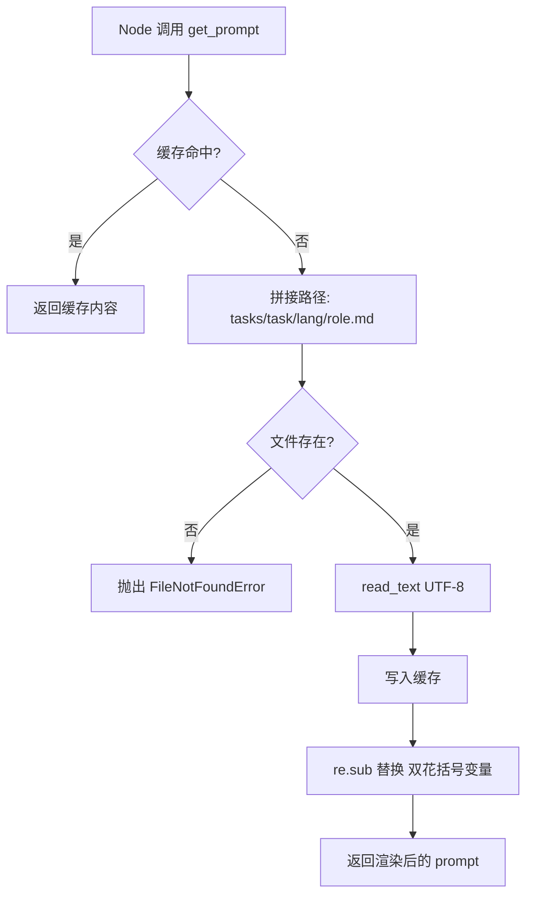
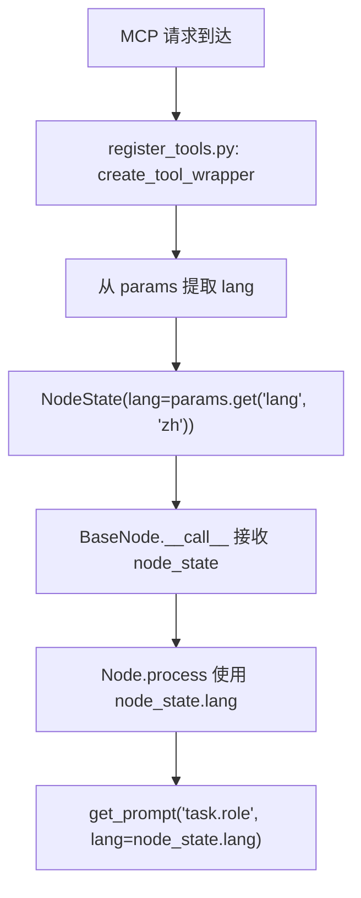

# PD-559.01 OpenStoryline — 目录隔离双语 Prompt 与 NodeState 语言传播

> 文档编号：PD-559.01
> 来源：OpenStoryline `src/open_storyline/utils/prompts.py`, `src/open_storyline/nodes/node_state.py`
> GitHub：https://github.com/FireRedTeam/FireRed-OpenStoryline.git
> 问题域：PD-559 国际化 Internationalization
> 状态：可复用方案

---

## 第 1 章 问题与动机

### 1.1 核心问题

Agent 系统中的 LLM 调用高度依赖 prompt 模板。当系统需要支持多语言用户时，面临三个层次的挑战：

1. **Prompt 模板管理**：同一任务的 system/user prompt 需要按语言维护独立版本，且模板数量随任务×语言组合爆炸增长
2. **运行时语言传递**：用户选择的语言需要从入口一路传递到每个节点的 LLM 调用，任何一环断裂都会导致语言不一致
3. **Agent 指令语言**：顶层 Agent 的 system instruction 也需要按语言切换，否则 Agent 用中文思考却输出英文回复

OpenStoryline 是一个视频剪辑 Agent 系统，包含 7+ 个核心节点（understand_clips、filter_clips、group_clips、generate_script、generate_voiceover、select_bgm、recommend_effects），每个节点都需要独立的 LLM 调用。语言不一致会直接导致生成的文案、字幕、配音语言混乱。

### 1.2 OpenStoryline 的解法概述

1. **目录隔离模板**：`prompts/tasks/{task}/{lang}/{role}.md` 三级目录结构，物理隔离不同语言的 prompt（`prompts.py:23`）
2. **PromptBuilder 单例 + 缓存**：全局 `_builder` 单例负责模板加载，内置 `_cache` 字典避免重复 IO（`prompts.py:13,63`）
3. **Mustache 风格变量替换**：`{{variable}}` 占位符 + `re.sub` 正则替换，模板与数据分离（`prompts.py:35`）
4. **NodeState 携带 lang**：`NodeState` dataclass 包含 `lang: str` 字段，在 MCP tool wrapper 中从请求参数提取并注入（`node_state.py:14`, `register_tools.py:48`）
5. **ClientContext 默认语言**：Agent 入口的 `ClientContext` 设置 `lang: str = "zh"` 作为全局默认（`agent.py:32`）

### 1.3 设计思想

| 设计原则 | 具体实现 | 理由 | 替代方案 |
|----------|----------|------|----------|
| 物理隔离优于逻辑分支 | 按 `{lang}/` 子目录存放模板文件 | 避免模板内 if/else 语言分支，翻译人员可独立编辑 | 单文件内 `` 条件块 |
| 状态显式传递 | NodeState.lang 字段贯穿全流程 | 每个节点都能明确知道当前语言，无隐式全局变量 | 全局 contextvars / 线程局部变量 |
| 单例 + 缓存 | PromptBuilder 全局实例 + dict 缓存 | 多节点共享同一 builder，模板只读一次 | 每次调用重新实例化 |
| 默认值兜底 | `lang="zh"` 默认参数 | 未传 lang 时不报错，降级到中文 | 强制要求传入 lang，缺失则抛异常 |
| 模板与代码分离 | Markdown 文件存放 prompt，Python 只做加载渲染 | prompt 迭代不需要改代码，非工程师也能编辑 | prompt 硬编码在 Python 字符串中 |

---

## 第 2 章 源码实现分析

### 2.1 架构概览

OpenStoryline 的 i18n 架构分为三层：模板层、构建层、消费层。

```
┌─────────────────────────────────────────────────────────┐
│                    模板层 (prompts/)                      │
│  prompts/tasks/                                          │
│  ├── filter_clips/                                       │
│  │   ├── zh/  → system.md, user.md                      │
│  │   └── en/  → system.md, user.md                      │
│  ├── generate_script/                                    │
│  │   ├── zh/  → system.md, user.md                      │
│  │   └── en/  → system.md, user.md                      │
│  ├── instruction/                                        │
│  │   ├── zh/  → system.md  (Agent 顶层指令)              │
│  │   └── en/  → system.md                               │
│  └── ... (8 个任务 × 2 语言 × 2 角色 = 32+ 模板文件)     │
├─────────────────────────────────────────────────────────┤
│                 构建层 (PromptBuilder)                    │
│  prompts.py: PromptBuilder._load_template()             │
│              PromptBuilder.render()  → re.sub 变量替换   │
│              PromptBuilder.build()   → {system, user}    │
│  全局单例 _builder + _cache 字典                          │
├─────────────────────────────────────────────────────────┤
│                 消费层 (各 Node)                          │
│  NodeState.lang ──→ get_prompt("task.role", lang=...)   │
│  ClientContext.lang ──→ Agent 顶层 instruction 选择      │
│  register_tools.py: params.get('lang', 'zh') → NodeState│
└─────────────────────────────────────────────────────────┘
```

### 2.2 核心实现

#### 2.2.1 PromptBuilder 模板加载与渲染



对应源码 `src/open_storyline/utils/prompts.py:8-59`：

```python
class PromptBuilder:
    """Builder for fixed templates with dynamic inputs"""
    
    def __init__(self, prompts_dir: Path = PROMPTS_DIR):
        self.prompts_dir = prompts_dir
        self._cache: Dict[str, str] = {}
    
    def _load_template(self, task: str, role: str, lang: str) -> str:
        """Load template file"""
        cache_key = f"{task}:{role}:{lang}"
        
        if cache_key in self._cache:
            return self._cache[cache_key]
        
        # prompts/tasks/filter_clips/zh/system.md
        template_path = self.prompts_dir / task / lang / f"{role}.md"
        
        if not template_path.exists():
            raise FileNotFoundError(f"Template not found: {template_path}")
        
        content = template_path.read_text(encoding='utf-8')
        self._cache[cache_key] = content
        return content
    
    def render(self, task: str, role: str, lang: str = "zh", **variables: Any) -> str:
        """Render single template"""
        template = self._load_template(task, role, lang)
        return re.sub(r"{{(.*?)}}", lambda m: str(variables[m.group(1)]), template)
```

关键设计点：
- 缓存键 `task:role:lang` 三元组唯一标识一个模板（`prompts.py:17`）
- 路径拼接 `prompts_dir / task / lang / f"{role}.md"` 将语言作为目录层级（`prompts.py:23`）
- `re.sub(r"{{(.*?)}}", ...)` 实现 Mustache 风格变量替换（`prompts.py:35`）

#### 2.2.2 NodeState 语言注入与传播



对应源码 `src/open_storyline/mcp/register_tools.py:45-53`：

```python
async def wrapper(mcp_ctx: Context, **kwargs) -> dict:
    # ...
    node_state = NodeState(
        session_id=session_id,
        artifact_id=params['artifact_id'],
        lang=params.get('lang', 'zh'),  # 从请求参数提取语言，默认中文
        node_summary=NodeSummary(),
        llm=make_llm(mcp_ctx),
        mcp_ctx=mcp_ctx,
    )
    result = await node(node_state, **params)
    return result
```

NodeState 定义极简（`src/open_storyline/nodes/node_state.py:10-17`）：

```python
@dataclass
class NodeState:
    """Node execution state"""
    session_id: str
    artifact_id: str
    lang: str
    node_summary: NodeSummary
    llm: SamplingLLMClient
    mcp_ctx: Context[ServerSession, object]
```

### 2.3 实现细节

**节点消费模式统一**：所有 7 个核心节点都遵循相同的 `get_prompt("task.role", lang=node_state.lang)` 调用模式：

| 节点 | 调用位置 | 调用方式 |
|------|----------|----------|
| understand_clips | `understand_clips.py:60-61` | `get_prompt("understand_clips.system_detail", lang=node_state.lang)` |
| filter_clips | `filter_clips.py:69-70` | `get_prompt("filter_clips.system", lang=node_state.lang)` |
| group_clips | `group_clips.py:49,55` | `get_prompt("group_clips.system", lang=node_state.lang)` |
| generate_script | `generate_script.py:84,87` | `get_prompt("generate_script.system", lang=node_state.lang)` |
| generate_voiceover | `generate_voiceover.py:250,254` | `get_prompt("generate_voiceover.system", lang=node_state.lang)` |
| select_bgm | `select_bgm.py:87-88` | `get_prompt("select_bgm.system", lang=node_state.lang)` |
| recommend_effects | `recommend_effects.py:98-99` | `get_prompt("elementrec_text.system", lang=node_state.lang)` |

**模板目录完整覆盖**：8 个任务目录 × zh/en 双语 = 32+ 模板文件：

```
prompts/tasks/
├── elementrec_text/  {zh,en}/{system,user}.md
├── filter_clips/     {zh,en}/{system,user}.md
├── generate_script/  {zh,en}/{system,user}.md
├── generate_title/   {zh,en}/{system,user}.md
├── generate_voiceover/ {zh,en}/{system,user}.md
├── group_clips/      {zh,en}/{system,user}.md
├── instruction/      {zh,en}/system.md
├── scripts/          {zh,en}/{omni_bgm_label,script_template_label}.md
├── select_bgm/       {zh,en}/{system,user}.md
└── understand_clips/ {zh,en}/{system_detail,user_detail,system_overall,user_overall}.md
```

**Agent 顶层指令双语**：`prompts/tasks/instruction/zh/system.md` 和 `en/system.md` 分别定义了完整的中英文 Agent 行为指令，包括角色定义、工作流程、示例对话，确保 Agent 的"思维语言"也跟随用户语言切换。


---

## 第 3 章 迁移指南

### 3.1 迁移清单

**阶段 1：模板目录结构搭建**
- [ ] 创建 `prompts/tasks/{task_name}/{lang}/` 目录结构
- [ ] 将现有硬编码 prompt 提取为 Markdown 文件
- [ ] 为每个任务创建 zh/en 两个语言版本

**阶段 2：PromptBuilder 集成**
- [ ] 引入 PromptBuilder 类（可直接复用下方代码）
- [ ] 将所有 `f"You are a ..."` 硬编码 prompt 替换为 `get_prompt("task.role", lang=lang)` 调用
- [ ] 确认 `{{variable}}` 占位符与业务变量名一致

**阶段 3：运行时语言传递**
- [ ] 在状态对象（State / Context / NodeState）中添加 `lang: str` 字段
- [ ] 在入口处（API handler / MCP wrapper）从请求参数提取 lang 并注入状态
- [ ] 确认所有节点的 LLM 调用都通过 `state.lang` 获取语言

**阶段 4：新语言扩展**
- [ ] 复制 `en/` 目录为 `ja/`（或其他语言），翻译模板内容
- [ ] 无需改动任何 Python 代码，PromptBuilder 自动识别新语言目录

### 3.2 适配代码模板

以下代码可直接复用，适配任意 Python Agent 项目：

```python
"""prompt_i18n.py — 可复用的多语言 Prompt 构建器"""
from pathlib import Path
from typing import Dict, Any
import re

class PromptBuilder:
    """
    多语言 Prompt 模板构建器
    
    目录结构要求：
        prompts_dir/
        ├── {task_name}/
        │   ├── zh/
        │   │   ├── system.md
        │   │   └── user.md
        │   └── en/
        │       ├── system.md
        │       └── user.md
    """
    
    def __init__(self, prompts_dir: str = "prompts/tasks"):
        self.prompts_dir = Path(prompts_dir)
        self._cache: Dict[str, str] = {}
    
    def _load(self, task: str, role: str, lang: str) -> str:
        key = f"{task}:{role}:{lang}"
        if key in self._cache:
            return self._cache[key]
        
        path = self.prompts_dir / task / lang / f"{role}.md"
        if not path.exists():
            # 降级：尝试默认语言
            fallback = self.prompts_dir / task / "en" / f"{role}.md"
            if fallback.exists():
                path = fallback
            else:
                raise FileNotFoundError(f"Template not found: {path}")
        
        content = path.read_text(encoding="utf-8")
        self._cache[key] = content
        return content
    
    def render(self, task: str, role: str, lang: str = "zh", **variables) -> str:
        template = self._load(task, role, lang)
        return re.sub(r"\{\{(\w+)\}\}", lambda m: str(variables.get(m.group(1), f"{{{{{m.group(1)}}}}}")), template)
    
    def build(self, task: str, lang: str = "zh", **user_vars) -> Dict[str, str]:
        return {
            "system": self.render(task, "system", lang),
            "user": self.render(task, "user", lang, **user_vars),
        }

# 全局单例
_builder = PromptBuilder()

def get_prompt(name: str, lang: str = "zh", **kwargs) -> str:
    """获取单个 prompt。name 格式: 'task.role'，如 'filter_clips.system'"""
    task, role = name.split(".", 1)
    return _builder.render(task, role, lang, **kwargs)

def build_prompts(task: str, lang: str = "zh", **user_vars) -> Dict[str, str]:
    """获取 system + user prompt 对"""
    return _builder.build(task, lang, **user_vars)
```

**迁移增强：语言降级机制**

上方代码相比原版增加了 fallback 逻辑：当请求的语言模板不存在时，自动降级到 `en/` 目录。原版 OpenStoryline 没有此机制，缺失模板会直接抛 `FileNotFoundError`。

### 3.3 适用场景

| 场景 | 适用度 | 说明 |
|------|--------|------|
| 多节点 Agent 系统（3+ 个 LLM 调用节点） | ⭐⭐⭐ | 核心场景，NodeState 传播模式最有价值 |
| 双语（zh/en）Agent 产品 | ⭐⭐⭐ | 目录隔离方案开箱即用 |
| 5+ 语言的大规模国际化 | ⭐⭐ | 目录结构可扩展，但缺少翻译管理工具链 |
| 单节点简单 Agent | ⭐ | 过度设计，直接 if/else 更简单 |
| 需要运行时动态切换语言的场景 | ⭐⭐⭐ | lang 参数逐请求传递，天然支持 |

---

## 第 4 章 测试用例

```python
"""test_prompt_i18n.py — 基于 OpenStoryline 真实函数签名的测试"""
import pytest
from pathlib import Path
from unittest.mock import patch
import tempfile
import os


class TestPromptBuilder:
    """测试 PromptBuilder 核心功能"""
    
    @pytest.fixture
    def prompt_dir(self, tmp_path):
        """创建测试用模板目录"""
        # zh 模板
        zh_dir = tmp_path / "filter_clips" / "zh"
        zh_dir.mkdir(parents=True)
        (zh_dir / "system.md").write_text("你是视频筛选助手。用户要求：{{user_request}}")
        (zh_dir / "user.md").write_text("请筛选以下片段：{{clip_data}}")
        
        # en 模板
        en_dir = tmp_path / "filter_clips" / "en"
        en_dir.mkdir(parents=True)
        (en_dir / "system.md").write_text("You are a clip filter. Request: {{user_request}}")
        (en_dir / "user.md").write_text("Filter these clips: {{clip_data}}")
        
        return tmp_path
    
    def test_load_zh_template(self, prompt_dir):
        """正常路径：加载中文模板"""
        from prompt_i18n import PromptBuilder
        builder = PromptBuilder(str(prompt_dir))
        result = builder.render("filter_clips", "system", "zh", user_request="保留风景镜头")
        assert "你是视频筛选助手" in result
        assert "保留风景镜头" in result
    
    def test_load_en_template(self, prompt_dir):
        """正常路径：加载英文模板"""
        from prompt_i18n import PromptBuilder
        builder = PromptBuilder(str(prompt_dir))
        result = builder.render("filter_clips", "system", "en", user_request="keep landscape")
        assert "You are a clip filter" in result
        assert "keep landscape" in result
    
    def test_cache_hit(self, prompt_dir):
        """缓存命中：第二次加载不读文件"""
        from prompt_i18n import PromptBuilder
        builder = PromptBuilder(str(prompt_dir))
        builder.render("filter_clips", "system", "zh", user_request="test")
        assert "filter_clips:system:zh" in builder._cache
        # 删除文件后仍能从缓存获取
        (prompt_dir / "filter_clips" / "zh" / "system.md").unlink()
        result = builder.render("filter_clips", "system", "zh", user_request="cached")
        assert "cached" in result
    
    def test_missing_template_raises(self, prompt_dir):
        """边界情况：模板不存在时抛异常"""
        from prompt_i18n import PromptBuilder
        builder = PromptBuilder(str(prompt_dir))
        with pytest.raises(FileNotFoundError):
            builder.render("nonexistent_task", "system", "zh")
    
    def test_build_returns_system_and_user(self, prompt_dir):
        """正常路径：build 返回 system + user 对"""
        from prompt_i18n import PromptBuilder
        builder = PromptBuilder(str(prompt_dir))
        result = builder.build("filter_clips", "zh", user_request="test", clip_data="clip_001")
        assert "system" in result
        assert "user" in result
        assert "clip_001" in result["user"]
    
    def test_lang_default_to_zh(self, prompt_dir):
        """降级行为：未传 lang 默认中文"""
        from prompt_i18n import PromptBuilder
        builder = PromptBuilder(str(prompt_dir))
        result = builder.render("filter_clips", "system", user_request="默认语言")
        assert "你是视频筛选助手" in result


class TestNodeStateLangPropagation:
    """测试 NodeState.lang 传播机制"""
    
    def test_node_state_carries_lang(self):
        """NodeState 正确携带 lang 字段"""
        from dataclasses import dataclass
        
        @dataclass
        class MockNodeState:
            session_id: str
            artifact_id: str
            lang: str
        
        state = MockNodeState(session_id="s1", artifact_id="a1", lang="en")
        assert state.lang == "en"
    
    def test_default_lang_from_params(self):
        """从请求参数提取 lang，缺失时默认 zh"""
        params_with_lang = {"artifact_id": "a1", "lang": "en"}
        params_without_lang = {"artifact_id": "a1"}
        
        assert params_with_lang.get("lang", "zh") == "en"
        assert params_without_lang.get("lang", "zh") == "zh"
```


---

## 第 5 章 跨域关联

| 关联域 | 关系类型 | 说明 |
|--------|----------|------|
| PD-04 工具系统 | 协同 | MCP tool wrapper（`register_tools.py`）是 lang 注入的入口点，工具注册机制决定了语言参数如何传递到节点 |
| PD-10 中间件管道 | 协同 | `chat_middleware.py` 的 `log_tool_request` 中间件在工具调用链中运行，i18n 参数需要穿透中间件层 |
| PD-01 上下文管理 | 依赖 | 双语 prompt 模板意味着同一任务的 token 消耗因语言不同而变化（中文通常比英文消耗更多 token），影响上下文窗口预算 |
| PD-06 记忆持久化 | 协同 | `ArtifactStore` 存储节点执行结果时不区分语言，但生成的文案/字幕内容是语言相关的，检索历史结果时需注意语言一致性 |

---

## 第 6 章 来源文件索引

| 文件 | 行范围 | 关键实现 |
|------|--------|----------|
| `src/open_storyline/utils/prompts.py` | L1-L100 | PromptBuilder 类定义、缓存机制、render/build 方法、全局单例 |
| `src/open_storyline/nodes/node_state.py` | L1-L17 | NodeState dataclass，lang 字段定义 |
| `src/open_storyline/mcp/register_tools.py` | L21-L89 | create_tool_wrapper，从 params 提取 lang 注入 NodeState |
| `src/open_storyline/agent.py` | L20-L32 | ClientContext 定义，lang 默认值 "zh" |
| `src/open_storyline/nodes/core_nodes/filter_clips.py` | L69-L70 | 节点消费 get_prompt 的典型模式 |
| `src/open_storyline/nodes/core_nodes/generate_script.py` | L84-L87 | 脚本生成节点的双语 prompt 调用 |
| `src/open_storyline/nodes/core_nodes/understand_clips.py` | L60-L61, L174-L175 | 媒体理解节点的 system/user prompt 双语加载 |
| `src/open_storyline/nodes/core_nodes/base_node.py` | L54-L245 | BaseNode 抽象基类，__call__ 方法调用链 |
| `prompts/tasks/instruction/zh/system.md` | 全文 | Agent 顶层中文指令模板 |
| `prompts/tasks/instruction/en/system.md` | 全文 | Agent 顶层英文指令模板 |
| `prompts/tasks/filter_clips/zh/system.md` | 全文 | 筛选节点中文 system prompt |
| `prompts/tasks/filter_clips/en/system.md` | 全文 | 筛选节点英文 system prompt |

---

## 第 7 章 横向对比维度

```json comparison_data
{
  "project": "OpenStoryline",
  "dimensions": {
    "模板组织": "prompts/tasks/{task}/{lang}/{role}.md 三级目录物理隔离",
    "语言传递": "NodeState.lang 字段 + MCP wrapper 注入，显式逐节点传递",
    "变量替换": "re.sub + {{var}} Mustache 风格正则替换",
    "缓存策略": "PromptBuilder 单例 + task:role:lang 三元组 dict 缓存",
    "语言降级": "无降级机制，缺失模板直接 FileNotFoundError",
    "覆盖范围": "8 任务 × 2 语言 × 2 角色 = 32+ 模板文件全覆盖"
  }
}
```

### 域元数据补充

```json domain_metadata
{
  "solution_summary": "OpenStoryline 用 prompts/tasks/{task}/{lang}/{role}.md 三级目录隔离 32+ 模板文件，NodeState.lang 字段经 MCP wrapper 注入后贯穿 7 个核心节点的 LLM 调用",
  "description": "Agent 系统中 prompt 模板的多语言物理隔离与运行时语言状态传播",
  "sub_problems": [
    "Agent 顶层指令（system instruction）的多语言切换",
    "模板缓存键设计与缓存失效策略"
  ],
  "best_practices": [
    "PromptBuilder 单例 + task:role:lang 三元组缓存避免重复 IO",
    "Markdown 文件存放 prompt 实现模板与代码分离，非工程师可独立编辑"
  ]
}
```
