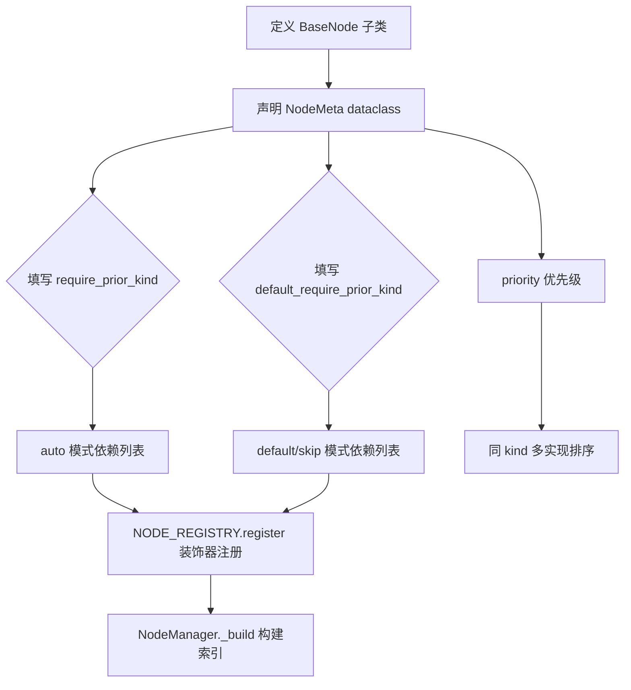
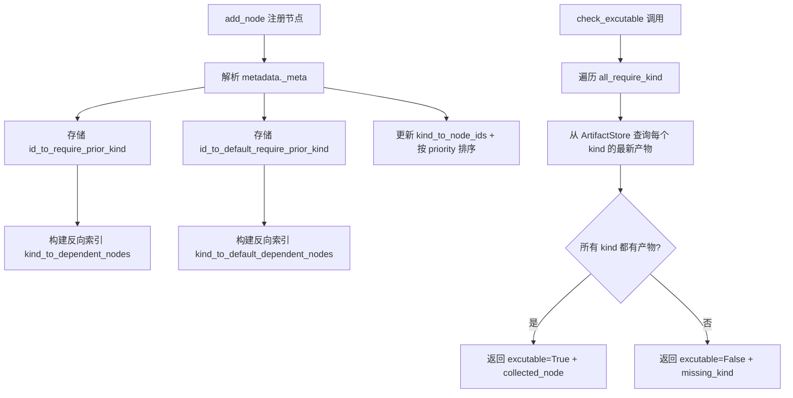
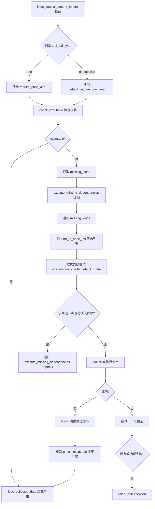

# PD-560.01 OpenStoryline — NodeMeta 声明式 DAG 与递归依赖自动补全

> 文档编号：PD-560.01
> 来源：OpenStoryline `src/open_storyline/nodes/node_manager.py`, `src/open_storyline/mcp/hooks/node_interceptors.py`, `src/open_storyline/nodes/core_nodes/base_node.py`
> GitHub：https://github.com/FireRedTeam/FireRed-OpenStoryline.git
> 问题域：PD-560 节点依赖 DAG 编排 Node Dependency DAG Orchestration
> 状态：可复用方案

---

## 第 1 章 问题与动机

### 1.1 核心问题

在多步骤工作流系统中（如视频生产流水线），节点之间存在复杂的依赖关系：`render_video` 需要 `plan_timeline` 的输出，`plan_timeline` 又需要 `group_clips`、`generate_script`、`tts`、`music_rec` 等多个前置节点的结果。传统做法是在编排层硬编码执行顺序（如 Airflow DAG 定义），但这导致：

1. **编排逻辑与业务逻辑耦合** — 新增节点需要同时修改编排层和节点层
2. **跳过节点困难** — 用户想跳过某些步骤（如不需要配音）时，需要重写编排逻辑
3. **LLM Agent 无法灵活调用** — Agent 按需调用工具时，无法感知依赖链

OpenStoryline 的核心洞察是：**依赖关系应该声明在节点自身的元数据中，由拦截器在运行时自动解析和补全**。

### 1.2 OpenStoryline 的解法概述

1. **NodeMeta 声明式依赖** — 每个节点通过 `require_prior_kind` 和 `default_require_prior_kind` 两个列表声明依赖（`base_node.py:32-48`）
2. **双轨依赖模型** — `require_prior_kind` 用于 auto 模式（完整执行），`default_require_prior_kind` 用于 default/skip 模式（快速跳过），同一节点在不同模式下依赖不同（`node_interceptors.py:87-92`）
3. **NodeManager 反向索引** — `kind_to_dependent_nodes` 反向索引支持 O(1) 查询"谁依赖了这个 kind"（`node_manager.py:23-25`）
4. **ToolInterceptor 递归补全** — 拦截器在执行前检查依赖，缺失时递归执行前置节点，候选节点按优先级回退（`node_interceptors.py:112-158`）
5. **ArtifactStore 时间戳判定** — 通过 `get_latest_meta` 按 `created_at` 取最新产物判断依赖是否已满足（`node_manager.py:145-167`）

### 1.3 设计思想

| 设计原则 | 具体实现 | 理由 | 替代方案 |
|----------|----------|------|----------|
| 声明式依赖 | NodeMeta dataclass 的 `require_prior_kind` 字段 | 依赖关系与节点定义共存，新增节点零编排改动 | 中央 DAG 定义文件（Airflow 式） |
| 双轨执行模式 | auto vs default 两套依赖列表 | 允许 Agent 跳过非必要步骤（如理解视频内容），降低延迟 | 单一依赖列表 + 条件判断 |
| 拦截器模式 | ToolInterceptor 作为 MCP before-hook | 依赖解析对节点透明，节点只关心输入数据 | 在节点内部检查依赖 |
| 优先级回退 | `kind_to_node_ids` 按 priority 排序，失败尝试下一个 | 同一 kind 可有多个实现（如 plan_timeline 和 plan_timeline_pro） | 固定单一实现 |
| 产物时间戳 | ArtifactMeta.created_at 取最新 | 支持重复执行同一节点，总是取最新结果 | 布尔标记"已执行" |

---

## 第 2 章 源码实现分析

### 2.1 架构概览

OpenStoryline 的节点依赖 DAG 由四层组件协作实现：

```
┌─────────────────────────────────────────────────────────────┐
│                    LLM Agent / 用户请求                       │
│              (调用任意节点工具，如 render_video)                │
└──────────────────────────┬──────────────────────────────────┘
                           │ MCP Tool Call
                           ▼
┌─────────────────────────────────────────────────────────────┐
│              ToolInterceptor (before-hook)                    │
│  1. 判断执行模式 (auto/default/skip)                          │
│  2. 选择对应依赖列表                                          │
│  3. check_excutable() 检查依赖                                │
│  4. 缺失 → execute_missing_dependencies() 递归补全            │
│  5. 注入前置节点产物到 input_data                              │
└──────────────────────────┬──────────────────────────────────┘
                           │
          ┌────────────────┼────────────────┐
          ▼                ▼                ▼
┌──────────────┐  ┌──────────────┐  ┌──────────────┐
│ NodeManager  │  │ ArtifactStore│  │  BaseNode     │
│ 依赖图 + 索引 │  │ 产物存储+查询 │  │ process()     │
│ kind→nodes   │  │ meta.json    │  │ default_proc()│
│ id→require   │  │ get_latest   │  │ __call__()    │
└──────────────┘  └──────────────┘  └──────────────┘
```

实际的节点依赖图（从源码 NodeMeta 声明中提取）：

```
load_media ──→ split_shots ──→ understand_clips ──→ filter_clips ──→ group_clips
                                                                        │
                    select_bgm (music_rec, 无前置依赖)                    │
                                │                                        │
                                ▼                                        ▼
                         plan_timeline ←── generate_script ←── group_clips
                              │                    │
                              │            generate_voiceover (tts)
                              │                    │
                              ▼                    ▼
                         render_video ←── transition_rec ←── group_clips
                              │
                              └── text_rec ←── generate_script
```

### 2.2 核心实现

#### 2.2.1 NodeMeta 声明式依赖定义



对应源码 `src/open_storyline/nodes/core_nodes/base_node.py:19-51`：

```python
@dataclass
class NodeMeta:
    name: str
    description: str
    node_id: str
    node_kind: str
    require_prior_kind: List[str] = field(default_factory=list)
    default_require_prior_kind: List[str] = field(default_factory=list)
    next_available_node: List[str] = field(default_factory=list)
    priority: int = 5
```

具体节点声明示例 — `generate_script` 节点（`src/open_storyline/nodes/core_nodes/generate_script.py:13-22`）：

```python
@NODE_REGISTRY.register()
class GenerateScriptNode(BaseNode):
    meta = NodeMeta(
        name="generate_script",
        node_id="generate_script",
        node_kind="generate_script",
        require_prior_kind=['split_shots', 'group_clips', 'understand_clips'],
        default_require_prior_kind=['split_shots', 'group_clips'],
        next_available_node=['generate_voiceover'],
    )
```

注意 `require_prior_kind` 比 `default_require_prior_kind` 多了 `understand_clips` — auto 模式需要视频理解结果来生成高质量脚本，而 default 模式跳过理解直接用分组信息生成占位脚本。

#### 2.2.2 NodeManager 依赖图构建与检查



对应源码 `src/open_storyline/nodes/node_manager.py:38-77`（add_node）和 `node_manager.py:145-167`（check_excutable）：

```python
def add_node(self, tool: StructuredTool) -> bool:
    metadata = tool.metadata.get('_meta', {})
    node_id = metadata.get('node_id')
    node_kind = metadata.get('node_kind', node_id)
    priority = metadata.get('priority', 0)
    require_prior_kind = metadata.get('require_prior_kind', [])
    default_require_prior_kind = metadata.get('default_require_prior_kind', [])

    self.id_to_tool[node_id] = tool
    self.id_to_require_prior_kind[node_id] = require_prior_kind
    self.id_to_default_require_prior_kind[node_id] = default_require_prior_kind

    self.kind_to_node_ids[node_kind].append(node_id)
    self._sort_kind(node_kind)  # 按 priority 降序排列

    for kind in require_prior_kind:
        self.kind_to_dependent_nodes[kind].add(node_id)
    return True

def check_excutable(self, session_id, store, all_require_kind):
    collected_output = {}
    for req_kind in all_require_kind:
        req_ids_queue = self.kind_to_node_ids[req_kind]
        valid_outputs = []
        for node_id in req_ids_queue:
            output = store.get_latest_meta(node_id=node_id, session_id=session_id)
            if output is not None:
                valid_outputs.append(output)
        if valid_outputs:
            latest_output = max(valid_outputs, key=lambda o: o.created_at)
            collected_output[req_kind] = latest_output
    return {
        "excutable": len(collected_output) == len(all_require_kind),
        "collected_node": collected_output,
        "missing_kind": list(set(all_require_kind) - set(collected_output.keys()))
    }
```

#### 2.2.3 ToolInterceptor 递归依赖补全



对应源码 `src/open_storyline/mcp/hooks/node_interceptors.py:85-232`：

```python
# 1. 判断执行模式和依赖
is_skip_mode = request.args.get('mode', 'auto') != 'auto'
require_kind = (
    meta_collector.id_to_default_require_prior_kind[node_id]
    if is_skip_mode
    else meta_collector.id_to_require_prior_kind[node_id]
)

# 2. 检查依赖是否满足
collect_result = meta_collector.check_excutable(session_id, store, require_kind)

# 3. 缺失时递归补全
if not collect_result['excutable']:
    missing_kinds = collect_result['missing_kind']

    async def execute_missing_dependencies(missing_kinds, for_node_id, depth=0):
        for kind in missing_kinds:
            success = False
            candidates = meta_collector.kind_to_node_ids[kind]
            for miss_id in candidates:  # 按 priority 排序的候选
                try:
                    await execute_node_with_default_mode(miss_id, for_node_id, depth)
                    success = True
                    break
                except ToolException:
                    continue  # 尝试下一个候选
            if not success:
                raise ToolException(f"Cannot satisfy dependency `{kind}`")

    async def execute_node_with_default_mode(miss_id, for_node_id, depth=0):
        tool = meta_collector.get_tool(miss_id)
        tool_call_input = {'artifact_id': store.generate_artifact_id(miss_id), 'mode': 'default'}
        # 递归检查该节点自身的依赖
        default_require = meta_collector.id_to_default_require_prior_kind[miss_id]
        default_result = meta_collector.check_excutable(session_id, store, default_require)
        if not default_result['excutable']:
            await execute_missing_dependencies(
                default_result['missing_kind'], for_node_id=miss_id, depth=depth+1
            )
        output = await tool.arun(ToolCall(args=tool_call_input, tool_call_type='default', runtime=runtime))
        return output

    await execute_missing_dependencies(missing_kinds, for_node_id=node_id)
```

### 2.3 实现细节

**Registry 装饰器自动发现机制**（`src/open_storyline/utils/register.py:7-73`）：

`NODE_REGISTRY` 是全局单例 `Registry`，通过 `scan_package` 递归导入包下所有模块触发 `@NODE_REGISTRY.register()` 装饰器。注册流程在 `register_tools.py:92-113` 中完成：

```python
def register(server: FastMCP, cfg: Settings) -> None:
    for pkg in cfg.local_mcp_server.available_node_pkgs:
        NODE_REGISTRY.scan_package(pkg)  # 触发所有 @register 装饰器
    all_node_classes = [NODE_REGISTRY.get(name=n) for n in cfg.local_mcp_server.available_nodes]
    for NodeClass in all_node_classes:
        node_instance = NodeClass(cfg)
        tool_func, meta = create_tool_wrapper(node_instance, node_instance.input_schema)
        server.tool(name=meta.name, description=meta.description, meta=asdict(meta))(tool_func)
```

关键设计：`meta=asdict(meta)` 将 NodeMeta 序列化为 dict 传入 MCP tool metadata，使得 NodeManager 可以从 `tool.metadata['_meta']` 中重建依赖图。

**BaseNode 双入口设计**（`src/open_storyline/nodes/core_nodes/base_node.py:206-245`）：

```python
async def __call__(self, node_state, **params):
    mode = params.get("mode", "auto")
    inputs = self.load_inputs_from_client(node_state, params.copy())
    parsed_inputs = self._parse_input(node_state, inputs)
    if mode != 'auto':
        outputs = await self.default_process(node_state, parsed_inputs)  # 快速路径
    else:
        outputs = await self.process(node_state, parsed_inputs)          # 完整路径
```

每个节点必须实现两个抽象方法：`process`（完整处理）和 `default_process`（降级/跳过处理）。例如 `SplitShotsNode.default_process` 不做镜头分割直接透传，`UnderstandClipsNode.default_process` 返回 "no caption" 占位。

