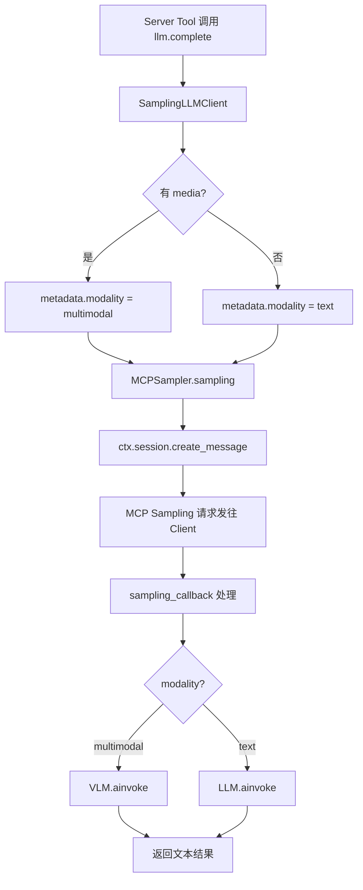
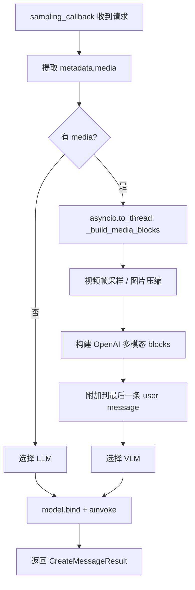

# PD-561.01 OpenStoryline — 双协议 LLM 抽象与多模态 Sampling 回调

> 文档编号：PD-561.01
> 来源：OpenStoryline `src/open_storyline/mcp/`
> GitHub：https://github.com/FireRedTeam/FireRed-OpenStoryline.git
> 问题域：PD-561 MCP 协议集成 MCP Protocol Integration
> 状态：可复用方案

---

## 第 1 章 问题与动机（≥ 30 行）

### 1.1 核心问题

MCP（Model Context Protocol）定义了 Server/Client 分离架构，但在实际工程中面临三个关键挑战：

1. **Server 端工具需要 LLM 能力**：MCP Server 注册的工具（Tool）在执行过程中经常需要调用 LLM 进行推理（如理解视频内容、生成文案），但 Server 本身不持有 LLM 实例。MCP 协议通过 Sampling 机制解决这个问题——Server 向 Client 发起 `create_message` 请求，由 Client 侧的 LLM 完成推理。
2. **多模态数据传输**：当 Server 工具处理视频/图片时，需要将多模态数据通过 Sampling 回调传递给 Client 侧的 VLM（Vision Language Model），涉及视频帧采样、图片压缩、base64 编码等复杂预处理。
3. **Node→Tool 映射**：项目内部有丰富的 Node 体系（视频理解、脚本生成、配音等），需要将这些 Node 自动注册为 MCP Tool，同时保持 Node 的依赖关系和生命周期管理。

### 1.2 OpenStoryline 的解法概述

OpenStoryline 构建了一套完整的 MCP Server/Client 架构，核心设计：

1. **双层 LLM 协议抽象**（`sampling_requester.py:12-44`）：定义 `BaseLLMSampling`（低层 Sampling 协议）和 `LLMClient`（高层 complete 协议），Server 端工具只依赖 `LLMClient` 接口，底层通过 `MCPSampler` 桥接到 MCP Sampling
2. **多模态 Sampling 回调**（`sampling_handler.py:308-432`）：Client 端的 `make_sampling_callback` 工厂函数，接收 Server 的 Sampling 请求后，自动路由到 LLM/VLM，处理视频帧采样和图片压缩
3. **Node→Tool 自动注册**（`register_tools.py:21-113`）：`create_tool_wrapper` 工厂函数通过 `inspect.Signature` 动态构造 MCP Tool 函数签名，将 BaseNode 子类自动转换为 FastMCP Tool
4. **Session Lifespan 绑定**（`server.py:22-37`）：通过 FastMCP 的 `lifespan` 参数注入 `SessionLifecycleManager`，管理会话级资源的创建和清理
5. **Header 传递 Session ID**（`agent.py:102`）：Client 通过 HTTP Header `X-Storyline-Session-Id` 传递会话标识，Server 端工具从 `request.headers` 提取

### 1.3 设计思想

| 设计原则 | 具体实现 | 理由 | 替代方案 |
|----------|----------|------|----------|
| 协议分层 | BaseLLMSampling（低层）+ LLMClient（高层） | 工具只关心 complete()，不关心底层是 MCP Sampling 还是直接调用 | 单一接口混合所有参数 |
| 多模态透传 | media 路径通过 metadata 传递，Client 侧负责 base64 编码 | Server 不需要处理大文件编码，减少网络传输 | Server 端编码后传输 |
| 工厂模式注册 | create_tool_wrapper + inspect.Signature 动态签名 | 新增 Node 只需继承 BaseNode，无需手写 MCP Tool | 手动为每个 Node 写 @server.tool |
| 会话级资源管理 | lifespan context manager + SessionLifecycleManager | 资源随会话创建/销毁，避免泄漏 | 全局单例 + 手动清理 |
| LLM/VLM 自动路由 | metadata.modality 标记 + sampling_callback 内部分发 | 工具无需关心用哪个模型，由 media 有无自动决定 | 工具显式指定模型 |

---

## 第 2 章 源码实现分析（核心章节）

### 2.1 架构概览

```
┌─────────────────────────────────────────────────────────────────┐
│                        MCP Client (agent.py)                     │
│  ┌──────────────┐  ┌───────────────────┐  ┌──────────────────┐  │
│  │ ChatOpenAI   │  │ MultiServerMCP    │  │ sampling_callback│  │
│  │ (LLM / VLM)  │  │ Client            │  │ (LLM/VLM路由)    │  │
│  └──────┬───────┘  └────────┬──────────┘  └────────┬─────────┘  │
│         │                   │                      │             │
│         │    ┌──────────────┘                      │             │
│         │    │  streamable-http + headers           │             │
└─────────┼────┼─────────────────────────────────────┼─────────────┘
          │    │                                      │
          │    ▼                                      ▲
┌─────────┼────────────────────────────────────────────────────────┐
│         │          MCP Server (server.py)            │           │
│         │  ┌──────────────────────────────────┐     │           │
│         │  │ FastMCP + session_lifespan        │     │           │
│         │  │  → SessionLifecycleManager        │     │           │
│         │  └──────────────┬───────────────────┘     │           │
│         │                 │                          │           │
│         │  ┌──────────────▼───────────────────┐     │           │
│         │  │ register_tools.register()         │     │           │
│         │  │  NODE_REGISTRY → create_tool_     │     │           │
│         │  │  wrapper → server.tool()          │     │           │
│         │  └──────────────┬───────────────────┘     │           │
│         │                 │                          │           │
│         │  ┌──────────────▼───────────────────┐     │           │
│         │  │ BaseNode.__call__()               │     │           │
│         │  │  → make_llm(ctx) → LLMClient     │─────┘           │
│         │  │  → MCPSampler.sampling()          │  create_message │
│         │  │  → ctx.session.create_message()   │  (Sampling请求)  │
│         │  └──────────────────────────────────┘                  │
└──────────────────────────────────────────────────────────────────┘
```

### 2.2 核心实现

#### 2.2.1 双层 LLM 协议抽象



对应源码 `sampling_requester.py:12-164`：

```python
class BaseLLMSampling(Protocol):
    # Low-level protocol: Sampling shared across multiple tools
    async def sampling(
        self, *, system_prompt: str | None,
        messages: list[SamplingMessage],
        temperature: float = 0.3, top_p: float = 0.9,
        max_tokens: int = 4096,
        model_preferences: dict[str, Any] | None = None,
        metadata: dict[str, Any] | None = None,
        stop_sequences: list[str] | None = None,
    ) -> str: ...

@runtime_checkable
class LLMClient(Protocol):
    # High-level protocol: Tools only distinguish by multimodal capability
    async def complete(
        self, *, system_prompt: str | None,
        user_prompt: str,
        media: list[dict[str, Any]] | None = None,
        temperature: float = 0.3, top_p: float = 0.9,
        max_tokens: int = 2048, ...
    ) -> str: ...

class MCPSampler(BaseLLMSampling):
    def __init__(self, mcp_ctx: Context[ServerSession, object]):
        self._mcp_ctx = mcp_ctx

    async def sampling(self, ...) -> str:
        merged_metadata = dict(metadata or {})
        merged_metadata["top_p"] = top_p
        result = await self._mcp_ctx.session.create_message(
            messages=messages, max_tokens=max_tokens,
            system_prompt=system_prompt, temperature=temperature,
            metadata=merged_metadata,
        )
        return self._extract_text(result.content)

class SamplingLLMClient(LLMClient):
    def __init__(self, sampler: BaseLLMSampling):
        self._sampler = sampler

    async def complete(self, *, user_prompt: str,
                       media: list[dict[str, Any]] | None = None, ...) -> str:
        messages = [SamplingMessage(
            role="user",
            content=TextContent(type="text", text=user_prompt),
        )]
        merged_metadata = dict(metadata or {})
        merged_metadata["modality"] = "multimodal" if media else "text"
        if media:
            merged_metadata["media"] = media  # 透传 media 路径
        return await self._sampler.sampling(
            system_prompt=system_prompt, messages=messages, ...)

def make_llm(mcp_ctx: Context[ServerSession, object]) -> LLMClient:
    return SamplingLLMClient(MCPSampler(mcp_ctx))
```

关键设计点：
- `BaseLLMSampling` 是低层协议，直接对应 MCP Sampling 的 `create_message` 语义（`sampling_requester.py:12-26`）
- `LLMClient` 是高层协议，工具只需调用 `complete(user_prompt=..., media=...)`（`sampling_requester.py:28-44`）
- `SamplingLLMClient` 将 media 路径透传到 metadata 中，由 Client 侧 sampling_callback 负责实际的 base64 编码（`sampling_requester.py:147-149`）
- `make_llm()` 是工厂函数，一行代码完成双层包装（`sampling_requester.py:162-164`）

#### 2.2.2 多模态 Sampling 回调



对应源码 `sampling_handler.py:308-432`：

```python
def make_sampling_callback(llm, vlm, *,
    resize_edge=600, jpeg_quality=80,
    min_frames=2, max_frames=6,
    frames_per_sec=3.0, global_max_images=48):

    async def sampling_callback(context, params: CreateMessageRequestParams):
        metadata = getattr(params, "metadata", None) or {}
        media_inputs = list(metadata.get("media", []) or [])
        use_multimodal = bool(media_inputs)
        model = vlm if use_multimodal else llm

        # 视频帧采样在线程池中执行，避免阻塞事件循环
        if use_multimodal:
            media_blocks = await asyncio.to_thread(
                _build_media_blocks, media_inputs,
                resize_edge, jpeg_quality, ...)

        # 将 media blocks 附加到最后一条 user message
        user_indices = [i for i, m in enumerate(mcp_messages)
                        if getattr(m, "role", "") == "user"]
        last_user_idx = user_indices[-1] if user_indices else None
        # ... 构建 LangChain messages ...

        bound = model.bind(temperature=temperature,
                           max_tokens=max_tokens, top_p=top_p)
        resp = await bound.ainvoke(lc_messages)
        return CreateMessageResult(
            content=TextContent(type="text", text=text_out),
            model=str(model_name), role="assistant",
            stopReason="endTurn")

    return sampling_callback
```

### 2.3 实现细节

#### Node→Tool 自动注册

`register_tools.py:21-89` 中的 `create_tool_wrapper` 使用 Python `inspect` 模块动态构造函数签名：

```python
def create_tool_wrapper(node: BaseNode, input_schema: type[BaseModel]):
    async def wrapper(mcp_ctx: Context, **kwargs) -> dict:
        session_id = headers.get('X-Storyline-Session-Id')
        node_state = NodeState(
            session_id=session_id,
            artifact_id=params['artifact_id'],
            llm=make_llm(mcp_ctx),  # 注入 LLM 能力
            mcp_ctx=mcp_ctx,
        )
        result = await node(node_state, **params)
        return result

    # 动态构造签名：从 Pydantic input_schema 提取字段
    new_params = [inspect.Parameter('mcp_ctx', ...)]
    for field_name, field_info in input_schema.model_fields.items():
        annotation = Annotated[field_info.annotation, field_info]
        new_params.append(inspect.Parameter(field_name, ...))
    wrapper.__signature__ = inspect.Signature(new_params)
    return wrapper, meta
```

注册流程（`register_tools.py:92-113`）：
1. `NODE_REGISTRY.scan_package(pkg)` 扫描 Node 包，触发 `@REGISTRY.register()` 装饰器
2. 遍历 `available_nodes` 配置，实例化每个 NodeClass
3. `create_tool_wrapper` 生成 MCP Tool 函数
4. `server.tool(name=..., description=...)` 注册到 FastMCP

#### Session 生命周期管理

`server.py:22-37` 使用 `@asynccontextmanager` 定义 lifespan：

```python
@asynccontextmanager
async def session_lifespan(server: FastMCP) -> AsyncIterator[SessionLifecycleManager]:
    session_manager = SessionLifecycleManager(
        artifacts_root=cfg.project.outputs_dir,
        cache_root=cfg.local_mcp_server.server_cache_dir,
        enable_cleanup=True,
    )
    try:
        yield session_manager
    finally:
        session_manager.cleanup_expired_sessions()
```

`SessionLifecycleManager`（`session_manager.py:14-167`）实现两阶段清理：
- 阶段 1：删除超过 `retention_days`（默认 3 天）的过期会话
- 阶段 2：如果剩余会话数超过 `max_items`（默认 256），按时间排序删除最旧的
- 使用 `threading.Lock` 非阻塞锁防止并发清理冲突

