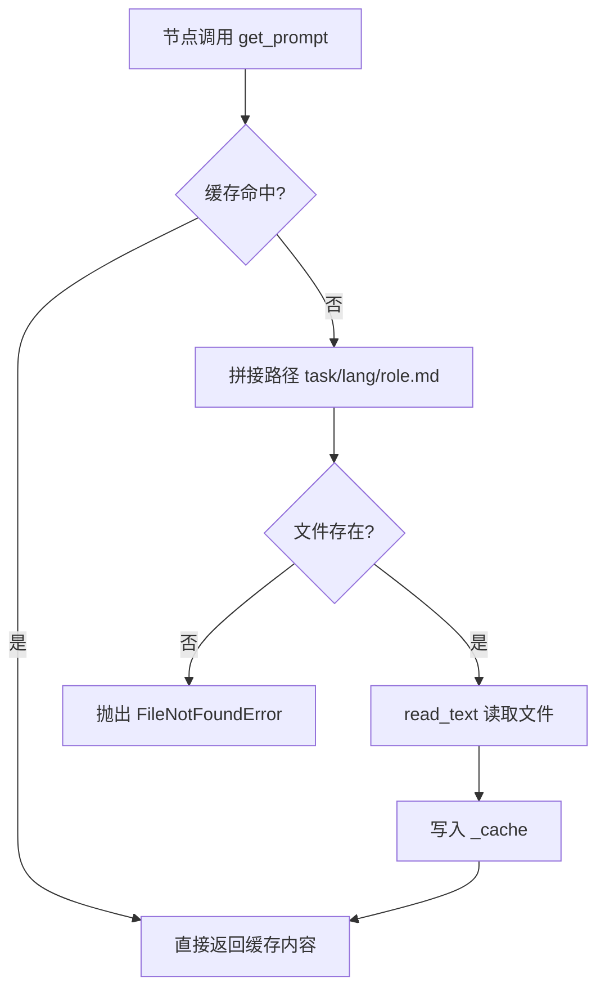
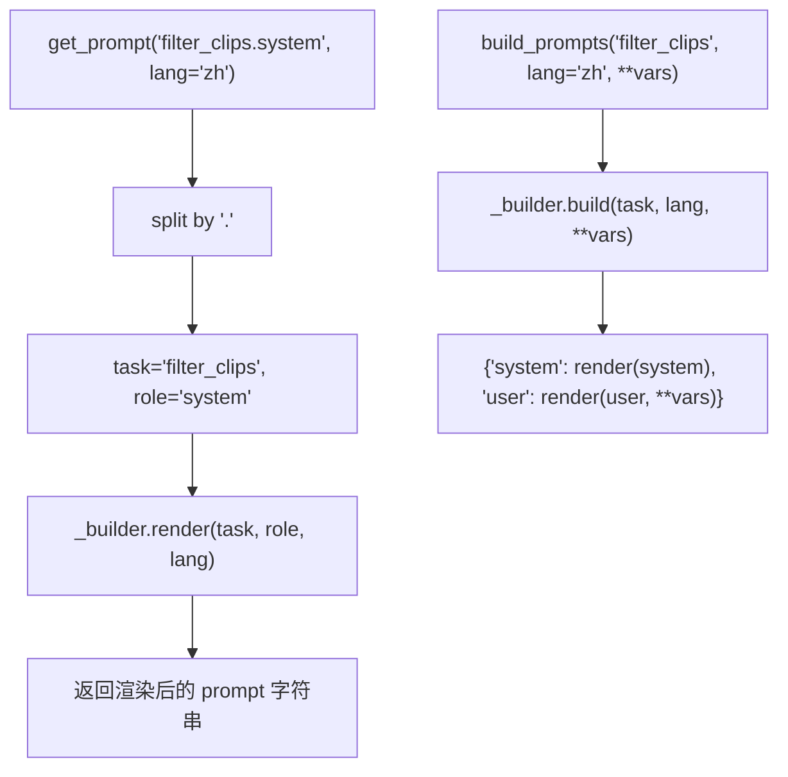

# PD-562.01 FireRed-OpenStoryline — PromptBuilder 三级目录模板管理与双语渲染

> 文档编号：PD-562.01
> 来源：FireRed-OpenStoryline `src/open_storyline/utils/prompts.py`
> GitHub：https://github.com/FireRedTeam/FireRed-OpenStoryline.git
> 问题域：PD-562 Prompt 模板管理 Prompt Template Management
> 状态：可复用方案

---

## 第 1 章 问题与动机

### 1.1 核心问题

在 LLM 驱动的多节点 Agent 管道中，每个节点（filter_clips、generate_script、understand_clips 等）都需要独立的 system prompt 和 user prompt。当管道节点数量达到 8-10 个、且需要支持中英双语时，prompt 管理面临三个核心挑战：

1. **散落问题**：prompt 硬编码在各节点 Python 文件中，修改一个 prompt 需要找到对应的 `.py` 文件，非工程人员（如 prompt 设计师）无法独立迭代
2. **多语言膨胀**：每个节点 × 每种角色（system/user）× 每种语言 = 组合爆炸，缺乏统一的组织约定会导致文件命名混乱
3. **重复 IO**：同一个 prompt 模板在管道执行中可能被多次读取（如 instruction.system 在 CLI 和 FastAPI 入口都用到），缺乏缓存会产生不必要的磁盘 IO

### 1.2 FireRed-OpenStoryline 的解法概述

OpenStoryline 采用 **文件级 prompt 模板 + PromptBuilder 单例** 的方案：

1. **三级目录约定** `prompts/tasks/{task}/{lang}/{role}.md`：将 prompt 从代码中完全分离为独立 Markdown 文件，按 task → lang → role 三级组织（`prompts.py:22-23`）
2. **`{{var}}` 正则渲染**：用 `re.sub(r"{{(.*?)}}", ...)` 实现轻量级变量替换，无需引入 Jinja2 等重型模板引擎（`prompts.py:35`）
3. **Dict 缓存**：`_cache: Dict[str, str]` 以 `task:role:lang` 为 key 缓存已加载模板，避免重复文件读取（`prompts.py:13,19-20`）
4. **全局单例 + 便捷函数**：`_builder = PromptBuilder()` 模块级单例，配合 `get_prompt("task.role")` 和 `build_prompts(task)` 两个快捷函数，节点代码只需一行调用（`prompts.py:63-100`）
5. **system/user 配对构建**：`build()` 方法一次返回 `{"system": ..., "user": ...}` 字典，system 模板无变量、user 模板接收动态数据，职责清晰（`prompts.py:37-59`）

### 1.3 设计思想

| 设计原则 | 具体实现 | 理由 | 替代方案 |
|----------|----------|------|----------|
| 关注点分离 | prompt 文件独立于 Python 代码 | prompt 设计师可直接编辑 .md 文件，无需触碰业务逻辑 | 硬编码在代码中（耦合高） |
| 约定优于配置 | `task/lang/role.md` 三级路径即为寻址规则 | 无需注册表或配置文件，路径本身就是索引 | YAML 注册表映射（额外维护成本） |
| 最小依赖 | 仅用 `re.sub` + `pathlib`，零外部依赖 | 避免 Jinja2 等模板引擎的学习成本和依赖膨胀 | Jinja2（功能强但过重） |
| 单例复用 | 模块级 `_builder` 全局实例 | 整个进程共享缓存，避免多实例重复加载 | 依赖注入（更灵活但更复杂） |
| 快速失败 | `FileNotFoundError` 在模板缺失时立即抛出 | 开发阶段即发现路径拼写错误，不会静默降级 | 返回空字符串（隐藏错误） |

---

## 第 2 章 源码实现分析

### 2.1 架构概览

OpenStoryline 的 prompt 管理架构分为三层：文件层（Markdown 模板）、构建层（PromptBuilder）、消费层（管道节点）。

```
┌─────────────────────────────────────────────────────────────┐
│                    prompts/tasks/ (文件层)                    │
│  ┌──────────────┐ ┌──────────────┐ ┌──────────────────────┐ │
│  │filter_clips/  │ │generate_script│ │ understand_clips/    │ │
│  │ ├─zh/         │ │ ├─zh/         │ │ ├─zh/                │ │
│  │ │ ├system.md  │ │ │ ├system.md  │ │ │ ├system_detail.md  │ │
│  │ │ └user.md    │ │ │ └user.md    │ │ │ ├system_overall.md │ │
│  │ └─en/         │ │ └─en/         │ │ │ ├user_detail.md    │ │
│  │   ├system.md  │ │   ├system.md  │ │ │ └user_overall.md   │ │
│  │   └user.md    │ │   └user.md    │ │ └─en/ (同结构)       │ │
│  └──────────────┘ └──────────────┘ └──────────────────────┘ │
└────────────────────────┬────────────────────────────────────┘
                         │ pathlib 读取
                         ▼
┌─────────────────────────────────────────────────────────────┐
│              PromptBuilder (构建层)                           │
│  _cache: {"filter_clips:system:zh": "...", ...}             │
│  render(task, role, lang, **vars) → str                     │
│  build(task, lang, **user_vars) → {system, user}            │
└────────────────────────┬────────────────────────────────────┘
                         │ get_prompt() / build_prompts()
                         ▼
┌─────────────────────────────────────────────────────────────┐
│              Pipeline Nodes (消费层)                          │
│  FilterClipsNode  GenerateScriptNode  UnderstandClipsNode   │
│  SelectBgmNode    GenerateVoiceoverNode  ...                │
└─────────────────────────────────────────────────────────────┘
```

### 2.2 核心实现

#### 2.2.1 PromptBuilder 类与模板加载



对应源码 `src/open_storyline/utils/prompts.py:8-35`：

```python
class PromptBuilder:
    """Builder for fixed templates with dynamic inputs"""
    
    def __init__(self, prompts_dir: Path = PROMPTS_DIR):
        self.prompts_dir = prompts_dir
        self._cache: Dict[str, str] = {}
    
    def _load_template(self, task: str, role: str, lang: str) -> str:
        """Load template file"""
        cache_key = f"{task}:{role}:{lang}"
        
        if cache_key in self._cache:
            return self._cache[cache_key]
        
        # prompts/tasks/filter_clips/zh/system.md
        template_path = self.prompts_dir / task / lang / f"{role}.md"
        
        if not template_path.exists():
            raise FileNotFoundError(f"Template not found: {template_path}")
        
        content = template_path.read_text(encoding='utf-8')
        self._cache[cache_key] = content
        return content
    
    def render(self, task: str, role: str, lang: str = "zh", **variables: Any) -> str:
        """Render single template"""
        template = self._load_template(task, role, lang)
        return re.sub(r"{{(.*?)}}", lambda m: str(variables[m.group(1)]), template)
```

关键设计点：
- **缓存 key 格式** `task:role:lang`（`prompts.py:17`）：三元组唯一标识一个模板
- **路径拼接**（`prompts.py:23`）：`prompts_dir / task / lang / f"{role}.md"` 直接用 pathlib 拼接，零配置
- **正则渲染**（`prompts.py:35`）：`re.sub(r"{{(.*?)}}", lambda m: str(variables[m.group(1)]), template)` 用 lambda 从 `**variables` 中取值，变量名不存在时会抛 `KeyError`（隐式校验）

#### 2.2.2 便捷函数与 "task.role" 寻址



对应源码 `src/open_storyline/utils/prompts.py:62-100`：

```python
# Global singleton
_builder = PromptBuilder()

def get_prompt(name: str, lang: str = "zh", **kwargs: Any) -> str:
    parts = name.split(".")
    if len(parts) != 2:
        raise ValueError(f"Invalid format: '{name}', expected 'task/role'")
    task, role = parts
    return _builder.render(task, role, lang, **kwargs)

def build_prompts(task: str, lang: str = "zh", **user_vars: Any) -> Dict[str, str]:
    return _builder.build(task, lang, **user_vars)
```

`get_prompt` 用 `"task.role"` 点分格式寻址，`build_prompts` 一次构建 system+user 对。两者共享同一个 `_builder` 单例。

### 2.3 实现细节

#### 模板目录结构（42 个模板文件，8 个 task，2 种语言）

项目共有 8 个 task 目录，每个 task 下有 zh/en 两个语言目录：

| task | 角色文件 | 特殊点 |
|------|----------|--------|
| filter_clips | system.md, user.md | 标准双文件 |
| generate_script | system.md, user.md | system 含 99 行详细角色设定 |
| generate_title | system.md, user.md | user 含 `{{n_titles}}` 数量变量 |
| generate_voiceover | system.md, user.md | user 含 `{{provider_name}}` `{{schema_text}}` |
| group_clips | system.md, user.md | 标准双文件 |
| understand_clips | system_detail.md, system_overall.md, user_detail.md, user_overall.md | **突破 system/user 二元约定**，按粒度拆分为 detail/overall |
| instruction | system.md（仅 system） | Agent 入口级 system prompt，无 user 模板 |
| scripts | omni_bgm_label.md, script_template_label.md | **辅助脚本用**，非标准 system/user 结构 |
| select_bgm | system.md, user.md | 标准双文件 |
| elementrec_text | system.md, user.md | 标准双文件 |

#### 变量渲染的隐式校验

`re.sub` 的 lambda `lambda m: str(variables[m.group(1)])` 在变量缺失时会抛出 `KeyError`。这是一种"快速失败"设计——如果调用方忘记传递某个变量，立即报错而非生成含 `{{var}}` 占位符的残缺 prompt。

#### 节点调用模式

所有管道节点遵循统一的调用模式（以 `filter_clips.py:69-70` 为例）：

```python
system_prompt = get_prompt("filter_clips.system", lang=node_state.lang)
user_prompt = get_prompt("filter_clips.user", lang=node_state.lang, 
                         user_request=user_request, clip_captions=clip_block)
```

`node_state.lang` 由上游传入（CLI 默认 `'en'`，FastAPI 从 session 获取），实现语言的透明切换。


---

## 第 3 章 迁移指南

### 3.1 迁移清单

**阶段 1：目录结构搭建**
- [ ] 创建 `prompts/tasks/` 根目录
- [ ] 为每个 LLM 调用点创建 `{task}/{lang}/` 子目录
- [ ] 将现有硬编码 prompt 提取为 `system.md` 和 `user.md` 文件
- [ ] 用 `{{variable_name}}` 标记动态变量

**阶段 2：PromptBuilder 集成**
- [ ] 复制 `PromptBuilder` 类到项目 utils 目录
- [ ] 创建模块级单例和便捷函数
- [ ] 替换所有硬编码 prompt 为 `get_prompt()` 调用
- [ ] 确保 `lang` 参数从配置或 session 中传入

**阶段 3：多语言扩展**
- [ ] 为每个 task 创建 en/ 目录（或其他目标语言）
- [ ] 翻译所有模板文件
- [ ] 测试语言切换路径

### 3.2 适配代码模板

以下是可直接复用的 PromptBuilder 实现，增加了类型提示和缺失变量的友好报错：

```python
"""prompt_builder.py — 可移植的 Prompt 模板管理器"""
from pathlib import Path
from typing import Any, Dict
import re

class PromptBuilder:
    """
    文件级 prompt 模板管理器。
    
    目录约定: {prompts_dir}/{task}/{lang}/{role}.md
    变量语法: {{variable_name}}
    """
    
    def __init__(self, prompts_dir: str | Path = "prompts/tasks"):
        self.prompts_dir = Path(prompts_dir)
        self._cache: Dict[str, str] = {}
    
    def _load_template(self, task: str, role: str, lang: str) -> str:
        cache_key = f"{task}:{role}:{lang}"
        if cache_key in self._cache:
            return self._cache[cache_key]
        
        path = self.prompts_dir / task / lang / f"{role}.md"
        if not path.exists():
            raise FileNotFoundError(
                f"Prompt template not found: {path}\n"
                f"Expected: {self.prompts_dir}/{task}/{lang}/{role}.md"
            )
        
        content = path.read_text(encoding="utf-8")
        self._cache[cache_key] = content
        return content
    
    def render(self, task: str, role: str, lang: str = "zh", **variables: Any) -> str:
        template = self._load_template(task, role, lang)
        
        # 检查模板中的变量是否都已提供
        required = set(re.findall(r"{{(.*?)}}", template))
        provided = set(variables.keys())
        missing = required - provided
        if missing:
            raise ValueError(
                f"Template '{task}/{lang}/{role}.md' requires variables {missing} "
                f"but only got {provided}"
            )
        
        return re.sub(r"{{(.*?)}}", lambda m: str(variables[m.group(1)]), template)
    
    def build(self, task: str, lang: str = "zh", **user_vars: Any) -> Dict[str, str]:
        return {
            "system": self.render(task, "system", lang),
            "user": self.render(task, "user", lang, **user_vars),
        }
    
    def clear_cache(self):
        """开发模式下清除缓存，支持热重载"""
        self._cache.clear()


# 模块级单例
_builder = PromptBuilder()

def get_prompt(name: str, lang: str = "zh", **kwargs: Any) -> str:
    """获取单个 prompt。name 格式: 'task.role'，如 'filter_clips.system'"""
    parts = name.split(".")
    if len(parts) != 2:
        raise ValueError(f"Invalid prompt name '{name}', expected 'task.role' format")
    return _builder.render(parts[0], parts[1], lang, **kwargs)

def build_prompts(task: str, lang: str = "zh", **user_vars: Any) -> Dict[str, str]:
    """构建 system + user prompt 对"""
    return _builder.build(task, lang, **user_vars)
```

### 3.3 适用场景

| 场景 | 适用度 | 说明 |
|------|--------|------|
| 多节点 LLM 管道（5+ 节点） | ⭐⭐⭐ | 每个节点独立 prompt，文件级管理收益最大 |
| 需要非工程人员编辑 prompt | ⭐⭐⭐ | Markdown 文件可直接编辑，无需懂 Python |
| 多语言 Agent 应用 | ⭐⭐⭐ | task/lang/role 三级目录天然支持多语言 |
| 单一 prompt 的简单应用 | ⭐ | 过度设计，直接硬编码更简单 |
| 需要条件逻辑的复杂模板 | ⭐⭐ | `{{var}}` 不支持 if/for，需要升级到 Jinja2 |
| 高并发服务（100+ QPS） | ⭐⭐ | Dict 缓存足够，但无 TTL/LRU 淘汰机制 |

---

## 第 4 章 测试用例

```python
"""test_prompt_builder.py — PromptBuilder 测试用例"""
import pytest
from pathlib import Path
import tempfile
import os

# 假设 PromptBuilder 已按 3.2 节代码放置
from prompt_builder import PromptBuilder, get_prompt, build_prompts


@pytest.fixture
def tmp_prompts(tmp_path):
    """创建临时 prompt 目录结构"""
    # filter_clips/zh/system.md
    (tmp_path / "filter_clips" / "zh").mkdir(parents=True)
    (tmp_path / "filter_clips" / "zh" / "system.md").write_text(
        "你是一个视频筛选助手。", encoding="utf-8"
    )
    (tmp_path / "filter_clips" / "zh" / "user.md").write_text(
        "用户要求: {{user_request}}\n素材: {{clip_captions}}", encoding="utf-8"
    )
    # filter_clips/en/
    (tmp_path / "filter_clips" / "en").mkdir(parents=True)
    (tmp_path / "filter_clips" / "en" / "system.md").write_text(
        "You are a video filtering assistant.", encoding="utf-8"
    )
    (tmp_path / "filter_clips" / "en" / "user.md").write_text(
        "User request: {{user_request}}\nClips: {{clip_captions}}", encoding="utf-8"
    )
    return tmp_path


class TestPromptBuilder:
    def test_load_and_cache(self, tmp_prompts):
        builder = PromptBuilder(tmp_prompts)
        result = builder.render("filter_clips", "system", "zh")
        assert result == "你是一个视频筛选助手。"
        # 验证缓存命中
        assert "filter_clips:system:zh" in builder._cache

    def test_render_variables(self, tmp_prompts):
        builder = PromptBuilder(tmp_prompts)
        result = builder.render(
            "filter_clips", "user", "zh",
            user_request="保留旅行镜头",
            clip_captions="clip_001: 海滩日落"
        )
        assert "保留旅行镜头" in result
        assert "clip_001: 海滩日落" in result
        assert "{{" not in result  # 无残留占位符

    def test_missing_variable_raises(self, tmp_prompts):
        builder = PromptBuilder(tmp_prompts)
        with pytest.raises(ValueError, match="requires variables"):
            builder.render("filter_clips", "user", "zh", user_request="test")
            # 缺少 clip_captions

    def test_missing_template_raises(self, tmp_prompts):
        builder = PromptBuilder(tmp_prompts)
        with pytest.raises(FileNotFoundError):
            builder.render("nonexistent_task", "system", "zh")

    def test_build_pair(self, tmp_prompts):
        builder = PromptBuilder(tmp_prompts)
        pair = builder.build(
            "filter_clips", "zh",
            user_request="保留美食镜头",
            clip_captions="clip_002: 拉面特写"
        )
        assert "system" in pair
        assert "user" in pair
        assert "视频筛选助手" in pair["system"]
        assert "保留美食镜头" in pair["user"]

    def test_language_switch(self, tmp_prompts):
        builder = PromptBuilder(tmp_prompts)
        zh = builder.render("filter_clips", "system", "zh")
        en = builder.render("filter_clips", "system", "en")
        assert "视频筛选" in zh
        assert "video filtering" in en

    def test_clear_cache(self, tmp_prompts):
        builder = PromptBuilder(tmp_prompts)
        builder.render("filter_clips", "system", "zh")
        assert len(builder._cache) == 1
        builder.clear_cache()
        assert len(builder._cache) == 0
```

