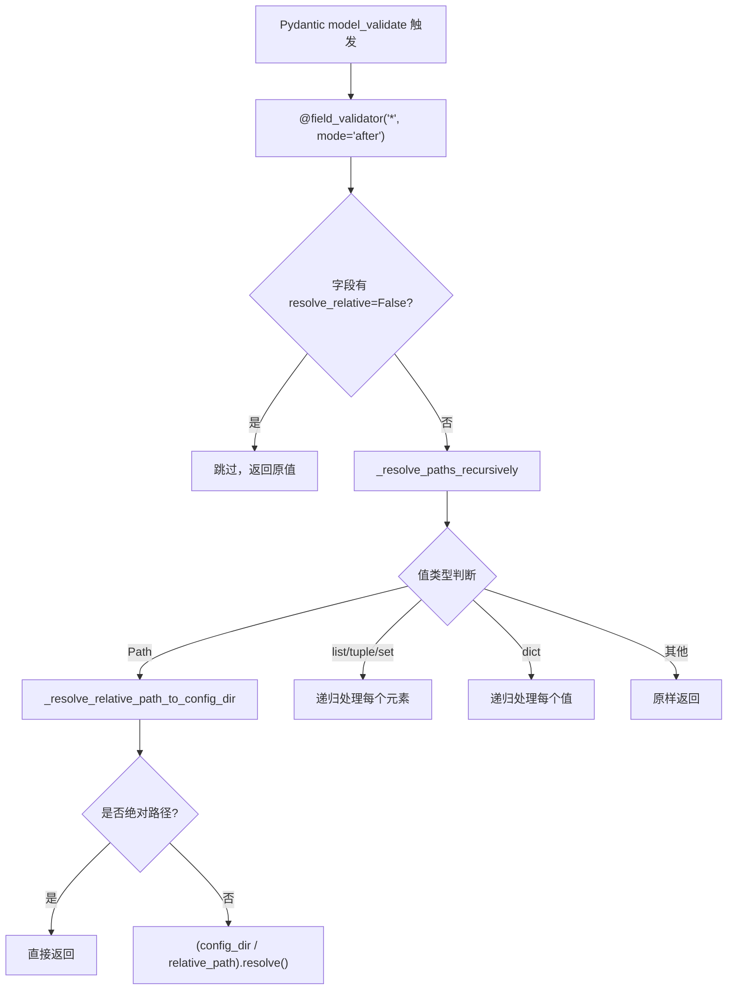
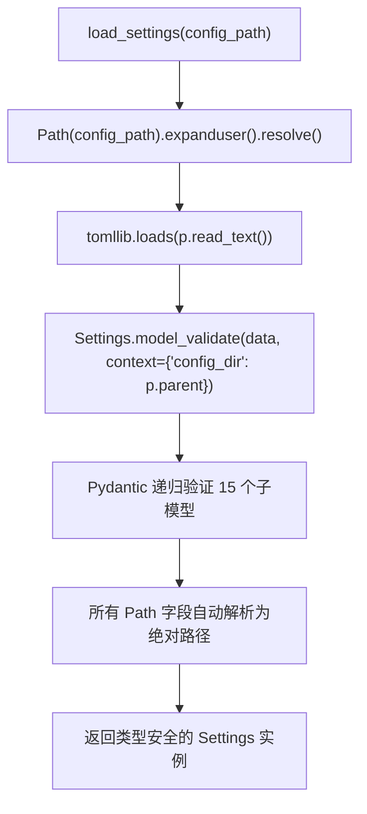

# PD-563.01 FireRed-OpenStoryline — TOML + Pydantic 嵌套配置与路径自动解析

> 文档编号：PD-563.01
> 来源：FireRed-OpenStoryline `src/open_storyline/config.py`, `config.toml`
> GitHub：https://github.com/FireRedTeam/FireRed-OpenStoryline.git
> 问题域：PD-563 配置管理 Configuration Management
> 状态：可复用方案

---

## 第 1 章 问题与动机

### 1.1 核心问题

多媒体 AI Agent 系统的配置管理面临三重挑战：

1. **配置项爆炸**：LLM/VLM 模型参数、MCP 服务器、TTS 多供应商、视频处理参数、音频分析参数等十余个子系统各有独立配置，总计 80+ 配置项需要统一管理。
2. **路径可移植性**：配置文件中大量引用相对路径（模型权重、输出目录、资源文件），但项目可能从不同工作目录启动（CLI、MCP Server、FastAPI），相对路径的基准目录不一致会导致文件找不到。
3. **类型安全**：TOML 解析后得到的是弱类型 dict，端口号可能被误写为字符串、超时时间可能为负数，缺乏编译期/加载期校验。

### 1.2 OpenStoryline 的解法概述

OpenStoryline 采用 **TOML 配置文件 + Pydantic BaseModel 继承体系 + 通配符 field_validator 路径自动解析** 的三层架构：

1. **单一 TOML 入口**：所有配置集中在 `config.toml`，按 `[section]` 分组，支持嵌套表（`config.toml:1-158`）
2. **ConfigBaseModel 基类**：继承 Pydantic BaseModel，设置 `extra="forbid"` 拒绝未知字段，并通过 `@field_validator("*")` 通配符自动解析所有 Path 类型字段（`config.py:61-75`）
3. **config_dir 上下文注入**：`load_settings()` 在调用 `model_validate()` 时通过 `context={"config_dir": p.parent}` 传入配置文件所在目录，所有相对路径基于此目录解析而非 cwd（`config.py:254-257`）
4. **15 个子配置模型**：每个子系统一个 Pydantic 模型，通过 Settings 根模型组合（`config.py:233-251`）
5. **环境变量覆盖**：`default_config_path()` 支持 `OPENSTORYLINE_CONFIG` 环境变量指定配置文件路径（`config.py:259-261`）

### 1.3 设计思想

| 设计原则 | 具体实现 | 理由 | 替代方案 |
|----------|----------|------|----------|
| 单一配置源 | 一个 `config.toml` 文件包含全部配置 | 避免配置散落在多个文件/环境变量中，降低运维复杂度 | 多文件分散配置（如每个子系统一个 yaml） |
| 类型安全优先 | Pydantic BaseModel + `extra="forbid"` | 加载时即发现拼写错误和类型不匹配，而非运行时崩溃 | 手动 dict.get() + 默认值 |
| 路径基准一致性 | 基于 config.toml 目录而非 cwd 解析相对路径 | 无论从哪个目录启动，路径解析结果一致 | 要求用户必须从项目根目录启动 |
| 通配符验证器 | `@field_validator("*", mode="after")` 自动处理所有 Path 字段 | 新增 Path 字段无需手动添加验证器，零遗漏 | 每个 Path 字段单独写 validator |
| 组合优于继承 | Settings 根模型组合 15 个子配置模型 | 各子系统配置独立演进，互不影响 | 单一扁平配置类 |

---

## 第 2 章 源码实现分析

### 2.1 架构概览

```
┌─────────────────────────────────────────────────────────────┐
│                      config.toml                            │
│  [developer] [project] [llm] [vlm] [local_mcp_server] ...  │
└──────────────────────────┬──────────────────────────────────┘
                           │ tomllib.loads()
                           ▼
┌─────────────────────────────────────────────────────────────┐
│              load_settings(config_path)                      │
│  1. resolve path → 2. read TOML → 3. model_validate()      │
│     context={"config_dir": config.toml 所在目录}             │
└──────────────────────────┬──────────────────────────────────┘
                           │
                           ▼
┌─────────────────────────────────────────────────────────────┐
│                    Settings (根模型)                          │
│  ┌──────────┐ ┌──────────┐ ┌──────────┐ ┌──────────┐       │
│  │Developer │ │ Project  │ │   LLM    │ │   VLM    │       │
│  │ Config   │ │ Config   │ │  Config  │ │  Config  │       │
│  └──────────┘ └──────────┘ └──────────┘ └──────────┘       │
│  ┌──────────┐ ┌──────────┐ ┌──────────┐ ┌──────────┐       │
│  │   MCP    │ │  Skills  │ │ Pexels   │ │SplitShots│       │
│  │ Config   │ │ Config   │ │ Config   │ │  Config  │       │
│  └──────────┘ └──────────┘ └──────────┘ └──────────┘       │
│  ┌──────────┐ ┌──────────┐ ┌──────────┐ ┌──────────┐       │
│  │Understand│ │ Script   │ │Voiceover │ │SelectBGM │       │
│  │  Clips   │ │ Template │ │  Config  │ │  Config  │       │
│  └──────────┘ └──────────┘ └──────────┘ └──────────┘       │
│  ┌──────────┐ ┌──────────┐ ┌──────────┐                    │
│  │Recommend │ │ Timeline │ │Timeline  │                    │
│  │  Text    │ │  Config  │ │Pro Config│                    │
│  └──────────┘ └──────────┘ └──────────┘                    │
└──────────────────────────┬──────────────────────────────────┘
                           │ cfg 注入
          ┌────────────────┼────────────────┐
          ▼                ▼                ▼
    ┌──────────┐    ┌──────────┐    ┌──────────┐
    │ cli.py   │    │ server.py│    │ agent.py │
    │ (CLI入口) │    │(MCP入口) │    │(Agent构建)│
    └──────────┘    └──────────┘    └──────────┘
```

### 2.2 核心实现

#### 2.2.1 ConfigBaseModel 基类与通配符路径解析



对应源码 `src/open_storyline/config.py:17-75`：

```python
def _resolve_relative_path_to_config_dir(v: Path, info: ValidationInfo) -> Path:
    """
    Resolve relative paths based on config.toml's directory (not cwd).
    Requires the caller to pass config_dir in model_validate(..., context={"config_dir": <Path|str>}).
    """
    ctx = info.context or {}
    base = ctx.get("config_dir")
    if not base:
        return v
    v2 = v.expanduser()
    if v2.is_absolute():
        return v2
    base_dir = Path(base).expanduser()
    return (base_dir / v2).resolve(strict=False)


class ConfigBaseModel(BaseModel):
    model_config = ConfigDict(extra="forbid")

    @field_validator("*", mode="after")
    @classmethod
    def _resolve_all_path_fields(cls, v: Any, info: ValidationInfo) -> Any:
        if info.field_name:
            field = cls.model_fields.get(info.field_name)
            extra = (field.json_schema_extra or {}) if field else {}
            if extra.get("resolve_relative") is False:
                return v
        return _resolve_paths_recursively(v, info)
```

关键设计点：
- `@field_validator("*")` 通配符匹配所有字段，新增 Path 字段自动获得路径解析能力
- `mode="after"` 确保在 Pydantic 类型转换之后执行（str → Path 已完成）
- `json_schema_extra={"resolve_relative": False}` 提供逃生舱口，可按字段禁用路径解析
- `resolve(strict=False)` 允许路径不存在（配置加载时目录可能尚未创建）

#### 2.2.2 Settings 根模型与 load_settings 入口



对应源码 `src/open_storyline/config.py:233-261`：

```python
class Settings(ConfigBaseModel):
    developer: DeveloperConfig
    project: ProjectConfig
    llm: LLMConfig
    vlm: VLMConfig
    local_mcp_server: MCPConfig
    skills: SkillsConfig
    search_media: PexelsConfig
    split_shots: SplitShotsConfig
    understand_clips: UnderstandClipsConfig
    script_template: RecommendScriptTemplateConfig
    generate_voiceover: GenerateVoiceoverConfig
    select_bgm: SelectBGMConfig
    recommend_text: RecommendTextConfig
    plan_timeline: PlanTimelineConfig
    plan_timeline_pro: PlanTimelineProConfig


def load_settings(config_path: str | Path) -> Settings:
    p = Path(config_path).expanduser().resolve()
    data = tomllib.loads(p.read_text(encoding="utf-8"))
    return Settings.model_validate(data, context={"config_dir": p.parent})

def default_config_path() -> str:
    return os.getenv("OPENSTORYLINE_CONFIG", "config.toml")
```

### 2.3 实现细节

#### 配置消费模式：构造函数注入

配置通过构造函数注入到各消费者，形成清晰的依赖链：

1. **CLI 入口** (`cli.py:30`)：`cfg = load_settings(default_config_path())`
2. **MCP Server** (`server.py:51`)：`cfg = load_settings(default_config_path())` → `create_server(cfg)` → `register_tools.register(server, cfg)`
3. **Node 实例化** (`register_tools.py:100`)：`node_instance = NodeClass(cfg)` — 每个 Node 通过 `BaseNode.__init__(self, server_cfg: Settings)` 接收完整配置
4. **Agent 构建** (`agent.py:35-126`)：`build_agent(cfg, ...)` 从 `cfg.llm`、`cfg.vlm`、`cfg.local_mcp_server` 提取子配置构建 LLM 客户端和 MCP 连接

#### computed_field 派生属性

`ProjectConfig` 使用 Pydantic `computed_field` 从已有字段派生新属性（`config.py:89-92`）：

```python
class ProjectConfig(ConfigBaseModel):
    media_dir: Path = Field(...)
    bgm_dir: Path = Field(...)
    outputs_dir: Path = Field(...)

    @computed_field(return_type=Path)
    @property
    def blobs_dir(self) -> Path:
        return self.outputs_dir
```

#### MCPConfig 的 url 计算属性

`MCPConfig` 通过 `@property` 从多个字段组合生成完整 URL（`config.py:129-131`）：

```python
class MCPConfig(ConfigBaseModel):
    url_scheme: str = "http"
    connect_host: str = "127.0.0.1"
    port: int = Field(ge=1, le=65535)
    path: str = "/mcp"

    @property
    def url(self) -> str:
        return f"{self.url_scheme}://{self.connect_host}:{self.port}{self.path}"
```

#### tomllib 兼容性处理

Python 3.11+ 内置 `tomllib`，低版本回退到 `tomli`（`config.py:8-12`）：

```python
try:
    import tomllib
except ImportError:
    print("Fail to import tomllib, try to import tomlis")
    import tomli as tomllib
```

---

## 第 3 章 迁移指南

### 3.1 迁移清单

**阶段 1：基础设施（必须）**

- [ ] 安装依赖：`pip install pydantic tomli`（Python < 3.11 需要 tomli）
- [ ] 创建 `config.toml` 配置文件，按子系统分 `[section]`
- [ ] 创建 `config.py`，定义 `ConfigBaseModel` 基类（含通配符路径解析）
- [ ] 为每个子系统创建 Pydantic 子模型
- [ ] 创建 `Settings` 根模型组合所有子模型
- [ ] 实现 `load_settings()` 和 `default_config_path()`

**阶段 2：集成（按需）**

- [ ] 在各入口点（CLI、Server、Agent）调用 `load_settings()`
- [ ] 将 `cfg` 通过构造函数注入到各组件
- [ ] 为需要跳过路径解析的字段添加 `json_schema_extra={"resolve_relative": False}`

**阶段 3：增强（可选）**

- [ ] 添加 `computed_field` 派生属性
- [ ] 添加 `@property` 组合计算属性（如 URL 拼接）
- [ ] 添加 `Field(ge=1, le=65535)` 等数值约束

### 3.2 适配代码模板

以下模板可直接复用，适用于任何 Python Agent 项目：

```python
"""config.py — 可复用的 TOML + Pydantic 配置管理模板"""
from __future__ import annotations
import os
from pathlib import Path
from typing import Any, Optional

try:
    import tomllib
except ImportError:
    import tomli as tomllib

from pydantic import BaseModel, ConfigDict, Field, ValidationInfo, field_validator


def _resolve_relative_path(v: Path, info: ValidationInfo) -> Path:
    """基于配置文件目录解析相对路径"""
    ctx = info.context or {}
    base = ctx.get("config_dir")
    if not base:
        return v
    v2 = v.expanduser()
    if v2.is_absolute():
        return v2
    return (Path(base).expanduser() / v2).resolve(strict=False)


def _resolve_paths_recursively(value: Any, info: ValidationInfo) -> Any:
    """递归处理容器类型中的 Path 对象"""
    if value is None:
        return None
    if isinstance(value, Path):
        return _resolve_relative_path(value, info)
    if isinstance(value, (list, tuple, set)):
        cls = type(value)
        return cls(_resolve_paths_recursively(v, info) for v in value)
    if isinstance(value, dict):
        return {k: _resolve_paths_recursively(v, info) for k, v in value.items()}
    return value


class ConfigBase(BaseModel):
    """配置基类：禁止未知字段 + 自动路径解析"""
    model_config = ConfigDict(extra="forbid")

    @field_validator("*", mode="after")
    @classmethod
    def _auto_resolve_paths(cls, v: Any, info: ValidationInfo) -> Any:
        if info.field_name:
            field = cls.model_fields.get(info.field_name)
            extra = (field.json_schema_extra or {}) if field else {}
            if extra.get("resolve_relative") is False:
                return v
        return _resolve_paths_recursively(v, info)


# === 按需定义子配置 ===
class LLMConfig(ConfigBase):
    model: str
    base_url: str
    api_key: str
    timeout: float = 30.0
    temperature: Optional[float] = None
    max_retries: int = 2


class ProjectConfig(ConfigBase):
    data_dir: Path = Field(..., description="数据目录")
    output_dir: Path = Field(..., description="输出目录")


class AppSettings(ConfigBase):
    """根配置模型"""
    llm: LLMConfig
    project: ProjectConfig
    # 按需添加更多子配置...


def load_settings(config_path: str | Path = "config.toml") -> AppSettings:
    p = Path(config_path).expanduser().resolve()
    data = tomllib.loads(p.read_text(encoding="utf-8"))
    return AppSettings.model_validate(data, context={"config_dir": p.parent})


def default_config_path() -> str:
    return os.getenv("APP_CONFIG", "config.toml")
```

### 3.3 适用场景

| 场景 | 适用度 | 说明 |
|------|--------|------|
| 多子系统 Agent 项目 | ⭐⭐⭐ | 配置项多、子系统多时收益最大 |
| 需要从不同目录启动的项目 | ⭐⭐⭐ | config_dir 路径解析彻底解决路径漂移问题 |
| 单文件脚本 | ⭐ | 过度设计，直接用 dict 即可 |
| 需要运行时热更新配置 | ⭐⭐ | 需额外实现 reload 机制，本方案是一次性加载 |
| 多环境部署（dev/staging/prod） | ⭐⭐ | 通过环境变量切换配置文件路径，但不支持字段级环境变量覆盖 |

---

## 第 4 章 测试用例

```python
"""test_config.py — 基于 OpenStoryline 真实函数签名的测试"""
import os
import pytest
from pathlib import Path
from unittest.mock import patch
from pydantic import ValidationError


# 假设已将 config.py 中的类导入
# from open_storyline.config import (
#     ConfigBaseModel, Settings, load_settings, default_config_path,
#     _resolve_relative_path_to_config_dir, LLMConfig, ProjectConfig
# )


class TestResolveRelativePath:
    """测试路径解析核心函数"""

    def test_relative_path_resolved_to_config_dir(self, tmp_path):
        """相对路径应基于 config_dir 解析"""
        config_dir = tmp_path / "project"
        config_dir.mkdir()
        toml_content = '[project]\nmedia_dir = "./outputs/media"\nbgm_dir = "./resource/bgms"\noutputs_dir = "./outputs"\n'
        toml_content += '[llm]\nmodel = "test"\nbase_url = "http://localhost"\napi_key = "key"\n'
        toml_content += '[vlm]\nmodel = "test"\nbase_url = "http://localhost"\napi_key = "key"\n'
        # 写入最小可用配置...
        config_file = config_dir / "config.toml"
        config_file.write_text(toml_content + _minimal_toml_sections())
        
        settings = load_settings(config_file)
        assert settings.project.media_dir == (config_dir / "outputs" / "media").resolve()

    def test_absolute_path_unchanged(self, tmp_path):
        """绝对路径不应被修改"""
        config_file = tmp_path / "config.toml"
        abs_path = "/absolute/path/to/media"
        toml_content = f'[project]\nmedia_dir = "{abs_path}"\nbgm_dir = "{abs_path}"\noutputs_dir = "{abs_path}"\n'
        config_file.write_text(toml_content + _minimal_toml_other_sections())
        
        settings = load_settings(config_file)
        assert str(settings.project.media_dir) == abs_path

    def test_tilde_expansion(self, tmp_path):
        """~ 应被展开为用户主目录"""
        config_file = tmp_path / "config.toml"
        toml_content = '[project]\nmedia_dir = "~/media"\nbgm_dir = "~/bgm"\noutputs_dir = "~/out"\n'
        config_file.write_text(toml_content + _minimal_toml_other_sections())
        
        settings = load_settings(config_file)
        assert "~" not in str(settings.project.media_dir)


class TestConfigValidation:
    """测试 Pydantic 验证"""

    def test_extra_fields_rejected(self, tmp_path):
        """未知字段应被拒绝（extra='forbid'）"""
        config_file = tmp_path / "config.toml"
        toml_content = '[llm]\nmodel = "test"\nbase_url = "url"\napi_key = "key"\nunknown_field = "bad"\n'
        config_file.write_text(toml_content + _minimal_toml_other_sections())
        
        with pytest.raises(ValidationError):
            load_settings(config_file)

    def test_port_range_validation(self, tmp_path):
        """端口号应在 1-65535 范围内"""
        config_file = tmp_path / "config.toml"
        toml_content = _full_toml_with_port(99999)
        config_file.write_text(toml_content)
        
        with pytest.raises(ValidationError):
            load_settings(config_file)


class TestDefaultConfigPath:
    """测试环境变量覆盖"""

    def test_default_path(self):
        with patch.dict(os.environ, {}, clear=True):
            os.environ.pop("OPENSTORYLINE_CONFIG", None)
            assert default_config_path() == "config.toml"

    def test_env_override(self):
        with patch.dict(os.environ, {"OPENSTORYLINE_CONFIG": "/custom/path.toml"}):
            assert default_config_path() == "/custom/path.toml"


def _minimal_toml_sections():
    """生成测试所需的最小 TOML 配置"""
    return """
[developer]
[llm]
model = "test"
base_url = "http://localhost"
api_key = "key"
[vlm]
model = "test"
base_url = "http://localhost"
api_key = "key"
[local_mcp_server]
port = 8001
[skills]
skill_dir = "./skills"
[search_media]
[split_shots]
transnet_weights = "./weights.pth"
[understand_clips]
[script_template]
script_template_dir = "./templates"
script_template_info_path = "./templates/meta.json"
[generate_voiceover]
tts_provider_params_path = "./tts.json"
[select_bgm]
[recommend_text]
font_info_path = "./fonts.json"
[plan_timeline]
[plan_timeline_pro]
"""

def _minimal_toml_other_sections():
    return _minimal_toml_sections()

def _full_toml_with_port(port: int) -> str:
    return f"""
[developer]
[project]
media_dir = "./media"
bgm_dir = "./bgm"
outputs_dir = "./out"
[llm]
model = "test"
base_url = "http://localhost"
api_key = "key"
[vlm]
model = "test"
base_url = "http://localhost"
api_key = "key"
[local_mcp_server]
port = {port}
[skills]
skill_dir = "./skills"
[search_media]
[split_shots]
transnet_weights = "./w.pth"
[understand_clips]
[script_template]
script_template_dir = "./t"
script_template_info_path = "./t/m.json"
[generate_voiceover]
tts_provider_params_path = "./tts.json"
[select_bgm]
[recommend_text]
font_info_path = "./f.json"
[plan_timeline]
[plan_timeline_pro]
"""
```
