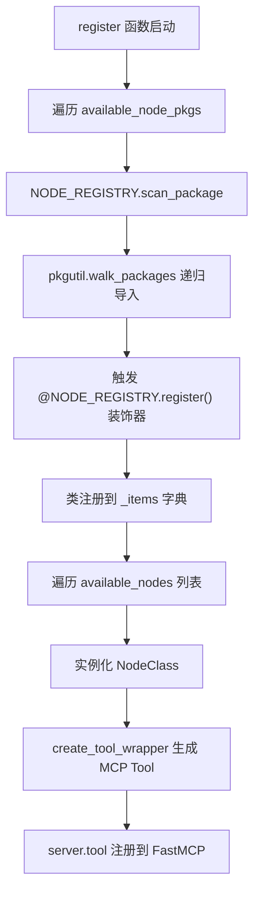
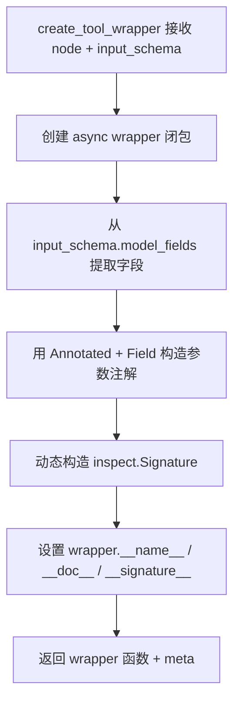
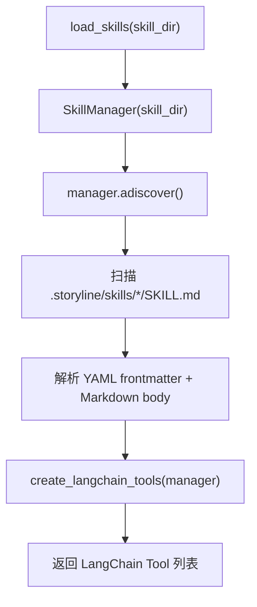

# PD-564.01 OpenStoryline — SkillKit 双轨技能系统与 MCP 工具桥接

> 文档编号：PD-564.01
> 来源：OpenStoryline `src/open_storyline/skills/skills_io.py`, `src/open_storyline/mcp/register_tools.py`
> GitHub：https://github.com/FireRedTeam/FireRed-OpenStoryline.git
> 问题域：PD-564 Skill 技能系统 Skill Plugin System
> 状态：可复用方案

---

## 第 1 章 问题与动机

### 1.1 核心问题

Agent 系统需要一种机制让终端用户（非开发者）能够扩展 Agent 的能力。传统的工具系统（Tool System）要求开发者编写 Python 类并注册到代码中，门槛高、迭代慢。当用户在使用过程中发现了一种有效的编辑工作流（如"快节奏 Vlog 剪辑风格"），如何将这种经验沉淀为可复用的"技能"，并让 Agent 在后续对话中自动调用？

这个问题包含三个子挑战：
1. **技能载体选择**：用什么格式存储技能？代码？配置？自然语言？
2. **双轨工具体系**：开发者编写的硬编码 Node 和用户创建的软技能如何共存于同一个 Agent 工具列表？
3. **运行时安全**：用户可以创建和保存技能文件，如何防止路径遍历等安全漏洞？

### 1.2 OpenStoryline 的解法概述

OpenStoryline 实现了一套"双轨技能系统"：

1. **硬轨道 — NODE_REGISTRY 装饰器注册**：开发者用 `@NODE_REGISTRY.register()` 装饰器将 Python Node 类注册到全局注册表，通过 `create_tool_wrapper` 工厂函数转换为 MCP Tool（`src/open_storyline/mcp/register_tools.py:21-89`）
2. **软轨道 — SkillKit Markdown 技能**：用户通过 Agent 对话生成 Markdown 格式的 SKILL.md 文件，运行时由 `skillkit` 库自动发现并通过 `create_langchain_tools` 转换为 LangChain Tool（`src/open_storyline/skills/skills_io.py:11-20`）
3. **双轨合并**：在 `build_agent` 中将 MCP tools 和 skill tools 合并为统一工具列表传给 LangChain Agent（`src/open_storyline/agent.py:119-121`）
4. **路径遍历防护**：`dump_skills` 函数使用 `Path.resolve()` + 父目录校验防止写入项目目录之外（`src/open_storyline/skills/skills_io.py:44-51`）
5. **元技能模式**：内置 `create_profile_style_skill` 技能可以"创建新技能"，实现技能的自我繁殖（`.storyline/skills/create_profile_style_skill/SKILL.md`）

### 1.3 设计思想

| 设计原则 | 具体实现 | 理由 | 替代方案 |
|----------|----------|------|----------|
| Markdown 即技能 | SKILL.md 用 YAML frontmatter + Markdown body 定义技能 | 降低创建门槛，非开发者可用自然语言编写 | JSON Schema 定义（门槛高）、Python 插件（需编码） |
| 双轨合并 | `tools + skills` 列表拼接传入 `create_agent` | 硬编码 Node 保证核心能力，软技能保证可扩展性 | 统一用一种注册方式（灵活性不足） |
| 工厂模式转换 | `create_tool_wrapper` 用 `inspect.Signature` 动态构造函数签名 | 让 Pydantic BaseModel 的 input_schema 自动映射为 MCP Tool 参数 | 手动为每个 Node 写 wrapper（重复劳动） |
| 路径沙箱 | `Path.resolve()` + `base_path not in final_path.parents` | 防止 `../../etc/passwd` 类攻击 | chroot 隔离（过重）、无防护（危险） |
| 元技能自繁殖 | `create_profile_style_skill` 技能调用 `write_skills` 工具生成新 SKILL.md | 让 Agent 自主扩展能力库，无需人工干预文件系统 | 仅允许开发者手动创建技能（扩展慢） |

---

## 第 2 章 源码实现分析

### 2.1 架构概览

OpenStoryline 的技能系统由三层组成：注册层、转换层、运行层。

```
┌─────────────────────────────────────────────────────────┐
│                    build_agent (agent.py)                │
│                                                         │
│   ┌──────────────┐          ┌──────────────────┐        │
│   │  MCP Tools   │          │  Skill Tools     │        │
│   │  (硬轨道)     │          │  (软轨道)         │        │
│   └──────┬───────┘          └────────┬─────────┘        │
│          │                           │                  │
│   tools + skills ──────────→ create_agent(tools=...)    │
│                                                         │
├─────────────────────────────────────────────────────────┤
│  转换层                                                  │
│  ┌────────────────────┐    ┌─────────────────────────┐  │
│  │ create_tool_wrapper │    │ create_langchain_tools  │  │
│  │ (register_tools.py) │    │ (skillkit 库)           │  │
│  │ Node→MCP Tool       │    │ SKILL.md→LangChain Tool │  │
│  └────────┬───────────┘    └──────────┬──────────────┘  │
│           │                           │                  │
├───────────┼───────────────────────────┼──────────────────┤
│  注册层    │                           │                  │
│  ┌────────┴───────────┐    ┌──────────┴──────────────┐  │
│  │ @NODE_REGISTRY      │    │ SkillManager.adiscover  │  │
│  │ .register()         │    │ (.storyline/skills/)    │  │
│  │ (装饰器扫描 Python)  │    │ (文件系统扫描 Markdown)  │  │
│  └─────────────────────┘    └─────────────────────────┘  │
└─────────────────────────────────────────────────────────┘
```

### 2.2 核心实现

#### 2.2.1 硬轨道：NODE_REGISTRY 装饰器注册与包扫描



对应源码 `src/open_storyline/utils/register.py:7-73`：

```python
class Registry:
    def __init__(self):
        self._items = {}

    def register(self, name: Optional[str] = None, override: bool = False):
        def decorator(cls):
            reg_name = name or f"{cls.__name__}"
            if reg_name in self._items:
                if override:
                    print(f"[Registry] {reg_name} already registered, override=True -> replacing")
                else:
                    raise KeyError(f"[Registry] {reg_name} already registered, override=False")
            self._items[reg_name] = cls
            return cls
        return decorator

    def scan_package(self, package_name: str):
        package = importlib.import_module(package_name)
        if not hasattr(package, "__path__"):
            return
        for finder, modname, ispkg in pkgutil.walk_packages(
            package.__path__, package.__name__ + "."
        ):
            importlib.import_module(modname)

NODE_REGISTRY = Registry()
```

每个 Node 通过装饰器自注册，例如 `src/open_storyline/nodes/core_nodes/generate_script.py:11-22`：

```python
@NODE_REGISTRY.register()
class GenerateScriptNode(BaseNode):
    meta = NodeMeta(
        name="generate_script",
        description="Generate video script/copy...",
        node_id="generate_script",
        node_kind="generate_script",
        require_prior_kind=['split_shots','group_clips','understand_clips'],
        default_require_prior_kind=['split_shots','group_clips'],
        next_available_node=['generate_voiceover'],
    )
    input_schema = GenerateScriptInput
```

#### 2.2.2 工厂函数：Node 到 MCP Tool 的签名映射



对应源码 `src/open_storyline/mcp/register_tools.py:21-89`：

```python
def create_tool_wrapper(node: BaseNode, input_schema: type[BaseModel]):
    async def wrapper(mcp_ctx: Context, **kwargs) -> dict:
        request = mcp_ctx.request_context.request
        session_id = request.headers.get('X-Storyline-Session-Id')
        session_manager = mcp_ctx.request_context.lifespan_context
        if hasattr(session_manager, 'cleanup_expired_sessions'):
            session_manager.cleanup_expired_sessions(session_id)
        req_json = await request.json()
        params = kwargs.copy()
        params.update(req_json.get('params', {}).get('arguments', {}))
        node_state = NodeState(
            session_id=session_id,
            artifact_id=params['artifact_id'],
            lang=params.get('lang', 'zh'),
            node_summary=NodeSummary(),
            llm=make_llm(mcp_ctx),
            mcp_ctx=mcp_ctx,
        )
        result = await node(node_state, **params)
        return result

    new_params = [inspect.Parameter('mcp_ctx', 
        inspect.Parameter.POSITIONAL_OR_KEYWORD, annotation=Context)]
    new_annotations = {'mcp_ctx': Context}
    if input_schema:
        for field_name, field_info in input_schema.model_fields.items():
            annotation = Annotated[field_info.annotation, field_info]
            new_params.append(inspect.Parameter(
                field_name, inspect.Parameter.KEYWORD_ONLY,
                default=field_info.default if field_info.default is not ... 
                    else inspect.Parameter.empty,
                annotation=annotation))
            new_annotations[field_name] = annotation
    wrapper.__name__ = node.meta.name
    wrapper.__doc__ = node.meta.description
    wrapper.__signature__ = inspect.Signature(new_params)
    wrapper.__annotations__ = new_annotations
    return wrapper, node.meta
```

关键技巧：通过 `inspect.Signature` 动态重写 wrapper 的函数签名，让 FastMCP 能从签名中自动生成 JSON Schema，无需手动维护参数描述。


#### 2.2.3 软轨道：SkillKit 自动发现与 LangChain 转换



对应源码 `src/open_storyline/skills/skills_io.py:11-20`：

```python
async def load_skills(skill_dir: str=".storyline/skills"):
    manager = SkillManager(skill_dir=skill_dir)
    await manager.adiscover()
    tools = create_langchain_tools(manager)
    return tools
```

SkillKit 库（`skillkit==0.4.0`）负责：
- 递归扫描 `skill_dir` 下所有 `SKILL.md` 文件
- 解析 YAML frontmatter 提取 `name`、`description`、`version`、`tags` 等元数据
- 将 Markdown body 作为技能的 prompt 指令
- `create_langchain_tools` 将每个 Skill 包装为 LangChain `Tool` 对象

#### 2.2.4 双轨合并入口

对应源码 `src/open_storyline/agent.py:114-121`：

```python
tools = await client.get_tools()           # 硬轨道：MCP Tools
skills = await load_skills(cfg.skills.skill_dir)  # 软轨道：Skill Tools
node_manager = NodeManager(tools)

agent = create_agent(
    model=llm,
    tools=tools + skills,   # 双轨合并
    middleware=[log_tool_request, handle_tool_errors],
    store=store,
    context_schema=ClientContext,
)
```

### 2.3 实现细节

#### 路径遍历防护

`dump_skills` 函数在写入技能文件前执行严格的路径安全校验（`src/open_storyline/skills/skills_io.py:36-56`）：

```python
base_path = Path.cwd()
target_path = base_path / skill_dir / f"cutskill_{clean_name}"
target_file_path = target_path / "SKILL.md"

try:
    final_path = target_file_path.resolve()
    if base_path not in final_path.parents:
        return {"status": "error",
                "message": f"Security Alert: Writing to paths outside "
                           f"the project directory is forbidden: {final_path}"}
except Exception as e:
    return {"status": "error", "message": f"Path resolution error: {str(e)}"}
```

防护策略：
1. `Path.resolve()` 解析所有 `..` 和符号链接为绝对路径
2. 检查解析后的路径是否仍在 `Path.cwd()` 之下
3. 文件名强制添加 `cutskill_` 前缀，避免覆盖已有目录

#### SKILL.md 文件格式

每个技能是一个目录，包含一个 `SKILL.md` 文件（`.storyline/skills/subtitle_imitation_skill/SKILL.md`）：

```markdown
---
name: subtitle_imitation_skill
description: 【SKILL】基于用户提供的参考文案样本，对视频素材内容进行深度文风仿写
version: 1.0.0
author: User_Agent_Architect
tags: [writing, style-transfer, video-production, creative]
---

# 角色定义 (Role)
你是一位"文风迁移大师"兼"金牌视频脚本撰写人"...

# 执行流程 (Workflow)
## 第一步：输入校验与意图确认
...
```

YAML frontmatter 提供机器可读的元数据，Markdown body 提供 Agent 可执行的 prompt 指令。

#### 元技能：技能创建技能

`create_profile_style_skill` 是一个"元技能"——它的职责是分析用户的剪辑风格偏好，生成新的 SKILL.md 文件并通过 `write_skills` MCP 工具写入文件系统。这实现了技能的自我繁殖：Agent 可以在对话中自主创建新技能，无需用户手动编辑文件。

#### 技能与 Node 的协作

技能可以在 prompt 中引用硬编码 Node 的工具名。例如 `subtitle_imitation_skill` 在其 Workflow 中指示 Agent 调用 `read_node_history` 和 `generate_script` 这两个 MCP Tool，实现软技能编排硬工具的模式。

---

## 第 3 章 迁移指南

### 3.1 迁移清单

**阶段 1：基础设施（必选）**
- [ ] 引入 `skillkit` 库（`pip install skillkit>=0.4.0`）
- [ ] 创建技能目录结构：`<project>/.skills/` 或自定义路径
- [ ] 实现 `load_skills` 函数，调用 `SkillManager.adiscover()` + `create_langchain_tools`
- [ ] 在 Agent 构建入口将 skill tools 合并到工具列表

**阶段 2：技能写入（推荐）**
- [ ] 实现 `dump_skills` 函数，包含路径遍历防护
- [ ] 注册 `write_skills` 为 MCP Tool 或 LangChain Tool
- [ ] 编写元技能（如 `create_skill`），让 Agent 能自主创建新技能

**阶段 3：高级特性（可选）**
- [ ] 实现技能版本管理（frontmatter 中的 version 字段）
- [ ] 添加技能标签过滤（按 tags 筛选加载哪些技能）
- [ ] 实现技能热重载（文件变更时自动重新发现）

### 3.2 适配代码模板

```python
"""
可复用的技能系统模板 — 基于 OpenStoryline 的双轨模式
"""
import aiofiles
from pathlib import Path
from typing import Optional
from skillkit import SkillManager
from skillkit.integrations.langchain import create_langchain_tools


# ── 技能加载 ──────────────────────────────────────────
async def load_skills(skill_dir: str = ".skills") -> list:
    """发现并加载所有 Markdown 技能，转换为 LangChain Tool"""
    manager = SkillManager(skill_dir=skill_dir)
    await manager.adiscover()
    return create_langchain_tools(manager)


# ── 技能保存（含路径安全） ─────────────────────────────
async def save_skill(
    skill_name: str,
    skill_content: str,
    skill_dir: str = ".skills",
    name_prefix: str = "custom_",
) -> dict:
    """安全地将技能内容写入文件系统"""
    clean_name = skill_name.strip()
    if not clean_name:
        return {"status": "error", "message": "skill_name cannot be empty"}

    base_path = Path.cwd()
    target_dir = base_path / skill_dir / f"{name_prefix}{clean_name}"
    target_file = target_dir / "SKILL.md"

    # 路径遍历防护
    try:
        resolved = target_file.resolve()
        if base_path not in resolved.parents:
            return {"status": "error",
                    "message": f"Path traversal blocked: {resolved}"}
    except Exception as e:
        return {"status": "error", "message": str(e)}

    # 异步写入
    target_dir.mkdir(parents=True, exist_ok=True)
    async with aiofiles.open(resolved, mode='w', encoding='utf-8') as f:
        await f.write(skill_content)

    return {
        "status": "success",
        "file_path": str(resolved),
        "size_bytes": len(skill_content.encode('utf-8')),
    }


# ── Agent 构建时合并双轨工具 ──────────────────────────
async def build_agent_with_skills(
    llm,
    mcp_tools: list,
    skill_dir: str = ".skills",
):
    """将 MCP 硬工具和 Skill 软工具合并后创建 Agent"""
    skills = await load_skills(skill_dir)
    all_tools = mcp_tools + skills
    # 传入你的 Agent 框架
    # agent = create_agent(model=llm, tools=all_tools, ...)
    return all_tools
```

### 3.3 适用场景

| 场景 | 适用度 | 说明 |
|------|--------|------|
| 用户可自定义工作流的 Agent 产品 | ⭐⭐⭐ | 核心场景：让用户用自然语言创建可复用的 Agent 技能 |
| 内部团队共享 Agent 最佳实践 | ⭐⭐⭐ | 团队成员可将有效 prompt 保存为 SKILL.md 共享 |
| 需要快速迭代 Agent 能力的原型 | ⭐⭐⭐ | 无需改代码，编辑 Markdown 即可新增/修改技能 |
| 对工具调用有严格类型约束的系统 | ⭐⭐ | 软技能本质是 prompt 注入，缺乏硬编码工具的类型安全 |
| 高安全要求的生产环境 | ⭐ | 需额外加固路径防护、内容审核、权限控制 |

