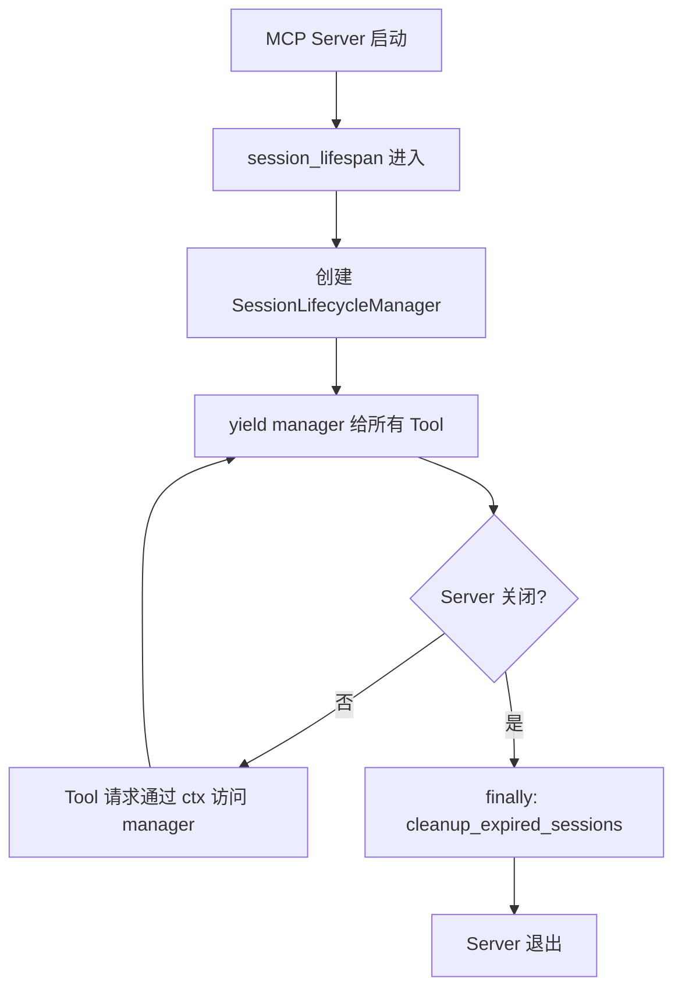
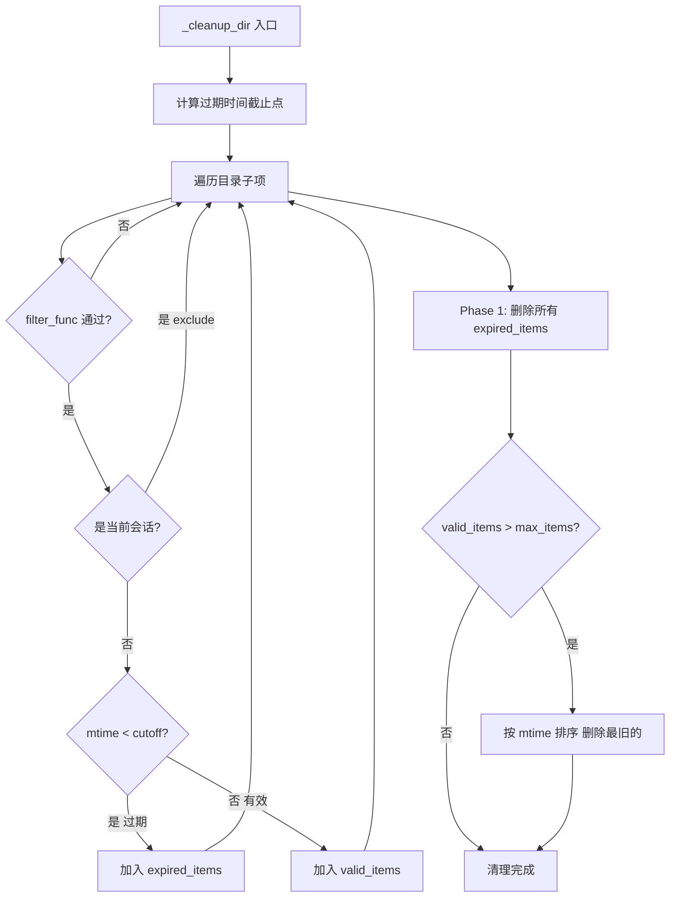
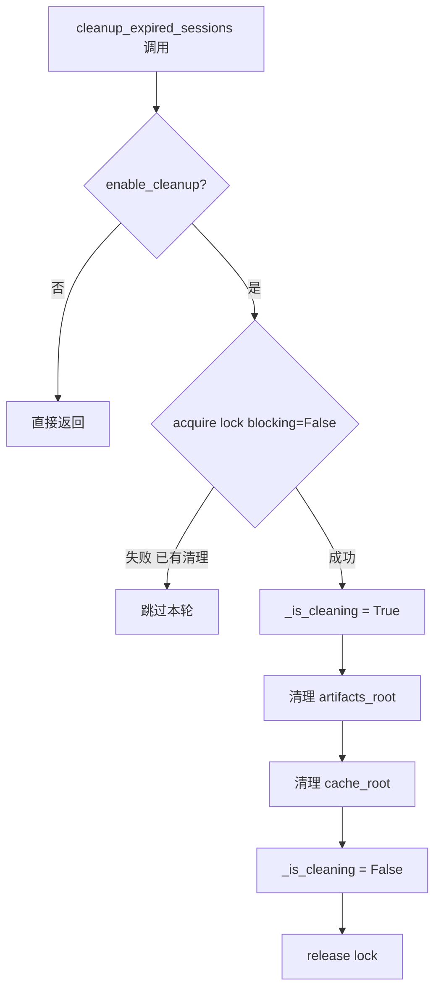

# PD-565.01 OpenStoryline — SessionLifecycleManager 双策略清理与 MCP Lifespan 集成

> 文档编号：PD-565.01
> 来源：OpenStoryline `src/open_storyline/storage/session_manager.py`
> GitHub：https://github.com/FireRedTeam/FireRed-OpenStoryline.git
> 问题域：PD-565 会话生命周期管理 Session Lifecycle Management
> 状态：可复用方案

---

## 第 1 章 问题与动机

### 1.1 核心问题

MCP Server 以 HTTP 方式对外提供工具调用服务时，每个客户端请求携带 `session_id`，服务端需要为每个会话维护独立的 artifacts（工件产物）和 cache（中间缓存）目录。随着会话数量增长，磁盘资源会被大量过期会话占满。核心挑战：

1. **资源泄漏**：会话结束后，其 artifacts 和 cache 目录不会自动清理，长期运行的服务器磁盘会被耗尽
2. **清理时机**：清理操作不能阻塞正在处理的请求，也不能误删正在使用的会话资源
3. **并发安全**：多个请求可能同时触发清理，需要避免重复清理或竞态条件
4. **会话识别**：清理时需要区分合法会话目录和其他文件，避免误删非会话数据

### 1.2 OpenStoryline 的解法概述

OpenStoryline 通过 `SessionLifecycleManager` 类实现了完整的会话生命周期管理：

1. **MCP Lifespan 集成**：利用 FastMCP 的 `lifespan` 异步上下文管理器，在服务启动时创建 Manager，关闭时执行最终清理（`server.py:22-36`）
2. **双策略清理**：先按保留天数删除过期会话，再按最大数量限制删除最旧的会话（`session_manager.py:60-113`）
3. **非阻塞锁**：使用 `threading.Lock` 的 `acquire(blocking=False)` 实现非阻塞清理，高频调用时自动跳过（`session_manager.py:125`）
4. **守护线程清理**：每次获取 ArtifactStore 时在守护线程中触发清理，不阻塞主请求（`session_manager.py:159-164`）
5. **UUID v4 验证**：通过 `_is_valid_session_id` 过滤非会话目录，仅清理合法会话（`session_manager.py:141-151`）

### 1.3 设计思想

| 设计原则 | 具体实现 | 理由 | 替代方案 |
|----------|----------|------|----------|
| 惰性清理 | 在 `get_artifact_store` 时触发清理，而非定时任务 | 无需额外调度器，请求驱动自然触发 | APScheduler 定时任务 |
| 双策略互补 | retention_days + max_items 两道防线 | 时间策略处理正常过期，数量策略防止突发流量 | 仅按时间或仅按数量 |
| 非阻塞锁 | `acquire(blocking=False)` 失败即跳过 | 高频请求不会排队等待清理完成 | 阻塞锁或 asyncio.Lock |
| 当前会话豁免 | `exclude_name` 参数保护正在使用的会话 | 防止清理掉正在执行任务的会话资源 | 引用计数 |
| 守护线程 | `daemon=True` 的清理线程 | 主进程退出时自动终止，不阻塞关闭 | asyncio.create_task |

---

## 第 2 章 源码实现分析

### 2.1 架构概览

OpenStoryline 的会话生命周期管理涉及 4 个核心文件，形成从 MCP Server 启动到工具调用的完整链路：

```
┌─────────────────────────────────────────────────────────────────┐
│                        MCP Server (server.py)                    │
│  ┌──────────────────────────────────────────────────────────┐   │
│  │  session_lifespan (asynccontextmanager)                   │   │
│  │  ┌────────────────────────────────────────────────────┐  │   │
│  │  │  SessionLifecycleManager                            │  │   │
│  │  │  ├─ artifacts_root: ./outputs                       │  │   │
│  │  │  ├─ cache_root: .storyline/.server_cache            │  │   │
│  │  │  ├─ max_items: 256                                  │  │   │
│  │  │  └─ retention_days: 3                               │  │   │
│  │  └────────────────────────────────────────────────────┘  │   │
│  │         │ yield                                           │   │
│  │         ▼                                                 │   │
│  │  lifespan_context ──→ 每个 MCP Tool 可通过 ctx 访问       │   │
│  └──────────────────────────────────────────────────────────┘   │
│                                                                  │
│  Tool Request ──→ register_tools.py:create_tool_wrapper          │
│       │              │ headers['X-Storyline-Session-Id']         │
│       │              │ ctx.request_context.lifespan_context      │
│       │              ▼                                           │
│       │     session_manager.get_artifact_store(session_id)       │
│       │              │                                           │
│       │              ├──→ [daemon thread] cleanup_expired()      │
│       │              └──→ ArtifactStore(root, session_id)        │
│       ▼                                                          │
│  BaseNode.__call__ ──→ load_inputs ──→ process ──→ pack_outputs │
└─────────────────────────────────────────────────────────────────┘
```

### 2.2 核心实现

#### 2.2.1 MCP Lifespan 集成



对应源码 `src/open_storyline/mcp/server.py:22-36`：

```python
@asynccontextmanager
async def session_lifespan(server: FastMCP) -> AsyncIterator[SessionLifecycleManager]:
    """Manage session lifecycle with type-safe context."""
    # Initialize on startup
    logger.info("Enable session lifespan manager")
    session_manager = SessionLifecycleManager(
        artifacts_root=cfg.project.outputs_dir,
        cache_root=cfg.local_mcp_server.server_cache_dir,
        enable_cleanup=True,
    )
    try:
        yield session_manager
    finally:
        # Cleanup on shutdown
        session_manager.cleanup_expired_sessions()
```

关键设计：`lifespan` 是 FastMCP 的标准扩展点，`yield` 的对象会成为每个请求的 `ctx.request_context.lifespan_context`，实现了 Manager 的全局单例共享。

#### 2.2.2 双策略清理核心算法



对应源码 `src/open_storyline/storage/session_manager.py:60-113`：

```python
def _cleanup_dir(self, target_dir: Path, exclude_name: str = None,
                 filter_func: Callable[[Path], bool] = None):
    """Cleanup strategy: remove expired items first, then enforce quantity limit"""
    if not target_dir.exists():
        return
    try:
        now = time.time()
        cutoff_time = now - (self.retention_days * 86400)
        valid_items = []
        expired_items = []

        for p in target_dir.iterdir():
            if filter_func and not filter_func(p):
                continue
            if exclude_name and p.name == exclude_name:
                continue
            mtime = p.stat().st_mtime
            if mtime < cutoff_time:
                expired_items.append(p)
            else:
                valid_items.append(p)

        # Phase 1: Delete all expired items
        for item in expired_items:
            logger.info(f"[Lifecycle] Deleting expired item (> {self.retention_days} days): {item.name}")
            self._safe_rmtree(item)

        # Phase 2: If remaining items still exceed max_items, delete the oldest
        if len(valid_items) > self.max_items:
            valid_items.sort(key=lambda x: x.stat().st_mtime)
            num_to_delete = len(valid_items) - self.max_items
            for item in valid_items[:num_to_delete]:
                self._safe_rmtree(item)
    except Exception as e:
        logger.error(f"[Lifecycle] Error cleaning {target_dir}: {e}")
```

#### 2.2.3 非阻塞并发清理



对应源码 `src/open_storyline/storage/session_manager.py:115-139`：

```python
def cleanup_expired_sessions(self, current_session_id: Optional[str] = None):
    if not self.enable_cleanup:
        return
    # Non-blocking: if cleanup in progress, skip this round
    if not self._cleanup_lock.acquire(blocking=False):
        return

    def artifact_filter(p: Path) -> bool:
        return p.is_dir() and self._is_valid_session_id(p.name)

    try:
        self._is_cleaning = True
        self._cleanup_dir(self.artifacts_root, exclude_name=current_session_id,
                          filter_func=artifact_filter)
        self._cleanup_dir(self.cache_root, exclude_name=current_session_id,
                          filter_func=artifact_filter)
    finally:
        self._is_cleaning = False
        self._cleanup_lock.release()
```

### 2.3 实现细节

**会话 ID 传递链路**：客户端通过 HTTP Header `X-Storyline-Session-Id` 传递会话 ID（`register_tools.py:32`），Tool Wrapper 从 `request.headers` 提取后传入 `NodeState`（`register_tools.py:45-52`），每个 BaseNode 通过 `node_state.session_id` 访问。

**ArtifactStore 的目录结构**（`agent_memory.py:24-29`）：

```
artifacts_root/
├── <session_id_1>/          # UUID v4 hex (32字符)
│   ├── meta.json            # 工件元数据索引
│   ├── split_shots/         # 按 node_id 分子目录
│   │   └── split_shots_1234.json
│   └── search_media/
│       └── search_media_5678.json
├── <session_id_2>/
│   └── ...
```

**安全删除**（`session_manager.py:44-58`）：`_safe_rmtree` 在遇到权限不足时尝试 `chmod` 后重试，对文件和目录分别处理（`unlink` vs `rmtree`）。

**UUID v4 验证**（`session_manager.py:141-151`）：先快速检查长度是否为 32（hex 格式无连字符），再用 `uuid.UUID` 解析并验证 `version == 4`，双重过滤避免误删非会话目录。


---

## 第 3 章 迁移指南

### 3.1 迁移清单

**阶段 1：基础会话管理（1 个文件）**

- [ ] 创建 `SessionLifecycleManager` 类，包含 `artifacts_root`、`cache_root`、`max_items`、`retention_days` 参数
- [ ] 实现 `_cleanup_dir` 双策略清理方法
- [ ] 实现 `_is_valid_session_id` UUID v4 验证
- [ ] 实现 `_safe_rmtree` 安全删除

**阶段 2：并发安全（同文件）**

- [ ] 添加 `threading.Lock` 非阻塞锁
- [ ] 实现 `cleanup_expired_sessions` 带锁清理入口
- [ ] 在 `get_artifact_store` 中启动守护线程触发清理

**阶段 3：框架集成**

- [ ] 将 Manager 集成到你的 Server lifespan（FastMCP / FastAPI / 其他框架）
- [ ] 在请求处理中通过 context 访问 Manager
- [ ] 配置 `enable_cleanup` 开关（开发环境可关闭）

### 3.2 适配代码模板

以下代码可直接复用，适配任何 Python Web 框架：

```python
import shutil
import stat
import os
import uuid
import time
import threading
from pathlib import Path
from typing import Callable, Optional


class SessionLifecycleManager:
    """
    会话生命周期管理器
    双策略清理：retention_days（时间过期） + max_items（数量上限）
    非阻塞锁：高频调用时自动跳过正在进行的清理
    """

    def __init__(
        self,
        artifacts_root: str | Path,
        cache_root: str | Path,
        max_items: int = 256,
        retention_days: int = 3,
        enable_cleanup: bool = False,
    ):
        self.artifacts_root = Path(artifacts_root)
        self.cache_root = Path(cache_root)
        self.max_items = max_items
        self.retention_days = retention_days
        self.enable_cleanup = enable_cleanup

        self.artifacts_root.mkdir(parents=True, exist_ok=True)
        self.cache_root.mkdir(parents=True, exist_ok=True)

        self._cleanup_lock = threading.Lock()
        self._is_cleaning = False

    @staticmethod
    def is_valid_session_id(name: str) -> bool:
        """验证是否为合法的 UUID v4 hex 字符串（32字符，无连字符）"""
        if len(name) != 32:
            return False
        try:
            val = uuid.UUID(name)
            return val.hex == name and val.version == 4
        except (ValueError, AttributeError):
            return False

    def _safe_rmtree(self, path: Path):
        def onerror(func, fpath, exc_info):
            if not os.access(fpath, os.W_OK):
                os.chmod(fpath, stat.S_IWUSR)
                func(fpath)
        if path.is_dir():
            shutil.rmtree(path, onerror=onerror)
        else:
            path.unlink(missing_ok=True)

    def _cleanup_dir(
        self,
        target_dir: Path,
        exclude_name: Optional[str] = None,
        filter_func: Optional[Callable[[Path], bool]] = None,
    ):
        if not target_dir.exists():
            return
        now = time.time()
        cutoff = now - (self.retention_days * 86400)
        valid, expired = [], []

        for p in target_dir.iterdir():
            if filter_func and not filter_func(p):
                continue
            if exclude_name and p.name == exclude_name:
                continue
            if p.stat().st_mtime < cutoff:
                expired.append(p)
            else:
                valid.append(p)

        for item in expired:
            self._safe_rmtree(item)

        if len(valid) > self.max_items:
            valid.sort(key=lambda x: x.stat().st_mtime)
            for item in valid[: len(valid) - self.max_items]:
                self._safe_rmtree(item)

    def cleanup_expired_sessions(self, current_session_id: Optional[str] = None):
        if not self.enable_cleanup:
            return
        if not self._cleanup_lock.acquire(blocking=False):
            return
        try:
            self._is_cleaning = True
            filt = lambda p: p.is_dir() and self.is_valid_session_id(p.name)
            self._cleanup_dir(self.artifacts_root, exclude_name=current_session_id, filter_func=filt)
            self._cleanup_dir(self.cache_root, exclude_name=current_session_id, filter_func=filt)
        finally:
            self._is_cleaning = False
            self._cleanup_lock.release()

    def get_session_dir(self, session_id: str) -> Path:
        """获取会话目录，触发后台清理"""
        if self.enable_cleanup:
            threading.Thread(
                target=self.cleanup_expired_sessions,
                args=(session_id,),
                daemon=True,
            ).start()
        session_dir = self.artifacts_root / session_id
        session_dir.mkdir(parents=True, exist_ok=True)
        return session_dir


# === FastAPI 集成示例 ===
# from contextlib import asynccontextmanager
# from fastapi import FastAPI, Request
#
# @asynccontextmanager
# async def lifespan(app: FastAPI):
#     manager = SessionLifecycleManager(
#         artifacts_root="./data/artifacts",
#         cache_root="./data/cache",
#         enable_cleanup=True,
#     )
#     app.state.session_manager = manager
#     yield
#     manager.cleanup_expired_sessions()
#
# app = FastAPI(lifespan=lifespan)
#
# @app.post("/api/process")
# async def process(request: Request):
#     session_id = request.headers["X-Session-Id"]
#     manager = request.app.state.session_manager
#     session_dir = manager.get_session_dir(session_id)
#     ...
```

### 3.3 适用场景

| 场景 | 适用度 | 说明 |
|------|--------|------|
| MCP Server 长期运行 | ⭐⭐⭐ | 核心场景，双策略防止磁盘耗尽 |
| 多租户 SaaS 后端 | ⭐⭐⭐ | 每个租户/会话独立目录，自动清理 |
| CI/CD 构建产物管理 | ⭐⭐ | 保留最近 N 次构建，按时间清理旧产物 |
| 单用户桌面应用 | ⭐ | 会话数少，简单定时清理即可 |
| 高并发短会话（>1000 QPS） | ⭐⭐ | 需要将清理改为异步批量，避免频繁 stat 调用 |

---

## 第 4 章 测试用例

```python
import uuid
import time
import threading
from pathlib import Path
from unittest.mock import patch

import pytest


class TestSessionLifecycleManager:
    """基于 session_manager.py 真实函数签名的测试"""

    @pytest.fixture
    def manager(self, tmp_path):
        from session_lifecycle import SessionLifecycleManager
        return SessionLifecycleManager(
            artifacts_root=tmp_path / "artifacts",
            cache_root=tmp_path / "cache",
            max_items=3,
            retention_days=1,
            enable_cleanup=True,
        )

    @pytest.fixture
    def make_session(self, manager):
        """创建一个合法的 UUID v4 会话目录"""
        def _make(root: Path, age_days: float = 0):
            sid = uuid.uuid4().hex  # 32字符 hex
            d = root / sid
            d.mkdir(parents=True)
            if age_days > 0:
                old_time = time.time() - age_days * 86400
                import os
                os.utime(d, (old_time, old_time))
            return sid
        return _make

    def test_uuid_v4_validation(self, manager):
        """测试 _is_valid_session_id：仅接受 UUID v4 hex"""
        valid = uuid.uuid4().hex
        assert manager.is_valid_session_id(valid) is True
        assert manager.is_valid_session_id("not-a-uuid-at-all") is False
        assert manager.is_valid_session_id("a" * 32) is False  # 不是合法 UUID v4

    def test_retention_days_cleanup(self, manager, make_session):
        """Phase 1：超过 retention_days 的会话被删除"""
        old_sid = make_session(manager.artifacts_root, age_days=2)
        new_sid = make_session(manager.artifacts_root, age_days=0)
        manager.cleanup_expired_sessions()
        assert not (manager.artifacts_root / old_sid).exists()
        assert (manager.artifacts_root / new_sid).exists()

    def test_max_items_cleanup(self, manager, make_session):
        """Phase 2：超过 max_items 时删除最旧的"""
        sids = [make_session(manager.artifacts_root, age_days=0) for _ in range(5)]
        # 让每个目录有不同的 mtime
        for i, sid in enumerate(sids):
            t = time.time() - (len(sids) - i) * 10
            import os
            os.utime(manager.artifacts_root / sid, (t, t))
        manager.cleanup_expired_sessions()
        remaining = list(manager.artifacts_root.iterdir())
        assert len(remaining) <= manager.max_items

    def test_exclude_current_session(self, manager, make_session):
        """当前会话即使过期也不被删除"""
        old_sid = make_session(manager.artifacts_root, age_days=5)
        manager.cleanup_expired_sessions(current_session_id=old_sid)
        assert (manager.artifacts_root / old_sid).exists()

    def test_nonblocking_lock(self, manager):
        """并发调用时，第二个调用应跳过而非阻塞"""
        manager._cleanup_lock.acquire()  # 模拟正在清理
        # 第二次调用应立即返回
        manager.cleanup_expired_sessions()  # 不应阻塞
        manager._cleanup_lock.release()

    def test_non_session_dirs_ignored(self, manager):
        """非 UUID 目录不会被清理"""
        (manager.artifacts_root / "config").mkdir()
        (manager.artifacts_root / "logs").mkdir()
        manager.cleanup_expired_sessions()
        assert (manager.artifacts_root / "config").exists()
        assert (manager.artifacts_root / "logs").exists()

    def test_daemon_thread_cleanup(self, manager, make_session):
        """get_session_dir 应在守护线程中触发清理"""
        sid = uuid.uuid4().hex
        with patch.object(manager, 'cleanup_expired_sessions') as mock_cleanup:
            manager.get_session_dir(sid)
            time.sleep(0.1)  # 等待守护线程启动
            mock_cleanup.assert_called_once_with(sid)
```

