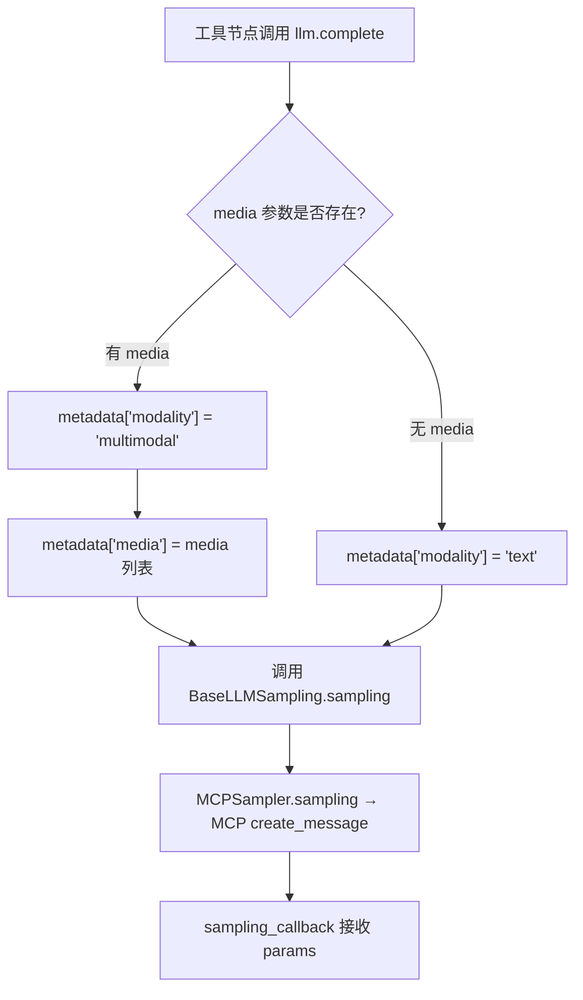
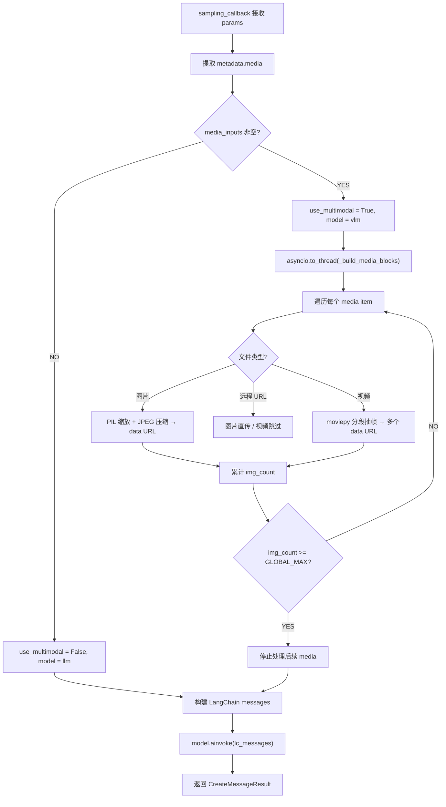

# PD-566.01 FireRed-OpenStoryline — MCP Sampling 双轨多模态路由与视频分段抽帧

> 文档编号：PD-566.01
> 来源：FireRed-OpenStoryline `src/open_storyline/mcp/sampling_handler.py`, `src/open_storyline/mcp/sampling_requester.py`
> GitHub：https://github.com/FireRedTeam/FireRed-OpenStoryline.git
> 问题域：PD-566 多模态路由 Multimodal Routing
> 状态：可复用方案

---

## 第 1 章 问题与动机

### 1.1 核心问题

在视频故事线生成系统中，工具节点（如"理解片段"、"生成脚本"）需要调用 LLM 完成推理。但不同节点的输入模态差异巨大：

- **纯文本节点**（如脚本生成、整体摘要）只需要文本 LLM，成本低、速度快
- **多模态节点**（如片段理解）需要传入视频帧或图片，必须使用 VLM（Vision Language Model），成本高、延迟大

如果所有请求都走 VLM，成本浪费严重；如果都走 LLM，多模态节点无法工作。系统需要一个**自动路由机制**，根据请求是否携带媒体内容，透明地选择正确的模型。

同时，视频输入不能直接传给 VLM——一段 30 秒的视频可能有 900 帧（30fps），全部传入会导致 token 溢出。系统需要**智能抽帧策略**，在保留关键信息的同时控制图片数量。

### 1.2 OpenStoryline 的解法概述

OpenStoryline 采用 MCP Sampling 协议实现了一套完整的多模态路由方案：

1. **双协议抽象**：`BaseLLMSampling`（低层 MCP 采样协议）+ `LLMClient`（高层业务协议），工具节点只依赖高层协议，不感知路由细节（`sampling_requester.py:12-44`）
2. **metadata 透传路由**：`SamplingLLMClient.complete()` 将 `media` 列表注入 `metadata["media"]`，同时设置 `metadata["modality"]` 标记，通过 MCP 采样请求透传到 Client 端（`sampling_requester.py:146-149`）
3. **Client 端模型选择**：`make_sampling_callback()` 在 Client 端根据 `metadata["media"]` 是否存在，自动选择 `llm` 或 `vlm`（`sampling_handler.py:346-349`）
4. **视频分段抽帧**：支持 `[in_sec, out_sec]` 时间窗口采样，按 `frames_per_sec` 计算帧数，在 bucket 中心点采样避免边界帧（`sampling_handler.py:90-142`）
5. **全局图片数量硬限制**：`GLOBAL_MAX_IMAGE_BLOCKS = 48`，跨所有媒体项累计计数，超限即停止处理（`sampling_handler.py:24`）

### 1.3 设计思想

| 设计原则 | 具体实现 | 理由 | 替代方案 |
|----------|----------|------|----------|
| Server/Client 职责分离 | Server 只传路径和时间戳，Client 负责 base64 转换和模型调用 | Server 端（MCP Tool）无需依赖 PIL/moviepy，保持轻量 | Server 端直接编码（增加 MCP Server 依赖） |
| 隐式路由 | 工具节点只调 `llm.complete(media=...)`，路由在 callback 中自动完成 | 工具开发者无需关心 LLM/VLM 选择，降低心智负担 | 显式传 `model_type` 参数（侵入业务代码） |
| 可配置抽帧参数 | `resize_edge`/`jpeg_quality`/`min_frames`/`max_frames` 全部可配 | 不同 VLM 对图片尺寸和数量的容忍度不同 | 硬编码参数（无法适配不同模型） |
| 全局图片上限 | `GLOBAL_MAX_IMAGE_BLOCKS` 跨所有媒体项累计 | 防止多视频场景下 payload 爆炸 | 按单视频限制（多视频仍可能溢出） |
| 线程卸载 | `asyncio.to_thread(_build_media_blocks, ...)` | PIL/moviepy 是 CPU 密集型同步操作，不能阻塞事件循环 | 直接在 async 函数中调用（阻塞事件循环） |

---

## 第 2 章 源码实现分析

### 2.1 架构概览

OpenStoryline 的多模态路由架构分为三层：MCP Server 端的工具节点、MCP 采样协议层、Client 端的模型调度层。

```
┌─────────────────────────────────────────────────────────────────┐
│                     MCP Server (Tool Nodes)                     │
│                                                                 │
│  ┌──────────────┐  ┌──────────────┐  ┌──────────────────────┐  │
│  │ UnderstandClips│  │GenerateScript│  │  其他 Node ...       │  │
│  │ media=[video] │  │ media=None   │  │                      │  │
│  └──────┬───────┘  └──────┬───────┘  └──────────┬───────────┘  │
│         │                 │                      │              │
│         └────────┬────────┴──────────────────────┘              │
│                  ▼                                               │
│  ┌──────────────────────────────────────────────────────────┐   │
│  │ SamplingLLMClient.complete(media=...)                     │   │
│  │   → metadata["modality"] = "multimodal" | "text"          │   │
│  │   → metadata["media"] = [paths + timestamps]              │   │
│  └──────────────────────────┬───────────────────────────────┘   │
│                             │ MCP create_message()              │
│                             ▼                                   │
├─────────────────────────────────────────────────────────────────┤
│                     MCP Client (Agent)                          │
│  ┌──────────────────────────────────────────────────────────┐   │
│  │ sampling_callback(params)                                 │   │
│  │   ├─ metadata["media"] 存在?                              │   │
│  │   │   ├─ YES → _build_media_blocks() → VLM.ainvoke()     │   │
│  │   │   └─ NO  → LLM.ainvoke()                             │   │
│  │   └─ 返回 CreateMessageResult                             │   │
│  └──────────────────────────────────────────────────────────┘   │
│                                                                 │
│  ┌────────────┐    ┌────────────┐                               │
│  │ ChatOpenAI  │    │ ChatOpenAI  │                              │
│  │ (LLM)      │    │ (VLM)      │                               │
│  └────────────┘    └────────────┘                               │
└─────────────────────────────────────────────────────────────────┘
```

关键数据流：工具节点调用 `llm.complete()` → `SamplingLLMClient` 将 media 注入 metadata → MCP `create_message` 透传到 Client → `sampling_callback` 读取 metadata 决定路由 → 构建多模态 content blocks → 调用对应模型。

### 2.2 核心实现

#### 2.2.1 双协议抽象与 metadata 透传



对应源码 `src/open_storyline/mcp/sampling_requester.py:118-160`：

```python
class SamplingLLMClient(LLMClient):
    """
    Only differentiate based on presence of media input.
    Server passes media paths and timestamps to Client, Client handles base64 conversion.
    """

    def __init__(self, sampler: BaseLLMSampling):
        self._sampler = sampler

    async def complete(self,
        *,
        system_prompt: str | None,
        user_prompt: str,
        media: list[dict[str, Any]] | None = None,
        temperature: float = 0.3,
        top_p: float = 0.9,
        max_tokens: int = 2048,
        model_preferences: dict[str, Any] | None = None,
        metadata: dict[str, Any] | None = None,
        stop_sequences: list[str] | None = None
    )-> str:
        messages = [
            SamplingMessage(
                role="user",
                content=TextContent(type="text", text=user_prompt),
            )
        ]

        merged_metadata = dict(metadata or {})
        merged_metadata["modality"] = "multimodal" if media else "text"
        if media:
            merged_metadata["media"] = media  # Critical: Pass media paths and timestamps through transparently

        return await self._sampler.sampling(
            system_prompt=system_prompt,
            messages=messages,
            temperature=temperature,
            top_p=top_p,
            max_tokens=max_tokens,
            model_preferences=model_preferences,
            metadata=merged_metadata,
            stop_sequences=stop_sequences,
        )
```

核心设计：`SamplingLLMClient` 不做任何模型选择，只负责将 `media` 参数"打包"进 `metadata`，通过 MCP 采样协议透传。模型选择的决策权完全在 Client 端的 `sampling_callback` 中。

#### 2.2.2 Client 端路由与视频抽帧



对应源码 `src/open_storyline/mcp/sampling_handler.py:308-432`：

```python
def make_sampling_callback(
    llm,
    vlm,
    *,
    resize_edge: int = DEFAULT_RESIZE_EDGE,
    jpeg_quality: int = DEFAULT_JPEG_QUALITY,
    min_frames: int = DEFAULT_MIN_FRAMES,
    max_frames: int = DEFAULT_MAX_FRAMES,
    frames_per_sec: float = DEFAULT_FRAMES_PER_SEC,
    global_max_images: int = GLOBAL_MAX_IMAGE_BLOCKS,
):
    async def sampling_callback(context, params: CreateMessageRequestParams) -> CreateMessageResult:
        try:
            # ...
            media_inputs = list(metadata.get("media", []) or [])
            # 4. Route to appropriate model
            use_multimodal = bool(media_inputs)
            model = vlm if use_multimodal else llm
            if model is None:
                model = vlm or llm

            # 5. Build media blocks - run in thread to avoid blocking event loop
            media_blocks: List[Dict[str, Any]] = []
            if use_multimodal:
                media_blocks = await asyncio.to_thread(
                    _build_media_blocks,
                    media_inputs,
                    resize_edge, jpeg_quality,
                    min_frames, max_frames, frames_per_sec,
                    global_max_images,
                )
            # ...
            bound = model
            try:
                bound = bound.bind(temperature=temperature, max_tokens=max_tokens, top_p=top_p)
            except Exception:
                bound = bound.bind(temperature=temperature, max_tokens=max_tokens)
            # ...
    return sampling_callback
```

### 2.3 实现细节

#### 视频分段抽帧算法

视频抽帧的核心在 `_sample_video_segment_to_data_urls`（`sampling_handler.py:90-142`）。算法要点：

1. **时间窗口裁剪**：`in_sec` 和 `out_sec` 被 clamp 到 `[0, video_duration]` 范围
2. **帧数计算**：`n = ceil(segment_duration * frames_per_sec)`，再 clamp 到 `[min_frames, max_frames]`
3. **Bucket 中心采样**：`times = [((i + 0.5) / n) * seg_dur for i in range(n)]`，在每个时间桶的中心点采样，避免取到片段边界的过渡帧
4. **降级处理**：视频时长为 0 或 `out_sec <= in_sec` 时，退化为单帧采样

#### 三格式媒体输入归一化

`_normalize_media_items`（`sampling_handler.py:169-204`）支持三种输入格式：
- 字符串：`"path/to/video.mp4"`
- 元组：`("path/to/video.mp4", 1.2, 3.4)`
- 字典：`{"url": "...", "in_sec": 1.2, "out_sec": 3.4}`

统一归一化为 `{"url": "...", "in_sec": optional, "out_sec": optional}`，让下游处理逻辑只需面对一种格式。

#### 图片压缩策略

`_pil_to_data_url`（`sampling_handler.py:68-74`）：
- 统一转 RGB（去除 alpha 通道）
- 按长边缩放到 `resize_edge`（默认 600px），保持宽高比
- JPEG 压缩，quality=80，开启 optimize
- 输出 base64 data URL


---

## 第 3 章 迁移指南

### 3.1 迁移清单

**阶段 1：定义双协议接口**

- [ ] 定义低层采样协议（类似 `BaseLLMSampling`），封装底层模型调用
- [ ] 定义高层业务协议（类似 `LLMClient`），暴露 `complete(media=...)` 接口
- [ ] 实现 metadata 透传机制，将 media 信息注入 metadata

**阶段 2：实现 Client 端路由**

- [ ] 实现 `sampling_callback`，根据 metadata 中的 media 字段选择模型
- [ ] 配置 LLM 和 VLM 两个模型实例（可使用 ChatOpenAI 或其他 LangChain 兼容模型）
- [ ] 实现 `_build_media_blocks`，将媒体路径转为 OpenAI 兼容的 content blocks

**阶段 3：实现媒体预处理**

- [ ] 安装依赖：`pip install Pillow moviepy`
- [ ] 实现图片缩放压缩（长边缩放 + JPEG 压缩）
- [ ] 实现视频分段抽帧（时间窗口 + bucket 中心采样）
- [ ] 实现全局图片数量限制

**阶段 4：集成到工具节点**

- [ ] 在工具节点中通过 `make_llm(ctx)` 获取 LLMClient 实例
- [ ] 调用 `llm.complete(media=[...])` 传入媒体，路由自动完成

### 3.2 适配代码模板

以下是一个可独立运行的多模态路由实现，不依赖 MCP 协议：

```python
"""
多模态路由器 — 从 OpenStoryline 提取的可复用模板
依赖: pip install Pillow moviepy langchain-openai
"""
import asyncio
import math
import base64
import os
from io import BytesIO
from typing import Any, Protocol

from PIL import Image
from moviepy.video.io.VideoFileClip import VideoFileClip
from langchain_openai import ChatOpenAI
from langchain_core.messages import SystemMessage, HumanMessage

# ---- 配置 ----
RESIZE_EDGE = 600
JPEG_QUALITY = 80
MAX_FRAMES_PER_VIDEO = 6
FRAMES_PER_SEC = 3.0
GLOBAL_MAX_IMAGES = 48

IMAGE_EXTS = {".jpg", ".jpeg", ".png", ".webp", ".bmp", ".gif"}
VIDEO_EXTS = {".mp4", ".mov", ".mkv", ".avi", ".webm"}


class MultimodalRouter:
    """根据 media 参数自动路由到 LLM 或 VLM"""

    def __init__(self, llm: ChatOpenAI, vlm: ChatOpenAI):
        self.llm = llm
        self.vlm = vlm

    async def complete(
        self,
        *,
        system_prompt: str | None = None,
        user_prompt: str,
        media: list[dict[str, Any]] | None = None,
        temperature: float = 0.3,
        max_tokens: int = 2048,
    ) -> str:
        use_vlm = bool(media)
        model = self.vlm if use_vlm else self.llm

        messages = []
        if system_prompt:
            messages.append(SystemMessage(content=system_prompt))

        if use_vlm and media:
            # 在线程中构建媒体块（CPU 密集型）
            blocks = await asyncio.to_thread(self._build_media_blocks, media)
            content = [{"type": "text", "text": user_prompt}] + blocks
            messages.append(HumanMessage(content=content))
        else:
            messages.append(HumanMessage(content=user_prompt))

        bound = model.bind(temperature=temperature, max_tokens=max_tokens)
        resp = await bound.ainvoke(messages)
        return resp.content if isinstance(resp.content, str) else str(resp.content)

    def _build_media_blocks(self, media: list[dict[str, Any]]) -> list[dict]:
        blocks = []
        img_count = 0
        for item in media:
            if img_count >= GLOBAL_MAX_IMAGES:
                break
            path = item.get("url") or item.get("path", "")
            ext = os.path.splitext(path)[1].lower()

            if ext in IMAGE_EXTS:
                data_url = self._image_to_data_url(path)
                blocks.append({"type": "image_url", "image_url": {"url": data_url}})
                img_count += 1

            elif ext in VIDEO_EXTS:
                in_sec = item.get("in_sec", 0.0)
                out_sec = item.get("out_sec", 1e12)
                frames = self._sample_video(path, in_sec, out_sec)
                for _, data_url in frames:
                    if img_count >= GLOBAL_MAX_IMAGES:
                        break
                    blocks.append({"type": "image_url", "image_url": {"url": data_url}})
                    img_count += 1
        return blocks

    @staticmethod
    def _image_to_data_url(path: str) -> str:
        img = Image.open(path).convert("RGB")
        w, h = img.size
        if max(w, h) > RESIZE_EDGE:
            scale = RESIZE_EDGE / max(w, h)
            img = img.resize((int(w * scale), int(h * scale)), Image.LANCZOS)
        buf = BytesIO()
        img.save(buf, format="JPEG", quality=JPEG_QUALITY, optimize=True)
        return f"data:image/jpeg;base64,{base64.b64encode(buf.getvalue()).decode()}"

    @staticmethod
    def _sample_video(path: str, in_sec: float, out_sec: float) -> list[tuple[float, str]]:
        clip = VideoFileClip(path, audio=False)
        try:
            dur = float(clip.duration or 0)
            in_sec = max(0, min(in_sec, dur))
            out_sec = max(0, min(out_sec, dur))
            if out_sec <= in_sec:
                out_sec = in_sec + 0.1
            seg = out_sec - in_sec
            n = min(MAX_FRAMES_PER_VIDEO, max(2, int(math.ceil(seg * FRAMES_PER_SEC))))
            results = []
            for i in range(n):
                t = in_sec + ((i + 0.5) / n) * seg
                frame = clip.get_frame(t)
                img = Image.fromarray(frame).convert("RGB")
                # 复用图片压缩逻辑
                w, h = img.size
                if max(w, h) > RESIZE_EDGE:
                    scale = RESIZE_EDGE / max(w, h)
                    img = img.resize((int(w * scale), int(h * scale)), Image.LANCZOS)
                buf = BytesIO()
                img.save(buf, format="JPEG", quality=JPEG_QUALITY, optimize=True)
                data_url = f"data:image/jpeg;base64,{base64.b64encode(buf.getvalue()).decode()}"
                results.append((t - in_sec, data_url))
            return results
        finally:
            clip.close()


# ---- 使用示例 ----
async def main():
    llm = ChatOpenAI(model="gpt-4o-mini", api_key="...", base_url="...")
    vlm = ChatOpenAI(model="gpt-4o", api_key="...", base_url="...")
    router = MultimodalRouter(llm, vlm)

    # 纯文本 → 自动走 LLM
    text_result = await router.complete(user_prompt="总结这段脚本的主题")

    # 带视频片段 → 自动走 VLM
    vlm_result = await router.complete(
        user_prompt="描述这个视频片段的内容",
        media=[{"path": "/data/clip.mp4", "in_sec": 2.0, "out_sec": 5.0}],
    )
```

### 3.3 适用场景

| 场景 | 适用度 | 说明 |
|------|--------|------|
| 视频理解/分析系统 | ⭐⭐⭐ | 核心场景，视频抽帧 + VLM 路由完美匹配 |
| 多模态 RAG 系统 | ⭐⭐⭐ | 文档中混合图片和文本，按需路由到 VLM |
| MCP 工具服务器 | ⭐⭐⭐ | 直接复用 MCP Sampling 协议的路由模式 |
| 纯文本 Agent 系统 | ⭐ | 无多模态需求，不需要路由 |
| 实时视频流处理 | ⭐⭐ | 抽帧策略适用，但需要额外的流式接入层 |

---

## 第 4 章 测试用例

```python
import pytest
import math
import os
from unittest.mock import AsyncMock, MagicMock, patch
from typing import Any, Dict, List


class TestChooseNumFrames:
    """测试帧数计算逻辑 — 对应 sampling_handler.py:82-87"""

    def test_normal_duration(self):
        """3 秒视频，3fps → ceil(9) = 9，clamp 到 max_frames=6"""
        from open_storyline.mcp.sampling_handler import _choose_num_frames
        assert _choose_num_frames(3.0, min_frames=2, max_frames=6, frames_per_sec=3.0) == 6

    def test_short_duration(self):
        """0.3 秒视频 → ceil(0.9) = 1，clamp 到 min_frames=2"""
        from open_storyline.mcp.sampling_handler import _choose_num_frames
        assert _choose_num_frames(0.3, min_frames=2, max_frames=6, frames_per_sec=3.0) == 2

    def test_zero_duration(self):
        """0 秒视频 → ceil(0) = 0，clamp 到 min_frames=2"""
        from open_storyline.mcp.sampling_handler import _choose_num_frames
        assert _choose_num_frames(0.0, min_frames=2, max_frames=6, frames_per_sec=3.0) == 2

    def test_negative_duration(self):
        """负数时长 → max(0, -1) = 0 → min_frames"""
        from open_storyline.mcp.sampling_handler import _choose_num_frames
        assert _choose_num_frames(-1.0, min_frames=2, max_frames=6, frames_per_sec=3.0) == 2


class TestNormalizeMediaItems:
    """测试三格式媒体输入归一化 — 对应 sampling_handler.py:169-204"""

    def test_string_input(self):
        from open_storyline.mcp.sampling_handler import _normalize_media_items
        result = _normalize_media_items(["video.mp4"])
        assert result == [{"url": "video.mp4"}]

    def test_tuple_input(self):
        from open_storyline.mcp.sampling_handler import _normalize_media_items
        result = _normalize_media_items([("video.mp4", 1.0, 3.0)])
        assert result == [{"url": "video.mp4", "in_sec": 1.0, "out_sec": 3.0}]

    def test_dict_input_with_path_key(self):
        from open_storyline.mcp.sampling_handler import _normalize_media_items
        result = _normalize_media_items([{"path": "img.jpg"}])
        assert result == [{"url": "img.jpg"}]

    def test_empty_input(self):
        from open_storyline.mcp.sampling_handler import _normalize_media_items
        assert _normalize_media_items([]) == []
        assert _normalize_media_items(None) == []


class TestSamplingLLMClientRouting:
    """测试 metadata 路由标记 — 对应 sampling_requester.py:146-149"""

    @pytest.mark.asyncio
    async def test_text_modality_when_no_media(self):
        mock_sampler = AsyncMock()
        mock_sampler.sampling.return_value = "text response"

        from open_storyline.mcp.sampling_requester import SamplingLLMClient
        client = SamplingLLMClient(mock_sampler)
        await client.complete(system_prompt=None, user_prompt="hello", media=None)

        call_kwargs = mock_sampler.sampling.call_args[1]
        assert call_kwargs["metadata"]["modality"] == "text"
        assert "media" not in call_kwargs["metadata"]

    @pytest.mark.asyncio
    async def test_multimodal_modality_when_media_present(self):
        mock_sampler = AsyncMock()
        mock_sampler.sampling.return_value = "vlm response"

        from open_storyline.mcp.sampling_requester import SamplingLLMClient
        client = SamplingLLMClient(mock_sampler)
        media = [{"path": "test.jpg"}]
        await client.complete(system_prompt=None, user_prompt="describe", media=media)

        call_kwargs = mock_sampler.sampling.call_args[1]
        assert call_kwargs["metadata"]["modality"] == "multimodal"
        assert call_kwargs["metadata"]["media"] == media


class TestGlobalImageLimit:
    """测试全局图片数量限制 — 对应 sampling_handler.py:227-228"""

    def test_respects_global_limit(self):
        from open_storyline.mcp.sampling_handler import _build_media_blocks
        # 创建 60 个图片输入，限制为 48
        media = [{"url": f"data:image/jpeg;base64,{i}"} for i in range(60)]
        blocks = _build_media_blocks(
            media, resize_edge=600, jpeg_quality=80,
            min_frames=2, max_frames=6, frames_per_sec=3.0,
            global_max_images=48,
        )
        image_blocks = [b for b in blocks if b.get("type") == "image_url"]
        assert len(image_blocks) == 48
```

