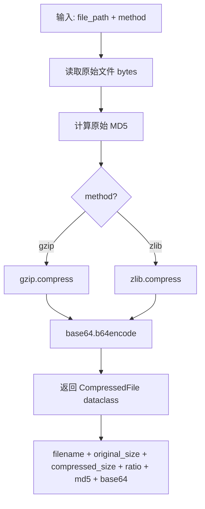
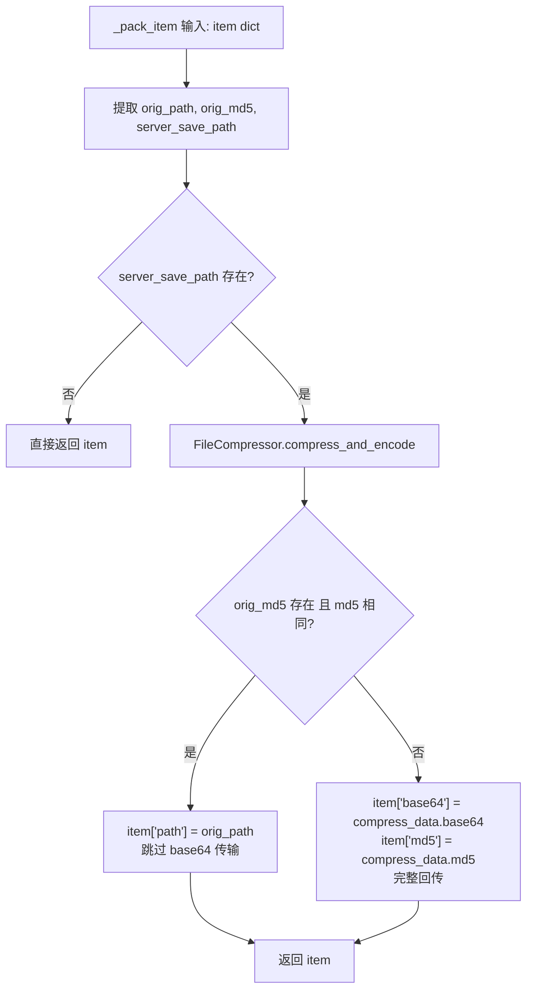

# PD-567.01 FireRed-OpenStoryline — FileCompressor 三层压缩传输与 MD5 差量回传

> 文档编号：PD-567.01
> 来源：FireRed-OpenStoryline `src/open_storyline/storage/file.py` `src/open_storyline/nodes/core_nodes/base_node.py`
> GitHub：https://github.com/FireRedTeam/FireRed-OpenStoryline.git
> 问题域：PD-567 数据压缩传输 Data Compression & Transfer
> 状态：可复用方案

---

## 第 1 章 问题与动机

### 1.1 核心问题

在 Client-Server 架构的 AI 工作流系统中，媒体文件（视频、图片、音频）需要在客户端和服务端之间频繁传输。直接传输原始二进制文件面临三个核心挑战：

1. **带宽浪费** — 媒体文件体积大，未压缩传输占用大量网络带宽
2. **数据完整性** — 网络传输过程中可能出现数据损坏，缺乏校验机制会导致下游节点处理错误数据
3. **重复传输** — 工作流中多个节点可能不修改某些媒体文件，但每次回传都重新编码传输，造成不必要的开销

OpenStoryline 是一个基于 MCP 协议的视频故事线生成系统，其工作流包含 `load_media → split_shots → generate_voiceover` 等多个节点，每个节点都可能接收和输出媒体文件。这使得高效的媒体传输机制成为系统性能的关键瓶颈。

### 1.2 FireRed-OpenStoryline 的解法概述

OpenStoryline 设计了一套三层压缩传输架构：

1. **FileCompressor 工具层** (`storage/file.py:23-145`) — 提供 gzip/zlib 双算法压缩 + base64 编码 + MD5 校验的原子操作
2. **BaseNode load/pack 协议层** (`nodes/core_nodes/base_node.py:73-103`) — 在节点基类中内置 `_load_item`（解压存储）和 `_pack_item`（压缩回传）方法，自动处理媒体文件的编解码
3. **ToolInterceptor 拦截器层** (`mcp/hooks/node_interceptors.py:22-38`) — 在 MCP 工具调用前后自动注入压缩/解压逻辑，节点实现者无需关心传输细节

核心创新点是 `_pack_item` 中的 **MD5 差量回传**：通过比对处理前后文件的 MD5 值，未修改的文件只回传原始路径而非重新编码，显著减少回传数据量。

### 1.3 设计思想

| 设计原则 | 具体实现 | 理由 | 替代方案 |
|----------|----------|------|----------|
| 传输层透明 | BaseNode 基类统一处理编解码，子类无感知 | 避免每个节点重复实现压缩逻辑 | 每个节点自行处理（代码重复） |
| 双算法可选 | gzip（默认）和 zlib 两种压缩方式 | gzip 通用性好，zlib 速度快，按场景选择 | 仅支持单一算法 |
| MD5 差量回传 | 比对 orig_md5 与当前 md5，相同则跳过 base64 | 视频处理流水线中大量文件未被修改 | 每次都重新压缩传输 |
| base64 文本化 | 压缩后 base64 编码为 UTF-8 字符串 | JSON payload 无法直接携带二进制数据 | multipart/form-data 二进制传输 |
| 完整性校验前置 | 解压后立即校验 MD5，不匹配直接抛异常 | 防止损坏数据进入下游处理节点 | 延迟校验或不校验 |

---

## 第 2 章 源码实现分析

### 2.1 架构概览

OpenStoryline 的数据压缩传输架构分为三层，贯穿整个 MCP 工具调用生命周期：

```
┌─────────────────────────────────────────────────────────────────┐
│                        Client (MCP Client)                       │
│  媒体文件 → FileCompressor.compress_and_encode() → base64 payload │
└──────────────────────────┬──────────────────────────────────────┘
                           │ JSON { base64, md5, path }
                           ▼
┌─────────────────────────────────────────────────────────────────┐
│              ToolInterceptor.inject_media_content_before          │
│  从 ArtifactStore 加载前序节点输出 → compress_payload_to_base64   │
└──────────────────────────┬──────────────────────────────────────┘
                           │
                           ▼
┌─────────────────────────────────────────────────────────────────┐
│                    BaseNode.__call__()                            │
│  load_inputs_from_client() ──→ _load_item() 解压存储到 server_cache│
│         │                                                        │
│         ▼                                                        │
│  process() ──→ 节点业务逻辑（操作本地文件）                         │
│         │                                                        │
│         ▼                                                        │
│  pack_outputs_to_client() ──→ _pack_item() MD5 比对 + 条件压缩    │
└──────────────────────────┬──────────────────────────────────────┘
                           │
                           ▼
┌─────────────────────────────────────────────────────────────────┐
│              ToolInterceptor.save_media_content_after             │
│  ArtifactStore.save_result() → _save_media() 解压持久化           │
└──────────────────────────┬──────────────────────────────────────┘
                           │ JSON { path | base64+md5 }
                           ▼
┌─────────────────────────────────────────────────────────────────┐
│                        Client (MCP Client)                       │
│  收到 base64 → FileCompressor.decode_and_decompress() → 本地文件  │
└─────────────────────────────────────────────────────────────────┘
```

### 2.2 核心实现

#### 2.2.1 FileCompressor — 压缩编码原子操作



对应源码 `src/open_storyline/storage/file.py:12-76`：

```python
@dataclass
class CompressedFile:
    """Data class for compressed file information"""
    filename: str
    original_size: int
    compressed_size: int
    compression_ratio: str
    method: str
    md5: str
    base64: str

class FileCompressor:
    @staticmethod
    def compress_and_encode(
        file_path: Union[str, Path], 
        method: str = 'gzip'
    ) -> CompressedFile:
        file_path = Path(file_path)
        if not file_path.exists():
            raise FileNotFoundError(f"File not found: {file_path}")
        
        with open(file_path, 'rb') as f:
            original_data = f.read()
        
        original_md5 = hashlib.md5(original_data).hexdigest()
        original_size = len(original_data)
        
        if method == 'gzip':
            compressed_data = gzip.compress(original_data)
        elif method == 'zlib':
            compressed_data = zlib.compress(original_data)
        else:
            raise ValueError(f"Unsupported compression method: {method}")
        
        encoded_data = base64.b64encode(compressed_data).decode('utf-8')
        
        return CompressedFile(
            filename=file_path.name,
            original_size=original_size,
            compressed_size=len(compressed_data),
            compression_ratio=f"{(1 - len(compressed_data)/original_size)*100:.2f}%",
            method=method,
            md5=original_md5,
            base64=encoded_data
        )
```

#### 2.2.2 BaseNode._pack_item — MD5 差量回传核心逻辑



对应源码 `src/open_storyline/nodes/core_nodes/base_node.py:89-103`：

```python
def _pack_item(self, node_state: NodeState, item: Dict[str,Any]):
    orig_path = item.pop('orig_path', None)
    orig_md5 = item.pop('orig_md5', None)
    server_save_path = item.pop('path', None)
    if server_save_path:
        compress_data = FileCompressor.compress_and_encode(server_save_path)
        if orig_path and orig_md5 and compress_data.md5 == orig_md5:
            # 文件未修改，只回传原始路径
            node_state.node_summary.debug_for_dev(
                f"[node] node_id: {self.meta.node_id} change `path` change to {orig_path}"
            )
            item['path'] = orig_path
        elif orig_md5 is None or compress_data.md5 != orig_md5:
            # 文件已修改或首次传输，完整回传 base64
            node_state.node_summary.debug_for_dev(
                f"[node] node_id: {self.meta.node_id} return `base64` to client"
            )
            item['base64'] = compress_data.base64
            item['path'] = compress_data.filename
            item['md5'] = compress_data.md5
    return item
```

### 2.3 实现细节

#### 递归 payload 处理

`load_inputs_from_client` 和 `pack_outputs_to_client` 都支持递归处理嵌套数据结构（`base_node.py:106-157`）。对于 list 类型的 payload，逐项调用 `_load_item`；对于 dict 类型，递归处理子结构。这使得任意深度嵌套的媒体数据都能被正确处理。

#### ToolInterceptor 的 compress_payload_to_base64

在 `node_interceptors.py:22-38`，`compress_payload_to_base64` 函数在拦截器层将 ArtifactStore 中存储的本地文件路径重新压缩为 base64，用于跨节点数据传递：

```python
def compress_payload_to_base64(payload: Dict[str,List[Any]]):
    if not isinstance(payload, dict):
        return payload
    for key, value in payload.items():
        if isinstance(value, list) and all(isinstance(item, dict) for item in value):
            for item in value:
                if 'path' in item.keys():
                    path = item['path']
                    compress_data = FileCompressor.compress_and_encode(path)
                    item.update({
                        "path": path,
                        "base64": compress_data.base64,
                        "md5": compress_data.md5
                    })
        elif isinstance(value, dict):
            compress_payload_to_base64(value)
```

#### ArtifactStore 的解压持久化

`agent_memory.py:53-63` 中 `_save_single_media` 在保存节点输出时，自动将 base64 数据解压为本地文件：

```python
def _save_single_media(self, item: dict, store_dir: Path, artifact_id: str) -> None:
    base64_data = item.pop('base64', None)
    if not base64_data:
        return
    file_path = store_dir / item.get('path', '')
    FileCompressor.decompress_from_string(base64_data, file_path)
    item['path'] = str(file_path)
```

#### 解压时的 MD5 校验

`file.py:79-96` 中 `decode_and_decompress` 在解压后立即校验 MD5，确保数据完整性：

```python
decoded_md5 = hashlib.md5(original_data).hexdigest()
if decoded_md5 != encoded_file.md5:
    raise ValueError("MD5 checksum verification failed — the file may be corrupted.")
```


---

## 第 3 章 迁移指南

### 3.1 迁移清单

**阶段 1：基础压缩工具（1 个文件）**
- [ ] 移植 `FileCompressor` 类和 `CompressedFile` dataclass
- [ ] 确保目标项目有 `gzip`、`zlib`、`base64`、`hashlib` 依赖（均为 Python 标准库）

**阶段 2：节点基类集成（修改 1 个文件）**
- [ ] 在节点基类中添加 `_load_item` 和 `_pack_item` 方法
- [ ] 在 `__call__` 入口添加 `load_inputs_from_client` 和 `pack_outputs_to_client` 调用
- [ ] 定义 `server_cache_dir` 配置项，用于存储解压后的临时文件

**阶段 3：拦截器层（可选）**
- [ ] 如果使用 MCP 协议，添加 `compress_payload_to_base64` 拦截器
- [ ] 如果使用 ArtifactStore，添加 `_save_single_media` 解压持久化逻辑

### 3.2 适配代码模板

以下是一个可直接复用的最小化实现：

```python
"""file_transfer.py — 可移植的压缩传输工具"""
import gzip
import zlib
import base64
import hashlib
import json
from pathlib import Path
from dataclasses import dataclass, asdict
from typing import Union, Optional, Dict, Any, List

@dataclass
class CompressedFile:
    filename: str
    original_size: int
    compressed_size: int
    compression_ratio: str
    method: str
    md5: str
    base64: str

class FileTransfer:
    """文件压缩传输工具 — 从 OpenStoryline FileCompressor 移植"""
    
    @staticmethod
    def compress(file_path: Union[str, Path], method: str = 'gzip') -> CompressedFile:
        path = Path(file_path)
        data = path.read_bytes()
        md5 = hashlib.md5(data).hexdigest()
        
        compressed = gzip.compress(data) if method == 'gzip' else zlib.compress(data)
        encoded = base64.b64encode(compressed).decode('utf-8')
        
        return CompressedFile(
            filename=path.name,
            original_size=len(data),
            compressed_size=len(compressed),
            compression_ratio=f"{(1 - len(compressed)/len(data))*100:.2f}%",
            method=method,
            md5=md5,
            base64=encoded,
        )
    
    @staticmethod
    def decompress(encoded: str, output_path: Union[str, Path], method: str = 'gzip') -> bytes:
        compressed = base64.b64decode(encoded)
        data = gzip.decompress(compressed) if method == 'gzip' else zlib.decompress(compressed)
        
        out = Path(output_path)
        out.parent.mkdir(parents=True, exist_ok=True)
        out.write_bytes(data)
        return data
    
    @staticmethod
    def decompress_with_verify(cf: CompressedFile, output_path: Optional[Path] = None) -> bytes:
        """解压并校验 MD5"""
        compressed = base64.b64decode(cf.base64)
        data = gzip.decompress(compressed) if cf.method == 'gzip' else zlib.decompress(compressed)
        
        if hashlib.md5(data).hexdigest() != cf.md5:
            raise ValueError("MD5 checksum mismatch — data corrupted")
        
        if output_path:
            output_path.parent.mkdir(parents=True, exist_ok=True)
            output_path.write_bytes(data)
        return data


class DeltaTransferMixin:
    """MD5 差量回传 Mixin — 混入节点基类使用"""
    
    def load_item(self, item: Dict[str, Any], cache_dir: Path, session_id: str) -> Dict[str, Any]:
        """从客户端 payload 解压文件到服务端缓存"""
        new_item = {k: v for k, v in item.items() if k not in ('base64', 'md5', 'path')}
        
        item_base64 = item.get('base64')
        item_path = item.get('path')
        item_md5 = item.get('md5')
        
        if item_base64 and item_path:
            save_path = cache_dir / session_id / Path(item_path).name
            FileTransfer.decompress(item_base64, save_path)
            new_item['path'] = str(save_path)
            new_item['orig_path'] = item_path
            new_item['orig_md5'] = item_md5
        return new_item
    
    def pack_item(self, item: Dict[str, Any]) -> Dict[str, Any]:
        """MD5 差量回传：未修改文件只回传路径"""
        orig_path = item.pop('orig_path', None)
        orig_md5 = item.pop('orig_md5', None)
        server_path = item.pop('path', None)
        
        if not server_path:
            return item
        
        cf = FileTransfer.compress(server_path)
        if orig_path and orig_md5 and cf.md5 == orig_md5:
            # 文件未修改 — 跳过 base64，只回传原始路径
            item['path'] = orig_path
        else:
            # 文件已修改 — 完整回传
            item['base64'] = cf.base64
            item['path'] = cf.filename
            item['md5'] = cf.md5
        return item
```

### 3.3 适用场景

| 场景 | 适用度 | 说明 |
|------|--------|------|
| MCP 工具调用传输媒体文件 | ⭐⭐⭐ | 完美匹配，JSON payload 需要 base64 编码 |
| Client-Server 工作流系统 | ⭐⭐⭐ | 多节点流水线中 MD5 差量回传收益显著 |
| REST API 文件上传 | ⭐⭐ | 可用但 multipart 上传可能更高效 |
| 纯本地文件处理 | ⭐ | 无需压缩传输，直接操作文件路径即可 |
| 大文件（>100MB）传输 | ⭐ | base64 膨胀 33%，大文件建议分块或流式传输 |

---

## 第 4 章 测试用例

```python
import pytest
import gzip
import hashlib
import tempfile
from pathlib import Path
from unittest.mock import MagicMock

# 假设已移植 FileTransfer 和 DeltaTransferMixin
from file_transfer import FileTransfer, CompressedFile, DeltaTransferMixin


class TestFileTransferCompress:
    """测试压缩编码功能"""
    
    def test_compress_gzip_roundtrip(self, tmp_path):
        """正常路径：gzip 压缩 → base64 编码 → 解压还原"""
        test_file = tmp_path / "test.txt"
        test_file.write_text("Hello, OpenStoryline!" * 100)
        
        cf = FileTransfer.compress(test_file, method='gzip')
        
        assert cf.filename == "test.txt"
        assert cf.method == "gzip"
        assert cf.compressed_size < cf.original_size
        assert cf.md5 == hashlib.md5(test_file.read_bytes()).hexdigest()
        
        # 解压还原
        output = tmp_path / "restored.txt"
        data = FileTransfer.decompress(cf.base64, output, method='gzip')
        assert output.read_bytes() == test_file.read_bytes()
    
    def test_compress_zlib_roundtrip(self, tmp_path):
        """zlib 压缩 → 解压还原"""
        test_file = tmp_path / "test.bin"
        test_file.write_bytes(b"\x00\xff" * 500)
        
        cf = FileTransfer.compress(test_file, method='zlib')
        assert cf.method == "zlib"
        
        output = tmp_path / "restored.bin"
        FileTransfer.decompress(cf.base64, output, method='zlib')
        assert output.read_bytes() == test_file.read_bytes()
    
    def test_compress_file_not_found(self):
        """边界：文件不存在"""
        with pytest.raises(FileNotFoundError):
            FileTransfer.compress("/nonexistent/file.txt")
    
    def test_md5_verification_failure(self, tmp_path):
        """边界：MD5 校验失败"""
        test_file = tmp_path / "test.txt"
        test_file.write_text("original content")
        
        cf = FileTransfer.compress(test_file)
        # 篡改 MD5
        cf_tampered = CompressedFile(
            filename=cf.filename,
            original_size=cf.original_size,
            compressed_size=cf.compressed_size,
            compression_ratio=cf.compression_ratio,
            method=cf.method,
            md5="0000000000000000000000000000dead",
            base64=cf.base64,
        )
        with pytest.raises(ValueError, match="MD5 checksum mismatch"):
            FileTransfer.decompress_with_verify(cf_tampered)


class TestDeltaTransfer:
    """测试 MD5 差量回传"""
    
    def test_pack_unchanged_file_skips_base64(self, tmp_path):
        """未修改文件：只回传路径，不含 base64"""
        test_file = tmp_path / "video.mp4"
        test_file.write_bytes(b"\x00\x01\x02" * 100)
        orig_md5 = hashlib.md5(test_file.read_bytes()).hexdigest()
        
        mixin = DeltaTransferMixin()
        item = {
            'path': str(test_file),
            'orig_path': '/client/video.mp4',
            'orig_md5': orig_md5,
        }
        result = mixin.pack_item(item)
        
        assert result['path'] == '/client/video.mp4'
        assert 'base64' not in result
        assert 'md5' not in result
    
    def test_pack_modified_file_returns_base64(self, tmp_path):
        """已修改文件：完整回传 base64 + md5"""
        test_file = tmp_path / "video.mp4"
        test_file.write_bytes(b"\x00\x01\x02" * 100)
        
        mixin = DeltaTransferMixin()
        item = {
            'path': str(test_file),
            'orig_path': '/client/video.mp4',
            'orig_md5': 'different_md5_value',
        }
        result = mixin.pack_item(item)
        
        assert 'base64' in result
        assert 'md5' in result
        assert result['md5'] != 'different_md5_value'
    
    def test_pack_new_file_without_orig_md5(self, tmp_path):
        """新文件（无 orig_md5）：完整回传"""
        test_file = tmp_path / "new_audio.wav"
        test_file.write_bytes(b"\xff\xfe" * 50)
        
        mixin = DeltaTransferMixin()
        item = {'path': str(test_file)}
        result = mixin.pack_item(item)
        
        assert 'base64' in result
        assert 'md5' in result
```


---

## 第 5 章 跨域关联

| 关联域 | 关系类型 | 说明 |
|--------|----------|------|
| PD-06 记忆持久化 | 协同 | ArtifactStore 在持久化节点输出时调用 FileCompressor 解压媒体文件，压缩传输与持久化存储紧密耦合 |
| PD-10 中间件管道 | 协同 | ToolInterceptor 作为 MCP 拦截器，在工具调用前后自动注入 compress_payload_to_base64 和 save_media_content_after，压缩传输逻辑通过中间件管道实现 |
| PD-04 工具系统 | 依赖 | BaseNode 是 MCP 工具的基类，load/pack 方法嵌入工具调用生命周期，压缩传输依赖工具系统的 __call__ 入口 |
| PD-03 容错与重试 | 协同 | MD5 校验失败时抛出 ValueError，上层容错机制可捕获并触发重传 |

---

## 第 6 章 来源文件索引

| 文件 | 行范围 | 关键实现 |
|------|--------|----------|
| `src/open_storyline/storage/file.py` | L12-L22 | CompressedFile dataclass 定义 |
| `src/open_storyline/storage/file.py` | L23-L76 | FileCompressor.compress_and_encode — 压缩 + base64 编码 |
| `src/open_storyline/storage/file.py` | L78-L104 | FileCompressor.decode_and_decompress — 解压 + MD5 校验 |
| `src/open_storyline/storage/file.py` | L124-L145 | FileCompressor.decompress_from_string — 从 base64 字符串直接解压 |
| `src/open_storyline/nodes/core_nodes/base_node.py` | L73-L87 | BaseNode._load_item — 解压存储到 server_cache |
| `src/open_storyline/nodes/core_nodes/base_node.py` | L89-L103 | BaseNode._pack_item — MD5 差量回传核心逻辑 |
| `src/open_storyline/nodes/core_nodes/base_node.py` | L106-L138 | BaseNode.load_inputs_from_client — 递归处理客户端 payload |
| `src/open_storyline/nodes/core_nodes/base_node.py` | L141-L157 | BaseNode.pack_outputs_to_client — 递归打包输出 |
| `src/open_storyline/nodes/core_nodes/base_node.py` | L206-L245 | BaseNode.__call__ — 完整调用链：load → process → pack |
| `src/open_storyline/mcp/hooks/node_interceptors.py` | L22-L38 | compress_payload_to_base64 — 拦截器层压缩函数 |
| `src/open_storyline/mcp/hooks/node_interceptors.py` | L70-L84 | ToolInterceptor.inject_media_content_before — load_media 入口压缩 |
| `src/open_storyline/storage/agent_memory.py` | L53-L63 | ArtifactStore._save_single_media — 解压持久化 |

---

## 第 7 章 横向对比维度

```json comparison_data
{
  "project": "FireRed-OpenStoryline",
  "dimensions": {
    "压缩算法": "gzip/zlib 双算法可选，默认 gzip",
    "编码方式": "base64 文本化嵌入 JSON payload",
    "完整性校验": "MD5 哈希，解压后立即校验",
    "差量传输": "_pack_item MD5 比对，未修改文件跳过 base64",
    "集成层级": "三层架构：FileCompressor 工具层 + BaseNode 协议层 + ToolInterceptor 拦截器层",
    "递归处理": "load/pack 支持任意深度嵌套 dict/list payload"
  }
}
```

### 域元数据补充

```json domain_metadata
{
  "solution_summary": "OpenStoryline 通过 FileCompressor 工具层 + BaseNode load/pack 协议层 + ToolInterceptor 拦截器层实现三层透明压缩传输，_pack_item 中 MD5 差量比对跳过未修改文件回传",
  "description": "Client-Server 工作流中媒体文件的透明压缩编码与差量回传机制",
  "sub_problems": [
    "递归嵌套 payload 的深层媒体文件发现与处理",
    "拦截器层自动注入压缩逻辑实现节点透明传输"
  ],
  "best_practices": [
    "在节点基类统一处理编解码，子类节点无需感知传输细节",
    "用 dataclass 封装压缩元数据（文件名、大小、压缩率、MD5、base64）实现自描述传输包"
  ]
}
```
