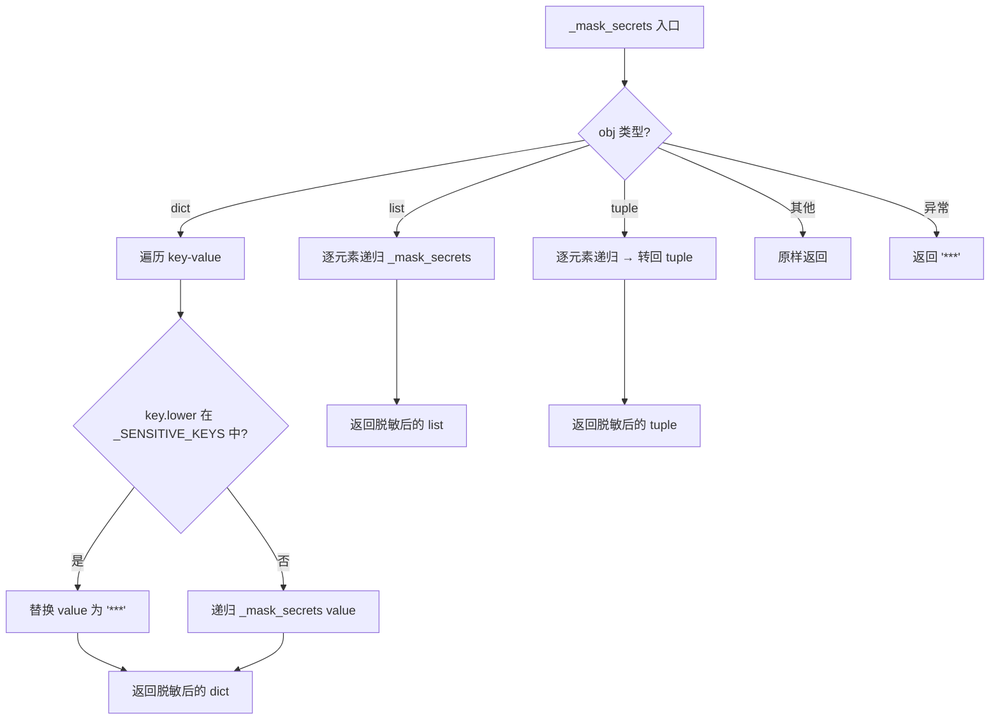
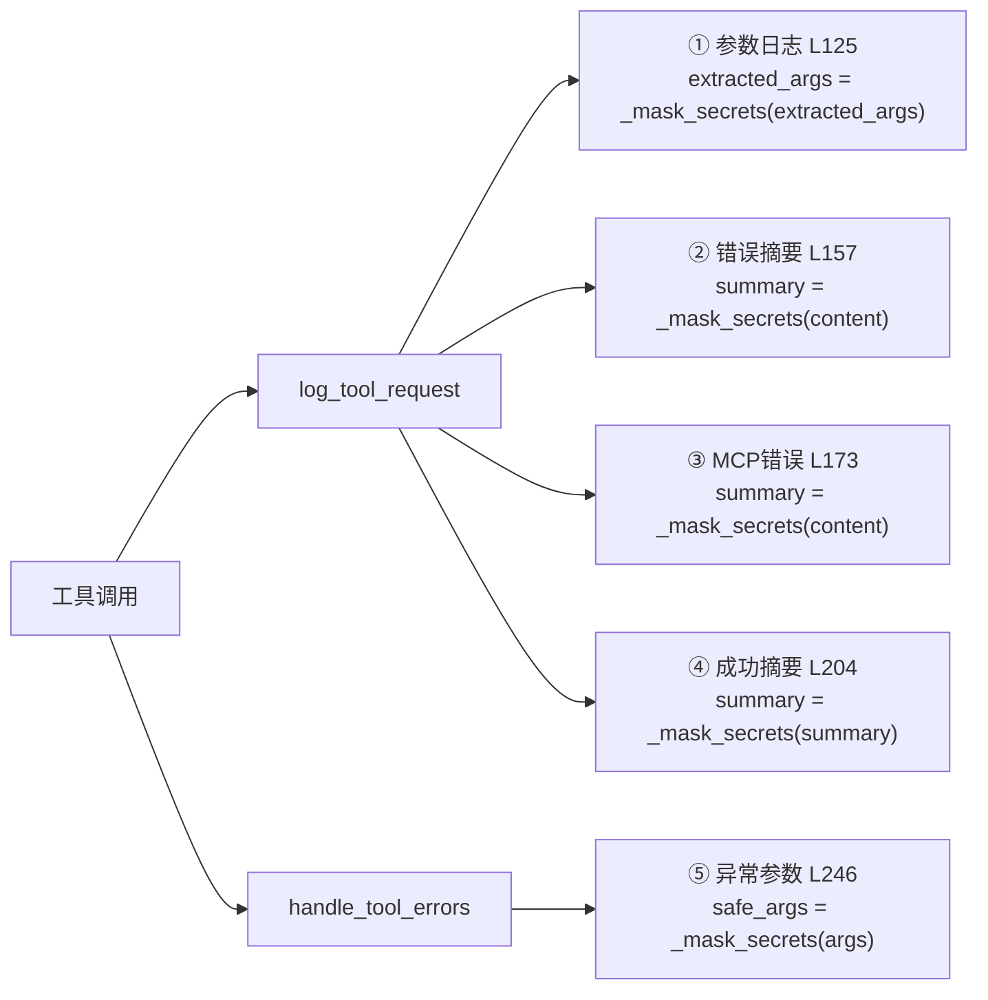

# PD-568.01 OpenStoryline — 递归脱敏中间件与多路径密钥遮蔽

> 文档编号：PD-568.01
> 来源：OpenStoryline `src/open_storyline/mcp/hooks/chat_middleware.py`
> GitHub：https://github.com/FireRedTeam/FireRed-OpenStoryline.git
> 问题域：PD-568 敏感信息脱敏 Sensitive Data Masking
> 状态：可复用方案

---

## 第 1 章 问题与动机

### 1.1 核心问题

Agent 系统在运行时会通过多条路径输出信息：控制台 print、GUI 日志 sink、ToolMessage 返回给 LLM、错误堆栈中的参数回显。这些路径中任何一条泄露了 `api_key`、`token`、`password` 等敏感字段，都可能导致密钥暴露。

传统做法是在每个输出点手动过滤，但 Agent 系统的输出路径多且分散（工具调用前日志、工具调用后日志、错误回传、成功摘要），逐点处理容易遗漏。需要一个集中式、递归式的脱敏机制，在中间件层统一拦截所有输出。

### 1.2 OpenStoryline 的解法概述

1. **集中定义敏感字段集合** — 在 `chat_middleware.py:20-29` 定义 `_SENSITIVE_KEYS` 常量集合，包含 9 个常见敏感字段名（api_key、access_token、authorization、token、password、secret、x-api-key、apikey），所有脱敏逻辑共享同一份定义
2. **递归遍历任意嵌套结构** — `_mask_secrets()` 函数（`chat_middleware.py:45-65`）递归处理 dict/list/tuple 三种容器类型，对匹配的 key 统一替换为 `"***"`
3. **大小写归一化匹配** — 通过 `str(k).lower() in _SENSITIVE_KEYS` 实现大小写不敏感匹配（`chat_middleware.py:54`），避免 `API_KEY`、`Api_Key` 等变体逃逸
4. **异常兜底全遮蔽** — 递归过程中任何异常直接返回 `"***"`（`chat_middleware.py:64-65`），宁可过度遮蔽也不泄露
5. **五路径全覆盖** — 在工具调用参数日志（L125）、工具错误摘要（L157）、MCP 错误内容（L173）、工具成功摘要（L204）、异常回传参数（L246）五个输出点调用 `_mask_secrets()`

### 1.3 设计思想

| 设计原则 | 具体实现 | 理由 | 替代方案 |
|----------|----------|------|----------|
| 集中定义，单点维护 | `_SENSITIVE_KEYS` 模块级常量集合 | 新增敏感字段只需改一处 | 每个调用点各自维护正则（分散易遗漏） |
| 递归深度无限制 | dict/list/tuple 三类型递归 | Agent 工具参数可能深度嵌套 | 只处理顶层 key（遗漏嵌套敏感值） |
| 大小写归一化 | `str(k).lower()` 统一转小写 | HTTP header 大小写不固定 | 精确匹配（漏掉 `API_KEY` 等变体） |
| 异常安全兜底 | except 返回 `"***"` | 脱敏失败不能变成泄露 | 抛出异常（中断正常流程） |
| 中间件层统一拦截 | `@wrap_tool_call` 装饰器 | 所有工具调用必经此路径 | 在每个工具内部各自脱敏（重复且易漏） |

---

## 第 2 章 源码实现分析

### 2.1 架构概览

OpenStoryline 的脱敏机制嵌入在 LangChain Agent 的中间件管道中。`agent.py:122` 注册了两个中间件 `[log_tool_request, handle_tool_errors]`，所有工具调用都经过这两层拦截器，脱敏函数 `_mask_secrets` 在两层中均被调用。

```
┌─────────────────────────────────────────────────────────┐
│                    Agent Runtime                         │
│  create_agent(middleware=[log_tool_request,              │
│                           handle_tool_errors])           │
└──────────────┬──────────────────────────┬───────────────┘
               │                          │
               ▼                          ▼
┌──────────────────────┐   ┌──────────────────────────────┐
│   log_tool_request   │   │     handle_tool_errors       │
│  @wrap_tool_call     │   │     @wrap_tool_call          │
│                      │   │                              │
│ ① 提取工具参数       │   │ ④ 捕获工具异常               │
│ ② _mask_secrets()    │   │ ⑤ _mask_secrets(args)        │
│ ③ print + emit_event │   │ ⑥ 构造安全 ToolMessage       │
│ ④ 调用后再脱敏摘要   │   │                              │
└──────────────────────┘   └──────────────────────────────┘
               │                          │
               ▼                          ▼
┌─────────────────────────────────────────────────────────┐
│              _mask_secrets(obj) 递归脱敏引擎             │
│                                                         │
│  _SENSITIVE_KEYS = {api_key, access_token, token, ...}  │
│                                                         │
│  dict → 逐 key 检查 → 匹配则替换 "***"                  │
│  list → 逐元素递归                                       │
│  tuple → 逐元素递归                                      │
│  其他 → 原样返回                                         │
│  异常 → 返回 "***"                                       │
└─────────────────────────────────────────────────────────┘
```

### 2.2 核心实现

#### 2.2.1 敏感字段集合与递归脱敏引擎



对应源码 `src/open_storyline/mcp/hooks/chat_middleware.py:20-65`：

```python
_SENSITIVE_KEYS = {
    "api_key",
    "access_token",
    "authorization",
    "token",
    "password",
    "secret",
    "x-api-key",
    "apikey",
}

def _mask_secrets(obj: Any) -> Any:
    """
    Recursive desensitization: Prevent keys/tokens from being printed to various places such as 
    the console, logs, tool traces, toolmessages, etc
    """
    try:
        if isinstance(obj, dict):
            out = {}
            for k, v in obj.items():
                if str(k).lower() in _SENSITIVE_KEYS:
                    out[k] = "***"
                else:
                    out[k] = _mask_secrets(v)
            return out
        if isinstance(obj, list):
            return [_mask_secrets(x) for x in obj]
        if isinstance(obj, tuple):
            return tuple(_mask_secrets(x) for x in obj)
        return obj
    except Exception:
        return "***"
```

#### 2.2.2 五路径脱敏调用点



对应源码 `src/open_storyline/mcp/hooks/chat_middleware.py:94-268`：

```python
@wrap_tool_call
async def log_tool_request(request, handler):
    # ...
    extracted_args = _mask_secrets(extracted_args)          # ① L125: 工具参数日志脱敏
    # ...
    try:
        out = await handler(request)
        if additional_kwargs.get("isError") is True:
            summary = _mask_secrets(getattr(out, "content", str(out)))  # ② L157: 错误摘要脱敏
        else:
            if is_mcp_tool:
                if isError:
                    summary = _mask_secrets(out.content)    # ③ L173: MCP错误内容脱敏
    finally:
        pass
    # 结束日志
    if not isError:
        emit_event({
            "summary": _mask_secrets(summary),              # ④ L204: 成功摘要脱敏
        })
    return out

@wrap_tool_call
async def handle_tool_errors(request, handler):
    try:
        return await handler(request)
    except Exception as e:
        safe_args = _mask_secrets(tc.get("args") or {})     # ⑤ L246: 异常参数脱敏
        return ToolMessage(
            content=f"Tool params: {safe_args}\n...",
            additional_kwargs={"safe_args": safe_args},
        )
```

### 2.3 实现细节

**中间件注册链路**：`agent.py:119-122` 中 `create_agent` 接收 `middleware=[log_tool_request, handle_tool_errors]`，LangChain 的 `@wrap_tool_call` 装饰器将这两个函数注册为工具调用拦截器，形成洋葱模型——`log_tool_request` 在外层负责日志，`handle_tool_errors` 在内层负责异常捕获。

**ContextVar 日志通道**：`chat_middleware.py:32-33` 使用 `contextvars.ContextVar` 定义 `_MCP_LOG_SINK` 和 `_MCP_ACTIVE_TOOL_CALL_ID`，确保在异步并发场景下每个请求的日志 sink 和 tool_call_id 互不干扰。脱敏后的数据通过 `emit_event()` 推送到 GUI 日志面板。

**配置中的敏感字段传递**：`config.py:96-98` 中 `LLMConfig` 和 `VLMConfig` 都包含 `api_key` 字段，`agent.py:54-64` 在构建 ChatOpenAI 时直接使用这些值。`_mask_secrets` 不干预配置加载过程，只在输出路径上拦截——这是正确的设计，因为运行时需要真实密钥，只有输出时才需要遮蔽。


---

## 第 3 章 迁移指南

### 3.1 迁移清单

**阶段 1：核心脱敏引擎（30 分钟）**
- [ ] 创建 `sensitive_masking.py` 模块
- [ ] 定义 `_SENSITIVE_KEYS` 集合（根据项目需求扩展）
- [ ] 实现 `mask_secrets()` 递归函数，支持 dict/list/tuple
- [ ] 添加异常兜底逻辑

**阶段 2：中间件集成（1 小时）**
- [ ] 在工具调用中间件的参数日志处调用 `mask_secrets()`
- [ ] 在错误回传路径调用 `mask_secrets()`
- [ ] 在成功摘要输出处调用 `mask_secrets()`
- [ ] 确认所有 `print()` / `logger.info()` 输出工具参数的地方都经过脱敏

**阶段 3：验证与扩展**
- [ ] 编写测试覆盖嵌套结构、大小写变体、异常场景
- [ ] 如需支持正则匹配值（如 `sk-xxx` 格式的 API key），扩展值级脱敏

### 3.2 适配代码模板

以下代码可直接复用，不依赖 OpenStoryline 的任何模块：

```python
"""sensitive_masking.py — 通用递归脱敏模块"""
from typing import Any, Set

# 可根据项目需求扩展
SENSITIVE_KEYS: Set[str] = {
    "api_key", "access_token", "authorization", "token",
    "password", "secret", "x-api-key", "apikey",
    "private_key", "client_secret", "refresh_token",
}

MASK_PLACEHOLDER = "***"


def mask_secrets(obj: Any, *, sensitive_keys: Set[str] | None = None) -> Any:
    """
    递归遍历 dict/list/tuple，将敏感 key 的值替换为 MASK_PLACEHOLDER。
    
    Args:
        obj: 任意嵌套的数据结构
        sensitive_keys: 自定义敏感字段集合（默认使用 SENSITIVE_KEYS）
    
    Returns:
        脱敏后的数据结构（新对象，不修改原数据）
    """
    keys = sensitive_keys or SENSITIVE_KEYS
    try:
        if isinstance(obj, dict):
            return {
                k: MASK_PLACEHOLDER if str(k).lower() in keys else mask_secrets(v, sensitive_keys=keys)
                for k, v in obj.items()
            }
        if isinstance(obj, list):
            return [mask_secrets(x, sensitive_keys=keys) for x in obj]
        if isinstance(obj, tuple):
            return tuple(mask_secrets(x, sensitive_keys=keys) for x in obj)
        return obj
    except Exception:
        return MASK_PLACEHOLDER


def mask_secrets_in_str(text: str, *, patterns: list[str] | None = None) -> str:
    """
    值级脱敏：对字符串中匹配特定模式的值进行遮蔽。
    适用于日志中直接打印了 "Bearer sk-xxx..." 等场景。
    """
    import re
    default_patterns = [
        r'(sk-[a-zA-Z0-9]{20,})',           # OpenAI key
        r'(Bearer\s+[a-zA-Z0-9\-_.]+)',     # Bearer token
        r'(ghp_[a-zA-Z0-9]{36})',           # GitHub PAT
    ]
    for pat in (patterns or default_patterns):
        text = re.sub(pat, MASK_PLACEHOLDER, text)
    return text
```

**LangChain 中间件集成示例：**

```python
from langchain.agents.middleware import wrap_tool_call
from sensitive_masking import mask_secrets

@wrap_tool_call
async def secure_tool_logger(request, handler):
    """工具调用日志中间件 — 自动脱敏参数和输出"""
    safe_args = mask_secrets(request.tool_call.get("args", {}))
    print(f"[Tool] {request.tool_call.get('name')} args={safe_args}")
    
    try:
        result = await handler(request)
        return result
    except Exception as e:
        safe_args = mask_secrets(request.tool_call.get("args", {}))
        # 错误回传中也使用脱敏后的参数
        raise
```

### 3.3 适用场景

| 场景 | 适用度 | 说明 |
|------|--------|------|
| LangChain/LangGraph Agent 系统 | ⭐⭐⭐ | 直接复用 `@wrap_tool_call` 中间件模式 |
| MCP Server 工具调用链 | ⭐⭐⭐ | 工具参数和返回值都可能含密钥 |
| 通用 Python 日志系统 | ⭐⭐⭐ | `mask_secrets()` 函数无框架依赖 |
| 前端展示 Agent 运行日志 | ⭐⭐⭐ | 防止密钥通过 SSE/WebSocket 推送到浏览器 |
| 值级脱敏（如 Bearer token） | ⭐⭐ | 需额外使用 `mask_secrets_in_str()` 正则匹配 |
| 数据库存储脱敏 | ⭐ | 需要在写入层额外集成，本方案聚焦输出层 |

---

## 第 4 章 测试用例

```python
"""test_sensitive_masking.py — 基于 OpenStoryline _mask_secrets 签名的测试"""
import pytest
from typing import Any

# 复用 OpenStoryline 的实现签名
_SENSITIVE_KEYS = {
    "api_key", "access_token", "authorization", "token",
    "password", "secret", "x-api-key", "apikey",
}

def _mask_secrets(obj: Any) -> Any:
    try:
        if isinstance(obj, dict):
            out = {}
            for k, v in obj.items():
                if str(k).lower() in _SENSITIVE_KEYS:
                    out[k] = "***"
                else:
                    out[k] = _mask_secrets(v)
            return out
        if isinstance(obj, list):
            return [_mask_secrets(x) for x in obj]
        if isinstance(obj, tuple):
            return tuple(_mask_secrets(x) for x in obj)
        return obj
    except Exception:
        return "***"


class TestMaskSecrets:
    """正常路径测试"""

    def test_flat_dict_masks_sensitive_keys(self):
        data = {"api_key": "sk-12345", "model": "gpt-4", "token": "abc"}
        result = _mask_secrets(data)
        assert result == {"api_key": "***", "model": "gpt-4", "token": "***"}

    def test_nested_dict_recursive_masking(self):
        data = {"config": {"llm": {"api_key": "secret123", "model": "claude"}}}
        result = _mask_secrets(data)
        assert result["config"]["llm"]["api_key"] == "***"
        assert result["config"]["llm"]["model"] == "claude"

    def test_list_of_dicts(self):
        data = [{"api_key": "k1"}, {"name": "test"}, {"password": "p1"}]
        result = _mask_secrets(data)
        assert result[0]["api_key"] == "***"
        assert result[1]["name"] == "test"
        assert result[2]["password"] == "***"

    def test_tuple_support(self):
        data = ({"token": "t1"}, {"value": 42})
        result = _mask_secrets(data)
        assert isinstance(result, tuple)
        assert result[0]["token"] == "***"
        assert result[1]["value"] == 42

    def test_case_insensitive_matching(self):
        data = {"API_KEY": "k1", "Token": "t1", "Authorization": "Bearer xxx"}
        result = _mask_secrets(data)
        assert result["API_KEY"] == "***"
        assert result["Token"] == "***"
        assert result["Authorization"] == "***"


class TestMaskSecretsEdgeCases:
    """边界情况测试"""

    def test_empty_dict(self):
        assert _mask_secrets({}) == {}

    def test_empty_list(self):
        assert _mask_secrets([]) == []

    def test_primitive_passthrough(self):
        assert _mask_secrets("hello") == "hello"
        assert _mask_secrets(42) == 42
        assert _mask_secrets(None) is None

    def test_deeply_nested(self):
        data = {"a": {"b": {"c": {"d": {"api_key": "deep"}}}}}
        result = _mask_secrets(data)
        assert result["a"]["b"]["c"]["d"]["api_key"] == "***"

    def test_mixed_containers(self):
        data = {"items": [{"token": "t"}, ({"secret": "s"},)]}
        result = _mask_secrets(data)
        assert result["items"][0]["token"] == "***"
        assert result["items"][1][0]["secret"] == "***"


class TestMaskSecretsDegradation:
    """降级行为测试"""

    def test_non_string_key_handled(self):
        """非字符串 key 不应导致崩溃"""
        data = {123: "value", "api_key": "secret"}
        result = _mask_secrets(data)
        assert result[123] == "value"
        assert result["api_key"] == "***"

    def test_exception_returns_mask(self):
        """异常情况返回 *** 而非抛出"""
        class BadObj:
            def __iter__(self):
                raise RuntimeError("boom")
        # _mask_secrets 对无法处理的类型应原样返回
        result = _mask_secrets(BadObj())
        assert isinstance(result, BadObj) or result == "***"
```

