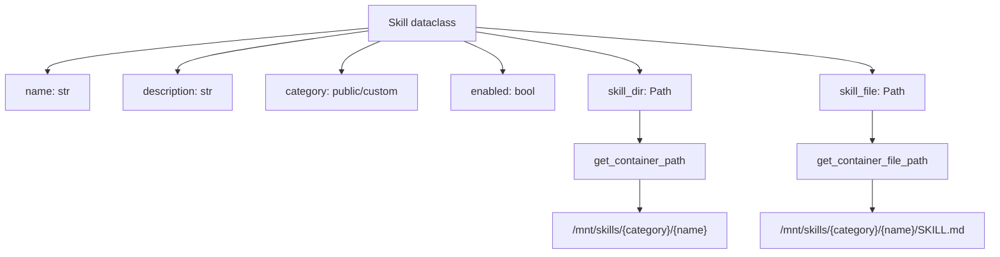
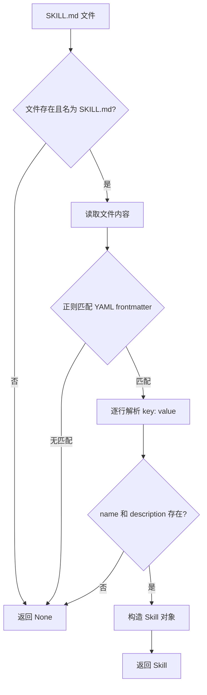
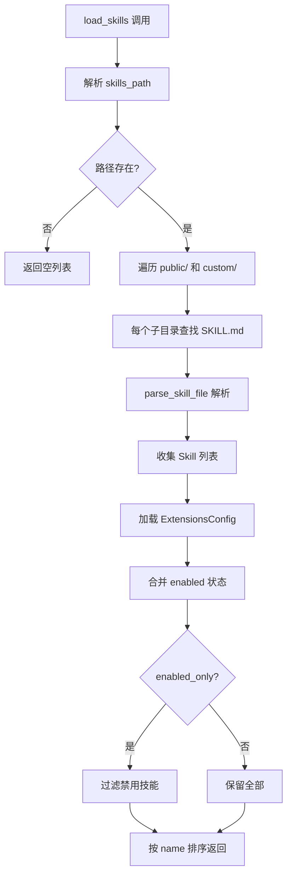

# PD-59.01 DeerFlow — Markdown-based 技能系统与渐进式加载

> 文档编号：PD-59.01
> 来源：DeerFlow `backend/src/skills/`, `backend/src/gateway/routers/skills.py`
> GitHub：https://github.com/bytedance/deer-flow
> 问题域：PD-59 技能系统 Skill System
> 状态：可复用方案

---

## 第 1 章 问题与动机

### 1.1 核心问题

Agent 系统需要一种可扩展的能力模块化机制。核心挑战包括：

1. **能力边界有限**：通用 LLM 缺乏特定领域的程序性知识（如 PDF 处理流程、特定 API 调用规范），仅靠系统提示无法覆盖所有场景
2. **上下文窗口是公共资源**：将所有技能指令一次性注入系统提示会迅速耗尽上下文窗口，挤占对话历史和用户请求的空间
3. **静态能力难以扩展**：硬编码的能力列表无法满足用户自定义需求，每次新增能力都需要修改代码和重新部署
4. **技能生命周期管理缺失**：缺乏统一的技能发现、安装、启用/禁用、卸载机制

DeerFlow 的解法是构建一个 Markdown-based 技能系统，以 SKILL.md 文件为核心载体，结合 YAML frontmatter 元数据、目录约定扫描、渐进式加载和 REST API 管理，实现了一个完整的技能生命周期管理方案。

### 1.2 DeerFlow 的解法概述

1. **SKILL.md 作为技能定义载体**：每个技能是一个目录，包含必需的 SKILL.md（YAML frontmatter + Markdown 指令）和可选的 scripts/references/assets 资源（`skills/public/skill-creator/SKILL.md:47-62`）
2. **双分类目录扫描**：技能分为 public（内置）和 custom（用户安装）两类，loader 按目录约定自动发现（`backend/src/skills/loader.py:57-73`）
3. **渐进式三层加载**：元数据（name+description）始终在上下文 → SKILL.md body 按需加载 → 子资源按需读取（`backend/src/agents/lead_agent/prompt.py:336-350`）
4. **统一扩展配置**：技能启用/禁用状态与 MCP 服务器配置统一管理在 `extensions_config.json` 中（`backend/src/config/extensions_config.py:31-43`）
5. **REST API + ZIP 安装**：Gateway 提供完整的 CRUD API 和 `.skill` ZIP 归档安装能力（`backend/src/gateway/routers/skills.py:147-443`）

### 1.3 设计思想

| 设计原则 | 具体实现 | 理由 | 替代方案 |
|----------|----------|------|----------|
| Markdown 即代码 | SKILL.md = YAML 元数据 + Markdown 指令 | 人类可读可编辑，Agent 可解析可消费，无需专用 DSL | JSON Schema 定义、Python 类注册 |
| 渐进式披露 | 三层加载：元数据 → body → 子资源 | 上下文窗口是稀缺资源，按需加载最小化 token 消耗 | 全量加载、LRU 缓存 |
| 目录约定优于配置 | `skills/{public,custom}/{name}/SKILL.md` | 零配置发现，文件系统即注册表 | 中心化注册表、数据库 |
| 关注点分离 | 技能定义（SKILL.md）与状态管理（extensions_config.json）分离 | 技能内容不可变，状态可独立切换 | 在 SKILL.md 中嵌入 enabled 字段 |
| 沙箱路径映射 | 本地路径 → 容器路径 `/mnt/skills` | 技能在沙箱内通过统一路径访问，与宿主机解耦 | 直接暴露宿主机路径 |

---

## 第 2 章 源码实现分析

### 2.1 架构概览

DeerFlow 技能系统由 5 个核心模块组成，形成从文件系统到 Agent 提示的完整管道：

```
┌─────────────────────────────────────────────────────────────────┐
│                     Gateway REST API                            │
│  GET /api/skills  │  PUT /api/skills/{name}  │  POST /install  │
└────────┬──────────┴──────────┬───────────────┴────────┬────────┘
         │                     │                        │
         ▼                     ▼                        ▼
┌─────────────────┐  ┌──────────────────┐  ┌──────────────────────┐
│   loader.py     │  │ extensions_config │  │  ZIP 安装流程        │
│ load_skills()   │  │ .json            │  │  validate → extract  │
│ 目录扫描+解析   │  │ 启用/禁用状态    │  │  → copy to custom/   │
└────────┬────────┘  └────────┬─────────┘  └──────────────────────┘
         │                    │
         ▼                    ▼
┌─────────────────┐  ┌──────────────────┐
│   parser.py     │  │   types.py       │
│ parse_skill_file│  │   Skill 数据类   │
│ YAML frontmatter│  │   路径计算       │
└────────┬────────┘  └────────┬─────────┘
         │                    │
         ▼                    ▼
┌─────────────────────────────────────────┐
│         Lead Agent prompt.py            │
│  get_skills_prompt_section()            │
│  → <skill_system> XML 注入系统提示      │
└─────────────────────────────────────────┘
         │
         ▼
┌─────────────────────────────────────────┐
│         Sandbox 路径映射                 │
│  /mnt/skills → 本地 skills/ 目录        │
│  Agent 通过 read_file 按需加载          │
└─────────────────────────────────────────┘
```

### 2.2 核心实现

#### 2.2.1 技能数据模型



对应源码 `backend/src/skills/types.py:5-47`：

```python
@dataclass
class Skill:
    """Represents a skill with its metadata and file path"""
    name: str
    description: str
    license: str | None
    skill_dir: Path
    skill_file: Path
    category: str  # 'public' or 'custom'
    enabled: bool = False

    @property
    def skill_path(self) -> str:
        return self.skill_dir.name

    def get_container_path(self, container_base_path: str = "/mnt/skills") -> str:
        return f"{container_base_path}/{self.category}/{self.skill_dir.name}"

    def get_container_file_path(self, container_base_path: str = "/mnt/skills") -> str:
        return f"{container_base_path}/{self.category}/{self.skill_dir.name}/SKILL.md"
```

#### 2.2.2 YAML Frontmatter 解析



对应源码 `backend/src/skills/parser.py:7-64`：

```python
def parse_skill_file(skill_file: Path, category: str) -> Skill | None:
    if not skill_file.exists() or skill_file.name != "SKILL.md":
        return None
    try:
        content = skill_file.read_text(encoding="utf-8")
        # 正则提取 YAML frontmatter
        front_matter_match = re.match(r"^---\s*\n(.*?)\n---\s*\n", content, re.DOTALL)
        if not front_matter_match:
            return None
        front_matter = front_matter_match.group(1)
        # 简单 key-value 解析（非完整 YAML 解析器）
        metadata = {}
        for line in front_matter.split("\n"):
            line = line.strip()
            if not line:
                continue
            if ":" in line:
                key, value = line.split(":", 1)
                metadata[key.strip()] = value.strip()
        name = metadata.get("name")
        description = metadata.get("description")
        if not name or not description:
            return None
        return Skill(
            name=name, description=description,
            license=metadata.get("license"),
            skill_dir=skill_file.parent, skill_file=skill_file,
            category=category, enabled=True,
        )
    except Exception as e:
        print(f"Error parsing skill file {skill_file}: {e}")
        return None
```

**设计细节**：parser 使用简单的 `str.split(":", 1)` 而非完整 YAML 解析器（如 PyYAML），这是有意为之——frontmatter 只有扁平的 key-value 对，简单解析器更快且零依赖。但 Gateway 的验证端点（`skills.py:88`）使用 `yaml.safe_load` 做严格校验，形成"宽松读取 + 严格写入"的双层策略。

#### 2.2.3 目录扫描与状态合并



对应源码 `backend/src/skills/loader.py:21-97`：

```python
def load_skills(skills_path=None, use_config=True, enabled_only=False) -> list[Skill]:
    if skills_path is None:
        if use_config:
            try:
                config = get_app_config()
                skills_path = config.skills.get_skills_path()
            except Exception:
                skills_path = get_skills_root_path()
        else:
            skills_path = get_skills_root_path()
    if not skills_path.exists():
        return []
    skills = []
    for category in ["public", "custom"]:
        category_path = skills_path / category
        if not category_path.exists() or not category_path.is_dir():
            continue
        for skill_dir in category_path.iterdir():
            if not skill_dir.is_dir():
                continue
            skill_file = skill_dir / "SKILL.md"
            if not skill_file.exists():
                continue
            skill = parse_skill_file(skill_file, category=category)
            if skill:
                skills.append(skill)
    # 从 extensions_config.json 合并启用状态
    try:
        extensions_config = ExtensionsConfig.from_file()
        for skill in skills:
            skill.enabled = extensions_config.is_skill_enabled(skill.name, skill.category)
    except Exception:
        pass  # 配置加载失败则默认全部启用
    if enabled_only:
        skills = [s for s in skills if s.enabled]
    skills.sort(key=lambda s: s.name)
    return skills
```

**关键设计**：`loader.py:80-83` 注释说明了为什么使用 `ExtensionsConfig.from_file()` 而非缓存的 `get_extensions_config()`——Gateway API 运行在独立进程中，修改配置后 LangGraph Server 需要从磁盘重新读取才能获取最新状态。

### 2.3 实现细节

#### 渐进式加载的系统提示注入

渐进式加载的核心在 `prompt.py:312-350`。`get_skills_prompt_section()` 只将技能的 name、description 和 SKILL.md 路径注入系统提示，不加载 body 内容：

```python
def get_skills_prompt_section() -> str:
    skills = load_skills(enabled_only=True)
    if not skills:
        return ""
    skill_items = "\n".join(
        f"    <skill>\n        <name>{skill.name}</name>\n"
        f"        <description>{skill.description}</description>\n"
        f"        <location>{skill.get_container_file_path(container_base_path)}</location>\n"
        f"    </skill>" for skill in skills
    )
    return f"""<skill_system>
You have access to skills...
**Progressive Loading Pattern:**
1. When a user query matches a skill's use case, immediately call `read_file` on the skill's main file
2. Read and understand the skill's workflow and instructions
3. Load referenced resources only when needed during execution
...
{skills_list}
</skill_system>"""
```

Agent 收到的系统提示中只有技能元数据（约 100 words/技能），当用户请求匹配某技能时，Agent 主动调用 `read_file` 读取完整 SKILL.md，再根据 SKILL.md 中的引用按需读取 scripts/references/assets。

#### 统一扩展配置与启用/禁用

`extensions_config.py:31-166` 将技能状态和 MCP 服务器配置统一管理：

```python
class ExtensionsConfig(BaseModel):
    mcp_servers: dict[str, McpServerConfig] = Field(
        default_factory=dict, alias="mcpServers")
    skills: dict[str, SkillStateConfig] = Field(default_factory=dict)

    def is_skill_enabled(self, skill_name: str, skill_category: str) -> bool:
        skill_config = self.skills.get(skill_name)
        if skill_config is None:
            # 默认启用 public 和 custom 技能
            return skill_category in ("public", "custom")
        return skill_config.enabled
```

配置文件解析优先级：参数 → 环境变量 `DEER_FLOW_EXTENSIONS_CONFIG_PATH` → CWD/`extensions_config.json` → 父目录 → `mcp_config.json`（向后兼容）。

#### ZIP 归档安装流程

`skills.py:335-442` 实现了完整的技能安装流程：

1. 解析虚拟路径到实际文件路径
2. 验证 `.skill` 扩展名和 ZIP 格式
3. 解压到临时目录
4. 严格验证 SKILL.md frontmatter（`_validate_skill_frontmatter`）：
   - 白名单属性：`{name, description, license, allowed-tools, metadata}`
   - 名称规范：hyphen-case，1-64 字符
   - 描述限制：≤1024 字符，禁止尖括号
5. 检查技能是否已存在（409 冲突）
6. 复制到 `skills/custom/{name}/`

#### 沙箱路径映射

`local_sandbox_provider.py:13-39` 将本地技能目录映射到容器路径：

```python
def _setup_path_mappings(self) -> dict[str, str]:
    mappings = {}
    config = get_app_config()
    skills_path = config.skills.get_skills_path()
    container_path = config.skills.container_path  # 默认 /mnt/skills
    if skills_path.exists():
        mappings[container_path] = str(skills_path)
    return mappings
```

Agent 在沙箱内通过 `/mnt/skills/public/deep-research/SKILL.md` 访问技能文件，与宿主机实际路径完全解耦。
