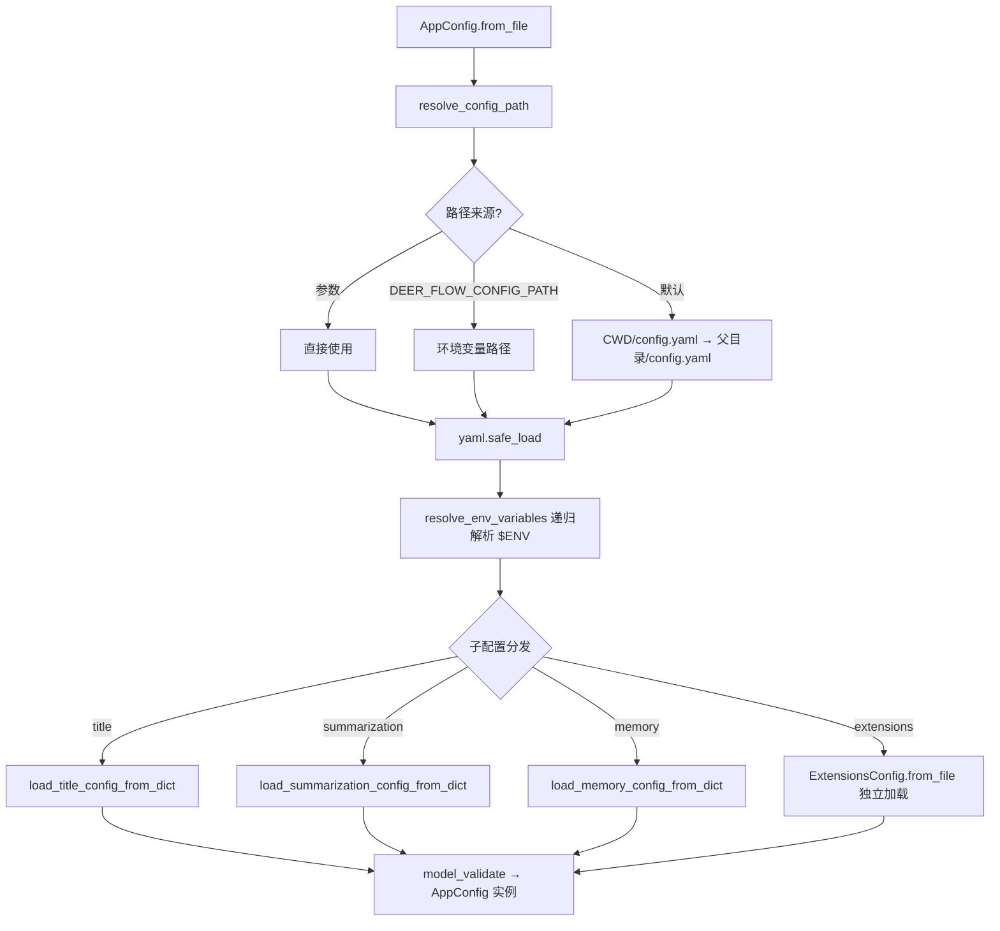
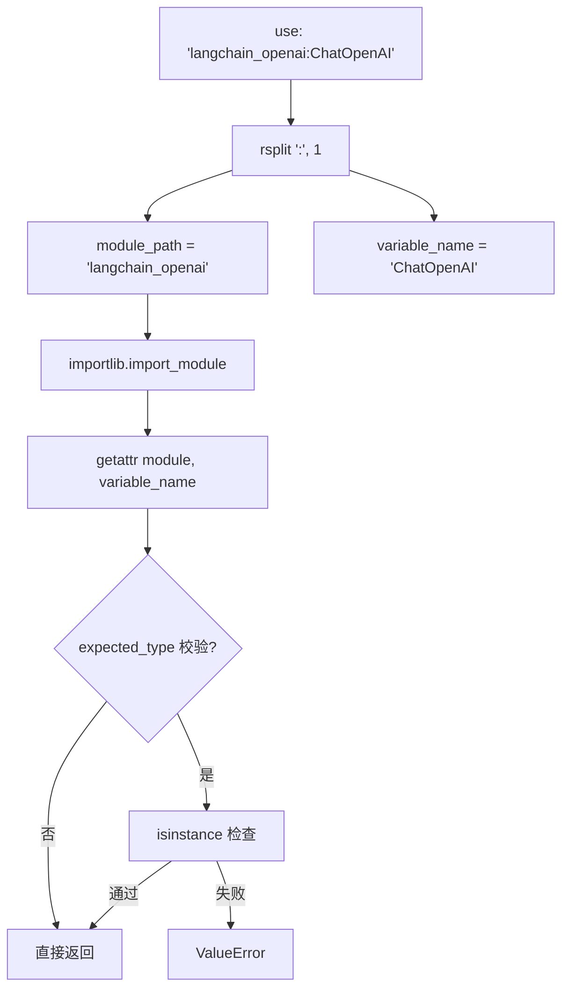
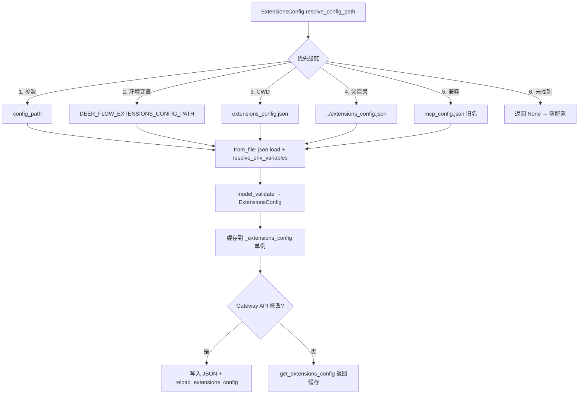

# PD-60.01 DeerFlow — YAML+JSON 双配置体系与反射驱动架构

> 文档编号：PD-60.01
> 来源：DeerFlow `backend/src/config/app_config.py`, `backend/src/config/extensions_config.py`, `backend/src/reflection/resolvers.py`
> GitHub：https://github.com/bytedance/deer-flow
> 问题域：PD-60 配置驱动架构 Config-Driven Architecture
> 状态：可复用方案

---

## 第 1 章 问题与动机（≥ 30 行）

### 1.1 核心问题

Agent 应用的组件（模型、工具、沙箱、记忆、MCP 服务器）种类多、变化快，硬编码会导致：

1. **切换成本高** — 换一个 LLM 提供商需要改代码、重新部署
2. **扩展困难** — 新增工具或 MCP 服务器需要修改注册逻辑
3. **多环境适配** — 开发/测试/生产环境的 API Key、端点、沙箱策略各不相同
4. **运行时僵化** — 启用/禁用某个技能或 MCP 服务器需要重启整个服务
5. **配置分散** — 模型参数、工具列表、沙箱选项散落在不同文件和环境变量中

核心诉求：**一份 YAML 文件定义全部组件，运行时通过反射自动加载，无需改一行代码即可切换任意实现。**

### 1.2 DeerFlow 的解法概述

DeerFlow 采用"双配置文件 + 反射解析器 + 模块级单例"三层架构：

1. **config.yaml** — 核心配置文件，定义模型、工具、沙箱、技能、摘要、记忆等全部组件，支持 `$ENV` 语法引用环境变量（`app_config.py:98-117`）
2. **extensions_config.json** — 扩展配置文件，管理 MCP 服务器和技能启用状态，独立于主配置以支持 Gateway API 运行时修改（`extensions_config.py:96-116`）
3. **反射解析器** — `resolve_class` / `resolve_variable` 通过 `use: "package.module:ClassName"` 语法动态加载任意 Python 类或变量（`reflection/resolvers.py:7-46`）
4. **模块级单例** — 每个配置模块维护 `_xxx_config` 全局变量 + `get/reload/reset/set` 四件套，支持热重载和测试注入（`app_config.py:153-206`）
5. **子配置分发** — AppConfig.from_file 加载 YAML 后，将 title/summarization/memory 等子节点分发到各自的全局配置实例（`app_config.py:78-92`）

### 1.3 设计思想

| 设计原则 | 具体实现 | 理由 | 替代方案 |
|----------|----------|------|----------|
| 声明式组件注册 | YAML `use: "pkg:Class"` 字段 + 反射加载 | 新增组件只需改配置，零代码变更 | 硬编码 import + 工厂 if-else |
| 双文件分离 | config.yaml（静态核心）+ extensions_config.json（动态扩展）| 扩展配置可被 Gateway API 运行时写入，不影响核心配置 | 单文件 + 文件锁 |
| 环境变量透传 | `$ENV_VAR` 语法递归解析 | 敏感信息不入库，多环境一份配置 | .env 文件 + python-dotenv |
| 模块级单例 | `_config` 全局变量 + get/reload/reset/set | 避免重复解析，支持热重载和测试 mock | 依赖注入容器 |
| Pydantic 校验 | 所有配置类继承 BaseModel，Field 带约束 | 启动时即发现配置错误，IDE 自动补全 | dict 手动校验 |
| 多优先级路径 | 参数 > 环境变量 > CWD > 父目录 > 兼容旧名 | 灵活适配不同部署场景 | 固定路径 |

---

## 第 2 章 源码实现分析（核心章节）

### 2.1 架构概览

DeerFlow 的配置系统由三层组成：配置文件层、Pydantic 模型层、反射解析层。

```
┌─────────────────────────────────────────────────────────────┐
│                    配置文件层 (File Layer)                     │
│  ┌──────────────┐    ┌─────────────────────────┐            │
│  │ config.yaml  │    │ extensions_config.json   │            │
│  │ (核心配置)    │    │ (MCP + 技能状态)          │            │
│  └──────┬───────┘    └───────────┬──────────────┘            │
│         │ yaml.safe_load         │ json.load                 │
├─────────┼────────────────────────┼──────────────────────────┤
│         ▼    Pydantic 模型层      ▼                          │
│  ┌──────────────┐    ┌─────────────────────────┐            │
│  │  AppConfig   │───→│   ExtensionsConfig      │            │
│  │  (聚合根)     │    │   (MCP + Skills)        │            │
│  └──────┬───────┘    └─────────────────────────┘            │
│         │ 子配置分发                                          │
│  ┌──────┼──────┬──────────┬──────────┬──────────┐           │
│  │      ▼      ▼          ▼          ▼          ▼           │
│  │ ModelConfig ToolConfig SandboxCfg MemoryCfg TitleCfg     │
│  └──────┬──────┬──────────┬──────────────────────┘          │
│         │ use: │ use:     │ use:                             │
├─────────┼──────┼──────────┼─────────────────────────────────┤
│         ▼      ▼          ▼    反射解析层                     │
│  ┌─────────────────────────────────────────────┐            │
│  │  resolve_class / resolve_variable           │            │
│  │  "pkg.module:ClassName" → importlib 动态加载  │            │
│  └─────────────────────────────────────────────┘            │
└─────────────────────────────────────────────────────────────┘
```

### 2.2 核心实现

#### 2.2.1 AppConfig 聚合根 — YAML 加载与子配置分发



对应源码 `backend/src/config/app_config.py:61-95`：

```python
@classmethod
def from_file(cls, config_path: str | None = None) -> Self:
    resolved_path = cls.resolve_config_path(config_path)
    with open(resolved_path) as f:
        config_data = yaml.safe_load(f)
    config_data = cls.resolve_env_variables(config_data)

    # 子配置分发：将 YAML 子节点加载到各自的全局单例
    if "title" in config_data:
        load_title_config_from_dict(config_data["title"])
    if "summarization" in config_data:
        load_summarization_config_from_dict(config_data["summarization"])
    if "memory" in config_data:
        load_memory_config_from_dict(config_data["memory"])

    # 扩展配置独立加载（来自 extensions_config.json）
    extensions_config = ExtensionsConfig.from_file()
    config_data["extensions"] = extensions_config.model_dump()

    result = cls.model_validate(config_data)
    return result
```

关键设计：AppConfig 是聚合根，但子配置（title/summarization/memory）各自维护独立的全局单例。这意味着消费方可以直接调用 `get_memory_config()` 而不需要经过 AppConfig，降低了耦合。

#### 2.2.2 反射解析器 — `use` 字段的动态类加载



对应源码 `backend/src/reflection/resolvers.py:7-46`：

```python
def resolve_variable[T](
    variable_path: str,
    expected_type: type[T] | tuple[type, ...] | None = None,
) -> T:
    try:
        module_path, variable_name = variable_path.rsplit(":", 1)
    except ValueError as err:
        raise ImportError(
            f"{variable_path} doesn't look like a variable path"
        ) from err

    module = import_module(module_path)
    variable = getattr(module, variable_name)

    if expected_type is not None:
        if not isinstance(variable, expected_type):
            raise ValueError(
                f"{variable_path} is not an instance of {type_name}"
            )
    return variable
```

这个反射解析器是整个配置驱动架构的核心引擎。它被三个关键消费方使用：
- **模型工厂** `models/factory.py:24` — `resolve_class(model_config.use, BaseChatModel)`
- **工具加载** `tools/tools.py:43` — `resolve_variable(tool.use, BaseTool)`
- **沙箱提供者** `sandbox/sandbox_provider.py:54` — `resolve_class(config.sandbox.use, SandboxProvider)`

#### 2.2.3 ExtensionsConfig — 独立的扩展配置与热重载



对应源码 `backend/src/config/extensions_config.py:45-93`：

```python
@classmethod
def resolve_config_path(cls, config_path: str | None = None) -> Path | None:
    if config_path:
        path = Path(config_path)
        if not path.exists():
            raise FileNotFoundError(...)
        return path
    elif os.getenv("DEER_FLOW_EXTENSIONS_CONFIG_PATH"):
        path = Path(os.getenv("DEER_FLOW_EXTENSIONS_CONFIG_PATH"))
        if not path.exists():
            raise FileNotFoundError(...)
        return path
    else:
        # 多路径探测：CWD → 父目录 → 兼容旧名 mcp_config.json
        path = Path(os.getcwd()) / "extensions_config.json"
        if path.exists():
            return path
        path = Path(os.getcwd()).parent / "extensions_config.json"
        if path.exists():
            return path
        # 向后兼容
        path = Path(os.getcwd()) / "mcp_config.json"
        if path.exists():
            return path
        path = Path(os.getcwd()).parent / "mcp_config.json"
        if path.exists():
            return path
        return None  # 扩展是可选的
```

### 2.3 实现细节

#### 环境变量递归解析

`resolve_env_variables` 在 AppConfig 和 ExtensionsConfig 中各有一份实现，递归遍历 dict/list/str，将 `$VAR_NAME` 替换为 `os.getenv(VAR_NAME)`。AppConfig 版本（`app_config.py:98-117`）在未找到环境变量时保留原始 `$VAR` 字符串，而 ExtensionsConfig 版本（`extensions_config.py:119-142`）在未找到时保留 None。

#### 模块级单例四件套

每个配置模块都遵循相同的模式（以 AppConfig 为例，`app_config.py:153-206`）：

| 函数 | 作用 |
|------|------|
| `get_app_config()` | 懒加载单例，首次调用时从文件加载 |
| `reload_app_config()` | 强制重新从文件加载，更新缓存 |
| `reset_app_config()` | 清空缓存，下次 get 时重新加载 |
| `set_app_config()` | 注入自定义实例（测试用） |

这个模式在 `app_config.py`、`extensions_config.py`、`memory_config.py`、`title_config.py`、`summarization_config.py`、`tracing_config.py` 中完全一致。

#### 跨进程配置同步

Gateway API 和 Agent 运行在不同进程中。当 Gateway 通过 API 修改技能状态时（`gateway/routers/skills.py:284-310`），它写入 `extensions_config.json` 文件后调用 `reload_extensions_config()`。Agent 端在加载 MCP 工具时，直接调用 `ExtensionsConfig.from_file()` 而非使用缓存（`tools/tools.py:56`），确保读到最新配置。

#### TracingConfig 的线程安全

TracingConfig（`tracing_config.py:8-43`）是唯一使用 `threading.Lock` 做双重检查锁定的配置模块，因为它纯从环境变量加载，可能被多线程并发访问。其他配置模块在应用启动时单线程加载，不需要锁。


---

## 第 3 章 迁移指南

### 3.1 迁移清单

**阶段 1：基础配置框架**
- [ ] 创建 `config/` 包，定义 AppConfig Pydantic 模型
- [ ] 实现 `resolve_config_path` 多优先级路径解析
- [ ] 实现 `resolve_env_variables` 递归环境变量替换
- [ ] 编写 config.yaml 模板文件

**阶段 2：反射解析器**
- [ ] 实现 `resolve_class` 和 `resolve_variable`（约 70 行代码）
- [ ] 为模型、工具、沙箱等组件添加 `use` 字段
- [ ] 添加类型校验（isinstance / issubclass）

**阶段 3：子配置模块**
- [ ] 为每个子系统创建独立的配置模块（memory/title/summarization 等）
- [ ] 实现模块级单例四件套（get/reload/reset/set）
- [ ] 在 AppConfig.from_file 中添加子配置分发逻辑

**阶段 4：扩展配置**
- [ ] 创建 ExtensionsConfig（JSON 格式，独立于主配置）
- [ ] 实现 Gateway API 写入 + reload 热重载
- [ ] 添加向后兼容路径探测（旧文件名支持）

### 3.2 适配代码模板

#### 反射解析器（可直接复用）

```python
"""reflection/resolvers.py — 配置驱动的动态类加载器"""
from importlib import import_module
from typing import TypeVar

T = TypeVar("T")


def resolve_variable(
    variable_path: str,
    expected_type: type[T] | tuple[type, ...] | None = None,
) -> T:
    """从 'package.module:variable_name' 路径动态加载变量。

    Args:
        variable_path: 格式为 "pkg.module:var_name"
        expected_type: 可选的类型校验

    Returns:
        加载的变量实例

    Raises:
        ImportError: 路径格式错误或模块/属性不存在
        ValueError: 类型校验失败
    """
    try:
        module_path, variable_name = variable_path.rsplit(":", 1)
    except ValueError as err:
        raise ImportError(
            f"{variable_path} doesn't look like a variable path. "
            f"Expected format: package.module:variable_name"
        ) from err

    try:
        module = import_module(module_path)
    except ImportError as err:
        raise ImportError(f"Could not import module {module_path}") from err

    try:
        variable = getattr(module, variable_name)
    except AttributeError as err:
        raise ImportError(
            f"Module {module_path} does not define '{variable_name}'"
        ) from err

    if expected_type is not None and not isinstance(variable, expected_type):
        type_name = (
            expected_type.__name__
            if isinstance(expected_type, type)
            else " or ".join(t.__name__ for t in expected_type)
        )
        raise ValueError(
            f"{variable_path} is not an instance of {type_name}, "
            f"got {type(variable).__name__}"
        )
    return variable


def resolve_class(
    class_path: str,
    base_class: type[T] | None = None,
) -> type[T]:
    """从 'package.module:ClassName' 路径动态加载类。"""
    cls = resolve_variable(class_path, expected_type=type)
    if base_class is not None and not issubclass(cls, base_class):
        raise ValueError(
            f"{class_path} is not a subclass of {base_class.__name__}"
        )
    return cls
```

#### 模块级单例模板（可直接复用）

```python
"""config/base.py — 配置单例四件套模板"""
from typing import TypeVar, Generic, Callable
from pydantic import BaseModel

T = TypeVar("T", bound=BaseModel)

class ConfigSingleton(Generic[T]):
    """通用配置单例管理器。

    用法:
        memory_config_mgr = ConfigSingleton(MemoryConfig)
        config = memory_config_mgr.get()
        memory_config_mgr.reload(loader=lambda: MemoryConfig(**new_data))
    """

    def __init__(self, config_class: type[T], default_factory: Callable[[], T] | None = None):
        self._config_class = config_class
        self._instance: T | None = None
        self._default_factory = default_factory or config_class

    def get(self) -> T:
        if self._instance is None:
            self._instance = self._default_factory()
        return self._instance

    def reload(self, loader: Callable[[], T] | None = None) -> T:
        self._instance = (loader or self._default_factory)()
        return self._instance

    def reset(self) -> None:
        self._instance = None

    def set(self, config: T) -> None:
        self._instance = config
```

### 3.3 适用场景

| 场景 | 适用度 | 说明 |
|------|--------|------|
| 多 LLM 提供商切换 | ⭐⭐⭐ | `use` 字段 + 反射加载，换模型只改 YAML |
| 插件化工具系统 | ⭐⭐⭐ | 工具注册完全声明式，社区贡献者只需写工具代码 + 配置 |
| 多环境部署 | ⭐⭐⭐ | `$ENV` 语法 + 多优先级路径，一份配置适配所有环境 |
| 运行时功能开关 | ⭐⭐ | extensions_config.json 支持热重载，但仅限 MCP/技能 |
| 微服务配置中心 | ⭐ | 文件级配置，不适合分布式配置中心场景（需额外适配） |

---

## 第 4 章 测试用例

```python
"""tests/test_config_driven_architecture.py"""
import json
import os
import tempfile
from pathlib import Path
from unittest.mock import patch

import pytest
import yaml
from pydantic import BaseModel, Field


# ============================================================
# 1. 反射解析器测试
# ============================================================

class TestResolveVariable:
    """测试 resolve_variable 动态加载"""

    def test_resolve_builtin_module(self):
        """正常路径：加载标准库变量"""
        from src.reflection.resolvers import resolve_variable
        result = resolve_variable("os.path:sep")
        assert isinstance(result, str)

    def test_resolve_with_type_check(self):
        """类型校验通过"""
        from src.reflection.resolvers import resolve_variable
        result = resolve_variable("os.path:sep", expected_type=str)
        assert isinstance(result, str)

    def test_resolve_type_mismatch(self):
        """类型校验失败应抛 ValueError"""
        from src.reflection.resolvers import resolve_variable
        with pytest.raises(ValueError, match="is not an instance of"):
            resolve_variable("os.path:sep", expected_type=int)

    def test_resolve_invalid_path_format(self):
        """无效路径格式应抛 ImportError"""
        from src.reflection.resolvers import resolve_variable
        with pytest.raises(ImportError, match="doesn't look like"):
            resolve_variable("no_colon_here")

    def test_resolve_nonexistent_module(self):
        """不存在的模块应抛 ImportError"""
        from src.reflection.resolvers import resolve_variable
        with pytest.raises(ImportError, match="Could not import"):
            resolve_variable("nonexistent.module:var")


class TestResolveClass:
    """测试 resolve_class 动态类加载"""

    def test_resolve_class_with_base_check(self):
        """加载类并校验基类"""
        from src.reflection.resolvers import resolve_class
        cls = resolve_class("pydantic:BaseModel")
        assert issubclass(cls, BaseModel)

    def test_resolve_class_base_mismatch(self):
        """基类不匹配应抛 ValueError"""
        from src.reflection.resolvers import resolve_class
        with pytest.raises(ValueError, match="is not a subclass"):
            resolve_class("os.path:sep", base_class=BaseModel)


# ============================================================
# 2. 环境变量解析测试
# ============================================================

class TestEnvVariableResolution:
    """测试 $ENV 语法递归解析"""

    def test_resolve_string_env(self):
        from src.config.app_config import AppConfig
        with patch.dict(os.environ, {"TEST_KEY": "resolved_value"}):
            result = AppConfig.resolve_env_variables({"key": "$TEST_KEY"})
            assert result["key"] == "resolved_value"

    def test_resolve_nested_dict(self):
        from src.config.app_config import AppConfig
        with patch.dict(os.environ, {"INNER": "val"}):
            result = AppConfig.resolve_env_variables(
                {"outer": {"inner": "$INNER"}}
            )
            assert result["outer"]["inner"] == "val"

    def test_unresolved_env_keeps_original(self):
        """AppConfig 版本：未找到的环境变量保留 $VAR 原文"""
        from src.config.app_config import AppConfig
        result = AppConfig.resolve_env_variables({"key": "$NONEXISTENT"})
        assert result["key"] == "$NONEXISTENT"

    def test_resolve_list_items(self):
        from src.config.app_config import AppConfig
        with patch.dict(os.environ, {"ITEM": "resolved"}):
            result = AppConfig.resolve_env_variables(
                {"list": [{"val": "$ITEM"}]}
            )
            assert result["list"][0]["val"] == "resolved"


# ============================================================
# 3. 配置路径解析测试
# ============================================================

class TestConfigPathResolution:
    """测试多优先级路径解析"""

    def test_explicit_path_takes_priority(self, tmp_path):
        config_file = tmp_path / "custom.yaml"
        config_file.write_text("models: []")
        from src.config.app_config import AppConfig
        path = AppConfig.resolve_config_path(str(config_file))
        assert path == config_file

    def test_env_var_path(self, tmp_path):
        config_file = tmp_path / "config.yaml"
        config_file.write_text("models: []")
        from src.config.app_config import AppConfig
        with patch.dict(os.environ, {"DEER_FLOW_CONFIG_PATH": str(config_file)}):
            path = AppConfig.resolve_config_path()
            assert path == config_file

    def test_missing_path_raises(self):
        from src.config.app_config import AppConfig
        with pytest.raises(FileNotFoundError):
            AppConfig.resolve_config_path("/nonexistent/config.yaml")


# ============================================================
# 4. 单例生命周期测试
# ============================================================

class TestSingletonLifecycle:
    """测试 get/reload/reset/set 四件套"""

    def test_get_returns_same_instance(self):
        from src.config.extensions_config import (
            get_extensions_config, reset_extensions_config,
            set_extensions_config, ExtensionsConfig,
        )
        reset_extensions_config()
        set_extensions_config(ExtensionsConfig(mcp_servers={}, skills={}))
        a = get_extensions_config()
        b = get_extensions_config()
        assert a is b

    def test_set_injects_custom_config(self):
        from src.config.extensions_config import (
            get_extensions_config, set_extensions_config,
            reset_extensions_config, ExtensionsConfig, McpServerConfig,
        )
        reset_extensions_config()
        custom = ExtensionsConfig(
            mcp_servers={"test": McpServerConfig(enabled=True)},
            skills={},
        )
        set_extensions_config(custom)
        assert "test" in get_extensions_config().mcp_servers

    def test_reset_clears_cache(self):
        from src.config.extensions_config import (
            get_extensions_config, reset_extensions_config,
            set_extensions_config, ExtensionsConfig,
        )
        set_extensions_config(ExtensionsConfig(mcp_servers={}, skills={}))
        reset_extensions_config()
        # 下次 get 会重新从文件加载（或返回空配置）
        config = get_extensions_config()
        assert isinstance(config, ExtensionsConfig)
```


---

## 第 5 章 跨域关联

| 关联域 | 关系类型 | 说明 |
|--------|----------|------|
| PD-04 工具系统 | 强依赖 | 工具通过 config.yaml 的 `tools[].use` 字段声明式注册，由反射解析器动态加载（`tools/tools.py:43`） |
| PD-06 记忆持久化 | 协同 | MemoryConfig 作为 config.yaml 子节点，控制记忆系统的存储路径、置信度阈值、注入策略（`memory_config.py:6-48`） |
| PD-01 上下文管理 | 协同 | SummarizationConfig 通过 config.yaml 配置触发阈值和保留策略，驱动上下文压缩行为（`summarization_config.py:21-53`） |
| PD-05 沙箱隔离 | 强依赖 | SandboxConfig 的 `use` 字段决定沙箱提供者实现（Local vs AIO），由反射解析器实例化（`sandbox_provider.py:53-54`） |
| PD-11 可观测性 | 协同 | TracingConfig 从环境变量加载 LangSmith 配置，模型工厂自动附加 tracer（`models/factory.py:43-57`） |
| PD-09 Human-in-the-Loop | 间接 | 技能启用/禁用通过 ExtensionsConfig 控制，Gateway API 可运行时切换（`gateway/routers/skills.py:240-310`） |

---

## 第 6 章 来源文件索引

| 文件 | 行范围 | 关键实现 |
|------|--------|----------|
| `backend/src/config/app_config.py` | L21-L30 | AppConfig Pydantic 模型定义（聚合根） |
| `backend/src/config/app_config.py` | L33-L59 | resolve_config_path 多优先级路径解析 |
| `backend/src/config/app_config.py` | L61-L95 | from_file YAML 加载 + 子配置分发 |
| `backend/src/config/app_config.py` | L98-L117 | resolve_env_variables 递归 $ENV 解析 |
| `backend/src/config/app_config.py` | L153-L206 | 模块级单例四件套 |
| `backend/src/config/extensions_config.py` | L11-L43 | McpServerConfig + ExtensionsConfig 模型 |
| `backend/src/config/extensions_config.py` | L45-L93 | resolve_config_path 6 级优先级 + 向后兼容 |
| `backend/src/config/extensions_config.py` | L96-L116 | from_file JSON 加载 + 环境变量解析 |
| `backend/src/config/extensions_config.py` | L169-L226 | 单例四件套 + reload 热重载 |
| `backend/src/config/model_config.py` | L4-L22 | ModelConfig 模型定义（supports_thinking/vision） |
| `backend/src/config/tool_config.py` | L1-L21 | ToolConfig + ToolGroupConfig 定义 |
| `backend/src/config/sandbox_config.py` | L1-L67 | SandboxConfig（含 Docker 挂载和环境变量注入） |
| `backend/src/config/memory_config.py` | L6-L70 | MemoryConfig + 全局单例 |
| `backend/src/config/summarization_config.py` | L1-L75 | SummarizationConfig（触发/保留策略） |
| `backend/src/config/title_config.py` | L1-L54 | TitleConfig + prompt 模板 |
| `backend/src/config/tracing_config.py` | L1-L52 | TracingConfig（线程安全双重检查锁） |
| `backend/src/config/skills_config.py` | L1-L50 | SkillsConfig（路径解析） |
| `backend/src/reflection/resolvers.py` | L7-L46 | resolve_variable 反射加载器 |
| `backend/src/reflection/resolvers.py` | L49-L71 | resolve_class 类加载器 |
| `backend/src/models/factory.py` | L9-L58 | create_chat_model 配置驱动的模型工厂 |
| `backend/src/tools/tools.py` | L22-L84 | get_available_tools 配置驱动的工具加载 |
| `backend/src/sandbox/sandbox_provider.py` | L42-L56 | get_sandbox_provider 配置驱动的沙箱实例化 |
| `backend/src/gateway/config.py` | L6-L28 | GatewayConfig（纯环境变量驱动） |
| `backend/src/subagents/config.py` | L7-L29 | SubagentConfig（dataclass，非 Pydantic） |
| `config.example.yaml` | L1-L284 | 完整配置模板（模型/工具/沙箱/技能/摘要/记忆） |

---

## 第 7 章 横向对比维度

```json comparison_data
{
  "project": "DeerFlow",
  "dimensions": {
    "配置格式": "YAML（核心）+ JSON（扩展），双文件分离",
    "动态加载": "反射解析器 resolve_class/resolve_variable，use 字段指定 pkg:Class",
    "环境变量": "$ENV 语法递归解析，AppConfig 保留原文 / ExtensionsConfig 置 None",
    "热重载": "模块级单例四件套 get/reload/reset/set，Gateway API 触发 JSON 重载",
    "配置校验": "Pydantic BaseModel + Field 约束（ge/le/default），启动时校验",
    "路径解析": "6 级优先级链：参数 > 环境变量 > CWD > 父目录 > 兼容旧名 > None",
    "线程安全": "TracingConfig 用 threading.Lock 双重检查，其他模块单线程加载"
  }
}
```

### 域元数据补充

```json domain_metadata
{
  "solution_summary": "DeerFlow 用 YAML+JSON 双配置体系 + importlib 反射解析器实现声明式组件注册，config.yaml 的 use 字段指定 pkg:Class 路径，运行时动态加载模型/工具/沙箱实现，支持模块级单例热重载",
  "description": "声明式组件注册与反射驱动的零代码切换能力",
  "sub_problems": [
    "双文件配置的跨进程同步（Gateway 写 JSON，Agent 读最新）",
    "反射加载的类型安全校验（isinstance + issubclass 双重检查）",
    "向后兼容的配置文件名迁移（mcp_config.json → extensions_config.json）"
  ],
  "best_practices": [
    "use 字段 + importlib 反射实现声明式组件注册，零代码切换实现",
    "模块级单例四件套（get/reload/reset/set）统一配置生命周期管理",
    "核心配置与扩展配置分文件，扩展配置支持 API 运行时写入"
  ]
}
```

