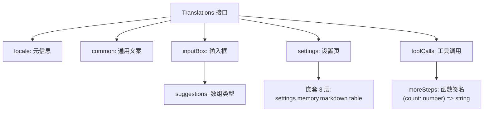
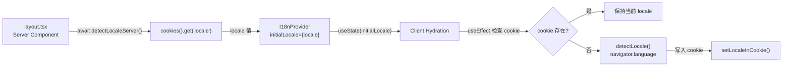

# PD-61.01 DeerFlow — 类型安全 i18n 系统

> 文档编号：PD-61.01
> 来源：DeerFlow `frontend/src/core/i18n/`
> GitHub：https://github.com/bytedance/deer-flow
> 问题域：PD-61 国际化 Internationalization
> 状态：可复用方案

---

## 第 1 章 问题与动机

### 1.1 核心问题

前端国际化（i18n）在 Agent 应用中面临三个层次的挑战：

1. **翻译键的类型安全** — 传统 i18n 库（如 i18next）使用字符串键 `t('common.home')`，拼写错误只能在运行时发现。当 UI 文案频繁迭代时，遗漏翻译键是常见 bug 来源。
2. **SSR/CSR 一致性** — Next.js App Router 下，服务端渲染需要在 `layout.tsx` 中确定初始语言，客户端 hydration 后需要无缝接管，否则会出现闪烁或 hydration mismatch。
3. **语言偏好持久化** — 用户切换语言后，刷新页面或打开新标签页应保持选择，且不依赖后端存储。

### 1.2 DeerFlow 的解法概述

DeerFlow 实现了一套轻量级、零依赖的 i18n 方案，核心特点：

1. **TypeScript 接口即翻译契约** — `Translations` 接口定义全部翻译键的完整类型结构，包括嵌套对象和函数签名，编译时即可捕获缺失或类型错误的翻译（`locales/types.ts:3-248`）
2. **React Context + Hook 分层** — `I18nProvider` 管理 locale 状态，`useI18n()` hook 返回类型安全的 `t` 对象和 `changeLocale` 方法，组件只需解构即可使用（`context.tsx:14-33`, `hooks.ts:17-42`）
3. **SSR 服务端预检测** — `detectLocaleServer()` 在 `layout.tsx` 中通过 Next.js `cookies()` API 读取语言偏好，作为 `initialLocale` 传入 Provider，避免 hydration 闪烁（`server.ts:5-9`, `layout.tsx:24`）
4. **Cookie 双端持久化** — 客户端通过 `document.cookie` 读写，服务端通过 `next/headers` 的 `cookies()` 读取，同一个 cookie 键 `locale` 贯穿 SSR 和 CSR（`cookies.ts:6-52`）
5. **date-fns locale 联动** — 日期格式化工具 `formatTimeAgo` 自动读取当前 locale 并映射到 date-fns 的对应 locale 包（`utils/datetime.ts:7-27`）

### 1.3 设计思想

| 设计原则 | 具体实现 | 理由 | 替代方案 |
|----------|----------|------|----------|
| 编译时类型安全 | `Translations` 接口定义所有键，locale 文件必须满足接口 | 消除运行时翻译键拼写错误 | i18next 的 JSON + 运行时查找 |
| 零运行时依赖 | 不使用 i18next/react-intl 等库，纯 TS 对象 + React Context | 减少 bundle 体积，避免库版本冲突 | next-intl / react-i18next |
| SSR 优先 | 服务端 cookie 检测 → Provider initialLocale → 客户端 hydration | 避免语言闪烁，SEO 友好 | 纯客户端检测（会闪烁） |
| 函数式翻译值 | `toolCalls.moreSteps: (count: number) => string` | 支持动态插值，保持类型安全 | 模板字符串 `{count} steps` |
| Cookie 持久化 | `max-age=31536000`（1年），`SameSite=Lax` | 无需后端存储，跨标签页生效 | localStorage（SSR 不可读） |

---

## 第 2 章 源码实现分析

### 2.1 架构概览

DeerFlow 的 i18n 系统由 6 个文件组成，分为三层：

```
┌─────────────────────────────────────────────────────────┐
│                    App Layer                             │
│  layout.tsx ──→ detectLocaleServer() ──→ I18nProvider    │
│                                          initialLocale   │
├─────────────────────────────────────────────────────────┤
│                    Hook Layer                            │
│  useI18n() ──→ { locale, t, changeLocale }              │
│       ↑                                                  │
│  useI18nContext() ←── I18nContext (React Context)        │
├─────────────────────────────────────────────────────────┤
│                    Data Layer                            │
│  types.ts ──→ Translations interface                     │
│  en-US.ts ──→ enUS: Translations                        │
│  zh-CN.ts ──→ zhCN: Translations                        │
│  cookies.ts ──→ get/set locale cookie                   │
│  server.ts ──→ detectLocaleServer()                     │
└─────────────────────────────────────────────────────────┘
```

文件清单：

| 文件 | 职责 | 行数 |
|------|------|------|
| `locales/types.ts` | 翻译键类型定义 | 248 |
| `locales/en-US.ts` | 英文翻译实现 | 309 |
| `locales/zh-CN.ts` | 中文翻译实现 | 302 |
| `context.tsx` | React Context + Provider | 42 |
| `hooks.ts` | `useI18n()` 主 hook | 43 |
| `cookies.ts` | Cookie 读写工具 | 53 |
| `server.ts` | 服务端 locale 检测 | 10 |
| `index.ts` | 统一导出 | 24 |

### 2.2 核心实现

#### 2.2.1 类型安全的翻译接口



对应源码 `frontend/src/core/i18n/locales/types.ts:3-248`：

```typescript
export interface Translations {
  locale: {
    localName: string;
  };
  common: {
    home: string;
    settings: string;
    delete: string;
    // ... 14 个通用键
  };
  inputBox: {
    placeholder: string;
    suggestions: {
      suggestion: string;
      prompt: string;
      icon: LucideIcon;
    }[];
    // suggestions 是数组类型，每个 locale 可定义不同数量的建议
  };
  toolCalls: {
    moreSteps: (count: number) => string;
    useTool: (toolName: string) => string;
    searchFor: (query: string) => string;
    // 函数签名确保插值参数类型正确
  };
  settings: {
    memory: {
      markdown: {
        table: {
          category: string;
          confidence: string;
          confidenceLevel: {
            veryHigh: string;
            high: string;
            // 最深嵌套 4 层
          };
        };
      };
    };
  };
}
```

关键设计点：
- **函数类型翻译值**（`types.ts:133-143`）：`moreSteps: (count: number) => string` 不是模板字符串，而是真正的函数签名。中文实现 `(count) => \`查看其他 ${count} 个步骤\`` 和英文实现 `(count) => \`${count} more step${count === 1 ? "" : "s"}\`` 可以有完全不同的语法结构
- **数组类型翻译值**（`types.ts:70-84`）：`suggestions` 和 `suggestionsCreate` 是数组，允许不同语言有不同数量的建议项，且每项包含 `LucideIcon` 组件引用
- **深层嵌套**（`types.ts:163-247`）：`settings.memory.markdown.table.confidenceLevel.veryHigh` 达到 5 层嵌套，TypeScript 编译器仍能完整检查

#### 2.2.2 SSR → CSR 语言传递链



对应源码 `frontend/src/app/layout.tsx:21-38`：

```typescript
// 服务端：layout.tsx 是 async Server Component
export default async function RootLayout({
  children,
}: Readonly<{ children: React.ReactNode }>) {
  const locale = await detectLocaleServer();  // server.ts:5-9
  return (
    <html lang={locale} className={geist.variable}
          suppressHydrationWarning>
      <body>
        <ThemeProvider attribute="class" enableSystem disableTransitionOnChange>
          <I18nProvider initialLocale={locale}>{children}</I18nProvider>
        </ThemeProvider>
      </body>
    </html>
  );
}
```

服务端检测 `frontend/src/core/i18n/server.ts:5-9`：

```typescript
export async function detectLocaleServer(): Promise<Locale> {
  const cookieStore = await cookies();
  const locale = cookieStore.get("locale")?.value ?? "en-US";
  return locale as Locale;
}
```

客户端初始化 `frontend/src/core/i18n/hooks.ts:28-35`：

```typescript
// useI18n() 内部的 useEffect —— 仅在首次挂载时执行
useEffect(() => {
  const saved = getLocaleFromCookie() as Locale | null;
  if (!saved) {
    const detected = detectLocale();  // navigator.language 检测
    setLocale(detected);
    setLocaleInCookie(detected);      // 写入 cookie 供下次 SSR 使用
  }
}, [setLocale]);
```

### 2.3 实现细节

#### Cookie 双端一致性

`cookies.ts` 提供三个函数，覆盖客户端和服务端两种场景：

| 函数 | 运行环境 | 实现方式 |
|------|----------|----------|
| `getLocaleFromCookie()` | 客户端 | `document.cookie.split(';')` 手动解析 |
| `setLocaleInCookie()` | 客户端 | `document.cookie = ...` 直接设置 |
| `getLocaleFromCookieServer()` | 服务端 | `next/headers` 的 `cookies()` API |

Cookie 配置：`max-age=31536000`（1年）、`path=/`、`SameSite=Lax`（`cookies.ts:35-36`）。

#### date-fns locale 联动

`frontend/src/core/utils/datetime.ts:7-27` 实现了 locale 到 date-fns locale 的映射：

```typescript
function getDateFnsLocale(locale: Locale) {
  switch (locale) {
    case "zh-CN": return dateFnsZhCN;
    case "en-US":
    default:      return dateFnsEnUS;
  }
}

export function formatTimeAgo(date: Date | string | number, locale?: Locale) {
  const effectiveLocale =
    locale ?? (getLocaleFromCookie() as Locale | null) ?? detectLocale();
  return formatDistanceToNow(date, {
    addSuffix: true,
    locale: getDateFnsLocale(effectiveLocale),
  });
}
```

三级 fallback 链：显式传入 → cookie 读取 → 浏览器检测。

#### 组件消费模式

所有组件通过 `useI18n()` hook 获取翻译对象，解构后直接使用属性访问：

```typescript
// appearance-settings-page.tsx:27
const { t, locale, changeLocale } = useI18n();
// 使用：t.settings.appearance.themeTitle
// 切换：changeLocale("zh-CN")
```

全项目约 20+ 组件使用 `useI18n()`，覆盖 workspace、settings、messages 等全部 UI 模块。

---

## 第 3 章 迁移指南

### 3.1 迁移清单

#### 阶段 1：类型定义（基础设施）

- [ ] 创建 `i18n/locales/types.ts`，定义 `Translations` 接口
- [ ] 按 UI 模块分组翻译键（common、settings、toolCalls 等）
- [ ] 对需要动态插值的键使用函数签名 `(param: Type) => string`
- [ ] 定义 `Locale` 联合类型（如 `"en-US" | "zh-CN"`）

#### 阶段 2：翻译文件

- [ ] 为每种语言创建翻译文件（如 `en-US.ts`、`zh-CN.ts`）
- [ ] 每个文件导出 `const xxYY: Translations = { ... }`，TypeScript 编译器自动检查完整性
- [ ] 创建 `locales/index.ts` 统一导出

#### 阶段 3：运行时基础设施

- [ ] 实现 `cookies.ts`：客户端 `get/setLocaleFromCookie`，服务端 `getLocaleFromCookieServer`
- [ ] 实现 `context.tsx`：`I18nProvider` + `useI18nContext`
- [ ] 实现 `hooks.ts`：`useI18n()` 主 hook，包含 locale 初始化逻辑
- [ ] 实现 `server.ts`：`detectLocaleServer()` 用于 SSR
- [ ] 实现 `index.ts`：`detectLocale()` 浏览器语言检测

#### 阶段 4：集成

- [ ] 在 `layout.tsx` 中调用 `detectLocaleServer()` 并传入 `I18nProvider`
- [ ] 设置 `<html lang={locale}>` 确保 SEO 和无障碍
- [ ] 在设置页添加语言切换 UI
- [ ] 逐步替换组件中的硬编码文案为 `t.xxx.yyy`

### 3.2 适配代码模板

#### 最小可运行 i18n 系统（可直接复制使用）

**types.ts** — 翻译接口定义：

```typescript
// i18n/locales/types.ts
export interface Translations {
  locale: { localName: string };
  common: {
    home: string;
    settings: string;
    loading: string;
    cancel: string;
    save: string;
  };
  // 函数类型：支持动态插值
  messages: {
    itemCount: (count: number) => string;
    greeting: (name: string) => string;
  };
}
```

**en-US.ts** — 英文翻译：

```typescript
// i18n/locales/en-US.ts
import type { Translations } from "./types";

export const enUS: Translations = {
  locale: { localName: "English" },
  common: {
    home: "Home",
    settings: "Settings",
    loading: "Loading...",
    cancel: "Cancel",
    save: "Save",
  },
  messages: {
    itemCount: (count) => `${count} item${count === 1 ? "" : "s"}`,
    greeting: (name) => `Hello, ${name}!`,
  },
};
```

**context.tsx** — Provider：

```typescript
// i18n/context.tsx
"use client";
import { createContext, useContext, useState, type ReactNode } from "react";

export type Locale = "en-US" | "zh-CN";

interface I18nContextType {
  locale: Locale;
  setLocale: (locale: Locale) => void;
}

const I18nContext = createContext<I18nContextType | null>(null);

export function I18nProvider({
  children,
  initialLocale,
}: {
  children: ReactNode;
  initialLocale: Locale;
}) {
  const [locale, setLocale] = useState<Locale>(initialLocale);

  const handleSetLocale = (newLocale: Locale) => {
    setLocale(newLocale);
    document.cookie = `locale=${newLocale}; path=/; max-age=31536000; SameSite=Lax`;
  };

  return (
    <I18nContext.Provider value={{ locale, setLocale: handleSetLocale }}>
      {children}
    </I18nContext.Provider>
  );
}

export function useI18nContext() {
  const ctx = useContext(I18nContext);
  if (!ctx) throw new Error("useI18nContext must be used within I18nProvider");
  return ctx;
}
```

**hooks.ts** — 主 Hook：

```typescript
// i18n/hooks.ts
"use client";
import { useEffect } from "react";
import { useI18nContext, type Locale } from "./context";
import { enUS } from "./locales/en-US";
import { zhCN } from "./locales/zh-CN";
import type { Translations } from "./locales/types";

const translations: Record<Locale, Translations> = {
  "en-US": enUS,
  "zh-CN": zhCN,
};

export function useI18n() {
  const { locale, setLocale } = useI18nContext();
  const t = translations[locale];

  const changeLocale = (newLocale: Locale) => {
    setLocale(newLocale);
  };

  useEffect(() => {
    // 首次访问：从浏览器语言自动检测
    const saved = document.cookie
      .split(";")
      .find((c) => c.trim().startsWith("locale="));
    if (!saved) {
      const detected = navigator.language.startsWith("zh") ? "zh-CN" : "en-US";
      setLocale(detected as Locale);
      document.cookie = `locale=${detected}; path=/; max-age=31536000; SameSite=Lax`;
    }
  }, [setLocale]);

  return { locale, t, changeLocale };
}
```

### 3.3 适用场景

| 场景 | 适用度 | 说明 |
|------|--------|------|
| Next.js App Router 项目 | ⭐⭐⭐ | SSR + CSR 完美适配，cookie 双端一致 |
| 2-5 种语言的中小型应用 | ⭐⭐⭐ | 翻译文件直接是 TS 对象，无需 JSON 加载 |
| 需要函数式插值的 Agent UI | ⭐⭐⭐ | 函数签名比模板字符串更灵活 |
| 纯 CSR 的 React SPA | ⭐⭐ | 可用但 SSR 优势无法发挥 |
| 10+ 种语言的大型项目 | ⭐ | 翻译文件全量打包，建议改用动态 import |
| 需要翻译管理平台的团队 | ⭐ | TS 对象不兼容 Crowdin/Lokalise 等平台的 JSON 格式 |

---

## 第 4 章 测试用例

```typescript
import { describe, it, expect, vi, beforeEach } from "vitest";

// ---- 类型完整性测试 ----
describe("Translations type safety", () => {
  it("en-US 和 zh-CN 应满足 Translations 接口", () => {
    // 这是编译时测试：如果翻译文件缺少键，TypeScript 编译会报错
    // 运行时验证键数量一致
    const enKeys = flattenKeys(enUS);
    const zhKeys = flattenKeys(zhCN);
    expect(enKeys.sort()).toEqual(zhKeys.sort());
  });

  it("函数类型翻译值应返回正确类型", () => {
    expect(typeof enUS.toolCalls.moreSteps(3)).toBe("string");
    expect(enUS.toolCalls.moreSteps(1)).toBe("1 more step");
    expect(enUS.toolCalls.moreSteps(5)).toBe("5 more steps");
    expect(zhCN.toolCalls.moreSteps(3)).toBe("查看其他 3 个步骤");
  });

  it("suggestions 数组长度应一致", () => {
    expect(enUS.inputBox.suggestions.length).toBe(zhCN.inputBox.suggestions.length);
  });
});

// ---- Cookie 持久化测试 ----
describe("Cookie locale persistence", () => {
  beforeEach(() => {
    // 清理 cookie
    Object.defineProperty(document, "cookie", {
      writable: true,
      value: "",
    });
  });

  it("setLocaleInCookie 应写入正确格式的 cookie", () => {
    setLocaleInCookie("zh-CN");
    expect(document.cookie).toContain("locale=zh-CN");
    expect(document.cookie).toContain("max-age=31536000");
    expect(document.cookie).toContain("SameSite=Lax");
  });

  it("getLocaleFromCookie 应正确解析 cookie", () => {
    document.cookie = "locale=zh-CN; path=/";
    expect(getLocaleFromCookie()).toBe("zh-CN");
  });

  it("getLocaleFromCookie 在无 cookie 时返回 null", () => {
    expect(getLocaleFromCookie()).toBeNull();
  });
});

// ---- 浏览器语言检测测试 ----
describe("detectLocale", () => {
  it("中文浏览器应返回 zh-CN", () => {
    vi.spyOn(navigator, "language", "get").mockReturnValue("zh-CN");
    expect(detectLocale()).toBe("zh-CN");
  });

  it("zh-TW 也应映射到 zh-CN", () => {
    vi.spyOn(navigator, "language", "get").mockReturnValue("zh-TW");
    expect(detectLocale()).toBe("zh-CN");
  });

  it("非中文浏览器应返回 en-US", () => {
    vi.spyOn(navigator, "language", "get").mockReturnValue("ja-JP");
    expect(detectLocale()).toBe("en-US");
  });

  it("SSR 环境（无 window）应返回 en-US", () => {
    // detectLocale 内部检查 typeof window === "undefined"
    // 在 SSR 环境下默认返回 en-US
    expect(detectLocale()).toBeDefined();
  });
});

// ---- 辅助函数 ----
function flattenKeys(obj: Record<string, unknown>, prefix = ""): string[] {
  return Object.entries(obj).flatMap(([key, value]) => {
    const fullKey = prefix ? `${prefix}.${key}` : key;
    if (typeof value === "object" && value !== null && !Array.isArray(value)) {
      return flattenKeys(value as Record<string, unknown>, fullKey);
    }
    return [fullKey];
  });
}
```

---

## 第 5 章 跨域关联

| 关联域 | 关系类型 | 说明 |
|--------|----------|------|
| PD-01 上下文管理 | 协同 | 翻译文件全量打包进 bundle，影响上下文窗口中的代码体积；大型翻译可考虑动态 import 按需加载 |
| PD-06 记忆持久化 | 协同 | Cookie 持久化语言偏好与记忆系统的持久化策略类似，都需要 SSR/CSR 双端一致性 |
| PD-09 Human-in-the-Loop | 依赖 | Agent 与用户交互的 UI 文案（如 `toolCalls.needYourHelp`、`subtasks.executing`）依赖 i18n 系统提供本地化文案 |
| PD-04 工具系统 | 协同 | 工具调用的展示文案（`toolCalls.useTool`、`toolCalls.searchFor`）通过 i18n 函数式翻译实现动态工具名插值 |
| PD-11 可观测性 | 协同 | 设置页的记忆面板（`settings.memory.markdown.*`）展示 Agent 记忆数据，翻译键覆盖了置信度、来源等可观测性字段 |

---

## 第 6 章 来源文件索引

| 文件 | 行范围 | 关键实现 |
|------|--------|----------|
| `frontend/src/core/i18n/locales/types.ts` | L1-L248 | `Translations` 接口定义，含函数签名和深层嵌套 |
| `frontend/src/core/i18n/locales/en-US.ts` | L1-L309 | 英文翻译实现，含函数式插值和数组类型 |
| `frontend/src/core/i18n/locales/zh-CN.ts` | L1-L302 | 中文翻译实现 |
| `frontend/src/core/i18n/context.tsx` | L1-L42 | `I18nProvider` + `useI18nContext`，React Context 层 |
| `frontend/src/core/i18n/hooks.ts` | L1-L43 | `useI18n()` 主 hook，含 locale 初始化和 cookie 同步 |
| `frontend/src/core/i18n/cookies.ts` | L1-L53 | Cookie 读写工具，客户端 + 服务端双实现 |
| `frontend/src/core/i18n/server.ts` | L1-L10 | `detectLocaleServer()`，Next.js cookies() API |
| `frontend/src/core/i18n/index.ts` | L1-L24 | 统一导出 + `detectLocale()` 浏览器检测 |
| `frontend/src/app/layout.tsx` | L21-L38 | SSR 入口，`detectLocaleServer()` → `I18nProvider` |
| `frontend/src/core/utils/datetime.ts` | L1-L27 | date-fns locale 联动，三级 fallback |
| `frontend/src/components/workspace/settings/appearance-settings-page.tsx` | L21-L108 | 语言切换 UI，Select 组件 + `changeLocale()` |

---

## 第 7 章 横向对比维度

```json comparison_data
{
  "project": "DeerFlow",
  "dimensions": {
    "翻译键管理": "TypeScript 接口定义完整翻译结构，编译时类型检查",
    "插值机制": "函数签名 (count: number) => string，支持不同语法结构",
    "SSR 支持": "Next.js cookies() 服务端预检测，Provider initialLocale 传递",
    "持久化方式": "Cookie 双端一致，max-age 1年，SameSite=Lax",
    "第三方库联动": "date-fns locale 自动映射，三级 fallback 链",
    "运行时依赖": "零依赖，纯 TS 对象 + React Context，无 i18next/react-intl"
  }
}
```

```json domain_metadata
{
  "solution_summary": "DeerFlow 用 TypeScript Translations 接口 + React Context + Cookie 双端持久化实现零依赖 i18n，支持函数式插值和 SSR 预检测",
  "description": "Agent 应用中工具调用、子任务状态等动态 UI 文案的本地化挑战",
  "sub_problems": [
    "函数式翻译值的类型安全（动态插值参数校验）",
    "SSR 到 CSR 的语言传递链一致性",
    "第三方库（date-fns 等）的 locale 联动"
  ],
  "best_practices": [
    "翻译值使用函数签名而非模板字符串，允许不同语言有不同语法结构",
    "SSR 通过 cookies() 预检测语言，避免客户端 hydration 闪烁",
    "日期等第三方库 locale 通过三级 fallback 链（显式参数→cookie→浏览器检测）保持一致"
  ]
}
```
