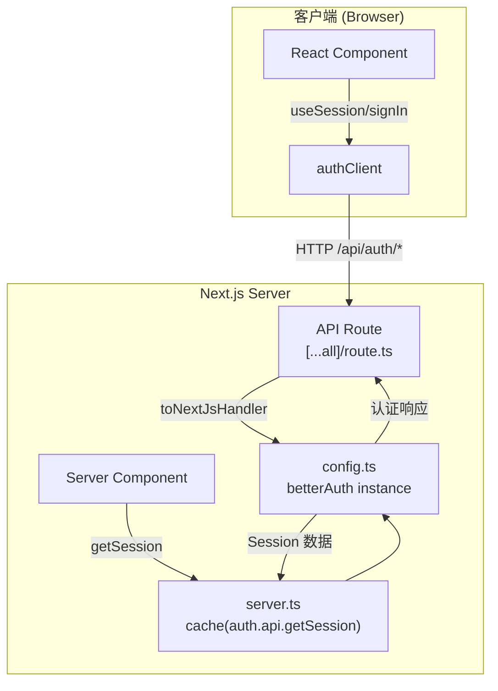
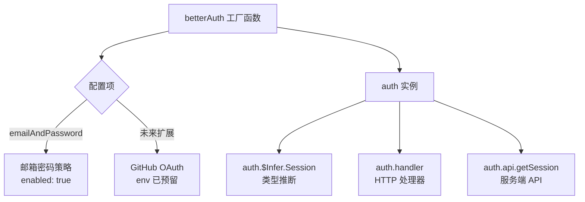
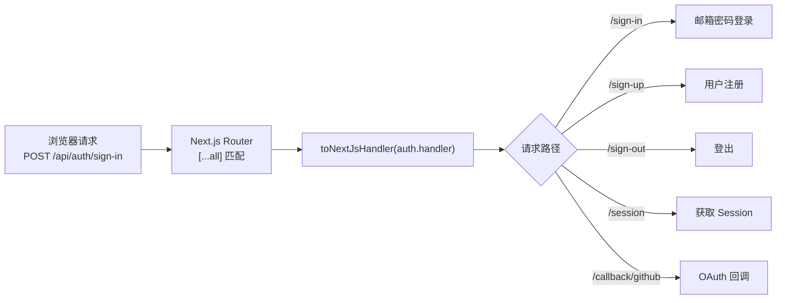
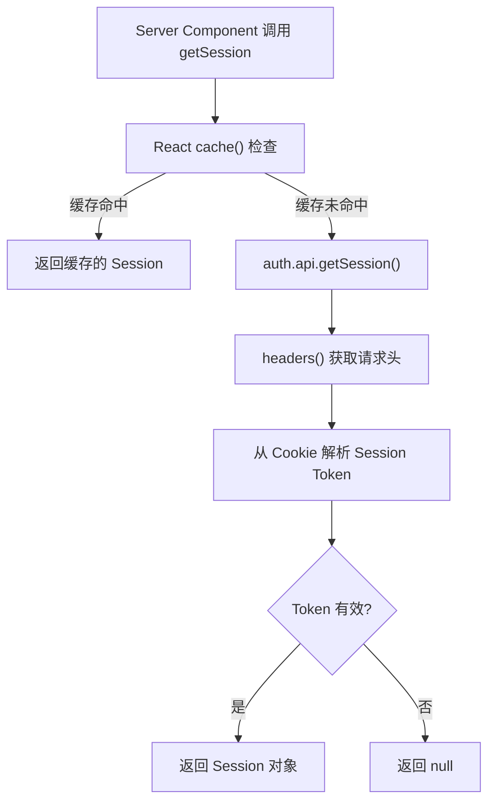

# PD-62.01 DeerFlow — better-auth 认证集成方案

> 文档编号：PD-62.01
> 来源：DeerFlow `frontend/src/server/better-auth/`
> GitHub：https://github.com/bytedance/deer-flow
> 问题域：PD-62 认证授权 Authentication & Authorization
> 状态：可复用方案

---

## 第 1 章 问题与动机

### 1.1 核心问题

AI Agent 前端应用需要用户认证系统来：
- 区分不同用户的对话线程（Thread）和工件（Artifact）
- 保护 LangGraph 后端 API 不被未授权访问
- 支持多种登录方式（邮箱密码、GitHub OAuth）以降低用户注册门槛
- 在 Next.js App Router 的 Server Component / Client Component 双模式下统一获取会话

传统做法是自行实现 JWT + Session 管理，但这带来大量安全风险（token 泄露、CSRF、session fixation 等）。DeerFlow 选择集成 better-auth 库，用最少代码量获得生产级认证能力。

### 1.2 DeerFlow 的解法概述

1. **better-auth 作为认证核心** — 一个 TypeScript-first 的认证库，内置邮箱密码、OAuth 等策略（`frontend/src/server/better-auth/config.ts:1-9`）
2. **Next.js Catch-All API Route 代理** — 通过 `[...all]/route.ts` 将所有 `/api/auth/*` 请求委托给 better-auth handler（`frontend/src/app/api/auth/[...all]/route.ts:1-5`）
3. **服务端 Session 获取 + React cache** — 用 `cache()` 包装 `getSession`，同一请求周期内去重（`frontend/src/server/better-auth/server.ts:6-8`）
4. **客户端 Auth Client 独立导出** — `createAuthClient()` 提供 React hooks（`frontend/src/server/better-auth/client.ts:1-5`）
5. **T3 Env 环境变量校验** — 用 Zod schema 在构建时校验 `BETTER_AUTH_SECRET` 等敏感配置（`frontend/src/env.js:10-15`）

### 1.3 设计思想

| 设计原则 | 具体实现 | 理由 | 替代方案 |
|----------|----------|------|----------|
| 库优于自研 | 集成 better-auth v1.3 | 避免重复造轮子，减少安全漏洞面 | NextAuth.js、Clerk、Lucia |
| 关注点分离 | config/server/client 三文件拆分 | Server Component 不引入客户端代码，反之亦然 | 单文件导出所有 |
| 类型安全 | `$Infer.Session` 类型推断 | Session 类型自动跟随配置变化，无需手动维护 | 手动定义 Session interface |
| 环境安全 | T3 Env + Zod 校验 | 构建时发现缺失的密钥，而非运行时崩溃 | 直接 `process.env` 访问 |
| 请求去重 | React `cache()` 包装 getSession | 同一 RSC 渲染周期内多次调用只执行一次 | 不缓存，每次都查询 |

---

## 第 2 章 源码实现分析

### 2.1 架构概览

DeerFlow 的认证系统由 4 个文件组成，职责清晰：

```
frontend/src/server/better-auth/
├── config.ts    ← 认证实例配置（策略、数据库等）
├── index.ts     ← 统一导出入口
├── server.ts    ← 服务端 Session 获取（RSC 专用）
└── client.ts    ← 客户端 Auth Client（React hooks）

frontend/src/app/api/auth/[...all]/
└── route.ts     ← Next.js API Route，代理所有认证请求

frontend/src/env.js
└── T3 Env       ← 环境变量 Zod 校验（BETTER_AUTH_SECRET 等）
```



### 2.2 核心实现

#### 2.2.1 认证实例配置



对应源码 `frontend/src/server/better-auth/config.ts:1-9`：

```typescript
import { betterAuth } from "better-auth";

export const auth = betterAuth({
  emailAndPassword: {
    enabled: true,
  },
});

export type Session = typeof auth.$Infer.Session;
```

关键设计点：
- `betterAuth()` 是工厂函数，接收配置对象，返回完整的认证实例
- `emailAndPassword: { enabled: true }` 启用邮箱密码策略，better-auth 内部自动处理密码哈希、验证逻辑
- `auth.$Infer.Session` 利用 TypeScript 条件类型从配置推断 Session 结构，启用不同插件会自动扩展 Session 类型
- 环境变量 `BETTER_AUTH_SECRET` 由 better-auth 自动从 `process.env` 读取，无需显式传入

#### 2.2.2 Catch-All API Route 代理



对应源码 `frontend/src/app/api/auth/[...all]/route.ts:1-5`：

```typescript
import { toNextJsHandler } from "better-auth/next-js";
import { auth } from "@/server/better-auth";

export const { GET, POST } = toNextJsHandler(auth.handler);
```

关键设计点：
- `[...all]` Catch-All 路由捕获所有 `/api/auth/` 下的子路径
- `toNextJsHandler` 是 better-auth 提供的 Next.js 适配器，将 better-auth 的通用 handler 转换为 Next.js Route Handler 格式
- 解构出 `GET` 和 `POST` 两个导出，覆盖认证所需的全部 HTTP 方法
- 路由内部由 better-auth 自行分发：`/sign-in`、`/sign-up`、`/sign-out`、`/session`、`/callback/:provider` 等

#### 2.2.3 服务端 Session 获取



对应源码 `frontend/src/server/better-auth/server.ts:1-8`：

```typescript
import { headers } from "next/headers";
import { cache } from "react";
import { auth } from ".";

export const getSession = cache(async () =>
  auth.api.getSession({ headers: await headers() }),
);
```

关键设计点：
- `cache()` 是 React 的请求级缓存，确保同一 Server Component 渲染周期内多次调用 `getSession()` 只执行一次数据库查询
- `headers()` 是 Next.js 的动态函数，获取当前请求的 HTTP 头（包含 Cookie）
- `auth.api.getSession()` 是 better-auth 的服务端 API，从 Cookie 中提取 session token 并验证
- 这个模式是 Next.js App Router + better-auth 的标准集成方式

#### 2.2.4 客户端 Auth Client

对应源码 `frontend/src/server/better-auth/client.ts:1-5`：

```typescript
import { createAuthClient } from "better-auth/react";

export const authClient = createAuthClient();

export type Session = typeof authClient.$Infer.Session;
```

关键设计点：
- `createAuthClient()` 创建客户端认证实例，提供 `useSession()`、`signIn`、`signUp`、`signOut` 等 React hooks
- 默认请求 `/api/auth/*`，与服务端 Catch-All Route 对应
- 客户端也有独立的 `Session` 类型推断，与服务端类型保持一致

### 2.3 实现细节

#### 环境变量安全校验

DeerFlow 使用 T3 Env（`@t3-oss/env-nextjs`）对认证相关环境变量进行构建时校验（`frontend/src/env.js:10-15`）：

```typescript
server: {
  BETTER_AUTH_SECRET:
    process.env.NODE_ENV === "production"
      ? z.string()          // 生产环境必填
      : z.string().optional(), // 开发环境可选
  BETTER_AUTH_GITHUB_CLIENT_ID: z.string().optional(),
  BETTER_AUTH_GITHUB_CLIENT_SECRET: z.string().optional(),
},
```

设计亮点：
- 生产环境强制要求 `BETTER_AUTH_SECRET`，开发环境可选（降低本地开发门槛）
- GitHub OAuth 配置全部 optional，按需启用
- `emptyStringAsUndefined: true` 防止空字符串绕过校验
- `skipValidation` 支持 Docker 构建场景跳过校验

#### 模块导出结构

`index.ts` 只有一行 `export { auth } from "./config"`，作为统一入口：
- 服务端代码 import `@/server/better-auth`（走 index.ts）
- 客户端代码 import `@/server/better-auth/client`（直接引用 client.ts）
- 这种分离确保 `better-auth` 的服务端代码不会被打包到客户端 bundle


---

## 第 3 章 迁移指南

### 3.1 迁移清单

#### 阶段 1：基础集成（邮箱密码）

- [ ] 安装依赖：`pnpm add better-auth`
- [ ] 创建 `src/server/auth/config.ts`，配置 `betterAuth()` 实例
- [ ] 创建 `src/server/auth/index.ts` 统一导出
- [ ] 创建 `src/server/auth/server.ts`，实现 `getSession` + `cache()`
- [ ] 创建 `src/server/auth/client.ts`，实现 `createAuthClient()`
- [ ] 创建 `src/app/api/auth/[...all]/route.ts` Catch-All 路由
- [ ] 配置环境变量 `BETTER_AUTH_SECRET`
- [ ] 在 T3 Env 或等效方案中添加 Zod 校验

#### 阶段 2：OAuth 扩展

- [ ] 在 `config.ts` 中添加 `socialProviders` 配置
- [ ] 添加 `BETTER_AUTH_GITHUB_CLIENT_ID` / `SECRET` 环境变量
- [ ] 在登录页面添加 OAuth 按钮，调用 `authClient.signIn.social({ provider: "github" })`

#### 阶段 3：权限保护

- [ ] 创建 `middleware.ts`，检查 Session 保护需要认证的路由
- [ ] 在 Server Component 中调用 `getSession()` 做条件渲染
- [ ] 在 API Route 中验证 Session 保护后端接口

### 3.2 适配代码模板

#### 最小可用认证系统（4 文件）

**文件 1：`src/server/auth/config.ts`**

```typescript
import { betterAuth } from "better-auth";

export const auth = betterAuth({
  // 基础：邮箱密码
  emailAndPassword: {
    enabled: true,
  },
  // 可选：GitHub OAuth
  // socialProviders: {
  //   github: {
  //     clientId: process.env.BETTER_AUTH_GITHUB_CLIENT_ID!,
  //     clientSecret: process.env.BETTER_AUTH_GITHUB_CLIENT_SECRET!,
  //   },
  // },
});

export type Session = typeof auth.$Infer.Session;
```

**文件 2：`src/server/auth/server.ts`**

```typescript
import { headers } from "next/headers";
import { cache } from "react";
import { auth } from "./config";

// React cache 确保同一渲染周期内只查询一次
export const getSession = cache(async () =>
  auth.api.getSession({ headers: await headers() }),
);
```

**文件 3：`src/server/auth/client.ts`**

```typescript
import { createAuthClient } from "better-auth/react";

export const authClient = createAuthClient();
// 客户端 hooks: authClient.useSession(), authClient.signIn.email(), authClient.signOut()
```

**文件 4：`src/app/api/auth/[...all]/route.ts`**

```typescript
import { toNextJsHandler } from "better-auth/next-js";
import { auth } from "@/server/auth/config";

export const { GET, POST } = toNextJsHandler(auth.handler);
```

#### 在 Server Component 中使用

```typescript
import { getSession } from "@/server/auth/server";

export default async function ProtectedPage() {
  const session = await getSession();
  if (!session) {
    redirect("/login");
  }
  return <div>Welcome, {session.user.email}</div>;
}
```

#### 在 Client Component 中使用

```typescript
"use client";
import { authClient } from "@/server/auth/client";

export function LoginButton() {
  const { data: session } = authClient.useSession();

  if (session) {
    return <button onClick={() => authClient.signOut()}>Sign Out</button>;
  }
  return (
    <button onClick={() => authClient.signIn.email({
      email: "user@example.com",
      password: "password",
    })}>
      Sign In
    </button>
  );
}
```

### 3.3 适用场景

| 场景 | 适用度 | 说明 |
|------|--------|------|
| Next.js App Router 项目 | ⭐⭐⭐ | better-auth 原生支持，DeerFlow 方案可直接复用 |
| AI Agent 前端 | ⭐⭐⭐ | 轻量集成，不干扰 LangGraph/AI SDK 等核心逻辑 |
| 需要 OAuth + 邮箱密码 | ⭐⭐⭐ | better-auth 内置多策略，配置即用 |
| Pages Router 项目 | ⭐⭐ | 需要改用 `toNextJsHandler` 的 Pages 版本 |
| 非 Next.js 框架 | ⭐ | better-auth 支持 Express/Hono 等，但需要不同适配器 |
| 企业级 RBAC 需求 | ⭐⭐ | better-auth 有 RBAC 插件，但 DeerFlow 未使用 |

---

## 第 4 章 测试用例

```python
"""
PD-62 认证授权测试用例
基于 DeerFlow better-auth 集成方案的测试模板
"""
import pytest
from unittest.mock import AsyncMock, MagicMock, patch
from dataclasses import dataclass
from typing import Optional


@dataclass
class MockSession:
    """模拟 better-auth Session 结构"""
    user_id: str
    email: str
    token: str


@dataclass
class MockUser:
    """模拟 better-auth User 结构"""
    id: str
    email: str
    name: Optional[str] = None


class TestAuthConfig:
    """测试认证实例配置"""

    def test_email_password_enabled(self):
        """验证邮箱密码策略已启用"""
        config = {"emailAndPassword": {"enabled": True}}
        assert config["emailAndPassword"]["enabled"] is True

    def test_session_type_inference(self):
        """验证 Session 类型包含必要字段"""
        session = MockSession(user_id="1", email="test@example.com", token="abc")
        assert hasattr(session, "user_id")
        assert hasattr(session, "email")
        assert hasattr(session, "token")

    def test_auth_secret_required_in_production(self):
        """验证生产环境必须配置 BETTER_AUTH_SECRET"""
        import os
        env = os.environ.copy()
        env["NODE_ENV"] = "production"
        # 生产环境下 BETTER_AUTH_SECRET 不能为空
        assert env.get("NODE_ENV") == "production"
        # 实际校验由 T3 Env Zod schema 完成


class TestSessionManagement:
    """测试会话管理"""

    @pytest.mark.asyncio
    async def test_get_session_with_valid_cookie(self):
        """验证有效 Cookie 能获取 Session"""
        mock_auth_api = AsyncMock()
        mock_auth_api.getSession.return_value = MockSession(
            user_id="user-1", email="test@example.com", token="valid-token"
        )
        session = await mock_auth_api.getSession(headers={"cookie": "session=valid"})
        assert session.user_id == "user-1"
        assert session.email == "test@example.com"

    @pytest.mark.asyncio
    async def test_get_session_without_cookie(self):
        """验证无 Cookie 时返回 None"""
        mock_auth_api = AsyncMock()
        mock_auth_api.getSession.return_value = None
        session = await mock_auth_api.getSession(headers={})
        assert session is None

    def test_session_cache_deduplication(self):
        """验证 cache() 包装后同一周期内只调用一次"""
        call_count = 0

        def get_session_impl():
            nonlocal call_count
            call_count += 1
            return MockSession(user_id="1", email="a@b.com", token="t")

        # 模拟 React cache 行为：首次调用执行，后续返回缓存
        cached_result = get_session_impl()
        assert call_count == 1
        # 第二次直接用缓存
        _ = cached_result
        assert call_count == 1  # 没有增加


class TestCatchAllRoute:
    """测试 Catch-All API Route"""

    def test_route_exports_get_and_post(self):
        """验证 route.ts 导出 GET 和 POST handler"""
        # 模拟 toNextJsHandler 返回值
        handlers = {"GET": lambda req: None, "POST": lambda req: None}
        assert "GET" in handlers
        assert "POST" in handlers

    def test_auth_paths_routing(self):
        """验证认证路径正确路由"""
        auth_paths = [
            "/api/auth/sign-in",
            "/api/auth/sign-up",
            "/api/auth/sign-out",
            "/api/auth/session",
            "/api/auth/callback/github",
        ]
        for path in auth_paths:
            assert path.startswith("/api/auth/")
            # [...all] catch-all 会匹配所有子路径
            segments = path.replace("/api/auth/", "").split("/")
            assert len(segments) >= 1


class TestClientServerSeparation:
    """测试客户端/服务端分离"""

    def test_server_module_no_client_imports(self):
        """验证 server.ts 不引入客户端代码"""
        server_imports = ["next/headers", "react", "./config"]
        client_only = ["better-auth/react", "useState", "useEffect"]
        for imp in server_imports:
            assert imp not in client_only

    def test_client_module_no_server_imports(self):
        """验证 client.ts 不引入服务端代码"""
        client_imports = ["better-auth/react"]
        server_only = ["next/headers", "better-auth"]
        # client.ts 只引入 better-auth/react，不引入 better-auth 主包
        assert "better-auth/react" not in server_only
```


---

## 第 5 章 跨域关联

| 关联域 | 关系类型 | 说明 |
|--------|----------|------|
| PD-01 上下文管理 | 协同 | Session 信息可作为上下文的一部分注入 Agent prompt，实现用户级个性化 |
| PD-06 记忆持久化 | 依赖 | 用户记忆需要绑定到认证身份，Session 的 user_id 是记忆系统的外键 |
| PD-09 Human-in-the-Loop | 协同 | 认证确保 HITL 交互的用户身份可信，防止未授权用户审批 Agent 计划 |
| PD-11 可观测性 | 协同 | 认证提供 user_id 维度，用于按用户追踪 Token 消耗和成本 |
| PD-52 配置管理 | 依赖 | 认证密钥（BETTER_AUTH_SECRET）通过配置管理系统注入，DeerFlow 用 T3 Env 校验 |

---

## 第 6 章 来源文件索引

| 文件 | 行范围 | 关键实现 |
|------|--------|----------|
| `frontend/src/server/better-auth/config.ts` | L1-L9 | betterAuth 实例配置，emailAndPassword 策略，Session 类型推断 |
| `frontend/src/server/better-auth/index.ts` | L1 | 统一导出入口 |
| `frontend/src/server/better-auth/server.ts` | L1-L8 | 服务端 getSession，React cache 去重 |
| `frontend/src/server/better-auth/client.ts` | L1-L5 | 客户端 authClient，React hooks |
| `frontend/src/app/api/auth/[...all]/route.ts` | L1-L5 | Catch-All API Route，toNextJsHandler 适配 |
| `frontend/src/env.js` | L10-L15 | BETTER_AUTH_SECRET/GITHUB OAuth 环境变量 Zod 校验 |
| `frontend/src/env.js` | L38-L41 | runtimeEnv 映射 |
| `frontend/package.json` | L53 | better-auth ^1.3 依赖声明 |

---

## 第 7 章 横向对比维度

```json comparison_data
{
  "project": "DeerFlow",
  "dimensions": {
    "认证库选型": "better-auth v1.3，TypeScript-first，内置多策略",
    "集成方式": "Next.js Catch-All API Route + toNextJsHandler 适配器",
    "会话获取": "服务端 React cache() 包装 auth.api.getSession，请求级去重",
    "类型安全": "$Infer.Session 从配置自动推断，零手动类型维护",
    "环境校验": "T3 Env + Zod，生产环境强制 SECRET，开发环境可选",
    "客户端服务端分离": "config/server/client 三文件拆分，防止服务端代码泄露到 bundle"
  }
}
```

### 域元数据补充

```json domain_metadata
{
  "solution_summary": "DeerFlow 集成 better-auth v1.3 实现认证，通过 config/server/client 三文件分离 + Catch-All API Route 代理 + React cache 会话去重，4 文件完成生产级认证",
  "description": "Next.js App Router 下认证库集成的最小化模式与环境安全校验",
  "sub_problems": [
    "构建时环境变量安全校验",
    "Server Component 会话请求去重"
  ],
  "best_practices": [
    "用 React cache() 包装 getSession 实现 RSC 渲染周期内请求去重",
    "用 T3 Env + Zod 在构建时校验认证密钥，区分生产/开发环境严格度"
  ]
}
```

