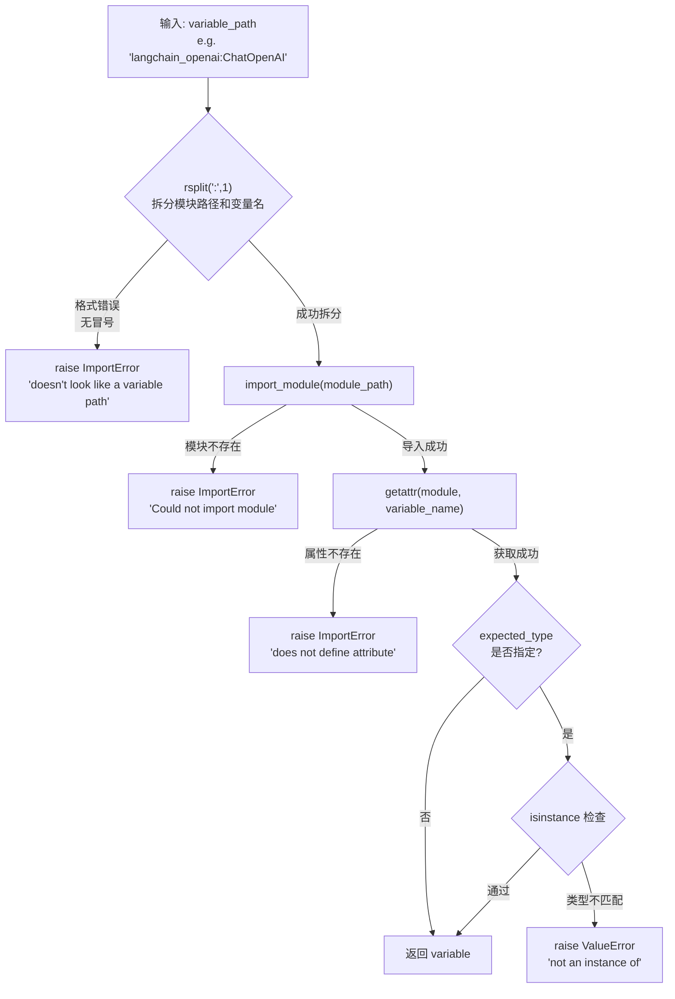
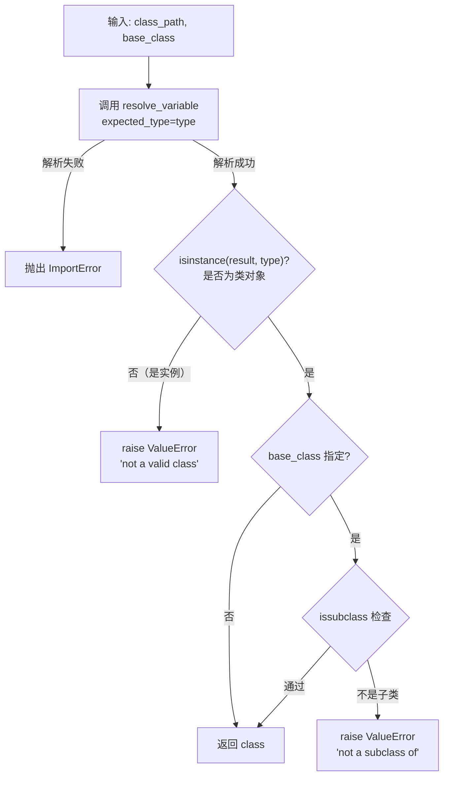
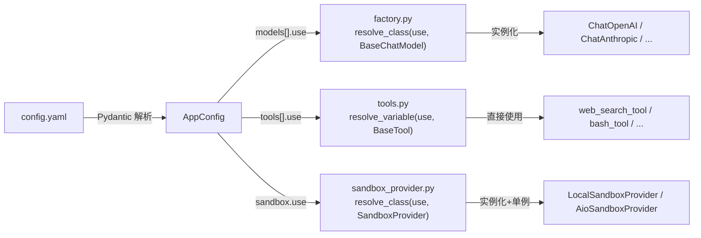

# PD-63.01 DeerFlow — 反射式模块加载方案

> 文档编号：PD-63.01
> 来源：DeerFlow `backend/src/reflection/resolvers.py`
> GitHub：https://github.com/bytedance/deer-flow
> 问题域：PD-63 反射式模块加载 Reflection & Dynamic Module Loading
> 状态：可复用方案

---

## 第 1 章 问题与动机

### 1.1 核心问题

Agent 框架需要支持多种 LLM 提供商（OpenAI、Anthropic、DeepSeek 等）、多种工具实现（搜索、文件操作、沙箱执行等）、多种沙箱提供者（本地、Docker、K8s Pod）。如果在代码中硬编码这些依赖，每新增一个提供商就要改代码、重新部署。

核心矛盾：**框架代码需要稳定，但可插拔组件需要灵活**。

传统做法是用 if-else 或 switch-case 分发，但这违反开闭原则——每次扩展都要修改核心代码。更好的方式是通过配置文件声明组件的类路径，运行时动态加载。

### 1.2 DeerFlow 的解法概述

DeerFlow 设计了一个极简但完备的反射式加载系统：

1. **统一路径格式** — 所有可插拔组件用 `module.path:ClassName` 格式声明（`config.example.yaml:19`）
2. **两层解析器** — `resolve_variable` 解析任意变量，`resolve_class` 在其上增加类型和基类校验（`resolvers.py:7-71`）
3. **配置驱动** — YAML 配置的 `use` 字段统一承载类路径，Pydantic 模型验证配置合法性（`model_config.py:10-13`）
4. **三处消费点** — 模型工厂、工具加载器、沙箱提供者，全部通过同一套解析器加载（`factory.py:24`、`tools.py:43`、`sandbox_provider.py:54`）
5. **类型安全** — 加载后立即做 `isinstance` / `issubclass` 校验，把运行时错误提前到加载阶段

### 1.3 设计思想

| 设计原则 | 具体实现 | 理由 | 替代方案 |
|----------|----------|------|----------|
| 配置即代码 | YAML `use` 字段声明类路径 | 新增提供商只改配置，不改代码 | 环境变量、数据库存储 |
| 两层校验 | resolve_variable 做类型检查，resolve_class 加基类检查 | 分层职责，变量和类有不同校验需求 | 单一函数 + flag 参数 |
| 冒号分隔符 | `module.path:ClassName` 而非 `.` 全路径 | 明确区分模块路径和属性名，避免歧义 | 点分隔（如 Java 的全限定名） |
| 快速失败 | 三层 try-except 分别捕获路径格式、模块导入、属性查找错误 | 精确定位问题来源，降低调试成本 | 统一 catch 所有异常 |
| 泛型类型推断 | Python 3.12 `def resolve_variable[T]` 语法 | 调用方获得正确的类型提示 | TypeVar + overload |

---

## 第 2 章 源码实现分析

### 2.1 架构概览

DeerFlow 的反射式加载系统由三层组成：

```
┌─────────────────────────────────────────────────────────┐
│                    config.yaml                          │
│  models[].use / tools[].use / sandbox.use               │
│  "langchain_openai:ChatOpenAI"                          │
└──────────────────────┬──────────────────────────────────┘
                       │ Pydantic 验证
                       ▼
┌─────────────────────────────────────────────────────────┐
│              Config Models (Pydantic)                    │
│  ModelConfig.use / ToolConfig.use / SandboxConfig.use   │
└──────────────────────┬──────────────────────────────────┘
                       │ 运行时解析
                       ▼
┌─────────────────────────────────────────────────────────┐
│            reflection/resolvers.py                       │
│  ┌─────────────────┐    ┌──────────────────┐            │
│  │ resolve_variable │───→│  resolve_class   │            │
│  │ (变量/实例解析)  │    │ (类解析+基类校验) │            │
│  └────────┬────────┘    └────────┬─────────┘            │
│           │ importlib.import_module + getattr            │
│           ▼                      ▼                       │
│  ┌─────────────┐  ┌──────────────┐  ┌────────────────┐  │
│  │ tools.py    │  │ factory.py   │  │sandbox_provider│  │
│  │ BaseTool    │  │ BaseChatModel│  │SandboxProvider │  │
│  └─────────────┘  └──────────────┘  └────────────────┘  │
└─────────────────────────────────────────────────────────┘
```

### 2.2 核心实现

#### 2.2.1 resolve_variable — 变量级解析器



对应源码 `backend/src/reflection/resolvers.py:7-46`：

```python
def resolve_variable[T](
    variable_path: str,
    expected_type: type[T] | tuple[type, ...] | None = None,
) -> T:
    try:
        module_path, variable_name = variable_path.rsplit(":", 1)
    except ValueError as err:
        raise ImportError(
            f"{variable_path} doesn't look like a variable path. "
            f"Example: parent_package_name.sub_package_name.module_name:variable_name"
        ) from err

    try:
        module = import_module(module_path)
    except ImportError as err:
        raise ImportError(f"Could not import module {module_path}") from err

    try:
        variable = getattr(module, variable_name)
    except AttributeError as err:
        raise ImportError(
            f"Module {module_path} does not define a {variable_name} attribute/class"
        ) from err

    # Type validation
    if expected_type is not None:
        if not isinstance(variable, expected_type):
            type_name = (
                expected_type.__name__
                if isinstance(expected_type, type)
                else " or ".join(t.__name__ for t in expected_type)
            )
            raise ValueError(
                f"{variable_path} is not an instance of {type_name}, "
                f"got {type(variable).__name__}"
            )
    return variable
```

关键设计点：
- **三层 try-except**（`resolvers.py:25-38`）：路径格式、模块导入、属性查找分别捕获，错误信息精确到具体失败环节
- **异常链保留**（`from err`）：保留原始异常栈，方便调试
- **Python 3.12 泛型语法**（`resolvers.py:7`）：`def resolve_variable[T]` 让调用方获得正确类型推断
- **联合类型支持**（`resolvers.py:9`）：`expected_type` 支持单类型和元组，兼容 `isinstance` 的多类型检查

#### 2.2.2 resolve_class — 类级解析器（组合模式）



对应源码 `backend/src/reflection/resolvers.py:49-71`：

```python
def resolve_class[T](class_path: str, base_class: type[T] | None = None) -> type[T]:
    model_class = resolve_variable(class_path, expected_type=type)

    if not isinstance(model_class, type):
        raise ValueError(f"{class_path} is not a valid class")

    if base_class is not None and not issubclass(model_class, base_class):
        raise ValueError(
            f"{class_path} is not a subclass of {base_class.__name__}"
        )
    return model_class
```

关键设计点：
- **组合而非重复**（`resolvers.py:63`）：`resolve_class` 复用 `resolve_variable`，传入 `expected_type=type` 确保解析出的是类对象
- **双重校验**：先 `isinstance(result, type)` 确认是类，再 `issubclass` 确认继承关系
- **泛型传递**：`base_class: type[T]` 的泛型参数传递到返回值 `type[T]`，调用方得到精确类型

### 2.3 实现细节 — 三个消费点

#### 消费点 1：模型工厂

`backend/src/models/factory.py:24` 通过 `resolve_class` 加载 LLM 提供商类：

```python
model_class = resolve_class(model_config.use, BaseChatModel)
model_instance = model_class(**kwargs, **model_settings_from_config)
```

配置示例（`config.example.yaml:19`）：
```yaml
models:
  - name: gpt-4
    use: langchain_openai:ChatOpenAI  # 反射加载点
    model: gpt-4
```

这里 `BaseChatModel` 作为基类约束，确保加载的类一定是 LangChain 兼容的聊天模型。

#### 消费点 2：工具加载器

`backend/src/tools/tools.py:43` 通过 `resolve_variable` 加载工具实例：

```python
loaded_tools = [
    resolve_variable(tool.use, BaseTool)
    for tool in config.tools
    if groups is None or tool.group in groups
]
```

注意这里用的是 `resolve_variable` 而非 `resolve_class`——因为工具在模块级别已经实例化好了（如 `src.sandbox.tools:bash_tool` 是一个 `BaseTool` 实例），不需要再 `cls()` 构造。

#### 消费点 3：沙箱提供者

`backend/src/sandbox/sandbox_provider.py:54` 通过 `resolve_class` 加载沙箱提供者类：

```python
cls = resolve_class(config.sandbox.use, SandboxProvider)
_default_sandbox_provider = cls(**kwargs)
```

配合单例模式（`_default_sandbox_provider` 全局变量），确保整个应用生命周期只创建一个沙箱提供者实例。

#### 数据流总览




---

## 第 3 章 迁移指南

### 3.1 迁移清单

**阶段 1：核心解析器（1 个文件）**

- [ ] 创建 `reflection/resolvers.py`，实现 `resolve_variable` 和 `resolve_class`
- [ ] 确认 Python 版本 ≥ 3.12（使用了 `def func[T]` 泛型语法），或改用 `TypeVar`

**阶段 2：配置模型（2-3 个文件）**

- [ ] 在 Pydantic 配置模型中添加 `use: str` 字段
- [ ] 定义 `use` 字段的格式约束（`module.path:name`）
- [ ] 编写配置文件示例

**阶段 3：消费点接入（按需）**

- [ ] 模型工厂：`resolve_class(config.use, BaseModel)` + 实例化
- [ ] 工具加载：`resolve_variable(config.use, BaseTool)` 直接获取实例
- [ ] 其他插件点：按需选择 `resolve_variable` 或 `resolve_class`

**阶段 4：错误处理增强（可选）**

- [ ] 添加加载失败的降级策略（默认实现）
- [ ] 添加加载耗时监控（大型模块首次导入可能较慢）
- [ ] 添加已加载模块缓存（`importlib` 自带模块缓存，但可加应用层缓存）

### 3.2 适配代码模板

以下代码可直接复用，兼容 Python 3.10+（使用 TypeVar 替代 3.12 语法）：

```python
"""reflection/resolvers.py — 可移植的反射式模块加载器"""
from importlib import import_module
from typing import TypeVar, Union, Type, Optional, Tuple

T = TypeVar("T")


def resolve_variable(
    variable_path: str,
    expected_type: Optional[Union[Type[T], Tuple[Type, ...]]] = None,
) -> T:
    """从 'module.path:variable_name' 格式的路径解析变量。

    Args:
        variable_path: 变量路径，格式 "package.module:variable"
        expected_type: 可选的类型校验，支持单类型或类型元组

    Returns:
        解析到的变量

    Raises:
        ImportError: 路径格式错误、模块不存在、属性不存在
        ValueError: 类型校验失败
    """
    try:
        module_path, variable_name = variable_path.rsplit(":", 1)
    except ValueError as err:
        raise ImportError(
            f"{variable_path} 不是合法的变量路径。"
            f"格式: package.module:variable_name"
        ) from err

    try:
        module = import_module(module_path)
    except ImportError as err:
        raise ImportError(f"无法导入模块 {module_path}") from err

    try:
        variable = getattr(module, variable_name)
    except AttributeError as err:
        raise ImportError(
            f"模块 {module_path} 中不存在属性 {variable_name}"
        ) from err

    if expected_type is not None:
        if not isinstance(variable, expected_type):
            if isinstance(expected_type, type):
                type_name = expected_type.__name__
            else:
                type_name = " | ".join(t.__name__ for t in expected_type)
            raise ValueError(
                f"{variable_path} 不是 {type_name} 的实例，"
                f"实际类型: {type(variable).__name__}"
            )
    return variable


def resolve_class(
    class_path: str,
    base_class: Optional[Type[T]] = None,
) -> Type[T]:
    """从 'module.path:ClassName' 格式的路径解析类。

    Args:
        class_path: 类路径，格式 "package.module:ClassName"
        base_class: 可选的基类校验

    Returns:
        解析到的类

    Raises:
        ImportError: 路径格式错误、模块不存在、属性不存在
        ValueError: 不是类对象、不是指定基类的子类
    """
    cls = resolve_variable(class_path, expected_type=type)

    if not isinstance(cls, type):
        raise ValueError(f"{class_path} 不是一个有效的类")

    if base_class is not None and not issubclass(cls, base_class):
        raise ValueError(
            f"{class_path} 不是 {base_class.__name__} 的子类"
        )
    return cls
```

### 3.3 适用场景

| 场景 | 适用度 | 说明 |
|------|--------|------|
| 多 LLM 提供商切换 | ⭐⭐⭐ | 最典型场景，配置文件切换 OpenAI/Anthropic/本地模型 |
| 工具插件系统 | ⭐⭐⭐ | 工具以模块级变量注册，配置文件声明启用哪些 |
| 沙箱/执行环境切换 | ⭐⭐⭐ | 本地开发用 LocalProvider，生产用 DockerProvider |
| 中间件管道 | ⭐⭐ | 可用于动态加载中间件，但管道顺序需额外管理 |
| 热更新插件 | ⭐ | `importlib` 有模块缓存，热更新需配合 `importlib.reload` |

---

## 第 4 章 测试用例

```python
"""tests/test_reflection_resolvers.py"""
import pytest
from unittest.mock import MagicMock
import sys
import types


# ---- 被测模块（直接复用第 3 章的适配代码） ----
from reflection.resolvers import resolve_variable, resolve_class


# ---- 测试辅助：动态创建模块 ----
def _register_fake_module(module_name: str, **attrs):
    """在 sys.modules 中注册一个假模块，用于测试。"""
    mod = types.ModuleType(module_name)
    for k, v in attrs.items():
        setattr(mod, k, v)
    sys.modules[module_name] = mod
    return mod


class FakeBase:
    pass

class FakeChild(FakeBase):
    pass

class FakeUnrelated:
    pass


# ---- resolve_variable 测试 ----
class TestResolveVariable:
    def setup_method(self):
        _register_fake_module(
            "fake_pkg.fake_mod",
            my_var=42,
            my_str="hello",
            MyClass=FakeChild,
            my_instance=FakeChild(),
        )

    def teardown_method(self):
        sys.modules.pop("fake_pkg.fake_mod", None)

    def test_resolve_simple_variable(self):
        result = resolve_variable("fake_pkg.fake_mod:my_var")
        assert result == 42

    def test_resolve_with_type_check_pass(self):
        result = resolve_variable("fake_pkg.fake_mod:my_var", expected_type=int)
        assert result == 42

    def test_resolve_with_type_check_fail(self):
        with pytest.raises(ValueError, match="不是 str 的实例"):
            resolve_variable("fake_pkg.fake_mod:my_var", expected_type=str)

    def test_resolve_with_tuple_type(self):
        result = resolve_variable(
            "fake_pkg.fake_mod:my_var", expected_type=(int, str)
        )
        assert result == 42

    def test_invalid_path_no_colon(self):
        with pytest.raises(ImportError, match="不是合法的变量路径"):
            resolve_variable("no_colon_here")

    def test_module_not_found(self):
        with pytest.raises(ImportError, match="无法导入模块"):
            resolve_variable("nonexistent.module:var")

    def test_attribute_not_found(self):
        with pytest.raises(ImportError, match="不存在属性"):
            resolve_variable("fake_pkg.fake_mod:nonexistent")


# ---- resolve_class 测试 ----
class TestResolveClass:
    def setup_method(self):
        _register_fake_module(
            "fake_pkg.classes",
            GoodChild=FakeChild,
            Unrelated=FakeUnrelated,
            not_a_class="i am a string",
        )

    def teardown_method(self):
        sys.modules.pop("fake_pkg.classes", None)

    def test_resolve_class_no_base(self):
        cls = resolve_class("fake_pkg.classes:GoodChild")
        assert cls is FakeChild

    def test_resolve_class_with_base_pass(self):
        cls = resolve_class("fake_pkg.classes:GoodChild", base_class=FakeBase)
        assert cls is FakeChild

    def test_resolve_class_with_base_fail(self):
        with pytest.raises(ValueError, match="不是 FakeBase 的子类"):
            resolve_class("fake_pkg.classes:Unrelated", base_class=FakeBase)

    def test_resolve_non_class_raises(self):
        with pytest.raises(ValueError):
            resolve_class("fake_pkg.classes:not_a_class")


# ---- 集成测试：真实模块 ----
class TestResolveRealModules:
    def test_resolve_builtin_list(self):
        cls = resolve_class("builtins:list")
        assert cls is list

    def test_resolve_os_path_join(self):
        func = resolve_variable("os.path:join")
        import os.path
        assert func is os.path.join

    def test_resolve_json_dumps(self):
        func = resolve_variable("json:dumps")
        import json
        assert func is json.dumps
```


---

## 第 5 章 跨域关联

| 关联域 | 关系类型 | 说明 |
|--------|----------|------|
| PD-04 工具系统 | 强依赖 | 工具加载器 `tools.py:43` 直接调用 `resolve_variable` 加载配置中声明的工具实例 |
| PD-05 沙箱隔离 | 强依赖 | 沙箱提供者 `sandbox_provider.py:54` 通过 `resolve_class` 动态加载 Local/Docker/K8s 沙箱实现 |
| PD-60 配置驱动架构 | 协同 | 反射加载是配置驱动的执行层——YAML 声明 `use` 路径，反射系统负责将路径变为运行时对象 |
| PD-49 多 LLM 提供商适配 | 协同 | 模型工厂 `factory.py:24` 通过反射加载不同 LLM 提供商的 ChatModel 类 |
| PD-52 配置管理 | 协同 | Pydantic 配置模型中的 `use` 字段是反射加载的入口，配置验证确保路径格式合法 |

---

## 第 6 章 来源文件索引

| 文件 | 行范围 | 关键实现 |
|------|--------|----------|
| `backend/src/reflection/resolvers.py` | L1-71 | 核心解析器：resolve_variable + resolve_class |
| `backend/src/reflection/__init__.py` | L1-3 | 模块导出 |
| `backend/src/models/factory.py` | L1-58 | 模型工厂：resolve_class(use, BaseChatModel) |
| `backend/src/tools/tools.py` | L1-84 | 工具加载器：resolve_variable(use, BaseTool) |
| `backend/src/sandbox/sandbox_provider.py` | L1-96 | 沙箱提供者：resolve_class(use, SandboxProvider) + 单例 |
| `backend/src/config/model_config.py` | L1-22 | ModelConfig.use 字段定义 |
| `backend/src/config/tool_config.py` | L1-21 | ToolConfig.use 字段定义 |
| `backend/src/config/sandbox_config.py` | L1-67 | SandboxConfig.use 字段定义 |
| `backend/src/config/app_config.py` | L1-207 | AppConfig 聚合所有配置 + 单例管理 |
| `config.example.yaml` | L1-284 | 配置示例：所有 use 字段的实际值 |

---

## 第 7 章 横向对比维度

> **重要：** 本章用于自动填充 Butcher Wiki 的横向对比表。
> 必须严格按以下 JSON 格式输出，放在 `comparison_data` 代码块中。

```json comparison_data
{
  "project": "DeerFlow",
  "dimensions": {
    "路径格式": "module.path:Name 冒号分隔，区分模块路径和属性名",
    "解析层次": "两层：resolve_variable（变量级）+ resolve_class（类级+基类校验）",
    "类型安全": "isinstance + issubclass 双重校验，泛型类型推断",
    "消费场景": "模型工厂、工具加载、沙箱提供者三处统一使用",
    "配置集成": "Pydantic BaseModel 的 use 字段，YAML 驱动",
    "错误处理": "三层 try-except 精确定位：路径格式/模块导入/属性查找"
  }
}
```

### 域元数据补充

```json domain_metadata
{
  "solution_summary": "DeerFlow 用 resolve_variable/resolve_class 两层解析器实现 module:name 格式的运行时动态加载，统一服务于模型工厂、工具注册和沙箱提供者三个插件点",
  "description": "配置驱动的运行时组件加载，将类路径声明与实例化解耦",
  "sub_problems": [
    "变量级与类级解析的职责分离",
    "泛型类型推断传递",
    "单例生命周期管理与反射加载的配合"
  ],
  "best_practices": [
    "resolve_variable 和 resolve_class 分层组合，变量用 isinstance 校验、类用 issubclass 校验",
    "三层 try-except 分别捕获路径格式、模块导入、属性查找错误，保留异常链"
  ]
}
```
